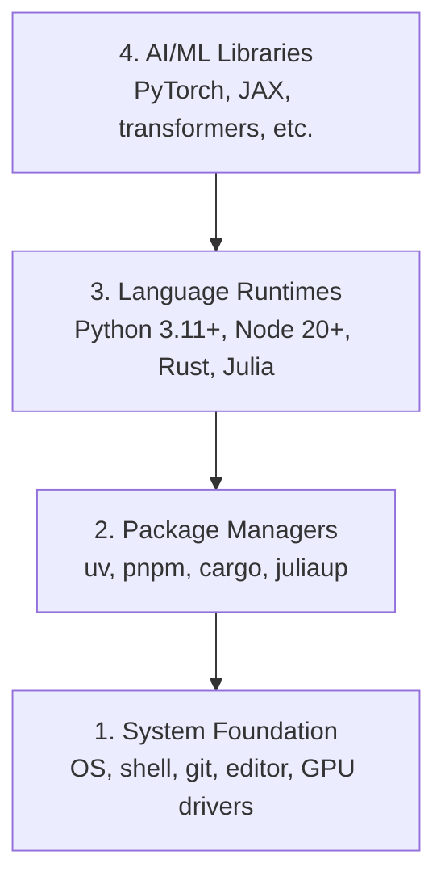

# 开发环境

> 工具决定了你的思维方式。请一次性将其配置妥当。

**类型：** 构建
**语言：** Python、Node.js、Rust
**前置要求：** 无
**所需时间：** 约45分钟

## 学习目标

- 从零开始搭建 Python 3.11+、Node.js 20+ 及 Rust 工具链
- 配置虚拟环境与包管理器，以实现可复现的构建过程
- 使用 CUDA/MPS 验证 GPU 访问权限，并运行测试张量运算
- 理解四层架构：系统层、包层、运行时层及 AI 库层

## 问题所在

你将通过200多节课学习使用 Python、TypeScript、Rust 和 Julia 进行 AI 工程开发。如果环境配置出错，每一节课都将变成与工具的斗争，而非真正的学习。

大多数人会跳过环境搭建步骤，结果却要花费数小时去调试导入错误、版本冲突以及缺失的 CUDA 驱动程序。我们将一次性把这件事做好。

## 概念说明

AI 工程开发环境由四层构成：



我们采用自下而上的方式进行安装。每一层都依赖于其下方的层。

## 开始构建

### 第一步：系统基础环境

检查您的系统并安装基本组件。

```bash
# macOS
xcode-select --install
brew install git curl wget

# Ubuntu/Debian
sudo apt update && sudo apt install -y build-essential git curl wget

# Windows (use WSL2)
wsl --install -d Ubuntu-24.04
```

### 第 2 步：使用 uv 的 Python

我们使用 `uv`——它的速度比 pip 快 10 到 100 倍，并且能够自动管理虚拟环境。

```bash
curl -LsSf https://astral.sh/uv/install.sh | sh

uv python install 3.12

uv venv
source .venv/bin/activate  # or .venv\Scripts\activate on Windows

uv pip install numpy matplotlib jupyter
```

验证：

```python
import sys
print(f"Python {sys.version}")

import numpy as np
print(f"NumPy {np.__version__}")
a = np.array([1, 2, 3])
print(f"Vector: {a}, dot product with itself: {np.dot(a, a)}")
```

### 第 3 步：使用 pnpm 的 Node.js

适用于 TypeScript 相关课程（智能体、MCP 服务器、Web 应用）。

```bash
curl -fsSL https://fnm.vercel.app/install | bash
fnm install 22
fnm use 22

npm install -g pnpm

node -e "console.log('Node', process.version)"
```

### 第 4 步：Rust

用于对性能要求极高的课程（推理、系统开发）。

```bash
curl --proto '=https' --tlsv1.2 -sSf https://sh.rustup.rs | sh

rustc --version
cargo --version
```

### 第 5 步：Julia（可选）

适用于需要大量数学计算的课程，Julia 在这方面表现优异。

```bash
curl -fsSL https://install.julialang.org | sh

julia -e 'println("Julia ", VERSION)'
```

### 第 6 步：GPU 设置（如有配备）

```bash
# NVIDIA
nvidia-smi

# Install PyTorch with CUDA
uv pip install torch torchvision torchaudio --index-url https://download.pytorch.org/whl/cu124
```

```python
import torch
print(f"CUDA available: {torch.cuda.is_available()}")
if torch.cuda.is_available():
    print(f"GPU: {torch.cuda.get_device_name(0)}")
```

没有 GPU？没问题。大多数课程都可以在 CPU 上运行。对于需要大量训练的计算任务，可使用 Google Colab 或云端的 GPU。

### 第 7 步：验证所有内容

运行验证脚本：

```bash
python phases/00-setup-and-tooling/01-dev-environment/code/verify.py
```

## 使用它

您的环境现已准备好用于本课程的所有章节。以下是各语言的适用场景及对应的包管理工具：

| 语言 | 适用阶段 | 包管理器 |
|------|---------|----------|
| Python | 第1-12阶段（机器学习、深度学习、自然语言处理、计算机视觉、音频处理、大语言模型） | uv |
| TypeScript | 第13-17阶段（工具开发、智能体、集群系统、基础设施） | pnpm |
| Rust | 第12、15-17阶段（对性能要求极高的系统） | cargo |
| Julia | 第1阶段（数学基础） | Pkg |

## 部署它

本章节会生成一个验证脚本，任何人都可以运行该脚本来检查自己的环境配置是否正确。

如需用于让 AI 助手诊断环境问题的提示语，请查看 `outputs/prompt-env-check.md` 文件。

## 练习题

1. 运行验证脚本并修复所有出现的错误。
2. 为本次课程创建一个 Python 虚拟环境，并安装 PyTorch。
3. 使用这四种语言分别编写“hello world”程序，并运行每个程序。
