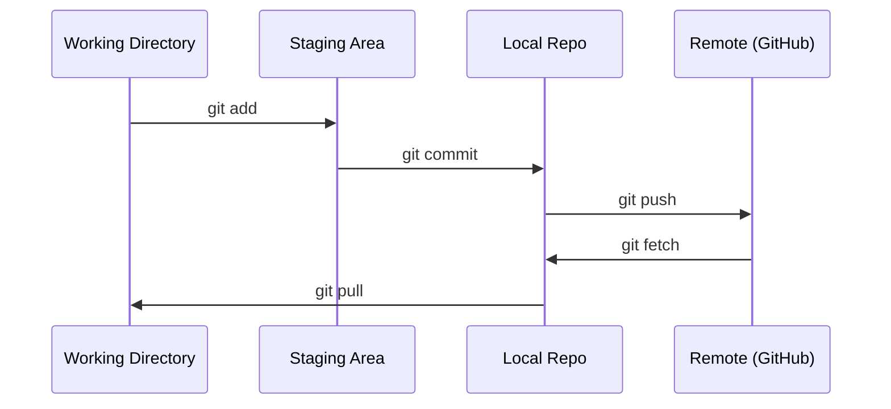

# Git与协作

> 版本控制并非可选。您在这里构建的每一个实验、每一个模型以及每一节课的内容都会被记录下来。

**类型：** 学习
**语言：--**
**先修要求：** 阶段0，课程01
**时长：** 约30分钟

## 学习目标

- 配置git身份信息，并掌握添加、提交和推送的日常工作流程
- 创建并合并分支以进行独立实验，同时避免影响主分支
- 编写`.gitignore`文件，排除模型检查点及大型二进制文件
- 使用`git log`查看提交历史，了解项目的演变过程

## 问题所在

您将在20个阶段中编写数百个代码文件。如果没有版本控制，您将会丢失工作成果，造成无法挽回的错误，并且无法与他人协作。

Git是实现这一目标的工具，而GitHub则是存放代码的平台。本课程仅涵盖完成学习任务所需的知识，不会涉及更多内容。

## 核心概念



需要记住的三点：
1. 经常进行提交（`git commit`）
2. 推送至远程仓库（`git push`）
3. 创建分支用于实验（`git checkout -b experiment`）

## 开始构建

### 第一步：配置 git

```bash
git config --global user.name "Your Name"
git config --global user.email "you@example.com"
```

### 第 2 步：日常工作流程

```bash
git status
git add file.py
git commit -m "Add perceptron implementation"
git push origin main
```

### 第 3 步：为实验创建分支

```bash
git checkout -b experiment/new-optimizer

# ... make changes, commit ...

git checkout main
git merge experiment/new-optimizer
```

### 第 4 步：使用本课程代码仓库

```bash
git clone https://github.com/rohitg00/ai-engineering-from-scratch.git
cd ai-engineering-from-scratch

git checkout -b my-progress
# work through lessons, commit your code
git push origin my-progress
```

## 使用方法

本课程仅需使用以下命令：

| 命令 | 用途 |
|---------|------|
| `git clone` | 下载课程代码仓库 |
| `git add` + `git commit` | 保存你的工作成果 |
| `git push` | 将更改上传至 GitHub |
| `git checkout -b` | 在不破坏主分支的情况下尝试新功能 |
| `git log --oneline` | 查看已完成的操作记录 |

仅此而已。本课程无需使用 rebase、cherry-pick 或 submodules 功能。

## 练习任务

1. 克隆该代码仓库，创建一个名为 `my-progress` 的分支，新建一个文件并提交后推送 |
2. 创建一个 `.gitignore` 文件，排除模型检查点文件（`.pt`、`.pth`、`.safetensors`） |
3. 使用 `git log --oneline` 查看该代码仓库的提交历史，了解课程内容是如何逐步添加的 |

## 关键术语

| 术语 | 常见说法 | 实际含义 |
|------|----------|----------|
| Commit | “保存” | 项目在某一时间点的完整快照 |
| Branch | “副本” | 指向某个提交的指针，会随着你的工作不断向前推进 |
| Merge | “合并代码” | 将一个分支的更改应用到另一个分支中 |
| Remote | “云端” | 存储在你所在位置之外的代码仓库副本（如 GitHub、GitLab） |
