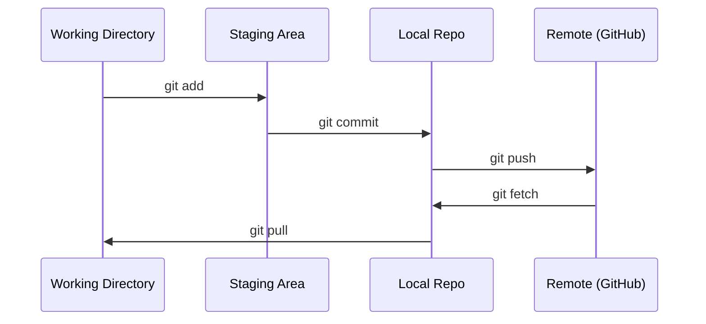

# Git与协作

> 版本控制不是可选的。你在这里构建的每个实验、每个模型、每节课都会被追踪。

**类型：**学习
**语言：**--
**先决条件：**阶段0，课程01
**时间：**约30分钟

## 学习目标

- 配置Git身份并使用添加、提交和推送的日常工作流程
- 创建并合并分支以隔离实验，而不破坏主分支
- 编写`.gitignore`文件，排除模型检查点和大型二进制文件
- 使用`git log`浏览提交历史，了解项目的演变

## 问题所在

你即将在20个阶段中编写数百个代码文件。没有版本控制，你将丢失工作，破坏无法撤销的内容，并且无法与他人协作。

Git是工具。GitHub是代码的存储地。本课程仅涵盖您所需的知识，不再其他内容。

## 概念



需记住的三件事：
1. 经常保存（`git commit`）
2. 推送到远程（`git push`）
3. 为实验创建分支（`git checkout -b experiment`）

## 构建它

### 步骤1：配置git

```bash
git config --global user.name "Your Name"
git config --global user.email "you@example.com"
```

### 第二步：日常工作流程

```bash
git status
git add file.py
git commit -m "Add perceptron implementation"
git push origin main
```

### 第三步：实验分支

```bash
git checkout -b experiment/new-optimizer

# ... make changes, commit ...

git checkout main
git merge experiment/new-optimizer
```

### Step 4: Working with this course repo

```bash
git clone https://github.com/rohitg00/ai-engineering-from-scratch.git
cd ai-engineering-from-scratch

git checkout -b my-progress
# work through lessons, commit your code
git push origin my-progress
```

## 使用它

对于本课程，你需要以下命令：

| 命令 | 使用时机 |
|-----|----------|
| `git clone` | 获取课程仓库 |
| `git add` + `git commit` | 保存你的工作 |
| `git push` | 将其备份到GitHub |
| `git checkout -b` | 在不破坏主分支的情况下尝试新功能 |
| `git log --oneline` | 查看你所做的操作 |

就这样。本课程不需要使用重新合并、提取分支或子模块。

## 练习

1. 克隆此仓库，创建一个名为`my-progress`的分支，创建一个文件，提交它，然后推送它
2. 创建一个`.gitignore`文件，排除模型检查点文件（`.pt`、`.pth`、`.safetensors`）
3. 使用`git log --oneline`查看此仓库的提交历史，了解课程是如何添加的

## 关键术语

| 术语 | 人们怎么说 | 实际含义 |
|------|------------|----------|
| 提交 | “保存” | 某一时间点上整个项目的快照 |
| 分支 | “副本” | 指向一个提交，当你工作时它会向前移动 |
| 合并 | “组合代码” | 将一个分支的更改应用到另一个分支上 |
| 远程仓库 | “云端” | 存储在其他地方（GitHub、GitLab）的仓库副本 |
