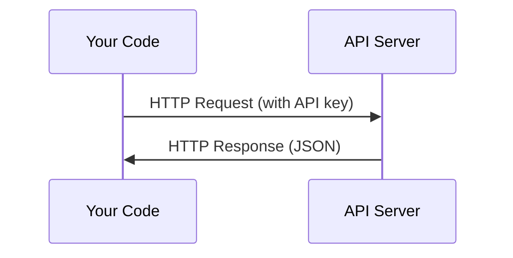

# API与密钥

> 所有的AI API运作方式都相同：发送请求，获取响应。具体细节可能不同，但基本模式不变。

**类型：** 构建
**语言：** Python、TypeScript
**前置要求：** 第0阶段、第01课
**耗时：** 约30分钟

## 学习目标

- 使用环境变量和`.env`文件安全地存储API密钥
- 使用Anthropic Python SDK以及原始HTTP方式调用LLM API
- 对比基于SDK与原始HTTP的请求/响应格式，以便调试
- 识别并处理常见的API错误，包括身份验证问题和速率限制问题

## 问题背景

从第11阶段开始，你将需要调用LLM API（如Anthropic、OpenAI、Google）。在13至16阶段，你还将构建需要在循环中使用这些API的智能体。因此，你需要了解API密钥的工作原理、如何安全存储它们，以及如何进行首次API调用。

## 核心概念



每次 API 调用都包含以下要素：
1. 接口地址（URL）
2. API 密钥（用于身份验证）
3. 请求体（需要发送的数据）
4. 响应体（返回的数据）

## 开始构建

### 第 1 步：安全存储 API 密钥

切勿将 API 密钥直接写在代码中，应使用环境变量来存储。

```bash
export ANTHROPIC_API_KEY="sk-ant-..."
export OPENAI_API_KEY="sk-..."
```

或者使用 `.env` 文件（请将其添加到 `.gitignore` 中）：

```
ANTHROPIC_API_KEY=sk-ant-...
OPENAI_API_KEY=sk-...
```

### 第 2 步：首次调用 API（Python）

```python
import anthropic

client = anthropic.Anthropic()

response = client.messages.create(
    model="claude-sonnet-4-20250514",
    max_tokens=256,
    messages=[{"role": "user", "content": "What is a neural network in one sentence?"}]
)

print(response.content[0].text)
```

### 第 3 步：首次调用 API（TypeScript）

```typescript
import Anthropic from "@anthropic-ai/sdk";

const client = new Anthropic();

const response = await client.messages.create({
  model: "claude-sonnet-4-20250514",
  max_tokens: 256,
  messages: [{ role: "user", content: "What is a neural network in one sentence?" }],
});

console.log(response.content[0].text);
```

### 第 4 步：原始 HTTP（不使用 SDK）

```python
import os
import urllib.request
import json

url = "https://api.anthropic.com/v1/messages"
headers = {
    "Content-Type": "application/json",
    "x-api-key": os.environ["ANTHROPIC_API_KEY"],
    "anthropic-version": "2023-06-01",
}
body = json.dumps({
    "model": "claude-sonnet-4-20250514",
    "max_tokens": 256,
    "messages": [{"role": "user", "content": "What is a neural network in one sentence?"}],
}).encode()

req = urllib.request.Request(url, data=body, headers=headers, method="POST")
with urllib.request.urlopen(req) as resp:
    result = json.loads(resp.read())
    print(result["content"][0]["text"])
```

这正是 SDK 在底层所执行的功能。了解原始的 HTTP 调用有助于调试问题。

## 使用方法

在本课程中：

| API | 使用场景 | 免费额度 |
|-----|----------|---------|
| Anthropic (Claude) | 第 11-16 阶段（智能体、工具） | 注册时赠送 $5 积分 |
| OpenAI | 第 11 阶段（对比使用） | 注册时赠送 $5 积分 |
| Hugging Face | 第 4-10 阶段（模型、数据集） | 免费使用 |

您目前无需全部使用这些 API。在课程需要时再进行配置即可。

## 发布成果

本课程将生成以下文件：
- `outputs/prompt-api-troubleshooter.md` - 用于诊断常见的 API 错误

## 练习任务

1. 获取一个 Anthropic API 密钥，并进行首次 API 调用
2. 尝试使用原始的 HTTP 版本，对比其响应格式与 SDK 版本的差异
3. 故意使用错误的 API 密钥，查看系统返回的错误信息

## 关键术语

| 术语 | 常见说法 | 实际含义 |
|------|----------|----------|
| API 密钥 | “API 的密码” | 用于标识您的账户并授权请求的唯一字符串 |
| 请求速率限制 | “他们正在限制我的请求频率” | 为防止滥用并确保公平使用而设定的每分钟/每小时最大请求次数 |
| Token | （在 API 场景中）“一个词” | 计费单位：输入 Token 和输出 Token 分别计数并单独计费 |
| 流式响应 | “实时响应” | 逐字获取响应内容，而非等待完整响应生成 |
