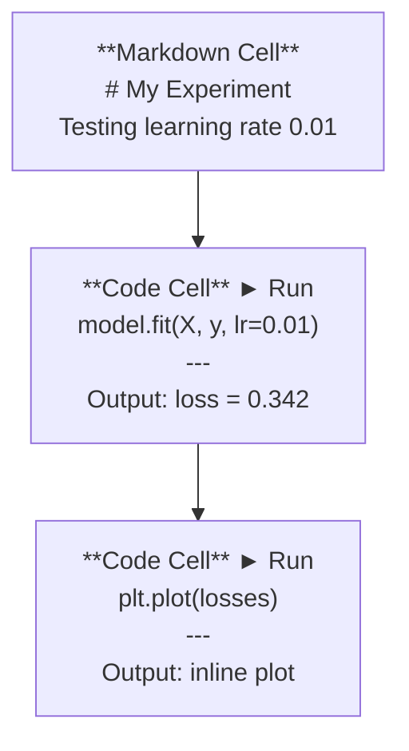
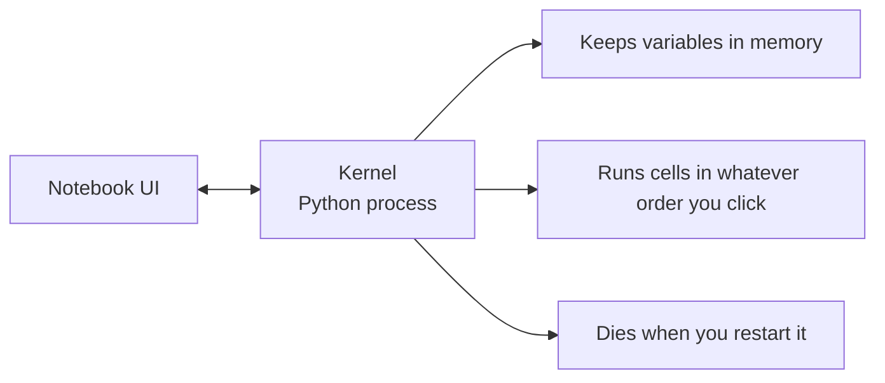

# Jupyter 笔记本

> Notebook 是人工智能工程领域的实验平台。您可以在其中构建原型，然后将可行的方案部署到生产环境。

**类型：** 构建
**语言：** Python
**前置要求：** 阶段 0，课程 01
**耗时：** 约 30 分钟

## 学习目标

- 安装并启动 JupyterLab、Jupyter Notebook，或安装了 Jupyter 扩展的 VS Code  
- 使用魔术命令（`%timeit`、`%%time`、`%matplotlib inline`）进行性能基准测试并进行内联可视化  
- 明确何时使用笔记本格式，何时使用脚本格式，并遵循“在笔记本中探索数据，在脚本中交付代码”的工作流程  
- 识别并避免常见的笔记本使用陷阱：执行顺序混乱、隐藏状态以及内存泄漏

## 问题所在

每篇人工智能论文、教程以及 Kaggle 竞赛都使用 Jupyter 笔记本。它们允许你分步运行代码，即时查看输出结果，将代码与解释混合在一起，并实现快速迭代。如果试图在不使用笔记本的情况下学习人工智能，就如同做数学作业时没有草稿纸一样。

不过，笔记本也存在一些真正的陷阱。人们会将其用于各种场景，甚至包括那些他们并不擅长的任务。掌握何时该使用笔记本、何时该使用脚本，能帮助你避免日后陷入繁琐的调试困境。

## 概念概述

笔记本是由多个单元格组成的列表。每个单元格要么包含代码，要么包含文本。



内核是一个在后台运行的 Python 进程。当您运行一个单元格时，系统会将代码发送给该内核，内核执行代码后返回结果。所有单元格共享同一个内核，因此变量会在不同单元格之间保持持久性。



“无论按什么顺序点击”这一点既是它的优势，也是它的缺陷。

## 构建它

### 步骤 1：选择您的接口

三种选项，同一格式：

| 接口 | 安装方式 | 最适合的场景 |
|-----------|---------|----------|
| JupyterLab | 先执行 `pip install jupyterlab`，再运行 `jupyter lab` | 提供完整的 IDE 体验，支持多标签页、文件浏览器及终端功能 |
| Jupyter Notebook | 先执行 `pip install notebook`，再运行 `jupyter notebook` | 简单轻量，一次仅处理一个笔记本文件 |
| VS Code | 安装 “Jupyter” 扩展 | 已集成在编辑器中，支持 git 集成及调试功能 |

这三种工具均可读取和写入相同的 `.ipynb` 文件。可根据个人喜好选择。在人工智能领域，JupyterLab 是最常用的工具。

```bash
pip install jupyterlab
jupyter lab
```

### 步骤 2：重要的键盘快捷键

您可以在两种模式下操作。按 `Escape` 键进入命令模式（左侧显示蓝色栏），按 `Enter` 键进入编辑模式（左侧显示绿色栏）。

**命令模式（使用频率最高）：**

| 键 | 操作 |
|-----|------|
| `Shift+Enter` | 运行单元格并跳至下一行 |
| `A` | 在上方插入单元格 |
| `B` | 在下方插入单元格 |
| `DD` | 删除单元格 |
| `M` | 转换为 Markdown 格式 |
| `Y` | 转换为代码格式 |
| `Z` | 撤销单元格操作 |
| `Ctrl+Shift+H` | 显示所有快捷键 |

**编辑模式：**

| 键 | 操作 |
|-----|------|
| `Tab` | 自动补全 |
| `Shift+Tab` | 显示函数签名 |
| `Ctrl+/` | 切换注释状态 |

`Shift+Enter` 是您每天会使用上千次的快捷键，请优先掌握它。

### 步骤 3：单元格类型

**代码单元格**用于运行 Python 代码并显示输出结果：

```python
import numpy as np
data = np.random.randn(1000)
data.mean(), data.std()
```

输出：`(0.0032, 0.9987)`

### 步骤 4：魔法命令

这些并非 Python 语句。它们是专为 Jupyter 设计的命令，以 `%`（行级魔术指令）或 `%%`（单元格级魔术指令）开头。

**为代码添加计时功能：**

```python
%timeit np.random.randn(10000)
```

输出：`每轮循环为 45.2 us，误差范围为 ±1.3 us`

```python
%%time
model.fit(X_train, y_train, epochs=10)
```

输出：`实际耗时：2.34 秒`

`%timeit` 会多次运行代码并计算平均值，而 `%%time` 只运行一次。对于微基准测试请使用 `%timeit`，用于训练过程时则使用 `%%time`。

**启用内联图表：**

```python
%matplotlib inline
```

现在，每一个 `plt.plot()` 或 `plt.show()` 调用都会直接在笔记本中渲染结果。

**无需离开笔记本即可安装软件包：**

```python
!pip install scikit-learn
```

前缀 `!` 用于执行任意 Shell 命令。

**检查环境变量：**

```python
%env CUDA_VISIBLE_DEVICES
```

### 步骤 5：在行内显示富格式输出

笔记本会自动显示单元格中的最后一个表达式。但您也可以对其进行控制：

```python
import pandas as pd

df = pd.DataFrame({
    "model": ["Linear", "Random Forest", "Neural Net"],
    "accuracy": [0.72, 0.89, 0.94],
    "training_time": [0.1, 2.3, 45.6]
})
df
```

这将渲染为格式化的 HTML 表格，而非文本输出。图表也是如此：

```python
import matplotlib.pyplot as plt

plt.figure(figsize=(8, 4))
plt.plot([1, 2, 3, 4], [1, 4, 2, 3])
plt.title("Inline Plot")
plt.show()
```

图表会显示在单元格的正下方。这也是笔记本在人工智能工作中占据主导地位的原因——你可以同时看到数据、图表以及代码。  

对于图像：

```python
from IPython.display import Image, display
display(Image(filename="architecture.png"))
```

### 步骤 6：Google Colab

Colab 是一种免费的云端 Jupyter 笔记本工具。它提供 GPU、预装好的库以及与 Google Drive 的集成功能，无需任何额外设置。

1. 访问 [colab.research.google.com](https://colab.research.google.com)
2. 上传本课程中的任意 `.ipynb` 文件
3. 进入“运行时间” > “更改运行类型” > 选择 T4 GPU（免费版）

Colab 与本地 Jupyter 的区别：
- 文件在会话之间不会自动保留（需保存到 Drive 或下载）
- 预装库包括：numpy、pandas、matplotlib、torch、tensorflow、sklearn
- 使用 `from google.colab import files` 进行文件的上传和下载
- 使用 `from google.colab import drive; drive.mount('/content/drive')` 实现持久化存储
- 免费版在 90 分钟无操作后会超时

## 使用它

### 笔记本与脚本：何时使用哪种

| 适合使用笔记本的场景 | 适合使用脚本的场景 |
|-------------------|-----------------|
| 探索数据集 | 训练流水线 |
| 模型原型设计 | 可复用的工具函数 |
| 可视化结果 | 包含 `if __name__` 的代码 |
| 解释工作过程 | 定时运行的代码 |
| 快速实验 | 生产环境代码 |
| 课程练习 | 包与库 |

原则：**在笔记本中探索，用脚本进行部署**。

AI 开发中的常见工作流程：
1. 在笔记本中探索数据
2. 在笔记本中完成模型原型设计
3. 模型验证通过后，将代码移至 `.py` 文件中
4. 将这些 `.py` 文件重新导入到笔记本中以进行进一步实验

### 常见陷阱

**乱序执行。** 您先运行单元格5，再运行单元格2，最后运行单元格7。在您的机器上笔记本可以正常工作，但若他人按从上到下的顺序运行则会出错。解决方法：在共享之前选择“Kernel” > “Restart & Run All”。

**隐藏状态。** 您删除了一个单元格，但它创建的变量仍保留在内存中。虽然笔记本看起来整洁，但实际上依赖于这个“幽灵单元格”。解决方法：定期重启内核。

**内存泄漏。** 先加载一个4GB的数据集，训练模型，然后再加载另一个数据集。相关内存始终未被释放。解决方法：使用 `del variable_name` 和 `gc.collect()`，或直接重启内核。

## 发布它

本课程将生成以下内容：
- 用于调试笔记本问题的 `outputs/prompt-notebook-helper.md` 文件

## 练习题

1. 打开 JupyterLab，创建一个笔记本，使用 `%timeit` 命令对比列表推导式与 NumPy 在生成 100,000 个随机数数组时的性能。  
2. 创建一个同时包含 Markdown 单元格和代码单元格的笔记本，该笔记本需加载 CSV 文件、显示数据框并绘制图表。随后运行“Kernel > Restart & Run All”以验证从上到下的执行流程是否正常。  
3. 将 `code/notebook_tips.py` 中的代码复制到 Colab 笔记本中，并利用免费的 GPU 运行该代码。

## 关键术语

| 术语 | 人们常说的说法 | 实际含义 |
|------|----------------|----------|
| Kernel | “运行我代码的那个东西” | 一个独立的 Python 进程，用于执行单元格并将变量保存在内存中 |
| Cell | “代码块” | 笔记本中的一个独立可运行单元，可以是代码形式或 Markdown 形式 |
| Magic command | “Jupyter 的技巧” | 以 `%` 或 `%%` 开头的特殊命令，用于控制笔记本环境 |
| `.ipynb` | “笔记本文件” | 一种 JSON 文件，包含单元格、输出结果及元数据。即 IPython Notebook 的缩写 |

## 延伸阅读

- [JupyterLab 文档](https://jupyterlab.readthedocs.io/)：了解完整的功能集  
- [Google Colab 常见问题解答](https://research.google.com/colaboratory/faq.html)：了解 Colab 特有的限制与功能  
- [28 个 Jupyter Notebook 使用技巧](https://www.dataquest.io/blog/jupyter-notebook-tips-tricks-shortcuts/)：掌握高级用户的快捷操作方法
