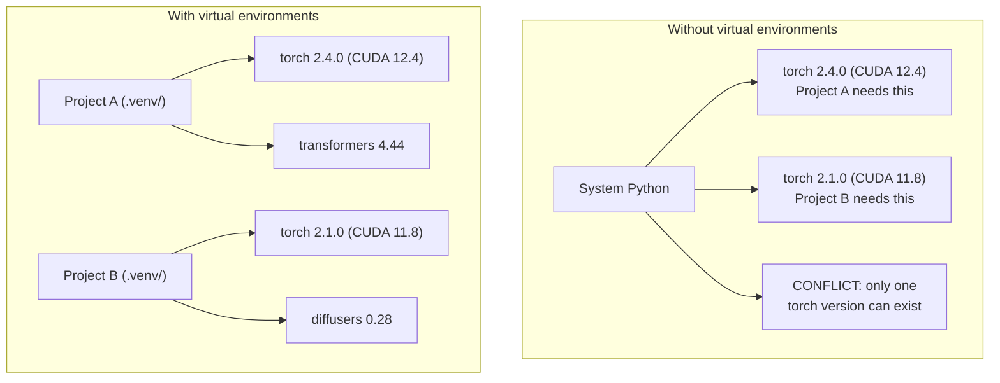

# Python 环境

>
> 依赖地狱确实存在。虚拟环境是解决它的良方。

**类型：** 构建
**语言：** Shell
**先修要求：** 第 0 阶段，第 01 课
**耗时：** 约 30 分钟

## 学习目标

- 使用 `uv`、`venv` 或 `conda` 创建隔离的虚拟环境  
- 编写包含可选依赖组的 `pyproject.toml` 文件，并生成锁文件以确保结果可复现  
- 诊断并解决常见问题：全局安装、pip/conda 混用、CUDA 版本不匹配  
- 为存在冲突依赖的项目实施分阶段的环境管理策略

## 问题所在

你为某个微调项目安装了 PyTorch 2.4。下周，另一个项目因需使用固定版本的 CUDA 构建，因此需要 PyTorch 2.1。如果你全局升级版本，第一个项目就会出问题；而如果你降级版本，第二个项目又会出故障。

这就是所谓的依赖地狱。在人工智能/机器学习工作中，这种情况屡见不鲜，原因包括：

- PyTorch、JAX 和 TensorFlow 都会自带各自的 CUDA 绑定库
- 模型库通常会指定必须使用的框架版本
- 使用全局的 `pip install` 命令会覆盖之前的所有安装内容
- CUDA 11.8 版本的构建与 CUDA 12.x 版本的驱动程序不兼容（反之亦然）

解决方案是：为每个项目创建独立的隔离环境，并在其中单独管理相应的依赖包。

## 概念概述



## 构建它

### 选项 1：uv venv（推荐）

`uv` 是最快的 Python 包管理器（速度比 `pip` 快 10 到 100 倍）。它通过一个工具即可处理虚拟环境、Python 版本以及依赖关系解析。

```bash
curl -LsSf https://astral.sh/uv/install.sh | sh

uv python install 3.12

cd your-project
uv venv
source .venv/bin/activate
```

安装包：

```bash
uv pip install torch numpy
```

一步创建包含 `pyproject.toml` 的项目：

```bash
uv init my-ai-project
cd my-ai-project
uv add torch numpy matplotlib
```

### 选项 2：venv（内置）

如果无法安装 `uv`，Python 自带了 `venv`：

```bash
python3 -m venv .venv
source .venv/bin/activate  # Linux/macOS
.venv\Scripts\activate     # Windows

pip install torch numpy
```

速度慢于 `uv`，但只要安装了 Python 即可在任何地方使用。

### 选项 3：conda（在需要时使用）

Conda 用于管理 CUDA 工具包、cuDNN 以及 C 语言库等非 Python 依赖项。在以下情况下可使用它：

- 需要特定版本的 CUDA 工具包，但又不想在系统范围内进行安装
- 处于共享集群环境中，无法安装系统级软件包
- 某个库的安装说明要求“使用 conda”进行安装

```bash
# Install miniconda (not the full Anaconda)
curl -LsSf https://repo.anaconda.com/miniconda/Miniconda3-latest-Linux-x86_64.sh -o miniconda.sh
bash miniconda.sh -b

conda create -n myproject python=3.12
conda activate myproject

conda install pytorch torchvision torchaudio pytorch-cuda=12.4 -c pytorch -c nvidia
```

一条规则：如果使用 conda 创建环境，请在该环境中所有包的安装也均使用 conda。在 conda 环境中混用 `pip install` 会导致依赖冲突，且极其难以调试。

### 本课程内容：分阶段策略

您可以为整个课程创建一个统一的环境。但不要这样做。不同阶段需要不同的（有时甚至相互冲突的）依赖项。

```
ai-engineering-from-scratch/
├── .venv/                    <-- shared lightweight env for phases 0-3
├── phases/
│   ├── 04-neural-networks/
│   │   └── .venv/            <-- PyTorch env
│   ├── 05-cnns/
│   │   └── .venv/            <-- same PyTorch env (symlink or shared)
│   ├── 08-transformers/
│   │   └── .venv/            <-- might need different transformer versions
│   └── 11-llm-apis/
│       └── .venv/            <-- API SDKs, no torch needed
```

`code/env_setup.sh` 中的脚本用于为本课程创建基础环境。

## pyproject.toml 基础知识

每个 Python 项目都应包含一个 `pyproject.toml` 文件。它将 `setup.py`、`setup.cfg` 以及 `requirements.txt` 的功能整合到同一个文件中。

```toml
[project]
name = "ai-engineering-from-scratch"
version = "0.1.0"
requires-python = ">=3.11"
dependencies = [
    "numpy>=1.26",
    "matplotlib>=3.8",
    "jupyter>=1.0",
    "scikit-learn>=1.4",
]

[project.optional-dependencies]
torch = ["torch>=2.3", "torchvision>=0.18"]
llm = ["anthropic>=0.39", "openai>=1.50"]
```

然后安装：

```bash
uv pip install -e ".[torch]"    # base + PyTorch
uv pip install -e ".[llm]"     # base + LLM SDKs
uv pip install -e ".[torch,llm]" # everything
```

## 锁文件

锁文件会将所有依赖项（包括间接依赖项）锁定到确切的版本。这能够确保结果的可复现性：任何从该锁文件进行安装的人都会获得完全相同的软件包。

```bash
# uv generates uv.lock automatically when using uv add
uv add numpy

# pip-tools approach
uv pip compile pyproject.toml -o requirements.lock
uv pip install -r requirements.lock
```

将你的锁文件提交到 Git。当有人克隆该仓库时，他们可以通过锁文件进行安装，从而获得完全一致的版本。

## 常见错误

### 1. 全局安装

```bash
pip install torch  # BAD: installs to system Python

source .venv/bin/activate
pip install torch  # GOOD: installs to virtual environment
```

查看您的包被保存到何处：

```bash
which python       # should show .venv/bin/python, not /usr/bin/python
which pip           # should show .venv/bin/pip
```

### 2. 同时使用 pip 和 conda

```bash
conda create -n myenv python=3.12
conda activate myenv
conda install pytorch -c pytorch
pip install some-other-package   # BAD: can break conda's dependency tracking
conda install some-other-package # GOOD: let conda manage everything
```

如果必须在 conda 环境中使用 pip（某些软件包仅支持通过 pip 安装），请先安装所有 conda 软件包，最后再安装 pip 软件包。

### 3. 忘记激活

```bash
python train.py           # uses system Python, missing packages
source .venv/bin/activate
python train.py           # uses project Python, packages found
```

您的 Shell 提示符应显示环境名称：

```
(.venv) $ python train.py
```

### 4. 将 `.venv` 提交到 Git

```bash
echo ".venv/" >> .gitignore
```

虚拟环境的大小通常在 200MB 到 2GB 之间。它们是本地存在的，无法在不同机器之间移植。请提交 `pyproject.toml` 文件及锁定文件即可。

### 5. CUDA版本不匹配

```bash
nvidia-smi                # shows driver CUDA version (e.g., 12.4)
python -c "import torch; print(torch.version.cuda)"  # shows PyTorch CUDA version

# These must be compatible.
# PyTorch CUDA version must be <= driver CUDA version.
```

## 使用它

运行设置脚本以创建您的课程环境：

```bash
bash phases/00-setup-and-tooling/06-python-environments/code/env_setup.sh
```

这将在仓库根目录下创建一个`.venv`环境，其中已安装并验证了核心依赖项。

## 练习题

1. 运行 `env_setup.sh` 并确认所有检查均通过。  
2. 创建第二个虚拟环境，在其中安装不同版本的 numpy，并验证这两个环境是相互隔离的。  
3. 为需要同时使用 PyTorch 和 Anthropic SDK 的项目编写一个 `pyproject.toml` 配置文件。  
4. 故意在不激活虚拟环境的情况下全局安装某个包，记录其安装位置，随后将其卸载。

## 关键术语

| 术语 | 常见说法 | 实际含义 |
|------|----------|----------|
| 虚拟环境 | “一个 venv” | 一个包含 Python 解释器及相关包的独立目录，与系统自带的 Python 分开 |
| 锁定文件 | “固定的依赖项” | 记录每个包及其确切版本的文件，用于确保在不同机器上安装结果一致 |
| pyproject.toml | “新的 setup.py” | 标准的 Python 项目配置文件，取代了 setup.py、setup.cfg 和 requirements.txt |
| 传递依赖 | “依赖的依赖” | 如果包 B 依赖于 C，而你又安装了依赖于 B 的 A，则 C 即为 A 的传递依赖 |
| CUDA 不匹配 | “我的 GPU 无法使用” | PyTorch 编译时所使用的 CUDA 版本与你的 GPU 驱动程序支持的版本不一致 |
