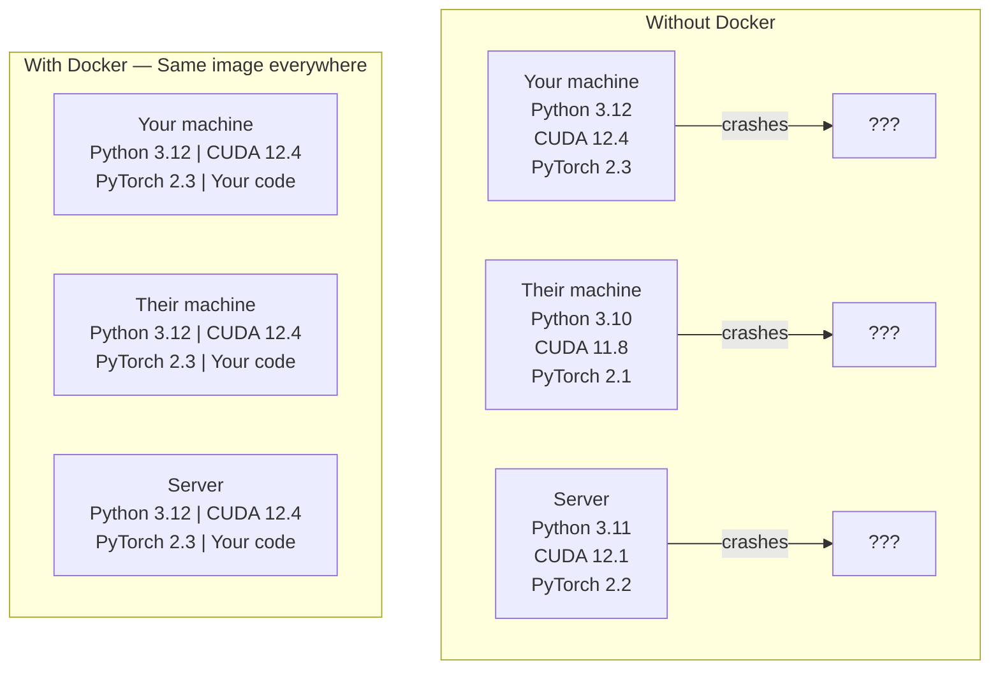

# AI 领域的 Docker 技术

>
> 容器技术让“在我的机器上能运行”这一问题成为历史。

**类型：** 构建
**语言：** Docker
**先修要求：** 第 0 阶段、第 01 和 03 课
**时长：** 约 60 分钟

## 学习目标

- 根据 Dockerfile 构建支持 GPU 的 Docker 镜像，该镜像需包含 CUDA、PyTorch 以及各类 AI 库。  
- 将主机目录挂载为卷，以便在容器重新构建后仍能保留模型、数据集及代码文件。  
- 配置 NVIDIA Container Toolkit，以在容器内部启用 GPU 功能。  
- 使用 Docker Compose 对多服务架构的 AI 应用（如推理服务器与向量数据库）进行编排管理。

## 问题所在

您在笔记本电脑上使用 PyTorch 2.3、CUDA 12.4 和 Python 3.12 对模型进行了训练。而您的同事使用的则是 PyTorch 2.1、CUDA 11.8 和 Python 3.10。该模型在同事的机器上会崩溃，不过您的 Dockerfile 在两台机器上都能正常运行。

AI 项目往往存在严重的依赖问题。典型的技术栈包括 Python、PyTorch、CUDA 驱动程序、cuDNN、系统级的 C 库，以及需要精确编译器版本的专用软件包（如 flash-attn）。Docker 能将所有这些组件打包到一个镜像中，从而确保其在任何环境中都能以一致的方式运行。

## 概念概述

Docker 将您的代码、运行时环境、库以及系统工具封装在一个名为容器的隔离单元中。可以将其视为一种轻量级的虚拟机，只不过它共享宿主操作系统的内核而非独立运行内核，因此只需几秒钟即可启动，而无需数分钟。



### 为何人工智能项目比大多数其他项目更需要 Docker

1. **GPU 驱动程序较为脆弱。** CUDA 12.4 版本的代码无法在 CUDA 11.8 环境中运行。Docker 通过 NVIDIA Container Toolkit 将 CUDA 工具包隔离在容器内部，同时共享主机端的 GPU 驱动程序。

2. **模型权重体积较大。** 参数量为 70 亿的模型在 fp16 格式下的大小可达 14 GB。您无需在每次重新构建模型时都重新下载它。Docker 卷功能允许您将主机上的模型目录挂载到容器中。

3. **多服务架构十分常见。** 真正的 AI 应用程序并非仅由一个 Python 脚本构成，它通常还包括推理服务器、用于 RAG 的向量数据库，以及可能的 Web 前端。Docker Compose 可以通过一条命令来统一管理所有这些组件。

### 核心词汇表

| 术语 | 含义 |
|------|---------------|
| Image | 只读模板。即您的配方，由 Dockerfile 构建而成。 |
| Container | Image 的运行实例。即您的厨房。 |
| Dockerfile | 用于逐层构建 Image 的指令集。 |
| Volume | 能在容器重启后依然存在的持久化存储。 |
| docker-compose | 一种用于用 YAML 定义多容器应用程序的工具。 |

### AI 领域常见的容器化模式

```
Dev Container
  Full toolkit. Editor support. Jupyter. Debugging tools.
  Used during development and experimentation.

Training Container
  Minimal. Just the training script and dependencies.
  Runs on GPU clusters. No editor, no Jupyter.

Inference Container
  Optimized for serving. Small image. Fast cold start.
  Runs behind a load balancer in production.
```

## 构建它

### 步骤 1：安装 Docker

```bash
# macOS
brew install --cask docker
open /Applications/Docker.app

# Ubuntu
curl -fsSL https://get.docker.com | sh
sudo usermod -aG docker $USER
# Log out and back in for group change to take effect
```

验证：

```bash
docker --version
docker run hello-world
```

### 步骤 2：安装 NVIDIA 容器工具包（配备 NVIDIA GPU 的 Linux 系统）

这允许 Docker 容器访问您的 GPU。macOS 和 Windows（WSL2）用户可以跳过此步骤；Docker Desktop 在这些平台上对 GPU 直通的处理方式有所不同。

```bash
distribution=$(. /etc/os-release;echo $ID$VERSION_ID)
curl -fsSL https://nvidia.github.io/libnvidia-container/gpgkey | sudo gpg --dearmor -o /usr/share/keyrings/nvidia-container-toolkit-keyring.gpg
curl -s -L https://nvidia.github.io/libnvidia-container/$distribution/libnvidia-container.list | \
    sed 's#deb https://#deb [signed-by=/usr/share/keyrings/nvidia-container-toolkit-keyring.gpg] https://#g' | \
    sudo tee /etc/apt/sources.list.d/nvidia-container-toolkit.list

sudo apt-get update
sudo apt-get install -y nvidia-container-toolkit
sudo nvidia-ctk runtime configure --runtime=docker
sudo systemctl restart docker
```

测试容器内的 GPU 访问权限：

```bash
docker run --rm --gpus all nvidia/cuda:12.4.1-base-ubuntu22.04 nvidia-smi
```

如果能够显示 GPU 信息，说明该工具包已正常运行。

### 步骤 3：理解基础镜像

选择合适的基镜像能够节省数小时的调试时间。

```
nvidia/cuda:12.4.1-devel-ubuntu22.04
  Full CUDA toolkit. Compilers included.
  Use for: building packages that need nvcc (flash-attn, bitsandbytes)
  Size: ~4 GB

nvidia/cuda:12.4.1-runtime-ubuntu22.04
  CUDA runtime only. No compilers.
  Use for: running pre-built code
  Size: ~1.5 GB

pytorch/pytorch:2.3.1-cuda12.4-cudnn9-runtime
  PyTorch pre-installed on top of CUDA.
  Use for: skipping the PyTorch install step
  Size: ~6 GB

python:3.12-slim
  No CUDA. CPU only.
  Use for: inference on CPU, lightweight tools
  Size: ~150 MB
```

### 步骤 4：为人工智能开发编写 Dockerfile

`code/Dockerfile` 中包含该 Dockerfile。请逐行查看：

```dockerfile
FROM nvidia/cuda:12.4.1-devel-ubuntu22.04

ENV DEBIAN_FRONTEND=noninteractive
ENV PYTHONUNBUFFERED=1

RUN apt-get update && apt-get install -y --no-install-recommends \
    python3.12 \
    python3.12-venv \
    python3.12-dev \
    python3-pip \
    git \
    curl \
    build-essential \
    && rm -rf /var/lib/apt/lists/*

RUN update-alternatives --install /usr/bin/python python /usr/bin/python3.12 1

RUN python -m pip install --no-cache-dir --upgrade pip setuptools wheel

RUN python -m pip install --no-cache-dir \
    torch==2.3.1 \
    torchvision==0.18.1 \
    torchaudio==2.3.1 \
    --index-url https://download.pytorch.org/whl/cu124

RUN python -m pip install --no-cache-dir \
    numpy \
    pandas \
    scikit-learn \
    matplotlib \
    jupyter \
    transformers \
    datasets \
    accelerate \
    safetensors

WORKDIR /workspace

VOLUME ["/workspace", "/models"]

EXPOSE 8888

CMD ["python"]
```

构建它：

```bash
docker build -t ai-dev -f phases/00-setup-and-tooling/07-docker-for-ai/code/Dockerfile .
```

首次运行时需要一些时间（用于下载 CUDA 基础镜像及 PyTorch）。后续构建将直接使用缓存中的层。

运行命令：

```bash
docker run --rm -it --gpus all \
    -v $(pwd):/workspace \
    -v ~/models:/models \
    ai-dev python -c "import torch; print(f'PyTorch {torch.__version__}, CUDA: {torch.cuda.is_available()}')"
```

在容器内运行 Jupyter：

```bash
docker run --rm -it --gpus all \
    -v $(pwd):/workspace \
    -v ~/models:/models \
    -p 8888:8888 \
    ai-dev jupyter notebook --ip=0.0.0.0 --port=8888 --no-browser --allow-root
```

### 步骤 5：数据和模型的卷挂载

卷挂载对人工智能工作至关重要。如果没有卷挂载，当容器停止运行时，您下载的14 GB模型数据将会丢失。

```bash
# Mount your code
-v $(pwd):/workspace

# Mount a shared models directory
-v ~/models:/models

# Mount datasets
-v ~/datasets:/data
```

在训练脚本中，从挂载的路径加载数据：

```python
from transformers import AutoModel

model = AutoModel.from_pretrained("/models/llama-7b")
```

该模型存储在您的主机文件系统中。您可以随时重新构建容器，而无需再次下载。

### 步骤 6：使用 Docker Compose 构建多服务 AI 应用

一个真正的 RAG 应用程序需要推理服务器和向量数据库。Docker Compose 可以通过一条命令同时启动这两者。

请查看 `code/docker-compose.yml` 文件：

```yaml
services:
  ai-dev:
    build:
      context: .
      dockerfile: Dockerfile
    deploy:
      resources:
        reservations:
          devices:
            - driver: nvidia
              count: all
              capabilities: [gpu]
    volumes:
      - ../../../:/workspace
      - ~/models:/models
      - ~/datasets:/data
    ports:
      - "8888:8888"
    stdin_open: true
    tty: true
    command: jupyter notebook --ip=0.0.0.0 --port=8888 --no-browser --allow-root

  qdrant:
    image: qdrant/qdrant:v1.12.5
    ports:
      - "6333:6333"
      - "6334:6334"
    volumes:
      - qdrant_data:/qdrant/storage

volumes:
  qdrant_data:
```

启动所有内容：

```bash
cd phases/00-setup-and-tooling/07-docker-for-ai/code
docker compose up -d
```

现在，您的 AI 开发容器可以通过服务名称访问位于 `http://qdrant:6333` 的向量数据库。Docker Compose 会自动创建一个共享网络。

在 AI 容器内部测试连接：

```python
from qdrant_client import QdrantClient

client = QdrantClient(host="qdrant", port=6333)
print(client.get_collections())
```

停止所有操作：

```bash
docker compose down
```

添加 `-v` 参数即可同时删除 qdrant 数据卷：

```bash
docker compose down -v
```

### 步骤 7：AI 工作中常用的 Docker 命令

```bash
# List running containers
docker ps

# List all images and their sizes
docker images

# Remove unused images (reclaim disk space)
docker system prune -a

# Check GPU usage inside a running container
docker exec -it <container_id> nvidia-smi

# Copy a file from container to host
docker cp <container_id>:/workspace/results.csv ./results.csv

# View container logs
docker logs -f <container_id>
```

## 使用它

现在您已经拥有一个可复现的 AI 开发环境。在本课程的后续内容中：

- 使用 `docker compose up` 同时启动开发环境与向量数据库
- 将代码、模型及数据作为卷挂载，以避免重新构建时丢失任何内容
- 当某节课需要新的 Python 包时，请将其添加到 Dockerfile 中并重新构建
- 与团队成员共享您的 Dockerfile，他们即可获得完全相同的开发环境。

### 没有 GPU？

删除 `--gpus all` 参数以及 NVIDIA 部署相关代码块。该容器在基于 CPU 的教学场景中依然可以正常运行。PyTorch 会检测到 CUDA 的缺失，并自动切换为使用 CPU 运行。

## 练习题

1. 编写 Dockerfile，并在容器内运行命令 `python -c "import torch; print(torch.__version__)"`。
2. 启动 docker-compose 集群，验证 AI 容器是否能够通过地址 `http://qdrant:6333/collections` 访问 Qdrant。
3. 在 Dockerfile 中添加 `flask`，重新构建镜像，并在端口 5000 上运行一个简单的 API 服务器。使用 `-p 5000:5000` 将该端口映射出去。
4. 使用 `docker images` 统计镜像大小。尝试将基础镜像从 `devel` 更改为 `runtime`，并对比两种镜像的大小差异。

## 关键术语

| 术语 | 常见说法 | 实际含义 |
|------|----------|----------|
| 容器 | “轻量级虚拟机” | 使用宿主内核的隔离进程，拥有独立的文件系统与网络功能 |
| 镜像层 | “缓存步骤” | 每条 Dockerfile 指令都会生成一层。未更改的层会被缓存，从而加快重新构建的速度 |
| NVIDIA Container Toolkit | “Docker 中的 GPU” | 一种运行时钩子，可通过 `--gpus` 标志将宿主 GPU 提供给容器使用 |
| 卷挂载 | “共享文件夹” | 将宿主机上的某个目录映射到容器中。即使容器停止运行，其中的更改也会保留 |
| 基础镜像 | “起始点” | Dockerfile 所基于的 `FROM` 镜像，决定了哪些组件会被预先安装 |
