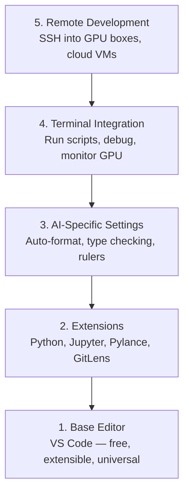

# 编辑器配置

> 您的编辑器是您的副驾驶。只需配置一次，它就不会干扰您的工作，并能充分发挥作用。

**类型：** 构建
**语言：** --
**前置要求：** 第 0 阶段，第 01 课
**耗时：** 约 20 分钟

## 学习目标

- 安装 VS Code，并安装用于 Python、Jupyter、代码检查以及远程 SSH 的必备扩展插件。  
- 配置“保存时自动格式化”、“类型检查”以及笔记本输出滚动功能，以适配人工智能工作流程。  
- 设置远程 SSH 连接，以便像操作本地机器一样在远程 GPU 服务器上编辑和调试代码。  
- 评估其他编辑器（如 Cursor、Windsurf、Neovim）及其在人工智能开发中的优缺点。

## 问题所在

你将在编辑器中花费数千小时编写 Python 代码、运行笔记本、调试训练循环，以及通过 SSH 连接到 GPU 设备。配置不当的编辑器会让每一次使用都充满麻烦：没有自动补全功能，没有类型提示，也没有即时错误提示，还需要手动格式化代码，终端操作流程也极为繁琐。

正确的环境配置只需 20 分钟。而跳过这一步，则会让你每天损失 20 分钟的时间。

## 概念概述

AI 工程编辑器环境需要以下五项配置：



## 构建它

### 步骤 1：安装 VS Code

VS Code 是推荐的编辑器。它免费、可在所有操作系统中运行，具备一流的 Jupyter Notebook 支持，其扩展生态系统涵盖了人工智能工作所需的一切功能。

请从 [code.visualstudio.com](https://code.visualstudio.com/) 下载它。

在终端中验证：

```bash
code --version
```

如果在 macOS 上找不到 `code`，请打开 VS Code，按下 `Cmd+Shift+P`，输入 “Shell Command”，然后选择 “Install 'code' command in PATH”。

### 步骤 2：安装必备扩展插件

在 VS Code 中打开集成终端（`Ctrl+`` ` 或 `` Cmd+` ``），并安装与人工智能工作相关的扩展程序：

```bash
code --install-extension ms-python.python
code --install-extension ms-python.vscode-pylance
code --install-extension ms-toolsai.jupyter
code --install-extension eamodio.gitlens
code --install-extension ms-vscode-remote.remote-ssh
code --install-extension ms-python.debugpy
code --install-extension ms-python.black-formatter
code --install-extension charliermarsh.ruff
```

各扩展的功能说明：

| 扩展名 | 作用 |
|-----------|------|
| Python | 提供语言支持、虚拟环境检测以及运行/调试功能 |
| Pylance | 实现快速类型检查、自动补全及导入路径解析 |
| Jupyter | 在 VS Code 中运行笔记本，并提供变量浏览器 |
| GitLens | 显示谁修改了什么内容，以及内联的 git blame 信息 |
| Remote SSH | 将远程 GPU 服务器上的文件夹视为本地文件夹使用 |
| Debugpy | 为 Python 提供逐步调试功能 |
| Black Formatter | 在保存时自动格式化代码，保持风格一致 |
| Ruff | 快速进行代码检查，及时发现常见错误 |

本课程中的 `code/.vscode/extensions.json` 文件包含了完整的推荐扩展列表。打开项目文件夹后，VS Code 会提示您安装这些扩展。

### 步骤 3：配置设置

复制本课程中 `code/.vscode/settings.json` 文件中的设置，或通过“设置 > 打开设置（JSON）”手动应用它们。

适用于 AI 开发的关键设置：

```jsonc
{
    "python.analysis.typeCheckingMode": "basic",
    "editor.formatOnSave": true,
    "editor.rulers": [88, 120],
    "notebook.output.scrolling": true,
    "files.autoSave": "afterDelay"
}
```

为何这些功能很重要：

- **基础类型的检查**：在运行之前即可捕获错误的参数类型，从而节省因张量形状不匹配或 API 参数错误而浪费的调试时间。
- **自动格式化保存**：无需再手动处理代码格式问题，Black 会自动完成。
- **88 和 120 字符标记线**：Black 在达到 88 字符时会自动换行；120 字符标记线则用于提示文档字符串和注释的长度是否过长。
- **笔记本输出滚动功能**：训练循环可能会打印数千行代码，若没有滚动功能，输出面板的内容将会溢出。
- **自动保存功能**：人们常常会忘记手动保存文件，导致训练脚本继续使用过时的代码。自动保存功能可避免此类问题。

### 步骤 4：终端集成

VS Code 的内置终端可用于运行训练脚本、监控 GPU 状态以及管理开发环境。

请正确配置它：

```jsonc
{
    "terminal.integrated.defaultProfile.osx": "zsh",
    "terminal.integrated.defaultProfile.linux": "bash",
    "terminal.integrated.fontSize": 13,
    "terminal.integrated.scrollback": 10000
}
```

常用快捷键：

| 操作 | macOS | Linux/Windows |
|--------|-------|---------------|
| 切换终端 | `` Ctrl+` `` | `` Ctrl+` `` |
| 新建终端 | `Ctrl+Shift+`` ` | `Ctrl+Shift+`` ` |
| 分割终端 | `Cmd+\` | `Ctrl+\` |

分割终端非常实用：一个用于运行脚本，另一个可用于通过 `nvidia-smi -l 1` 或 `watch -n 1 nvidia-smi` 监控 GPU 状态。

### 步骤 5：远程开发（通过 SSH 连接到 GPU 计算节点）

这是进行 AI 开发时最重要的扩展。你可以在远程机器（云虚拟机、实验室服务器、Lambda、Vast.ai）上运行训练任务。Remote SSH 允许你访问远程文件系统、编辑文件、使用终端以及调试代码，体验如同在本地操作一般。

设置步骤：

1. 安装 Remote SSH 扩展（详见第 2 步）。
2. 按下 `Ctrl+Shift+P`（或 `Cmd+Shift+P`），输入 “Remote-SSH: Connect to Host”。
3. 输入 `user@your-gpu-box-ip`。
4. VS Code 会自动在远程机器上安装其服务器组件。

如需实现无密码登录，请配置 SSH 密钥：

```bash
ssh-keygen -t ed25519 -C "your-email@example.com"
ssh-copy-id user@your-gpu-box-ip
```

为方便操作，将该主机地址添加到 `~/.ssh/config` 中：

```
Host gpu-box
    HostName 203.0.113.50
    User ubuntu
    IdentityFile ~/.ssh/id_ed25519
    ForwardAgent yes
```

现在，使用 `Remote-SSH: Connect to Host > gpu-box` 即可立即建立连接。

## 替代方案

### Cursor

[cursor.com](https://cursor.com) 是一个具备内置 AI 代码生成功能的 VS Code 分支版本。它使用相同的扩展生态系统及设置格式。即便您使用的是 Cursor，本课程中的所有内容依然适用。请导入相同的 `settings.json` 和 `extensions.json` 文件。

### 帆板运动

[windsurf.com](https://windsurf.com) 是另一个以 AI 为核心的 VS Code 分支版本。功能完全一致：插件相同、设置格式相同，且也支持远程 SSH 连接。

### Vim/Neovim

如果您已经在使用 Vim 或 Neovim 且工作效率很高，建议继续沿用。进行 AI Python 开发的最低配置如下：

- **pyright** 或 **pylsp**，用于类型检查（可通过 Mason 安装或手动安装）
- **nvim-lspconfig**，用于集成语言服务器
- **jupyter-vim** 或 **molten-nvim**，用于类似 Jupyter 的代码执行环境
- **telescope.nvim**，用于文件及符号搜索
- **none-ls.nvim** 配合 black 和 ruff，用于代码格式化与检查

如果您尚未使用 Vim，建议暂不开始学习。其学习曲线会与 AI 工程技术的学习相互竞争，推荐直接使用 VS Code。

## 使用它

通过此配置，您的日常工作流程如下：

1. 在 VS Code 中打开项目文件夹（或通过远程 SSH 连接到 GPU 服务器）。
2. 在编辑器中编写 Python 代码，利用自动补全、类型提示及即时错误提示功能。
3. 使用 Jupyter 扩展直接运行 Jupyter 笔记本。
4. 利用内置终端执行训练脚本、运行 `uv pip install` 命令以及监控 GPU 状态。
5. 在提交代码前使用 GitLens 查看更改内容。

## 练习题

1. 安装 VS Code 以及步骤 2 中列出的所有扩展程序。  
2. 将本课程中的 `settings.json` 文件复制到您的 VS Code 配置目录中。  
3. 打开一个 Python 文件，确认 Pylance 能够显示类型提示，并且在保存文件时 Black 能够自动进行格式化。  
4. 如果您能够访问远程机器，请配置 Remote SSH 并打开该机器上的某个文件夹。

## 关键术语

| 术语 | 常见说法 | 实际含义 |
|------|----------|----------|
| LSP | “自动补全引擎” | Language Server Protocol：一种标准，允许编辑器从特定语言的服务器获取类型信息、补全内容及诊断数据 |
| Pylance | “Python 插件” | Microsoft 开发的 Python 语言服务器，利用 Pyright 进行类型检查并提供 IntelliSense 功能 |
| Remote SSH | “在服务器上工作” | VS Code 扩展，在远程机器上运行轻量级服务器，并将界面流式传输到本地编辑器 |
| Format on save | “自动美化代码” | 每次保存时，编辑器都会运行格式化工具（如 Black、Ruff），以确保代码风格始终一致 |
