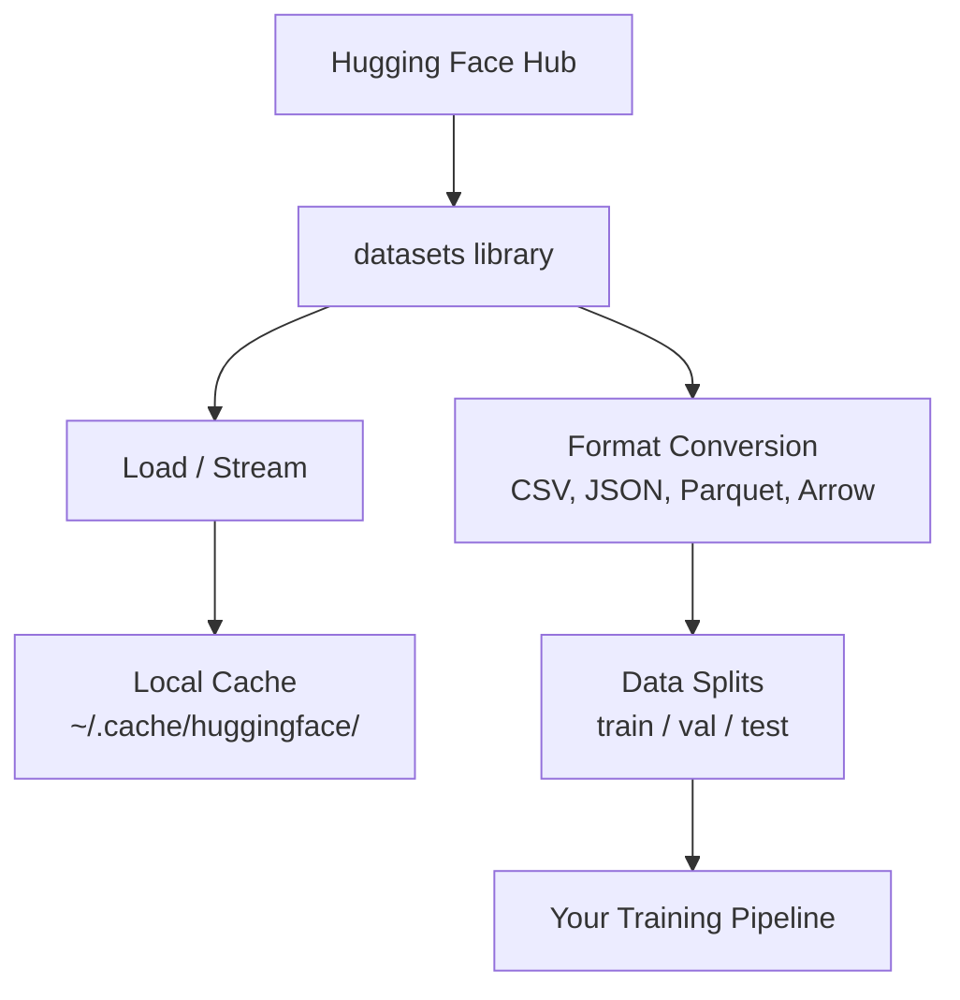

# 数据管理

> 数据是发展的动力。如何管理数据决定了前进的速度。

**类型：** 构建
**语言：** Python
**先修要求：** 阶段 0，课程 01
**时长：** 约 45 分钟

## 学习目标

- 使用 Hugging Face 的 `datasets` 库加载、流式处理及缓存数据集  
- 在 CSV、JSON、Parquet 和 Arrow 格式之间进行转换，并说明各自的优缺点  
- 通过设置固定的随机种子来创建可复现的训练集/验证集/测试集划分  
- 利用 `.gitignore`、Git LFS 或 DVC 管理大型模型及数据集文件

## 问题所在

每个人工智能项目都始于数据。你需要寻找数据集、下载它们、在不同格式之间转换、将数据拆分用于训练和评估，同时为数据版本控制，以确保实验结果的可复现性。每次都手动执行这些操作既耗时又容易出错。因此，你需要一个可重复的工作流程。

## 概念概述



Hugging Face 的 `datasets` 库是用于加载人工智能工作所需数据的标准工具。它能够直接处理数据的下载、缓存、格式转换以及流式读取功能。

## 构建它

### 步骤 1：安装 datasets 库

```bash
pip install datasets huggingface_hub
```

### 步骤 2：加载数据集

```python
from datasets import load_dataset

dataset = load_dataset("imdb")
print(dataset)
print(dataset["train"][0])
```

此操作将下载 IMDb 电影评论数据集。首次下载后，系统会从 `~/.cache/huggingface/datasets/` 目录的缓存中加载该数据集。

### 步骤 3：流式处理大型数据集

某些数据集体积过大，无法全部存储在磁盘上。流式加载技术可以逐行读取这些数据，而无需下载完整的数据量。

```python
dataset = load_dataset("wikimedia/wikipedia", "20220301.en", split="train", streaming=True)

for i, example in enumerate(dataset):
    print(example["title"])
    if i >= 4:
        break
```

流式处理会生成一个 `IterableDataset` 对象。您可以在数据行到达时立即对其进行处理，且无论数据集规模如何，内存占用都保持不变。

### 步骤 4：数据集格式

`datasets` 库在底层使用了 Apache Arrow。根据您的处理流程需求，您可以将其转换为其他格式。

```python
dataset = load_dataset("imdb", split="train")

dataset.to_csv("imdb_train.csv")
dataset.to_json("imdb_train.json")
dataset.to_parquet("imdb_train.parquet")
```

格式对比：

| 格式 | 大小 | 读取速度 | 最佳适用场景 |
|------|------|-----------|----------|
| CSV | 较大 | 慢 | 人类可读性、电子表格 |
| JSON | 较大 | 慢 | API、嵌套数据 |
| Parquet | 较小 | 快 | 数据分析、列式查询 |
| Arrow | 较小 | 最快 | 内存处理（`datasets` 库内部使用的格式） |

在人工智能工作中，Parquet 是最佳的存储格式。Arrow 用于内存中的数据处理。CSV 和 JSON 则用于数据交换。

### 步骤 5：数据划分

每个机器学习项目都需要进行三次数据分割：

- **训练集**：模型在此数据上学习（通常占 80%）
- **验证集**：用于在训练过程中检查进度（通常占 10%）
- **测试集**：在训练完成后用于最终评估（通常占 10%）

有些数据集已经预先分割好了。如果未预分割，则需要自行进行分割：

```python
dataset = load_dataset("imdb", split="train")

split = dataset.train_test_split(test_size=0.2, seed=42)
train_val = split["train"].train_test_split(test_size=0.125, seed=42)

train_ds = train_val["train"]
val_ds = train_val["test"]
test_ds = split["test"]

print(f"Train: {len(train_ds)}, Val: {len(val_ds)}, Test: {len(test_ds)}")
```

始终设置种子值以确保结果可复现。相同的种子值每次都会生成相同的数据分割结果。

### 步骤 6：下载模型并缓存

模型属于体积较大的文件。`huggingface_hub` 库负责处理这些文件的下载与缓存操作。

```python
from huggingface_hub import hf_hub_download, snapshot_download

model_path = hf_hub_download(
    repo_id="sentence-transformers/all-MiniLM-L6-v2",
    filename="config.json"
)
print(f"Cached at: {model_path}")

model_dir = snapshot_download("sentence-transformers/all-MiniLM-L6-v2")
print(f"Full model at: {model_dir}")
```

模型会被缓存到 `~/.cache/huggingface/hub/` 目录中。一旦下载完成，后续运行时即可立即加载。

### 步骤 7：处理大文件

模型权重和大型数据集不应放入 git。有以下三种方案：

**方案 A：.gitignore（最简单）**

```
*.bin
*.safetensors
*.pt
*.onnx
data/*.parquet
data/*.csv
models/
```

**选项 B：Git LFS（在 Git 中跟踪大文件）**

```bash
git lfs install
git lfs track "*.bin"
git lfs track "*.safetensors"
git add .gitattributes
```

Git LFS 在你的代码仓库中存储指针，而实际文件则保存在独立的服务器上。GitHub 提供 1 GB 的免费存储空间。

**选项 C：DVC（数据版本控制）**

```bash
pip install dvc
dvc init
dvc add data/training_set.parquet
git add data/training_set.parquet.dvc data/.gitignore
git commit -m "Track training data with DVC"
```

DVC 会生成小型 `.dvc` 文件来指向你的数据。这些数据本身存储在 S3、GCS 或其他远程存储后端中。

| 方法 | 复杂度 | 适用场景 |
|----------|-----------|----------|
| .gitignore | 低 | 个人项目，以及可以重新获取的已下载数据 |
| Git LFS | 中等 | 需要通过 git 共享模型权重的团队 |
| DVC | 高 | 需要实现实验结果可复现的场景、大型数据集，以及大型团队 |

在本课程中，使用 `.gitignore` 即可满足需求。只有在需要在不同机器上完全复现实验结果时，才建议使用 DVC。

### 第 8 步：存储模式

**本地存储**适用于大小在 10 GB 左右的数据集。Hugging Face 缓存会自动处理此类数据。

**云存储**则用于更大规模的数据或需要在多台机器之间共享的数据：

```python
import os

local_path = os.path.expanduser("~/.cache/huggingface/datasets/")

# s3_path = "s3://my-bucket/datasets/"
# gcs_path = "gs://my-bucket/datasets/"
```

DVC 可直接与 S3 和 GCS 集成：

```bash
dvc remote add -d myremote s3://my-bucket/dvc-store
dvc push
```

在本课程中，使用本地存储即可满足需求。只有在使用远程 GPU 实例进行微调时，云存储才会变得有用。

## 本课程使用的数据集

| 数据集 | 教学内容 | 大小 | 所教授的知识点 |
|---------|---------|------|----------------|
| IMDB | 分词、分类 | 84 MB | 文本分类基础 |
| WikiText | 语言建模 | 181 MB | 下一个词预测 |
| SQuAD | 查询系统 | 35 MB | 问答处理、文本片段提取 |
| Common Crawl（子集） | 嵌入向量 | 不固定 | 大规模文本处理 |
| MNIST | 视觉基础 | 21 MB | 图像分类基本原理 |
| COCO（子集） | 多模态 | 不固定 | 图像-文本对处理 |

无需立即下载所有数据集。每项教学内容都会明确说明所需资源。

## 使用它

运行该实用脚本以验证所有功能正常：

```bash
python code/data_utils.py
```

此操作会下载一个小型数据集，对其进行转换与分割，最后输出汇总信息。

## 发布它

本课程将生成以下内容：
- `code/data_utils.py` —— 可复用的数据加载与缓存工具函数
- `outputs/prompt-data-helper.md` —— 用于确定任务所需合适数据集的提示模板

## 练习题

1. 使用 `mrpc` 配置加载 `glue` 数据集，并查看前 5 个样本。
2. 流式处理 `c4` 数据集，统计在 10 秒内能够处理的样本数量。
3. 将数据集转换为 Parquet 格式，并比较其文件大小与 CSV 格式的大小。
4. 使用固定种子创建 70/15/15 的训练/验证/测试数据划分，并核实各部分的数据量。

## 关键术语

| 术语 | 常见说法 | 实际含义 |
|------|----------|----------|
| 数据集分割 | “训练数据” | 在机器学习生命周期的不同阶段使用的、具有名称的子集（train/val/test） |
| 流式处理 | “延迟加载” | 从远程源逐行处理数据，而无需下载整个数据集 |
| Parquet | “压缩后的 CSV” | 一种列式文件格式，专为分析查询和存储效率优化 |
| Arrow | “高速数据框” | datasets 库内部使用的列式内存格式，可实现零拷贝读取 |
| Git LFS | “用于大文件的 Git” | 一种扩展工具，将大文件存储在 git 仓库之外，同时将指针保留在版本控制中 |
| DVC | “数据的 Git” | 一种用于数据集和模型的版本控制系统，可与云存储集成 |
| 缓存 | “已下载过” | 之前获取的数据的本地副本，默认存储在 ~/.cache/huggingface/ 目录下 |
