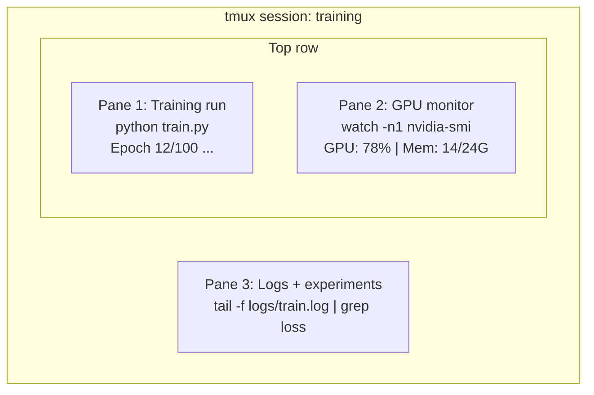

# 终端与Shell

> 终端是人工智能工程师的日常工作场所。请在此熟练操作。

**类型：** 学习
**语言：** --
**先修要求：** 阶段 0，课程 01
**时长：** 约 35 分钟

## 学习目标

- 使用管道、重定向以及 `grep` 命令从命令行筛选并处理训练日志  
- 创建具有多个分屏的持久化 tmux 会话，以实现并行训练与 GPU 监控  
- 利用 `htop`、`nvtop` 和 `nvidia-smi` 工具监控系统及 GPU 资源使用情况  
- 通过 SSH、`scp` 和 `rsync` 在本地机器与远程机器之间传输文件

## 问题所在

在人工智能工程实践中，你将在终端前花费的时间远多于在任何编辑器中。无论是模型训练、GPU监控、日志查看、远程SSH会话还是环境管理，每一个AI工作流程都离不开Shell命令。如果在这方面效率低下，整体工作效率也会受到影响。

本课程将教授对AI工作至关重要的终端操作技能。无需具备Unix历史知识，也不需要深入学习Bash脚本编写，仅涵盖您实际需要的内容。

## 概念概述



同时运行三件事。仅需一个终端。你可以断开连接、返回本地，再通过 SSH 连接回来并重新附上。训练过程会持续进行。

## 构建它

### 步骤 1：了解你的 Shell

检查您正在使用的 Shell：

```bash
echo $SHELL
```

大多数系统使用 `bash` 或 `zsh`。两者均可正常使用。本课程中的命令在这两种 shell 中都能运行。

需要了解的关键点：

```bash
# Move around
cd ~/projects/ai-engineering-from-scratch
pwd
ls -la

# History search (most useful shortcut you'll learn)
# Ctrl+R then type part of a previous command
# Press Ctrl+R again to cycle through matches

# Clear terminal
clear   # or Ctrl+L

# Cancel a running command
# Ctrl+C

# Suspend a running command (resume with fg)
# Ctrl+Z
```

### 步骤 2：管道与重定向

管道用于将多个命令连接在一起。通过这种方式，你可以处理日志、过滤输出以及串联不同的工具。你在实际工作中会频繁使用这一功能。

```bash
# Count how many times "loss" appears in a log
cat train.log | grep "loss" | wc -l

# Extract just the loss values from training output
grep "loss:" train.log | awk '{print $NF}' > losses.txt

# Watch a log file update in real time, filtering for errors
tail -f train.log | grep --line-buffered "ERROR"

# Sort experiments by final accuracy
grep "final_accuracy" results/*.log | sort -t= -k2 -n -r

# Redirect stdout and stderr to separate files
python train.py > output.log 2> errors.log

# Redirect both to the same file
python train.py > train_full.log 2>&1
```

您需要的三种重定向方式：

| 符号 | 功能说明 |
|--------|----------|
| `>` | 将标准输出写入文件（覆盖原有内容） |
| `>>` | 将标准输出追加到文件末尾 |
| `2>` | 将标准错误写入文件 |
| `2>&1` | 将标准错误发送至与标准输出相同的位置 |
| `\|` | 将前一个命令的标准输出作为输入传递给下一个命令 |

### 步骤 3：后台进程

训练运行需要数小时，你并不想让终端一直保持打开状态。

```bash
# Run in background (output still goes to terminal)
python train.py &

# Run in background, immune to hangup (closing terminal won't kill it)
nohup python train.py > train.log 2>&1 &

# Check what's running in background
jobs
ps aux | grep train.py

# Bring a background job to foreground
fg %1

# Kill a background process
kill %1
# or find its PID and kill that
kill $(pgrep -f "train.py")
```

`&`、`nohup` 与 `screen`/`tmux` 的区别：

| 方法 | 终端关闭后仍运行？ | 可重新连接？ |
|--------|-------------------|------------|
| `command &` | 否 | 否 |
| `nohup command &` | 是 | 否（需查看日志文件） |
| `screen` / `tmux` | 是 | 是 |

若任务需要运行数分钟以上，建议使用 tmux。

### 步骤 4：tmux

tmux 允许您创建具有多个分屏的持久终端会话。它是管理训练任务时最实用的工具。

```bash
# Install
# macOS
brew install tmux
# Ubuntu
sudo apt install tmux

# Start a named session
tmux new -s training

# Split horizontally
# Ctrl+B then "

# Split vertically
# Ctrl+B then %

# Navigate between panes
# Ctrl+B then arrow keys

# Detach (session keeps running)
# Ctrl+B then d

# Reattach
tmux attach -t training

# List sessions
tmux ls

# Kill a session
tmux kill-session -t training
```

典型的 AI 工作流会话：

```bash
tmux new -s train

# Pane 1: start training
python train.py --epochs 100 --lr 1e-4

# Ctrl+B, " to split, then run GPU monitor
watch -n1 nvidia-smi

# Ctrl+B, % to split vertically, tail the logs
tail -f logs/experiment.log

# Now detach with Ctrl+B, d
# SSH out, go get coffee, come back
# tmux attach -t train
```

### 步骤 5：使用 htop 和 nvtop 进行监控

```bash
# System processes (better than top)
htop

# GPU processes (if you have NVIDIA GPU)
# Install: sudo apt install nvtop (Ubuntu) or brew install nvtop (macOS)
nvtop

# Quick GPU check without nvtop
nvidia-smi

# Watch GPU usage update every second
watch -n1 nvidia-smi

# See which processes are using the GPU
nvidia-smi --query-compute-apps=pid,name,used_memory --format=csv
```

您将使用的 `htop` 快捷键：
- `F6` 或 `>`：按列排序（按内存排序可查找内存泄漏）
- `F5`：切换树形视图（查看子进程）
- `F9`：终止进程
- `/`：搜索进程名称

### 步骤 6：使用 SSH 连接远程 GPU 服务器

当您租用云 GPU（如 Lambda、RunPod、Vast.ai）时，需通过 SSH 进行连接。

```bash
# Basic connection
ssh user@gpu-box-ip

# With a specific key
ssh -i ~/.ssh/my_gpu_key user@gpu-box-ip

# Copy files to remote
scp model.pt user@gpu-box-ip:~/models/

# Copy files from remote
scp user@gpu-box-ip:~/results/metrics.json ./

# Sync a whole directory (faster for many files)
rsync -avz ./data/ user@gpu-box-ip:~/data/

# Port forward (access remote Jupyter/TensorBoard locally)
ssh -L 8888:localhost:8888 user@gpu-box-ip
# Now open localhost:8888 in your browser

# SSH config for convenience
# Add to ~/.ssh/config:
# Host gpu
#     HostName 192.168.1.100
#     User ubuntu
#     IdentityFile ~/.ssh/gpu_key
#
# Then just:
# ssh gpu
```

### 步骤 7：AI 工作中常用的别名

将以下内容添加到您的 `~/.bashrc` 或 `~/.zshrc` 文件中：

```bash
source phases/00-setup-and-tooling/10-terminal-and-shell/code/shell_aliases.sh
```

或者复制您需要的那些。键别名如下：

```bash
# GPU status at a glance
alias gpu='nvidia-smi --query-gpu=index,name,utilization.gpu,memory.used,memory.total,temperature.gpu --format=csv,noheader'

# Kill all Python training processes
alias killtraining='pkill -f "python.*train"'

# Quick virtual environment activate
alias ae='source .venv/bin/activate'

# Watch training loss
alias watchloss='tail -f logs/*.log | grep --line-buffered "loss"'
```

完整列表请参见 `code/shell_aliases.sh`。

### 第 8 步：常见的 AI 终端模式

在实践中，这些问题会反复出现：

```bash
# Run training, log everything, notify when done
python train.py 2>&1 | tee train.log; echo "DONE" | mail -s "Training complete" you@email.com

# Compare two experiment logs side by side
diff <(grep "accuracy" exp1.log) <(grep "accuracy" exp2.log)

# Find the largest model files (clean up disk space)
find . -name "*.pt" -o -name "*.safetensors" | xargs du -h | sort -rh | head -20

# Download a model from Hugging Face
wget https://huggingface.co/model/resolve/main/model.safetensors

# Untar a dataset
tar xzf dataset.tar.gz -C ./data/

# Count lines in all Python files (see how big your project is)
find . -name "*.py" | xargs wc -l | tail -1

# Check disk space (training data fills disks fast)
df -h
du -sh ./data/*

# Environment variable check before training
env | grep -i cuda
env | grep -i torch
```

## 使用它

以下是本课程中各工具的适用场景：

| 工具 | 使用时机 |
|------|----------|
| tmux | 每次训练运行时（第 3 阶段及以上） |
| `tail -f` + `grep` | 监控训练日志 |
| `nohup` / `&` | 执行快速后台任务 |
| `htop` / `nvtop` | 调试训练缓慢或内存不足的错误 |
| SSH + `rsync` | 在云端的 GPU 上进行操作 |
| 管道与重定向 | 处理实验结果 |
| 别名 | 缩短重复命令的输入时间 |

## 练习题

1. 安装 tmux，创建一个包含三个分屏的会话：在一个分屏中运行 `htop`，在另一个分屏中运行 `watch -n1 date`，在第三个分屏中运行 Python 脚本。随后断开连接再重新连接。
2. 将 `code/shell_aliases.sh` 中定义的别名添加到你的 shell 配置文件中，并通过 `source ~/.zshrc`（或 `~/.bashrc`）重新加载配置。
3. 使用命令 `for i in $(seq 1 100); do echo "epoch $i loss: $(echo "scale=4; 1/$i" | bc)"; sleep 0.1; done > fake_train.log` 创建一个虚假的训练日志，然后利用 `grep`、`tail` 和 `awk` 命令提取其中的损失值。
4. 为你可以访问的服务器设置 SSH 配置项（或使用 `localhost` 来练习语法）。

## 关键术语

| 术语 | 常见说法 | 实际含义 |
|------|----------|----------|
| Shell | “终端” | 解释用户命令的程序（如 bash、zsh、fish） |
| tmux | “终端多路复用器” | 允许在单个窗口中运行多个终端会话，并支持分离/重新连接的程序 |
| Pipe | “那个竖线符号” | `\|` 运算符，用于将一个命令的输出作为另一个命令的输入 |
| PID | “进程 ID” | 为每个正在运行的进程分配的唯一编号，用于监控或终止该进程 |
| nohup | “防止挂起” | 使命令不受挂起信号影响而继续运行，因此关闭终端也不会终止该命令 |
| SSH | “连接到服务器” | 安全外壳协议，一种用于在远程机器上执行命令的加密协议 |
