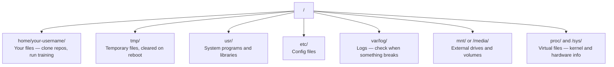

# AI 领域的 Linux 技术

> 大多数人工智能应用都在 Linux 系统上运行。你需要掌握足够的知识，以避免在工作中遇到阻碍。

**类型：** 学习
**语言：--**
**先修要求：** 阶段 0，课程 01
**时长：** 约 30 分钟

## 学习目标

- 在命令行中导航 Linux 文件系统并执行基本的文件操作  
- 使用 `chmod` 和 `chown` 管理文件权限，以解决“Permission denied”错误  
- 使用 `apt` 安装系统软件包，并为 AI 工作配置一台全新的 GPU 服务器  
- 识别 macOS 与 Linux 之间的差异，这些差异常常困扰在远程机器上工作的开发者

## 问题所在

你在 macOS 或 Windows 上进行开发。但一旦通过 SSH 连接到云端的 GPU 服务器、租用 Lambda 实例或启动 EC2 机器，你将进入 Ubuntu 环境。终端是你唯一的操作界面——没有 Finder，没有资源管理器，也没有图形用户界面。如果你无法在命令行中导航文件系统、安装软件包及管理进程，那你就会陷入既要为闲置的 GPU 使用时间付费，又要四处搜索“如何在 Linux 中解压文件”的困境。

本指南旨在帮助你生存。它仅涵盖你在远程 Linux 机器上进行 AI 工作时所需掌握的内容，除此之外别无他物。

## 文件系统结构

Linux 将所有内容都组织在单一的根目录 `/` 下。不存在 `C:\` 或 `/Volumes` 这样的路径。您实际会使用的目录包括：



您的用户主目录为 `~` 或 `/home/your-username`。您执行的几乎所有操作都在这里进行。

## 必备命令

以下是15条命令，涵盖了在远程GPU服务器上所需执行的95%的操作。

### 移动操作

```bash
pwd                         # Where am I?
ls                          # What's here?
ls -la                      # What's here, including hidden files with details?
cd /path/to/dir             # Go there
cd ~                        # Go home
cd ..                       # Go up one level
```

### 文件与目录

```bash
mkdir my-project            # Create a directory
mkdir -p a/b/c              # Create nested directories in one shot

cp file.txt backup.txt      # Copy a file
cp -r src/ src-backup/      # Copy a directory (recursive)

mv old.txt new.txt          # Rename a file
mv file.txt /tmp/           # Move a file

rm file.txt                 # Delete a file (no trash, it's gone)
rm -rf my-dir/              # Delete a directory and everything inside
```

`rm -rf` 命令是不可撤销的。输入后无法恢复，请在按下回车键前仔细核对路径。

### 读取文件

```bash
cat file.txt                # Print entire file
head -20 file.txt           # First 20 lines
tail -20 file.txt           # Last 20 lines
tail -f log.txt             # Follow a log file in real time (Ctrl+C to stop)
less file.txt               # Scroll through a file (q to quit)
```

### 搜索中

```bash
grep "error" training.log           # Find lines containing "error"
grep -r "learning_rate" .           # Search all files in current directory
grep -i "cuda" config.yaml          # Case-insensitive search

find . -name "*.py"                 # Find all Python files under current dir
find . -name "*.ckpt" -size +1G     # Find checkpoint files larger than 1GB
```

## 权限

在 Linux 中，每个文件都有所有者以及权限位。当脚本无法执行或无法向某个目录写入内容时，通常就是遇到了这类问题。

```bash
ls -l train.py
# -rwxr-xr-- 1 user group 2048 Mar 19 10:00 train.py
#  ^^^             owner permissions: read, write, execute
#     ^^^          group permissions: read, execute
#        ^^        everyone else: read only
```

常见修复方案：

```bash
chmod +x train.sh           # Make a script executable
chmod 755 deploy.sh         # Owner: full, others: read+execute
chmod 644 config.yaml       # Owner: read+write, others: read only

chown user:group file.txt   # Change who owns a file (needs sudo)
```

当出现“权限被拒绝”的提示时，几乎总是权限问题所致。使用 `chmod +x` 或 `sudo` 即可解决大多数情况。

## 软件包管理（apt）

Ubuntu 使用 `apt` 工具来安装系统级软件。

```bash
sudo apt update             # Refresh the package list (always do this first)
sudo apt install -y htop    # Install a package (-y skips confirmation)
sudo apt install -y build-essential  # C compiler, make, etc. Needed by many Python packages
sudo apt install -y tmux    # Terminal multiplexer (keep sessions alive after disconnect)

apt list --installed        # What's installed?
sudo apt remove htop        # Uninstall
```

在全新的 GPU 服务器上通常需要安装的常用软件包：

```bash
sudo apt update && sudo apt install -y \
    build-essential \
    git \
    curl \
    wget \
    tmux \
    htop \
    unzip \
    python3-venv
```

## 用户与 sudo

通常情况下，您是以普通用户身份登录的。某些操作需要根级（管理员）权限。

```bash
whoami                      # What user am I?
sudo command                # Run a single command as root
sudo su                     # Become root (exit to go back, use sparingly)
```

在云端的 GPU 实例上，您通常会是唯一的用户，并且已经拥有 sudo 权限。无需以 root 身份运行所有操作，请仅在必要时使用 sudo。

## 进程与 systemd

当训练过程卡住，或需要查看当前正在运行的任务时：

```bash
htop                        # Interactive process viewer (q to quit)
ps aux | grep python        # Find running Python processes
kill 12345                  # Gracefully stop process with PID 12345
kill -9 12345               # Force kill (use when graceful doesn't work)
nvidia-smi                  # GPU processes and memory usage
```

systemd用于管理服务（后台守护进程）。如果您运行推理服务器，就需要使用它：

```bash
sudo systemctl start nginx          # Start a service
sudo systemctl stop nginx           # Stop it
sudo systemctl restart nginx        # Restart it
sudo systemctl status nginx         # Check if it's running
sudo systemctl enable nginx         # Start automatically on boot
```

## 磁盘空间

GPU 服务器的磁盘空间通常较为有限，模型和数据集会迅速占满这些空间。

```bash
df -h                       # Disk usage for all mounted drives
df -h /home                 # Disk usage for /home specifically

du -sh *                    # Size of each item in current directory
du -sh ~/.cache             # Size of your cache (pip, huggingface models land here)
du -sh /data/checkpoints/   # Check how big your checkpoints are

# Find the biggest space hogs
du -h --max-depth=1 / 2>/dev/null | sort -hr | head -20
```

常用的节省空间技巧：

```bash
# Clear pip cache
pip cache purge

# Clear apt cache
sudo apt clean

# Remove old checkpoints you don't need
rm -rf checkpoints/epoch_01/ checkpoints/epoch_02/
```

## 网络技术

你将在命令行中下载模型、传输文件，并调用 API。

```bash
# Download files
wget https://example.com/model.bin                   # Download a file
curl -O https://example.com/data.tar.gz              # Same thing with curl
curl -s https://api.example.com/health | python3 -m json.tool  # Hit an API, pretty-print JSON

# Transfer files between machines
scp model.bin user@remote:/data/                     # Copy file to remote machine
scp user@remote:/data/results.csv .                  # Copy file from remote to local
scp -r user@remote:/data/checkpoints/ ./local-dir/   # Copy directory

# Sync directories (faster than scp for large transfers, resumes on failure)
rsync -avz --progress ./data/ user@remote:/data/
rsync -avz --progress user@remote:/results/ ./results/
```

对于大文件传输，建议使用 `rsync` 而非 `scp`。它仅传输发生变化的字节，并且能够处理连接中断的情况。

## tmux：保持会话活跃状态

当您通过 SSH 连接到远程服务器时，关闭笔记本电脑会导致训练任务中断。tmux 可以避免这种情况发生。

```bash
tmux new -s train           # Start a new session named "train"
# ... start your training, then:
# Ctrl+B, then D            # Detach (training keeps running)

tmux ls                     # List sessions
tmux attach -t train        # Reattach to session

# Inside tmux:
# Ctrl+B, then %            # Split pane vertically
# Ctrl+B, then "            # Split pane horizontally
# Ctrl+B, then arrow keys   # Switch between panes
```

务必在 tmux 中运行长时间的训练任务。永远如此。

## 面向 Windows 用户的 WSL2 使用指南

如果您使用的是 Windows 系统，WSL2 能让您无需进行双系统启动即可获得真正的 Linux 环境。

```bash
# In PowerShell (admin)
wsl --install -d Ubuntu-24.04

# After restart, open Ubuntu from Start menu
sudo apt update && sudo apt upgrade -y
```

WSL2 运行的是真实的 Linux 内核。本课程中的所有操作均在该内核环境中进行。从 WSL 内部查看，您的 Windows 文件位于 `/mnt/c/Users/YourName/` 路径下。

GPU 直通功能需要 Windows 端安装了 NVIDIA 驱动程序。请安装 Windows 版的 NVIDIA 驱动（而非 Linux 版），这样在 WSL2 中即可使用 CUDA。

## 注意事项：从 macOS 迁移至 Linux

从 macOS 转换到 Linux 时可能遇到的问题：

| macOS | Linux | 备注 |
|-------|-------|-------|
| `brew install` | `sudo apt install` | 包管理器的名称有时不同。`brew install htop` 和 `sudo apt install htop` 效果相同，但 `brew install readline` 与 `sudo apt install libreadline-dev` 则不相同。 |
| `open file.txt` | `xdg-open file.txt` | 但在远程服务器上没有图形界面，需使用 `cat` 或 `less` 查看文件内容。 |
| `pbcopy` / `pbpaste` | 不可用 | SSH 连接下不存在剪贴板之间的数据传输功能。 |
| `~/.zshrc` | `~/.bashrc` | macOS 默认使用 zsh，而大多数 Linux 服务器使用 bash。 |
| `/opt/homebrew/` | `/usr/bin/`, `/usr/local/bin/` | 可执行文件的存储路径不同。 |
| `sed -i '' 's/a/b/' file` | `sed -i 's/a/b/' file` | macOS 版本的 sed 需要在 `-i` 后加上空字符串，Linux 版本则不需要。 |
| 不区分大小写的文件系统 | 区分大小写的文件系统 | 在 Linux 上，`Model.py` 和 `model.py` 被视为两个不同的文件。 |
| 行尾符 `\n` | 行尾符 `\n` | 两者相同。但 Windows 使用的行尾符是 `\r\n`，这会导致 bash 脚本出错，可使用 `dos2unix` 命令修复。 |

## 快速参考卡

```
Navigation:     pwd, ls, cd, find
Files:          cp, mv, rm, mkdir, cat, head, tail, less
Search:         grep, find
Permissions:    chmod, chown, sudo
Packages:       apt update, apt install
Processes:      htop, ps, kill, nvidia-smi
Services:       systemctl start/stop/restart/status
Disk:           df -h, du -sh
Network:        curl, wget, scp, rsync
Sessions:       tmux new/attach/detach
```

## 练习题

1. 通过 SSH 登录任意 Linux 机器（或启动 WSL2），然后进入你的用户主目录。创建一个项目文件夹，使用 `touch` 命令在该文件夹内创建三个空文件，最后使用 `ls -la` 命令列出这些文件。
2. 使用 apt 安装 `htop`，运行该程序，并找出占用内存最多的进程。
3. 启动一个 tmux 会话，在其中执行 `sleep 300` 命令，之后断开连接，查看所有会话列表，最后重新连接到该会话。
4. 使用 `df -h` 命令检查可用磁盘空间，接着使用 `du -sh ~/.cache/*` 命令查找缓存中占用空间的文件或目录。
5. 使用 `scp` 命令将本地机器上的文件传输到远程机器，随后使用 `rsync` 执行相同的传输操作，并对比两种方式的体验差异。
