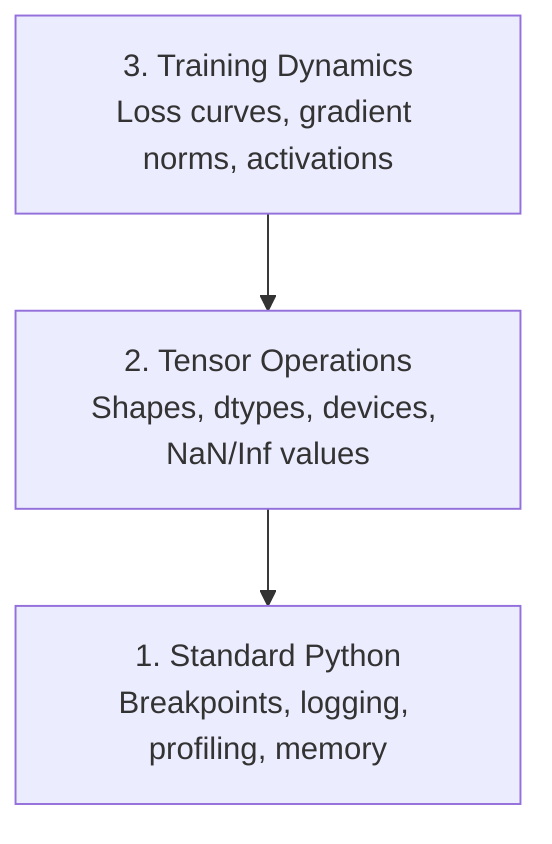

# 调试与性能分析

> 最糟糕的 AI 错误并不会导致程序崩溃。它们会在错误的数据上默默训练，并生成看似完美的损失曲线。

**类型：** 构建
**语言：** Python
**前置要求：** 第 1 课（开发环境），具备基本的 PyTorch 使用知识
**耗时：** 约 60 分钟

## 学习目标

- 使用条件化的 `breakpoint()` 和 `debug_print` 函数，在训练过程中检查张量的形状、数据类型以及 NaN 值。  
- 利用 `cProfile`、`line_profiler` 和 `tracemalloc` 对训练循环进行性能分析，以定位性能瓶颈。  
- 识别常见的 AI 编程错误：形状不匹配、NaN 损失、数据泄露以及错误的设备类型张量。  
- 部署 TensorBoard 用于可视化损失曲线、权重直方图及梯度分布情况。

## 问题所在

AI代码的故障表现与普通代码不同。Web应用出现故障时会显示堆栈跟踪信息。而配置错误的训练循环可能会运行8小时，耗费200美元的GPU计算资源，最终生成的模型却只能预测所有输入值的平均值。实际上，这类代码并未报出任何错误。其根本原因可能是张量位于错误的设备上、遗漏了`.detach()`操作，或是标签数据泄露到了特征向量中。

你需要具备相应的调试工具，以便在这些问题造成时间与算力浪费之前将其捕获。

## 概念概述

AI 调试在三个层级上进行：



大多数人会直接跳到第3阶段（盯着TensorBoard看）。但实际上，80%的AI漏洞都出现在第1和第2阶段。

## 构建它

### 第1部分：打印调试（没错，这确实有效）

打印调试功能常被忽视，但实际上不应如此。对于张量代码而言，使用有针对性的打印语句比通过调试器逐步执行更高效，因为这样能够一次性查看数据的形状、数据类型以及数值范围。

```python
def debug_print(name, tensor):
    print(f"{name}: shape={tensor.shape}, dtype={tensor.dtype}, "
          f"device={tensor.device}, "
          f"min={tensor.min().item():.4f}, max={tensor.max().item():.4f}, "
          f"mean={tensor.mean().item():.4f}, "
          f"has_nan={tensor.isnan().any().item()}")
```

在每次执行可疑操作后调用此函数。找到错误后，移除打印语句即可。很简单。

### 第 2 部分：Python 调试器（pdb 与断点设置）

在人工智能开发中，内置的调试器往往被低估了。只需在训练循环中调用 `breakpoint()` 即可交互式地查看张量数据。

```python
def training_step(model, batch, criterion, optimizer):
    inputs, labels = batch
    outputs = model(inputs)
    loss = criterion(outputs, labels)

    if loss.item() > 100 or torch.isnan(loss):
        breakpoint()

    loss.backward()
    optimizer.step()
```

当调试器将控制权交给你时，以下命令十分实用：

- 使用 `p outputs.shape` 查看张量形状
- 使用 `p loss.item()` 查看损失值
- 使用 `p torch.isnan(outputs).sum()` 统计 NaN 值的数量
- 使用 `p model.fc1.weight.grad` 检查梯度
- 输入 `c` 继续执行，输入 `q` 退出

这是一种条件式调试方式。只有在检测到异常时才会暂停执行。在长达 10,000 步的训练过程中，这一点尤为重要。

### 第 3 部分：Python 日志记录

当调试工作不再局限于简单检查时，请用日志记录功能替换打印语句。

```python
import logging

logging.basicConfig(
    level=logging.INFO,
    format="%(asctime)s [%(levelname)s] %(message)s",
    handlers=[
        logging.FileHandler("training.log"),
        logging.StreamHandler()
    ]
)
logger = logging.getLogger(__name__)

logger.info("Starting training: lr=%.4f, batch_size=%d", lr, batch_size)
logger.warning("Loss spike detected: %.4f at step %d", loss.item(), step)
logger.error("NaN loss at step %d, stopping", step)
```

日志记录会提供时间戳、严重级别以及文件输出内容。当训练在凌晨 3 点失败时，你需要的是日志文件，而非会迅速滚出屏幕的终端输出。

### 第 4 部分：代码段的时序控制

了解时间消耗的去向是实现优化的第一步。

```python
import time

class Timer:
    def __init__(self, name=""):
        self.name = name

    def __enter__(self):
        self.start = time.perf_counter()
        return self

    def __exit__(self, *args):
        elapsed = time.perf_counter() - self.start
        print(f"[{self.name}] {elapsed:.4f}s")

with Timer("data loading"):
    batch = next(dataloader_iter)

with Timer("forward pass"):
    outputs = model(batch)

with Timer("backward pass"):
    loss.backward()
```

常见现象：数据加载占到了训练时间的60%。解决方案是在DataLoader中设置`num_workers > 0`，而非更换更快的GPU。

### 第 5 部分：cProfile 与 line_profiler

当需要超越手动计时器的功能时：

```bash
python -m cProfile -s cumtime train.py
```

此图按累计时间对所有函数调用进行了排序。如需逐行性能分析：

```bash
pip install line_profiler
```

```python
@profile
def train_step(model, data, target):
    output = model(data)
    loss = F.cross_entropy(output, target)
    loss.backward()
    return loss

# Run with: kernprof -l -v train.py
```

### 第 6 部分：内存性能分析

#### 使用 tracemalloc 监控 CPU 与内存使用情况

```python
import tracemalloc

tracemalloc.start()

# your code here
model = build_model()
data = load_dataset()

snapshot = tracemalloc.take_snapshot()
top_stats = snapshot.statistics("lineno")
for stat in top_stats[:10]:
    print(stat)
```

#### 使用 memory_profiler 进行 CPU 和内存性能分析

```bash
pip install memory_profiler
```

```python
from memory_profiler import profile

@profile
def load_data():
    raw = read_csv("data.csv")       # watch memory jump here
    processed = preprocess(raw)       # and here
    return processed
```

使用 `python -m memory_profiler your_script.py` 命令运行，即可查看逐行的内存使用情况。

#### 使用 PyTorch 的 GPU 内存管理

```python
import torch

if torch.cuda.is_available():
    print(torch.cuda.memory_summary())

    print(f"Allocated: {torch.cuda.memory_allocated() / 1e9:.2f} GB")
    print(f"Cached: {torch.cuda.memory_reserved() / 1e9:.2f} GB")
```

当遇到内存不足（OOM）问题时：

1. 减小批量大小（始终应首先尝试的解决方法）
2. 使用 `torch.cuda.empty_cache()` 来释放缓存中的内存
3. 对于较大的中间变量，先执行 `del tensor`，再调用 `torch.cuda.empty_cache()`
4. 采用混合精度训练（`torch.cuda.amp`）以将内存占用降低一半
5. 对于非常深的模型，使用梯度检查点技术

### 第 7 部分：常见的 AI 编程错误及排查方法

#### 形状不匹配

最常见的错误。张量的形状为 `[batch, features]`，而模型期望的形状却是 `[batch, channels, height, width]`。

```python
def check_shapes(model, sample_input):
    print(f"Input: {sample_input.shape}")
    hooks = []

    def make_hook(name):
        def hook(module, inp, out):
            in_shape = inp[0].shape if isinstance(inp, tuple) else inp.shape
            out_shape = out.shape if hasattr(out, "shape") else type(out)
            print(f"  {name}: {in_shape} -> {out_shape}")
        return hook

    for name, module in model.named_modules():
        hooks.append(module.register_forward_hook(make_hook(name)))

    with torch.no_grad():
        model(sample_input)

    for h in hooks:
        h.remove()
```

使用示例批次运行一次该命令。它将映射模型中的所有形状变换。

#### NaN 损失值

NaN 损失表明模型出现了数值爆炸现象。常见原因包括：

- 学习率过高
- 自定义损失函数中存在除以零的情况
- 对零或负数取对数
- RNN 中的梯度爆炸

```python
def detect_nan(model, loss, step):
    if torch.isnan(loss):
        print(f"NaN loss at step {step}")
        for name, param in model.named_parameters():
            if param.grad is not None:
                if torch.isnan(param.grad).any():
                    print(f"  NaN gradient in {name}")
                if torch.isinf(param.grad).any():
                    print(f"  Inf gradient in {name}")
        return True
    return False
```

#### 数据泄露

您的模型在测试集上的准确率达到了99%。听起来很不错。其实这是个漏洞。

```python
def check_data_leakage(train_set, test_set, id_column="id"):
    train_ids = set(train_set[id_column].tolist())
    test_ids = set(test_set[id_column].tolist())
    overlap = train_ids & test_ids
    if overlap:
        print(f"DATA LEAKAGE: {len(overlap)} samples in both train and test")
        return True
    return False
```

同时需检查时间泄漏问题：即使用未来数据来预测过去的情况。在拆分数据之前，应先按时间戳进行排序。

#### 设备错误

不同设备（CPU 与 GPU）上的张量会导致运行时错误。但有时，尽管其他所有内容都在 GPU 上，某个张量仍会默默地保留在 CPU 上，从而导致训练速度变慢。

```python
def check_devices(model, *tensors):
    model_device = next(model.parameters()).device
    print(f"Model device: {model_device}")
    for i, t in enumerate(tensors):
        if t.device != model_device:
            print(f"  WARNING: tensor {i} on {t.device}, model on {model_device}")
```

### 第 8 部分：TensorBoard 基础知识

TensorBoard 可以展示训练过程中随时间变化的内部状态。

```bash
pip install tensorboard
```

```python
from torch.utils.tensorboard import SummaryWriter

writer = SummaryWriter("runs/experiment_1")

for step in range(num_steps):
    loss = train_step(model, batch)

    writer.add_scalar("loss/train", loss.item(), step)
    writer.add_scalar("lr", optimizer.param_groups[0]["lr"], step)

    if step % 100 == 0:
        for name, param in model.named_parameters():
            writer.add_histogram(f"weights/{name}", param, step)
            if param.grad is not None:
                writer.add_histogram(f"grads/{name}", param.grad, step)

writer.close()
```

启动它：

```bash
tensorboard --logdir=runs
```

需要注意的迹象：

- **损失值不下降**：学习率过低，或模型架构存在问题
- **损失值剧烈波动**：学习率过高
- **损失值变为 NaN**：数值不稳定（参见上文的 NaN 部分）
- **训练集损失下降，验证集损失上升**：过拟合
- **权重直方图趋近于零**：梯度消失
- **梯度直方图数值过大**：需要进行梯度裁剪

### 第 9 部分：VS Code 调试器

如需进行交互式调试，请通过配置 `launch.json` 文件来设置 VS Code：

```json
{
    "version": "0.2.0",
    "configurations": [
        {
            "name": "Debug Training",
            "type": "debugpy",
            "request": "launch",
            "program": "${file}",
            "console": "integratedTerminal",
            "justMyCode": false
        }
    ]
}
```

通过代码缩进栏点击即可设置断点。可使用“变量”面板来查看张量的属性。“调试控制台”则允许你在程序执行过程中运行任意的 Python 表达式。

这对于需要逐个查看数据预处理流程中各转换步骤的场景非常有用。

## 使用它

以下是用于排查大多数 AI 错误的调试工作流程：

1. **训练前**：使用一个样本批次运行 `check_shapes` 命令，确认输入与输出维度符合预期。
2. **前 10 步迭代**：对损失值、模型输出及梯度使用 `debug_print` 进行打印，确保没有出现 NaN 值，并且所有数值都在合理范围内。
3. **训练过程中**：记录损失值、学习率以及梯度的范数，并利用 TensorBoard 工具进行可视化分析。
4. **出现故障时**：在故障发生的位置设置 `breakpoint()`，以便交互式地查看相关张量数据。
5. **性能优化**：测量数据加载、前向传播及反向传播各阶段的耗时；如果内存使用接近上限（OOM），则需对内存占用情况进行分析。

## 发布它

运行调试工具包脚本：

```bash
python phases/00-setup-and-tooling/12-debugging-and-profiling/code/debug_tools.py
```

请参阅 `outputs/prompt-debug-ai-code.md`，其中包含可用于诊断 AI 相关错误的提示语。

## 练习题

1. 运行 `debug_tools.py` 并查看每个部分的输出。修改该示例模型以引入 NaN 值（提示：在前向传播过程中进行除零操作），观察检测器是否能够捕获到该异常。
2. 使用 `cProfile` 对训练循环进行性能分析，找出执行速度最慢的函数。
3. 利用 `tracemalloc` 查明数据加载流程中哪一行代码消耗了最多的内存。
4. 为一次简单的训练运行配置 TensorBoard，判断模型是否存在过拟合现象。
5. 在训练循环中使用 `breakpoint()` 函数。在调试器提示符下练习查看张量形状、设备信息以及梯度值。
