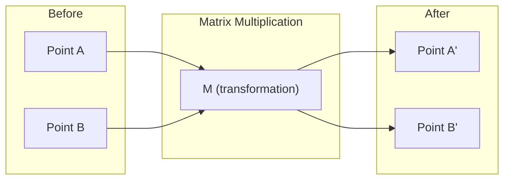
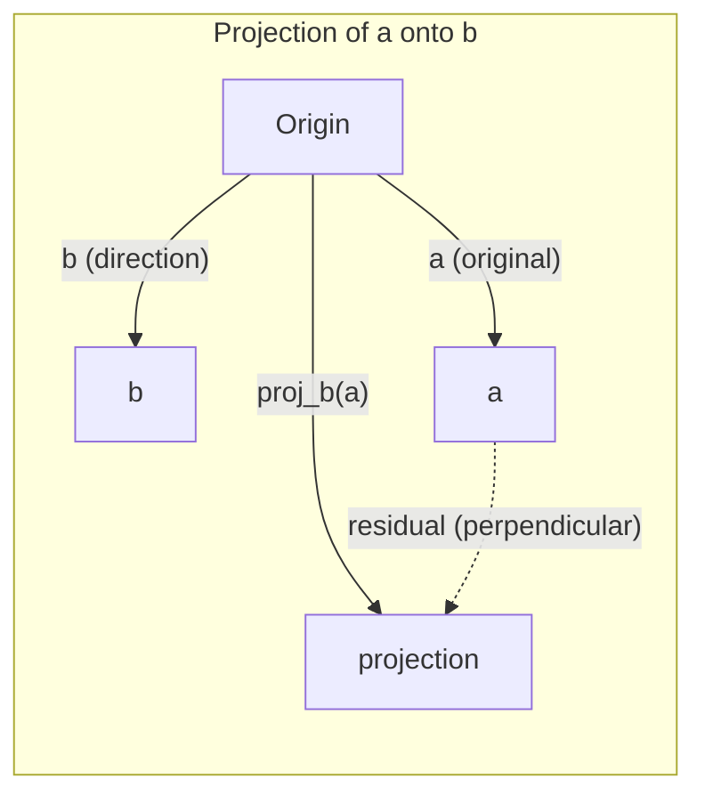

# 线性代数直觉理解

> 每个人工智能模型，本质上不过是披着华丽外衣的矩阵数学运算。

**类型：** 学习
**语言：** Python、Julia
**先修要求：** 第 0 阶段
**时长：** 约 60 分钟

## 学习目标

- 用 Python 从零实现向量与矩阵运算（加法、点积、矩阵乘法）
- 从几何角度解释点积、投影以及 Gram-Schmidt 过程的作用
- 通过行简化方法判断一组向量的线性独立性、秩及基
- 将线性代数概念与其在人工智能领域的应用联系起来：嵌入向量、注意力分数以及 LoRA

## 问题所在

打开任何一篇机器学习论文，在第一页你就会看到向量、矩阵、点积以及各种变换。如果没有线性代数的直觉，这些只不过是符号而已；而具备这种直觉后，你就能理解神经网络实际上在做什么——即在空间中移动点。

你不必成为数学家。你需要从几何角度理解这些运算的含义，然后自己用代码实现它们。

## 概念概述

### 向量即点与方向

向量本质上只是一组数字的列表。但这些数字具有特定含义——它们代表空间中的坐标。

**2D向量 [3, 2]：**

| x | y | 点坐标 |
|---|---|-------|
| 3 | 2 | 该向量从原点 (0,0) 指向平面上的点 (3, 2) |

该向量的模长为 sqrt(3^2 + 2^2) = sqrt(13)，方向为向上且向右。

在人工智能领域，向量用于表示一切内容：
- 一个单词 → 由768个数字构成的向量（即其在嵌入空间中的“含义”）
- 一张图像 → 包含数百万像素值的向量
- 一名用户 → 表示其偏好的向量

### 矩阵即变换工具

矩阵可将一个向量转换为另一个向量。它能够执行旋转、缩放、拉伸或投影等操作。



在人工智能领域，矩阵就是模型本身：
- 神经网络权重 → 用于将输入转换为输出的矩阵
- 注意力分数 → 决定关注重点的矩阵
- 嵌入向量 → 将单词映射为向量的矩阵

### 点积用于衡量相似度

两个向量的点积可以反映它们之间的相似程度。

```
a · b = a₁×b₁ + a₂×b₂ + ... + aₙ×bₙ

Same direction:      a · b > 0  (similar)
Perpendicular:       a · b = 0  (unrelated)
Opposite direction:  a · b < 0  (dissimilar)
```

搜索引擎、推荐系统以及 RAG 的工作原理实际上就是如此——通过寻找点积较高的向量来实现。

### 线性无关性

如果集合中的任何向量都无法表示为其他向量的线性组合，则这些向量是线性独立的。若 v1、v2、v3 是线性独立的，它们将构成一个 3D 空间；而如果其中一个向量是其他向量的线性组合，它们则仅能构成一个平面。

这对 AI 的重要性在于：特征矩阵的列必须保持线性独立。如果两个特征之间存在完全相关性（即线性依赖），模型将无法区分它们的影响。这会在回归分析中引发多重共线性问题——权重矩阵会变得不稳定，微小的输入变化就会导致输出出现剧烈波动。

**具体示例：**

```
v1 = [1, 0, 0]
v2 = [0, 1, 0]
v3 = [2, 1, 0]   # v3 = 2*v1 + v2
```

v1 和 v2 是相互独立的——二者既非彼此的标量倍数，也非线性组合。但由于 v3 = 2*v1 + v2，因此 {v1, v2, v3} 构成一个线性相关的向量集。这三个向量均位于 xy 平面内，无论以何种方式组合它们，都无法得到 [0, 0, 1] 这个向量。虽然拥有三个向量，但实际上只有两个自由度。

在数据集中：如果 feature_3 = 2*feature_1 + feature_2，加入 feature_3 后模型将无法获得任何新信息。更糟糕的是，这会导致正规方程奇异——权重不存在唯一解。

### 基础与等级

基组是由一组线性无关的向量构成的最小集合，这些向量能够张成整个空间。基向量的数量即为该空间的维数。

三维空间的标准基组为 `{[1,0,0], [0,1,0], [0,0,1]}`。但实际上，任何三个在三维空间中相互独立的向量都可以构成有效的基组。选择何种基组实际上就等同于选择了坐标系。

矩阵的秩等于其线性无关列的数量，也等于其线性无关行的数量。若矩阵的秩小于行数与列数中的较小值，则该矩阵为欠秩矩阵。这意味着：
- 方程组有无限多解（或无解）
- 变换过程中会丢失信息
- 该矩阵无法求逆

| 情况 | 秩 | 对机器学习的影响 |
|-----------|------|---------------------|
| 满秩（秩 = min(m, n)） | 达到最大可能值 | 存在唯一的最小二乘解。模型条件良好。 |
| 欠秩（秩 < min(m, n)） | 低于最大值 | 特征之间存在冗余。权重存在无限多组解。需要采用正则化技术。 |
| 秩为1 | 1 | 每一列都是某个向量的缩放版本。所有数据都位于一条直线上。 |
| 接近欠秩状态（奇异值较小） | 数值上较低 | 矩阵条件较差。微小的输入噪声就会导致输出出现较大变化。应使用SVD截断或岭回归方法。 |

### 投影

将向量 **a** 投影到向量 **b** 上，可以得到 **a** 在 **b** 方向上的分量：

```
proj_b(a) = (a dot b / b dot b) * b
```

残差（a - proj_b(a)）与 b 垂直。这种正交分解是最小二乘拟合的基础。

投影在机器学习中无处不在：
- 线性回归旨在最小化观测值到列空间之间的距离——其解本身就是一种投影
- 主成分分析将数据投影到方差最大的方向上
- Transformer 中的注意力机制用于计算查询向量的键向量投影



**示例：** a = [3, 4], b = [1, 0]

proj_b(a) = (3*1 + 4*0) / (1*1 + 0*0) * [1, 0] = 3 * [1, 0] = [3, 0]

该投影操作会丢弃 y 分量。这便是最简单的降维方式——舍去那些无关紧要的方向。

### 格拉姆-施密特正交化过程

将任意一组独立向量转换为正交标准基。所谓正交标准基，是指每个向量的模长均为1，且任意两个向量均相互垂直。

算法步骤：
1. 取第一个向量，并对其进行归一化处理。
2. 取第二个向量，减去其在第一个向量上的投影值后，再进行归一化处理。
3. 取第三个向量，减去其在所有先前向量上的投影值后，再进行归一化处理。
4. 对剩余的向量重复上述步骤。

```
Input:  v1, v2, v3, ... (linearly independent)

u1 = v1 / |v1|

w2 = v2 - (v2 dot u1) * u1
u2 = w2 / |w2|

w3 = v3 - (v3 dot u1) * u1 - (v3 dot u2) * u2
u3 = w3 / |w3|

Output: u1, u2, u3, ... (orthonormal basis)
```

这就是 QR 分解在内部的工作原理。Q 表示正交标准基，R 则用于存储投影系数。QR 分解被应用于以下场景：
- 求解线性方程组（相比高斯消元法更为稳定）
- 计算特征值（QR 算法）
- 最小二乘回归（标准的数值方法）

```figure
eigen-directions
```

## 构建它

### 步骤 1：从零开始学习向量（Python）

```python
class Vector:
    def __init__(self, components):
        self.components = list(components)
        self.dim = len(self.components)

    def __add__(self, other):
        return Vector([a + b for a, b in zip(self.components, other.components)])

    def __sub__(self, other):
        return Vector([a - b for a, b in zip(self.components, other.components)])

    def dot(self, other):
        return sum(a * b for a, b in zip(self.components, other.components))

    def magnitude(self):
        return sum(x**2 for x in self.components) ** 0.5

    def normalize(self):
        mag = self.magnitude()
        return Vector([x / mag for x in self.components])

    def cosine_similarity(self, other):
        return self.dot(other) / (self.magnitude() * other.magnitude())

    def __repr__(self):
        return f"Vector({self.components})"


a = Vector([1, 2, 3])
b = Vector([4, 5, 6])

print(f"a + b = {a + b}")
print(f"a · b = {a.dot(b)}")
print(f"|a| = {a.magnitude():.4f}")
print(f"cosine similarity = {a.cosine_similarity(b):.4f}")
```

### 步骤 2：从零构建矩阵（Python）

```python
class Matrix:
    def __init__(self, rows):
        self.rows = [list(row) for row in rows]
        self.shape = (len(self.rows), len(self.rows[0]))

    def __matmul__(self, other):
        if isinstance(other, Vector):
            return Vector([
                sum(self.rows[i][j] * other.components[j] for j in range(self.shape[1]))
                for i in range(self.shape[0])
            ])
        rows = []
        for i in range(self.shape[0]):
            row = []
            for j in range(other.shape[1]):
                row.append(sum(
                    self.rows[i][k] * other.rows[k][j]
                    for k in range(self.shape[1])
                ))
            rows.append(row)
        return Matrix(rows)

    def transpose(self):
        return Matrix([
            [self.rows[j][i] for j in range(self.shape[0])]
            for i in range(self.shape[1])
        ])

    def __repr__(self):
        return f"Matrix({self.rows})"


rotation_90 = Matrix([[0, -1], [1, 0]])
point = Vector([3, 1])

rotated = rotation_90 @ point
print(f"Original: {point}")
print(f"Rotated 90°: {rotated}")
```

### 步骤 3：为何这对人工智能至关重要

```python
import random

random.seed(42)
weights = Matrix([[random.gauss(0, 0.1) for _ in range(3)] for _ in range(2)])
input_vector = Vector([1.0, 0.5, -0.3])

output = weights @ input_vector
print(f"Input (3D): {input_vector}")
print(f"Output (2D): {output}")
print("This is what a neural network layer does -- matrix multiplication.")
```

### 步骤 4：Julia 版本

```julia
a = [1.0, 2.0, 3.0]
b = [4.0, 5.0, 6.0]

println("a + b = ", a + b)
println("a · b = ", a ⋅ b)       # Julia supports unicode operators
println("|a| = ", √(a ⋅ a))
println("cosine = ", (a ⋅ b) / (√(a ⋅ a) * √(b ⋅ b)))

# Matrix-vector multiplication
W = [0.1 -0.2 0.3; 0.4 0.5 -0.1]
x = [1.0, 0.5, -0.3]
println("Wx = ", W * x)
println("This is a neural network layer.")
```

### 第 5 步：从零开始理解线性无关性与投影（Python）

```python
def is_linearly_independent(vectors):
    n = len(vectors)
    dim = len(vectors[0].components)
    mat = Matrix([v.components[:] for v in vectors])
    rows = [row[:] for row in mat.rows]
    rank = 0
    for col in range(dim):
        pivot = None
        for row in range(rank, len(rows)):
            if abs(rows[row][col]) > 1e-10:
                pivot = row
                break
        if pivot is None:
            continue
        rows[rank], rows[pivot] = rows[pivot], rows[rank]
        scale = rows[rank][col]
        rows[rank] = [x / scale for x in rows[rank]]
        for row in range(len(rows)):
            if row != rank and abs(rows[row][col]) > 1e-10:
                factor = rows[row][col]
                rows[row] = [rows[row][j] - factor * rows[rank][j] for j in range(dim)]
        rank += 1
    return rank == n


def project(a, b):
    scalar = a.dot(b) / b.dot(b)
    return Vector([scalar * x for x in b.components])


def gram_schmidt(vectors):
    orthonormal = []
    for v in vectors:
        w = v
        for u in orthonormal:
            proj = project(w, u)
            w = w - proj
        if w.magnitude() < 1e-10:
            continue
        orthonormal.append(w.normalize())
    return orthonormal


v1 = Vector([1, 0, 0])
v2 = Vector([1, 1, 0])
v3 = Vector([1, 1, 1])
basis = gram_schmidt([v1, v2, v3])
for i, u in enumerate(basis):
    print(f"u{i+1} = {u}")
    print(f"  |u{i+1}| = {u.magnitude():.6f}")

print(f"u1 · u2 = {basis[0].dot(basis[1]):.6f}")
print(f"u1 · u3 = {basis[0].dot(basis[2]):.6f}")
print(f"u2 · u3 = {basis[1].dot(basis[2]):.6f}")
```

## 使用它

现在来看 NumPy 的相同用法——即实际开发中会用到的内容：

```python
import numpy as np

a = np.array([1, 2, 3], dtype=float)
b = np.array([4, 5, 6], dtype=float)

print(f"a + b = {a + b}")
print(f"a · b = {np.dot(a, b)}")
print(f"|a| = {np.linalg.norm(a):.4f}")
print(f"cosine = {np.dot(a, b) / (np.linalg.norm(a) * np.linalg.norm(b)):.4f}")

W = np.random.randn(2, 3) * 0.1
x = np.array([1.0, 0.5, -0.3])
print(f"Wx = {W @ x}")
```

### 使用 NumPy 进行排序、投影与 QR 分解

```python
import numpy as np

A = np.array([[1, 2], [2, 4]])
print(f"Rank: {np.linalg.matrix_rank(A)}")

a = np.array([3, 4])
b = np.array([1, 0])
proj = (np.dot(a, b) / np.dot(b, b)) * b
print(f"Projection of {a} onto {b}: {proj}")

Q, R = np.linalg.qr(np.random.randn(3, 3))
print(f"Q is orthogonal: {np.allclose(Q @ Q.T, np.eye(3))}")
print(f"R is upper triangular: {np.allclose(R, np.triu(R))}")
```

### PyTorch —— 张量即带自动微分的向量

```python
import torch

x = torch.randn(3, requires_grad=True)
y = torch.tensor([1.0, 0.0, 0.0])

similarity = torch.dot(x, y)
similarity.backward()

print(f"x = {x.data}")
print(f"y = {y.data}")
print(f"dot product = {similarity.item():.4f}")
print(f"d(dot)/dx = {x.grad}")
```

点积对 x 的梯度其实就是 y。PyTorch 会自动计算这一结果。神经网络中的每一个操作都是由这类运算构成的——矩阵乘法、点积、投影等——而 autodiff 则会追踪所有这些运算的梯度。

你刚刚从头实现的功能，正是 NumPy 用一行代码就能完成的任务。现在你已经了解了其背后的运作原理。

## 发布它

本课程将生成以下内容：
- `outputs/prompt-linear-algebra-tutor.md` -- 用于指导 AI 助手通过几何直观方式教授线性代数的提示语

## 连接

本课内容均与现代人工智能的特定技术环节密切相关：

| 概念 | 应用场景 |
|---------|----------|
| 点积 | Transformer模型中的注意力分数计算，RAG系统中的余弦相似度计算 |
| 矩阵乘法 | 所有神经网络层及各类线性变换 |
| 线性无关性 | 特征选择，避免多重共线性问题 |
| 秩 | 判断方程组是否有解，以及LoRA（低秩适配）技术 |
| 投影 | 线性回归（将数据投影到列空间），主成分分析（PCA） |
| 格拉姆-施密特法 / QR分解 | 数值求解器，特征值计算 |
| 正交标准基 | 稳定的数值计算，白化变换 |

LoRA值得特别提及。它通过将权重更新分解为低秩矩阵的方式对大型语言模型进行微调。相比直接更新4096×4096尺寸的权重矩阵（包含1600万个参数），LoRA仅需更新两个分别为4096×16和16×4096尺寸的矩阵（共13.1万个参数）。由于受16秩的限制，LoRA假定权重更新仅发生在完整4096维空间中的16维子空间内。这正是线性代数在实际应用中的体现。

## 练习题

1. 实现 `Vector.angle_between(other)` 方法，该方法返回两个向量之间的角度（以度为单位）。
2. 创建一个二维缩放矩阵，该矩阵将 x 坐标放大为原来的两倍，y 坐标放大为原来的三倍，然后将此矩阵应用于向量 [1, 1]。
3. 给定 5 个维度为 50 的随机“词向量”，使用余弦相似度找出其中最相似的两个向量。
4. 验证 Gram-Schmidt 正交化算法的输出是否真正满足正交归一条件：检查任意两向量之间的点积是否为 0，且每个向量的模长是否为 1。
5. 创建一个秩为 2 的 3×3 矩阵。使用 `rank()` 方法进行验证，然后解释该矩阵的列所张成的几何对象是什么。
6. 将向量 [1, 2, 3] 投影到向量 [1, 1, 1] 上。从几何角度而言，该结果代表什么？

## 关键术语

| 术语 | 通俗说法 | 实际含义 |
|------|----------|----------|
| 向量 | “箭头” | 表示 n 维空间中某一点或方向的数字列表 |
| 矩阵 | “数字表格” | 将向量从一个空间映射到另一个空间的变换工具 |
| 点积 | “相乘后求和” | 衡量两个向量对齐程度的指标——相似性搜索的核心依据 |
| 嵌入向量 | “某种 AI 魔法” | 代表事物（单词、图像、用户等）含义的向量 |
| 线性无关 | “彼此不重叠” | 集合中的任何向量都无法表示为其他向量的线性组合 |
| 秩 | “维度数量” | 矩阵中线性无关的列（或行）的数量 |
| 投影 | “影子” | 一个向量在另一个向量方向上的分量 |
| 基 | “坐标轴” | 能够张成该空间的最小组合线性无关向量集 |
| 正交归一化向量 | “互相垂直的单位向量” | 两两相互垂直且长度均为 1 的向量 |
