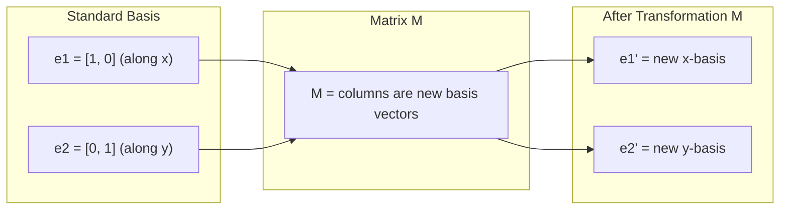
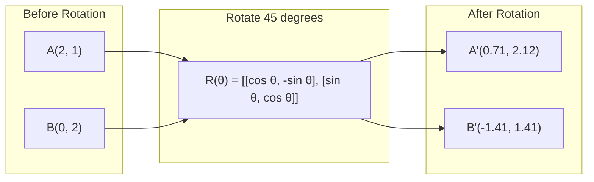
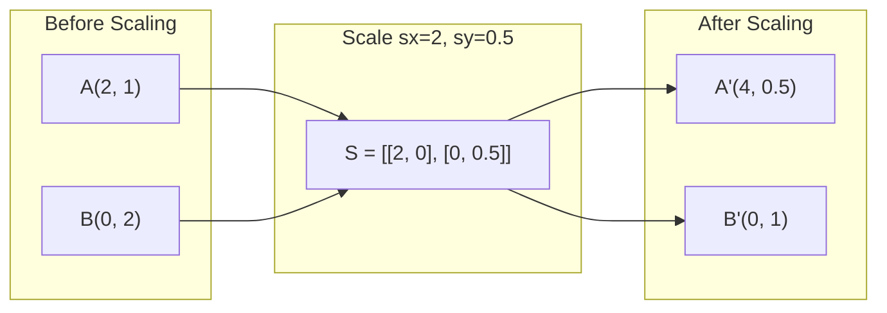
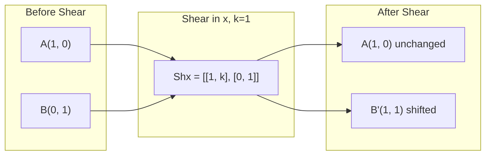
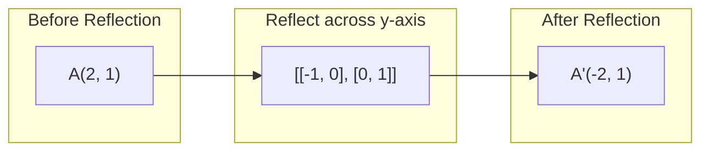
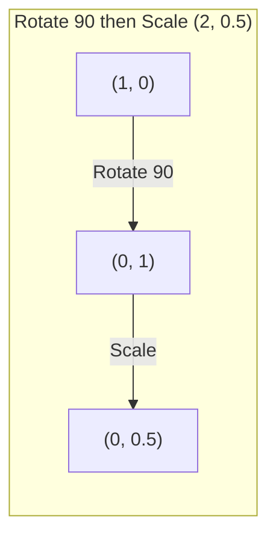
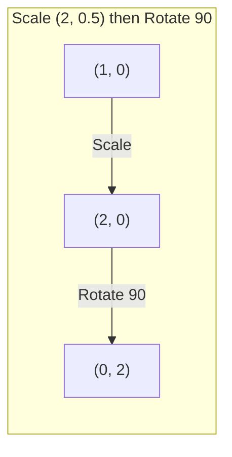

# 矩阵变换

> 矩阵是一种用于重塑空间的数学工具。了解它对每个点的作用，即可掌握整个变换过程。

**类型：** 实践构建
**语言：** Python、Julia
**先修要求：** 第一阶段，课程 01-02（线性代数直觉、向量与矩阵运算）
**时长：** 约 75 分钟

## 学习目标

- 构建旋转、缩放、剪切和反射矩阵，并将其应用于二维及三维点上  
- 通过矩阵乘法组合多个变换，验证变换顺序的重要性  
- 根据特征方程计算2×2矩阵的特征值与特征向量  
- 阐述为何特征值决定了主成分分析的方向、RNN的稳定性以及谱聚类的行为

## 问题所在

你阅读关于 PCA 的内容时，会看到“求协方差矩阵的特征向量”。在研究模型稳定性时，会看到“检查所有特征值的模是否小于 1”。而在学习数据增强时，则会提到“进行随机旋转”。除非理解矩阵在几何空间中的作用，否则这些概念都难以理解。

矩阵并非仅仅是数字网格，它们其实是空间运算工具。旋转矩阵用于旋转点；缩放矩阵用于拉伸点；剪切矩阵则用于倾斜点。神经网络对数据施加的每一次变换，都是这些操作之一或它们的组合。本课将把这些操作具体化。

## 概念概述

### 矩阵表示的变换

任何二维线性变换都可以表示为一个2×2矩阵。该矩阵能够精确地指示基向量[1, 0]和[0, 1]变换后的位置，其余的变换结果均可由此推导得出。



### 旋转

角度为 theta 的二维旋转能够保持距离和角度不变，同时使所有点沿圆弧移动。



在三维空间中，旋转是围绕某个轴进行的。每个轴都有其对应的旋转矩阵：

```
Rz(theta) = | cos  -sin  0 |     Rotate around z-axis
            | sin   cos  0 |     (x-y plane spins, z stays)
            |  0     0   1 |

Rx(theta) = | 1   0     0    |   Rotate around x-axis
            | 0  cos  -sin   |   (y-z plane spins, x stays)
            | 0  sin   cos   |

Ry(theta) = |  cos  0  sin |     Rotate around y-axis
            |   0   1   0  |     (x-z plane spins, y stays)
            | -sin  0  cos |
```

### 扩展规模

缩放会沿各轴独立地进行拉伸或压缩。



### 剪切

剪切操作会改变一个轴的方向，同时保持另一个轴不变。该操作会将矩形转换为平行四边形。



剪切矩阵：
- `Shx = [[1, k], [0, 1]]` 使 x 坐标平移 k * y 的距离
- `Shy = [[1, 0], [k, 1]]` 使 y 坐标平移 k * x 的距离

### 反射

反射会沿轴或直线将点对称映射。



反射矩阵：
- 关于 y 轴反射：`[[-1, 0], [0, 1]]`
- 关于 x 轴反射：`[[1, 0], [0, -1]]`

### 组合：变换的链式调用

先应用变换 A 再应用变换 B，等同于将它们的矩阵相乘：`result = B @ A @ point`。顺序很重要。先旋转再缩放得到的结果与先缩放再旋转不同。



组成：`S @ R = [[0, -2], [0.5, 0]]`



计算结果：`R @ S = [[0, -0.5], [2, 0]]`

结果不同。矩阵乘法不满足交换律。

### 特征值与特征向量

大多数向量在矩阵作用下都会改变方向。而特征向量则不同：矩阵仅会对它们进行缩放，而不会使其旋转。该缩放因子即为特征值。

```
A @ v = lambda * v

v is the eigenvector (direction that survives)
lambda is the eigenvalue (how much it stretches)

Example: A = | 2  1 |
             | 1  2 |

Eigenvector [1, 1] with eigenvalue 3:
  A @ [1,1] = [3, 3] = 3 * [1, 1]     (same direction, scaled by 3)

Eigenvector [1, -1] with eigenvalue 1:
  A @ [1,-1] = [1, -1] = 1 * [1, -1]  (same direction, unchanged)
```

该矩阵沿 [1, 1] 方向将空间拉伸 3 倍，同时保持 [1, -1] 方向不变。其他所有方向均为这两个方向的组合。

### 特征分解

如果一个矩阵拥有 n 个线性无关的特征向量，则它可以被分解为：

```
A = V @ D @ V^(-1)

V = matrix whose columns are eigenvectors
D = diagonal matrix of eigenvalues
V^(-1) = inverse of V

This says: rotate into eigenvector coordinates, scale along each axis, rotate back.
```

### 为何特征值如此重要

**PCA。** 协方差矩阵的特征向量即为主成分，而特征值则反映了每个主成分所捕获的方差大小。通过按特征值排序并保留前 k 个，即可实现降维。

**稳定性。** 在循环网络和动态系统中，模长大于 1 的特征值会导致输出值发散，而模长小于 1 的特征值则会导致输出值趋近于零。这便是梯度消失/爆炸问题的一句概括。

**谱方法。** 图神经网络利用邻接矩阵的特征值，而谱聚类则使用拉普拉斯矩阵的特征值。这些特征向量能够揭示图的结构特征。

### 行列式作为体积缩放因子

变换矩阵的行列式可以告诉你该矩阵对面积（二维）或体积（三维）的缩放程度。

```
det = 1:   area preserved (rotation)
det = 2:   area doubled
det = 0:   space crushed to lower dimension (singular)
det = -1:  area preserved but orientation flipped (reflection)

| det(Rotation) | = 1        (always)
| det(Scale sx, sy) | = sx * sy
| det(Shear) | = 1           (area preserved)
| det(Reflection) | = -1     (orientation flipped)
```

```figure
matrix-transform
```

## 构建它

### 步骤 1：从零实现变换矩阵（Python）

```python
import math

def rotation_2d(theta):
    c, s = math.cos(theta), math.sin(theta)
    return [[c, -s], [s, c]]

def scaling_2d(sx, sy):
    return [[sx, 0], [0, sy]]

def shearing_2d(kx, ky):
    return [[1, kx], [ky, 1]]

def reflection_x():
    return [[1, 0], [0, -1]]

def reflection_y():
    return [[-1, 0], [0, 1]]

def mat_vec_mul(matrix, vector):
    return [
        sum(matrix[i][j] * vector[j] for j in range(len(vector)))
        for i in range(len(matrix))
    ]

def mat_mul(a, b):
    rows_a, cols_b = len(a), len(b[0])
    cols_a = len(a[0])
    return [
        [sum(a[i][k] * b[k][j] for k in range(cols_a)) for j in range(cols_b)]
        for i in range(rows_a)
    ]

point = [1.0, 0.0]
angle = math.pi / 4

rotated = mat_vec_mul(rotation_2d(angle), point)
print(f"Rotate (1,0) by 45 deg: ({rotated[0]:.4f}, {rotated[1]:.4f})")

scaled = mat_vec_mul(scaling_2d(2, 3), [1.0, 1.0])
print(f"Scale (1,1) by (2,3): ({scaled[0]:.1f}, {scaled[1]:.1f})")

sheared = mat_vec_mul(shearing_2d(1, 0), [1.0, 1.0])
print(f"Shear (1,1) kx=1: ({sheared[0]:.1f}, {sheared[1]:.1f})")

reflected = mat_vec_mul(reflection_y(), [2.0, 1.0])
print(f"Reflect (2,1) across y: ({reflected[0]:.1f}, {reflected[1]:.1f})")
```

### 步骤 2：转换组合

```python
R = rotation_2d(math.pi / 2)
S = scaling_2d(2, 0.5)

rotate_then_scale = mat_mul(S, R)
scale_then_rotate = mat_mul(R, S)

point = [1.0, 0.0]
result1 = mat_vec_mul(rotate_then_scale, point)
result2 = mat_vec_mul(scale_then_rotate, point)

print(f"Rotate 90 then scale: ({result1[0]:.2f}, {result1[1]:.2f})")
print(f"Scale then rotate 90: ({result2[0]:.2f}, {result2[1]:.2f})")
print(f"Same? {result1 == result2}")
```

### 步骤 3：从零开始计算（2×2）矩阵的特征值

对于一个 2x2 矩阵 `[[a, b], [c, d]]`，其特征值满足特征方程：`lambda^2 - (a+d)*lambda + (ad - bc) = 0`。

```python
def eigenvalues_2x2(matrix):
    a, b = matrix[0]
    c, d = matrix[1]
    trace = a + d
    det = a * d - b * c
    discriminant = trace ** 2 - 4 * det
    if discriminant < 0:
        real = trace / 2
        imag = (-discriminant) ** 0.5 / 2
        return (complex(real, imag), complex(real, -imag))
    sqrt_disc = discriminant ** 0.5
    return ((trace + sqrt_disc) / 2, (trace - sqrt_disc) / 2)

def eigenvector_2x2(matrix, eigenvalue):
    a, b = matrix[0]
    c, d = matrix[1]
    if abs(b) > 1e-10:
        v = [b, eigenvalue - a]
    elif abs(c) > 1e-10:
        v = [eigenvalue - d, c]
    else:
        if abs(a - eigenvalue) < 1e-10:
            v = [1, 0]
        else:
            v = [0, 1]
    mag = (v[0] ** 2 + v[1] ** 2) ** 0.5
    return [v[0] / mag, v[1] / mag]

A = [[2, 1], [1, 2]]
vals = eigenvalues_2x2(A)
print(f"Matrix: {A}")
print(f"Eigenvalues: {vals[0]:.4f}, {vals[1]:.4f}")

for val in vals:
    vec = eigenvector_2x2(A, val)
    result = mat_vec_mul(A, vec)
    scaled = [val * vec[0], val * vec[1]]
    print(f"  lambda={val:.1f}, v={[round(x,4) for x in vec]}")
    print(f"    A@v = {[round(x,4) for x in result]}")
    print(f"    l*v = {[round(x,4) for x in scaled]}")
```

### 步骤 4：将行列式作为体积缩放因子

```python
def det_2x2(matrix):
    return matrix[0][0] * matrix[1][1] - matrix[0][1] * matrix[1][0]

print(f"det(rotation 45) = {det_2x2(rotation_2d(math.pi/4)):.4f}")
print(f"det(scale 2,3)   = {det_2x2(scaling_2d(2, 3)):.1f}")
print(f"det(shear kx=1)  = {det_2x2(shearing_2d(1, 0)):.1f}")
print(f"det(reflect y)   = {det_2x2(reflection_y()):.1f}")

singular = [[1, 2], [2, 4]]
print(f"det(singular)     = {det_2x2(singular):.1f}")
print("Singular: columns are proportional, space collapses to a line.")
```

## 使用它

NumPy 通过优化的函数库来处理所有这些操作。

```python
import numpy as np

theta = np.pi / 4
R = np.array([[np.cos(theta), -np.sin(theta)],
              [np.sin(theta),  np.cos(theta)]])

point = np.array([1.0, 0.0])
print(f"Rotate (1,0) by 45 deg: {R @ point}")

S = np.diag([2.0, 3.0])
composed = S @ R
print(f"Scale(2,3) after Rotate(45): {composed @ point}")

A = np.array([[2, 1], [1, 2]], dtype=float)
eigenvalues, eigenvectors = np.linalg.eig(A)
print(f"\nEigenvalues: {eigenvalues}")
print(f"Eigenvectors (columns):\n{eigenvectors}")

for i in range(len(eigenvalues)):
    v = eigenvectors[:, i]
    lam = eigenvalues[i]
    print(f"  A @ v{i} = {A @ v}, lambda * v{i} = {lam * v}")

print(f"\ndet(R) = {np.linalg.det(R):.4f}")
print(f"det(S) = {np.linalg.det(S):.1f}")

B = np.array([[3, 1], [0, 2]], dtype=float)
vals, vecs = np.linalg.eig(B)
D = np.diag(vals)
V = vecs
reconstructed = V @ D @ np.linalg.inv(V)
print(f"\nEigendecomposition A = V @ D @ V^-1:")
print(f"Original:\n{B}")
print(f"Reconstructed:\n{reconstructed}")
```

### 使用 NumPy 进行 3D 旋转

```python
def rotation_3d_z(theta):
    c, s = np.cos(theta), np.sin(theta)
    return np.array([[c, -s, 0], [s, c, 0], [0, 0, 1]])

def rotation_3d_x(theta):
    c, s = np.cos(theta), np.sin(theta)
    return np.array([[1, 0, 0], [0, c, -s], [0, s, c]])

point_3d = np.array([1.0, 0.0, 0.0])
rotated_z = rotation_3d_z(np.pi / 2) @ point_3d
rotated_x = rotation_3d_x(np.pi / 2) @ point_3d

print(f"\n3D point: {point_3d}")
print(f"Rotate 90 around z: {np.round(rotated_z, 4)}")
print(f"Rotate 90 around x: {np.round(rotated_x, 4)}")
```

## 发布它

本课为PCA（第二阶段）及神经网络权重分析奠定几何基础。此处实现的特征值/特征向量计算代码，正是支撑生产环境中的机器学习系统进行降维、谱聚类以及稳定性分析所采用的同一算法。

## 练习题

1. 对单位正方形（四个角点分别为 [0,0]、[1,0]、[1,1]、[0,1]）应用旋转、缩放和剪切变换。打印出每个角点变换后的坐标，并验证旋转操作不会改变角点之间的距离。

2. 通过特征方程手动计算矩阵 [[4, 2], [1, 3]] 的特征值。随后使用自行编写的函数以及 NumPy 库进行验证。

3. 构建由三种变换组合而成的复合变换（先旋转 30 度，再按 [1.5, 0.8] 进行缩放，最后施加 kx=0.3 的剪切变换），并将该复合变换应用于围绕圆心排列的 8 个点上。打印出变换前后的坐标，并计算复合矩阵的行列式，验证其是否等于各单个变换行列式的乘积。

## 关键术语

| 术语 | 通俗说法 | 实际含义 |
|------|----------|----------|
| 旋转矩阵 | “使物体旋转” | 一种正交矩阵，能够在保持距离和角度不变的情况下将点沿圆弧移动。其行列式恒为1。 |
| 缩放矩阵 | “放大物体” | 一种对角矩阵，能够沿各轴独立地拉伸或压缩对象。其行列式为各缩放因子的乘积。 |
| 斜移矩阵 | “使物体倾斜” | 一种将一个坐标按比例相对于另一个坐标进行平移的矩阵，可将矩形变为平行四边形。其行列式为1。 |
| 反射 | “镜像反射” | 一种沿轴或平面翻转空间的矩阵。其行列式为-1。 |
| 组合 | “执行两个操作” | 通过将变换矩阵相乘来串联多个操作。顺序很重要：B @ A表示先应用A，再应用B。 |
| 特征向量 | “特殊方向” | 矩阵仅对其进行缩放而不发生旋转的方向，可视为该变换的“指纹”。 |
| 特征值 | “缩放程度” | 矩阵对其特征向量进行缩放的标量因子。它可以是负数（表示翻转）或复数（表示旋转）。 |
| 特征分解 | “将矩阵拆分” | 将矩阵表示为 V @ D @ V^(-1) 的形式，从而将其分解为基本的缩放方向和对应的幅度。 |
| 行列式 | “矩阵中的一个数值” | 该变换对面积（二维）或体积（三维）的缩放因子。若行列式为零，则表示该变换是不可逆的。 |
| 特征方程 | “特征值的来源” | det(A - lambda * I) = 0。这是一个多项式，其根即为特征值。 |

## 延伸阅读

- [3Blue1Brown：线性变换](https://www.3blue1brown.com/lessons/linear-transformations) -- 通过可视化方式阐释矩阵如何重塑空间结构  
- [3Blue1Brown：特征向量与特征值](https://www.3blue1brown.com/lessons/eigenvalues) -- 对特征向量的几何意义最直观的图解说明  
- [MIT 18.06 第21讲：特征值与特征向量](https://ocw.mit.edu/courses/18-06-linear-algebra-spring-2010/) -- Gilbert Strang的经典授课内容
