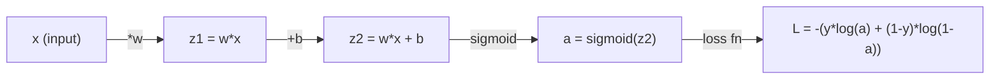
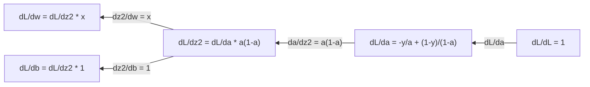
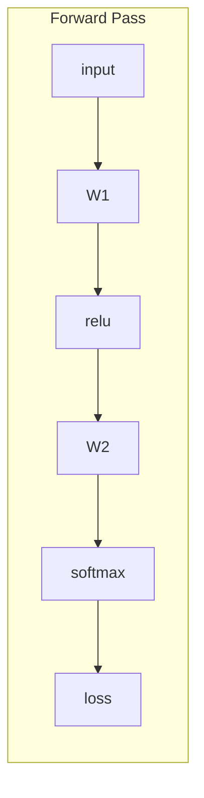
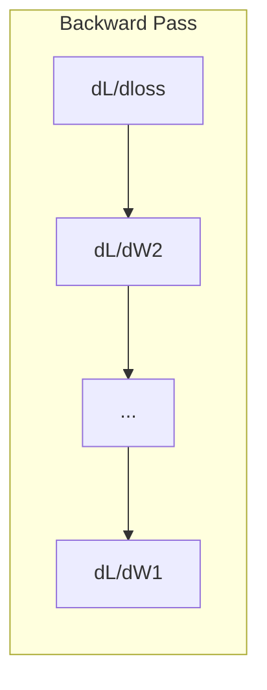

# 机器学习微积分

>
> 导数能告诉你哪个方向是下坡。神经网络学习所需的知识仅此而已。

**类型：** 学习
**语言：** Python
**先修要求：** 第一阶段，课程 01-03
**时长：** 约 60 分钟

## 学习目标

- 计算常见机器学习函数（x^2、sigmoid、交叉熵）的数值导数与解析导数  
- 从零实现梯度下降算法，以在一维和二维空间中最小化损失函数  
- 推导线性回归模型的梯度，并通过手动更新权重来训练该模型  
- 解释海森矩阵与泰勒级数近似，以及它们与优化方法之间的关联

## 问题所在

你拥有一个包含数百万个权重的神经网络。每个权重都相当于一个旋钮。你需要确定如何调整每一个旋钮，才能让模型的预测误差略微减小。微积分能为你指出正确的调整方向。

如果没有微积分，训练神经网络就意味着随机尝试各种改动并寄希望于最好的结果。而借助导数，你可以精确知道每个权重对误差的影响程度，从而每次都能以正确的方式调整所有旋钮。

## 概念概述

### 什么是导数？

导数用于衡量变化率。对于函数 y = f(x)，其导数 f'(x) 表示：当 x 发生微小变化时，y 的变化量是多少？

从几何角度而言，导数即某一点处切线的斜率。

**f(x) = x^2:**

| x | f(x) | f'(x) (斜率) |
|---|------|---------------|
| 0 | 0    | 0（处于最低点，曲线平坦） |
| 1 | 1    | 2 |
| 2 | 4    | 4（该点处切线的斜率） |
| 3 | 9    | 6 |

在 x=2 处，斜率为 4。若将 x 向右微调一点，y 的增加量约为该斜率的 4 倍。在 x=0 处，斜率为 0，此时处于曲线的最低点。

正式定义如下：

```
f'(x) = lim   f(x + h) - f(x)
        h->0  -----------------
                     h
```

在代码中，可以忽略该限制，直接使用一个非常小的 h 值。这就是数值微分。

### 偏导数：一次处理一个变量

实函数具有多个输入参数。神经网络的损失值取决于数千个权重参数。偏导数则是将所有变量保持不变，仅对其中一个变量求导。

```
f(x, y) = x^2 + 3xy + y^2

df/dx = 2x + 3y     (treat y as a constant)
df/dy = 3x + 2y     (treat x as a constant)
```

每个偏导数都回答了这样一个问题：如果仅调整这一个权重，损失函数会如何变化？

### 梯度：所有偏导数构成的向量

梯度将所有的偏导数汇总为一个向量。对于函数 f(x, y, z)，其梯度为：

```
grad f = [ df/dx, df/dy, df/dz ]
```

梯度指向函数值上升最快的方向。若要使函数值最小化，则需朝相反方向移动。

**f(x,y) = x^2 + y^2 的等高线图：**

该函数的形状类似一个碗，其等高线为同心圆。函数的最小值点位于 (0, 0) 处。

| 点坐标 | grad f | -grad f（下降方向） |
|-------|--------|----------------------------|
| (1, 1) | [2, 2]（指向远离最小值的高处） | [-2, -2]（指向最小值处的低处） |
| (0, 0) | [0, 0]（平坦区域，即最小值点） | [0, 0] |

这便是梯度下降法的直观体现：计算梯度，取其负值，然后向前迈出一步。

### 优化连接

训练神经网络本质上就是优化过程。你有一个损失函数 L(w1, w2, ..., wn)，用于衡量模型的预测误差，你的目标便是将其最小化。

```
Gradient descent update rule:

  w_new = w_old - learning_rate * dL/dw

For every weight:
  1. Compute the partial derivative of loss with respect to that weight
  2. Subtract a small multiple of it from the weight
  3. Repeat
```

学习率控制着每一步的步长。如果过大，会导致超调；如果过小，则进展缓慢。

**损失函数曲线（一维截面）：**

随着权重 w 的变化，损失函数 L(w) 会形成一条具有峰谷起伏的曲线。

| 特征 | 描述 |
|---------|-------------|
| 全局最小值 | 曲线上的最低点——即最优解 |
| 局部最小值 | 虽然低于周围的点，但并非整体最低的谷底 |
| 斜率 | 梯度下降法会沿着斜率从任意起始点向下移动 |

梯度下降法会顺着斜率向低处移动。它可能会陷入局部最小值，但在高维空间（数百万个权重）中，这通常不会构成实际问题。

### 数值导数与解析导数

计算导数有两种方法。

解析法：手动应用微积分规则。对于函数 f(x) = x^2，其导数为 f'(x) = 2x。结果精确且计算速度快。

数值法：根据定义进行近似计算。选取一个极小的 h 值，分别计算 f(x+h) 和 f(x-h)，再利用二者之差来得到近似值。

```
Numerical (central difference):

f'(x) ~= f(x + h) - f(x - h)
          -----------------------
                  2h

h = 0.0001 works well in practice
```

数值导数虽然计算速度较慢，但适用于任何函数。解析导数则运算迅速，但需要手动推导公式。神经网络框架采用了第三种方法：自动微分，它能够自动精确地计算导数。您将在第3阶段了解到这一点。

### 简单函数的导数手工推导

这些就是在机器学习中会反复出现的导数。

```
Function        Derivative       Used in
--------        ----------       -------
f(x) = x^2     f'(x) = 2x      Loss functions (MSE)
f(x) = wx + b  f'(w) = x        Linear layer (gradient w.r.t. weight)
                f'(b) = 1        Linear layer (gradient w.r.t. bias)
                f'(x) = w        Linear layer (gradient w.r.t. input)
f(x) = e^x     f'(x) = e^x     Softmax, attention
f(x) = ln(x)   f'(x) = 1/x     Cross-entropy loss
f(x) = 1/(1+e^-x)  f'(x) = f(x)(1-f(x))   Sigmoid activation
```

对于函数 f(x) = x^2：

```
f(x) = x^2    f'(x) = 2x

  x    f(x)   f'(x)   meaning
  -2    4      -4      slope tilts left (decreasing)
  -1    1      -2      slope tilts left (decreasing)
   0    0       0      flat (minimum!)
   1    1       2      slope tilts right (increasing)
   2    4       4      slope tilts right (increasing)
```

对于 f(w) = wx + b，其中 x=3，b=1：

```
f(w) = 3w + 1    f'(w) = 3

The derivative with respect to w is just x.
If x is big, a small change in w causes a big change in output.
```

### 链式法则

当对函数进行复合时，链式法则会告诉你如何求其导数。

```
If y = f(g(x)), then dy/dx = f'(g(x)) * g'(x)

Example: y = (3x + 1)^2
  outer: f(u) = u^2       f'(u) = 2u
  inner: g(x) = 3x + 1    g'(x) = 3
  dy/dx = 2(3x + 1) * 3 = 6(3x + 1)
```

神经网络是由一系列函数构成的链条：输入 -> 线性变换 -> 激活函数 -> 线性变换 -> 激活函数 -> 损失函数。反向传播算法就是从输出端开始，反复应用链式法则进行计算。这就是整个算法的原理。

### 海森矩阵

梯度表示斜率，而海森矩阵则表示曲率。

海森矩阵是二阶偏导数的矩阵。对于函数 f(x1, x2, ..., xn)，其海森矩阵的 (i, j) 元素为：

```
H[i][j] = d^2f / (dx_i * dx_j)
```

对于二元函数 f(x, y)：

```
H = | d^2f/dx^2    d^2f/dxdy |
    | d^2f/dydx    d^2f/dy^2 |
```

**Hessian矩阵在临界点（梯度为0处）所反映的信息：**

| Hessian矩阵性质 | 含义 | 示例曲面 |
|-----------------|---------|-----------------|
| 正定矩阵（所有特征值 > 0） | 局部最小值 | 向上开口的碗状 |
| 负定矩阵（所有特征值 < 0） | 局部最大值 | 向下开口的碗状 |
| 不定矩阵（特征值正负混合） | 马鞍点 | 马鞍形状 |

**示例：** f(x, y) = x^2 - y^2（一个马鞍函数）

```
df/dx = 2x       df/dy = -2y
d^2f/dx^2 = 2    d^2f/dy^2 = -2    d^2f/dxdy = 0

H = | 2   0 |
    | 0  -2 |

Eigenvalues: 2 and -2 (one positive, one negative)
--> Saddle point at (0, 0)
```

与函数 f(x, y) = x^2 + y^2（碗形曲线）进行比较：

```
H = | 2  0 |
    | 0  2 |

Eigenvalues: 2 and 2 (both positive)
--> Local minimum at (0, 0)
```

**为什么海森矩阵在机器学习中如此重要：**

牛顿法利用海森矩阵来获取比梯度下降更优的优化步骤。它不仅遵循斜率变化，还能考虑曲率因素：

```
Newton's update:    w_new = w_old - H^(-1) * gradient
Gradient descent:   w_new = w_old - lr * gradient
```

牛顿法之所以收敛更快，是因为海森矩阵会对梯度进行“重新缩放”——在梯度变化剧烈的方向上步长会变小，而在平坦的方向上步长则会变大。

但其缺点在于：对于一个拥有 N 个参数的神经网络，其海森矩阵的维度为 N x N。一个包含 100 万个参数的模型将需要一个包含 1 万亿个元素的矩阵。正因如此，我们才采用近似方法。

| 方法 | 使用的内容 | 计算成本 | 收敛速度 |
|--------|-------------|----------|----------|
| 梯度下降法 | 仅使用一阶导数 | 每步 O(N) | 缓慢（线性） |
| 牛顿法 | 完整的海森矩阵 | 每步 O(N^3) | 快速（二次方级） |
| L-BFGS | 基于梯度历史数据近似海森矩阵 | 每步 O(N) | 中等（超线性） |
| Adam算法 | 每个参数的自适应学习率（对角海森矩阵近似） | 每步 O(N) | 中等 |
| 自然梯度法 | 费希尔信息矩阵（统计意义上的海森矩阵） | 每步 O(N^2) | 快速 |

在实际应用中，Adam算法是深度学习的默认优化器。它通过跟踪每个参数的梯度均值和方差，以较低的成本近似获取二阶信息。

### 泰勒级数近似

任何光滑函数都可以在局部范围内用多项式来近似：

```
f(x + h) = f(x) + f'(x)*h + (1/2)*f''(x)*h^2 + (1/6)*f'''(x)*h^3 + ...
```

包含的项越多，近似效果就越好——但仅限于接近点 x 的范围内。

**泰勒级数对机器学习的重要性：**

- **一阶泰勒级数 = 梯度下降法。** 当使用 f(x + h) ~ f(x) + f'(x)*h 时，实际上是在进行线性近似。梯度下降法通过最小化该线性模型来确定 h 的值，即 h = -lr * f'(x)。

- **二阶泰勒级数 = 牛顿法。** 使用 f(x + h) ~ f(x) + f'(x)*h + (1/2)*f''(x)*h^2 可以得到二次模型。通过最小化该模型可求得 h 的值，即 h = -f'(x)/f''(x)，这就是牛顿法的步长。

- **损失函数的设计。** 均方误差和交叉熵属于平滑函数，这意味着它们的泰勒展开表现良好。这并非偶然，因为平滑的损失函数能让优化过程更具可预测性。

```
Approximation order    What it captures    Optimization method
-------------------    -----------------   -------------------
0th order (constant)   Just the value      Random search
1st order (linear)     Slope               Gradient descent
2nd order (quadratic)  Curvature           Newton's method
Higher orders          Finer structure     Rarely used in ML
```

核心要点：所有基于梯度的优化方法，本质上都是对损失函数在局部进行近似，并朝着该近似的最小值移动。

### 机器学习中的积分

导数用于表示变化率，而积分则用于计算累积量——即曲线下的面积。

在机器学习中，人们很少手动计算积分，但这一概念无处不在：

**概率。** 对于具有密度函数 p(x) 的连续随机变量：
```
P(a < X < b) = integral from a to b of p(x) dx
```
概率密度曲线在 a 和 b 之间的面积即为落在该区间内的概率。

**期望值。** 按概率加权的平均结果：
```
E[f(X)] = integral of f(x) * p(x) dx
```
数据分布下的期望损失是一个积分值。训练过程旨在最小化该值的经验近似值。

**KL散度**：用于衡量两个分布之间的差异程度：
```
KL(p || q) = integral of p(x) * log(p(x) / q(x)) dx
```
用于变分自编码器、知识蒸馏和贝叶斯推断。

**归一化常数。** 在贝叶斯推断中：
```
p(w | data) = p(data | w) * p(w) / integral of p(data | w) * p(w) dw
```
分母是对所有可能参数值进行的积分。由于该积分往往难以求解，因此我们才采用 MCMC 和变分推断等近似方法。

### 计算图中的多变量链式法则

链式法则并不仅适用于线性形式的标量函数。在神经网络中，变量会呈辐射状扩散并最终合并。以下是导数在简单前向传播过程中的流动方式：



反向传播是从右向左计算梯度的：



每个箭头表示乘以对应的局部导数。任意参数的梯度，即为从损失函数到该参数所在路径上所有局部导数的乘积。当路径出现分支或合并时，则需对这些贡献值求和（即多变量链式法则）。

这就是反向传播的全部内容：通过计算图系统地应用链式法则，从输出层逐步回溯至输入层。

### 雅可比矩阵

当一个函数将向量映射为另一个向量时（例如神经网络层），其导数表现为矩阵形式。雅可比矩阵包含了每个输出对每个输入的所有偏导数。

对于函数 f: R^n -> R^m，其雅可比矩阵 J 为一个 m x n 的矩阵：

| | x1 | x2 | ... | xn |
|---|---|---|---|---|
| f1 | df1/dx1 | df1/dx2 | ... | df1/dxn |
| f2 | df2/dx1 | df2/dx2 | ... | df2/dxn |
| ... | ... | ... | ... | ... |
| fm | dfm/dx1 | dfm/dx2 | ... | dfm/dxn |

在处理神经网络时，无需手动计算雅可比矩阵，PyTorch 会自动完成该操作。不过了解其存在有助于理解反向传播中的张量形状：若某层将 R^n 映射为 R^m，则其雅可比矩阵的维度为 m x n，梯度将通过该矩阵的转置向回传递。

### 为何这对神经网络至关重要

神经网络中的每个权重都会对应一个梯度。该梯度指示了应如何调整该权重以降低损失值。





每次权重更新如下：
- `W1 = W1 - lr * dL/dW1`
- `W2 = W2 - lr * dL/dW2`

前向传播用于计算预测值与损失函数值。反向传播则用于计算损失函数对每个权重的梯度。随后，每个权重都会沿着下降方向进行微小的调整。如此循环数百万次，这就是深度学习的过程。

```figure
derivative-tangent
```

## 构建它

### 步骤 1：从零实现数值微分

```python
def numerical_derivative(f, x, h=1e-7):
    return (f(x + h) - f(x - h)) / (2 * h)

def f(x):
    return x ** 2

for x in [-2, -1, 0, 1, 2]:
    numerical = numerical_derivative(f, x)
    analytical = 2 * x
    print(f"x={x:2d}  f'(x) numerical={numerical:.6f}  analytical={analytical:.1f}")
```

数值导数在多位小数上与解析解完全一致。

### 步骤 2：偏导数与梯度

```python
def numerical_gradient(f, point, h=1e-7):
    gradient = []
    for i in range(len(point)):
        point_plus = list(point)
        point_minus = list(point)
        point_plus[i] += h
        point_minus[i] -= h
        partial = (f(point_plus) - f(point_minus)) / (2 * h)
        gradient.append(partial)
    return gradient

def f_multi(point):
    x, y = point
    return x**2 + 3*x*y + y**2

grad = numerical_gradient(f_multi, [1.0, 2.0])
print(f"Numerical gradient at (1,2): {[f'{g:.4f}' for g in grad]}")
print(f"Analytical gradient at (1,2): [2*1+3*2, 3*1+2*2] = [{2*1+3*2}, {3*1+2*2}]")
```

### 步骤 3：使用梯度下降法求解函数 f(x) = x^2 的最小值

```python
x = 5.0
lr = 0.1
for step in range(20):
    grad = 2 * x
    x = x - lr * grad
    print(f"step {step:2d}  x={x:8.4f}  f(x)={x**2:10.6f}")
```

从 x=5 开始，每一步都会向 x=0（最小值）靠近。

### 步骤 4：在二维函数上执行梯度下降

```python
def f_2d(point):
    x, y = point
    return x**2 + y**2

point = [4.0, 3.0]
lr = 0.1
for step in range(30):
    grad = numerical_gradient(f_2d, point)
    point = [p - lr * g for p, g in zip(point, grad)]
    loss = f_2d(point)
    if step % 5 == 0 or step == 29:
        print(f"step {step:2d}  point=({point[0]:7.4f}, {point[1]:7.4f})  f={loss:.6f}")
```

### 第 5 步：数值导数与解析导数的比较

```python
import math

test_functions = [
    ("x^2",      lambda x: x**2,          lambda x: 2*x),
    ("x^3",      lambda x: x**3,          lambda x: 3*x**2),
    ("sin(x)",   lambda x: math.sin(x),   lambda x: math.cos(x)),
    ("e^x",      lambda x: math.exp(x),   lambda x: math.exp(x)),
    ("1/x",      lambda x: 1/x,           lambda x: -1/x**2),
]

x = 2.0
print(f"{'Function':<12} {'Numerical':>12} {'Analytical':>12} {'Error':>12}")
print("-" * 50)
for name, f, df in test_functions:
    num = numerical_derivative(f, x)
    ana = df(x)
    err = abs(num - ana)
    print(f"{name:<12} {num:12.6f} {ana:12.6f} {err:12.2e}")
```

### 步骤 6：数值计算海森矩阵

```python
def hessian_2d(f, x, y, h=1e-5):
    fxx = (f(x + h, y) - 2 * f(x, y) + f(x - h, y)) / (h ** 2)
    fyy = (f(x, y + h) - 2 * f(x, y) + f(x, y - h)) / (h ** 2)
    fxy = (f(x + h, y + h) - f(x + h, y - h) - f(x - h, y + h) + f(x - h, y - h)) / (4 * h ** 2)
    return [[fxx, fxy], [fxy, fyy]]

def saddle(x, y):
    return x ** 2 - y ** 2

def bowl(x, y):
    return x ** 2 + y ** 2

H_saddle = hessian_2d(saddle, 0.0, 0.0)
H_bowl = hessian_2d(bowl, 0.0, 0.0)
print(f"Saddle Hessian: {H_saddle}")  # [[2, 0], [0, -2]] -- mixed signs
print(f"Bowl Hessian:   {H_bowl}")    # [[2, 0], [0, 2]]  -- both positive
```

鞍点函数的赫西矩阵的特征值为 2 和 -2（符号不同，证实其为鞍点）。碗形函数的特征值为 2 和 2（均为正数，证实其为极小值点）。

### 步骤 7：泰勒级数近似的实际应用

```python
import math

def taylor_approx(f, f_prime, f_double_prime, x0, h, order=2):
    result = f(x0)
    if order >= 1:
        result += f_prime(x0) * h
    if order >= 2:
        result += 0.5 * f_double_prime(x0) * h ** 2
    return result

x0 = 0.0
for h in [0.1, 0.5, 1.0, 2.0]:
    true_val = math.sin(h)
    t1 = taylor_approx(math.sin, math.cos, lambda x: -math.sin(x), x0, h, order=1)
    t2 = taylor_approx(math.sin, math.cos, lambda x: -math.sin(x), x0, h, order=2)
    print(f"h={h:.1f}  sin(h)={true_val:.4f}  order1={t1:.4f}  order2={t2:.4f}")
```

在 x0=0 附近，sin(x) 近似等于 x（一阶泰勒展开）。该近似在小 h 值时非常精确，但当 h 值较大时会失效。这就是为什么梯度下降法配合较小的学习率效果最佳——因为每一步都假设线性近似是准确的。

### 第 8 步：为何这对神经网络至关重要

```python
import random

random.seed(42)

w = random.gauss(0, 1)
b = random.gauss(0, 1)
lr = 0.01

xs = [1.0, 2.0, 3.0, 4.0, 5.0]
ys = [3.0, 5.0, 7.0, 9.0, 11.0]

for epoch in range(200):
    total_loss = 0
    dw = 0
    db = 0
    for x, y in zip(xs, ys):
        pred = w * x + b
        error = pred - y
        total_loss += error ** 2
        dw += 2 * error * x
        db += 2 * error
    dw /= len(xs)
    db /= len(xs)
    total_loss /= len(xs)
    w -= lr * dw
    b -= lr * db
    if epoch % 40 == 0 or epoch == 199:
        print(f"epoch {epoch:3d}  w={w:.4f}  b={b:.4f}  loss={total_loss:.6f}")

print(f"\nLearned: y = {w:.2f}x + {b:.2f}")
print(f"Actual:  y = 2x + 1")
```

每个基于梯度的训练循环都遵循以下模式：预测、计算损失、计算梯度、更新权重。

## 使用它

使用 NumPy，相同的操作不仅速度更快，而且更为简洁：

```python
import numpy as np

x = np.array([1, 2, 3, 4, 5], dtype=float)
y = np.array([3, 5, 7, 9, 11], dtype=float)

w, b = np.random.randn(), np.random.randn()
lr = 0.01

for epoch in range(200):
    pred = w * x + b
    error = pred - y
    loss = np.mean(error ** 2)
    dw = np.mean(2 * error * x)
    db = np.mean(2 * error)
    w -= lr * dw
    b -= lr * db

print(f"Learned: y = {w:.2f}x + {b:.2f}")
```

你刚刚从头实现了一遍梯度下降算法。PyTorch虽然自动完成了梯度的计算，但更新循环的逻辑是完全相同的。

## 练习题

1. 使用两次调用 `numerical_derivative` 来实现 `numerical_second_derivative(f, x)` 函数。验证在 x=2 处，x^3 的二阶导数结果为 12。
2. 利用梯度下降法寻找函数 f(x, y) = (x - 3)^2 + (y + 1)^2 的最小值点。起始点为 (0, 0)，最终收敛结果应为 (3, -1)。
3. 在梯度下降循环中加入动量机制：维护一个用于累积历史梯度的速度向量。针对函数 f(x) = x^4 - 3x^2，比较有无动量时的收敛速度差异。

## 关键术语

| 术语 | 通俗说法 | 实际含义 |
|------|----------|----------|
| 导数 | “斜率” | 函数在某一点处的变化率，表示输入每变化一个单位时输出的变化量。 |
| 偏导数 | “单个变量的导数” | 在其他变量保持不变的情况下，仅对某一变量求得的导数。 |
| 梯度 | “上升最快的方向” | 所有偏导数组成的向量，指向函数值增长最快的方向。 |
| 梯度下降法 | “下山法” | 从参数中减去梯度（乘以学习率）以降低损失值，是神经网络训练的核心算法。 |
| 学习率 | “步长” | 用于控制每次梯度下降步幅的标量数值；过大会导致模型发散，过小则收敛速度缓慢。 |
| 链式法则 | “导数相乘” | 用于计算复合函数导数的规则：df/dx = df/dg * dg/dx，是反向传播算法的数学基础。 |
| 雅可比矩阵 | “导数矩阵” | 当函数将向量映射为向量时，雅可比矩阵是由所有输出对输入的偏导数组成的矩阵。 |
| 数值导数 | “有限差分法” | 通过在两个相近点处计算函数值并求出两者之间的斜率来近似导数。 |
| 反向传播 | “反向自动微分” | 利用链式法则从输出层逐层向输入层计算梯度，是神经网络实现学习的方式。 |
| 赫西矩阵 | “二阶偏导数矩阵” | 包含所有二阶偏导数的矩阵，用于描述函数的曲率；临界点处若赫西矩阵为正定，则表示该点为局部最小值。 |
| 泰勒级数 | “多项式近似” | 利用函数的各阶导数在某一点附近对函数进行近似：f(x+h) ~ f(x) + f'(x)h + (1/2)f''(x)h^2 + ...，是理解梯度下降法和牛顿法原理的基础。 |
| 积分 | “曲线下的面积” | 表示在某一区间内某量值的累积值，在机器学习中用于定义概率、期望值和KL散度等概念。 |

## 延伸阅读

- [3Blue1Brown: 微积分精髓](https://www.3blue1brown.com/topics/calculus) - 关于导数、积分及链式法则的可视化直观理解  
- [Stanford CS231n: 反向传播](https://cs231n.github.io/optimization-2/) - 梯度如何在神经网络层之间传递
