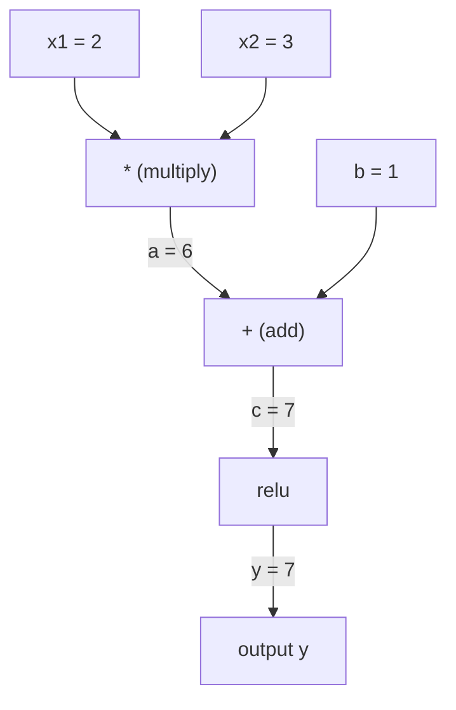
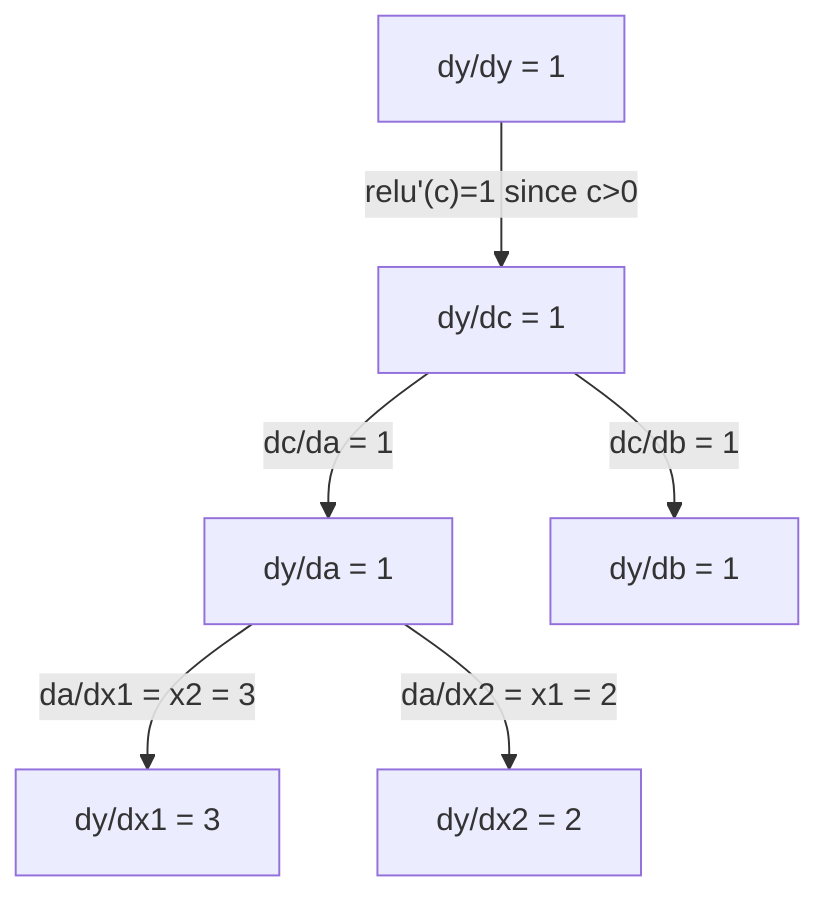

# 链式法则与自动微分

>
> 链式法则是一切具备学习能力的神经网络背后的核心机制。

**类型：** 构建
**语言：** Python
**先修要求：** 第一阶段，第04课（导数与梯度）
**时长：** 约90分钟

## 学习目标

- 构建一个最简的自动求导引擎（Value 类），用于记录运算操作并通过反向模式自动微分计算梯度。  
- 利用拓扑排序在计算图中实现前向传播与反向传播过程。  
- 仅使用自研的自动求导引擎，针对 XOR 问题构建并训练多层感知器。  
- 通过梯度检验法结合数值有限差分技术，验证自动微分的正确性。

## 问题所在

你可以计算简单函数的导数。但神经网络并非简单函数，而是由数百个函数组合而成的：矩阵乘法、添加偏置、应用激活函数、再次进行矩阵乘法、执行 softmax 操作以及计算交叉熵损失。其输出实际上是层层嵌套的函数结果。

要训练该网络，你需要知道损失函数对每一个权重值的梯度。对于数以百万计的参数而言，手动计算是不可能的；而采用数值方法（有限差分）则速度过慢。

链式法则提供了相关的数学原理，自动微分则给出了相应的算法实现。二者结合，便能以与单次前向传播相同的时间复杂度，计算出任意函数组合的精确梯度。

PyTorch、TensorFlow 和 JAX 的工作原理正是如此。你将需要从零开始构建一个简化版本。

## 概念概述

### 链式法则

如果 `y = f(g(x))`，则 `y` 关于 `x` 的导数为：

```
dy/dx = dy/dg * dg/dx = f'(g(x)) * g'(x)
```

对链式法则中的各导数进行相乘。每个环节都会贡献其局部导数。

示例：`y = sin(x^2)`

```
g(x) = x^2       g'(x) = 2x
f(g) = sin(g)     f'(g) = cos(g)

dy/dx = cos(x^2) * 2x
```

对于更复杂的组合结构，该链会进一步延伸：

```
y = f(g(h(x)))

dy/dx = f'(g(h(x))) * g'(h(x)) * h'(x)
```

神经网络中的每一层都是这条链条上的一个环节。

### 计算图

计算图将链式法则可视化。每个操作都对应一个节点，数据沿着图向前流动，而梯度则向反向传递。

**前向传播（计算数值）：**



**反向传播（计算梯度）：**



反向传播会在每个节点应用链式法则，将梯度从输出端逐层传递至输入端。

### 正向模式与反向模式

通过图结构应用链式法则有两种方式。

**前向模式**从输入开始，逐层向前推导导数。它首先计算 `dx/dx = 1`，然后将该结果传递到后续的每个运算中。当输入较少而输出较多时，此方法较为适用。

```
Forward mode: seed dx/dx = 1, propagate forward

  x = 2       (dx/dx = 1)
  a = x^2     (da/dx = 2x = 4)
  y = sin(a)  (dy/dx = cos(a) * da/dx = cos(4) * 4 = -2.615)
```

**反向模式**从输出端开始，将梯度向回传递。它会计算出 `dy/dy = 1`，并沿相反方向逐个传播至各个运算节点。当输入数量较多而输出数量较少时，此模式尤为适用。

```
Reverse mode: seed dy/dy = 1, propagate backward

  y = sin(a)  (dy/dy = 1)
  a = x^2     (dy/da = cos(a) = cos(4) = -0.654)
  x = 2       (dy/dx = dy/da * da/dx = -0.654 * 4 = -2.615)
```

神经网络拥有数百万个输入参数（权重）以及一个输出参数（损失值）。反向模式可在一次反向传播中计算出所有的梯度。这就是为什么反向传播算法会使用反向模式的原因。

| 模式 | 种子值 | 方向 | 最佳适用场景 |
|------|--------|-----------|--------------|
| 正向传播 | `dx_i/dx_i = 1` | 从输入到输出 | 输入节点较少，输出节点较多 |
| 反向传播 | `dy/dy = 1` | 从输出到输入 | 输入节点较多，输出节点较少（适用于神经网络） |

### 前向模式下的双数

前向模式可以通过双数来优雅地实现。双数的形式为 `a + b*epsilon`，其中满足 `epsilon^2 = 0` 的条件。

```
Dual number: (value, derivative)

(2, 1) means: value is 2, derivative w.r.t. x is 1

Arithmetic rules:
  (a, a') + (b, b') = (a+b, a'+b')
  (a, a') * (b, b') = (a*b, a'*b + a*b')
  sin(a, a')         = (sin(a), cos(a)*a')
```

将输入变量的初始值设为导数 1。该导数会自动传递至所有运算中。

### 构建自动求导引擎

自动求导引擎需要具备以下三个要素：

1. **值封装。** 将每个数值封装在能够存储其数值及梯度信息的对象中。
2. **计算图记录。** 每个运算都会记录其输入参数以及对应的局部梯度函数。
3. **反向传播。** 对计算图进行拓扑排序，然后按逆序遍历该图，在每个节点处应用链式法则。

这正是 PyTorch 的 `autograd` 模块所实现的功能。`torch.Tensor` 类负责对数值进行封装；当设置 `requires_grad=True` 时会记录相关运算信息；而在调用 `.backward()` 方法时则会计算梯度值。

### PyTorch 自动求导机制的底层实现原理

在编写 PyTorch 代码时：

```python
x = torch.tensor(2.0, requires_grad=True)
y = x ** 2 + 3 * x + 1
y.backward()
print(x.grad)  # 7.0 = 2*x + 3 = 2*2 + 3
```

PyTorch 的内部机制如下：

1. 为变量 `x` 创建一个 `Tensor` 节点，并设置 `requires_grad=True`。
2. 每次执行运算（如 `**`、`*`、`+`）时都会创建一个新的节点，并记录对应的反向传播函数。
3. 调用 `y.backward()` 会通过已记录的图结构触发反向模式自动微分。
4. 每个节点的 `grad_fn` 会计算局部梯度，并将这些梯度传递给其父节点。
5. 梯度通过加法运算累积在各个节点的 `.grad` 属性中，而非被直接替换。

该图结构是动态的（运行时定义）。每次前向传播都会构建一个新的图。这也是 PyTorch 能够在模型内部支持控制流（如 if/else、循环）的原因。

```figure
chain-rule
```

## 构建它

### 步骤 1：Value 类

```python
class Value:
    def __init__(self, data, children=(), op=''):
        self.data = data
        self.grad = 0.0
        self._backward = lambda: None
        self._prev = set(children)
        self._op = op

    def __repr__(self):
        return f"Value(data={self.data:.4f}, grad={self.grad:.4f})"
```

每个 `Value` 对象都会存储其数值数据、梯度（初始值为零）、一个反向传播函数，以及指向生成该对象的子节点的指针。

### 步骤 2：带有梯度追踪的算术运算

```python
    def __add__(self, other):
        other = other if isinstance(other, Value) else Value(other)
        out = Value(self.data + other.data, (self, other), '+')
        def _backward():
            self.grad += out.grad
            other.grad += out.grad
        out._backward = _backward
        return out

    def __mul__(self, other):
        other = other if isinstance(other, Value) else Value(other)
        out = Value(self.data * other.data, (self, other), '*')
        def _backward():
            self.grad += other.data * out.grad
            other.grad += self.data * out.grad
        out._backward = _backward
        return out

    def relu(self):
        out = Value(max(0, self.data), (self,), 'relu')
        def _backward():
            self.grad += (1.0 if out.data > 0 else 0.0) * out.grad
        out._backward = _backward
        return out
```

每次操作都会创建一个闭包，该闭包知晓如何计算局部梯度并将其与上游梯度（`out.grad`）相乘。`+=` 操作用于处理某个值在多个操作中被重复使用的情况。

### 步骤 3：反向传播

```python
    def backward(self):
        topo = []
        visited = set()
        def build_topo(v):
            if v not in visited:
                visited.add(v)
                for child in v._prev:
                    build_topo(child)
                topo.append(v)
        build_topo(self)

        self.grad = 1.0
        for v in reversed(topo):
            v._backward()
```

拓扑排序可确保在将每个节点的梯度传递给其子节点之前，该节点的梯度已完全计算完成。初始梯度值为 1.0（dy/dy = 1）。

### 步骤 4：实现完整引擎的更多操作

基础 Value 类可处理加法、乘法和 ReLU 操作。真正的自动求导引擎还需要更多功能。以下是构建神经网络所需的操作：

```python
    def __neg__(self):
        return self * -1

    def __sub__(self, other):
        return self + (-other)

    def __radd__(self, other):
        return self + other

    def __rmul__(self, other):
        return self * other

    def __rsub__(self, other):
        return other + (-self)

    def __pow__(self, n):
        out = Value(self.data ** n, (self,), f'**{n}')
        def _backward():
            self.grad += n * (self.data ** (n - 1)) * out.grad
        out._backward = _backward
        return out

    def __truediv__(self, other):
        return self * (other ** -1) if isinstance(other, Value) else self * (Value(other) ** -1)

    def exp(self):
        import math
        e = math.exp(self.data)
        out = Value(e, (self,), 'exp')
        def _backward():
            self.grad += e * out.grad
        out._backward = _backward
        return out

    def log(self):
        import math
        out = Value(math.log(self.data), (self,), 'log')
        def _backward():
            self.grad += (1.0 / self.data) * out.grad
        out._backward = _backward
        return out

    def tanh(self):
        import math
        t = math.tanh(self.data)
        out = Value(t, (self,), 'tanh')
        def _backward():
            self.grad += (1 - t ** 2) * out.grad
        out._backward = _backward
        return out
```

**为何每个运算都至关重要：**

| 运算 | 反向传播规则 | 应用场景 |
|-----------|--------------|---------|
| `__sub__` | 重用加法 + 负号运算 | 损失计算（预测值 - 目标值） |
| `__pow__` | n * x^(n-1) | 多项式激活函数、MSE（误差平方） |
| `__truediv__` | 重用乘法 + pow(-1)运算 | 归一化、学习率缩放 |
| `exp` | exp(x) * 上游输出 | Softmax、对数似然 |
| `log` | (1/x) * 上游输出 | 交叉熵损失、对数概率 |
| `tanh` | (1 - tanh^2) * 上游输出 | 经典激活函数 |

巧妙之处在于：`__sub__` 和 `__truediv__` 是基于现有运算定义的。由于链式法则可以通过底层的加法/乘法/幂运算传递，因此它们能够自动获得正确的梯度。

### 第 5 步：从零构建小型多层感知器

拥有完整的 Value 类后，你便可以构建神经网络。无需 PyTorch，也无需 NumPy，仅需 Value 对象与链式法则即可。

```python
import random

class Neuron:
    def __init__(self, n_inputs):
        self.w = [Value(random.uniform(-1, 1)) for _ in range(n_inputs)]
        self.b = Value(0.0)

    def __call__(self, x):
        act = sum((wi * xi for wi, xi in zip(self.w, x)), self.b)
        return act.tanh()

    def parameters(self):
        return self.w + [self.b]

class Layer:
    def __init__(self, n_inputs, n_outputs):
        self.neurons = [Neuron(n_inputs) for _ in range(n_outputs)]

    def __call__(self, x):
        return [n(x) for n in self.neurons]

    def parameters(self):
        return [p for n in self.neurons for p in n.parameters()]

class MLP:
    def __init__(self, sizes):
        self.layers = [Layer(sizes[i], sizes[i+1]) for i in range(len(sizes)-1)]

    def __call__(self, x):
        for layer in self.layers:
            x = layer(x)
        return x[0] if len(x) == 1 else x

    def parameters(self):
        return [p for layer in self.layers for p in layer.parameters()]
```

`Neuron`负责计算`tanh(w1*x1 + w2*x2 + ... + b)`的值。`Layer`是由多个`Neuron`组成的列表。`MLP`则是通过堆叠这些层来构建的。由于每个权重都属于`Value`类型，因此调用`loss.backward()`即可将梯度传递至所有参数。

**XOR问题的训练：**

```python
random.seed(42)
model = MLP([2, 4, 1])  # 2 inputs, 4 hidden neurons, 1 output

xs = [[0, 0], [0, 1], [1, 0], [1, 1]]
ys = [-1, 1, 1, -1]  # XOR pattern (using -1/1 for tanh)

for step in range(100):
    preds = [model(x) for x in xs]
    loss = sum((p - y) ** 2 for p, y in zip(preds, ys))

    for p in model.parameters():
        p.grad = 0.0
    loss.backward()

    lr = 0.05
    for p in model.parameters():
        p.data -= lr * p.grad

    if step % 20 == 0:
        print(f"step {step:3d}  loss = {loss.data:.4f}")

print("\nPredictions after training:")
for x, y in zip(xs, ys):
    print(f"  input={x}  target={y:2d}  pred={model(x).data:6.3f}")
```

这是 micrograd。它是一个使用纯 Python 实现的完整神经网络训练循环，具备自动微分功能。所有商业深度学习框架都在大规模环境下实现着相同的功能。

### 步骤 6：梯度检验

如何判断你的自动微分结果是否正确？将其与数值导数进行比较，这就是梯度检验法。

```python
def gradient_check(build_expr, x_val, h=1e-7):
    x = Value(x_val)
    y = build_expr(x)
    y.backward()
    autodiff_grad = x.grad

    y_plus = build_expr(Value(x_val + h)).data
    y_minus = build_expr(Value(x_val - h)).data
    numerical_grad = (y_plus - y_minus) / (2 * h)

    diff = abs(autodiff_grad - numerical_grad)
    return autodiff_grad, numerical_grad, diff
```

在复杂表达式上对其进行测试：

```python
def expr(x):
    return (x ** 3 + x * 2 + 1).tanh()

ad, num, diff = gradient_check(expr, 0.5)
print(f"Autodiff:  {ad:.8f}")
print(f"Numerical: {num:.8f}")
print(f"Difference: {diff:.2e}")
# Difference should be < 1e-5
```

在实现新运算时，梯度检验是必不可少的。如果反向传播过程中存在错误，数值检验能够及时发现它。所有成熟的深度学习实现都会在开发阶段进行梯度检验。

**何时使用梯度检验：**

| 情况 | 是否需要进行梯度检验？ |
|-----------|----------------------|
| 为自动求导系统添加新运算 | 是，必须始终进行 |
| 调试无法收敛的训练循环 | 是，首先检查梯度 |
| 生产环境下的训练 | 否，速度过慢（每个参数需要执行2次前向传播） |
| 自动求导代码的单元测试 | 是，应实现自动化检测 |

### 步骤 7：与手动计算结果进行验证

```python
x1 = Value(2.0)
x2 = Value(3.0)
a = x1 * x2          # a = 6.0
b = a + Value(1.0)    # b = 7.0
y = b.relu()          # y = 7.0

y.backward()

print(f"y = {y.data}")          # 7.0
print(f"dy/dx1 = {x1.grad}")   # 3.0 (= x2)
print(f"dy/dx2 = {x2.grad}")   # 2.0 (= x1)
```

手动验证：`y = relu(x1*x2 + 1)`。由于 `x1*x2 + 1 = 7 > 0`，relu 函数即为恒等函数。
`dy/dx1 = x2 = 3`。`dy/dx2 = x1 = 2`。计算结果与引擎输出一致。

## 使用它

### 使用 PyTorch 进行验证

```python
import torch

x1 = torch.tensor(2.0, requires_grad=True)
x2 = torch.tensor(3.0, requires_grad=True)
a = x1 * x2
b = a + 1.0
y = torch.relu(b)
y.backward()

print(f"PyTorch dy/dx1 = {x1.grad.item()}")  # 3.0
print(f"PyTorch dy/dx2 = {x2.grad.item()}")  # 2.0
```

相同的梯度。由于数学原理一致——即通过链式法则进行反向模式自动微分，您的引擎能够计算出与 PyTorch 相同的结果。

### 更复杂的表达式

```python
a = Value(2.0)
b = Value(-3.0)
c = Value(10.0)
f = (a * b + c).relu()  # relu(2*(-3) + 10) = relu(4) = 4

f.backward()
print(f"df/da = {a.grad}")  # -3.0 (= b)
print(f"df/db = {b.grad}")  #  2.0 (= a)
print(f"df/dc = {c.grad}")  #  1.0
```

## 发布它

本课程将生成以下内容：
- `outputs/skill-autodiff.md` -- 用于构建和调试自动求导系统的技能文档
- `code/autodiff.py` -- 可供扩展的简易自动求导引擎

此处实现的 Value 类是第三阶段神经网络训练循环的基础。

## 练习题

1. 在 Value 类中添加 `__pow__` 方法，以便能够计算 `x ** n`。验证在 `x=2` 时，`d/dx(x^3)` 的值是否等于 `12.0`。

2. 添加 `tanh` 作为激活函数。验证 `tanh'(0) = 1`，以及 `tanh'(2) ≈ 0.0707`。

3. 为单个神经元构建计算图：`y = relu(w1*x1 + w2*x2 + b)`。计算所有五个梯度，并与 PyTorch 的结果进行比对验证。

4. 使用双数实现前向模式自动微分。创建一个 `Dual` 类，并验证其计算的导数是否与你实现的反向模式引擎结果一致。

## 关键术语

| 术语 | 常见说法 | 实际含义 |
|------|----------|----------|
| 链式法则 | “将导数相乘” | 复合函数的导数等于各函数在对应点处的局部导数之积 |
| 计算图 | “网络结构图” | 一种有向无环图，其中节点代表运算操作，边则用于传递数值（正向传播）或梯度（反向传播） |
| 正向模式 | “将导数向前传递” | 自动微分技术，通过从输入到输出的方向传播导数。每个输入变量需要一次遍历 |
| 反向模式 | “反向传播” | 自动微分技术，通过从输出到输入的方向传播梯度。每个输出变量需要一次遍历 |
| 自动求导 | “自动计算梯度” | 一种系统，用于记录对数值的运算操作、构建计算图，并通过链式法则精确计算梯度 |
| 对偶数 | “数值加上其导数” | 形如 a + b*epsilon（其中 epsilon^2 = 0）的数，可通过算术运算携带导数信息 |
| 拓扑排序 | “依赖顺序” | 对图中的节点进行排序，使得每个节点都位于其所有依赖节点之后。这是正确传播梯度所必需的 |
| 梯度累积 | “求和而非替换” | 当一个数值被用于多个运算时，其梯度为所有传入梯度的总和 |
| 动态图 | “运行时动态定义” | 每次正向传播时都会重新构建计算图，允许在模型内部使用 Python 的控制流结构（类似 PyTorch 的方式） |
| 梯度检验 | “数值验证” | 将自动微分得到的梯度与数值有限差分法得到的梯度进行比较，以验证结果的正确性。这是调试的重要手段 |
| 多层感知器 | “多层神经网络” | 具有一个或多个隐藏层神经元的网络结构。每个神经元首先计算加权和加上偏置值，然后再应用激活函数 |
| 神经元 | “加权和加上激活函数的结果” | 最基本的单元：输出 = activation(w1*x1 + w2*x2 + ... + b)。权重和偏置属于可学习参数 |

## 延伸阅读

- [3Blue1Brown：反向传播微积分](https://www.youtube.com/watch?v=tIeHLnjs5U8) -- 神经网络中链式法则的可视化解释  
- [PyTorch Autograd 工作原理](https://pytorch.org/docs/stable/notes/autograd.html) -- 实际系统的工作机制  
- [Baydin 等人，《机器学习中的自动微分：综述》](https://arxiv.org/abs/1502.05767) -- 综合性参考资料
