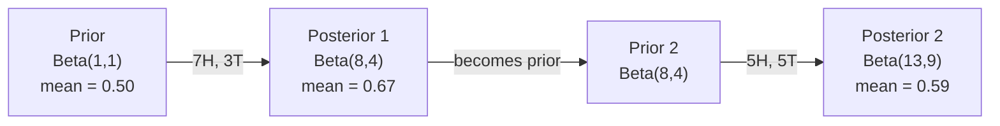

# 贝叶斯定理

> 概率描述的是你的预期，而贝叶斯定理描述的是你通过数据学到的结论。

**类型：** 构建
**语言：** Python
**先修要求：** 第一阶段第06课（概率基础）
**时长：** 约75分钟

## 学习目标

- 运用贝叶斯定理，根据先验概率、似然概率及证据值计算后验概率  
- 通过拉普拉斯平滑与对数空间运算，从零开始构建朴素贝叶斯文本分类器  
- 比较最大似然估计（MLE）与最大后验估计（MAP），并解释 MAP 如何对应于 L2 正则化  
- 利用 Beta-Binomial 共轭先验实现顺序贝叶斯更新，用于 A/B 测试

## 问题所在

某项医学检测的准确率为99%。您进行了检测，结果呈阳性。那么您真正患有该疾病的可能性是多少？

大多数人会回答99%。但实际答案取决于该疾病的罕见程度。如果每10,000人中仅有1人患病，那么阳性结果仅意味着您患病的概率约为1%。其余99%的阳性结果都是健康人群产生的误报。

这并非陷阱题，而是贝叶斯定理的应用。所有的垃圾邮件过滤器、医学诊断工具以及用于量化不确定性的机器学习模型都采用这种推理方式：首先确立初始信念，再观察证据，最后更新信念值。

如果不理解这一原理就构建机器学习系统，就会错误解读模型输出，设定不当的阈值，并输出过度自信的预测结果。

## 概念概述

### 从联合概率到贝叶斯定理

正如第 06 课中所介绍的，条件概率定义为：

```
P(A|B) = P(A and B) / P(B)
```

对称地：

```
P(B|A) = P(A and B) / P(A)
```

这两个表达式的分子相同，均为 P(A 和 B)。令它们相等并重新排列：

```
P(A and B) = P(A|B) * P(B) = P(B|A) * P(A)

Therefore:

P(A|B) = P(B|A) * P(A) / P(B)
```

这就是贝叶斯定理。四个量，一个方程式。

### 四个部分

| 部分 | 名称 | 含义 |
|------|------|---------------|
| P(A\|B) | 后验概率 | 在看到证据 B 后，你对 A 的更新后的信念 |
| P(B\|A) | 可能性 | 若 A 为真，则出现证据 B 的概率 |
| P(A) | 先验概率 | 在未看到任何证据之前，你对 A 的信念 |
| P(B) | 证据概率 | 在所有可能性下出现 B 的总概率 |

证据项 P(B) 起到归一化的作用。你可以利用全概率公式来展开它：

```
P(B) = P(B|A) * P(A) + P(B|not A) * P(not A)
```

### 医学检测示例

该疾病影响每10,000人中的1人。该检测的准确率为99%（能识别出99%的患病者，同时有1%的概率出现假阳性）。

```
P(sick)          = 0.0001     (prior: disease is rare)
P(positive|sick) = 0.99       (likelihood: test catches it)
P(positive|healthy) = 0.01    (false positive rate)

P(positive) = P(positive|sick) * P(sick) + P(positive|healthy) * P(healthy)
            = 0.99 * 0.0001 + 0.01 * 0.9999
            = 0.000099 + 0.009999
            = 0.010098

P(sick|positive) = P(positive|sick) * P(sick) / P(positive)
                 = 0.99 * 0.0001 / 0.010098
                 = 0.0098
                 = 0.98%
```

不到 1%。先前的结果占主导地位。当某种情况极为罕见时，即便是准确的检测也大多会产生假阳性结果。这就是为什么医生需要安排确认检测的原因。

### 垃圾邮件过滤示例

您收到一封包含“lottery”一词的邮件。这是垃圾邮件吗？

```
P(spam)                = 0.3      (30% of email is spam)
P("lottery"|spam)      = 0.05     (5% of spam emails contain "lottery")
P("lottery"|not spam)  = 0.001    (0.1% of legitimate emails contain "lottery")

P("lottery") = 0.05 * 0.3 + 0.001 * 0.7
             = 0.015 + 0.0007
             = 0.0157

P(spam|"lottery") = 0.05 * 0.3 / 0.0157
                  = 0.955
                  = 95.5%
```

仅一个单词的差异就能使概率从 30% 上升到 95.5%。而真正的垃圾邮件过滤器则会同时应用贝叶斯算法于数百个单词之上。

### 朴素贝叶斯：独立性假设

朴素贝叶斯通过假设在给定类别的条件下所有特征都是条件独立的，从而将其扩展到多个特征的情况：

```
P(class | feature_1, feature_2, ..., feature_n)
  = P(class) * P(feature_1|class) * P(feature_2|class) * ... * P(feature_n|class)
    / P(feature_1, feature_2, ..., feature_n)
```

“朴素”模型的核心在于其独立性假设。在文本中，单词的出现并非相互独立的（例如“New”与“York”之间存在关联）。但实际上这一假设的适用效果出奇地好，因为分类器仅需对类别进行排序，无需生成经过校准的概率值。

由于所有类别的分母相同，可直接忽略分母，仅比较分子即可：

```
score(class) = P(class) * product of P(feature_i | class)
```

选择得分最高的类。

### 最大似然估计（MLE）

如何从训练数据中获取 P(feature|class) 值？通过计数法。

```
P("free"|spam) = (number of spam emails containing "free") / (total spam emails)
```

这就是最大似然估计（MLE）：选择能够使观测数据出现概率最大的参数值。其本质是最大化似然函数，对于离散计数而言，该函数可简化为相对频率。

问题：如果在训练过程中某个词从未在垃圾邮件中出现过，MLE会赋予它零概率。一个未见过的新词就会导致整个产品无法正常运行。可通过拉普拉斯平滑法来解决这一问题：

```
P(word|class) = (count(word, class) + 1) / (total_words_in_class + vocabulary_size)
```

将每个计数值加 1 可确保概率永远不会为零。

### 最大后验概率（MAP）

MLE 的问题是：哪些参数能使 P(data|parameters) 最大化？

MAP 的问题是：哪些参数能使 P(parameters|data) 最大化？

根据贝叶斯定理：

```
P(parameters|data) proportional to P(data|parameters) * P(parameters)
```

MAP 在参数本身之上添加了一个先验分布。如果你认为参数应保持较小，可以通过设置一个惩罚大值的先验来实现这一目标。这与机器学习中的 L2 正则化原理完全相同。岭回归中的“脊”惩罚实际上就是对权重施加的高斯先验。

| 估计方法 | 最优化目标 | 对应的机器学习概念 |
|----------|-----------|-------------------|
| MLE | P(data\|params) | 未进行正则化的训练 |
| MAP | P(data\|params) * P(params) | L2 / L1 正则化 |

### 贝叶斯与频率主义：实际应用中的差异

频率学派将参数视为固定的未知量。他们的思考方式是：“如果我重复进行多次实验，会出现什么结果？”

贝叶斯学派则将参数视为概率分布。他们的思考方式是：“根据我所观察到的数据，我对这些参数应持有怎样的信念？”

在构建机器学习系统时，两者的实际差异如下：

| 方面 | 频率学派 | 贝叶斯学派 |
|------|-----------|----------|
| 输出结果 | 点估计值 | 值的分布 |
| 不确定性表达 | 置信区间（针对统计流程） | 可信区间（针对参数本身） |
| 小样本场景 | 容易过拟合 | 先验分布起到正则化作用 |
| 计算效率 | 通常更快 | 常需采样算法（如 MCMC） |

大多数实际生产环境中的机器学习应用都属于频率学派（例如 SGD、点估计）。而当需要精确度量不确定性（如医疗决策、安全关键系统）或数据量极为匮乏时（如少样本学习、冷启动问题），贝叶斯方法则展现出显著优势。

### 为何贝叶斯思维对机器学习至关重要

这种联系远非简单的类比：

**先验即正则化。** 对权重设置高斯先验相当于进行 L2 正则化，而拉普拉斯先验则对应 L1 正则化。每当你加入一个正则化项时，实际上都是在用贝叶斯方法表达你对参数取值的预期。

**后验即不确定性。** 单一的预测概率无法体现模型对该估计结果的置信程度。贝叶斯方法则会给出一个概率分布：“我认为垃圾邮件的概率在 0.8 到 0.95 之间。”

**贝叶斯更新即在线学习。** 今天的后验会成为明天的先验。当模型遇到新数据时，它会逐步更新自身的信念，而非从头开始重新训练。

**模型比较也属于贝叶斯范畴。** 贝叶斯信息准则（BIC）、边际似然以及贝叶斯因子均运用贝叶斯推理，在避免过拟合的前提下帮助选择最优模型。

```figure
bayes-update
```

## 构建它

### 步骤 1：贝叶斯定理函数

```python
def bayes(prior, likelihood, false_positive_rate):
    evidence = likelihood * prior + false_positive_rate * (1 - prior)
    posterior = likelihood * prior / evidence
    return posterior

result = bayes(prior=0.0001, likelihood=0.99, false_positive_rate=0.01)
print(f"P(sick|positive) = {result:.4f}")
```

### 步骤 2：朴素贝叶斯分类器

```python
import math
from collections import defaultdict

class NaiveBayes:
    def __init__(self, smoothing=1.0):
        self.smoothing = smoothing
        self.class_counts = defaultdict(int)
        self.word_counts = defaultdict(lambda: defaultdict(int))
        self.class_word_totals = defaultdict(int)
        self.vocab = set()

    def train(self, documents, labels):
        for doc, label in zip(documents, labels):
            self.class_counts[label] += 1
            words = doc.lower().split()
            for word in words:
                self.word_counts[label][word] += 1
                self.class_word_totals[label] += 1
                self.vocab.add(word)

    def predict(self, document):
        words = document.lower().split()
        total_docs = sum(self.class_counts.values())
        vocab_size = len(self.vocab)
        best_class = None
        best_score = float("-inf")
        for cls in self.class_counts:
            score = math.log(self.class_counts[cls] / total_docs)
            for word in words:
                count = self.word_counts[cls].get(word, 0)
                total = self.class_word_totals[cls]
                score += math.log((count + self.smoothing) / (total + self.smoothing * vocab_size))
            if score > best_score:
                best_score = score
                best_class = cls
        return best_class
```

对数概率可防止下溢问题。将多个较小的概率相乘会导致结果数值过小，超出浮点数的表示范围。而对数概率求和在数值上更为稳定，且在数学意义上与之等价。

### 步骤 3：使用垃圾邮件数据进行训练

```python
train_docs = [
    "win free money now",
    "free lottery ticket winner",
    "claim your prize today free",
    "urgent offer free cash",
    "congratulations you won free",
    "meeting tomorrow at noon",
    "project update attached",
    "can we schedule a call",
    "quarterly report review",
    "lunch on thursday sounds good",
    "team standup notes attached",
    "please review the pull request",
]

train_labels = [
    "spam", "spam", "spam", "spam", "spam",
    "ham", "ham", "ham", "ham", "ham", "ham", "ham",
]

classifier = NaiveBayes()
classifier.train(train_docs, train_labels)

test_messages = [
    "free money waiting for you",
    "meeting rescheduled to friday",
    "you won a free prize",
    "please review the attached report",
]

for msg in test_messages:
    print(f"  '{msg}' -> {classifier.predict(msg)}")
```

### 步骤 4：检查学到的概率值

```python
def show_top_words(classifier, cls, n=5):
    vocab_size = len(classifier.vocab)
    total = classifier.class_word_totals[cls]
    probs = {}
    for word in classifier.vocab:
        count = classifier.word_counts[cls].get(word, 0)
        probs[word] = (count + classifier.smoothing) / (total + classifier.smoothing * vocab_size)
    sorted_words = sorted(probs.items(), key=lambda x: x[1], reverse=True)
    for word, prob in sorted_words[:n]:
        print(f"    {word}: {prob:.4f}")

print("\nTop spam words:")
show_top_words(classifier, "spam")
print("\nTop ham words:")
show_top_words(classifier, "ham")
```

## 使用它

Scikit-learn 提供了可直接用于生产环境的朴素贝叶斯实现：

```python
from sklearn.feature_extraction.text import CountVectorizer
from sklearn.naive_bayes import MultinomialNB
from sklearn.metrics import classification_report

vectorizer = CountVectorizer()
X_train = vectorizer.fit_transform(train_docs)
clf = MultinomialNB()
clf.fit(X_train, train_labels)

X_test = vectorizer.transform(test_messages)
predictions = clf.predict(X_test)
for msg, pred in zip(test_messages, predictions):
    print(f"  '{msg}' -> {pred}")
```

同样的算法。CountVectorizer负责分词与词汇表构建，而MultinomialNB则内部处理平滑处理及对数概率计算。你从零实现的版本仅需40行代码即可完成相同功能。

## 发布它

此处实现的 NaiveBayes 类展示了完整的处理流程：分词、使用拉普拉斯平滑进行概率估计，以及对数空间预测。`code/bayes.py` 文件中的代码可以端到端运行，且除 Python 标准库外无需任何其他依赖。

### 共轭先验

当先验分布与后验分布属于同一族分布时，该先验被称为“共轭先验”。这使得贝叶斯更新在代数上更为简洁——无需数值积分即可得到封闭形式的后验分布。

| 似然分布 | 共轭先验 | 后验分布 | 示例 |
|-----------|----------------|-----------|---------|
| 伯努利分布 | Beta(a, b) | Beta(a + 成功次数, b + 失败次数) | 硬币翻转偏差估计 |
| 正态分布（方差已知） | Normal(mu_0, sigma_0) | Normal(加权均值, 更小的方差) | 传感器校准 |
| 泊松分布 | Gamma(a, b) | Gamma(a + 计数总和, b + n) | 到达率建模 |
| 多项式分布 | Dirichlet(alpha) | Dirichlet(alpha + 计数值) | 主题建模、语言模型 |

其重要性在于：若没有共轭先验，就需要通过蒙特卡洛抽样或变分推断来近似后验分布；而使用共轭先验时，只需更新两个数值即可。

在实践中，Beta分布是最常见的共轭先验。Beta(a, b)代表了你对某个概率参数的信念。其均值为 a/(a+b)。a+b 的值越大，该分布越集中（置信度越高）。

Beta先验的特殊情况：
- Beta(1, 1) = 均匀分布。表示你对该参数没有特定看法。
- Beta(10, 10) = 峰值位于0.5处。表示你强烈认为该参数接近0.5。
- Beta(1, 10) | 偏向0。表示你认为该参数较小。

更新规则极为简单：

```
Prior:     Beta(a, b)
Data:      s successes, f failures
Posterior: Beta(a + s, b + f)
```

无需积分，也无需采样，仅需进行加法运算。

### 顺序贝叶斯更新

贝叶斯推断本质上是顺序式的。今天的后验概率会成为明天的先验概率。正是通过这种方式，真实系统能够在无需重新处理所有历史数据的情况下逐步学习。

具体示例：判断一枚硬币是否公平。

**第1天：尚未有数据。**
从 Beta(1, 1) —— 即均匀先验开始。此时你没有任何看法。
- 先验均值：0.5
- 先验概率在 [0, 1] 区间内为常数

**第2天：观察到7次正面，3次反面。**
后验概率 = Beta(1 + 7, 1 + 3) = Beta(8, 4)
- 后验均值：8/12 = 0.667
- 现有证据表明该硬币偏向正面

**第3天：再观察到5次正面，5次反面。**
将昨天的后验概率作为今天的先验概率。
后验概率 = Beta(8 + 5, 4 + 5) = Beta(13, 9)
- 后验均值：13/22 = 0.591
- 新的均衡数据使估计值重新向0.5靠拢



观测顺序并不重要。一次性使用全部12次正面结果和8次负面结果对Beta(1,1)进行更新，得到的结果仍是Beta(13, 9)——二者完全相同。逐次更新与批量更新在数学上是等价的。但逐次更新允许我们在每一步做出决策，而无需存储原始数据。

这正是生产环境中的在线学习方法的基础。强盗分金问题中的汤普森采样、增量推荐系统以及流式异常检测器均采用这种模式。

### 与 A/B 测试的连接

A/B测试本质上是贝叶斯推断的另一种表现形式。

实验设置：你需要测试两种按钮颜色，即版本A（蓝色）和版本B（绿色），并确定哪种颜色能获得更多点击量。

基于贝叶斯的A/B测试流程如下：

1. **先验分布。** 为两个版本均设定为Beta(1, 1)分布，表示没有初始偏好。
2. **观测数据。** 版本A在1000次展示中获得了50次点击；版本B在1000次展示中获得了65次点击。
3. **后验分布。**
   - A：Beta(1 + 50, 1 + 950) = Beta(51, 951)，其均值约为0.051
   - B：Beta(1 + 65, 1 + 935) = Beta(66, 936)，其均值约为0.066
4. **决策制定。** 计算P(B > A)，即版本B的实际转化率高于版本A的概率。

虽然通过解析方法计算P(B > A)较为困难，但使用蒙特卡洛方法可以轻松解决该问题：

```
1. Draw 100,000 samples from Beta(51, 951)  -> samples_A
2. Draw 100,000 samples from Beta(66, 936)  -> samples_B
3. P(B > A) = fraction of samples where B > A
```

如果 P(B > A) > 0.95，则发布版本 B；若该值介于 0.05 与 0.95 之间，则继续收集数据；若 P(B > A) < 0.05，则发布版本 A。

相较于频率论 A/B 测试的优势：
- 可直接获得概率表述：“有 97% 的可能性 B 更优”
- 不存在 p 值带来的混淆，无需使用“无法拒绝零假设”这类模棱两可的表述
- 可随时查看结果而不会增加假阳性率（无“窥视问题”）
- 能够结合先验知识（例如，以往测试表明转化率通常在 3% 至 8% 之间）

| 维度 | 频率论 A/B 测试 | 贝叶斯 A/B 测试 |
|------|----------------|--------------|
| 输出结果 | p 值 | P(B > A) |
| 解释方式 | “在假设 A=B 的前提下，这些数据有多令人惊讶？” | “B 比 A 更优的概率有多大？” |
| 提前终止机制 | 会导致假阳性率上升 | 只要先验选择合理且模型设定正确，随时停止均安全 |
| 先验知识的应用 | 不使用 | 以 Beta 先验的形式进行编码 |
| 决策规则 | p < 0.05 | P(B > A) > 阈值 |

## 练习题

1. **多次检测。** 某患者在接受两次独立检测时均呈阳性（两次检测的准确率均为99%，疾病患病率为万分之一）。在两次检测之后，P(sick)的值是多少？请以第一次检测的后验概率作为第二次检测的先验概率。

2. **平滑处理的影响。** 使用平滑系数分别为0.01、0.1、1.0和10.0来运行垃圾邮件分类器。此时各关键词的概率会发生怎样的变化？当平滑系数为0且某个词仅出现在“正常”数据集中时，会出现什么情况？

3. **添加特征。** 扩展NaiveBayes类，除了单词出现次数外，还将消息长度（短/长）作为特征使用。根据训练数据估算P(short|spam)和P(short|ham)，并将其纳入预测得分中。

4. **手动计算MAP估计值。** 已知观测数据为10次硬币抛掷中有7次正面朝上，使用Beta(2,2)先验分布计算偏置的MAP估计值。并将该结果与MLE估计值（7/10）进行比较。

## 关键术语

| 术语 | 通俗说法 | 实际含义 |
|------|----------|----------|
| 先验概率 | “我的初始猜测” | 观测到证据之前的 P(假设)。在机器学习中指正则化项。 |
| 可能度 | “数据匹配程度” | P(证据\|假设)。即在特定假设下观测到当前数据的概率。 |
| 后验概率 | “我更新后的信念” | P(假设\|证据)。为先验概率乘以可能度后再进行归一化得到的结果。 |
| 证据概率 | “归一化常数” | 所有假设下的 P(数据) 值。用于确保后验概率之和为 1。 |
| 朴素贝叶斯 | “那种简单的文本分类器” | 一种假设在给定类别条件下各特征相互独立的分类器。尽管存在这一错误假设，但其性能依然良好。 |
| 拉普拉斯平滑 | “加一平滑处理” | 为每个特征添加一个小的计数值，以避免因未见过的数据而导致概率为零。 |
| 最大似然估计 | “直接使用频率值” | 选择能够使 P(数据\|参数) 达到最大的参数值。不考虑先验信息。在数据量较小时容易过拟合。 |
| 最大后验估计 | “带有先验的最小二乘估计” | 选择能够使 P(数据\|参数) * P(参数) 达到最大的参数值。等同于经过正则化的最大似然估计。 |
| 对数概率 | “在对数空间中进行计算” | 使用 log(P) 而非 P，以避免在多次乘以较小数值时出现浮点数下溢问题。 |
| 错误阳性 | “错误的警报” | 测试结果为阳性，但实际状态为阴性。这会导致基础率谬误。 |

## 延伸阅读

- [3Blue1Brown：贝叶斯定理](https://www.youtube.com/watch?v=HZGCoVF3YvM) —— 通过医学检测案例的可视化讲解  
- [斯坦福 CS229：生成学习算法](https://cs229.stanford.edu/notes2022fall/cs229-notes2.pdf) —— 朴素贝叶斯及其与判别模型的关联  
- [Think Bayes](https://greenteapress.com/wp/think-bayes/) —— 免费书籍，包含 Python 代码的贝叶斯统计教程  
- [scikit-learn 朴素贝叶斯模块](https://scikit-learn.org/stable/modules/naive_bayes.html) —— 实际应用实现及各类变体的适用场景
