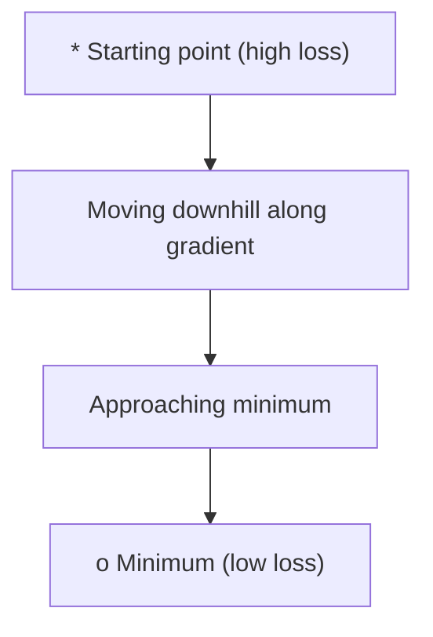
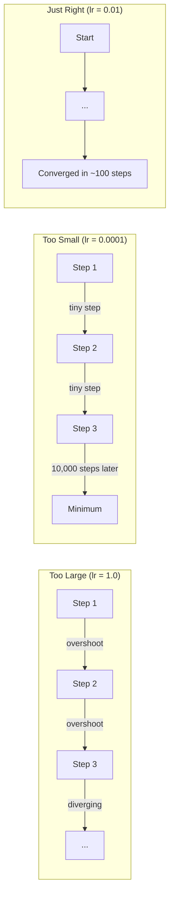
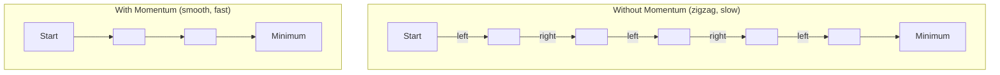
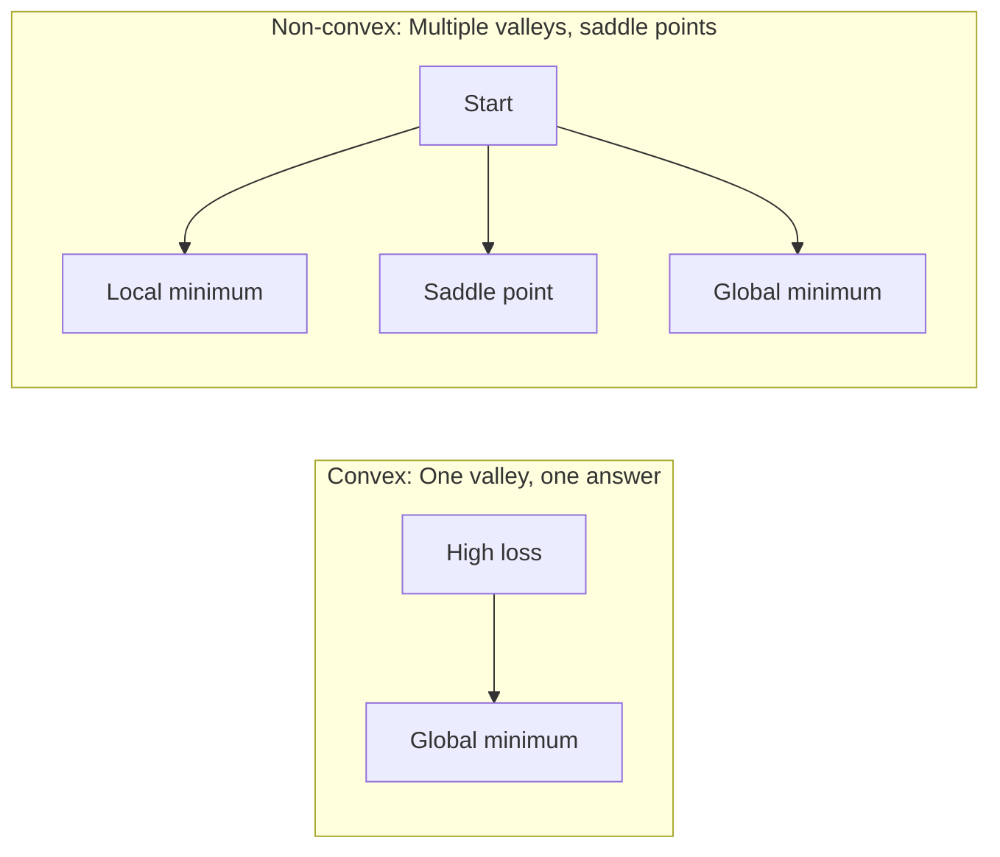
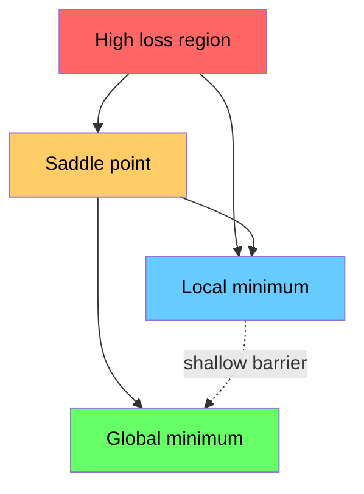

# 优化

> 训练神经网络本质上就是寻找山谷的底部。

**类型：** 构建
**语言：** Python
**先修要求：** 第一阶段，第04-05课（导数、梯度）
**耗时：** 约75分钟

## 学习目标

- 从零实现基础梯度下降、带动量的随机梯度下降以及 Adam 优化器  
- 对比这些优化器在 Rosenbrock 函数上的收敛情况，并解释为何 Adam 能够为不同权重设置不同的学习率  
- 区分凸损失函数与非凸损失函数，阐述高维空间中鞍点的作用  
- 配置学习率调度策略（步长衰减、余弦退火、热身阶段）以确保训练稳定性

## 问题所在

你拥有一个损失函数，它用于指示模型的误差大小。你还有梯度信息，它们能告诉你哪个方向会使得损失进一步增大。现在你需要一种“下山”的策略。

最简单的方法是：沿着与梯度相反的方向移动，并通过一个称为学习率的数值来调整步长，然后重复此过程。这就是梯度下降法，而且确实有效。但“有效”这个词也带有其局限性——如果学习率过大，模型会完全越过谷底，在各边界之间来回震荡；如果学习率过小，则需要数千次不必要的步骤才能缓慢接近最优解。一旦遇到鞍点，即使尚未找到最小值，模型也会停止移动。

深度学习中的每一个优化器都是对同一个问题的解答：如何更快、更可靠地到达谷底？

## 概念概述

### 优化指的是什么

优化是指寻找能够使函数值最小化（或最大化）的输入值。在机器学习中，该函数即为损失函数，而输入则为模型的权重。训练过程本质上就是一种优化过程。

```
minimize L(w) where:
  L = loss function
  w = model weights (could be millions of parameters)
```

### 普通梯度下降法

最简单的优化器。计算损失函数对每个权重的梯度，然后将每个权重向与其梯度相反的方向移动，并通过学习率来缩放该步长。

```
w = w - lr * gradient
```

这就是整个算法，仅有一行。



### 学习率：最重要的超参数

学习率用于控制步长大小，它决定了收敛过程的所有关键因素。



并不存在适用于所有情况的理想学习率公式。需要通过实验来寻找合适的值。常见的初始设置如下：Adam 算法的初始值为 0.001，带动量项的 SGD 算法的初始值为 0.01。

### SGD 与批量学习与小批量学习的对比

普通梯度下降在迈出一步之前会先计算整个数据集的梯度，这被称为批量梯度下降。该方法虽然稳定，但速度较慢。

随机梯度下降（SGD）则是在单个随机样本上计算梯度并立即更新参数。虽然存在噪声，但其速度很快。

小批量梯度下降则折中了两者：它先对一个小批次（32、64、128或256个样本）计算梯度，然后再进行参数更新。这实际上是大家最常用的方法。

| 变体 | 批量大小 | 梯度精度 | 每步速度 | 噪声程度 |
|---------|-----------|----------|------------|----------|
| 批量GD | 整个数据集 | 精确无误 | 慢 | 无 |
| SGD | 1个样本 | 噪声极大 | 快 | 高 |
| 小批量 | 32-256 | 良好估计值 | 适中 | 中等 |

SGD和小批量梯度下降中的噪声并非缺陷，反而有助于避免陷入浅层局部最小值和鞍点。

### 动量：滚下山坡的球

普通的梯度下降法仅考虑当前的梯度值。如果在狭窄的“山谷”区域中梯度呈现之字形变化，算法的收敛速度就会很慢。动量法通过将历史梯度累加到一个速度项中来解决这一问题。

```
v = beta * v + gradient
w = w - lr * v
```

类比：一个滚下山坡的球。它不会在每一个颠簸处都停下来再重新开始滚动，而是沿着一致的方向不断加速，并抑制振荡。



`beta`（通常为 0.9）用于控制需保留的历史数据量。较高的 `beta` 值意味着更大的惯性，路径更加平滑，但对方向变化的响应速度较慢。

### Adam：自适应学习率

不同的权重需要不同的学习率。那些很少出现较大梯度的权重，在最终出现较大梯度时应当采取更大的步长；而那些始终存在巨大梯度的权重，则应采取更小的步长。

Adam（自适应矩估计）会为每个权重跟踪两项数值：

1. 第一矩（m）：梯度的滑动平均值（类似于动量）
2. 第二矩（v）：梯度平方的滑动平均值（即梯度幅度）

```
m = beta1 * m + (1 - beta1) * gradient
v = beta2 * v + (1 - beta2) * gradient^2

m_hat = m / (1 - beta1^t)    bias correction
v_hat = v / (1 - beta2^t)    bias correction

w = w - lr * m_hat / (sqrt(v_hat) + epsilon)
```

除以 `sqrt(v_hat)` 是该算法的核心思想。梯度较大的权重会被一个较大的数相除（从而产生较小的有效步长），而梯度较小的权重则会被一个较小的数相除（从而产生较大的有效步长）。每个权重都能拥有独立的自适应学习率。

默认超参数为：`lr=0.001, beta1=0.9, beta2=0.999, epsilon=1e-8`。这些默认值适用于大多数问题。

### 学习率调度策略

固定的学习率是一种折中方案。在训练初期，需要较大的步长以快速取得进展；而在训练后期，则需要较小的步长来在接近最优解的位置进行微调。

常见的学习率调度策略：

| 调度策略 | 公式 | 适用场景 |
|----------|---------|----------|
| 步长衰减 | lr = lr * factor 每 N 个周期 | 简单的手动控制 |
| 指数衰减 | lr = lr_0 * decay^t | 平滑的下降过程 |
| 余弦退火 | lr = lr_min + 0.5 * (lr_max - lr_min) * (1 + cos(pi * t / T)) | Transformer 模型及现代训练方法 |
| 预热+衰减 | 先线性上升，随后衰减 | 大型模型，防止训练初期出现不稳定现象 |

### 凸函数与非凸函数

凸函数只有一个最小值。梯度下降法总能找到它。像 `f(x) = x^2` 这样的二次函数就是凸函数。

神经网络的损失函数则是非凸的。它们存在许多局部最小值、鞍点以及平坦区域。



在实践中，高维神经网络中的局部最小值很少构成问题。大多数局部最小值的损失值与全局最小值非常接近。真正的障碍是鞍点（在某些方向上平坦，在其他方向上则呈弯曲状）。动量机制以及小批量训练带来的噪声有助于帮助模型摆脱这些鞍点。

### 损失函数景观可视化

损失函数是所有权重值的函数。对于一个拥有100万个权重的模型，其损失曲面存在于1,000,001维空间中。我们通过在权重空间中随机选取两个方向，并沿这些方向绘制损失值，从而将其可视化为一个二维表面。



尖锐的极小值泛化能力较差，而平坦的极小值则具有较好的泛化能力。这也是带有动量的随机梯度下降法在最终测试准确率上往往优于 Adam 的原因之一：其引入的噪声能够防止算法陷入尖锐的极小值中。

```figure
gradient-descent
```

## 构建它

### 步骤 1：定义测试函数

Rosenbrock函数是经典的优化基准函数。其最小值位于(1, 1)点，处于一个狭窄的弯曲谷底中——该点易于找到，但难以持续追踪。

```
f(x, y) = (1 - x)^2 + 100 * (y - x^2)^2
```

```python
def rosenbrock(params):
    x, y = params
    return (1 - x) ** 2 + 100 * (y - x ** 2) ** 2

def rosenbrock_gradient(params):
    x, y = params
    df_dx = -2 * (1 - x) + 200 * (y - x ** 2) * (-2 * x)
    df_dy = 200 * (y - x ** 2)
    return [df_dx, df_dy]
```

### 步骤 2：传统梯度下降法

```python
class GradientDescent:
    def __init__(self, lr=0.001):
        self.lr = lr

    def step(self, params, grads):
        return [p - self.lr * g for p, g in zip(params, grads)]
```

### 步骤 3：带动量的随机梯度下降

```python
class SGDMomentum:
    def __init__(self, lr=0.001, momentum=0.9):
        self.lr = lr
        self.momentum = momentum
        self.velocity = None

    def step(self, params, grads):
        if self.velocity is None:
            self.velocity = [0.0] * len(params)
        self.velocity = [
            self.momentum * v + g
            for v, g in zip(self.velocity, grads)
        ]
        return [p - self.lr * v for p, v in zip(params, self.velocity)]
```

### 步骤 4：Adam 算法

```python
class Adam:
    def __init__(self, lr=0.001, beta1=0.9, beta2=0.999, epsilon=1e-8):
        self.lr = lr
        self.beta1 = beta1
        self.beta2 = beta2
        self.epsilon = epsilon
        self.m = None
        self.v = None
        self.t = 0

    def step(self, params, grads):
        if self.m is None:
            self.m = [0.0] * len(params)
            self.v = [0.0] * len(params)

        self.t += 1

        self.m = [
            self.beta1 * m + (1 - self.beta1) * g
            for m, g in zip(self.m, grads)
        ]
        self.v = [
            self.beta2 * v + (1 - self.beta2) * g ** 2
            for v, g in zip(self.v, grads)
        ]

        m_hat = [m / (1 - self.beta1 ** self.t) for m in self.m]
        v_hat = [v / (1 - self.beta2 ** self.t) for v in self.v]

        return [
            p - self.lr * mh / (vh ** 0.5 + self.epsilon)
            for p, mh, vh in zip(params, m_hat, v_hat)
        ]
```

### 步骤 5：运行并对比

```python
def optimize(optimizer, func, grad_func, start, steps=5000):
    params = list(start)
    history = [params[:]]
    for _ in range(steps):
        grads = grad_func(params)
        params = optimizer.step(params, grads)
        history.append(params[:])
    return history

start = [-1.0, 1.0]

gd_history = optimize(GradientDescent(lr=0.0005), rosenbrock, rosenbrock_gradient, start)
sgd_history = optimize(SGDMomentum(lr=0.0001, momentum=0.9), rosenbrock, rosenbrock_gradient, start)
adam_history = optimize(Adam(lr=0.01), rosenbrock, rosenbrock_gradient, start)

for name, history in [("GD", gd_history), ("SGD+M", sgd_history), ("Adam", adam_history)]:
    final = history[-1]
    loss = rosenbrock(final)
    print(f"{name:6s} -> x={final[0]:.6f}, y={final[1]:.6f}, loss={loss:.8f}")
```

预期输出：Adam 的收敛速度最快。带有动量的 SGD 跟踪的路径更为平滑。而普通的 GD 则会在狭窄的“谷地”中缓慢前进。

## 使用它

在实践中，建议使用 PyTorch 或 JAX 的优化器。它们能够处理参数组、权重衰减、梯度裁剪以及 GPU 加速功能。

```python
import torch

model = torch.nn.Linear(784, 10)

sgd = torch.optim.SGD(model.parameters(), lr=0.01, momentum=0.9)
adam = torch.optim.Adam(model.parameters(), lr=0.001)
adamw = torch.optim.AdamW(model.parameters(), lr=0.001, weight_decay=0.01)

scheduler = torch.optim.lr_scheduler.CosineAnnealingLR(adam, T_max=100)
```

经验法则：

- 从 Adam 算法开始（学习率 lr=0.001）。在无需调整参数的情况下，它即可解决大多数问题。
- 当需要最高的最终准确率且愿意进行更多参数调优时，可改用带动量项的 SGD 算法（学习率 lr=0.01，动量 momentum=0.9）。
- 对于 Transformer 模型，应使用 AdamW 算法（即带有独立权重衰减项的 Adam 算法）。
- 对于训练周期超过几个轮次的任务，务必采用学习率调度策略。
- 若训练过程不稳定，则降低学习率；若训练速度过慢，则提高学习率。

## 发布它

本课将生成用于选择合适优化器的提示语。详情请参阅 `outputs/prompt-optimizer-guide.md`。

此处构建的优化器类在第三阶段从头开始训练神经网络时将会再次被使用。

## 练习题

1. **学习率扫描。** 在 Rosenbrock 函数上运行普通梯度下降算法，设置的学习率为 [0.0001, 0.0005, 0.001, 0.005, 0.01]。为每个学习率分别绘制或输出 5000 步后的最终损失值。找出仍能实现收敛的最大学习率。

2. **动量项对比。** 在 Rosenbrock 函数上运行带有不同动量值的 SGD 算法，动量值分别为 [0.0, 0.5, 0.9, 0.99]。记录每一步的损失变化情况。哪种动量值能使算法最快收敛？哪种会导致损失超调？

3. **鞍点逃离问题。** 定义函数 `f(x, y) = x^2 - y^2`（原点处为鞍点）。从初始点 (0.01, 0.01) 开始，比较普通梯度下降、带动量项的 SGD 以及 Adam 算法的运行表现。哪种算法能够逃离该鞍点？

4. **实现学习率衰减机制。** 在 GradientDescent 类中加入指数衰减策略：`lr = lr_0 * 0.999^step`。在 Rosenbrock 函数上对比有无学习率衰减时的收敛效果。

## 关键术语

| 术语 | 常见说法 | 实际含义 |
|------|----------|----------|
| 梯度下降 | “下山” | 通过减去按学习率缩放后的梯度来更新权重。是最基础的优化器。 |
| 学习率 | “步长” | 一个标量，用于控制每次权重更新的幅度。过大会导致发散；过小则会浪费计算资源。 |
| 动量 | “持续滚动” | 将历史梯度累积为一个速度向量。可抑制振荡，并在一致的方向上加速收敛。 |
| SGD | “随机采样” | 随机梯度下降。在随机子集而非整个数据集上计算梯度。实际应用中几乎总是指小批量 SGD。 |
| 小批量 | “一部分数据” | 用于估计梯度的训练数据的小子集（32-256 个样本）。可在速度与梯度精度之间取得平衡。 |
| Adam | “默认优化器” | 自适应动量估计法。通过跟踪每个权重的梯度及其平方的滑动平均值，为每个权重分配独立的学习率。 |
| 偏差校正 | “解决冷启动问题” | Adam 的一阶和二阶矩初始值设为零。偏差校正通过除以 (1 - beta^t) 来在训练初期进行补偿。 |
| 学习率调度 | “随时间调整学习率” | 一种在训练过程中调整学习率的函数。前期采用较大步长，后期采用较小步长。 |
| 凸函数 | “一个谷底” | 任何局部最小值都是全局最小值的函数。梯度下降总能找到它。神经网络的损失函数并非凸函数。 |
| 马鞍点 | “平坦但非最小值” | 梯度为零的点，但在某些方向上是最小值，在其他方向上是最大值。在高维空间中较为常见。 |
| 损失地形图 | “地形图” | 在权重空间上绘制的损失函数图像。通常通过沿两个随机方向切片来可视化。 |
| 收敛 | “到达目标点” | 优化器已达到一个不再有显著降低损失空间的点。 |

## 延伸阅读

- [Sebastian Ruder：梯度下降优化算法概述](https://ruder.io/optimizing-gradient-descent/) - 对所有主流优化器的全面综述  
- [为什么动量法真的有效（Distill）](https://distill.pub/2017/momentum/) - 动量机制的交互式可视化展示  
- [Adam：一种随机优化方法（Kingma & Ba，2014）](https://arxiv.org/abs/1412.6980) - Adam算法的原始论文，内容通俗且篇幅简短  
- [神经网络损失函数的可视化分析（Li等人，2018）](https://arxiv.org/abs/1712.09913) - 阐述尖锐极小值与平坦极小值差异的论文
