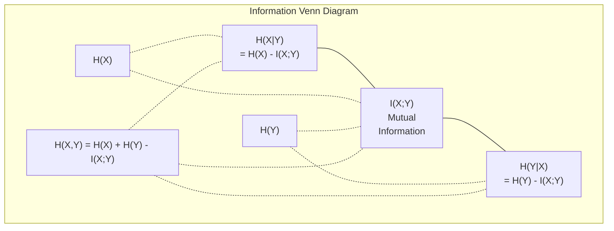

# 信息论

> 信息论用于衡量“意外性”，损失函数正是建立在其基础之上的。

**类型：** 学习
**语言：** Python
**先修要求：** 第一阶段，第06课（概率）
**时长：** 约60分钟

## 学习目标

- 从零实现熵、交叉熵和KL散度，并解释它们之间的关系  
- 推导为何最小化交叉熵损失等同于最大化对数似然  
- 计算特征与目标之间的互信息，以对特征重要性进行排序  
- 解释困惑度即语言模型所选择的有效词汇表大小

## 问题所在

在您训练的每一个分类模型中，都会调用 `CrossEntropyLoss()` 函数。在每一篇语言模型论文中都能看到“困惑度”这一概念。而在变分自编码器、知识蒸馏以及强化学习人类反馈优化等相关技术中，又会提到 KL 散度。这些其实并非相互孤立的概念，它们本质上是同一个思想的不同表现形式。

信息论为人们提供了分析不确定性、数据压缩及预测问题的理论工具。克劳德·香农于 1948 年发明了这一理论，初衷是为了解决通信领域的问题。事实证明，训练神经网络同样属于通信问题：模型试图通过由学习得到的权重构成的“噪声信道”来传递正确的标签。

本课程将从基础开始推导每一个公式，帮助您理解它们的来源及其作用原理。

## 概念概述

### 信息内容（惊喜元素）

当发生某种不太可能的事情时，它所携带的信息量更大。硬币正面朝上？这并不令人意外。而中彩票呢？那就非常惊人了。

概率为 p 的事件的信息量公式为：

```
I(x) = -log(p(x))
```

使用以2为底的对数可以得到比特。使用自然对数则可以得到纳特。原理相同，只是单位不同而已。

```
Event              Probability    Surprise (bits)
Fair coin heads    0.5            1.0
Rolling a 6        0.167          2.58
1-in-1000 event    0.001          9.97
Certain event      1.0            0.0
```

某些事件不携带任何信息。因为您早已知道它们会发生。

### 熵（平均惊讶度）

熵是指在分布的所有可能结果中，预期惊讶值的度量。

```
H(P) = -sum( p(x) * log(p(x)) )  for all x
```

公平硬币作为二元变量时具有最大熵值：1比特。而偏置硬币（正面概率为99%）的熵值很低：0.08比特。由于结果早已可知，每次抛掷几乎无法提供任何新信息。

```
Fair coin:    H = -(0.5 * log2(0.5) + 0.5 * log2(0.5)) = 1.0 bit
Biased coin:  H = -(0.99 * log2(0.99) + 0.01 * log2(0.01)) = 0.08 bits
```

熵用于衡量分布中不可消除的不确定性。数据压缩率无法低于该值。

### 交叉熵（你每天都在使用的损失函数）

交叉熵用于衡量当使用分布 Q 对实际上源自分布 P 的事件进行编码时，所产生的平均惊讶程度。

```
H(P, Q) = -sum( p(x) * log(q(x)) )  for all x
```

P 表示真实分布（即标签值）。Q 表示模型的预测结果。若 Q 与 P 完全一致，则交叉熵等于熵值；任何差异都会使交叉熵增大。

在分类任务中，P 是一个独热向量（真实类别的概率为 1，其余所有类别的概率均为 0）。这使得交叉熵可简化为：

```
H(P, Q) = -log(q(true_class))
```

这就是分类任务中完整的交叉熵损失函数公式。需最大化正确类别的预测概率。

### KL散度（分布之间的距离）

KL散度用于衡量使用Q而非P时所带来的额外惊讶程度。

```
D_KL(P || Q) = sum( p(x) * log(p(x) / q(x)) )  for all x
             = H(P, Q) - H(P)
```

交叉熵等于熵与KL散度的之和。由于在训练过程中真实分布的熵是恒定的，因此最小化交叉熵就等同于最小化KL散度。这样做的目的是将模型生成的分布逐步逼近真实分布。

KL散度不具有对称性：D_KL(P || Q) != D_KL(Q || P)。它并非真正的距离度量标准。

### 互信息

互信息用于衡量了解一个变量能在多大程度上帮助你理解另一个变量。

```
I(X; Y) = H(X) - H(X|Y)
        = H(X) + H(Y) - H(X, Y)
```

如果 X 和 Y 是独立的，那么互信息为零。知晓其中一个变量无法提供关于另一个变量的任何信息。若两者完全相关，则互信息等于任一变量的熵值。

在特征选择中，某个特征与目标变量之间的互信息较高意味着该特征具有实用性；而互信息较低则表明其为噪声。

### 条件熵

H(Y|X) 衡量在观测到 X 之后，关于 Y 的不确定性还剩下多少。

```
H(Y|X) = H(X,Y) - H(X)
```

两个极端情况：
- 如果 X 完全决定了 Y，则 H(Y|X) = 0。知晓 X 即可消除关于 Y 的所有不确定性。示例：X 为摄氏温度，Y 为华氏温度。
- 如果 X 对 Y 没有任何信息量，则 H(Y|X) = H(Y)。知晓 X 完全无法降低不确定性。示例：X 为硬币抛掷结果，Y 为明天的天气。

条件熵始终非负，且永远不会超过 H(Y)：

```
0 <= H(Y|X) <= H(Y)
```

在机器学习中，条件熵会出现在决策树中。在每次分裂时，算法都会选择能够最小化 H(Y|X) 的特征 X——即那个最能消除关于标签 Y 的不确定性的特征。

### 联合熵

H(X,Y) 表示 X 与 Y 的联合分布的熵值。

```
H(X,Y) = -sum sum p(x,y) * log(p(x,y))   for all x, y
```

关键属性：

```
H(X,Y) <= H(X) + H(Y)
```

当 X 和 Y 相互独立时，等式成立。如果它们之间存在信息共享，联合熵将小于各自熵之和。这部分“缺失”的熵正是互信息。



这些关系式如下：
- H(X,Y) = H(X) + H(Y|X) = H(Y) + H(X|Y)
- I(X;Y) = H(X) - H(X|Y) = H(Y) - H(Y|X)
- H(X,Y) = H(X) + H(Y) - I(X;Y)

### 互信息（深入解析）

互信息 I(X;Y) 用于量化了解一个变量能在多大程度上降低对另一个变量的不确定性。

```
I(X;Y) = H(X) - H(X|Y)
       = H(Y) - H(Y|X)
       = H(X) + H(Y) - H(X,Y)
       = sum sum p(x,y) * log(p(x,y) / (p(x) * p(y)))
```

属性：
- I(X;Y) 始终大于等于 0。观测任何事物都不会导致信息丢失。
- 当且仅当 X 和 Y 相互独立时，I(X;Y) = 0。
- I(X;Y) = I(Y;X)。与 KL 散度不同，它具有对称性。
- I(X;X) = H(X)。一个变量会将其所有信息都包含在自身之中。

**用于特征选择的互信息。** 在机器学习中，我们需要能够反映目标特征的那些特征。互信息为特征排序提供了一种基于原理的方法：

1. 对于每个特征 X_i，计算 I(X_i; Y)，其中 Y 为目标变量。
2. 按照互信息得分对特征进行排序。
3. 保留排名靠前的前 k 个特征。

该方法适用于特征与目标之间的任何关系——线性、非线性、单调或非单调关系均可。相关性仅能检测线性关系，而互信息则可以捕捉所有类型的依赖关系。

| 方法 | 能检测的关系类型 | 计算复杂度 | 是否支持分类变量？ |
|--------|----------------|--------------|--------------------|
| 皮尔逊相关性 | 线性关系 | O(n) | 否 |
| 斯皮尔曼相关性 | 单调关系 | O(n log n) | 否 |
| 互信息 | 任何统计依赖关系 | 带分箱处理的 O(n log n) | 是 |

### 标签平滑与交叉熵损失

标准分类使用硬目标：[0, 0, 1, 0]。真实类别的概率为 1，其余所有类别的概率均为 0。标签平滑则用软目标来替代这些硬目标：

```
soft_target = (1 - epsilon) * hard_target + epsilon / num_classes
```

当 epsilon = 0.1 且类别数为 4 时：
- 硬目标：[0, 0, 1, 0]
- 软目标：[0.025, 0.025, 0.925, 0.025]

从信息论的角度来看，标签平滑会提高目标分布的熵值。硬型独热编码目标的熵值为 0——即不存在不确定性。而软目标则具有正熵值。

其作用机制如下：
- 防止模型将逻辑斯蒂值推至极端值（在交叉熵损失函数下，要完全匹配独热编码目标需要无穷大的逻辑斯蒂值）
- 具有正则化作用：模型无法达到 100% 的置信度
- 改善概率校准：预测概率能更准确地反映真实的不确定性
- 缩小训练阶段与推理阶段的性能差异

应用标签平滑后的交叉熵损失函数表达式为：

```
L = (1 - epsilon) * CE(hard_target, prediction) + epsilon * H_uniform(prediction)
```

第二项用于惩罚偏离均匀分布的预测结果——即对置信度进行的直接正则化处理。

### 为何交叉熵是分类损失的首选

三种视角，同一结论。

**信息论视角。** 交叉熵用于衡量使用模型自身的概率分布而非真实分布时所浪费的比特数。最小化该值可使模型成为最高效的现实世界编码器。

**最大似然视角。** 对于具有真实类别 y_i 的 N 个训练样本：

```
Likelihood     = product( q(y_i) )
Log-likelihood = sum( log(q(y_i)) )
Negative log-likelihood = -sum( log(q(y_i)) )
```

最后那一行就是交叉熵损失。最小化交叉熵等价于在模型下最大化训练数据出现的概率。

**梯度视角。** 交叉熵对逻辑值的梯度即为（预测值 - 真实值）。该梯度计算简单、数值稳定且速度较快，这也是它与 softmax 完美搭配的原因。

### 位与 NAT

唯一的区别在于对数底数。

```
log base 2   -> bits      (information theory tradition)
log base e   -> nats      (machine learning convention)
log base 10  -> hartleys  (rarely used)
```

1 nat 等于 1/ln(2) 比特，即 1.4427 比特。PyTorch 和 TensorFlow 默认使用自然对数（nats）。

### 困惑度

困惑度是交叉熵的指数形式。它表示模型在多个同等可能的选择之间感到不确定时的有效选项数量。

```
Perplexity = 2^H(P,Q)   (if using bits)
Perplexity = e^H(P,Q)   (if using nats)
```

困惑度为 50 的语言模型，其平均困惑程度相当于必须从 50 个可能的下一个标记中均匀随机选择。数值越低越好。

GPT-2 在常见的基准测试中的困惑度约为 30。对于数据覆盖充分的领域，现代模型的困惑度已降至个位数。

```figure
entropy-kl
```

## 构建它

### 步骤 1：信息内容与熵

```python
import math

def information_content(p, base=2):
    if p <= 0 or p > 1:
        return float('inf') if p <= 0 else 0.0
    return -math.log(p) / math.log(base)

def entropy(probs, base=2):
    return sum(
        p * information_content(p, base)
        for p in probs if p > 0
    )

fair_coin = [0.5, 0.5]
biased_coin = [0.99, 0.01]
fair_die = [1/6] * 6

print(f"Fair coin entropy:   {entropy(fair_coin):.4f} bits")
print(f"Biased coin entropy: {entropy(biased_coin):.4f} bits")
print(f"Fair die entropy:    {entropy(fair_die):.4f} bits")
```

### 步骤 2：交叉熵与KL散度

```python
def cross_entropy(p, q, base=2):
    total = 0.0
    for pi, qi in zip(p, q):
        if pi > 0:
            if qi <= 0:
                return float('inf')
            total += pi * (-math.log(qi) / math.log(base))
    return total

def kl_divergence(p, q, base=2):
    return cross_entropy(p, q, base) - entropy(p, base)

true_dist = [0.7, 0.2, 0.1]
good_model = [0.6, 0.25, 0.15]
bad_model = [0.1, 0.1, 0.8]

print(f"Entropy of true dist:     {entropy(true_dist):.4f} bits")
print(f"CE (good model):          {cross_entropy(true_dist, good_model):.4f} bits")
print(f"CE (bad model):           {cross_entropy(true_dist, bad_model):.4f} bits")
print(f"KL divergence (good):     {kl_divergence(true_dist, good_model):.4f} bits")
print(f"KL divergence (bad):      {kl_divergence(true_dist, bad_model):.4f} bits")
```

### 步骤 3：将交叉熵作为分类损失函数

```python
def softmax(logits):
    max_logit = max(logits)
    exps = [math.exp(z - max_logit) for z in logits]
    total = sum(exps)
    return [e / total for e in exps]

def cross_entropy_loss(true_class, logits):
    probs = softmax(logits)
    return -math.log(probs[true_class])

logits = [2.0, 1.0, 0.1]
true_class = 0

probs = softmax(logits)
loss = cross_entropy_loss(true_class, logits)

print(f"Logits:      {logits}")
print(f"Softmax:     {[f'{p:.4f}' for p in probs]}")
print(f"True class:  {true_class}")
print(f"Loss:        {loss:.4f} nats")
print(f"Perplexity:  {math.exp(loss):.2f}")
```

### 步骤 4：交叉熵等于负对数似然

```python
import random

random.seed(42)

n_samples = 1000
n_classes = 3
true_labels = [random.randint(0, n_classes - 1) for _ in range(n_samples)]
model_logits = [[random.gauss(0, 1) for _ in range(n_classes)] for _ in range(n_samples)]

ce_loss = sum(
    cross_entropy_loss(label, logits)
    for label, logits in zip(true_labels, model_logits)
) / n_samples

nll = -sum(
    math.log(softmax(logits)[label])
    for label, logits in zip(true_labels, model_logits)
) / n_samples

print(f"Cross-entropy loss:      {ce_loss:.6f}")
print(f"Negative log-likelihood: {nll:.6f}")
print(f"Difference:              {abs(ce_loss - nll):.2e}")
```

### 步骤 5：互信息

```python
def mutual_information(joint_probs, base=2):
    rows = len(joint_probs)
    cols = len(joint_probs[0])

    margin_x = [sum(joint_probs[i][j] for j in range(cols)) for i in range(rows)]
    margin_y = [sum(joint_probs[i][j] for i in range(rows)) for j in range(cols)]

    mi = 0.0
    for i in range(rows):
        for j in range(cols):
            pxy = joint_probs[i][j]
            if pxy > 0:
                mi += pxy * math.log(pxy / (margin_x[i] * margin_y[j])) / math.log(base)
    return mi

independent = [[0.25, 0.25], [0.25, 0.25]]
dependent = [[0.45, 0.05], [0.05, 0.45]]

print(f"MI (independent): {mutual_information(independent):.4f} bits")
print(f"MI (dependent):   {mutual_information(dependent):.4f} bits")
```

## 使用它

使用 NumPy 实现相同概念，即您在实践中将采用的方式：

```python
import numpy as np

def np_entropy(p):
    p = np.asarray(p, dtype=float)
    mask = p > 0
    result = np.zeros_like(p)
    result[mask] = p[mask] * np.log(p[mask])
    return -result.sum()

def np_cross_entropy(p, q):
    p, q = np.asarray(p, dtype=float), np.asarray(q, dtype=float)
    mask = p > 0
    return -(p[mask] * np.log(q[mask])).sum()

def np_kl_divergence(p, q):
    return np_cross_entropy(p, q) - np_entropy(p)

true = np.array([0.7, 0.2, 0.1])
pred = np.array([0.6, 0.25, 0.15])
print(f"Entropy:    {np_entropy(true):.4f} nats")
print(f"Cross-ent:  {np_cross_entropy(true, pred):.4f} nats")
print(f"KL div:     {np_kl_divergence(true, pred):.4f} nats")
```

你已经从零实现了 `torch.nn.CrossEntropyLoss()` 的内部逻辑。现在你明白为何在训练过程中损失值会下降：因为你的模型所预测的分布正逐渐接近真实分布，这一差异通过“浪费信息的纳特数”来衡量。

## 练习题

1. 假设英文字母服从均匀分布（共26个字母），计算其熵值。然后根据实际字母出现频率重新估算该熵值。哪种结果更高？原因是什么？

2. 某模型对真实类别为1的样本输出了logits值 [5.0, 2.0, 0.5]。请手动计算交叉熵损失，并使用你的 `cross_entropy_loss` 函数进行验证。什么样的logits值能使得损失为零？

3. 证明KL散度不是对称的。选取两个概率分布 P 和 Q，分别计算 D_KL(P || Q) 和 D_KL(Q || P)。解释两者为何存在差异。

4. 编写一个函数，用于根据一系列令牌预测结果计算困惑度。给定一个包含 (true_token_index, predicted_logits) 对的列表，返回该序列的困惑度值。

## 关键术语

| 术语 | 通俗说法 | 实际含义 |
|------|----------|----------|
| 信息量 | “惊喜度” | 编码一个事件所需的比特数（或纳特数）：-log(p) |
| 熵 | “随机性” | 分布所有结果的平均惊喜度。用于衡量不可约的不确定性。 |
| 交叉熵 | “损失函数” | 使用模型分布 Q 来编码真实分布 P 中的事件时产生的平均惊喜度。 |
| KL 散度 | “分布之间的距离” | 使用 Q 而非 P 造成的额外比特浪费。等于交叉熵减去熵。该值不具有对称性。 |
| 相互信息 | “X 和 Y 的关联程度” | 了解 Y 后对 X 的不确定性降低的程度。值为零表示两者独立。 |
| Softmax | “将逻辑斯蒂值转换为概率” | 对数值进行指数运算后再归一化。可将任意实数向量映射为有效的概率分布。 |
| 困惑度 | “模型的困惑程度” | 交叉熵的指数形式。代表模型在每一步所选择的等效词汇表大小。 |
| 比特 | “香农单位” | 以 2 为底的对数来衡量信息量。1 比特可区分一次公平的硬币抛掷结果。 |
| 纳特 | “机器学习单位” | 以自然对数来衡量信息量。PyTorch 和 TensorFlow 默认使用该单位。 |
| 负对数似然 | “NLL 损失” | 对于独热编码标签而言，其与交叉熵损失相同。最小化该值可最大化正确预测的概率。 |

## 延伸阅读

- [Shannon 1948: A Mathematical Theory of Communication](https://people.math.harvard.edu/~ctm/home/text/others/shannon/entropy/entropy.pdf) - 原始论文，至今仍可阅读
- [Visual Information Theory (Chris Olah)](https://colah.github.io/posts/2015-09-Visual-Information/) - 对熵与KL散度的最佳可视化解释
- [PyTorch CrossEntropyLoss文档](https://pytorch.org/docs/stable/generated/torch.nn.CrossEntropyLoss.html) - 该框架如何实现你刚刚构建的功能
