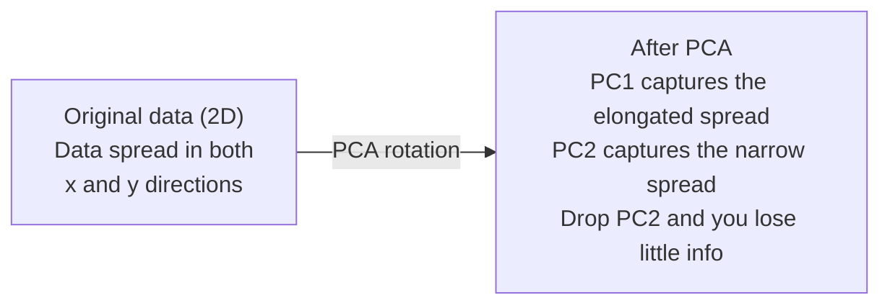

# 维度降低

> 高维数据具有结构。你需要从正确的角度来发现它。

**类型：**构建
**语言：**Python
**先决条件：**第一阶段，课程01（线性代数直觉），02（向量、矩阵与运算），03（特征值与特征向量），06（概率与分布）
**时间：**约90分钟

## 学习目标

- Implement Principal Component Analysis (PCA) from scratch: center the data, compute the covariance matrix, perform eigendecomposition, and perform projection.
- Use the explained variance ratio and the elbow method to determine the number of principal components.
- Compare PCA, t-SNE, and UMAP for visualizing MNIST digits in 2D and explain their trade-offs.
- Apply Kernel PCA with an RBF kernel to separate nonlinear data structures that standard PCA cannot handle.

## 问题

您有一个数据集，每个样本有784个特征。这可能是手写数字的像素值、基因表达水平或用户行为信号。您无法可视化这784个维度，也无法绘制它们，甚至无法思考它们。

但其中大多数784个特征是多余的。实际信息存在于更小的范围内。一个手写的“7”不需要784个独立数字来描述它，只需要几个：笔画的角度、横线的长度以及它的倾斜程度。其余的都是噪声。

降维技术找到了这个更小的范围。它将您的784维数据压缩到2、10或50个维度，同时保留重要的结构。

## 概念

### 维度的诅咒

高维空间并不直观。随着维度的增加，有三件事会发生变化。

**距离变得无意义。**在高维度中，任意两点之间的距离趋于相同的值。如果每个点与其他所有点的距离大致相同，则最近邻搜索就无法发挥作用。

```
Dimension    Avg distance ratio (max/min between random points)
2            ~5.0
10           ~1.8
100          ~1.2
1000         ~1.02
```

体积集中在角落。在d维的单位超立方体中，有2^d个角落。在100维的情况下，几乎所有的体积都位于角落，远离中心。数据点分散到边缘，你的模型在内部缺乏数据。

你需要指数级更多的数据。为了在空间中保持相同的样本密度，从2D变为20D意味着你需要10^18倍的数据。你永远都不够用。减少维度可以将数据密度恢复到可处理的范围。

### PCA：找出重要的方向

主成分分析（PCA）找出数据变化最显著的轴。它会旋转你的坐标系，使得第一个轴能够捕捉到最多的方差，第二个轴捕捉到次多的方差，依此类推。

算法：

```
1. Center the data        (subtract the mean from each feature)
2. Compute covariance     (how features move together)
3. Eigendecomposition     (find the principal directions)
4. Sort by eigenvalue     (biggest variance first)
5. Project               (keep top k eigenvectors, drop the rest)
```

为什么使用特征分解？协方差矩阵是对称且半正定的。其特征向量在特征空间中表示正交方向。特征值则表明每个方向捕获了多大的方差。具有最大特征值的特征向量指向最大方差方向的路径。



- **Before PCA:** Data is distributed diagonally across both x and y axes.
- **After PCA:** The coordinate system is rotated so that PC1 aligns with the direction of maximum variance (elongated spread) and PC2 aligns with the direction of minimum variance (narrow spread).
- **Dimensionality reduction:** Dropping PC2 reduces the data to PC1, losing very little information.

### 解释方差比率

每个主成分都捕捉了总方差的一部分。解释的方差比例告诉你其占比程度。

```
Component    Eigenvalue    Explained ratio    Cumulative
PC1          4.73          0.473              0.473
PC2          2.51          0.251              0.724
PC3          1.12          0.112              0.836
PC4          0.89          0.089              0.925
...
```

当累积解释方差达到0.95时，说明许多组件捕获了95%的信息。之后的内容大部分都是噪声。

### 选择组件数量

三种策略：

1. **阈值法。**保留足够的组件以解释90-95%的变异。
2. **肘部法则。**绘制每个组件的解释变异量。寻找明显的下降点。
3. **下游性能。**使用PCA作为预处理。调整k值并测量模型的准确性。最佳k值是准确性达到平稳值的那个值。

### t-SNE：保留邻域

t-SNE（t-Distributed Stochastic Neighbor Embedding）是一种用于可视化的技术。它将高维数据映射到二维或三维空间，同时保留点之间的邻近关系。

原理：在原始空间中，根据点之间的距离计算点对的概率分布。邻近的点具有较高概率，远离的点具有较低概率。然后找到一种二维布局，使得相同的概率分布仍然成立。在784个维度中为邻居的点在二维空间中仍保持为邻居。

t-SNE的关键特性：
- 非线性。它可以展开PCA无法处理的复杂流形。
- 随机性。不同的运行会产生不同的布局。
- 困惑度参数控制考虑多少邻居（典型范围：5-50）。
- 输出结果中簇之间的距离没有意义，只有簇本身有意义。
- 在大型数据集上速度较慢。默认情况下为O(n^2)。

### UMAP：更快，更好的全局结构

均匀流形近似与投影（UMAP）的工作原理与t-SNE类似，但具有两个优势：
- 速度更快。它使用近似的最近邻图而不是计算所有成对距离。
- 更好的全局结构。输出中簇的相对位置往往比t-SNE更有意义。

UMAP在高维空间中构建加权图（“模糊拓扑表示”），然后找到一种低维布局，尽可能保留该图的结构。

关键参数：
- `n_neighbors`：定义局部结构的邻居数量（类似于困惑度）。较高的值能更好地保留全局结构。
- `min_dist`：输出中点紧密聚集的程度。较低的值会创建更密集的簇。

### 何时使用哪种

| 方法 | 使用场景 | 保留内容 | 速度 |
|------|----------|-----------|-------|
| PCA | 训练前的预处理 | 全局方差 | 快速（精确），适用于数百万样本 |
| PCA | 快速探索性可视化 | 线性结构 | 快速 |
| t-SNE | 符合出版标准的2D图表 | 局部邻域 | 较慢（理想情况下样本数少于10k） |
| UMAP | 大规模2D可视化 | 局部结构及部分全局结构 | 中等（可处理数百万样本） |
| PCA | 模型特征降维 | 方差排名特征 | 快速 |
| t-SNE / UMAP | 理解簇结构 | 簇分离 | 中等到慢 |

经验法则：使用PCA进行预处理和数据压缩。当需要2D可视化结构时，使用t-SNE或UMAP。

### Kernel Principal Component Analysis

標準的PCA可以找到線性子空間。它會旋轉你的坐標系並移除軸線。但如果數據位於非線性流形上呢？在2D中，一個圓形無法被任何直線分離。標準的PCA將無法提供幫助。

核PCA是在由核函數導出的高維特徵空間中應用PCA，而不需要明確計算該空間中的坐標。這就是核技巧——與SVM背後的原理相同。

算法如下：
1. 計算核矩陣K，其中K_ij = k(x_i, x_j)
2. 在特徵空間中對核矩陣進行中心化
3. 對中心化的核矩陣進行特征值分解
4. 最頂端的特徵向量（按1/sqrt(特征值)比例缩放）就是投影

常用的核函數如下：

| 核函數 | 公式 | 適用範圍 |
|--------|---------|----------|
| RBF（高斯）| exp(-gamma * ||x - y|||^2) | 大多數非線性數據，平滑流形 |
| 多項式 | (x . y + c)^d | 多項式關係 |
| Sigmoid | tanh(alpha * x . y + c) | 類似於神經網絡的映射 |

何時使用核PCA而非標準PCA：

| 標準判斷標准 | 標準PCA | 核PCA |
|-------------|----------|------|
| 數據結構     | 線性子空間 | 非線性流形 |
| 速度        | O(min(n^2 d, d^2 n)) | O(n^2 d + n^3) |
| 可解釋性    | 分量為特徵的線性組合 | 分量無直接特徵解釋 |
| 可擴展性    | 適用於數百萬個樣本 | 核矩陣為n x n，受内存限制 |
| 重建能力    | 直接逆轉換 | 需要預處理原圖 |

典型的例子是2D中的同心圓。兩圈點，一圍在另一圍內。標準PCA將兩者投影到同一條直線上——這對分類無用。使用RBF核的核PCA將內圓和外圓映射到不同的區域，使其成為線性可分離的。

### 重建错误

您的降维效果如何？您将784个维度压缩到了50个。您失去了什么？

测量重建误差：
1. 将数据投影到k个维度：X_reduced = X @ W_k
2. 重建：X_hat = X_reduced @ W_k^T
3. 计算MSE：mean((X - X_hat)^2)

对于PCA，重建误差与解释的方差有清晰的关系：

```
Reconstruction error = sum of eigenvalues NOT included
Total variance = sum of ALL eigenvalues
Fraction lost = (sum of dropped eigenvalues) / (sum of all eigenvalues)
```

每个组件的解释方差比如下：

```
explained_ratio_k = eigenvalue_k / sum(all eigenvalues)
```

Plotting cumulative explained variance against the number of components reveals a “elbow” curve. The optimal number of components is where:
- The curve flattens out (diminishing returns)
- Cumulative variance exceeds your threshold (usually 0.90 or 0.95)
- Performance of downstream tasks reaches a plateau

Reconstruction error is useful beyond determining the appropriate number of components. It can be used for anomaly detection: samples with high reconstruction error are outliers that do not fit the learned subspace. This is the basis of PCA-based anomaly detection in production systems.

```figure
pca-axes
```

## 构建它

### 步骤1：从头开始进行PCA处理

```python
import numpy as np

class PCA:
    def __init__(self, n_components):
        self.n_components = n_components
        self.components = None
        self.mean = None
        self.eigenvalues = None
        self.explained_variance_ratio_ = None

    def fit(self, X):
        self.mean = np.mean(X, axis=0)
        X_centered = X - self.mean

        cov_matrix = np.cov(X_centered, rowvar=False)

        eigenvalues, eigenvectors = np.linalg.eigh(cov_matrix)

        sorted_idx = np.argsort(eigenvalues)[::-1]
        eigenvalues = eigenvalues[sorted_idx]
        eigenvectors = eigenvectors[:, sorted_idx]

        self.components = eigenvectors[:, :self.n_components].T
        self.eigenvalues = eigenvalues[:self.n_components]
        total_var = np.sum(eigenvalues)
        self.explained_variance_ratio_ = self.eigenvalues / total_var

        return self

    def transform(self, X):
        X_centered = X - self.mean
        return X_centered @ self.components.T

    def fit_transform(self, X):
        self.fit(X)
        return self.transform(X)
```

### 步骤2：在合成数据上进行测试

```python
np.random.seed(42)
n_samples = 500

t = np.random.uniform(0, 2 * np.pi, n_samples)
x1 = 3 * np.cos(t) + np.random.normal(0, 0.2, n_samples)
x2 = 3 * np.sin(t) + np.random.normal(0, 0.2, n_samples)
x3 = 0.5 * x1 + 0.3 * x2 + np.random.normal(0, 0.1, n_samples)

X_synthetic = np.column_stack([x1, x2, x3])

pca = PCA(n_components=2)
X_reduced = pca.fit_transform(X_synthetic)

print(f"Original shape: {X_synthetic.shape}")
print(f"Reduced shape:  {X_reduced.shape}")
print(f"Explained variance ratios: {pca.explained_variance_ratio_}")
print(f"Total variance captured: {sum(pca.explained_variance_ratio_):.4f}")
```

### 步骤3：二维的MNIST数字

```python
from sklearn.datasets import fetch_openml

mnist = fetch_openml("mnist_784", version=1, as_frame=False, parser="auto")
X_mnist = mnist.data[:5000].astype(float)
y_mnist = mnist.target[:5000].astype(int)

pca_mnist = PCA(n_components=50)
X_pca50 = pca_mnist.fit_transform(X_mnist)
print(f"50 components capture {sum(pca_mnist.explained_variance_ratio_):.2%} of variance")

pca_2d = PCA(n_components=2)
X_pca2d = pca_2d.fit_transform(X_mnist)
print(f"2 components capture {sum(pca_2d.explained_variance_ratio_):.2%} of variance")
```

### 步骤4：与sklearn进行比较

```python
from sklearn.decomposition import PCA as SklearnPCA
from sklearn.manifold import TSNE

sklearn_pca = SklearnPCA(n_components=2)
X_sklearn_pca = sklearn_pca.fit_transform(X_mnist)

print(f"\nOur PCA explained variance:     {pca_2d.explained_variance_ratio_}")
print(f"Sklearn PCA explained variance: {sklearn_pca.explained_variance_ratio_}")

diff = np.abs(np.abs(X_pca2d) - np.abs(X_sklearn_pca))
print(f"Max absolute difference: {diff.max():.10f}")

tsne = TSNE(n_components=2, perplexity=30, random_state=42)
X_tsne = tsne.fit_transform(X_mnist)
print(f"\nt-SNE output shape: {X_tsne.shape}")
```

### 步骤5：UMAP比较

```python
try:
    from umap import UMAP

    reducer = UMAP(n_components=2, n_neighbors=15, min_dist=0.1, random_state=42)
    X_umap = reducer.fit_transform(X_mnist)
    print(f"UMAP output shape: {X_umap.shape}")
except ImportError:
    print("Install umap-learn: pip install umap-learn")
```

## 使用它

在分类器之前进行PCA预处理：

```python
from sklearn.decomposition import PCA as SklearnPCA
from sklearn.linear_model import LogisticRegression
from sklearn.model_selection import train_test_split
from sklearn.metrics import accuracy_score

X_train, X_test, y_train, y_test = train_test_split(
    X_mnist, y_mnist, test_size=0.2, random_state=42
)

results = {}
for k in [10, 30, 50, 100, 200]:
    pca_k = SklearnPCA(n_components=k)
    X_tr = pca_k.fit_transform(X_train)
    X_te = pca_k.transform(X_test)

    clf = LogisticRegression(max_iter=1000, random_state=42)
    clf.fit(X_tr, y_train)
    acc = accuracy_score(y_test, clf.predict(X_te))
    var_captured = sum(pca_k.explained_variance_ratio_)
    results[k] = (acc, var_captured)
    print(f"k={k:>3d}  accuracy={acc:.4f}  variance={var_captured:.4f}")
```

性能在784维之前就已经达到平稳状态。那个平稳点就是你的工作点。

## 发货

本课程将生成以下文件：
- `outputs/skill-dimensionality-reduction.md` - 一份关于如何为特定任务选择合适降维技术的文档

## 练习

1. Modify the PCA class to support `inverse_transform`. Reconstruct MNIST digits from 10, 50, and 200 components. Print the reconstruction error (mean squared difference from the original) for each.

2. Run t-SNE on the same MNIST subset with perplexity values of 5, 30, and 100. Describe how the output changes. Why does perplexity affect cluster tightness?

3. Take a dataset with 50 features where only 5 are informative (generate one with `sklearn.datasets.make_classification`). Apply PCA and check whether the explained variance curve correctly identifies that the data is effectively 5-dimensional.

## | 关键词 | 翻译 |

| 术语 | 人们怎么说 | 实际含义 |
|------|----------------|----------------|
| 维数灾难 | “特征太多” | 当维度增加时，距离、体积和数据密度会表现出与直觉相反的行为。模型需要指数级更多的数据来补偿。 |
| PCA | “降低维度” | 旋转坐标系，使轴与最大方差方向对齐，然后丢弃低方差的轴。 |
| 主成分 | “重要方向” | 协方差矩阵的特征向量。特征空间中数据变化最显著的方向。 |
| 解释的方差比率 | “这个成分包含多少信息” | 一个主成分捕获的总方差的比例。将前k个比率相加，查看k个成分保留了多少信息。 |
| 协方差矩阵 | “特征如何相关” | 一个对称矩阵，其中条目(i,j)衡量特征i和特征j一起移动的情况。对角线条目是个体方差。 |
| t-SNE | “那个聚类图” | 一种非线性方法，通过保持成对邻域概率将高维数据映射到2D。适用于可视化，不适合预处理。 |
| UMAP | “更快的t-SNE” | 一种基于拓扑数据分析的非线性方法。既保留局部结构也保留一些全局结构。比t-SNE更易于缩放。 |
| 困惑度 | “t-SNE的调节器” | 控制每个点考虑的有效邻居数量。低困惑度关注非常局部的结构。高困惑度捕捉更广泛的模式。 |
| 流形 | “数据所在的表面” | 嵌入在更高维空间中的低维表面。3D中揉皱的纸张是2D流形。 |

## 更多阅读资料

- [主成分分析教程](https://arxiv.org/abs/1404.1100) (Shlens) - 从基础到高级的主成分分析推导过程
- [如何有效使用t-SNE](https://distill.pub/2016/misread-tsne/) (Wattenberg等) - t-SNE常见错误及参数选择的互动指南
- [UMAP文档](https://umap-learn.readthedocs.io/) - UMAP作者提供的理论与实用指导
