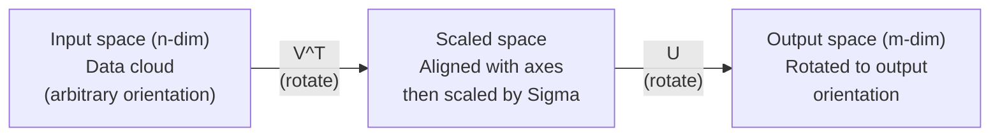
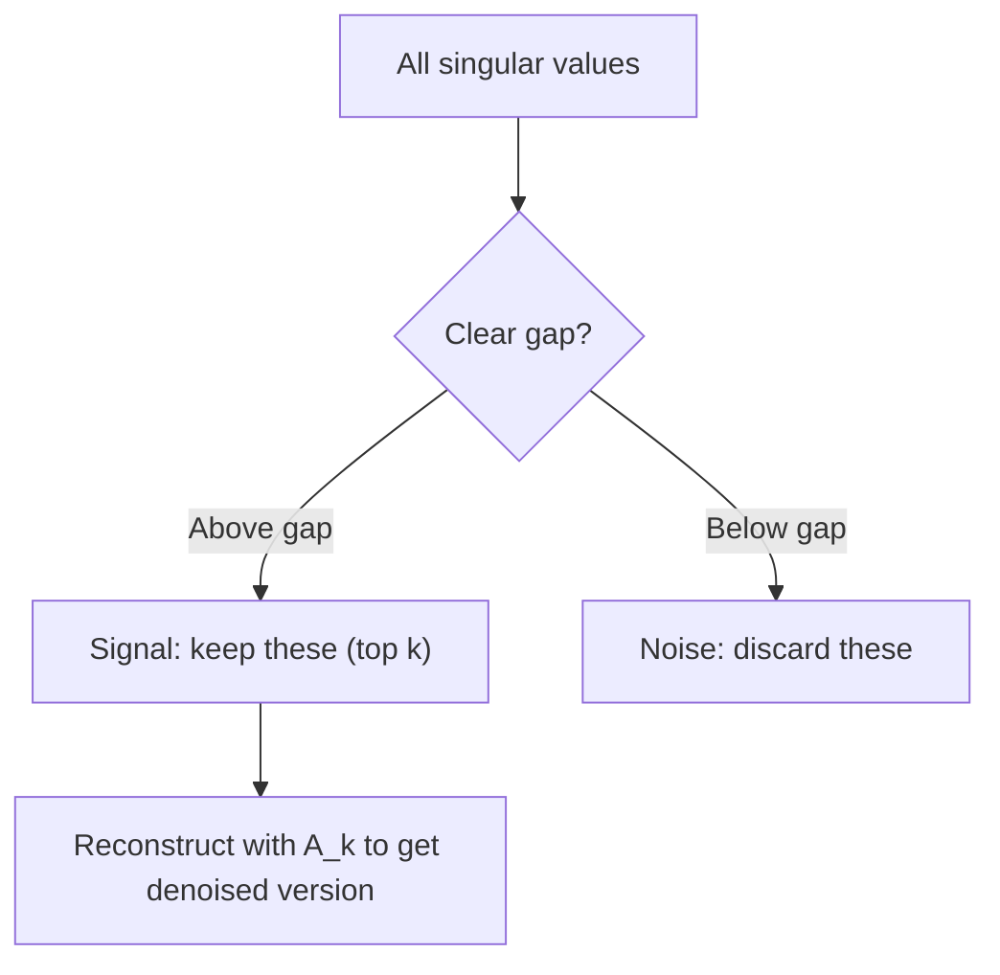

# 奇异值分解

> SVD是线性代数的瑞士军刀。每个矩阵都拥有一个SVD，每位数据科学家都需要一个。

**类型：**构建
**语言：**Python, Julia
**先决条件：**第一阶段，课程01（线性代数直觉），课程02（向量与矩阵操作），课程03（矩阵变换）
**时间：**约120分钟

## 学习目标

- Implement SVD through power iteration and explain the geometric meaning of U, Sigma, and V^T.
- Apply truncated SVD for image compression and assess the compression ratio against reconstruction error.
- Calculate the Moore-Penrose pseudoinverse using SVD to solve overdetermined least-squares systems.
- Link SVD with PCA, recommendation systems (latent factors), and Latent Semantic Analysis in NLP.

## 问题

You have a 1000x2000 matrix. It could be user-movie ratings, a document-term frequency table, or the pixel values of an image. You need to compress it, denoise it, find hidden structures within it, or solve a least-squares system using it. Eigen decomposition only works on square matrices. Even then, it requires the matrix to have a complete set of linearly independent eigenvectors.

SVD can be applied to any matrix, regardless of its shape or rank. There are no specific conditions. It breaks down the matrix into three components that reveal how the matrix affects space. SVD is the most general and useful factorization technique in linear algebra.

## 概念

### What does SVD do geometrically?

所有矩阵，无论其形状如何，都会依次执行三个操作：旋转、缩放、再旋转。SVD使得这种分解变得明确。

```
A = U * Sigma * V^T

      m x n     m x m    m x n    n x n
     (any)    (rotate)  (scale)  (rotate)
```

For any matrix A, the SVD decomposition breaks it down into the following components:
- V^T rotates the vectors in the input space (n-dimensional).
- The sigma matrices scale the vectors along each axis (expanding or compressing them).
- U rotates the result into the output space (m-dimensional).



可以这样理解：你将一个矩阵交给SVD。它告诉你：“这个矩阵接收一组输入值，首先通过V^T进行旋转，然后通过Sigma将其拉伸成椭球体，最后通过U再次旋转该椭球体。”这些奇异值就是椭球体各轴的长度。

### 完整分解

对于一个形状为 m x n 的矩阵 A：

```
A = U * Sigma * V^T

where:
  U     is m x m, orthogonal (U^T U = I)
  Sigma is m x n, diagonal (singular values on the diagonal)
  V     is n x n, orthogonal (V^T V = I)

The singular values sigma_1 >= sigma_2 >= ... >= sigma_r > 0
where r = rank(A)
```

U的列被称为左奇异向量。V的列被称为右奇异向量。Sigma的对角元素被称为奇异值。它们始终是非负的，并且通常按降序排列。

### Left singular vectors, singular values, right singular vectors

SVD的每个组成部分都有独特的几何含义。

**右奇异向量（V的列）：** 这些构成了输入空间(R^n)的正交归一基。它们是矩阵将输入空间的方向映射到输出空间正交方向的路径。可以将它们视为域的自然坐标系。

**奇异值（Sigma的对角线）：** 这些是缩放因子。第i个奇异值告诉你矩阵沿第i个右奇异向量拉伸向量的程度。零的奇异值意味着矩阵完全压缩了该方向。

**左奇异向量（U的列）：** 这些构成了输出空间(R^m)的正交归一基。第i个左奇异向量是输出空间中第i个右奇异向量所到达的方向（经过缩放后）。

它们之间的关系：

```
A * v_i = sigma_i * u_i

The matrix A takes the i-th right singular vector v_i,
scales it by sigma_i, and maps it to the i-th left singular vector u_i.
```

这让你能够逐坐标地了解任何矩阵的行为。

### 外积形式

SVD可以表示为秩为1的矩阵之和：

```
A = sigma_1 * u_1 * v_1^T + sigma_2 * u_2 * v_2^T + ... + sigma_r * u_r * v_r^T

Each term sigma_i * u_i * v_i^T is a rank-1 matrix (an outer product).
The full matrix is the sum of r such matrices, where r is the rank.
```

此形式是低秩近似的基础。每一项都增加一层结构。第一项捕捉了最重要的单一模式。第二项捕捉了次重要的模式。依此类推。截断这个总和可以得到在任何给定秩下的最佳近似。

```
Rank-1 approx:    A_1 = sigma_1 * u_1 * v_1^T
                  (captures the dominant pattern)

Rank-2 approx:    A_2 = sigma_1 * u_1 * v_1^T + sigma_2 * u_2 * v_2^T
                  (captures the two most important patterns)

Rank-k approx:    A_k = sum of top k terms
                  (optimal by the Eckart-Young theorem)
```

### Eigendecomposition is a mathematical technique used to decompose a complex number into its real and imaginary components. The relationship between eigendecomposition and this text can be understood as follows:

SVD和特征分解之间有着密切的联系。矩阵A的特征值和向量直接来源于A^T A和A A^T的特征值和特征向量。

```
A^T A = V * Sigma^T * U^T * U * Sigma * V^T
      = V * Sigma^T * Sigma * V^T
      = V * D * V^T

where D = Sigma^T * Sigma is a diagonal matrix with sigma_i^2 on the diagonal.

So:
- The right singular vectors (V) are eigenvectors of A^T A
- The singular values squared (sigma_i^2) are eigenvalues of A^T A

Similarly:
A A^T = U * Sigma * V^T * V * Sigma^T * U^T
      = U * Sigma * Sigma^T * U^T

So:
- The left singular vectors (U) are eigenvectors of A A^T
- The eigenvalues of A A^T are also sigma_i^2
```

这种关系告诉了你三个要点：
1. 奇异值总是实数且非负（它们是正半定矩阵的特征值的平方根）。
2. 你可以通过计算A^T A的特征分解来求得SVD，但这样做会使条件数变为平方，并降低数值精度。专门的SVD算法避免了这一问题。
3. 当矩阵A为方阵且为正半定对称矩阵时，SVD和特征分解是同一回事。

### 截断SVD：低秩近似

Eckart-Yang-Mirsky定理指出，对于A的rank-k最佳近似（在Frobenius范数和谱范数上），是通过仅保留前k个奇异值及其对应的向量来获得的：

```
A_k = U_k * Sigma_k * V_k^T

where:
  U_k     is m x k  (first k columns of U)
  Sigma_k is k x k  (top-left k x k block of Sigma)
  V_k     is n x k  (first k columns of V)

Approximation error = sigma_{k+1}  (in spectral norm)
                    = sqrt(sigma_{k+1}^2 + ... + sigma_r^2)  (in Frobenius norm)
```

这不仅仅是“一个好的”近似。它可以被证明是秩k的最佳可能近似。没有其他秩k矩阵更接近A。

| 组件 | 相对大小 | 是否保留在秩-3近似中？ |
|------|----------|------------------------|
| sigma_1 | 最大值 | 是 |
| sigma_2 | 较大值 | 是 |
| sigma_3 | 中等到较大值 | 是 |
| sigma_4 | 中等 | 否（误差） |
| sigma_5 | 中等到较小值 | 否（误差） |
| sigma_6 | 较小值 | 否（误差） |
| sigma_7 | 非常小值 | 否（误差） |
| sigma_8 | 极小的数值 | 否（误差） |

保留前3个：A_3包含了三个最大的奇异值。误差=其余数值（从sigma_4到sigma_8）。

如果奇异值衰减得快，较小的k可以捕捉到矩阵的大部分内容。如果它们衰减得慢，则矩阵没有低秩结构。

### Using SVD for image compression

灰度图像是一个像素强度矩阵。一个800x600的图像有480,000个值。SVD技术可以让你用更少的参数来近似表示它。

```
Original image: 800 x 600 = 480,000 values

SVD with rank k:
  U_k:      800 x k values
  Sigma_k:  k values
  V_k:      600 x k values
  Total:    k * (800 + 600 + 1) = k * 1401 values

  k=10:   14,010 values   (2.9% of original)
  k=50:   70,050 values  (14.6% of original)
  k=100: 140,100 values  (29.2% of original)

  The compression ratio improves as k gets smaller,
  but visual quality degrades.
```

关键见解：自然图像具有快速衰减的奇异值。前几个奇异值捕捉了整体结构（形状、梯度）。后面的奇异值则捕捉了细节和噪声。在秩为50时截断通常可以得到与原始图像几乎相同的图像，同时使用的存储空间减少了85%。

### SVD for recommendation systems

Netflix Prize has made this famous. You have a user-movie ratings matrix where most entries are missing.

```
             Movie1  Movie2  Movie3  Movie4  Movie5
  User1      [  5      ?       3       ?       1  ]
  User2      [  ?      4       ?       2       ?  ]
  User3      [  3      ?       5       ?       ?  ]
  User4      [  ?      ?       ?       4       3  ]

  ? = unknown rating
```

The idea is as follows: This ratings matrix has a low rank. Users do not have completely independent tastes. There are several latent factors (action vs. drama, old vs. new, cerebral vs. visceral) that explain most preferences.

SVD on the filled-in ratings matrix decomposes it into:
- U: user profiles in the latent factor space
- Sigma: the importance of each latent factor
- V^T: movie profiles in the latent factor space

A user's predicted rating for a movie is the dot product of their user profile with the movie's profile, weighted by singular values. The low-rank approximation fills in the missing entries.

In practice, you use variants like Simon Funk's incremental SVD or ALS (alternating least squares) that handle missing data directly. But the core idea remains the same: latent factor decomposition using SVD.

### SVD in NLP: 潜在语义分析

潜在语义分析（LSA），也称为潜在语义索引（LSI），将SVD应用于术语-文档矩阵。

```
             Doc1   Doc2   Doc3   Doc4
  "cat"      [  3      0      1      0  ]
  "dog"      [  2      0      0      1  ]
  "fish"     [  0      4      1      0  ]
  "pet"      [  1      1      1      1  ]
  "ocean"    [  0      3      0      0  ]

After SVD with rank k=2:

  Each document becomes a point in 2D "concept space."
  Each term becomes a point in the same 2D space.
  Documents about similar topics cluster together.
  Terms with similar meanings cluster together.

  "cat" and "dog" end up near each other (land pets).
  "fish" and "ocean" end up near each other (water concepts).
  Doc1 and Doc3 cluster if they share similar topics.
```

LSA was one of the first successful methods for capturing semantic similarity from raw text. It works because synonymous terms tend to appear in similar documents, so SVD groups them into the same latent dimensions. Modern word embeddings (Word2Vec, GloVe) can be seen as descendants of this idea.

### SVD for noise reduction

噪声数据中的信号集中在最显著的几个值上，而噪声则分布在所有奇异值中。截断可以去除噪声干扰。

**干净的信号奇异值：**

| 组件 | 大小 | 类型 |
|------|-----|------|
| sigma_1 | 非常大 | 信号 |
| sigma_2 | 大 | 信号 |
| sigma_3 | 中等 | 信号 |
| sigma_4 | 接近零 | 可忽略 |
| sigma_5 | 接近零 | 可忽略 |

**有噪声的信号奇异值（噪声影响所有值）：**

| 组件 | 大小 | 类型 |
|------|-----|------|
| sigma_1 | 非常大 | 信号 |
| sigma_2 | 大 | 信号 |
| sigma_3 | 中等 | 信号 |
| sigma_4 | 小 | 噪声 |
| sigma_5 | 小 | 噪声 |
| sigma_6 | 小 | 噪声 |
| sigma_7 | 小 | 噪声 |



这用于信号处理、科学测量和数据清洗。每当矩阵受到加性噪声的污染时，截断SVD是一种分离信号与噪声的有效方法。

### 通过SVD求伪逆

Moore-Penrose伪逆A+将矩阵求逆推广到非方阵和奇异矩阵。SVD使得其计算变得简单。

```
If A = U * Sigma * V^T, then:

A+ = V * Sigma+ * U^T

where Sigma+ is formed by:
  1. Transpose Sigma (swap rows and columns)
  2. Replace each non-zero diagonal entry sigma_i with 1/sigma_i
  3. Leave zeros as zeros

For A (m x n):      A+ is (n x m)
For Sigma (m x n):  Sigma+ is (n x m)
```

伪逆解决了最小二乘问题。如果Ax = b没有精确解（过定系统），那么x = A+ b就是最小二乘解（最小化||Ax - b||）。

```
Overdetermined system (more equations than unknowns):

  [1  1]         [3]
  [2  1] x   =   [5]       No exact solution exists.
  [3  1]         [6]

  x_ls = A+ b = V * Sigma+ * U^T * b

  This gives the x that minimizes the sum of squared residuals.
  Same result as the normal equations (A^T A)^(-1) A^T b,
  but numerically more stable.
```

### 数值稳定性优势

计算A^T的特征分解时，奇异值会被平方（A^T A的特征值是sigma_i^2）。这会使条件数加倍，从而放大数值误差。

```
Example:
  A has singular values [1000, 1, 0.001]
  Condition number of A: 1000 / 0.001 = 10^6

  A^T A has eigenvalues [10^6, 1, 10^{-6}]
  Condition number of A^T A: 10^6 / 10^{-6} = 10^{12}

  Computing SVD directly: works with condition number 10^6
  Computing via A^T A:     works with condition number 10^{12}
                           (6 extra digits of precision lost)
```

现代SVD算法（Golub-Kahan对角化）直接对矩阵A进行操作，从不计算A^T A。这就是为什么你应该始终优先使用`np.linalg.svd(A)`而不是`np.linalg.eig(A.T @ A)`。

### 连接到PCA

PCA is equivalent to SVD on centered data. This is not an analogy; it is indeed the same computational process.

```
Given data matrix X (n_samples x n_features), centered (mean subtracted):

Covariance matrix: C = (1/(n-1)) * X^T X

PCA finds eigenvectors of C. But:

  X = U * Sigma * V^T    (SVD of X)

  X^T X = V * Sigma^2 * V^T

  C = (1/(n-1)) * V * Sigma^2 * V^T

So the principal components are exactly the right singular vectors V.
The explained variance for each component is sigma_i^2 / (n-1).

In sklearn, PCA is implemented using SVD, not eigendecomposition.
It is faster and more numerically stable.
```

这意味着你在第10课中学到的关于降维的所有知识，实际上都是SVD的底层原理。在机器学习中，PCA是SVD最常见的应用。

```figure
svd-rank-reconstruction
```

## 构建它

### 步骤1：使用幂迭代法从头开始进行SVD计算

思路：找到最大的奇异值及其向量，对 A^T A（或 A A^T）进行幂迭代。然后压缩矩阵，并对下一个奇异值重复此过程。

```python
import numpy as np

def power_iteration(M, num_iters=100):
    n = M.shape[1]
    v = np.random.randn(n)
    v = v / np.linalg.norm(v)

    for _ in range(num_iters):
        Mv = M @ v
        v = Mv / np.linalg.norm(Mv)

    eigenvalue = v @ M @ v
    return eigenvalue, v

def svd_from_scratch(A, k=None):
    m, n = A.shape
    if k is None:
        k = min(m, n)

    sigmas = []
    us = []
    vs = []

    A_residual = A.copy().astype(float)

    for _ in range(k):
        AtA = A_residual.T @ A_residual
        eigenvalue, v = power_iteration(AtA, num_iters=200)

        if eigenvalue < 1e-10:
            break

        sigma = np.sqrt(eigenvalue)
        u = A_residual @ v / sigma

        sigmas.append(sigma)
        us.append(u)
        vs.append(v)

        A_residual = A_residual - sigma * np.outer(u, v)

    U = np.column_stack(us) if us else np.empty((m, 0))
    S = np.array(sigmas)
    V = np.column_stack(vs) if vs else np.empty((n, 0))

    return U, S, V
```

### 步骤2：使用NumPy进行测试和比较

```python
np.random.seed(42)
A = np.random.randn(5, 4)

U_ours, S_ours, V_ours = svd_from_scratch(A)
U_np, S_np, Vt_np = np.linalg.svd(A, full_matrices=False)

print("Our singular values:", np.round(S_ours, 4))
print("NumPy singular values:", np.round(S_np, 4))

A_reconstructed = U_ours @ np.diag(S_ours) @ V_ours.T
print(f"Reconstruction error: {np.linalg.norm(A - A_reconstructed):.8f}")
```

### 步骤3：图像压缩演示

```python
def compress_image_svd(image_matrix, k):
    U, S, Vt = np.linalg.svd(image_matrix, full_matrices=False)
    compressed = U[:, :k] @ np.diag(S[:k]) @ Vt[:k, :]
    return compressed

image = np.random.seed(42)
rows, cols = 200, 300
image = np.random.randn(rows, cols)

for k in [1, 5, 10, 20, 50]:
    compressed = compress_image_svd(image, k)
    error = np.linalg.norm(image - compressed) / np.linalg.norm(image)
    original_size = rows * cols
    compressed_size = k * (rows + cols + 1)
    ratio = compressed_size / original_size
    print(f"k={k:>3d}  error={error:.4f}  storage={ratio:.1%}")
```

### 步骤4：降噪

```python
np.random.seed(42)
clean = np.outer(np.sin(np.linspace(0, 4*np.pi, 100)),
                 np.cos(np.linspace(0, 2*np.pi, 80)))
noise = 0.3 * np.random.randn(100, 80)
noisy = clean + noise

U, S, Vt = np.linalg.svd(noisy, full_matrices=False)
denoised = U[:, :5] @ np.diag(S[:5]) @ Vt[:5, :]

print(f"Noisy error:    {np.linalg.norm(noisy - clean):.4f}")
print(f"Denoised error: {np.linalg.norm(denoised - clean):.4f}")
print(f"Improvement:    {(1 - np.linalg.norm(denoised - clean) / np.linalg.norm(noisy - clean)):.1%}")
```

### 步骤5：伪逆矩阵

```python
A = np.array([[1, 1], [2, 1], [3, 1]], dtype=float)
b = np.array([3, 5, 6], dtype=float)

U, S, Vt = np.linalg.svd(A, full_matrices=False)
S_inv = np.diag(1.0 / S)
A_pinv = Vt.T @ S_inv @ U.T

x_svd = A_pinv @ b
x_lstsq = np.linalg.lstsq(A, b, rcond=None)[0]
x_pinv = np.linalg.pinv(A) @ b

print(f"SVD pseudoinverse solution:  {x_svd}")
print(f"np.linalg.lstsq solution:   {x_lstsq}")
print(f"np.linalg.pinv solution:    {x_pinv}")
```

## 使用它

完整的运行演示文件位于`code/svd.py`中。运行该文件可以查看SVD在图像压缩、推荐系统、潜在语义分析以及噪声减少中的应用。

```bash
python svd.py
```

`code/svd.jl`中的Julia版本使用Julia的原生`svd()`函数和`LinearAlgebra`包展示了相同的概念。

```bash
julia svd.jl
```

## 发货

本课程将生成以下文件：
- `outputs/skill-svd.md` - 一项技能，用于了解在实际项目中何时以及如何应用SVD。

## 练习

1. Implement the full SVD algorithm from scratch without using power iteration. Instead, compute the eigendecomposition of A^T A to obtain V and the singular values. Then calculate U = A V Sigma^{-1}. Compare the numerical accuracy of your implementation with that of the power iteration method and with NumPy.

2. Load a real grayscale image (or convert one to grayscale). Compress it at ranks 1, 5, 10, 25, 50, 100. For each rank, calculate the compression ratio and the relative error. Determine the rank at which the image becomes visually acceptable.

3. Build a simple recommendation system. Create a 10x8 user-movie ratings matrix with some known entries. Fill missing entries with row averages. Perform SVD to reconstruct a 3-rank approximation of the matrix. Use this reconstructed matrix to predict the missing ratings. Verify that the predictions are reasonable.

4. Create a 100x50 document-term matrix with 3 synthetic topics. Each topic has 5 associated terms. Add noise to the data. Apply SVD and verify that the top 3 singular values are significantly larger than the others. Project the documents into the 3D latent space and observe that documents from the same topic cluster tend to be grouped together.

5. Generate a low-rank matrix with rank 3 and size 50x40. Add Gaussian noise at different levels (sigma = 0.1, 0.5, 1.0, 2.0). For each noise level, find the optimal truncation rank by varying the number of rows k from 1 to 40 and measuring the reconstruction error compared to the clean matrix. Plot how the optimal k changes with the noise level.

## | 关键词 | 翻译 |

| 术语 | 人们怎么说 | 实际含义 |
|------|----------------|----------------|
| SVD | “分解任何矩阵” | 将A分解为U Sigma V^T，其中U和V是正交矩阵，Sigma是对角线带有非负数值的矩阵。适用于任意形状的矩阵。 |
| 奇异值 | “这一组成部分的重要性” | Sigma的第i个对角线元素。衡量矩阵沿第i个主方向拉伸的程度。始终为非负数，按降序排列。 |
| 左奇异向量 | “输出方向” | U的一列。在输出空间中，第i个右奇异向量映射到的方向（经过sigma_i缩放后）。 |
| 右奇异向量 | “输入方向” | V的一列。在输入空间中，矩阵映射到第i个左奇异向量的方向（经过sigma_i缩放后）。 |
| 截断SVD | “低秩近似” | 仅保留前k个奇异值及其向量。产生原始矩阵的最佳k阶近似（Eckart-Young定理）。 |
| 秩 | “真实维度” | 非零奇异值的数量。告诉你矩阵实际使用了多少个独立方向。 |
| 伪逆 | “广义逆” | V Sigma+ U^T。反转非零奇异值，保留零值不变。解决非方阵或奇异矩阵的最小二乘问题。 |
| 条件数 | “对误差的敏感程度” | sigma_max / sigma_min。较大的条件数意味着小的输入变化会导致大的输出变化。SVD可以直接揭示这一点。 |
| 潜在因子 | “隐藏变量” | SVD发现的低秩空间中的一个维度。在推荐系统中，潜在因子可能对应 genre偏好。在自然语言处理中，它可能对应一个主题。 |
| 弗罗贝尼乌斯范数 | “矩阵总大小” | 对角线元素平方和的平方根。等于奇异值平方和的平方根。用于衡量近似误差。 |
| Eckart-Young定理 | “SVD提供最佳压缩” | 对于任何目标秩k，截断SVD在所有可能的k阶矩阵中最小化近似误差。 |
| 幂迭代 | “找到最大的特征向量” | 重复将随机向量乘以矩阵并归一化。收敛到具有最大特征值的特征向量。许多SVD算法的基础组成部分。 |

## 更多阅读资料

- [Gilbert Strang: 线性代数及其应用，第7章](https://math.mit.edu/~gs/linearalgebra/) - 对SVD的详细讲解及其应用
- [3Blue1Brown: 那么SVD是什么？](https://www.youtube.com/watch?v=vSczTbgc8Rc) - SVD的几何直觉
- [我们推荐奇异值分解](https://www.ams.org/publicoutreach/feature-column/fcarc-svd) - 美国数学学会提供的易于理解的概述
- [Netflix Prize和矩阵分解](https://sifter.org/~simon/journal/20061211.html) - Simon Funk关于SVD用于推荐的原创博客文章
- [潜在语义分析](https://en.wikipedia.org/wiki/Latent_semantic_analysis) - SVD在自然语言处理中的原始应用
- [Trefethen和Bau的数值线性代数](https://people.maths.ox.ac.uk/trefethen/text.html) - 理解SVD算法及其数值特性的黄金标准
