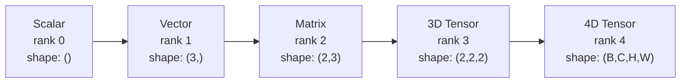
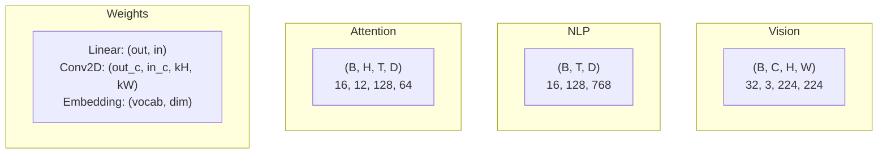
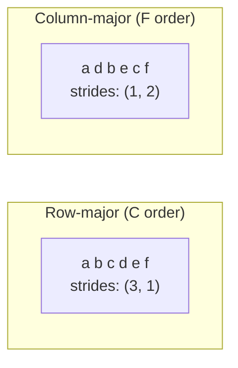
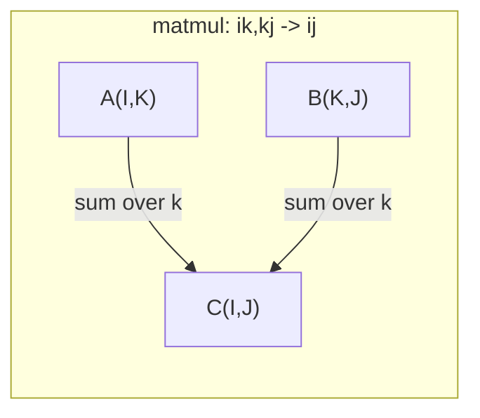

# Tensor Operations

> 张量是数据与深度学习之间的通用语言。每一张图片、每一个句子、每一个梯度流经它们。

**类型：** 构建
**语言：** Python
**先决条件：** 第一阶段，课程01（线性代数直觉），课程02（向量、矩阵与运算）
**时间：** 约90分钟

## 学习目标

- Implement a tensor class with shape, strides, reshape, transpose, and element-wise operations from scratch
- Apply broadcasting rules to operate on tensors of different shapes without copying data
- Write einsum expressions for dot products, matrix multiplications, outer products, and batched operations
- Trace the exact tensor shapes through every step of multi-head attention

## 问题

You are building a transformer. The forward pass seems to be correct. However, when you run it, you encounter this error: `RuntimeError: mat1 and mat2 shapes cannot be multiplied (32x768 and 512x768)`. You examine the shapes of the matrices and try using a transpose, which results in an error stating `Expected 4D input (got 3D input)`. You then add an unsqueeze operation, but another issue arises.

Shape errors are the most common bugs in deep learning code. Conceptually, they aren’t difficult to understand—each operation involves shape constraints—but their impact can be significant. A transformer involves dozens of transformations, transposes, and broadcasts that are chained together. A single incorrect axis can lead to widespread errors. Moreover, some shape mistakes don’t cause any error at all; they silently result in incorrect results due to improper dimension allocation or wrong axis summation.

Matrices operate on pairwise relationships between two sets of elements. Real-world data doesn’t fit into two dimensions. A batch of 32 RGB images with a size of 224x224 is a 4D tensor: `(32, 3, 224, 224)`. Self-attention with 12 heads is also 4D: `(batch, heads, seq_len, head_dim)`. We need a data structure that can handle any number of dimensions and whose operations can be combined seamlessly across all dimensions. That structure is the tensor. By mastering its operations, shape errors become easy to debug.

## 概念

### 什么是张量

张量是一种具有统一数据类型的多维数字数组。维度的数量称为**秩**（或**阶数**）。每个维度都是一个**轴**。**形状**是一个元组，列出了每个轴的大小。



总元素数 = 所有大小的乘积。形状 `(2, 3, 4)` 包含 `2 * 3 * 4 = 24` 个元素。

### 在深度学习中，张量形状是非常重要的概念。张量是一种数据结构，它可以表示各种类型的数据，如标量、向量、矩阵等。在深度学习模型中，张量的形状和结构对于模型的性能和效率有着重要影响。

不同的数据类型按照惯例映射到特定的张量形状。



PyTorch采用NCHW（通道优先）布局。TensorFlow默认使用NHWC（通道后序）布局。不匹配的布局会导致无声的减速或错误。

### 内存布局的工作原理

在内存中，二维数组是一个一维的字节序列。**步长**决定了在每个轴上移动一步时需要跳过多少个元素。



转置操作不会移动数据。它交换数据的步长，使得张量变得**非连续**——行中的元素在内存中不再相邻。

### 广播规则

广播功能允许你操作不同形状的张量，而无需复制数据。确保形状一致。当两个维度相等或其中一个为1时，它们才是兼容的。较少的维度会在左侧用1填充。

```
Tensor A:     (8, 1, 6, 1)
Tensor B:        (7, 1, 5)
Padded B:     (1, 7, 1, 5)
Result:       (8, 7, 6, 5)
```

### Einsum: The Universal Tensor Operation

爱因斯坦求和用字母标记每个轴。输入中但输出中没有的轴会被求和。同时存在于输入和输出中的轴则被保留。



Key patterns: `i,i->` (dot product), `i,j->ij` (outer product), `ii->` (trace), `ij->ji` (transpose), `bij,bjk->bik` (batch matmul), `bhtd,bhsd->bhts` (attention scores).

```figure
tensor-broadcast
```

## 构建它

代码位于`code/tensors.py`中。每个步骤都引用了那里的实现。

### 步骤1：张量存储和步长

张量存储了一个数字的扁平列表以及形状元数据。步长告诉索引逻辑如何将多维索引映射到扁平位置。

```python
class Tensor:
    def __init__(self, data, shape=None):
        if isinstance(data, (list, tuple)):
            self._data, self._shape = self._flatten_nested(data)
        elif isinstance(data, np.ndarray):
            self._data = data.flatten().tolist()
            self._shape = tuple(data.shape)
        else:
            self._data = [data]
            self._shape = ()

        if shape is not None:
            total = reduce(lambda a, b: a * b, shape, 1)
            if total != len(self._data):
                raise ValueError(
                    f"Cannot reshape {len(self._data)} elements into shape {shape}"
                )
            self._shape = tuple(shape)

        self._strides = self._compute_strides(self._shape)

    @staticmethod
    def _compute_strides(shape):
        if len(shape) == 0:
            return ()
        strides = [1] * len(shape)
        for i in range(len(shape) - 2, -1, -1):
            strides[i] = strides[i + 1] * shape[i + 1]
        return tuple(strides)
```

对于形状`(3, 4)`，步长是`(4, 1)`——跳过4个元素以前进一行，跳过1个元素以前进一列。

### 步骤2：重塑、压缩、解压

重塑操作会改变形状，但不改变元素的顺序。元素的总数必须保持不变。使用`-1`表示某一维度以推断其大小。

```python
t = Tensor(list(range(12)), shape=(2, 6))
r = t.reshape((3, 4))
r = t.reshape((-1, 3))
```

Squeeze移除大小为1的轴。Unsqueeze插入一个轴。对于广播来说，unsqueeze至关重要——一个偏置向量`(D,)`添加到批次`(B, T, D)`需要被unsqueeze成`(1, 1, D)`。

```python
t = Tensor(list(range(6)), shape=(1, 3, 1, 2))
s = t.squeeze()
v = Tensor([1, 2, 3])
u = v.unsqueeze(0)
```

### 步骤3：转置和排列

转置操作交换了两个轴。排列操作则重新排序所有轴。这就是如何在NCHW和NHWC之间转换的方法。

```python
mat = Tensor(list(range(6)), shape=(2, 3))
tr = mat.transpose(0, 1)

t4d = Tensor(list(range(24)), shape=(1, 2, 3, 4))
perm = t4d.permute((0, 2, 3, 1))
```

在进行转置或排列后，张量在内存中不再是连续的。在PyTorch中，`view`方法无法处理非连续张量——请先使用`reshape`方法或调用`.contiguous()`。

### 步骤4：元素级操作与合并

逐元素操作（加法、乘法、减法）独立应用于每个元素，并保持形状。聚合运算（求和、平均值、最大值）会合并一个或多个轴。

```python
a = Tensor([[1, 2], [3, 4]])
b = Tensor([[10, 20], [30, 40]])
c = a + b
d = a * 2
s = a.sum(axis=0)
```

在卷积神经网络中，全局平均池化：`(B, C, H, W).mean(axis=[2, 3])`产生 `(B, C)`。在自然语言处理中，序列平均池化：`(B, T, D).mean(axis=1)`产生 `(B, D)`。

### 步骤5：使用NumPy进行广播

`tensors.py`中的`demo_broadcasting_numpy()`函数展示了核心模式。

```python
activations = np.random.randn(4, 3)
bias = np.array([0.1, 0.2, 0.3])
result = activations + bias

images = np.random.randn(2, 3, 4, 4)
scale = np.array([0.5, 1.0, 1.5]).reshape(1, 3, 1, 1)
result = images * scale

a = np.array([1, 2, 3]).reshape(-1, 1)
b = np.array([10, 20, 30, 40]).reshape(1, -1)
outer = a * b
```

通过广播计算成对距离：将 `(M, 2)` 重塑为 `(M, 1, 2)`，将 `(N, 2)` 重塑为 `(1, N, 2)`，相减，平方，沿最后一个轴求和，取平方根。结果：`(M, N)`。

### 步骤6：自算操作

`demo_einsum()`和`demo_einsum_gallery()`函数介绍了所有常见的模式。

```python
a = np.array([1.0, 2.0, 3.0])
b = np.array([4.0, 5.0, 6.0])
dot = np.einsum("i,i->", a, b)

A = np.array([[1, 2], [3, 4], [5, 6]], dtype=float)
B = np.array([[7, 8, 9], [10, 11, 12]], dtype=float)
matmul = np.einsum("ik,kj->ij", A, B)

batch_A = np.random.randn(4, 3, 5)
batch_B = np.random.randn(4, 5, 2)
batch_mm = np.einsum("bij,bjk->bik", batch_A, batch_B)
```

收缩的计算成本是所有索引大小的乘积（保留并求和）。对于 `bij,bjk->bik`，其中B=32，I=128，J=64，K=128：`32 * 128 * 64 * 128 = 33,554,432`，采用乘法加法算法。

### 步骤7：通过einsum实现注意力机制

`demo_attention_einsum()`函数实现了多头注意力端到端模型。

```python
B, H, T, D = 2, 4, 8, 16
E = H * D

X = np.random.randn(B, T, E)
W_q = np.random.randn(E, E) * 0.02

Q = np.einsum("bte,ek->btk", X, W_q)
Q = Q.reshape(B, T, H, D).transpose(0, 2, 1, 3)

scores = np.einsum("bhtd,bhsd->bhts", Q, K) / np.sqrt(D)
weights = softmax(scores, axis=-1)
attn_output = np.einsum("bhts,bhsd->bhtd", weights, V)

concat = attn_output.transpose(0, 2, 1, 3).reshape(B, T, E)
output = np.einsum("bte,ek->btk", concat, W_o)
```

Each step involves a tensor operation: projection (using matmul with einsum), head splitting (reshaping and transposing), attention scores calculation (batch matmul with einsum), weighted sum (batch matmul with einsum), head merging (transposing and reshaping again), and output projection (matmul with einsum).

## 使用它

### Scratch vs NumPy

| 操作 | Scratch (Tensor class) | NumPy |
|---|---|---|
| 创建 | `Tensor([[1,2],[3,4]])` | `np.array([[1,2],[3,4]])` |
| 重塑 | `t.reshape((3,4))` | `a.reshape(3,4)` |
| 转置 | `t.transpose(0,1)` | `a.T` 或 `a.transpose(0,1)` |
| 压缩 | `t.squeeze(0)` | `np.squeeze(a, 0)` |
| 求和 | `t.sum(axis=0)` | `a.sum(axis=0)` |
| Einsum | 不适用 | `np.einsum("ij,jk->ik", a, b)` |

### Scratch vs PyTorch

```python
import torch

t = torch.tensor([[1, 2, 3], [4, 5, 6]], dtype=torch.float32)
t.shape
t.stride()
t.is_contiguous()

t.reshape(3, 2)
t.unsqueeze(0)
t.transpose(0, 1)
t.transpose(0, 1).contiguous()

torch.einsum("ik,kj->ij", A, B)
```

PyTorch增加了自动梯度计算、GPU支持以及优化的BLAS内核。形状语义相同。如果你理解了原始版本，那么PyTorch中的形状错误就会变得清晰可辨。

### Each neural network layer serves as a tensor operation.

| 操作 | 张量形式 | Einsum |
|---|---|---|
| 线性层 | `Y = X @ W.T + b` | `"bd,od->bo"` + 偏置 |
| 注意力QKV | `Q = X @ W_q` | `"btd,dh->bth"` |
| 注意力分数 | `Q @ K.T / sqrt(d)` | `"bhtd,bhsd->bhts"` |
| 注意力输出 | `softmax(scores) @ V` | `"bhts,bhsd->bhtd"` |
| 批量归一化 | `(X - mu) / sigma * gamma` | 逐元素 + 广播 |
| Softmax | `exp(x) / sum(exp(x))` | 逐元素 + 减少 |

## 发货

本课程生成了两个可复用的提示词：

1. **`outputs/prompt-tensor-shapes.md`** —— 用于调试张量形状不匹配的系统提示词。包含每种常见操作（matmul、broadcast、cat、Linear、Conv2d、BatchNorm、softmax）的决策表以及修复查找表。

2. **`outputs/prompt-tensor-debugger.md`** —— 当形状错误阻碍你时，你可以将其粘贴到任何AI助手中的逐步调试提示词。输入错误信息和张量形状，获得精确的解决方案。

## 练习

1. **Easy -- Reshape in both directions.** Take a tensor with shape `(2, 3, 4)`. Reshape it to `(6, 4)`, then to `(24,)`, and finally back to `(2, 3, 4)`. Verify that the order of elements is preserved at each step by printing the flat data.

2. **Medium -- Implement broadcasting.** Extend the `Tensor` class with a `broadcast_to(shape)` method that expands the dimensions of a tensor with size 1 to match a target shape. Then modify `_elementwise_op` to automatically broadcast before performing operations. Test this with shapes `(3, 1)` and `(1, 4)` to produce the result `(3, 4)`.

3. **Hard -- Build einsum from scratch.** Implement a basic `einsum(subscripts, *tensors)` function that handles at least the following operations: dot product (`i,i->`), matrix multiply (`ij,jk->ik`), outer product (`i,j->ij`), and transpose (`ij->ji`). Parse the subscript string, identify contracted indices, and iterate through all possible index combinations. Compare your results with `np.einsum`.

4. **Hard -- Attention shape tracker.** Write a function that takes `batch_size`, `seq_len`, `embed_dim`, and `num_heads` as inputs and prints the exact shape at every step of the multi-head attention process: input, Q/K/V projection, head split, attention scores, softmax weights, weighted sum, head merge, output projection. Verify your results against the output of `demo_attention_einsum()`.

## | 关键词 | 翻译 |

| 术语 | 人们怎么说 | 实际含义 |
|---|---|---|
| 张量 | “一个矩阵，但维度更多” | 具有统一类型和定义形状、步长及运算的多维数组 |
| 秩 | “维度的数量” | 轴的数量。矩阵的秩为2，不等于其矩阵秩 |
| 形状 | “张量的大小” | 列出每个轴上大小的元组。`(2, 3)`表示2行，3列 |
| 步长 | “内存的布局方式” | 每向前移动一个位置在每轴上需要跳过多少个元素 |
| 广播 | “当形状不同时即可使用” | 一组严格规则：从右侧开始对齐，维度必须相等或其中一个为1 |
| 连续 | “张量处于正常状态” | 元素按逻辑布局顺序连续存储，无间隙或重排 |
| Einsum | “编写matmul的花式方式” | 一种通用符号，用一行表达任何张量收缩、外积、迹或转置操作 |
| 视图 | “与reshape相同” | 共享同一内存缓冲区但具有不同形状/步长元数据张量。不适用于非连续数据 |
| 收缩 | “对索引进行求和” | 通用操作，其中张量之间的共享索引被相乘并求和，产生低秩结果 |
| NCHW / NHWC | “PyTorch与TensorFlow格式” | 图像张量的内存布局约定。NCHW将通道放在空间维度之前，NHWC将它们放在之后 |

## 更多阅读资料

- [NumPy广播机制](https://numpy.org/doc/stable/user/basics.broadcasting.html) -- 包含可视化示例的规范规则
- [PyTorch张量视图](https://pytorch.org/docs/stable/tensor_view.html) -- 说明视图何时起作用以及何时会复制数据
- [einops库](https://github.com/arogozhnikov/einops) -- 一个使张量重塑变得可读且安全的库
- [图解Transformer模型](https://jalammar.github.io/illustrated-transformer/) -- 可视化注意力机制中张量的流动形态
- [NumPy中的Einstein求和函数](https://numpy.org/doc/stable/reference/generated/numpy.einsum.html) -- 包含示例的完整Einstein求和函数文档
