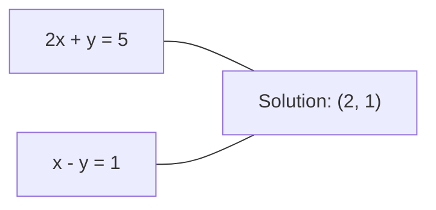
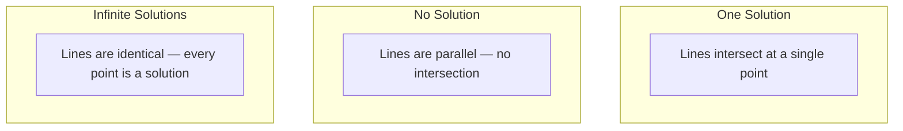

# 线性系统

求解 Ax = b是数学中最古老的问题，至今仍考验着你的神经网络能力。

**类型：** 构建
**语言：** Python
**先决条件：** 第一阶段，课程01（线性代数直觉），课程02（向量与矩阵），课程03（矩阵变换）
**时间：** 约120分钟

## 学习目标

- Solve the equation Ax = b using Gaussian elimination with partial pivoting and back substitution.
- Factorize matrices using LU, QR, and Cholesky decompositions, and explain when each method is appropriate.
- Derive the normal equations for least squares and relate them to linear regression and ridge regression.
- Diagnose ill-conditioned systems by examining their condition number and apply regularization techniques to stabilize them.

## 问题

每次你训练线性回归时，你都在解一个线性系统。每次计算最小二乘拟合时，你也在解一个线性系统。每当神经网络层计算 `y = Wx + b` 时，它实际上是在求解一个线性系统的某一边。当你加入正则化时，你就是在修改这个系统。使用高斯过程时，你是在对矩阵进行分解。当你对协方差矩阵求逆以获得马氏距离时，你也在解一个线性系统。

方程 Ax = b 随处可见。A 是已知系数的矩阵，b 是已知输出的向量，x 是你想要找到的未知向量。在线性回归中，A 是你的数据矩阵，b 是你的目标向量，x 是权重向量。整个模型归结为：找到 x 使得 Ax 尽可能接近 b。

本课程将从基础开始讲解所有主要的求解该方程的方法。你将理解为什么某些方法速度快而另一些稳定，为什么有些方法只适用于方阵系统，而另一些则处理超定系统，以及为什么你的矩阵的条件数决定了你的答案是否有意义。

## 概念

### 在几何学中，Ax = b表示一条直线垂直于x轴。

线性方程组具有几何解释。每个方程定义了一个超平面。解就是所有超平面相交的点（或点集）。

```
2x + y = 5          Two lines in 2D.
x - y  = 1          They intersect at x=2, y=1.
```



有三种情况可能发生：



以矩阵形式表示，“有一个解”意味着矩阵A是可逆的。“没有解”意味着系统是不一致的。“无限多个解”意味着矩阵A有零空间。大多数机器学习问题属于“没有精确解”的范畴，因为方程（数据点）的数量多于未知数（参数）的数量。这就是最小二乘法发挥作用的地方。

### 列图与行图

有两种方式可以理解Ax = b。

**行图法。**A的每一行定义了一个方程。每个方程都是一个超平面。解就是这些超平面的交点。

**列图法。**A的每一列都是一个向量。问题变为：哪些A的列的组合可以产生b？

```
A = | 2  1 |    b = | 5 |
    | 1 -1 |        | 1 |

Row picture: solve 2x + y = 5 and x - y = 1 simultaneously.

Column picture: find x1, x2 such that:
  x1 * [2, 1] + x2 * [1, -1] = [5, 1]
  2 * [2, 1] + 1 * [1, -1] = [4+1, 2-1] = [5, 1]   check.
```

The column picture is more fundamental. If vector b lies in the column space of matrix A, the system has a solution. If b does not lie in the column space, then one must find the closest point within the column space. This closest point represents the least-squares solution.

### 高斯消元法

高斯消元法将Ax = b转换为上三角系统Ux = c，通过回代来求解。这是最直接的方法。

算法：

```
1. For each column k (the pivot column):
   a. Find the largest entry in column k at or below row k (partial pivoting).
   b. Swap that row with row k.
   c. For each row i below k:
      - Compute multiplier m = A[i][k] / A[k][k]
      - Subtract m times row k from row i.
2. Back substitute: solve from the last equation upward.
```

示例：

```
Original:
| 2  1  1 | 8 |       R2 = R2 - (2)R1     | 2  1   1 |  8 |
| 4  3  3 |20 |  -->  R3 = R3 - (1)R1 --> | 0  1   1 |  4 |
| 2  3  1 |12 |                            | 0  2   0 |  4 |

                       R3 = R3 - (2)R2     | 2  1   1 |  8 |
                                       --> | 0  1   1 |  4 |
                                           | 0  0  -2 | -4 |

Back substitute:
  -2 * x3 = -4    -->  x3 = 2
  x2 + 2  = 4     -->  x2 = 2
  2*x1 + 2 + 2 = 8 --> x1 = 2
```

高斯消元法需要O(n^3)的操作次数。对于1000x1000的系统，这大约相当于十亿次浮点运算。虽然速度较快，但如果需要解决多个使用相同矩阵A的方程组，你可以采用更有效的方法。

### 部分枢轴旋转：为什么它很重要

Without pivoting, Gaussian elimination can fail or produce incorrect results. If the pivot element is zero, you will get division by zero. If the pivot element is small, rounding errors will be amplified.

```
Bad pivot:                       With partial pivoting:
| 0.001  1 | 1.001 |            Swap rows first:
| 1      1 | 2     |            | 1      1 | 2     |
                                 | 0.001  1 | 1.001 |
m = 1/0.001 = 1000              m = 0.001/1 = 0.001
R2 = R2 - 1000*R1               R2 = R2 - 0.001*R1
| 0.001  1     | 1.001   |      | 1      1     | 2     |
| 0     -999   | -999.0  |      | 0      0.999 | 0.999 |

x2 = 1.000 (correct)            x2 = 1.000 (correct)
x1 = (1.001 - 1)/0.001          x1 = (2 - 1)/1 = 1.000 (correct)
   = 0.001/0.001 = 1.000        Stable because the multiplier is small.
```

在精度有限的浮点运算中，未分拆版本可能会丢失重要数字。部分分拆总是选择最大可用的分拆项，以最小化误差放大。

### LU分解

LU分解将矩阵A分解为一个下三角矩阵L和一个上三角矩阵U：A = LU。L矩阵存储了高斯消元法中的乘子。U矩阵是消元过程的结果。

```
A = L @ U

| 2  1  1 |   | 1  0  0 |   | 2  1   1 |
| 4  3  3 | = | 2  1  0 | @ | 0  1   1 |
| 2  3  1 |   | 1  2  1 |   | 0  0  -2 |
```

为什么选择分解而不是直接消除？因为一旦有了L和U，求解Ax = b对于任何新的b只需要O(n^2)的时间：

```
Ax = b
LUx = b
Let y = Ux:
  Ly = b    (forward substitution, O(n^2))
  Ux = y    (back substitution, O(n^2))
```

在分解过程中，O(n^3)的成本只支付一次。之后的每次求解都是O(n^2)。如果你需要解决1000个具有相同A但不同b向量的系统，LU方法总共可以节省1000/3的运算时间。

使用部分 pivoting方法，可以得到PA = LU，其中P是一个记录行交换的排列矩阵。

### QR decomposition

QR分解将矩阵A分解为一个正交矩阵Q和一个上三角矩阵R：A = QR。

正交矩阵具有性质Q^T Q = I。其列向量是正交归一化的向量。乘以Q可以保持向量的长度和角度不变。

```
A = Q @ R

Q has orthonormal columns: Q^T Q = I
R is upper triangular

To solve Ax = b:
  QRx = b
  Rx = Q^T b    (just multiply by Q^T, no inversion needed)
  Back substitute to get x.
```

在解决最小二乘问题时，QR方法在数值上比LU方法更稳定。Gram-Schmidt过程逐列构建Q矩阵：

```
Given columns a1, a2, ... of A:

q1 = a1 / ||a1||

q2 = a2 - (a2 . q1) * q1        (subtract projection onto q1)
q2 = q2 / ||q2||                (normalize)

q3 = a3 - (a3 . q1) * q1 - (a3 . q2) * q2
q3 = q3 / ||q3||

R[i][j] = qi . aj    for i <= j
```

每一步都会移除所有之前与q向量相关的组件，仅留下新的正交方向。

### Cholesky decomposition

当矩阵A为对称矩阵（A = A^T）且正定矩阵（所有特征值均为正数）时，可以将其分解为A = L L^T的形式，其中L为下三角矩阵。这就是Cholesky分解。

```
A = L @ L^T

| 4  2 |   | 2  0 |   | 2  1 |
| 2  5 | = | 1  2 | @ | 0  2 |

L[i][i] = sqrt(A[i][i] - sum(L[i][k]^2 for k < i))
L[i][j] = (A[i][j] - sum(L[i][k]*L[j][k] for k < j)) / L[j][j]    for i > j
```

Cholesky算法的速度是LU算法的两倍，且所需的存储空间仅为一半。它仅适用于对称正定矩阵，但这些矩阵经常出现：

- 协方差矩阵是对称半正定的（通过正则化成为正定的）。
- 在高斯过程中，核矩阵是对称正定的。
- 凸函数在最小值处的Hessian是对称正定的。
- A^T A总是对称半正定的。

在高斯过程中，你使用Cholesky算法对核矩阵K进行分解，然后解K alpha = y以获得预测均值。Cholesky分解还给出了边际似然的对数行列式：log det(K) = 2 * sum(log(diag(L)))。

### 最小二乘法：当Ax = b没有精确解时

如果矩阵A是m x n的形式，且m大于n（方程数多于未知数），则该系统为过定系统。不存在精确解。相反，需要最小化平方误差：

```
minimize ||Ax - b||^2

This is the sum of squared residuals:
  sum((A[i,:] @ x - b[i])^2 for i in range(m))
```

最小化器满足正常方程：

```
A^T A x = A^T b
```

推导：展开 ||Ax - b||^2 得到 (Ax - b)^T (Ax - b) = x^T A^T A x - 2 x^T A^T b + b^T b。对 x 求梯度，令其等于零：2 A^T A x - 2 A^T b = 0。

```
Original system (overdetermined, 4 equations, 2 unknowns):
| 1  1 |         | 3 |
| 1  2 | x     = | 5 |       No exact x satisfies all 4 equations.
| 1  3 |         | 6 |
| 1  4 |         | 8 |

Normal equations:
A^T A = | 4  10 |    A^T b = | 22 |
        | 10 30 |            | 63 |

Solve: x = [1.5, 1.7]

This is linear regression. x[0] is the intercept, x[1] is the slope.
```

### 普通方程 = 线性回归

连接是精确的。在线性回归中，你的数据矩阵X每个样本有一行，每个特征有一列。目标向量y每个样本有一个元素。权重向量w满足：

```
X^T X w = X^T y
w = (X^T X)^(-1) X^T y
```

这是线性回归的封闭形式解。每次调用 `sklearn.linear_model.LinearRegression.fit()` 都会计算这个解（或者通过QR或SVD方法得到的解）。

在矩阵中添加正则化项lambda * I，就得到了岭回归：

```
(X^T X + lambda * I) w = X^T y
w = (X^T X + lambda * I)^(-1) X^T y
```

正则化使得矩阵的条件数得到改善（更易于准确求逆），并通过将权重缩小到零来防止过拟合。当lambda大于0时，矩阵X^T X + lambda * I始终为对称正定矩阵，因此可以使用Cholesky分解来求解它。

### 伪逆（摩尔-彭罗斯）

伪逆A+将矩阵求逆推广到非方阵和奇异矩阵。对于任何矩阵A：

```
x = A+ b

where A+ = V Sigma+ U^T    (computed via SVD)
```

Sigma+是通过取每个非零奇异值的倒数并翻转结果得到的。如果A = U Sigma V^T，那么A+ = V Sigma+ U^T。

```
A = U Sigma V^T        (SVD)

Sigma = | 5  0 |       Sigma+ = | 1/5  0  0 |
        | 0  2 |                | 0  1/2  0 |
        | 0  0 |

A+ = V Sigma+ U^T
```

伪逆给出了最小范数最小二乘解。如果系统有：
- 一个解：A+ b 给出该解。
- 无解：A+ b 给出最小二乘解。
- 无限多个解：A+ b 给出范数最小的那个解。

NumPy的`np.linalg.lstsq`和`np.linalg.pinv`都内部使用了SVD算法。

### 条件编号

条件数衡量了解决方案对输入中微小变化的敏感程度。对于矩阵A，条件数为：

```
kappa(A) = ||A|| * ||A^(-1)|| = sigma_max / sigma_min
```

其中，sigma_max和sigma_min分别是最大的奇异值和最小的奇异值。

```
Well-conditioned (kappa ~ 1):        Ill-conditioned (kappa ~ 10^15):
Small change in b -->                Small change in b -->
small change in x                    huge change in x

| 2  0 |   kappa = 2/1 = 2          | 1   1          |   kappa ~ 10^15
| 0  1 |   safe to solve            | 1   1+10^(-15) |   solution is garbage
```

通用规则：
- kappa < 100：安全，解决方案准确。
- kappa ~ 10^k：您的浮点运算精度损失约k位。
- kappa ~ 10^16（对于float64）：解决方案无意义。矩阵实际上为奇异矩阵。

在机器学习中，当特征几乎共线时会发生病态条件。正则化（添加lambda * I）可以将条件数从sigma_max / sigma_min提高到(sigma_max + lambda) / (sigma_min + lambda)。

### 迭代方法：共轭梯度法

对于非常大的稀疏系统（数百万个未知数），直接方法如LU或Cholesky计算成本过高。迭代方法通过多次迭代改进猜测值来近似求解。

共轭梯度法在A为对称正定矩阵时求解Ax = b。它在最多n次迭代中就能找到精确解（在精确算术条件下），但如果A的特征值集中在一起，则通常收敛速度更快。

```
Algorithm sketch:
  x0 = initial guess (often zero)
  r0 = b - A x0           (residual)
  p0 = r0                 (search direction)

  For k = 0, 1, 2, ...:
    alpha = (rk . rk) / (pk . A pk)
    x_{k+1} = xk + alpha * pk
    r_{k+1} = rk - alpha * A pk
    beta = (r_{k+1} . r_{k+1}) / (rk . rk)
    p_{k+1} = r_{k+1} + beta * pk
    if ||r_{k+1}|| < tolerance: stop
```

CG is used in:
- Large-scale optimization (Newton-CG method)
- Solving PDE discretizations
- Kernel methods where the kernel matrix is too large to factor
- Preconditioning for other iterative solvers

The convergence rate depends on the condition number. Systems with better condition numbers converge faster, which is another reason regularization helps.

### 完整的画面：何时使用哪种方法

| 方法 | 要求 | 成本 | 用例 |
|------|-----|------|------|
| 高斯消元法 | 方阵、非奇异矩阵A | O(n^3) | 一次性求解方阵系统 |
| LU分解 | 方阵、非奇异矩阵A | O(n^3)因子 + O(n^2)求解 | 多次使用相同矩阵A的求解 |
| QR分解 | 任意矩阵A（m >= n） | O(mn^2) | 最小二乘法，数值稳定 |
| Cholesky分解 | 对称正定矩阵A | O(n^3/3) | 协方差矩阵、高斯过程、岭回归 |
| 正规方程 | 超定系统（m > n） | O(mn^2 + n^3) | 线性回归（n较小时） |
| SVD/伪逆 | 任意矩阵A | O(mn^2) | 秩不足的系统，最小范数解 |
| 共轭梯度法 | 对称正定、稀疏矩阵A | O(n * k * nnz) | 大型稀疏系统，k = 迭代次数 |

### 与机器学习连接

本课程中的每种方法都出现在实际机器学习中：

**线性回归。** 封闭形式的解解决了正规方程 X^T X w = X^T y。这是通过Cholesky分解（如果n较小）或QR分解（如果数值稳定性重要）或SVD分解（如果矩阵可能具有秩缺陷）来完成的。

**岭回归。** 在X^T X上加上lambda * I。正则化系统 (X^T X + lambda * I) w = X^T y总是可以通过Cholesky分解解决的，因为对于lambda > 0，X^T X + lambda * I是对称正定的。

**高斯过程。** 预测均值需要解决K alpha = y方程，其中K是核矩阵。K的Cholesky分解是标准方法。对数边际似然使用log det(K) = 2 sum(log(diag(L)))。

**神经网络初始化。** 正交初始化使用QR分解来创建列为单位正交的权重矩阵。这可以防止深度网络中的信号崩溃。

**预处理。** 大规模优化器将不完全Cholesky分解或不完全LU分解作为共轭梯度求解器的预处理器。

**特征工程。** X^T X的条件数可以告诉你特征是否共线。如果kappa值较大，则删除某些特征或添加正则化。

```figure
linear-system-conditioning
```

## 构建它

### 步骤1：使用部分主元高斯消元法

```python
import numpy as np

def gaussian_elimination(A, b):
    n = len(b)
    Ab = np.hstack([A.astype(float), b.reshape(-1, 1).astype(float)])

    for k in range(n):
        max_row = k + np.argmax(np.abs(Ab[k:, k]))
        Ab[[k, max_row]] = Ab[[max_row, k]]

        if abs(Ab[k, k]) < 1e-12:
            raise ValueError(f"Matrix is singular or nearly singular at pivot {k}")

        for i in range(k + 1, n):
            m = Ab[i, k] / Ab[k, k]
            Ab[i, k:] -= m * Ab[k, k:]

    x = np.zeros(n)
    for i in range(n - 1, -1, -1):
        x[i] = (Ab[i, -1] - Ab[i, i+1:n] @ x[i+1:n]) / Ab[i, i]

    return x
```

### 步骤2：LU分解

```python
def lu_decompose(A):
    n = A.shape[0]
    L = np.eye(n)
    U = A.astype(float).copy()
    P = np.eye(n)

    for k in range(n):
        max_row = k + np.argmax(np.abs(U[k:, k]))
        if max_row != k:
            U[[k, max_row]] = U[[max_row, k]]
            P[[k, max_row]] = P[[max_row, k]]
            if k > 0:
                L[[k, max_row], :k] = L[[max_row, k], :k]

        for i in range(k + 1, n):
            L[i, k] = U[i, k] / U[k, k]
            U[i, k:] -= L[i, k] * U[k, k:]

    return P, L, U

def lu_solve(P, L, U, b):
    n = len(b)
    Pb = P @ b.astype(float)

    y = np.zeros(n)
    for i in range(n):
        y[i] = Pb[i] - L[i, :i] @ y[:i]

    x = np.zeros(n)
    for i in range(n - 1, -1, -1):
        x[i] = (y[i] - U[i, i+1:] @ x[i+1:]) / U[i, i]

    return x
```

### 步骤3：Cholesky分解

```python
def cholesky(A):
    n = A.shape[0]
    L = np.zeros_like(A, dtype=float)

    for i in range(n):
        for j in range(i + 1):
            s = A[i, j] - L[i, :j] @ L[j, :j]
            if i == j:
                if s <= 0:
                    raise ValueError("Matrix is not positive definite")
                L[i, j] = np.sqrt(s)
            else:
                L[i, j] = s / L[j, j]

    return L
```

### 步骤4：通过正规方程进行最小二乘法

```python
def least_squares_normal(A, b):
    AtA = A.T @ A
    Atb = A.T @ b
    return gaussian_elimination(AtA, Atb)

def ridge_regression(A, b, lam):
    n = A.shape[1]
    AtA = A.T @ A + lam * np.eye(n)
    Atb = A.T @ b
    L = cholesky(AtA)
    y = np.zeros(n)
    for i in range(n):
        y[i] = (Atb[i] - L[i, :i] @ y[:i]) / L[i, i]
    x = np.zeros(n)
    for i in range(n - 1, -1, -1):
        x[i] = (y[i] - L.T[i, i+1:] @ x[i+1:]) / L.T[i, i]
    return x
```

### 步骤5：条件编号

```python
def condition_number(A):
    U, S, Vt = np.linalg.svd(A)
    return S[0] / S[-1]
```

## 使用它

将线性回归和岭回归的要素整合到真实数据上：

```python
np.random.seed(42)
X_raw = np.random.randn(100, 3)
w_true = np.array([2.0, -1.0, 0.5])
y = X_raw @ w_true + np.random.randn(100) * 0.1

X = np.column_stack([np.ones(100), X_raw])

w_ols = least_squares_normal(X, y)
print(f"OLS weights (ours):    {w_ols}")

w_np = np.linalg.lstsq(X, y, rcond=None)[0]
print(f"OLS weights (numpy):   {w_np}")
print(f"Max difference: {np.max(np.abs(w_ols - w_np)):.2e}")

w_ridge = ridge_regression(X, y, lam=1.0)
print(f"Ridge weights (ours):  {w_ridge}")

from sklearn.linear_model import Ridge
ridge_sk = Ridge(alpha=1.0, fit_intercept=False)
ridge_sk.fit(X, y)
print(f"Ridge weights (sklearn): {ridge_sk.coef_}")
```

## 发货

本课程将生成以下内容：
- `code/linear_systems.py`，其中包含高斯消元法、LU分解、Cholesky分解、最小二乘法和岭回归的从头开始实现
- 一个实际演示，证明正规方程和sklearn的LinearRegression产生相同的权重

## 练习

1. Use Gaussian elimination, LU solver, and `np.linalg.solve` to solve the system `[[1,2,3],[4,5,6],[7,8,10]] x = [6, 15, 27]`. Verify that all three methods yield the same answer within floating-point tolerance.

2. Generate a 50x5 random matrix X and a target y = X @ w_true + noise. Solve for w using normal equations, QR (via `np.linalg.qr`), SVD (via `np.linalg.svd`), and `np.linalg.lstsq`. Compare the four solutions. Calculate the condition number of X^T X and explain how it affects your choice of method.

3. Create a nearly singular matrix by making two columns almost identical (e.g., column 2 = column 1 + 1e-10 * noise). Compute its condition number. Solve Ax = b with and without regularization (add 0.01 * I). Compare the solutions and residuals. Explain why regularization helps.

4. Implement the conjugate gradient algorithm for a 100x100 random symmetric positive definite matrix. Count the number of iterations required to converge to a tolerance of 1e-8. Compare this with the theoretical maximum number of iterations.

5. Time the performance of your Cholesky solver, LU solver, and `np.linalg.solve` on symmetric positive definite matrices of sizes 10, 50, 200, and 500. Plot the results to show that Cholesky is roughly 2 times faster than LU.

## | 关键词 | 翻译 |

| 术语 | 人们怎么说 | 实际含义 |
|------|----------------|----------------|
| 线性系统 | “求解x” | 一组线性方程Ax = b。求解x意味着找到在变换A下产生输出b的输入值。 |
| 高斯消元法 | “行简化” | 通过行操作系统地将对角线以下的元素归零，得到一个可以通过回代解决的上三角系统。O(n^3)。 |
| 部分主元交换 | “为了稳定性交换行” | 在消除第k列的元素之前，将该列中绝对值最大的行交换到主元位置。防止除以小数。 |
| LU分解 | “分解为三角形” | 写出A = LU，其中L是下三角矩阵（存储乘数），U是上三角矩阵（被消除的矩阵）。将O(n^3)的成本分摊到多次求解中。 |
| QR分解 | “正交分解” | 写出A = QR，其中Q的列是正交归一化的，R是上三角矩阵。比LU更适合最小二乘法。 |
| Cholesky分解 | “矩阵的平方根” | 对于对称正定矩阵A，写出A = LL^T。成本是LU的一半。用于协方差矩阵、核矩阵和岭回归。 |
| 最小二乘法 | “当精确解不可能时的最佳拟合” | 最小化残差平方和||Ax - b||^2，当系统超定时（方程多于未知数）。 |
| 正规方程 | “微积分捷径” | A^T A x = A^T b。将||Ax - b||^2的梯度设为零。这是线性回归的封闭形式解。 |
| 伪逆 | “非方阵的逆” | A+ = V Sigma+ U^T通过SVD。为任何矩阵提供最小范数最小二乘解，无论其是正方形还是矩形，奇异或非奇异。 |
| 条件数 | “这个答案有多可靠” | kappa = sigma_max / sigma_min。衡量对输入扰动的敏感性。精度损失约log10(kappa)位。 |
| 岭回归 | “正则化最小二乘法” | 求解(X^T X + lambda I) w = X^T y。添加lambda I可以改善条件数并使权重趋近于零。防止过拟合。 |
| 共轭梯度法 | “大矩阵的迭代Ax=b” | 用于对称正定系统的迭代求解器。最多n步收敛。适用于分解过于昂贵的大型稀疏系统。 |
| 超定系统 | “数据多于参数” | m > n的m乘n系统中，不存在精确解。最小二乘法找到最佳近似。这是所有回归问题的情况。 |
| 回代 | “从下到上求解” | 给定一个上三角系统，先解决最后一个方程，然后反向代入。O(n^2)。 |
| 正向代换 | “从上到下求解” | 给定一个下三角系统，先解决第一个方程，然后正向代入。O(n^2)。用于LU分解的L步骤。 |

## 更多阅读资料

- [MIT 18.06: 线性代数](https://ocw.mit.edu/courses/18-06-linear-algebra-spring-2010/) (Gilbert Strang) -- 关于线性系统和矩阵分解的权威课程  
- [数值线性代数](https://people.maths.ox.ac.uk/trefethen/text.html) (Trefethen & Bau) -- 理解数值稳定性、条件数以及算法为何失败的标准参考书  
- [矩阵计算](https://www.cs.cornell.edu/cv/GolubVanLoan4/golubandvanloan.htm) (Golub & Van Loan) -- 涵盖所有矩阵算法的百科全书式参考手册  
- [3Blue1Brown: 逆矩阵](https://www.3blue1brown.com/lessons/inverse-matrices) -- 通过视觉方式直观理解Ax = b在几何上的含义
