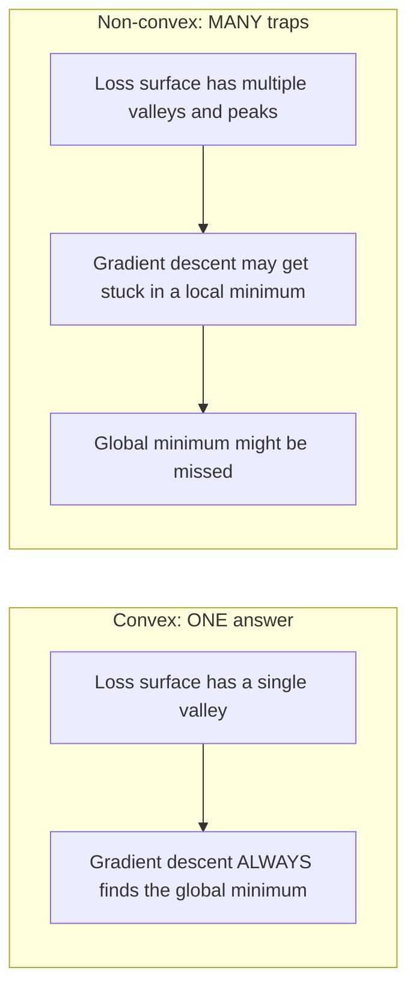
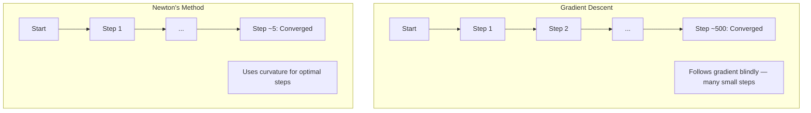
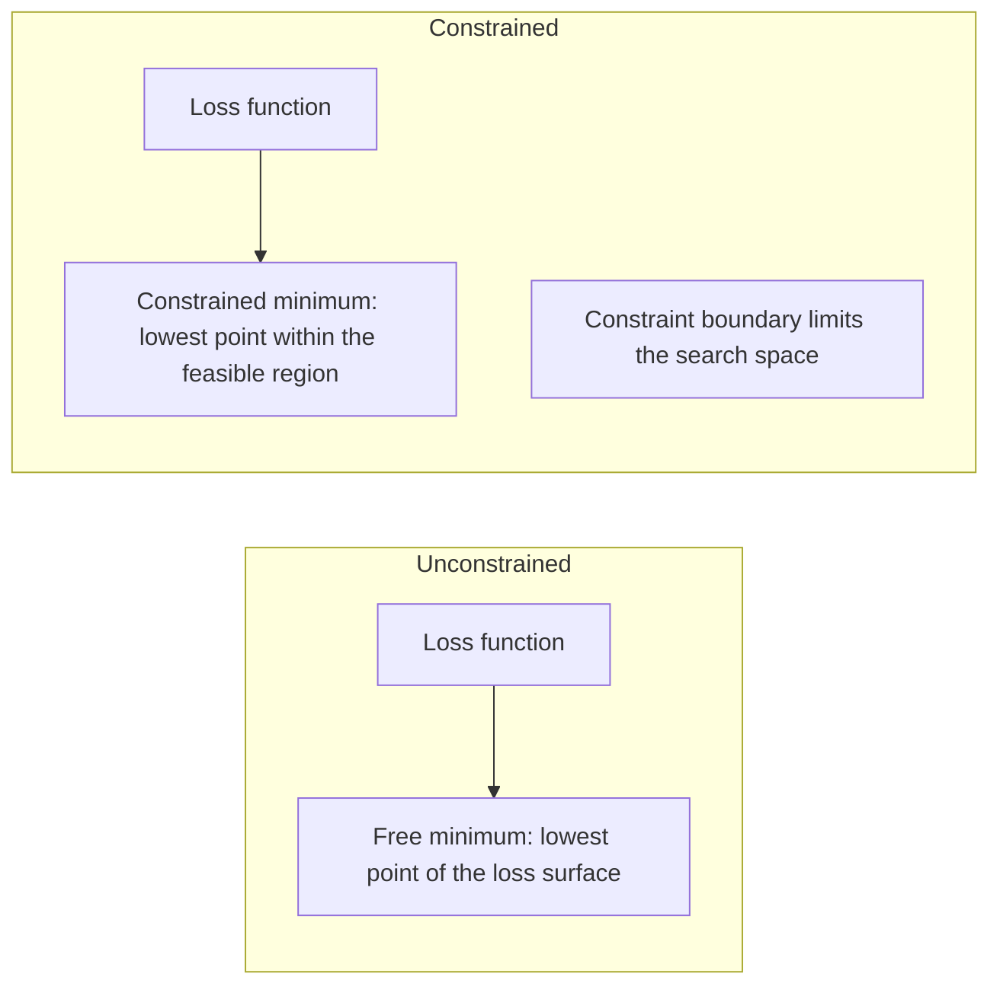
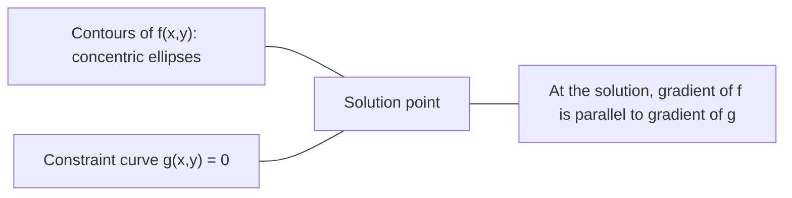

# Convex Optimization

凸形问题只有一个低谷。神经网络则有数百万个低谷。了解这种差异非常重要。

**类型：**构建
**语言：**Python
**先决条件：**第一阶段，课程04（机器学习微积分），课程08（优化）
**时间：**约90分钟

## 学习目标

- Use the definition, second derivative, and Hessian criteria to determine whether a function is convex.
- Implement Newton's method and compare its quadratic convergence with gradient descent.
- Solve constrained optimization problems using Lagrange multipliers and understand the KKT conditions.
- Explain why neural network loss landscapes are non-convex yet SGD still finds good solutions.

## 问题

第08课教你了梯度下降、动量算法和Adam优化器。这些优化方法在任何表面上都会向下移动，但它们并不保证结果一定正确。在非凸优化问题中，梯度下降可能会陷入糟糕的局部最小值，停留在鞍点上，或者永远波动不已。尽管如此，你仍然使用了它，因为神经网络是非凸的，没有其他替代方案。

但机器学习中的许多问题都是凸的。线性回归、逻辑回归、支持向量机、LASSO算法、岭回归等都属于这类问题。对于这些问题，存在一种更强大的优化方法：具有数学保证的优化。凸问题只有一个低谷，任何向下移动的算法都会达到全局最小值，无需重新启动，也无需调整学习率，更不需要祈祷。

理解凸性有三个作用。首先，它告诉你问题何时简单（凸）何时复杂（非凸）。其次，它为凸问题提供了更快的解决方案，如牛顿法。第三，它解释了机器学习中出现的各种概念：正则化作为约束、支持向量机中的对偶性，以及为什么深度学习能够工作，尽管它违反了凸性所赋予的每一个良好特性。

## 概念

### 凸集

集合S是凸的，如果对于其中的任意两点，它们之间的线段也完全位于S内。

| 凸集 | 非凸集 |
|---|---|
| **矩形**：内部任意两点可以通过位于内部的线段连接 | **星形/新月形**：两个内部点之间的线可以穿过集合外部 |
| **三角形**：所有内部点都具有相同性质 | **甜甜圈/环形**：孔洞意味着某些线段会离开集合 |
| 任意两点之间的线段始终位于集合中 | 某些点对之间的线段会离开集合 |

形式化测试：对于S中的任意点x, y和任意t在[0, 1]之间，点tx + (1-t)y也位于S内。

凸集的例子：
- 一条直线、一个平面、所有R^n中的元素
- 一个球（圆、球体、超球体）
- 半空间：{x : a^T x <= b}
- 任意数量凸集的交集

非凸集的例子：
- 甜甜圈（环形）
- 两个不相交圆的并集
- 任何有“凹陷”或“孔洞”的集合

### 凸函数

如果一个函数f的定义域是一个凸集，并且对于其定义域中的任意两点x、y以及任意的t在[0, 1]之间，满足以下条件：

```
f(tx + (1-t)y) <= t*f(x) + (1-t)*f(y)
```

几何上：图表上任意两点之间的线段位于曲线之上或曲线上。

| 属性 | 凸函数 | 非凸函数 |
|---|---|---|
| **线段测试** | 图表上任意两点之间的线位于曲线**上方或曲线上** | 图表上某些点之间的线低于曲线 |
| **形状** | 单个向上弯曲的碗状/山谷 | 多个具有混合曲率的峰和谷 |
| **局部最小值** | 每个局部最小值都是全局最小值 | 可能存在多个不同高度的局部最小值 |

常见的凸函数：
- f(x) = x^2（抛物线）
- f(x) = |x|（绝对值）
- f(x) = e^x（指数型）
- f(x) = max(0, x)（ReLU，尽管是分段线性的）
- f(x) = -log(x) 对于 x > 0（负对数）
- 任何线性函数 f(x) = a^T x + b（既凸又凹）

### Testing for convexity

从最简单到最严格，有三个实际测试。

**测试1：二阶导数测试（一维）。** 如果对所有x都有f''(x) >= 0，则f是凸函数。

- f(x) = x^2：f''(x) = 2 >= 0。凸函数。
- f(x) = x^3：f''(x) = 6x。当x < 0时为负。非凸函数。
- f(x) = e^x：f''(x) = e^x > 0。凸函数。

**测试2：Hessian测试（多变量）。** 如果对所有x，Hessian矩阵H(x)都是半正定的，则f是凸函数。Hessian是二阶导数矩阵。

**测试3：定义测试。** 直接检查不等式f(tx + (1-t)y) <= t*f(x) + (1-t)*f(y)。适用于导数难以计算的函数。

### 为什么凸性很重要

凸优化中心定理：

**对于凸函数，每个局部最小值都是全局最小值。** 

这意味着梯度下降不会陷入局部最优。任何向下的路径都会得到相同的答案。该算法保证会收敛到最优解。



后果：
- 无需随机重启
- 无需复杂的学习率调度
- 可以证明收敛性（速率取决于函数属性）
- 解是唯一的（在平坦区域除外）

### 在机器学习中，凸函数与非凸函数的区别如下：

| 问题 | 凸函数？ | 原因 |
|-----|---------|-----|
| 线性回归（均方误差） | 是 | 损失函数与权重呈二次关系 |
| 逻辑回归 | 是 | 对数损失函数在权重上是凸的 |
| SVM（铰链损失） | 是 | 线性函数的最大值 |
| LASSO（L1回归） | 是 | 凸函数的总和是凸的 |
| Ridge回归（L2） | 是 | 二次项相加为凸函数 |
| 神经网络（任何损失函数） | 否 | 非线性激活函数产生非凸结构 |
| k均值聚类 | 否 | 离散的分配步骤 |
| 矩阵分解 | 否 | 未知数的乘积 |

具有凸损失函数的线性模型是凸的。一旦加入带有非线性激活函数的隐藏层，凸性就会丧失。

### Hessian matrix

函数的Hessian H：f: R^n -> R，是n x n的第二偏导数矩阵。

```
H[i][j] = d^2 f / (dx_i dx_j)
```

对于 f(x, y) = x^2 + 3xy + y^2:

```
df/dx = 2x + 3y       d^2f/dx^2 = 2      d^2f/dxdy = 3
df/dy = 3x + 2y       d^2f/dydx = 3      d^2f/dy^2 = 2

H = [ 2  3 ]
    [ 3  2 ]
```

Hessian可以告诉你函数的曲率：
- 所有特征值为正：函数在每个方向上都向上弯曲（该点为凸函数）
- 所有特征值为负：函数在每个方向上都向下弯曲（凹函数，局部最大值）
- 正负值混合：鞍点（在某些方向上向上弯曲，在其他方向上向下弯曲）
- 零特征值：该方向上的曲线平坦（退化）

对于凸性，Hessian必须在所有地方都是半正定的（所有特征值 >= 0），而不仅仅是在某一点。

### 牛顿法

梯度下降法使用一阶信息（梯度）。牛顿法使用二阶信息（海森矩阵）。它在当前点进行二次近似，并直接跳到该二次函数的最小值。

```
Update rule:
  x_new = x - H^(-1) * gradient

Compare to gradient descent:
  x_new = x - lr * gradient
```

牛顿法用逆Hessian替代了标量学习率。这可以根据局部曲率自动调整步长和方向。



Advantages:
- Quadratic convergence near the minimum (error squares each step)
- No need to tune the learning rate
- Scale-invariant (works regardless of how you parameterize the problem)

Disadvantages:
- Computing the Hessian requires O(n^2) memory and O(n^3) time for inversion
- For a neural network with 1 million weights, this involves 10^12 entries and 10^18 operations
- Not practical for deep learning

### 受限优化

无约束优化：在所有x上最小化f(x)。
有约束优化：在约束条件下最小化f(x)。

实际问题存在约束。你希望降低成本，但预算有限。你希望减少误差，但模型复杂性受到限制。



### Lagrange multipliers

拉格朗日乘数法将约束问题转化为无约束问题。

问题：在约束条件 g(x) = 0 下最小化 f(x)。

解决方案：引入一个新的变量（拉格朗日乘数 λ），并解决无约束问题：

```
L(x, lambda) = f(x) + lambda * g(x)
```

在解中，L的梯度为零：

```
dL/dx = df/dx + lambda * dg/dx = 0
dL/dlambda = g(x) = 0
```

几何直觉：在约束最小值时，函数f的梯度必须与约束g的梯度平行。如果它们不平行，就可以沿着约束表面移动以进一步减少f的值。



示例：在约束条件 x + y = 1 的情况下，最小化函数 f(x,y) = x^2 + y^2。

```
L = x^2 + y^2 + lambda(x + y - 1)

dL/dx = 2x + lambda = 0  =>  x = -lambda/2
dL/dy = 2y + lambda = 0  =>  y = -lambda/2
dL/dlambda = x + y - 1 = 0

From first two: x = y
Substituting: 2x = 1, so x = y = 0.5, lambda = -1
```

直线 x + y = 1 与原点最近的点是 (0.5, 0.5)。

### KKT conditions

Karush-Kuhn-Tucker条件将拉格朗日乘数应用于不等式约束。

问题：在g_i(x) <= 0对于i = 1, ..., m的约束下，最小化f(x)。

KKT条件（最优性的必要条件）：

```
1. Stationarity:    df/dx + sum(lambda_i * dg_i/dx) = 0
2. Primal feasibility:  g_i(x) <= 0  for all i
3. Dual feasibility:    lambda_i >= 0  for all i
4. Complementary slackness:  lambda_i * g_i(x) = 0  for all i
```

互补松弛性是关键概念：要么约束是激活的（g_i = 0，解位于边界上），要么乘数为零（约束无关紧要）。不影响解的约束其lambda值为0。

KKT条件在支持向量机中至关重要。支持向量是约束激活的数据点（lambda > 0）。所有其他数据点的lambda值均为0，不会影响决策边界。

### 正则化作为约束优化

L1和L2正则化并非任意的技巧。它们实际上是伪装起来的约束优化问题。

**L2正则化（岭回归）：**

```
minimize  Loss(w)  subject to  ||w||^2 <= t

Equivalent unconstrained form:
minimize  Loss(w) + lambda * ||w||^2
```

约束 ||w||^2 <= t定义了一个球体（在2D中为圆，在3D中为球）。解即为损失曲线首次接触该球体的位置。

**L1正则化（LASSO）：**

```
minimize  Loss(w)  subject to  ||w||_1 <= t

Equivalent unconstrained form:
minimize  Loss(w) + lambda * ||w||_1
```

约束 ||w||_1 <= t 定义了一个菱形（二维中的旋转正方形）。

| 属性 | L2约束（圆形） | L1约束（菱形） |
|---|---|---|
| **约束形状** | 圆形（更高维度下的球体） | 菱形（二维中的旋转正方形） |
| **损失轮廓接触的位置** | 平滑边界——圆上的任意点 | 角点——与轴对齐 |
| **解决方案行为** | 权重较小但非零 | 部分权重完全为零（稀疏） |
| **结果** | 权重缩小 | 特征选择 |

这解释了为什么L1会产生稀疏模型（特征选择），而L2仅会缩小权重。菱形具有与轴对齐的角点。损失轮廓更有可能接触角点，将一个或多个权重完全设为零。

### 二元性

每个受限优化问题（原始问题）都有一个伴随问题（对偶问题）。对于凸问题，原始问题和对偶问题具有相同的最优值。这就是强对偶性。

拉格朗日对偶函数：

```
Primal: minimize f(x) subject to g(x) <= 0
Lagrangian: L(x, lambda) = f(x) + lambda * g(x)
Dual function: d(lambda) = min_x L(x, lambda)
Dual problem: maximize d(lambda) subject to lambda >= 0
```

为什么对偶性很重要：
- 对偶问题有时比原始问题更容易解决
- 支持向量机（SVM）以对偶形式求解，其中问题依赖于数据点之间的点积（这利用了核技巧）
- 对偶提供了原始最优解的下限，有助于检查解决方案的质量

特别是对于支持向量机而言：

```
Primal: find w, b that maximize the margin 2/||w|| subject to
        y_i(w^T x_i + b) >= 1 for all i

Dual:   maximize sum(alpha_i) - 0.5 * sum_ij(alpha_i * alpha_j * y_i * y_j * x_i^T x_j)
        subject to alpha_i >= 0 and sum(alpha_i * y_i) = 0

The dual only involves dot products x_i^T x_j.
Replace x_i^T x_j with K(x_i, x_j) to get the kernel trick.
```

### 为什么深度学习能够在非凸情况下工作

神经网络损失函数具有非凸特性。按照所有经典标准，优化这些函数应该会失败。然而，随机梯度下降却能可靠地找到好的解。有几个因素可以解释这一现象。

**大多数局部最小值都足够好。**在高维空间中，随机的临界点（梯度为零的点）绝大多数是鞍点，而非局部最小值。存在的少数局部最小值往往其损失值接近全局最小值。当参数空间有数百万个维度时，陷入糟糕的局部最小值的可能性极低。

**真正的障碍是鞍点，而非局部最小值。**对于一个具有n个参数的函数，鞍点具有正负曲率方向的交汇点。在高维空间中，所有n个特征值均为正（即局部最小值）的概率大约为2^(-n)。几乎所有的临界点都是鞍点。SGD的噪声有助于避开这些鞍点。

**过度参数化使损失曲面更加平滑。**参数数量超过训练样本数量的网络，其损失曲面更为平滑、连接更紧密。网络规模较大的情况下，不良局部最小值的数量较少。这看似违反直觉，但经验上是一致的。

**损失曲面的结构：**

| 属性 | 低维空间 | 高维空间 |
|---|---|---|
| **曲面结构** | 许多孤立的峰和谷 | 平滑连接的谷 |
| **最小值** | 许多孤立的局部最小值 | 少数不良局部最小值；大多数接近最优 |
| **导航** | 难以找到全局最小值 | 许多路径能导向好的解 |
| **临界点** | 局部最小值和鞍点的混合 | 绝大多数是鞍点，而非局部最小值 |

**随机噪声起到隐式正则化的作用。**小批量SGD添加的噪声防止网络陷入尖锐的最小值。尖锐的最小值会导致过拟合；平坦的最小值则有助于泛化。噪声使优化过程倾向于损失曲面的平坦区域。

### 实际中的二阶方法

纯牛顿法对于大型模型来说不实用。通过多次近似可以使二阶信息变得可用。

**L-BFGS（有限记忆BFGS）：** 使用最后m个梯度差异来近似逆Hessian。需要O(mn)内存，而不是O(n^2)。适用于参数最多约10,000的问题。用于经典机器学习（逻辑回归、CRFs），但不适用于深度学习。

**自然梯度：** 使用费舍尔信息矩阵（对数似然的期望Hessian）代替标准Hessian。这考虑了概率分布的几何特性。K-FAC（克罗内克分解近似曲率）将费舍尔矩阵视为克罗内克积来近似，使其适用于神经网络。

**无Hessian优化：** 使用共轭梯度法求解Hx = g，而不需要形成H。仅需要Hessian-向量乘积，可以通过自动微分在O(n)时间内计算。

**对角近似：** Adam的二阶矩是Hessian对角线的对角近似。AdaHessian通过哈钦森估计器使用实际Hessian对角线元素来扩展这一方法。

| 方法 | 内存需求 | 每步成本 | 适用场景 |
|------|--------|----------|-------------|
| 梯度下降 | O(n) | O(n) | 基线算法，大型模型 |
| 牛顿法 | O(n^2) | O(n^3) | 小型凸问题 |
| L-BFGS | O(mn) | O(mn) | 中等凸问题 |
| Adam | O(n) | O(n) | 深度学习的默认方法 |
| K-FAC | O(n) | 每层O(n) | 研究，大批量训练 |

```figure
convex-vs-nonconvex
```

## 构建它

### 步骤1：凸性检查器

构建一个函数，通过采样点并检查定义来实证测试凸性。

```python
import random
import math

def check_convexity(f, dim, bounds=(-5, 5), samples=1000):
    violations = 0
    for _ in range(samples):
        x = [random.uniform(*bounds) for _ in range(dim)]
        y = [random.uniform(*bounds) for _ in range(dim)]
        t = random.uniform(0, 1)
        mid = [t * xi + (1 - t) * yi for xi, yi in zip(x, y)]
        lhs = f(mid)
        rhs = t * f(x) + (1 - t) * f(y)
        if lhs > rhs + 1e-10:
            violations += 1
    return violations == 0, violations
```

### 步骤2：二维牛顿法

使用显式Hessian实现牛顿法。比较其收敛速度与梯度下降法的收敛速度。

```python
def newtons_method(f, grad_f, hessian_f, x0, steps=50, tol=1e-12):
    x = list(x0)
    history = [x[:]]
    for _ in range(steps):
        g = grad_f(x)
        H = hessian_f(x)
        det = H[0][0] * H[1][1] - H[0][1] * H[1][0]
        if abs(det) < 1e-15:
            break
        H_inv = [
            [H[1][1] / det, -H[0][1] / det],
            [-H[1][0] / det, H[0][0] / det],
        ]
        dx = [
            H_inv[0][0] * g[0] + H_inv[0][1] * g[1],
            H_inv[1][0] * g[0] + H_inv[1][1] * g[1],
        ]
        x = [x[0] - dx[0], x[1] - dx[1]]
        history.append(x[:])
        if sum(gi ** 2 for gi in g) < tol:
            break
    return history
```

### 步骤3：拉格朗日乘子求解器

使用拉格朗日函数进行梯度下降，解决约束优化问题。

```python
def lagrange_solve(f_grad, g_val, g_grad, x0, lr=0.01,
                   lr_lambda=0.01, steps=5000):
    x = list(x0)
    lam = 0.0
    history = []
    for _ in range(steps):
        fg = f_grad(x)
        gv = g_val(x)
        gg = g_grad(x)
        x = [
            xi - lr * (fgi + lam * ggi)
            for xi, fgi, ggi in zip(x, fg, gg)
        ]
        lam = lam + lr_lambda * gv
        history.append((x[:], lam, gv))
    return history
```

### 步骤4：比较一阶与二阶

对同一个二次函数使用梯度下降法和牛顿法。计算收敛所需的步骤数。

```python
def quadratic(x):
    return 5 * x[0] ** 2 + x[1] ** 2

def quadratic_grad(x):
    return [10 * x[0], 2 * x[1]]

def quadratic_hessian(x):
    return [[10, 0], [0, 2]]
```

牛顿法在1步内就能收敛（对于二次方程，它是精确的）。梯度下降则需要数百步，因为海森矩阵的特征值相差5倍，从而形成了一个延长的山谷。

## 使用它

在选择机器学习模型和求解器时，凸性分析直接适用。

对于凸问题（逻辑回归、SVM、LASSO）：
- 使用专用求解器（liblinear、CVXPY、scipy.optimize.minimize方法='L-BFGS-B'）
- 期望有唯一的全局解
- 二阶方法是实用且快速的

对于非凸问题（神经网络）：
- 使用一阶方法（SGD、Adam）
- 接受解决方案依赖于初始化和随机性的事实
- 将过参数化、噪声和学习率调度作为隐式正则化使用
- 不要浪费时间寻找全局最小值。一个良好的局部最小值就足够了。

```python
from scipy.optimize import minimize

result = minimize(
    fun=lambda w: sum((y - X @ w) ** 2) + 0.1 * sum(w ** 2),
    x0=np.zeros(d),
    method='L-BFGS-B',
    jac=lambda w: -2 * X.T @ (y - X @ w) + 0.2 * w,
)
```

对于SVM，对偶形式允许你使用核技巧：

```python
from sklearn.svm import SVC

svm = SVC(kernel='rbf', C=1.0)
svm.fit(X_train, y_train)
print(f"Support vectors: {svm.n_support_}")
```

## 练习

1. **Convexity gallery.** Test these functions for convexity using the checker: f(x) = x^4, f(x) = sin(x), f(x,y) = x^2 + y^2, f(x,y) = x*y, f(x) = max(x, 0). Explain why each result makes sense.

2. **Newton vs gradient descent race.** Run both methods on f(x,y) = 50*x^2 + y^2 from the starting point (10, 10). How many steps does each need to reach loss < 1e-10? What happens to gradient descent when the condition number (ratio of largest to smallest Hessian eigenvalue) increases?

3. **Lagrange multiplier geometry.** Minimize f(x,y) = (x-3)^2 + (y-3)^2 subject to x + 2y = 4. Verify the solution by checking that the gradient of f is parallel to the gradient of g at the solution.

4. **Regularization constraint.** Implement L1-constrained optimization: minimize (x-3)^2 + (y-2)^2 subject to |x| + |y| <= 1. Show that the solution has one coordinate equal to zero (sparsity from the diamond constraint).

5. **Hessian eigenvalue analysis.** Compute the Hessian of the Rosenbrock function at (1,1) and at (-1,1). Compute eigenvalues at both points. What do the eigenvalues tell you about the curvature at the minimum versus far from it?

## | 关键词 | 翻译 |

| 术语 | 含义 |
|------|-----|
| 凸集 | 任意两点之间的线段都位于该集合内的集合。 |
| 凸函数 | 其图像上任意两点连线位于函数上方或图形上的函数。等价地，海森矩阵在任何地方都是半正定的。 |
| 局部最小值 | 低于所有邻近点的点。对于凸函数，每个局部最小值都是全局最小值。 |
| 全局最小值 | 函数在整个定义域上的最低点。 |
| 海森矩阵 | 所有二阶偏导数的矩阵，编码曲率信息。 |
| 半正定 | 其特征值均为非负矩阵的属性。“二阶导数 >= 0”的多维类比。 |
| 条件数 | 海森矩阵最大特征值与最小特征值的比值。高条件数意味着山谷延长和梯度下降缓慢。 |
| 牛顿法 | 使用逆海森矩阵确定步长和方向的二阶优化算法。在最小值附近具有二次收敛性。 |
| 拉格朗日乘数 | 用于将约束优化问题转换为无约束问题的变量。 |
| KKT条件 | 带有不等式约束的最优性的必要条件。推广了拉格朗日乘数概念。 |
| 互补松弛性 | 在解中，要么约束是激活的，要么其乘数为零。不能同时非零。 |
| 对偶性 | 每个约束问题都有对应的对偶问题。对于凸问题，两者具有相同的最优值。 |
| 强对偶性 | 原始和对偶最优值相等。适用于满足斯莱特条件的凸问题。 |
| L-BFGS | 近似二阶方法，存储最后m个梯度差异而不是完整的海森矩阵。 |
| 鞍点 | 梯度为零但在某些方向上为最小值、在其他方向上为最大值的点。 |
| 过度参数化 | 使用的参数多于训练样本。平滑损失曲面并减少不良局部最小值。 |

## 更多阅读资料

- [Boyd & Vandenberghe: Convex Optimization](https://web.stanford.edu/~boyd/cvxbook/) – the standard textbook, freely available online  
- [Bottou, Curtis, Nocedal: Optimization Methods for Large-Scale Machine Learning (2018)](https://arxiv.org/abs/1606.04838) – bridges convex optimization theory and deep learning practice  
- [Choromanska et al.: The Loss Surfaces of Multilayer Networks (2015)](https://arxiv.org/abs/1412.0233) – explains why non-convex neural network landscapes are not as bad as they seem  
- [Nocedal & Wright: Numerical Optimization](https://link.springer.com/book/10.1007/978-0-387-40065-5) – comprehensive reference for Newton’s method, L-BFGS, and constrained optimization
