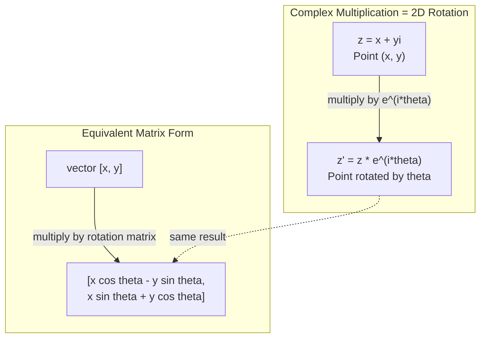
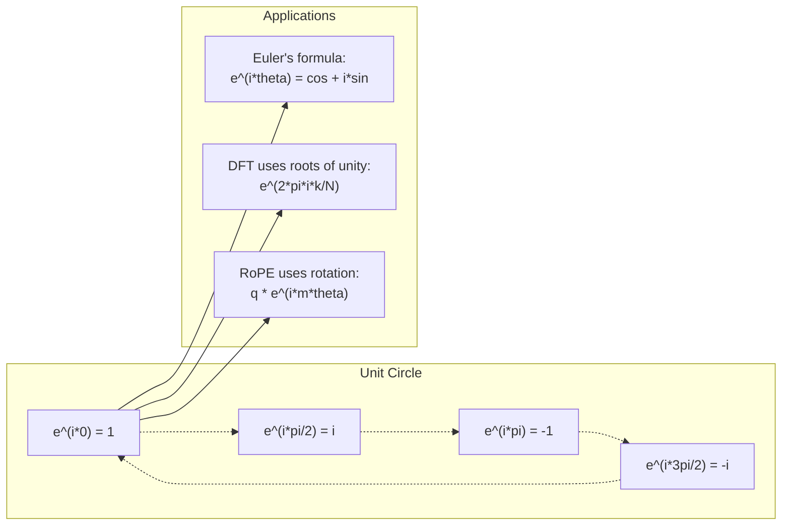

# 复数在人工智能中的应用

> 平方根中的 -1 并非虚数。它是旋转、频率以及信号处理中重要概念的关键。

**类型：** 学习
**语言：** Python
**先决条件：** 第一阶段，课程01-04（线性代数、微积分）
**时间：** 约60分钟

## 学习目标

- Perform complex arithmetic operations (addition, multiplication, division, conjugation) in both rectangular and polar forms
- Apply Euler's formula to convert between complex exponentials and trigonometric functions
- Implement the Discrete Fourier Transform using complex roots of unity
- Explain how complex rotations underlie RoPE and sinusoidal positional encodings in transformers

## 问题

You open a paper on Fourier transforms and there is `i` everywhere. You look at transformer positional encodings and see `sin` and `cos` at different frequencies -- the real and imaginary parts of complex exponentials. You read about quantum computing and find everything expressed in complex vector spaces.

Complex numbers seem abstract. A number system built on the square root of -1 feels like a mathematical trick. But it is not a trick. It is the natural language of rotations and oscillations. Every time something spins, vibrates, or oscillates, complex numbers are the right tool.

Without understanding complex numbers, you cannot understand the Discrete Fourier Transform. You cannot understand FFT. You cannot understand how RoPE (Rotary Position Embedding) works in modern language models. You cannot understand why sinusoidal positional encodings in the original Transformer paper use the frequencies they do.

This lesson builds complex arithmetic from scratch, connects it to geometry, and shows you exactly where complex numbers appear in machine learning.

## 概念

### 什么是复数？

一个复数由两部分组成：实部与虚部。

```
z = a + bi

where:
  a is the real part
  b is the imaginary part
  i is the imaginary unit, defined by i^2 = -1
```

就是这样。你将数轴扩展到一个平面上。实数位于一条轴上，虚数位于另一条轴上。每个复数都是这个平面上的一个点。

### 复杂算术

**加法。**将实部相加，然后将虚部相加。

```
(a + bi) + (c + di) = (a + c) + (b + d)i

Example: (3 + 2i) + (1 + 4i) = 4 + 6i
```

**乘法。**使用分配律，并记住i^2 = -1。

```
(a + bi)(c + di) = ac + adi + bci + bdi^2
                 = ac + adi + bci - bd
                 = (ac - bd) + (ad + bc)i

Example: (3 + 2i)(1 + 4i) = 3 + 12i + 2i + 8i^2
                            = 3 + 14i - 8
                            = -5 + 14i
```

**共轭。** 翻转虚部的符号。

```
conjugate of (a + bi) = a - bi
```

一个复数与其共轭复数的乘积总是实数：

```
(a + bi)(a - bi) = a^2 + b^2
```

**除法。** 将分子和分母乘以分母的共轭数。

```
(a + bi) / (c + di) = (a + bi)(c - di) / (c^2 + d^2)
```

这消除了分母中的虚部，使你得到了一个干净的复数。

### 複合平面

复平面将每个复数映射到一个二维点。水平轴是实轴，垂直轴是虚轴。

```
z = 3 + 2i  corresponds to the point (3, 2)
z = -1 + 0i corresponds to the point (-1, 0) on the real axis
z = 0 + 4i  corresponds to the point (0, 4) on the imaginary axis
```

一个复数同时是一个点和一个从原点的向量。这种双重解释使得复数在几何学中非常有用。

### 极坐标形式

任何平面上的点都可以用其距离原点以及其与正实轴的角度来描述。

```
z = r * (cos(theta) + i*sin(theta))

where:
  r = |z| = sqrt(a^2 + b^2)     (magnitude, or modulus)
  theta = atan2(b, a)             (phase, or argument)
```

矩形形式 (a + bi) 适合加法。极坐标形式 (r, theta) 适合乘法。

**极坐标形式的乘法。** 乘以模数，加上角度。

```
z1 = r1 * e^(i*theta1)
z2 = r2 * e^(i*theta2)

z1 * z2 = (r1 * r2) * e^(i*(theta1 + theta2))
```

这就是为什么复数非常适合用于旋转。乘以一个模数为1的复数就是纯粹的旋转操作。

### 欧拉公式

复杂指数与三角学之间的桥梁：

```
e^(i*theta) = cos(theta) + i*sin(theta)
```

这是本课程中最重要的公式。当theta等于pi时：

```
e^(i*pi) = cos(pi) + i*sin(pi) = -1 + 0i = -1

Therefore: e^(i*pi) + 1 = 0
```

五个基本常数（e、i、pi、1、0）在一个方程中联系在一起。

### 为什么欧拉公式对机器学习很重要？

欧拉公式表明，`e^(i*theta)`随着theta的变化描绘出单位圆。当theta=0时，位于(1, 0)。当theta=pi/2时，位于(0, 1)。当theta=pi时，位于(-1, 0)。当theta=3*pi/2时，位于(0, -1)。完整的旋转是theta=2*pi。

这意味着复数指数就是旋转。而旋转在信号处理和机器学习中无处不在。

### 连接到二维旋转

将复数 (x + yi) 乘以 e^(i*theta) 会使点 (x, y) 绕原点旋转角度 theta。

```
Rotation via complex multiplication:
  (x + yi) * (cos(theta) + i*sin(theta))
  = (x*cos(theta) - y*sin(theta)) + (x*sin(theta) + y*cos(theta))i

Rotation via matrix multiplication:
  [cos(theta)  -sin(theta)] [x]   [x*cos(theta) - y*sin(theta)]
  [sin(theta)   cos(theta)] [y] = [x*sin(theta) + y*cos(theta)]
```

它们产生相同的结果。复数乘法其实就是二维旋转。旋转矩阵就是用矩阵表示法表示的复数乘法。



### 相位器和旋转信号

一个复杂的指数形式 e^(i*omega*t) 是一个以角频率 omega 绕单位圆旋转的点。随着 t 的增加，这个点会描绘出这个圆。

这个旋转点的实部是 cos(omega*t)，虚部是 sin(omega*t)。正弦波信号就是一个旋转复数的影子。

```
e^(i*omega*t) = cos(omega*t) + i*sin(omega*t)

Real part:      cos(omega*t)    -- a cosine wave
Imaginary part: sin(omega*t)    -- a sine wave
```

这是相量表示法。与其追踪波动的正弦波，不如追踪平滑旋转的箭头。相位偏移变为角度偏移。振幅变化变为幅度变化。信号的相加变为向量加法。

### 团结的根基

第N个单位根是在单位圆上等距分布的N个点：

```
w_k = e^(2*pi*i*k/N)    for k = 0, 1, 2, ..., N-1
```

对于 N = 4，根分别是：1、i、-1、-i（四个方位角点）。对于 N = 8，除了四个方位角点，还有四个对角线。

单位根的求解是离散傅里叶变换的基础。DFT将信号分解为这些 N 个等间距频率的组成部分。

### 连接到DFT

The Discrete Fourier Transform of a signal x[0], x[1], ..., x[N-1] is:

```
X[k] = sum_{n=0}^{N-1} x[n] * e^(-2*pi*i*k*n/N)
```

每个X[k]衡量信号与k次单位根的关联程度——即频率为k的复数正弦波。DFT将信号分解为N个旋转相量，并给出每个相量的幅度和相位。

### 为什么“i”不是虚构的

“Imaginary”一词是一个历史性的偶然现象。笛卡尔曾轻蔑地使用它。但虚数并不比负数在人们最初拒绝它们时更虚幻。负数是回答“你从3中减去5会得到什么？”的问题，而虚数单位则回答“你进行平方运算能得到-1吗？”

更有意义的是：i是一个90度旋转运算符。将一个实数乘以i一次，你就向虚轴旋转90度。再乘以i一次（i^2），你就再旋转90度——现在你指向负实方向。这就是为什么i^2 = -1。这并不神秘，它是由两次四分之一转组成的半转。

这就是复数在工程学中无处不在的原因。任何需要旋转的事物——电磁波、量子状态、信号振荡、位置编码——都可以用复数自然描述。

### 复杂指数与三角函数对比

在欧拉公式出现之前，工程师们将信号表示为A*cos(omega*t + phi)——振幅为A，频率为omega，相位为phi。这种方法可行，但使得算术运算变得复杂。将两个不同相位的余弦函数相加需要使用三角恒等式。

使用复数指数表示法时，相同的信号变为A*e^(i*(omega*t + phi))。两个信号的相加相当于将两个复数相加。乘法（调制）只是幅度相乘并加上角度。相位移动变为角度加法。频率移动则通过相量进行乘法运算。

信号处理领域整体转向了复数指数表示法，因为这样数学表达更简洁。“实信号”始终只是复数表示的实部。虚部作为记录保留下来，使得所有代数运算自然地进行。

### 与变压器连接

**正弦波位置编码**（原始Transformer论文）：

```
PE(pos, 2i) = sin(pos / 10000^(2i/d))
PE(pos, 2i+1) = cos(pos / 10000^(2i/d))
```

正弦和余弦是不同频率下复指数的实部和虚部。每个频率为编码位置提供了不同的“分辨率”。低频率变化缓慢（粗定位）。高频率变化迅速（细定位）。它们共同为每个位置提供独特的频率指纹。

**旋转位置嵌入**（RoPE）进一步扩展了这一概念。它将查询向量和键向量明确地乘以复旋转矩阵。两个标记之间的相对位置变为一个旋转角度。通过这些旋转后的向量计算注意力，使模型能够通过复数乘法对相对位置敏感。

| 操作 | 代数形式 | 几何意义 |
|------|---------|----------|
| 加法 | (a+c) + (b+d)i | 平面上的向量加法 |
| 乘法 | (ac-bd) + (ad+bc)i | 旋转和缩放 |
| 共轭 | a - bi | 沿实轴反射 |
| 模 | sqrt(a^2 + b^2) | 距原点的距离 |
| 相位 | atan2(b, a) | 与正实轴的夹角 |
| 除法 | 乘以共轭 | 反转旋转和重新缩放 |
| 幂 | r^n * e^(i*n*theta) | 旋转n次，按r^n缩放 |



```figure
roots-of-unity
```

## 构建它

### 步骤1：复杂类

构建一個複數類，支持算術運算、模長計算、相位計算以及橢圓形式和極形式之間的轉換。

```python
import math

class Complex:
    def __init__(self, real, imag=0.0):
        self.real = real
        self.imag = imag

    def __add__(self, other):
        return Complex(self.real + other.real, self.imag + other.imag)

    def __mul__(self, other):
        r = self.real * other.real - self.imag * other.imag
        i = self.real * other.imag + self.imag * other.real
        return Complex(r, i)

    def __truediv__(self, other):
        denom = other.real ** 2 + other.imag ** 2
        r = (self.real * other.real + self.imag * other.imag) / denom
        i = (self.imag * other.real - self.real * other.imag) / denom
        return Complex(r, i)

    def magnitude(self):
        return math.sqrt(self.real ** 2 + self.imag ** 2)

    def phase(self):
        return math.atan2(self.imag, self.real)

    def conjugate(self):
        return Complex(self.real, -self.imag)
```

### 步骤2：极坐标转换与欧拉公式

```python
def to_polar(z):
    return z.magnitude(), z.phase()

def from_polar(r, theta):
    return Complex(r * math.cos(theta), r * math.sin(theta))

def euler(theta):
    return Complex(math.cos(theta), math.sin(theta))
```

验证：`euler(theta).magnitude()`的结果应始终为1.0。`euler(0)`的结果应为(1, 0)。`euler(pi)`的结果应为(-1, 0)。

### 步骤3：旋转

旋转点 (x, y) 角度 theta 是一个复杂的乘法运算：

```python
point = Complex(3, 4)
rotated = point * euler(math.pi / 4)
```

幅度保持不变。只有角度发生变化。

### 步骤4：复杂算术中的DFT

```python
def dft(signal):
    N = len(signal)
    result = []
    for k in range(N):
        total = Complex(0, 0)
        for n in range(N):
            angle = -2 * math.pi * k * n / N
            total = total + Complex(signal[n], 0) * euler(angle)
        result.append(total)
    return result
```

这是O(N^2)的DFT。每个输出X[k]是信号样本乘以单位根的总和。

### 步骤5：逆DFT

逆DFT从频谱中重构原始信号。与前向DFT相比，唯一的改变是指数部分的符号反转以及除以N。

```python
def idft(spectrum):
    N = len(spectrum)
    result = []
    for n in range(N):
        total = Complex(0, 0)
        for k in range(N):
            angle = 2 * math.pi * k * n / N
            total = total + spectrum[k] * euler(angle)
        result.append(Complex(total.real / N, total.imag / N))
    return result
```

This allows for perfect reconstruction. By applying DFT and then IDFT, you can retrieve the original signal with machine precision. No information is lost.

### 步骤6：团结的根基

```python
def roots_of_unity(N):
    return [euler(2 * math.pi * k / N) for k in range(N)]
```

验证两个性质：
- 每个根的值恰好为1。
- 所有N个根的和为零（由于对称性，它们相互抵消）。

这些性质使得DFT具有可逆性。单位根构成了频域的一个正交基。

## 使用它

Python has built-in support for complex numbers. The literal `j` represents the imaginary unit.

```python
z = 3 + 2j
w = 1 + 4j

print(z + w)
print(z * w)
print(abs(z))

import cmath
print(cmath.phase(z))
print(cmath.exp(1j * cmath.pi))
```

对于数组，numpy能够原生处理复数：

```python
import numpy as np

z = np.array([1+2j, 3+4j, 5+6j])
print(np.abs(z))
print(np.angle(z))
print(np.conj(z))
print(np.real(z))
print(np.imag(z))

signal = np.sin(2 * np.pi * 5 * np.linspace(0, 1, 128))
spectrum = np.fft.fft(signal)
freqs = np.fft.fftfreq(128, d=1/128)
```

## 发货

运行 `code/complex_numbers.py` 以生成 `outputs/skill-complex-arithmetic.md`。

## 练习

1. **Manual complex arithmetic.** Calculate (2 + 3i) * (4 - i) and verify it with code. Then calculate (5 + 2i) / (1 - 3i). Plot both results on the complex plane and confirm that multiplication rotates and scales the first number.

2. **Rotation sequence.** Start with the point (1, 0). Multiply by e^(i*pi/6) twelve times. Verify that you return to (1, 0) after 12 multiplications. Print the coordinates at each step and ensure they form a regular 12-gon.

3. **DFT of a known signal.** Create a signal consisting of the sum of sin(2*pi*3*t) and 0.5*sin(2*pi*7*t), sampled at 32 points. Perform DFT on this signal. Verify that the magnitude spectrum has peaks at frequencies 3 and 7, with the peak at 7 being half the height of the peak at 3.

4. **Visualization of roots of unity.** Calculate the 8th roots of unity. Verify that their sum is zero. Confirm that multiplying any root by the primitive root e^(2*pi*i/8) yields the next root.

5. **Equivalence of rotation matrices.** For 10 random angles and 10 random points, verify that complex multiplication yields the same result as matrix-vector multiplication using the 2x2 rotation matrix. Print the maximum numerical difference between the two methods.

## | 关键词 | 翻译 |

| 术语 | 含义 |
|------|-----|
| 复数 | 形式为a + bi的数，其中a为实部，b为虚部，且i^2 = -1 |
| 虚数单位 | 数i，定义为i^2 = -1。在哲学意义上不是虚数——它是一个旋转算子 |
| 复平面 | x轴为实数，y轴为虚数的二维平面。也称为阿甘平面 |
| 模 | 从原点的距离：sqrt(a^2 + b^2)。表示为\|z\| |
| 相位 | 从正实轴的角度：atan2(b, a)。表示为arg(z) |
| 共轭 | 沿实轴的镜像：a + bi的共轭为a - bi |
| 极坐标形式 | 将z表示为r * e^(i*theta)的形式，而非a + bi。便于进行乘法运算 |
| 欧拉公式 | e^(i*theta) = cos(theta) + i*sin(theta)。将指数与三角函数联系起来 |
| 相量 | 表示正弦信号的旋转复数e^(i*omega*t) |
| 单位根 | N个复数e^(2*pi*i*k/N)，其中k = 0到N-1。单位圆上的N个等间距点 |
| DFT | 离散傅里叶变换。使用单位根将信号分解为复正弦分量 |
| RoPE | 旋转位置嵌入。利用复数乘法在变压器注意力机制中编码相对位置 |

## 更多阅读资料

- [Euler's Formula Visual Introduction](https://betterexplained.com/articles/intuitive-understanding-of-eulers-formula/) – builds geometric intuition without heavy notation  
- [Su et al.: RoFormer (2021)](https://arxiv.org/abs/2104.09864) – the paper introduces Rotary Position Embedding using complex rotations  
- [Vaswani et al.: Attention Is All You Need (2017)](https://arxiv.org/abs/1706.03762) – the original Transformer paper with sinusoidal positional encodings  
- [3Blue1Brown: Euler's formula with introductory group theory](https://www.youtube.com/watch?v=mvmuCPvRoWQ) – visual explanation of why e^(i*pi) = -1  
- [Needham: Visual Complex Analysis](https://global.oup.com/academic/product/visual-complex-analysis-9780198534464) – the best visual treatment of complex numbers, full of geometric insight  
- [Strang: Introduction to Linear Algebra, Ch. 10](https://math.mit.edu/~gs/linearalgebra/) – complex numbers in the context of linear algebra and eigenvalues
