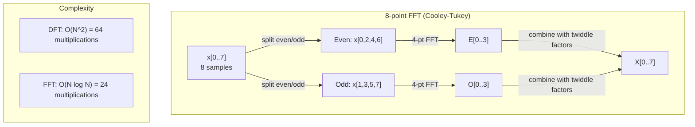
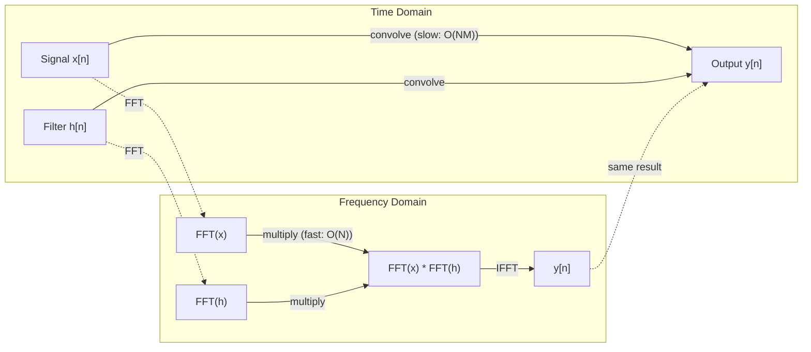

# 傅里叶变换

> 每个信号都是正弦波的总和。傅里叶变换可以告诉你哪些是正弦波。

**类型：** 构建
**语言：** Python
**先决条件：** 第一阶段，课程01-04，19（复数）
**时间：** 约90分钟

## 学习目标

- Implement the DFT from scratch and verify it against the O(N log N) Cooley-Tukey FFT
- Interpret frequency coefficients: extract amplitude, phase, and power spectrum from a signal
- Apply the convolution theorem to perform convolution via FFT multiplication
- Connect Fourier frequency decomposition to transformer positional encodings and CNN convolution layers

## 问题

音频记录是随时间变化的压力测量序列。股票价格是几天内的值序列。图像是空间上的像素强度网格。这些都是时间域（或空间域）中的数据。你看到的是随着某个索引变化的值。

但许多模式在时间域中是不可见的。这个音频信号是纯音还是和弦？这个股票价格是否有周周期？这个图像是否有重复的纹理？这些问题涉及频率内容，而时间域将其隐藏起来。

傅里叶变换将数据从时间域转换为频率域。它将信号分解为不同频率的正弦波。每个正弦波都有振幅（强度）和相位（起始位置）。傅里叶变换提供了这两个信息。

这对机器学习很重要，因为频率域思维无处不在。卷积神经网络执行卷积运算，这在频率域中相当于乘法。Transformer位置编码使用频率分解来表示位置。音频模型（语音识别、音乐生成）处理频谱图——声音的频率表示形式。时间序列模型寻找周期性模式。理解傅里叶变换为你提供了处理所有这些内容的词汇。

## 概念

### DFT definition

给定N个样本x[0], x[1], ..., x[N-1]，离散傅里叶变换产生N个频率系数X[0], X[1], ..., X[N-1]:

```
X[k] = sum_{n=0}^{N-1} x[n] * e^(-2*pi*i*k*n/N)

for k = 0, 1, ..., N-1
```

Each X[k] is a complex number. Its magnitude |X[k]| indicates the amplitude of frequency k. Its phase angle (X[k]) indicates the phase offset of that frequency.

The key insight: `e^(-2*pi*i*k*n/N)` represents a rotating phasor at frequency k. The DFT calculates the correlation between the signal and each of N equally-spaced frequencies. If the signal contains energy at frequency k, the correlation is high. If not, it is close to zero.

### 每个系数代表的含义

**X[0]: 直流分量。**这是所有样本的总和，与均值成正比。它代表了信号的恒定（零频）偏移量。

```
X[0] = sum_{n=0}^{N-1} x[n] * e^0 = sum of all samples
```

**X[k] for 1 <= k <= N/2: positive frequencies.** X[k] represents frequency k cycles per N samples. Higher k means higher frequency (faster oscillation).

**X[N/2]: the Nyquist frequency.** The highest frequency you can represent with N samples. Above this, you get aliasing -- high frequencies masquerading as low ones.

**X[k] for N/2 < k < N: negative frequencies.** For real-valued signals, X[N-k] = conj(X[k]). Negative frequencies are mirror images of the positive ones. This is why the useful information is in the first N/2 + 1 coefficients.

### Inverse DFT

逆DFT从频率系数中重建原始信号：

```
x[n] = (1/N) * sum_{k=0}^{N-1} X[k] * e^(2*pi*i*k*n/N)

for n = 0, 1, ..., N-1
```

与正向DFT的唯一区别是：指数中的符号为正（而非负），并且有一个1/N的归一化因子。

反向DFT是完全的重构。没有任何信息丢失。你可以无误差地从时域转换到频域，再返回。DFT是一种基变换——它以不同的坐标系统重新表达相同的信息。

### FFT：实现快速处理

如上定义的DFT算法需要O(N^2)的时间复杂度：对于N个输出系数，你需要对N个输入样本进行求和。当N为100万时，这相当于10^12次运算。

快速傅里叶变换（FFT）可以在O(N log N)的时间内计算出相同的结果。当N为100万时，这大约需要2000万次运算，而不是1万亿次。这就是频率分析具有实用性的原因。

Cooley-Tukey算法（最常见的FFT方法）通过分治策略工作：
1. 将信号分为偶数索引和奇数索引的样本。
2. 递归地计算每半部分的DFT。
3. 使用“twiddle因子”e^(-2*pi*i*k/N)合并两个半部分的DFT结果。

```
X[k] = E[k] + e^(-2*pi*i*k/N) * O[k]          for k = 0, ..., N/2 - 1
X[k + N/2] = E[k] - e^(-2*pi*i*k/N) * O[k]    for k = 0, ..., N/2 - 1

where E = DFT of even-indexed samples
      O = DFT of odd-indexed samples
```

对称性意味着每一层递归都执行O(N)的工作量，总共有log2(N)层。总时间为O(N log N)。



FFT要求信号长度必须是2的幂次。实际上，信号会被填充0以达到下一个2的幂次。

### 光谱分析

**功率谱**是|X[k]|^2——每个频率系数的平方幅度。它显示了每个频率处的能量大小。

**相位谱**是角度(X[k))——每个频率的相位偏移。对于大多数分析任务，你关注的是功率谱而忽略相位。

```
Power at frequency k:  P[k] = |X[k]|^2 = X[k].real^2 + X[k].imag^2
Phase at frequency k:  phi[k] = atan2(X[k].imag, X[k].real)
```

### 频率分辨率

DFT的频率分辨率取决于样本数量N和采样率fs。

```
Frequency of bin k:      f_k = k * fs / N
Frequency resolution:    delta_f = fs / N
Maximum frequency:       f_max = fs / 2  (Nyquist)
```

为了处理相邻的两个频率，你需要更多的样本。要捕捉高频率，你需要更高的采样率。

### 卷积定理

这是信号处理领域最重要的成果之一，与卷积神经网络直接相关。

时间域中的卷积等于频率域中的逐点乘法。

```
x * h = IFFT(FFT(x) . FFT(h))

where * is convolution and . is element-wise multiplication
```

为什么这很重要：

- 直接对长度为N和M的两个信号进行卷积需要O(N*M)次操作。
- 基于FFT的卷积需要O(N log N)次操作：先转换两个信号，然后相乘，再转换回来。
- 对于大型核矩阵，FFT卷积的速度要快得多。
- 这正是具有大接收域的卷积层中的情况。

注意：DFT计算的是循环卷积（信号会循环）。对于线性卷积（无循环），在计算之前需要将两个信号的长度填充为N + M - 1。



### 窗口化

DFT假设信号是周期性的——它将N个样本视为无限重复信号的一个周期。如果信号不是从同一值开始和结束，这会在边界处产生不连续性，表现为虚假的高频内容。这被称为频谱泄漏。

窗口技术通过在计算DFT之前将信号的两端逐渐衰减到零来减少泄漏。

常见窗口类型：

| 窗口类型 | 形状 | 主瓣宽度 | 旁瓣水平 | 应用场景 |
|----------|------|----------|----------|----------|
| 矩形窗口 | 平坦（无窗口） | 最窄 | 最高（-13 dB） | 当信号在N个样本中完全周期性时 |
| Hann窗口 | 升余弦 | 中等 | 低（-31 dB） | 通用频谱分析 |
| Hamming窗口 | 修改的余弦波 | 中等 | 较低（-42 dB） | 音频处理、语音分析 |
| Blackman窗口 | 三重余弦 | 宽 | 非常低（-58 dB） | 当旁瓣抑制至关重要时 |

```
Hann window:    w[n] = 0.5 * (1 - cos(2*pi*n / (N-1)))
Hamming window: w[n] = 0.54 - 0.46 * cos(2*pi*n / (N-1))
```

将窗口应用于DFT之前的信号，方法是将其逐元素与信号相乘：`X = DFT(x * w)`。

### DFT Properties

| 属性 | 时域 | 频域 |
|------|----|----|
| 线性性 | a*x + b*y | a*X + b*Y |
| 时间偏移 | x[n - k] | X[f] * e^(-2*pi*i*f*k/N) |
| 频率偏移 | x[n] * e^(2*pi*i*f0*n/N) | X[f - f0] |
| 卷积 | x * h | X * H（点乘） |
| 乘法 | x * h（点乘） | X * H（循环卷积，按1/N缩放） |
| 帕塞瓦尔定理 | sum \|x[n]\|^2 | (1/N) * sum \|X[k]\|^2 |
| 共轭对称性（实输入） | x[n] 实数 | X[k] = conj(X[N-k]) |

帕塞瓦尔定理表明，在两个域中总能量是相同的。通过变换，能量得以守恒。

### 连接位置编码

原始的Transformer使用正弦波位置编码：

```
PE(pos, 2i)   = sin(pos / 10000^(2i/d_model))
PE(pos, 2i+1) = cos(pos / 10000^(2i/d_model))
```

每对维度（2i，2i+1）以不同的频率振荡。这些频率从高维度（0,1）到低维度（最后几个维度）呈几何级数分布。这使得每个位置在所有频带中都有独特的模式——类似于傅里叶系数如何唯一标识一个信号。

这一特性带来的关键属性包括：

- **独特性：**没有两个位置具有相同的编码方式。
- **有限值范围：**sin和cos的值始终在[-1, 1]之间。
- **相对位置：**位置p+k的编码可以表示为位置p的编码的线性函数。模型可以学习到如何关注相对位置。

### 连接到卷积神经网络

卷积层通过将滤波器（核）滑动到信号或图像上，将其应用于输入。数学上，这就是卷积操作。

根据卷积定理，这相当于：
1. 对输入进行快速傅里叶变换（FFT）
2. 对核进行 FFT
3. 在频域中进行乘法
4. 对结果进行逆快速傅里叶变换（IFFT）

标准的 CNN 实现使用直接卷积（对于小型 3x3 核来说更快）。但对于大型核或全局卷积，基于 FFT 的方法明显更快。某些架构（如 FNet）完全用 FFT 替代注意力机制，以 O(N log N) 的复杂度实现与 O(N^2) 相当的准确率。

### Spectrograms and the Short-Time Fourier Transform

单次快速傅里叶变换可以给出整个信号的频率成分，但无法说明这些频率发生的具体时间。啁啾信号（频率随时间增加的信号）和同时存在的所有频率信号可以具有相同的幅度谱。

短时傅里叶变换通过计算信号的重叠窗口上的快速傅里叶变换来解决这一问题。结果是一个频谱图：一个二维表示，其中一个轴表示时间，另一个轴表示频率。每个点的强度显示了该时刻该频率处的能量。

```
STFT procedure:
1. Choose a window size (e.g., 1024 samples)
2. Choose a hop size (e.g., 256 samples -- 75% overlap)
3. For each window position:
   a. Extract the windowed segment
   b. Apply a Hann/Hamming window
   c. Compute FFT
   d. Store the magnitude spectrum as one column of the spectrogram
```

频谱图是音频机器学习模型的标准输入表示形式。语音识别模型（如Whisper、DeepSpeech）基于梅尔频谱图进行工作——这种频谱图将频率映射到梅尔音阶上，更符合人类的声音感知方式。

### aliasing

如果信号包含高于fs/2（奈奎斯特频率）的频率，以fs的采样率进行采样将会产生混叠副本。一个90赫兹的信号以100赫兹的采样率采样时，看起来与10赫兹的信号相同。仅通过样本无法区分它们。

```
Example:
  True signal: 90 Hz sine wave
  Sampling rate: 100 Hz
  Apparent frequency: 100 - 90 = 10 Hz

  The samples from the 90 Hz signal at 100 Hz sampling rate
  are identical to the samples from a 10 Hz signal.
  No amount of math can recover the original 90 Hz.
```

This is why analog-to-digital converters include anti-aliasing filters that remove frequencies above Nyquist before sampling. In machine learning, aliasing occurs when downsampling feature maps without proper low-pass filtering—some architectures address this with anti-aliased pooling layers.

### 零填充不会提高分辨率。

一个常见的误解是：在快速傅里叶变换之前对信号进行零填充可以提高频率分辨率。实际上并非如此。零填充只是在现有的频率区间之间插值，使得频谱看起来更平滑。但它无法揭示原始样本中不存在的频率细节。

真正的频率分辨率仅取决于观测时间T = N / fs。要分辨两个相差delta_f的频率，至少需要T = 1 / delta_f秒的数据。无论进行多少次零填充，都无法改变这一基本限制。

```figure
fourier-synthesis
```

## 构建它

### 步骤1：从零开始进行DFT计算

O(N^2)的DFT直接源自其定义。

```python
import math

class Complex:
    ...

def dft(x):
    N = len(x)
    result = []
    for k in range(N):
        total = Complex(0, 0)
        for n in range(N):
            angle = -2 * math.pi * k * n / N
            w = Complex(math.cos(angle), math.sin(angle))
            xn = x[n] if isinstance(x[n], Complex) else Complex(x[n])
            total = total + xn * w
        result.append(total)
    return result
```

### 步骤2：逆DFT

相同结构，正指数，除以N。

```python
def idft(X):
    N = len(X)
    result = []
    for n in range(N):
        total = Complex(0, 0)
        for k in range(N):
            angle = 2 * math.pi * k * n / N
            w = Complex(math.cos(angle), math.sin(angle))
            total = total + X[k] * w
        result.append(Complex(total.real / N, total.imag / N))
    return result
```

### 步骤3：FFT（Cooley-Tukey）

递归FFT需要2的幂长度。将其分为偶数和奇数部分，进行递归处理，然后与旋转因子结合。

```python
def fft(x):
    N = len(x)
    if N <= 1:
        return [x[0] if isinstance(x[0], Complex) else Complex(x[0])]
    if N % 2 != 0:
        return dft(x)

    even = fft([x[i] for i in range(0, N, 2)])
    odd = fft([x[i] for i in range(1, N, 2)])

    result = [Complex(0)] * N
    for k in range(N // 2):
        angle = -2 * math.pi * k / N
        twiddle = Complex(math.cos(angle), math.sin(angle))
        t = twiddle * odd[k]
        result[k] = even[k] + t
        result[k + N // 2] = even[k] - t
    return result
```

### 步骤4：光谱分析辅助工具

```python
def power_spectrum(X):
    return [xk.real ** 2 + xk.imag ** 2 for xk in X]

def convolve_fft(x, h):
    N = len(x) + len(h) - 1
    padded_N = 1
    while padded_N < N:
        padded_N *= 2

    x_padded = x + [0.0] * (padded_N - len(x))
    h_padded = h + [0.0] * (padded_N - len(h))

    X = fft(x_padded)
    H = fft(h_padded)

    Y = [xk * hk for xk, hk in zip(X, H)]

    y = idft(Y)
    return [y[n].real for n in range(N)]
```

## 使用它

对于实际工作，应使用由高度优化的C库支持的numpy的FFT。

```python
import numpy as np

signal = np.sin(2 * np.pi * 5 * np.arange(256) / 256)
spectrum = np.fft.fft(signal)
freqs = np.fft.fftfreq(256, d=1/256)

power = np.abs(spectrum) ** 2

positive_freqs = freqs[:len(freqs)//2]
positive_power = power[:len(power)//2]
```

用于窗口化和更高级的频谱分析：

```python
from scipy.signal import windows, stft

window = windows.hann(256)
windowed = signal * window
spectrum = np.fft.fft(windowed)
```

用于卷积：

```python
from scipy.signal import fftconvolve

result = fftconvolve(signal, kernel, mode='full')
```

对于频谱图：

```python
from scipy.signal import stft

frequencies, times, Zxx = stft(signal, fs=sample_rate, nperseg=256)
spectrogram = np.abs(Zxx) ** 2
```

频谱矩阵的形状为(n_frequencies, n_time_frames)。每一列表示一个时间窗口内的功率谱。这就是音频机器学习模型使用的输入数据。

## 发货

运行 `code/fourier.py` 以生成 `outputs/prompt-spectral-analyzer.md`。

## 练习

1. **Pure tone identification.** Create a signal with a single sine wave at an unknown frequency (between 1 and 50 Hz), sampled at 128 Hz for 1 second. Use your DFT to identify the frequency. Verify that the answer is correct. Now add Gaussian noise with a standard deviation of 0.5 and repeat. How does the noise affect the spectrum?

2. **FFT vs DFT verification.** Generate a random signal of length 64. Calculate both the DFT (O(N^2)) and FFT. Verify that all coefficients match within 1e-10. Compare the two functions for signals with lengths 256, 512, 1024, and 2048. Plot the ratio of DFT time to FFT time.

3. **Convolution theorem proof by example.** Create a signal x = [1, 2, 3, 4, 0, 0, 0, 0] and a filter h = [1, 1, 1, 0, 0, 0, 0, 0]. Calculate their circular convolution directly (using nested loops). Then calculate it using the FFT (transform, multiply, inverse transform). Verify that the results are consistent. Now perform linear convolution by appropriate zero-padding.

4. **Windowing effects.** Create a signal that is the sum of two sine waves at 10 Hz and 12 Hz (very close). Sample at 128 Hz for 1 second. Calculate the power spectrum using no window, Hann window, and Hamming window. Which window makes it easiest to distinguish between the two peaks? Why?

5. **Positional encoding analysis.** Generate sinusoidal positional encodings for d_model = 128 and max_pos = 512. For each pair of positions (p1, p2), calculate the dot product of their encodings. Show that the dot product depends only on |p1 - p2|, not on the absolute positions. What happens to the dot product as the distance between p1 and p2 increases?

## | 关键词 | 翻译 |

| 术语 | 含义 |
|------|-----|
| DFT（离散傅里叶变换） | 将N个时域样本转换为N个频域系数。每个系数表示与该频率的复正弦波的相关性 |
| FFT（快速傅里叶变换） | 一种O(N log N)算法，用于计算DFT。Cooley-Tukey算法递归地分割偶数/奇数索引 |
| 逆DFT | 从频域系数重构时域信号。公式与DFT相同，但指数符号相反且缩放比例为1/N |
| 频率区间 | DFT输出中的每个索引k代表频率k*fs/N赫兹。“区间”是离散的频率槽位 |
| 直流分量 | X[0]，零频率系数。与信号均值成正比 |
| 奈奎斯特频率 | fs/2，采样率fs下可表示的最大频率。高于此频率的频谱被视为低频率 |
| 功率谱 | \|X[k]\|^2，每个频域系数的平方幅度。显示频率上的能量分布 |
| 相位谱 | angle(X[k])，每个频域分量的相位偏移。在分析中常被忽略 |
| 频谱泄漏 | 由于将非周期性信号视为周期性信号而产生的虚假频率内容。通过窗口化减少 |
| 窗函数 | 在DFT之前应用的锥形函数（Hann、Hamming、Blackman），以减少频谱泄漏 |
| Twiddle因子 | 用于FFT计算中组合子DFTs的复指数e^(-2*pi*i*k/N) |
| 卷积定理 | 时域中的卷积等于频域中的逐点乘法。是信号处理和CNN的基础 |
| 循环卷积 | 信号绕圈进行的卷积。这是DFT自然计算的类型 |
| 线性卷积 | 没有绕圈的标准卷积。通过在DFT前进行零填充实现 |
| 帕塞瓦尔定理 | 总能量通过傅里叶变换保持不变。sum \|x[n]\|^2 = (1/N) sum \|X[k]\|^2 |
| 混叠 | 当奈奎斯特以上的频率由于采样率不足而表现为低频率时发生 |

## 更多阅读资料

- [Cooley & Tukey: An Algorithm for the Machine Calculation of Complex Fourier Series (1965)] - 该论文改变了计算领域，是原始的快速傅里叶变换研究。
- [3Blue1Brown: But what is the Fourier Transform?] - 关于傅里叶变换的最佳视觉介绍。
- [Lee-Thorp et al.: FNet: Mixing Tokens with Fourier Transforms (2021)] - 在Transformer中用快速傅里叶变换替代自注意力机制。
- [Smith: The Scientist and Engineer's Guide to Digital Signal Processing] - 免费在线教科书，深入讲解快速傅里叶变换、窗口技术和频谱分析。
- [Vaswani et al.: Attention Is All You Need (2017)] - 基于傅里叶频率分解的正弦位置编码方法。
- [Radford et al.: Whisper (2022)] - 使用梅尔谱图作为输入表示的语音识别技术。
