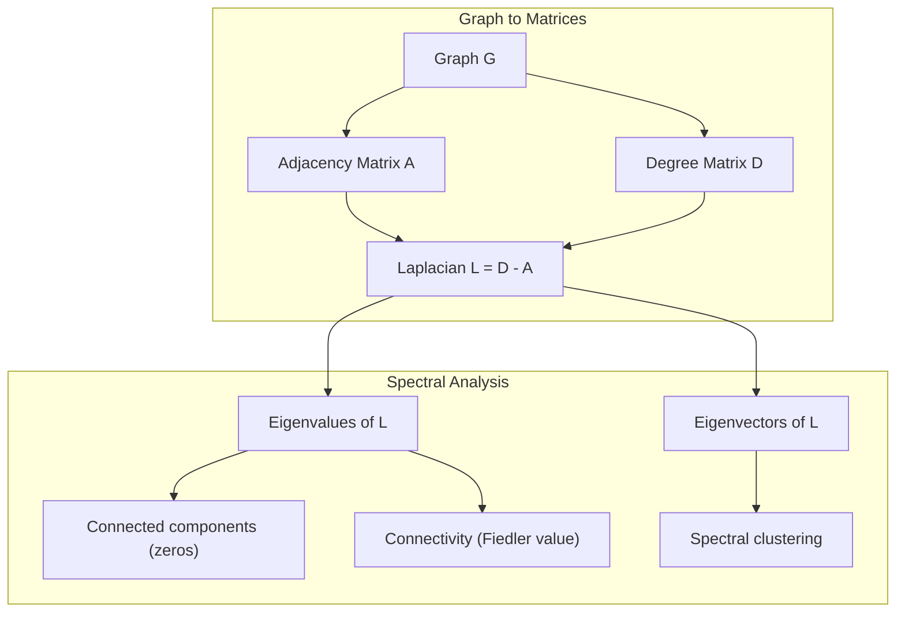
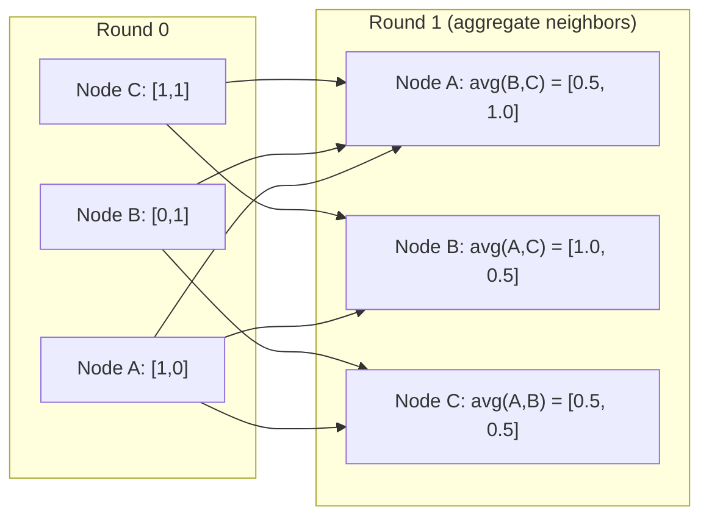

# 图论在机器学习中的应用

图是表示关系的数据结构。如果你的数据具有连接性，那么你需要学习图论。

**类型：**构建
**语言：**Python
**先决条件：**第一阶段，课程01-03（线性代数、矩阵）
**时间：**约90分钟

## 学习目标

- Build a graph class with adjacency matrix/list representations and implement BFS and DFS traversals
- Compute the graph Laplacian and use its eigenvalues to detect connected components and cluster nodes
- Implement one round of GNN-style message passing as a normalized adjacency matrix multiplication
- Apply spectral clustering to partition a graph using the Fiedler vector

## 问题

社交网络、分子、知识库、引用网络、路线图——所有这些都是图。传统的机器学习将数据视为扁平的表格，每一行都是独立的，每个特征都是一个列。但当连接结构变得重要时，表格就无法发挥作用。

以社交网络为例。你想预测用户会购买什么产品。他们的购买历史很重要，但朋友们的购买历史更为重要。这些连接传递着信号。

再考虑一个分子。你希望预测它是否会与蛋白质结合。原子很重要，但实际上更重要的是原子之间的连接方式。结构是数据。

图神经网络是深度学习中最快速发展的领域。它们用于药物发现、社交推荐、欺诈检测以及知识图谱推理。每个图神经网络都基于同一个基础：基本图论。

你需要四样东西：
1. 一种将图表示为矩阵的方法（这样你可以进行乘法运算）
2. 遍历算法来探索图结构
3. 拉普拉斯矩阵——谱图理论中最重要的矩阵
4. 消息传递——使图神经网络工作的操作

## 概念

### 图：节点和边

图 G = (V, E) 由顶点（节点）V和边E组成。每条边连接两个节点。

**有向与无向。**在无向图中，边(u, v)表示u连接到v且v也连接到u。在有向图（有向图）中，边(u, v)表示u指向v，但不一定相反。

**带权与不带权。**在不带权图中，边要么存在要么不存在。在带权图中，每条边都有一个数值权重——距离、成本或强度。

| 图类型 | 示例 |
|---------|-----|
| 无向、不带权 | Facebook友谊网络 |
| 有向、不带权 | Twitter关注网络 |
| 无向、带权 | 道路地图（距离） |
| 有向、带权 | 网页链接（PageRank分数） |

### Adjacency Matrix

邻接矩阵A是核心表示形式。对于具有n个节点的图：

```
A[i][j] = 1    if there is an edge from node i to node j
A[i][j] = 0    otherwise
```

对于无向图，A 是对称的：A[i][j] = A[j][i]。对于有向图，A[i][j] = 边 (i, j) 的权重。

**示例——一个三角形：**

```
Nodes: 0, 1, 2
Edges: (0,1), (1,2), (0,2)

A = [[0, 1, 1],
     [1, 0, 1],
     [1, 1, 0]]
```

邻接矩阵是每个GNN的输入。对A进行的矩阵操作对应于对图的操作。

### 学位

节点的度是指与其相连的边数。对于有向图，有入度（进入的边）和出度（离开的边）。

度矩阵D是对角矩阵：

```
D[i][i] = degree of node i
D[i][j] = 0    for i != j
```

对于三角形示例：D = diag(2, 2, 2)，因为每个节点都连接到另外两个节点。

度数可以反映节点的重要性。高度数表示节点是中心节点。网络的度分布揭示了其结构。社交网络遵循幂律（少数中心节点，许多边缘节点）。随机图的度数服从泊松分布。

### BFS and DFS are two popular algorithms used in computer science for traversing graphs or trees.

两种基本的图遍历算法。你需要两者都掌握。

**广度优先搜索（BFS）：** 先探索所有邻居节点，然后探索这些邻居节点的邻居节点。使用队列（先进先出）。

```
BFS from node 0:
  Visit 0
  Queue: [1, 2]        (neighbors of 0)
  Visit 1
  Queue: [2, 3]        (add neighbors of 1)
  Visit 2
  Queue: [3]           (neighbors of 2 already visited)
  Visit 3
  Queue: []            (done)
```

BFS用于在未加权图中寻找最短路径。从起点到任何节点的距离等于该节点首次被发现的BFS层次。这就是为什么在社交网络中使用BFS来计算跳数距离的原因。

**深度优先搜索（DFS）：**在回溯之前尽可能深入探索。使用栈（后进先出）或递归。

```
DFS from node 0:
  Visit 0
  Stack: [1, 2]        (neighbors of 0)
  Visit 2               (pop from stack)
  Stack: [1, 3]         (add neighbors of 2)
  Visit 3               (pop from stack)
  Stack: [1]
  Visit 1               (pop from stack)
  Stack: []             (done)
```

DFS 适用于以下场景：
- 查找连通分量（从未访问过的节点开始执行 DFS）
- 检测循环（DFS 树中的回边）
- 拓扑排序（反转 DFS 的完成顺序）

| 算法 | 数据结构 | 功能 | 用例 |
|-----------|---------------|-------|----------|
| BFS | 队列 | 最短路径 | 社交网络距离、知识图谱遍历 |
| DFS | 栈 | 连通分量、循环 | 连通性检测、拓扑排序 |

### 图拉普拉斯算子

L = D - A。这是谱图理论中最重要的矩阵。

对于三角形：

```
D = [[2, 0, 0],    A = [[0, 1, 1],    L = [[2, -1, -1],
     [0, 2, 0],         [1, 0, 1],         [-1, 2, -1],
     [0, 0, 2]]         [1, 1, 0]]         [-1, -1,  2]]
```

拉普拉斯算子具有显著的特性：

1. **拉普拉斯算子是半正定的。**所有特征值都大于等于0。

2. **零特征值的个数等于连通分量的数量。**连通图恰好有一个零特征值。有3个断开分量的图有三个零特征值。

3. **最小的非零特征值（Fiedler值）衡量了网络的连通性。**较大的Fiedler值意味着网络连接良好。较小的Fiedler值则表明网络存在弱点——即瓶颈。

4. **Fiedler值的特征向量（Fiedler向量）揭示了最佳的分组方式。**正值节点属于一组，负值节点属于另一组。这就是谱聚类。



### 光谱特性

邻接矩阵和拉普拉斯矩阵的特征值揭示了无需遍历即可获得的结构特性。

**谱聚类**的工作原理如下：
1. 计算拉普拉斯矩阵L
2. 找到L中最小的k个特征向量（对于连通图，第一个全一向量可以跳过）
3. 将这些特征向量作为每个节点的新坐标
4. 在这些坐标上运行k均值算法

为什么这种方法有效？L的特征向量编码了图中“最平滑”的函数。连接良好的节点具有相似的特征向量值，而被瓶颈隔开的节点则具有不同的特征值。特征向量自然地将簇分开。

**随机游走连接。**归一化的拉普拉斯矩阵与图上的随机游走相关。随机游走的稳态分布与节点的度成正比。混合时间（游走收敛的速度）取决于谱间隙。

### 消息传递

图神经网络的核心操作。每个节点收集其邻居节点的消息，对这些消息进行汇总，并更新自身的状态。

```
h_v^(k+1) = UPDATE(h_v^(k), AGGREGATE({h_u^(k) : u in neighbors(v)}))
```

In the simplest form, AGGREGATE equals mean, and UPDATE equals linear transformation plus activation:

```
h_v^(k+1) = sigma(W * mean({h_u^(k) : u in neighbors(v)}))
```

This is matrix multiplication disguised as something else. If H is the matrix containing all node features, and A is the adjacency matrix:

```
H^(k+1) = sigma(A_norm * H^(k) * W)
```

其中，Anormed是标准化邻接矩阵（每行之和为1）。

一轮消息传递让每个节点“看到”其直接邻居。两轮则让其看到邻居的邻居。K轮为每个节点提供来自其K跳邻域的信息。



### 概念与机器学习应用

| 概念 | 机器学习应用 |
|------|-------------|
| 邻接矩阵 | GNN输入表示 |
| 图拉普拉斯算子 | 谱聚类，社区检测 |
| BFS/DFS | 知识图谱遍历，路径查找 |
| 度分布 | 节点重要性，特征工程 |
| 消息传递 | GNN层（GCN，GAT，GraphSAGE） |
| L的特征值 | 社区检测，图划分 |
| 谱聚类 | 无监督节点分组 |
| PageRank | 节点重要性，网络搜索 |

```figure
graph-degree-distribution
```

## 构建它

### 步骤1：从零开始创建图类

```python
class Graph:
    def __init__(self, n_nodes, directed=False):
        self.n = n_nodes
        self.directed = directed
        self.adj = {i: {} for i in range(n_nodes)}

    def add_edge(self, u, v, weight=1.0):
        self.adj[u][v] = weight
        if not self.directed:
            self.adj[v][u] = weight

    def neighbors(self, node):
        return list(self.adj[node].keys())

    def degree(self, node):
        return len(self.adj[node])

    def adjacency_matrix(self):
        import numpy as np
        A = np.zeros((self.n, self.n))
        for u in range(self.n):
            for v, w in self.adj[u].items():
                A[u][v] = w
        return A

    def degree_matrix(self):
        import numpy as np
        D = np.zeros((self.n, self.n))
        for i in range(self.n):
            D[i][i] = self.degree(i)
        return D

    def laplacian(self):
        return self.degree_matrix() - self.adjacency_matrix()
```

邻接列表（`self.adj`）能够高效地存储邻居节点。由于所有谱运算都需要，因此使用numpy进行邻接矩阵转换。

### 步骤2：广度优先搜索和深度优先搜索

```python
from collections import deque

def bfs(graph, start):
    visited = set()
    order = []
    distances = {}
    queue = deque([(start, 0)])
    visited.add(start)
    while queue:
        node, dist = queue.popleft()
        order.append(node)
        distances[node] = dist
        for neighbor in graph.neighbors(node):
            if neighbor not in visited:
                visited.add(neighbor)
                queue.append((neighbor, dist + 1))
    return order, distances


def dfs(graph, start):
    visited = set()
    order = []
    stack = [start]
    while stack:
        node = stack.pop()
        if node in visited:
            continue
        visited.add(node)
        order.append(node)
        for neighbor in reversed(graph.neighbors(node)):
            if neighbor not in visited:
                stack.append(neighbor)
    return order
```

BFS uses a deque (double-ended queue) for O(1) popleft operation. DFS uses a list as a stack. Both methods ensure that each node is visited exactly once, taking O(V + E) time.

### 步骤3：连通组件和拉普拉斯特征值

```python
def connected_components(graph):
    visited = set()
    components = []
    for node in range(graph.n):
        if node not in visited:
            order, _ = bfs(graph, node)
            visited.update(order)
            components.append(order)
    return components


def laplacian_eigenvalues(graph):
    import numpy as np
    L = graph.laplacian()
    eigenvalues = np.linalg.eigvalsh(L)
    return eigenvalues
```

`eigvalsh` is used for symmetric matrices – the Laplacian is always symmetric for undirected graphs. It returns eigenvalues in ascending order. Count the zeros to determine the number of connected components.

### 步骤4：光谱聚类

```python
def spectral_clustering(graph, k=2):
    import numpy as np
    L = graph.laplacian()
    eigenvalues, eigenvectors = np.linalg.eigh(L)
    features = eigenvectors[:, 1:k+1]

    labels = np.zeros(graph.n, dtype=int)
    for i in range(graph.n):
        if features[i, 0] >= 0:
            labels[i] = 0
        else:
            labels[i] = 1
    return labels
```

当k=2时，Fiedler向量的符号将图分为两个簇。当k>2时，您需要对前k个特征向量进行k均值聚类（不包括平凡的全一特征向量）。

### 步骤5：消息传递

```python
def message_passing(graph, features, weight_matrix):
    import numpy as np
    A = graph.adjacency_matrix()
    row_sums = A.sum(axis=1, keepdims=True)
    row_sums[row_sums == 0] = 1
    A_norm = A / row_sums
    aggregated = A_norm @ features
    output = aggregated @ weight_matrix
    return output
```

这是一轮GNN消息传递。每个节点的新特征是其邻居特征的加权平均值，经过权重矩阵的转换。通过多轮传递来进一步传播信息。

## 使用它

使用 Networkx 和 numpy，相同的操作可以用一行代码完成：

```python
import networkx as nx
import numpy as np

G = nx.karate_club_graph()

A = nx.adjacency_matrix(G).toarray()
L = nx.laplacian_matrix(G).toarray()

eigenvalues = np.linalg.eigvalsh(L.astype(float))
print(f"Smallest eigenvalues: {eigenvalues[:5]}")
print(f"Connected components: {nx.number_connected_components(G)}")

communities = nx.community.greedy_modularity_communities(G)
print(f"Communities found: {len(communities)}")

pr = nx.pagerank(G)
top_nodes = sorted(pr.items(), key=lambda x: x[1], reverse=True)[:5]
print(f"Top 5 PageRank nodes: {top_nodes}")
```

NetworkX handles graphs of any size with optimized C backend. Use it in production. Use your own from-scratch implementation to understand how it works.

### numpy spectral analysis

```python
import numpy as np

A = np.array([
    [0, 1, 1, 0, 0],
    [1, 0, 1, 0, 0],
    [1, 1, 0, 1, 0],
    [0, 0, 1, 0, 1],
    [0, 0, 0, 1, 0]
])

D = np.diag(A.sum(axis=1))
L = D - A

eigenvalues, eigenvectors = np.linalg.eigh(L)
print(f"Eigenvalues: {np.round(eigenvalues, 4)}")
print(f"Fiedler value: {eigenvalues[1]:.4f}")
print(f"Fiedler vector: {np.round(eigenvectors[:, 1], 4)}")

fiedler = eigenvectors[:, 1]
group_a = np.where(fiedler >= 0)[0]
group_b = np.where(fiedler < 0)[0]
print(f"Cluster A: {group_a}")
print(f"Cluster B: {group_b}")
```

Fiedler向量承担了主要任务。一个簇中包含正值，另一个簇中包含负值。无需迭代优化——只需进行一次特征分解即可。

## 发货

本课程将生成以下文件：
- `outputs/skill-graph-analysis.md` -- 用于分析图结构数据的技能参考文档

## 连接

| 概念 | 出现位置 |
|------|----------|
| 邻接矩阵 | GCN、GAT、GraphSAGE输入 |
| 拉普拉斯算子 | 谱聚类、ChebNet滤波器 |
| BFS | 知识图谱遍历、最短路径查询 |
| 消息传递 | 每个GNN层、神经消息传递 |
| 谱间隙 | 图连通性、随机游走混合时间 |
| 度分布 | 幂律网络、节点特征工程 |
| 连通分量 | 预处理、处理断开的图 |
| PageRank | 节点重要性排序、注意力初始化 |

GNNs值得特别提及。GCN中的图卷积操作（Kipf & Welling, 2017）使用添加了自环的邻接矩阵，A_hat = A + I：

```text
H^(l+1) = sigma(D_hat^(-1/2) * A_hat * D_hat^(-1/2) * H^(l) * W^(l))
```

where A_hat = A + I (adjacency plus self-loops) and D_hat is the degree matrix of A_hat. Self-loops ensure that each node includes its own features during aggregation. This is exactly message passing with symmetric normalization. D_hat^(-1/2) * A_hat * D_hat^(-1/2) is the normalized adjacency matrix. The Laplacian appears because this normalization is related to L_sym = I - D^(-1/2) * A * D^(-1/2). Understanding the Laplacian means understanding why GCNs work.

## 练习

1. **Implement PageRank from scratch.** Start with uniform scores. At each step: score(v) = (1-d)/n + d * sum(score(u)/out_degree(u)) for all u pointing to v. Use d=0.85. Run until convergence (change < 1e-6). Test on a small web graph.

2. **Find communities using spectral clustering.** Create a graph with two clearly separated clusters (e.g., two cliques connected by a single edge). Run spectral clustering and verify it finds the right split. What happens as you add more cross-cluster edges?

3. **Implement Dijkstra's algorithm** for shortest paths in weighted graphs. Compare results to BFS on the same graph with uniform weights.

4. **Build a 2-layer message passing network.** Apply message passing twice with different weight matrices. Show that after 2 rounds, each node has information from its 2-hop neighborhood.

5. **Analyze a real-world graph.** Use the Karate Club graph (34 nodes, 78 edges). Compute degree distribution, Laplacian eigenvalues, and spectral clustering. Compare the spectral clustering result to the known ground truth split.

## | 关键词 | 翻译 |

| 术语 | 人们怎么说 | 实际含义 |
|------|------------|----------|
| 图 | “节点和边” | 一种数学结构 G=(V,E)，编码成对关系 |
| 邻接矩阵 | “连接表” | 一个 n x n 矩阵，其中 A[i][j] = 1 表示节点 i 和 j 相连 |
| 度 | “节点的连通程度” | 与节点接触边的数量 |
| 拉普拉斯矩阵 | “D 减去 A” | L = D - A，其特征值揭示了图的结构 |
| 菲德勒值 | “代数连通性” | L 的最小非零特征值，衡量图的连通程度 |
| BFS | “逐层搜索” | 在深入之前先访问所有邻居的遍历方式，找到最短路径 |
| DFS | “先深入” | 沿着一条路径到达终点后再回溯的遍历方式 |
| 消息传递 | “节点与邻居交流” | 每个节点汇总来自其邻居的信息，这是 GNNs 的核心功能 |
| 谱聚类 | “通过特征向量进行聚类” | 使用拉普拉斯矩阵的特征向量对图进行划分 |
| 连通分量 | “独立的片段” | 一个最大子图，其中每个节点都能到达其他所有节点 |

## 更多阅读资料

- **Kipf & Welling (2017)** -- 《使用图卷积网络的半监督分类》。这篇论文开启了现代图神经网络的研究。它表明，谱图卷积可以简化为消息传递。
- **Spielman (2012)** -- 《谱图理论》讲义。关于拉普拉斯算子、谱间隙和图划分的权威介绍。
- **Hamilton (2020)** -- 《图表示学习》。一书涵盖了从基础到应用的图神经网络内容。
- **Bronstein et al. (2021)** -- 《几何深度学习：网格、群、图、测地线和测量仪》。统一框架的论文。
- **Veličković et al. (2018)** -- 《图注意力网络》。通过注意力机制扩展消息传递。
