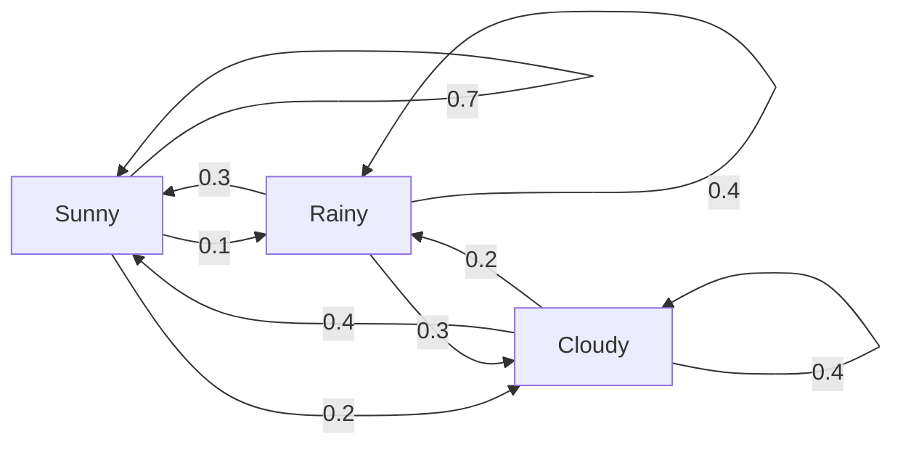
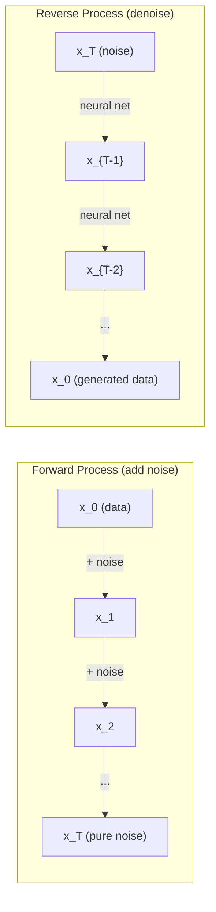

# 随机过程

具有结构的随机性。随机游走、马尔可夫链和扩散模型背后的数学原理。

**类型：** 学习
**语言：** Python
**先决条件：** 第一阶段，课程06-07（概率论，贝叶斯定理）
**时间：** 约75分钟

## 学习目标

- Simulate 1D and 2D random walks and verify the sqrt(n) scaling of displacement  
- Build a Markov chain simulator and compute its stationary distribution via eigendecomposition  
- Implement Metropolis-Hastings MCMC and Langevin dynamics for sampling from target distributions  
- Connect the forward diffusion process to Brownian motion and explain how the reverse process generates data

## 问题

许多人工智能系统涉及随时间演变的随机性。这不是静态的随机性——而是结构化的、序列性的随机性，其中每一步都依赖于前一步的结果。

语言模型一次生成一个标记。每个标记都取决于之前的上下文。模型输出一个概率分布，从中抽取样本，然后继续下一步。这是一个随机过程。

扩散模型逐步向图像添加噪声，直到它变成纯静态的。然后他们逆转这个过程，逐步去噪，直到出现新的图像。正向过程是马尔可夫链。反向过程是一个反向运行的学习到的马尔可夫链。

强化学习代理在环境中采取行动。每个行动以一定的概率导致一个新的状态。代理在一个随机的世界中遵循随机策略。整个过程是一个马尔可夫决策过程。

MCMC抽样——贝叶斯推断的支柱——构建了一个其平稳分布为你想要抽样的后验的马尔可夫链。

所有这些都基于四个基础理念：
1. 随机游走——最简单的随机过程
2. 马尔可夫链——具有转移矩阵的结构化随机性
3. 朗之万动力学——带噪声的梯度下降
4. Metropolis-Hastings——从任何分布中抽样

## 概念

### 随机游走

从位置0开始。每一步，都掷一枚公平的硬币。正面：向右移动（+1）。反面：向左移动（-1）。

经过n步后，你的位置是n个随机的+/-1值之和。预期位置为0（这种行走是无偏的）。但距离原点的预期距离会随着sqrt(n)的增长而增大。

这有些违反直觉。这种行走是公平的——没有向任一方向的偏移。但随着时间的推移，它会越来越远离起始点。n步后的标准差为sqrt(n)。

```
Step 0:  Position = 0
Step 1:  Position = +1 or -1
Step 2:  Position = +2, 0, or -2
...
Step 100: Expected distance from origin ~ 10 (sqrt(100))
Step 10000: Expected distance from origin ~ 100 (sqrt(10000))
```

在二维空间中，行走以相等的概率向上、向下、向左或向右移动。距离原点的距离也遵循相同的sqrt(n)缩放规则。路径呈现出类似分形的模式。

**为什么是sqrt(n)？** 每一步以相等的概率为+1或-1。经过n步后，位置S_n = X_1 + X_2 + ... + X_n，其中每个X_i为±1。每步的方差为1，且步骤相互独立，因此Var(S_n) = n。标准差=sqrt(n)。根据中心极限定理，S_n / sqrt(n)收敛于标准正态分布。

这种sqrt(n)缩放规则在机器学习中随处可见。SGD的噪声按1/sqrt(batch_size)缩放。嵌入维度按sqrt(d)缩放。平方根是独立随机加法的特征。

**与布朗运动的联系。** 以步长为1/sqrt(n)进行随机行走，每单位时间走n步。当n趋于无穷大时，行走收敛于布朗运动B(t)——一个连续时间过程，其中B(t)服从均值为0、方差为t的标准正态分布。

布朗运动是扩散的数学基础。它模拟了流体中粒子的随机摆动、股票价格的波动，以及——至关重要地——扩散模型中的噪声过程。

**赌徒的破产。** 一个从位置k开始的随机行走者，在0和N处有吸收屏障。在0之前到达N的概率是多少？对于公平行走：P(reach N) = k/N。这非常简单而优雅。它涉及到鞅理论——公平随机行走是一种鞅（预期未来价值等于当前价值）。

### 马尔可夫链

马尔可夫链是一种根据固定概率在状态之间转换的系统。其关键特性是：下一个状态仅取决于当前状态，而不依赖于历史信息。

```
P(X_{t+1} = j | X_t = i, X_{t-1} = ...) = P(X_{t+1} = j | X_t = i)
```

这就是马尔可夫性质。它意味着你可以使用转移矩阵P来描述整个动态过程：

```
P[i][j] = probability of going from state i to state j
```

每行P的总和必须为1（你必须到达某个地方）。

**示例——天气：**

```
States: Sunny (0), Rainy (1), Cloudy (2)

P = [[0.7, 0.1, 0.2],    (if sunny: 70% sunny, 10% rainy, 20% cloudy)
     [0.3, 0.4, 0.3],    (if rainy: 30% sunny, 40% rainy, 30% cloudy)
     [0.4, 0.2, 0.4]]    (if cloudy: 40% sunny, 20% rainy, 40% cloudy)
```

Starting from any state, after many transitions, the distribution of states converges to the stationary distribution pi, where pi * P = pi. This is the left eigenvector of P with eigenvalue 1.

For the weather chain, the stationary distribution might be [0.53, 0.18, 0.29] – over the long run, it is sunny 53% of the time, regardless of the starting state.



**计算稳态分布。**有两种方法：

1. **幂法**：将任意初始分布重复乘以P。经过足够多的迭代后，它会收敛。
2. **特征值法**：找到具有特征值1的P的左特征向量。这是具有特征值1的P^T的特征向量。

这两种方法都要求链满足收敛条件。

**收敛条件。**如果马尔可夫链满足以下条件，则收敛到唯一的稳态分布：
- **不可约**：每个状态都可以从其他所有状态到达
- **非周期**：链不会以固定周期循环

你在机器学习中遇到的大多数链都满足这两个条件。

**吸收状态。**如果一个状态一旦进入就永远无法离开（P[i][i] = 1），则该状态为吸收状态。吸收马尔可夫链模拟具有终端状态的过程——一个结束的游戏、一个流失的顾客、一个到达文本末尾的令牌序列。

**混合时间。**需要多少步骤才能使链“接近”稳态分布？正式地说，是需要多少步骤才能使稳态的总变异距离降至某个阈值以下。快速混合意味着需要的步骤较少。P的谱间隙（1减去第二大特征值）控制着混合时间。较大的间隙意味着更快的混合。

### 与语言模型的连接

在语言模型中，令牌生成近似于马尔可夫过程。根据当前上下文，模型输出下一个令牌的分布。温度参数控制其锐度：

```
P(token_i) = exp(logit_i / temperature) / sum(exp(logit_j / temperature))
```

- 温度 = 1.0：标准分布
- 温度 < 1.0：更尖锐（更具确定性）
- 温度 > 1.0：更平坦（更随机）
- 温度 -> 0：argmax（贪婪）

Top-k采样会截断为概率最高的k个标记。Top-p（核心）采样则截断为累积概率超过p的最小标记集。这两种方法都会修改马尔可夫转移概率。

### 布朗运动

连续时间下的随机游走极限。位置B(t)具有三个特性：
1. B(0) = 0
2. B(t) - B(s)服从均值为0、方差为t - s的正态分布（当t > s时）
3.非重叠区间上的增量是独立的

布朗运动虽然是连续的，但不可微——它在任何尺度上都会波动。该路径在平面上的分形维数为2。

在离散模拟中，通过以下方式近似布朗运动：

```
B(t + dt) = B(t) + sqrt(dt) * z,    where z ~ N(0, 1)
```

sqrt(dt)的缩放非常重要。它源自应用于随机游走的中心极限定理。

### Langevin Dynamics

梯度下降法用于寻找函数的最小值。Langevin动力学则找到与exp(-U(x)/T)成正比的概率分布，其中U是能量函数，T是温度。

```
x_{t+1} = x_t - dt * gradient(U(x_t)) + sqrt(2 * T * dt) * z_t
```

Two forces act on the particle:
1. **Gradient force** (-dt * gradient(U)): pushes toward low energy (like gradient descent)
2. **Random force** (sqrt(2*T*dt) * z): pushes in random directions (exploration)

At temperature T = 0, this is pure gradient descent. At high temperature, it is nearly a random walk. At the right temperature, the particle explores the energy landscape and spends more time in low-energy regions.

**Connection to diffusion models.** The forward process of a diffusion model is:

```
x_t = sqrt(alpha_t) * x_{t-1} + sqrt(1 - alpha_t) * noise
```

这是一个马尔可夫链，它逐渐将数据与噪声混合。经过足够多的步骤后，x_T 变为纯高斯噪声。

反向过程——从噪声回到数据——也是一个马尔可夫链，但其转移概率由神经网络学习得到。网络学会预测每一步中添加的噪声，然后将其减去。



### MCMC：马尔可夫链蒙特卡洛

有时你需要从某个分布p(x)中抽样，该分布你可以计算其概率（但无法直接抽样）。贝叶斯后验就是典型的例子——你知道似然乘以先验分布，但归一化常数难以计算。

**Metropolis-Hastings算法**构建了一个马尔可夫链，其稳态分布为p(x)：

1. 从某个位置x开始。
2. 根据提议分布Q(x'|x)提出一个新的位置x'。
3. 计算接受概率：a = p(x') * Q(x|x') / (p(x) * Q(x'|x))。
4. 以min(1, a)的概率接受x'，否则保持在原位置。
5. 重复上述步骤。

如果Q是对称的（例如，Q(x'|x) = Q(x|x') = N(x, sigma^2)），则比率简化为a = p(x') / p(x)。你只需要概率的比率——归一化常数会被抵消。

在适当的条件下，该链保证收敛到p(x)。但如果提议的位置太小（随机游走）或太大（高拒绝率），收敛可能会很慢。调整提议分布是MCMC算法的艺术。

**其工作原理。**接受概率确保了详细平衡：处于x位置并移动到x'的概率等于处于x'位置并移动到x的概率。详细平衡意味着p(x)是该链的稳态分布。因此，经过足够多的步骤后，样本将来自p(x)。

**实际考虑：**
- **燃烧期**：丢弃前N个样本。链需要时间从起始点到达稳态分布。
- **稀疏化**：保留每k个样本以减少自相关性。
- **多链**：从不同的起始点运行多个链。如果它们收敛到相同的分布，则表明已经收敛。
- **接受率**：对于d维的高斯提议分布，最佳接受率约为23%（Roberts & Rosenthal, 2001）。过高意味着链几乎不动；过低则意味着它拒绝所有样本。

### 人工智能中的随机过程

| 过程 | AI应用 |
|------|-------|
| 随机游走 | 强化学习中的探索，Node2Vec嵌入 |
| 马尔可夫链 | 文本生成，MCMC采样 |
| 布朗运动 | 扩散模型（前向过程） |
| 朗之万动力学 | 基于得分的生成模型，SGLD |
| 马尔可夫决策过程 | 强化学习 |
| Metropolis-Hastings | 贝叶斯推断，后验采样 |

```figure
random-walk-diffusion
```

## 构建它

### 步骤1：随机游走模拟器

```python
import numpy as np

def random_walk_1d(n_steps, seed=None):
    rng = np.random.RandomState(seed)
    steps = rng.choice([-1, 1], size=n_steps)
    positions = np.concatenate([[0], np.cumsum(steps)])
    return positions


def random_walk_2d(n_steps, seed=None):
    rng = np.random.RandomState(seed)
    directions = rng.choice(4, size=n_steps)
    dx = np.zeros(n_steps)
    dy = np.zeros(n_steps)
    dx[directions == 0] = 1   # right
    dx[directions == 1] = -1  # left
    dy[directions == 2] = 1   # up
    dy[directions == 3] = -1  # down
    x = np.concatenate([[0], np.cumsum(dx)])
    y = np.concatenate([[0], np.cumsum(dy)])
    return x, y
```

一维行走过程会存储累积和。每一步要么是+1，要么是-1。经过n步后，位置就是这些和的总和。方差随n线性增长，因此标准差也以sqrt(n)的速度增长。

### 步骤2：马尔可夫链

```python
class MarkovChain:
    def __init__(self, transition_matrix, state_names=None):
        self.P = np.array(transition_matrix, dtype=float)
        self.n_states = len(self.P)
        self.state_names = state_names or [str(i) for i in range(self.n_states)]

    def step(self, current_state, rng=None):
        if rng is None:
            rng = np.random.RandomState()
        probs = self.P[current_state]
        return rng.choice(self.n_states, p=probs)

    def simulate(self, start_state, n_steps, seed=None):
        rng = np.random.RandomState(seed)
        states = [start_state]
        current = start_state
        for _ in range(n_steps):
            current = self.step(current, rng)
            states.append(current)
        return states

    def stationary_distribution(self):
        eigenvalues, eigenvectors = np.linalg.eig(self.P.T)
        idx = np.argmin(np.abs(eigenvalues - 1.0))
        stationary = np.real(eigenvectors[:, idx])
        stationary = stationary / stationary.sum()
        return np.abs(stationary)
```

静态分布是矩阵P的左特征向量，其特征值為1。我们通过计算P^T的特征向量来找到它（转置会将左特征向量转换为右特征向量）。

### 步骤3：Langevin动力学

```python
def langevin_dynamics(grad_U, x0, dt, temperature, n_steps, seed=None):
    rng = np.random.RandomState(seed)
    x = np.array(x0, dtype=float)
    trajectory = [x.copy()]
    for _ in range(n_steps):
        noise = rng.randn(*x.shape)
        x = x - dt * grad_U(x) + np.sqrt(2 * temperature * dt) * noise
        trajectory.append(x.copy())
    return np.array(trajectory)
```

梯度将x推向低能量状态。噪声防止其陷入停滞。在平衡状态下，样本的分布与exp(-U(x)/温度)成正比。

### 步骤4：Metropolis-Hastings

```python
def metropolis_hastings(target_log_prob, proposal_std, x0, n_samples, seed=None):
    rng = np.random.RandomState(seed)
    x = np.array(x0, dtype=float)
    samples = [x.copy()]
    accepted = 0
    for _ in range(n_samples - 1):
        x_proposed = x + rng.randn(*x.shape) * proposal_std
        log_ratio = target_log_prob(x_proposed) - target_log_prob(x)
        if np.log(rng.rand()) < log_ratio:
            x = x_proposed
            accepted += 1
        samples.append(x.copy())
    acceptance_rate = accepted / (n_samples - 1)
    return np.array(samples), acceptance_rate
```

该算法提出一个新点，检查其概率是否更高（或根据比例接受），然后重复此过程。良好的混合效果要求接受率应在23-50%之间。

## 使用它

在实践中，你会使用成熟的库来实现这些算法。但理解其工作原理对于调试和调优非常重要。

```python
import numpy as np

rng = np.random.RandomState(42)
walk = np.cumsum(rng.choice([-1, 1], size=10000))
print(f"Final position: {walk[-1]}")
print(f"Expected distance: {np.sqrt(10000):.1f}")
print(f"Actual distance: {abs(walk[-1])}")
```

### `numpy` for transition matrices

```python
import numpy as np

P = np.array([[0.7, 0.1, 0.2],
              [0.3, 0.4, 0.3],
              [0.4, 0.2, 0.4]])

distribution = np.array([1.0, 0.0, 0.0])
for _ in range(100):
    distribution = distribution @ P

print(f"Stationary distribution: {np.round(distribution, 4)}")
```

将初始分布乘以P重复多次。经过足够多的迭代后，无论你从哪里开始，它都会收敛到稳态分布。这是用于找到主导左特征向量的幂方法。

### 与真实框架的连接

- **PyTorch diffusion:** The `DDPMScheduler` in Hugging Face `diffusers` implements the forward and reverse Markov chains
- **NumPyro / PyMC:** Use MCMC (NUTS sampler, which improves on Metropolis-Hastings) for Bayesian inference
- **Gymnasium (RL):** The environment step function defines a Markov decision process

### 验证马尔可夫链收敛性

```python
import numpy as np

P = np.array([[0.9, 0.1], [0.3, 0.7]])

eigenvalues = np.linalg.eigvals(P)
spectral_gap = 1 - sorted(np.abs(eigenvalues))[-2]
print(f"Eigenvalues: {eigenvalues}")
print(f"Spectral gap: {spectral_gap:.4f}")
print(f"Approximate mixing time: {1/spectral_gap:.1f} steps")
```

光谱间隙告诉你链条忘记其初始状态的速度。0.2的间隙意味着大约需要5步来混合。0.01的间隙则意味着大约需要100步。在运行长时间模拟之前，务必检查这一点——混合速度慢的链条会浪费计算资源。

## 发货

本课程将生成以下文件：
- `outputs/prompt-stochastic-process-advisor.md` -- 一个提示词，用于帮助确定哪种随机过程框架适用于给定的问题

## 连接

| 概念 | 出现位置 |  
|------|----------|  
| 随机游走 | Node2Vec图嵌入，强化学习中的探索 |  
| 马尔可夫链 | LLMs中的令牌生成，MCMC采样 |  
| 布朗运动 | DDPM中的前向扩散过程，基于SDE的模型 |  
| 朗格维动力学 | 基于得分的生成模型，随机梯度朗格维动力学（SGLD） |  
| 平稳分布 | MCMC收敛目标，PageRank |  
| Metropolis-Hastings | 贝叶斯后验采样，模拟退火 |  
| 温度 | LLM采样，强化学习中的玻尔兹曼探索，模拟退火 |  
| 混合时间 | MCMC的收敛速度，谱间隙分析 |  
| 吸收状态 | 序列结束令牌，强化学习中的终端状态 |  
| 详细平衡 | MCMC采样器的正确性保证 |  

扩散模型值得特别关注。DDPM（Ho等人，2020）定义了一个前向马尔可夫链：

```
q(x_t | x_{t-1}) = N(x_t; sqrt(1-beta_t) * x_{t-1}, beta_t * I)
```

其中，beta_t是一个噪声分布。经过T步后，x_T近似服从N(0, I)分布。反向过程由一个神经网络参数化，该网络预测噪声的分布：

```
p_theta(x_{t-1} | x_t) = N(x_{t-1}; mu_theta(x_t, t), sigma_t^2 * I)
```

每个生成步骤都是学习到的马尔可夫链的一步。理解马尔可夫链意味着理解扩散模型如何以及为何生成数据。

SGLD（随机梯度朗格变量动力学）将小批量梯度下降与朗格变量噪声相结合。它不是计算完整梯度，而是使用随机估计并添加校准的噪声。随着学习率降低，SGLD从优化转变为采样——你可以免费获得近似贝叶斯后验样本。这是从神经网络获取不确定性估计的最简单方法之一。

所有这些联系的关键洞察是：随机过程不仅仅是理论工具。它们是现代人工智能系统内的计算机制。当你调整大语言模型的温度时，你正在调整一个马尔可夫链。当你训练扩散模型时，你正在学习逆转类似布朗运动的进程。当你进行贝叶斯推理时，你正在构建一条收敛到后验的链条。

## 练习

1. **Simulate 1000 random walks of 10000 steps.** Plot the distribution of final positions. Verify it is approximately Gaussian with mean 0 and standard deviation sqrt(10000) = 100.

2. **Build a text generator using a Markov chain.** Train on a small corpus: for each word, count transitions to the next word. Build the transition matrix. Generate new sentences by sampling from the chain.

3. **Implement simulated annealing** using Metropolis-Hastings. Start at high temperature (accept almost everything) and gradually cool down (accept only improvements). Use it to find the minimum of a function with many local minima.

4. **Compare Langevin dynamics at different temperatures.** Sample from a double-well potential U(x) = (x^2 - 1)^2. At low temperature, samples cluster in one well. At high temperature, they spread across both. Find the critical temperature where the chain mixes between wells.

5. **Implement the forward diffusion process.** Start with a 1D signal (e.g., a sine wave). Add noise progressively over 100 steps with a linear noise schedule. Show how the signal degrades to pure noise. Then implement a simple denoiser that reverses the process (even a naive one that just subtracts the estimated noise).

## | 关键词 | 翻译 |

| 术语 | 人们怎么说 | 实际含义 |
|------|------------|----------|
| 随机游走 | “硬币翻转运动” | 每一步位置以随机增量变化的过程 |
| 马尔可夫性质 | “无记忆的” | 未来仅取决于当前状态，不依赖于历史 |
| 转移矩阵 | “概率表” | P[i][j] = 从状态i转移到状态j的概率 |
| 稳态分布 | “长期平均值” | 分布pi，其中pi*P = pi——链的均衡状态 |
| 布朗运动 | “随机摆动” | 随机游走的连续时间极限，B(t) ~ N(0, t) |
| 朗之万动力学 | “带噪声的梯度下降” | 结合确定性梯度和随机扰动的更新规则 |
| MCMC | “向目标行走” | 构建其稳态分布为所需状态的马尔可夫链 |
| Metropolis-Hastings | “提议并接受/拒绝” | 使用接受比率确保收敛的MCMC算法 |
| 温度 | “随机性旋钮” | 控制探索与利用之间权衡的参数 |
| 扩散过程 | “噪声进入，噪声出去” | 正向：逐渐添加噪声。反向：逐渐移除噪声。生成数据。 |

## 更多阅读资料

- **Ho, Jain, Abbeel (2020)** -- “Denoising Diffusion Probabilistic Models.” The DDPM paper that launched the diffusion model revolution. Clear derivation of the forward and reverse Markov chains.
- **Song & Ermon (2019)** -- “Generative Modeling by Estimating Gradients of the Data Distribution.” Score-based approach using Langevin dynamics for sampling.
- **Roberts & Rosenthal (2004)** -- “General state space Markov chains and MCMC algorithms.” The theory behind when and why MCMC works.
- **Norris (1997)** -- “Markov Chains.” The standard textbook. Covers convergence, stationary distributions, and hitting times.
- **Welling & Teh (2011)** -- “Bayesian Learning via Stochastic Gradient Langevin Dynamics.” Combines SGD with Langevin dynamics for scalable Bayesian inference.
