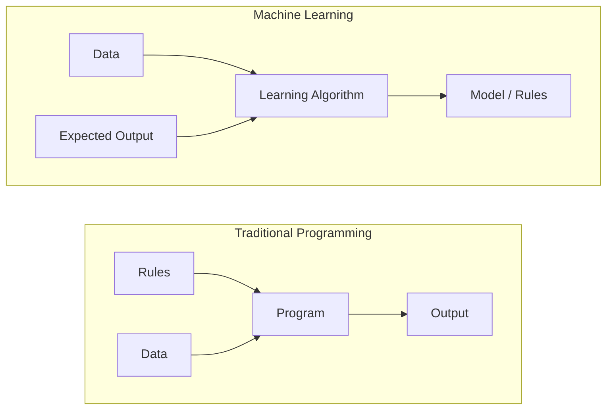
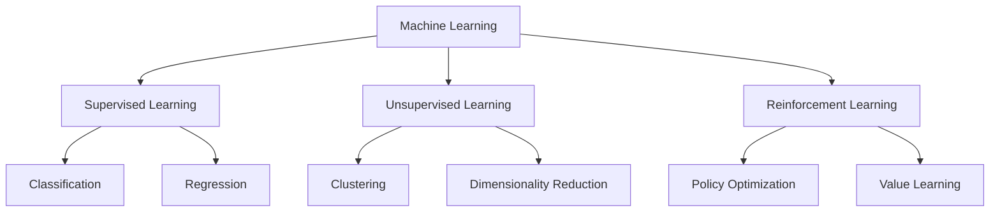
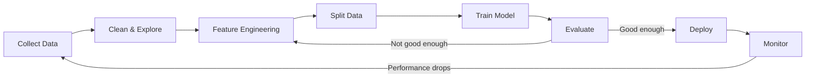
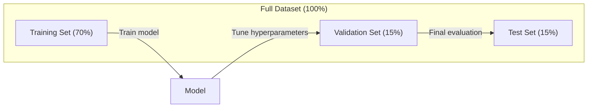
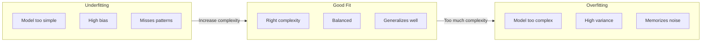
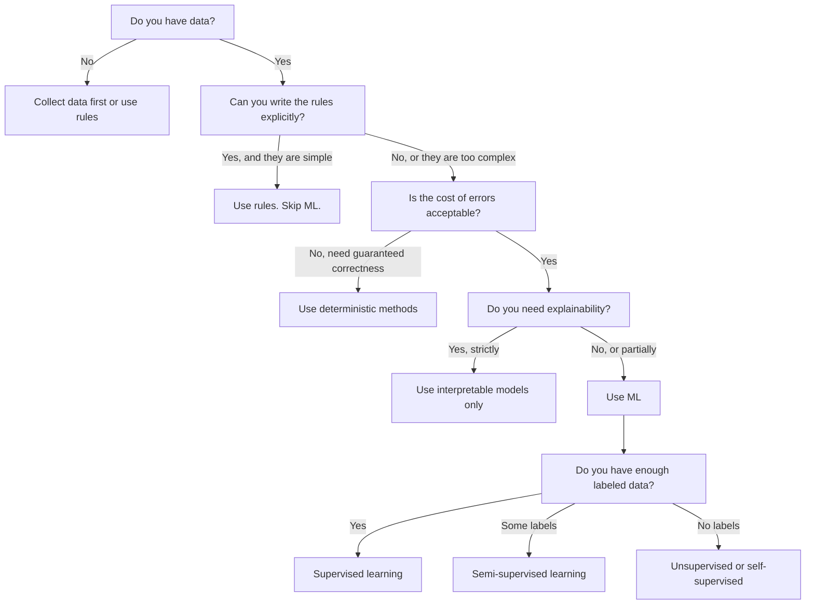

# 什么是机器学习

机器学习正在教会计算机在数据中寻找模式，而不是手动编写规则。

**类型：** 学习
**语言：** Python
**先决条件：** 第一阶段（数学基础）
**时间：** 约45分钟

## 学习目标

- Explain the difference between supervised, unsupervised, and reinforcement learning and identify which type applies to a given problem
- Implement a nearest centroid classifier from scratch and evaluate it against a random baseline
- Distinguish between classification and regression tasks and select the appropriate loss function for each
- Evaluate whether a given business problem is suitable for ML or better solved with deterministic rules

## 问题

您想要构建一种垃圾邮件过滤器。传统的方法是：坐下来编写数百条规则。“如果电子邮件中包含‘免费金钱’，则标记为垃圾邮件。如果它包含超过3个感叹号，也标记为垃圾邮件。”您需要花费数周时间来编写这些规则。然后，垃圾邮件发送者会改变措辞，您的规则就不再适用。于是您又需要编写更多的规则。这个循环永无止境。

机器学习改变了这一模式。与其编写规则，不如将数千封带有标签的电子邮件（“垃圾邮件”或“非垃圾邮件”）提供给计算机，让它自行找出规则。计算机能够发现您从未想到的模式。当垃圾邮件发送者改变策略时，您只需根据新数据重新训练算法，而无需重写代码。

从“编写规则”到“从数据中学习”的转变是机器学习的核心。每一个推荐引擎、语音助手、自动驾驶汽车以及语言模型都是通过这种方式运行的。

## 概念

### 从数据中学习，而非规则

传统编程和机器学习解决问题的方向相反。



传统编程：你编写规则。程序将这些规则应用于数据以产生输出。

机器学习：你提供数据和预期输出。算法发现这些规则。

训练过程中得到的“模型”就是规则，以数字形式编码（权重、参数）。它从所看到的示例中归纳出规律，从而对从未见过的数据进行预测。

### 三种类型的机器学习



**监督学习**：你有输入和输出对。模型学习将输入映射到输出。
- “这里有10,000张标记为猫或狗的照片。学会区分它们。”
- “这里有房屋特征与价格信息。学会预测价格。”

**无监督学习**：只有输入，没有标签。模型自行发现结构。
- “这里有10,000个客户购买历史记录。找到自然的分组方式。”
- “这里有1,000个维度数据点。在保持结构的同时减少到2个维度。”

**强化学习**：代理在环境中采取行动并接收奖励或惩罚。它学习一种策略来最大化总奖励。
- “玩这个游戏。胜利得+1，失败得-1。找出策略。”
- “控制这个机器人手臂。拾起物体得+1，每浪费一秒扣0.01。”

实践中大多数你构建的内容都使用监督学习。无监督学习常用于预处理和探索。强化学习为游戏AI、机器人技术和语言模型的强化学习提供动力。

### 超越三大巨头

上述三个类别较为清晰，但现实中的机器学习往往使这些界限变得模糊。

**半监督学习**使用少量标记数据和大量未标记数据。你可能拥有100张标记的医学图像和100,000张未标记的图像。相关技术包括：

- **标签传播：**构建连接相似数据点的图。标签通过图表从标记节点扩散到未标记的邻居。
- **伪标记：**在标记数据上训练模型，用它来预测未标记数据的标签，然后再对所有数据进行重新训练。模型自行生成训练集。
- **一致性正则化：**模型应对输入及其略有修改的版本给出相同的预测。即使没有标签，这种方法也能工作。

**自监督学习**从数据本身创建监督信息。完全不需要人类标记。模型根据数据的结构创建自己的预测任务。

- **掩码语言建模（BERT）：**隐藏句子中的15%单词，训练模型预测缺失的单词。“标签”来自原始文本。
- **对比学习（SimCLR）：**取一张图像，创建两个增强版本。训练模型识别它们来自同一张图像，同时将其与其他图像的增强版本区分开来。
- **下一个词预测（GPT）：**给定所有之前的词，预测下一个词。每个文本文档都成为训练样本。

这些并非与三大类别分开的类别。它们是结合监督学习和无监督学习思想的策略。自监督学习在技术上属于监督学习（模型预测某事），但标签是自动生成的，而非由人类生成。

### 分类与回归

这些是两种主要的监督学习任务。

| 方面 | 分类 | 回归 |
|------|-----|-----|
| 输出 | 离散类别 | 连续数字 |
| 示例 | “这是垃圾邮件吗？” | “房价会是多少？” |
| 输出空间 | {猫，狗，鸟} | 任何实数 |
| 损失函数 | 交叉熵，准确率 | 均方误差，MAE |
| 决策 | 类别之间的边界 | 拟合数据的曲线 |

分类回答“属于哪个类别？”回归回答“多少？”

有些问题可以用两种方式来表述。预测股票是上涨还是下跌属于分类。预测确切价格则属于回归。

### ML Workflow

每个机器学习项目都遵循相同的流程，无论使用什么算法。



**收集数据**：收集原始数据。更多的数据几乎总是更好的选择，但质量比数量更重要。

**清洗与探索**：处理缺失值，去除重复项，可视化分布，发现异常。这一步骤通常占项目总时间的60-80%。

**特征工程**：将原始数据转换为模型可以使用的特征。将日期转换为星期几。标准化数值列。编码分类变量。好的特征比复杂的算法更重要。

**划分数据**：将数据分为训练集、验证集和测试集。模型在训练集上进行训练，你在验证集上调整超参数，并在测试集上报告最终性能。

**训练模型**：将训练数据输入到算法中。算法调整内部参数以最小化损失函数。

**评估**：在验证/测试数据集上衡量性能。如果性能不可接受，返回并尝试不同的特征、算法或超参数。

**部署**：将模型投入生产环境，使其对新数据进行预测。

**监控**：随时间跟踪性能。数据分布会发生变化（数据漂移），模型也会退化。当性能下降时，重新训练。

### 训练集、验证集和测试集划分

这是初学者最容易误解的重要概念。你必须在模型训练期间从未见过的数据上评估它。否则，你测量的是记忆能力，而不是学习能力。



| 分割方式 | 用途 | 使用时机 | 典型大小 |
|---------|------|-----------|-------------|
| 训练集 | 模型从这些数据中学习 | 训练期间 | 60-80% |
| 验证集 | 调整超参数，比较模型性能 | 每次训练后 | 10-20% |
| 测试集 | 最终无偏性能估计 | 最后一次训练时 | 10-20% |

测试集是神圣的。你只能查看一次。如果你根据测试性能不断调整模型，实际上就是在测试集上进行训练，那么你报告的数值就没有意义。

对于小型数据集，使用k折交叉验证：将数据分成k部分，对其中k-1部分进行训练，对剩余部分进行验证，然后循环往复并平均结果。

### 过拟合与欠拟合



**欠拟合**：模型过于简单，无法捕捉数据中的模式。一条直线试图拟合曲线关系。训练误差高。测试误差高。

**过拟合**：模型过于复杂，记住了训练数据，包括其中的噪声。一条曲折的曲线穿过所有训练点，但在新数据上表现不佳。训练误差低。测试误差高。

**良好拟合**：模型能够捕捉真实模式，而不记住噪声。训练误差和测试误差都相对较低。

过拟合的迹象：
- 训练准确率远高于验证准确率
- 模型在训练数据上的表现很好，但在新数据上的表现较差
- 增加更多训练数据可以提高性能（模型是在记忆而不是学习）

过拟合的解决方法：
- 获取更多训练数据
- 降低模型复杂度（减少参数，简化架构）
- 正则化（对大权重添加惩罚）
- 淘汰法（在训练过程中随机消除神经元）
- 提前停止（当验证误差开始增加时停止训练）

欠拟合的解决方法：
- 使用更复杂的模型
- 增加更多特征
- 降低正则化强度
- 延长训练时间

### 偏差-方差权衡

这是过拟合和欠拟合背后的数学框架。

**偏差**：模型中存在错误假设导致的误差。当真实关系是非线性时，线性模型的偏差较高。高偏差会导致欠拟合。

**方差**：训练数据中小波动的敏感性导致的误差。具有高方差的模型在训练不同数据集子集时会产生非常不同的预测结果。高方差会导致过拟合。

| 模型复杂度 | 偏差 | 方差 | 结果 |
|----------|------|------|--------|
| 太低（用于曲线数据的线性模型）| 高 | 低 | 欠拟合 |
| 刚好合适 | 中等 | 中等 | 良好的泛化能力 |
| 太高（10个点的度20多项式）| 低 | 高 | 过拟合 |

总误差 = 偏差^2 + 方差 + 不可降低的噪声

你无法减少不可降低的噪声（它是数据本身的随机性）。你需要找到偏差^2 + 方差最小化的理想点。

### 无免费午餐定理

没有一种算法适用于所有问题。在一个问题上表现良好的算法在另一个问题上可能会表现不佳。这就是为什么数据科学家会尝试多种算法并比较结果的原因。

实际上，选择哪种算法取决于：
- 你拥有多少数据
- 有多少个特征
- 关系是线性还是非线性
- 你需要可解释性吗
- 你能负担得起多少计算资源

### 何时不使用机器学习

机器学习虽然强大，但并不总是合适的工具。在采用模型之前，先问问自己是否真的需要它。

**以下情况请勿使用机器学习：**

- **规则简单且定义明确。** 税收计算、排序算法、单位换算。如果可以用几个if语句编写逻辑，那么使用模型只会增加复杂性而并无实际好处。
- **您没有数据或数据极少。** 机器学习需要示例来学习。仅有10个数据点，无法训练出有意义的模型。请先收集数据。
- **错误的代价极高，您需要保证正确性。** 医疗剂量计算、核反应堆控制、密码验证等需要精确性。机器学习模型是概率性的，有时会出错。如果“有时出错”不可接受，应使用确定性方法。
- **查找表或启发式算法可以解决问题。** 如果简单的阈值或表格能覆盖99%的情况，添加机器学习只会增加维护成本，而不会带来实质性改进。
- **您无法解释决策，而需要可解释性。** 受监管行业（贷款、保险、刑事司法）有时要求每个决策都完全可解释。某些机器学习模型是可解释的（线性回归、小型决策树），但大多数并非如此。
- **问题的变化速度超过您的重新训练能力。** 如果规则每天都在变化，且重新训练需要一周时间，那么模型就会始终过时。

使用以下决策流程图：



## 构建它

`code/ml_intro.py`中的代码实现了从零开始的最近质心分类器，这是最简单的机器学习算法。它展示了核心思想：从数据中学习，然后对新数据进行预测。

### 步骤1：从零开始构建最近中心点分类器

最近的质心分类器计算训练数据中每个类别的中心（均值）。在预测时，它将每个新点分配到中心最接近该点的类别。

```python
class NearestCentroid:
    def fit(self, X, y):
        self.classes = np.unique(y)
        self.centroids = np.array([
            X[y == c].mean(axis=0) for c in self.classes
        ])

    def predict(self, X):
        distances = np.array([
            np.sqrt(((X - c) ** 2).sum(axis=1))
            for c in self.centroids
        ])
        return self.classes[distances.argmin(axis=0)]
```

这就是整个算法。Fit计算两个均值。Predict计算距离。没有梯度下降，没有迭代，也没有超参数。

### 步骤2：在合成数据上进行训练

我们生成了一个包含两个略有重叠类别的二维分类数据集。中心点分类器在类别中心之间绘制了一条线性决策边界。

```python
rng = np.random.RandomState(42)
X_class0 = rng.randn(100, 2) + np.array([1.0, 1.0])
X_class1 = rng.randn(100, 2) + np.array([-1.0, -1.0])
X = np.vstack([X_class0, X_class1])
y = np.array([0] * 100 + [1] * 100)
```

### 步骤3：与基准进行比较

每个机器学习模型都应该与一个简单的基准进行比较。这里的基准预测一个随机类别。如果你的机器学习模型无法超越随机猜测，那就说明存在问题。

```python
baseline_preds = rng.choice([0, 1], size=len(y_test))
baseline_acc = np.mean(baseline_preds == y_test)
```

在这一干净的数据集上，中心格分类器的准确率应达到90%以上。随机基线模型的准确率约为50%。

### 为什么这很重要

最近的质心分类器非常简单。它没有超参数，没有迭代过程，也没有梯度下降算法。然而，它却能捕捉到机器学习的基本模式：

1. **学习**训练数据中的表示（质心）
2. 使用该表示对新数据进行**预测**（最近距离）
3. 与基准模型进行**评估**（随机猜测）

从逻辑回归到Transformer，每一种机器学习算法都遵循这相同的三步流程。表示方式可能会变得更加复杂，但工作流程保持不变。

### 步骤4：重心分类器无法完成的任务

最近的质心分类器假设每个类别形成一个单独的簇。它绘制线性决策边界。当以下情况发生时，该分类器会失败：

- 类别具有多个簇（例如，数字“1”可以用几种不同的方式书写）
- 决策边界是非线性的（例如，一个类别包围另一个类别）
- 特征尺度差异很大（距离由最大尺度的特征主导）

这些限制促使你学习其他所有算法。K最近邻处理多个簇的情况。决策树处理非线性边界。特征缩放解决了尺度问题。每一课都基于前一课的局限性进行构建。

## 使用它

sklearn提供了`NearestCentroid`以及合成数据生成器：

```python
from sklearn.neighbors import NearestCentroid
from sklearn.datasets import make_classification
from sklearn.model_selection import train_test_split

X, y = make_classification(
    n_samples=500, n_features=2, n_redundant=0,
    n_clusters_per_class=1, random_state=42
)
X_train, X_test, y_train, y_test = train_test_split(X, y, test_size=0.3)

clf = NearestCentroid()
clf.fit(X_train, y_train)
print(f"Accuracy: {clf.score(X_test, y_test):.3f}")
```

## 发货

本课程生成了`outputs/prompt-ml-problem-framer.md`——一个能够将模糊的商业问题转化为具体的机器学习任务的提示词。输入一个问题描述（“我们希望减少流失率”或“预测下一季度的需求”），它将确定学习类型，定义预测目标，列出候选特征，选择成功指标，建立基线，并指出数据泄露或类别不平衡等陷阱。在任何机器学习项目开始时使用此工具，以避免构建错误的项目。

## | 关键词 | 翻译 |

| 术语 | 人们怎么说 | 实际含义 |
|------|------------|----------|
| 模型 | “AI” | 具有可学习参数的数学函数，将输入映射到输出 |
| 训练 | “教AI” | 运行优化算法来调整模型参数，使预测与已知输出相匹配 |
| 特征 | “输入列” | 数据中的可测量属性，模型用它来进行预测 |
| 标签 | “答案” | 训练示例的已知输出，用于计算误差信号 |
| 超参数 | “你调整的设置” | 训练前的参数集，控制学习过程（如学习率、层数） |
| 损失函数 | “模型的错误程度” | 衡量预测输出与实际输出之间差距的函数，训练试图最小化此差距 |
| 过拟合 | “它记住了测试数据” | 模型学会了特定于训练的噪声而非通用模式，因此在新数据上表现不佳 |
| 欠拟合 | “它什么都没学” | 模型过于简单，无法捕捉数据中的真实模式 |
| 泛化能力 | “它在新数据上有效” | 模型在不经过训练的数据上进行准确预测的能力 |
| 交叉验证 | “在不同部分进行测试” | 反复将数据分成训练/测试部分并平均结果，提供更可靠的性能估计 |
| 正则化 | “保持权重较小” | 在损失函数中添加惩罚项，防止模型过于复杂 |
| 数据漂移 | “世界变了” | 传入数据的统计分布随时间变化，导致模型性能下降 |

## 练习

1. Take any dataset (e.g., Iris, Titanic). Split it into train/validation/test components with proportions of 70/15/15. Explain why it is not appropriate to tune hyperparameters on the test set.
2. List three real-world problems in machine learning. For each problem, determine whether it is a classification, regression, or clustering task, and whether it involves supervised or unsupervised learning.
3. A model achieves an accuracy of 99% on training data but only 60% on test data. Identify the issue and list three steps you would take to address it.

## 更多阅读资料

- [统计学习简介](https://www.statlearning.com/) - 免费教科书，涵盖所有经典机器学习方法并附有实际示例
- [谷歌机器学习速成课程](https://developers.google.com/machine-learning/crash-course) - 关于机器学习概念的简洁视觉介绍
- [Scikit-learn用户指南](https://scikit-learn.org/stable/user_guide.html) - 在Python中实现机器学习的实用参考手册
