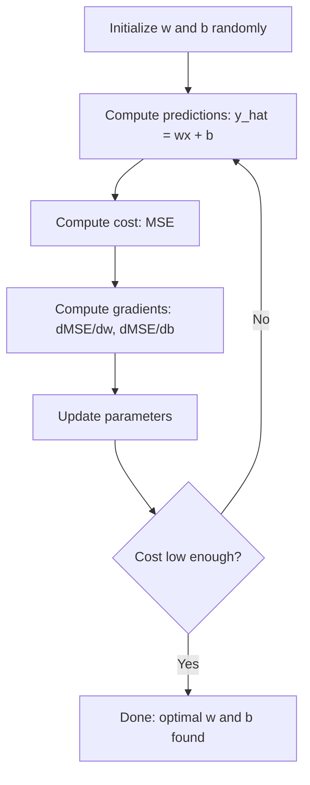

# 线性回归

> 线性回归绘制了穿过数据的理想直线。它是机器学习的“Hello World”示例。

**类型：**构建
**语言：**Python
**先决条件：**第一阶段（线性代数、微积分、优化），第二阶段第1课
**时间：**约90分钟

## 学习目标

- Derive the gradient descent update rules for mean squared error and implement linear regression from scratch
- Compare gradient descent and the normal equation in terms of computational complexity and when to use each
- Build a multiple linear regression model with feature standardization and interpret the learned weights
- Explain how Ridge regression (L2 regularization) prevents overfitting by penalizing large weights

## 问题

您有数据：房屋大小及其售价。您希望根据房屋大小预测新房屋的售价。您可以尝试在散点图上观察，但您需要一个公式。您需要一条最能拟合数据的直线，这样您就可以输入任何大小并得到价格预测。

线性回归可以提供这条线。更重要的是，它引入了整个机器学习训练流程：定义模型、定义成本函数、优化参数。每个机器学习算法都遵循这一模式。通过最简单的情况来掌握它，您将能在各处识别到这种模式。

这不仅适用于简单问题。线性回归被用于生产系统中的需求预测、A/B测试分析、财务建模，以及作为所有回归任务的基准。

## 概念

### The Model

线性回归假设输入（x）与输出（y）之间存在线性关系：

```
y = wx + b
```

- `w` (权重/斜率)：当x增加1时，y的变化量
- `b` (截距/零点）：当x=0时，y的值

```
y = w1*x1 + w2*x2 + ... + wn*xn + b
```

或以向量形式表示：`y = w^T * x + b`  
目标：找到使得预测值 `y` 尽可能接近实际值 `y` 的 `w` 和 `b` 的值，适用于所有训练样本。

### 成本函数（均方误差）

如何衡量“尽可能接近”？你需要一个能够反映预测误差的单个数。最常见的选择是均方误差（MSE）：

```
MSE = (1/n) * sum((y_predicted - y_actual)^2)
```

Why square? There are two reasons. First, it penalizes large errors more than small errors (an error of 10 is 100 times worse than an error of 1, not 10 times). Second, the squared function is smooth and differentiable everywhere, which makes optimization straightforward.

The cost function creates a surface. For a single weight w and bias b, the MSE surface looks like a bowl (a convex paraboloid). The bottom of the bowl is where MSE is minimized. Training means finding that bottom.

### 梯度下降法

梯度下降通过向下移动步骤来找到碗的底部。



梯度信息告诉了你两件事：每个参数应移动的方向以及移动的程度。

对于 y_hat = wx + b 的均方误差损失：

```
dMSE/dw = (2/n) * sum((y_hat - y) * x)
dMSE/db = (2/n) * sum(y_hat - y)
```

更新规则：

```
w = w - learning_rate * dMSE/dw
b = b - learning_rate * dMSE/db
```

学习率控制步长大小。太大：会超过最小值并偏离目标。太小：训练过程将耗时很久。常见的起始值有0.01、0.001或0.0001。

### 普通方程（封闭形式解）

对于线性回归而言，存在一个直接公式可以给出最优权重，无需任何迭代。

```
w = (X^T * X)^(-1) * X^T * y
```

This method inverts a matrix to solve for w in one step. It works perfectly for small datasets. For large datasets (millions of rows or thousands of features), gradient descent is preferred because matrix inversion is O(n^3) in terms of the number of features.

### 多元线性回归

具有多种功能，该模型变为：

```
y = w1*x1 + w2*x2 + ... + wn*xn + b
```

一切都保持不变：MSE是成本函数，梯度下降会同时更新所有权重。唯一的区别在于，你拟合的是超平面而不是直线。

特征缩放在这里很重要。如果一个特征的范围是从0到1，另一个范围是从0到1,000,000，那么梯度下降将会遇到困难，因为成本表面会变得拉长。在训练之前对特征进行标准化（减去均值，除以标准差）。

### 多项式回归

如果关系不是线性的，该怎么办？你仍然可以通过创建多项式特征来使用线性回归：

```
y = w1*x + w2*x^2 + w3*x^3 + b
```

This is still “linear” regression because the model’s weights (w1, w2, w3) are linear. You are simply using non-linear features of x. Higher-degree polynomials can fit more complex curves but risk overfitting. A degree-10 polynomial will pass through every point in a 10-point dataset but will perform poorly on new data.

### R-Squared Score

MSE可以告诉你你的错误程度，但数值取决于y的尺度。R平方（R^2）提供了一个与尺度无关的度量：

```
R^2 = 1 - (sum of squared residuals) / (sum of squared deviations from mean)
    = 1 - SS_res / SS_tot
```

- R^2 = 1.0：预测完美
- R^2 = 0.0：模型每次预测的结果都不比平均预测好
- R^2 < 0.0：模型的预测效果比平均预测还差

### 正则化预览（岭回归）

当模型具有许多特征时，分配较大的权重可能导致过拟合。Ridge回归（L2正则化）引入了惩罚项：

```
Cost = MSE + lambda * sum(w_i^2)
```

惩罚项会抑制较大的权重。超参数lambda控制着这种权衡：lambda值越高，权重越小，正则化程度也越大。这一点将在后面的课程中详细讨论。目前，只需知道它的存在及其作用即可。

```figure
linear-regression-fit
```

## 构建它

### 步骤1：生成样本数据

```python
import random
import math

random.seed(42)

TRUE_W = 3.0
TRUE_B = 7.0
N_SAMPLES = 100

X = [random.uniform(0, 10) for _ in range(N_SAMPLES)]
y = [TRUE_W * x + TRUE_B + random.gauss(0, 2.0) for x in X]

print(f"Generated {N_SAMPLES} samples")
print(f"True relationship: y = {TRUE_W}x + {TRUE_B} (+ noise)")
print(f"First 5 points: {[(round(X[i], 2), round(y[i], 2)) for i in range(5)]}")
```

### Step 2: Linear Regression from Scratch Using Gradient Descent

```python
class LinearRegression:
    def __init__(self, learning_rate=0.01):
        self.w = 0.0
        self.b = 0.0
        self.lr = learning_rate
        self.cost_history = []

    def predict(self, X):
        return [self.w * x + self.b for x in X]

    def compute_cost(self, X, y):
        predictions = self.predict(X)
        n = len(y)
        cost = sum((pred - actual) ** 2 for pred, actual in zip(predictions, y)) / n
        return cost

    def compute_gradients(self, X, y):
        predictions = self.predict(X)
        n = len(y)
        dw = (2 / n) * sum((pred - actual) * x for pred, actual, x in zip(predictions, y, X))
        db = (2 / n) * sum(pred - actual for pred, actual in zip(predictions, y))
        return dw, db

    def fit(self, X, y, epochs=1000, print_every=200):
        for epoch in range(epochs):
            dw, db = self.compute_gradients(X, y)
            self.w -= self.lr * dw
            self.b -= self.lr * db
            cost = self.compute_cost(X, y)
            self.cost_history.append(cost)
            if epoch % print_every == 0:
                print(f"  Epoch {epoch:4d} | Cost: {cost:.4f} | w: {self.w:.4f} | b: {self.b:.4f}")
        return self

    def r_squared(self, X, y):
        predictions = self.predict(X)
        y_mean = sum(y) / len(y)
        ss_res = sum((actual - pred) ** 2 for actual, pred in zip(y, predictions))
        ss_tot = sum((actual - y_mean) ** 2 for actual in y)
        return 1 - (ss_res / ss_tot)


print("=== Training Linear Regression (Gradient Descent) ===")
model = LinearRegression(learning_rate=0.005)
model.fit(X, y, epochs=1000, print_every=200)
print(f"\nLearned: y = {model.w:.4f}x + {model.b:.4f}")
print(f"True:    y = {TRUE_W}x + {TRUE_B}")
print(f"R-squared: {model.r_squared(X, y):.4f}")
```

### 步骤3：普通方程（闭式解）

```python
class LinearRegressionNormal:
    def __init__(self):
        self.w = 0.0
        self.b = 0.0

    def fit(self, X, y):
        n = len(X)
        x_mean = sum(X) / n
        y_mean = sum(y) / n
        numerator = sum((X[i] - x_mean) * (y[i] - y_mean) for i in range(n))
        denominator = sum((X[i] - x_mean) ** 2 for i in range(n))
        self.w = numerator / denominator
        self.b = y_mean - self.w * x_mean
        return self

    def predict(self, X):
        return [self.w * x + self.b for x in X]

    def r_squared(self, X, y):
        predictions = self.predict(X)
        y_mean = sum(y) / len(y)
        ss_res = sum((actual - pred) ** 2 for actual, pred in zip(y, predictions))
        ss_tot = sum((actual - y_mean) ** 2 for actual in y)
        return 1 - (ss_res / ss_tot)


print("\n=== Normal Equation (Closed-Form) ===")
model_normal = LinearRegressionNormal()
model_normal.fit(X, y)
print(f"Learned: y = {model_normal.w:.4f}x + {model_normal.b:.4f}")
print(f"R-squared: {model_normal.r_squared(X, y):.4f}")
```

### 步骤4：多元线性回归

```python
class MultipleLinearRegression:
    def __init__(self, n_features, learning_rate=0.01):
        self.weights = [0.0] * n_features
        self.bias = 0.0
        self.lr = learning_rate
        self.cost_history = []

    def predict_single(self, x):
        return sum(w * xi for w, xi in zip(self.weights, x)) + self.bias

    def predict(self, X):
        return [self.predict_single(x) for x in X]

    def compute_cost(self, X, y):
        predictions = self.predict(X)
        n = len(y)
        return sum((pred - actual) ** 2 for pred, actual in zip(predictions, y)) / n

    def fit(self, X, y, epochs=1000, print_every=200):
        n = len(y)
        n_features = len(X[0])
        for epoch in range(epochs):
            predictions = self.predict(X)
            errors = [pred - actual for pred, actual in zip(predictions, y)]
            for j in range(n_features):
                grad = (2 / n) * sum(errors[i] * X[i][j] for i in range(n))
                self.weights[j] -= self.lr * grad
            grad_b = (2 / n) * sum(errors)
            self.bias -= self.lr * grad_b
            cost = self.compute_cost(X, y)
            self.cost_history.append(cost)
            if epoch % print_every == 0:
                print(f"  Epoch {epoch:4d} | Cost: {cost:.4f}")
        return self

    def r_squared(self, X, y):
        predictions = self.predict(X)
        y_mean = sum(y) / len(y)
        ss_res = sum((actual - pred) ** 2 for actual, pred in zip(y, predictions))
        ss_tot = sum((actual - y_mean) ** 2 for actual in y)
        return 1 - (ss_res / ss_tot)


random.seed(42)
N = 100
X_multi = []
y_multi = []
for _ in range(N):
    size = random.uniform(500, 3000)
    bedrooms = random.randint(1, 5)
    age = random.uniform(0, 50)
    price = 50 * size + 10000 * bedrooms - 1000 * age + 50000 + random.gauss(0, 20000)
    X_multi.append([size, bedrooms, age])
    y_multi.append(price)


def standardize(X):
    n_features = len(X[0])
    means = [sum(X[i][j] for i in range(len(X))) / len(X) for j in range(n_features)]
    stds = []
    for j in range(n_features):
        variance = sum((X[i][j] - means[j]) ** 2 for i in range(len(X))) / len(X)
        stds.append(variance ** 0.5)
    X_scaled = []
    for i in range(len(X)):
        row = [(X[i][j] - means[j]) / stds[j] if stds[j] > 0 else 0 for j in range(n_features)]
        X_scaled.append(row)
    return X_scaled, means, stds


y_mean_val = sum(y_multi) / len(y_multi)
y_std_val = (sum((yi - y_mean_val) ** 2 for yi in y_multi) / len(y_multi)) ** 0.5
y_scaled = [(yi - y_mean_val) / y_std_val for yi in y_multi]

X_scaled, x_means, x_stds = standardize(X_multi)

print("\n=== Multiple Linear Regression (3 features) ===")
print("Features: house size, bedrooms, age")
multi_model = MultipleLinearRegression(n_features=3, learning_rate=0.01)
multi_model.fit(X_scaled, y_scaled, epochs=1000, print_every=200)

print(f"\nWeights (standardized): {[round(w, 4) for w in multi_model.weights]}")
print(f"Bias (standardized): {multi_model.bias:.4f}")
print(f"R-squared: {multi_model.r_squared(X_scaled, y_scaled):.4f}")
```

### 步骤5：多项式回归

```python
class PolynomialRegression:
    def __init__(self, degree, learning_rate=0.01):
        self.degree = degree
        self.weights = [0.0] * degree
        self.bias = 0.0
        self.lr = learning_rate

    def make_features(self, X):
        return [[x ** (d + 1) for d in range(self.degree)] for x in X]

    def predict(self, X):
        features = self.make_features(X)
        return [sum(w * f for w, f in zip(self.weights, row)) + self.bias for row in features]

    def fit(self, X, y, epochs=1000, print_every=200):
        features = self.make_features(X)
        n = len(y)
        for epoch in range(epochs):
            predictions = [sum(w * f for w, f in zip(self.weights, row)) + self.bias for row in features]
            errors = [pred - actual for pred, actual in zip(predictions, y)]
            for j in range(self.degree):
                grad = (2 / n) * sum(errors[i] * features[i][j] for i in range(n))
                self.weights[j] -= self.lr * grad
            grad_b = (2 / n) * sum(errors)
            self.bias -= self.lr * grad_b
            if epoch % print_every == 0:
                cost = sum(e ** 2 for e in errors) / n
                print(f"  Epoch {epoch:4d} | Cost: {cost:.6f}")
        return self

    def r_squared(self, X, y):
        predictions = self.predict(X)
        y_mean = sum(y) / len(y)
        ss_res = sum((actual - pred) ** 2 for actual, pred in zip(y, predictions))
        ss_tot = sum((actual - y_mean) ** 2 for actual in y)
        return 1 - (ss_res / ss_tot)


random.seed(42)
X_poly = [x / 10.0 for x in range(0, 50)]
y_poly = [0.5 * x ** 2 - 2 * x + 3 + random.gauss(0, 1.0) for x in X_poly]

x_max = max(abs(x) for x in X_poly)
X_poly_norm = [x / x_max for x in X_poly]
y_poly_mean = sum(y_poly) / len(y_poly)
y_poly_std = (sum((yi - y_poly_mean) ** 2 for yi in y_poly) / len(y_poly)) ** 0.5
y_poly_norm = [(yi - y_poly_mean) / y_poly_std for yi in y_poly]

print("\n=== Polynomial Regression (degree 2 vs degree 5) ===")
print("True relationship: y = 0.5x^2 - 2x + 3")

print("\nDegree 2:")
poly2 = PolynomialRegression(degree=2, learning_rate=0.1)
poly2.fit(X_poly_norm, y_poly_norm, epochs=2000, print_every=500)
print(f"  R-squared: {poly2.r_squared(X_poly_norm, y_poly_norm):.4f}")

print("\nDegree 5:")
poly5 = PolynomialRegression(degree=5, learning_rate=0.1)
poly5.fit(X_poly_norm, y_poly_norm, epochs=2000, print_every=500)
print(f"  R-squared: {poly5.r_squared(X_poly_norm, y_poly_norm):.4f}")

print("\nDegree 2 fits the true curve well. Degree 5 fits training data slightly better")
print("but risks overfitting on new data.")
```

### 步骤6：岭回归（L2正则化）

```python
class RidgeRegression:
    def __init__(self, n_features, learning_rate=0.01, alpha=1.0):
        self.weights = [0.0] * n_features
        self.bias = 0.0
        self.lr = learning_rate
        self.alpha = alpha

    def predict_single(self, x):
        return sum(w * xi for w, xi in zip(self.weights, x)) + self.bias

    def predict(self, X):
        return [self.predict_single(x) for x in X]

    def fit(self, X, y, epochs=1000, print_every=200):
        n = len(y)
        n_features = len(X[0])
        for epoch in range(epochs):
            predictions = self.predict(X)
            errors = [pred - actual for pred, actual in zip(predictions, y)]
            mse = sum(e ** 2 for e in errors) / n
            reg_term = self.alpha * sum(w ** 2 for w in self.weights)
            cost = mse + reg_term
            for j in range(n_features):
                grad = (2 / n) * sum(errors[i] * X[i][j] for i in range(n))
                grad += 2 * self.alpha * self.weights[j]
                self.weights[j] -= self.lr * grad
            grad_b = (2 / n) * sum(errors)
            self.bias -= self.lr * grad_b
            if epoch % print_every == 0:
                print(f"  Epoch {epoch:4d} | Cost: {cost:.4f} | L2 penalty: {reg_term:.4f}")
        return self


print("\n=== Ridge Regression (L2 Regularization) ===")
print("Same data as multiple regression, with alpha=0.1")
ridge = RidgeRegression(n_features=3, learning_rate=0.01, alpha=0.1)
ridge.fit(X_scaled, y_scaled, epochs=1000, print_every=200)
print(f"\nRidge weights: {[round(w, 4) for w in ridge.weights]}")
print(f"Plain weights: {[round(w, 4) for w in multi_model.weights]}")
print("Ridge weights are smaller (shrunk toward zero) due to the L2 penalty.")
```

## 使用它

现在，同样的情况也适用于 scikit-learn，这是你在生产环境中实际会使用的工具。

```python
from sklearn.linear_model import LinearRegression as SklearnLR
from sklearn.linear_model import Ridge
from sklearn.preprocessing import PolynomialFeatures, StandardScaler
from sklearn.model_selection import train_test_split
from sklearn.metrics import mean_squared_error, r2_score
import numpy as np

np.random.seed(42)
X_sk = np.random.uniform(0, 10, (100, 1))
y_sk = 3.0 * X_sk.squeeze() + 7.0 + np.random.normal(0, 2.0, 100)

X_train, X_test, y_train, y_test = train_test_split(X_sk, y_sk, test_size=0.2, random_state=42)

lr = SklearnLR()
lr.fit(X_train, y_train)
y_pred = lr.predict(X_test)

print("=== Scikit-learn Linear Regression ===")
print(f"Coefficient (w): {lr.coef_[0]:.4f}")
print(f"Intercept (b): {lr.intercept_:.4f}")
print(f"R-squared (test): {r2_score(y_test, y_pred):.4f}")
print(f"MSE (test): {mean_squared_error(y_test, y_pred):.4f}")

poly = PolynomialFeatures(degree=2, include_bias=False)
X_poly_sk = poly.fit_transform(X_train)
X_poly_test = poly.transform(X_test)

lr_poly = SklearnLR()
lr_poly.fit(X_poly_sk, y_train)
print(f"\nPolynomial degree 2 R-squared: {r2_score(y_test, lr_poly.predict(X_poly_test)):.4f}")

scaler = StandardScaler()
X_train_scaled = scaler.fit_transform(X_train)
X_test_scaled = scaler.transform(X_test)

ridge = Ridge(alpha=1.0)
ridge.fit(X_train_scaled, y_train)
print(f"Ridge R-squared: {r2_score(y_test, ridge.predict(X_test_scaled)):.4f}")
print(f"Ridge coefficient: {ridge.coef_[0]:.4f}")
```

Your own implementation from scratch and the scikit-learn library produce the same results. The difference lies in the fact that scikit-learn takes care of edge cases, ensures numerical stability, and offers performance optimizations. Use the scikit-learn library for production use. Use your own implementation from scratch to understand how things work.

## 发货

本课程将生成以下文件：
- `outputs/skill-regression.md` - 一种根据问题选择正确回归方法的技能。

## 练习

1. Implement batch gradient descent, stochastic gradient descent (SGD), and mini-batch gradient descent. Compare the convergence speed on the same dataset. Which converges fastest? Which has the smoothest cost curve?
2. Generate data from a cubic function (y = ax^3 + bx^2 + cx + d + noise). Fit polynomials of degree 1, 3, and 10. Compare the training R^2 and test R^2. At what degree does overfitting become obvious?
3. Implement Lasso regression (L1 regularization: penalty = alpha * sum(|w_i|)). Train on the multi-feature housing data. Compare which weights go to zero compared to Ridge regression. Why does L1 produce sparse solutions while L2 does not?

## | 关键词 | 翻译 |

| 术语 | 人们怎么说 | 实际含义 |
|------|------------|----------|
| 线性回归 | “通过数据画一条线” | 找到权重 w 和偏差 b，使 wx+b 与真实 y 值之间的平方差异之和最小化 |
| 代价函数 | “模型的糟糕程度” | 一个将模型参数映射为衡量预测误差的单数字的函数，优化目标是最小化该误差 |
| 均方误差 | “误差的平方平均值” | (1/n) * 所有 (预测 - 实际)^2 的和，对较大误差进行不成比例惩罚 |
| 梯度下降 | “下坡行走” | 使用偏导数迭代调整参数，以减少代价函数的值 |
| 学习率 | “步长” | 控制每次梯度下降步骤中参数变化大小的标量 |
| 正规方程 | “直接求解” | w = (X^T X)^-1 X^T y 的封闭形式解，无需迭代即可得到最优权重 |
| R 平方值 | “拟合效果的好坏” | 模型解释 y 方差的比例，范围从负无穷到 1.0 |
| 特征缩放 | “使特征可比” | 将特征转换为相似的范围（例如，零均值、单位方差），以便梯度下降更快收敛 |
| 正则化 | “惩罚复杂性” | 在代价函数中添加一项，缩小权重，防止过拟合 |
| 岭回归 | “L2 正则化” | 在 MSE 中加入 lambda * sum(w_i^2) 的线性回归惩罚项 |
| 多项式回归 | “用线性数学拟合曲线” | 对多项式特征（x, x^2, x^3, ...）进行线性回归，权重仍保持线性 |
| 过拟合 | “记忆训练数据” | 使用过于复杂的模型，使其适应训练数据中的噪声，而在新数据上表现不佳 |

## 更多阅读资料

- [统计学习导论 (ISLR)](https://www.statlearning.com/) -- 免费PDF，第3章和第6章涵盖线性回归和正则化，并附有实用的R示例  
- [统计学习的要素 (ESL)](https://hastie.su.domains/ElemStatLearn/) -- 免费PDF，《ISLR》中更数学化的姊妹篇，深入探讨了岭回归和套索回归  
- [斯坦福CS229线性回归讲义](https://cs229.stanford.edu/main_notes.pdf) -- Andrew Ng的笔记，从基本原理推导正常方程和梯度下降法  
- [scikit-learn LinearRegression文档](https://scikit-learn.org/stable/modules/linear_model.html) -- 包含代码示例的LinearRegression、Ridge、Lasso和ElasticNet实用参考
