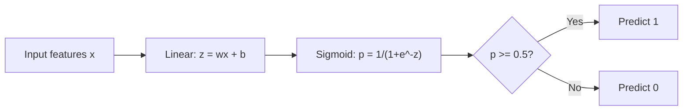
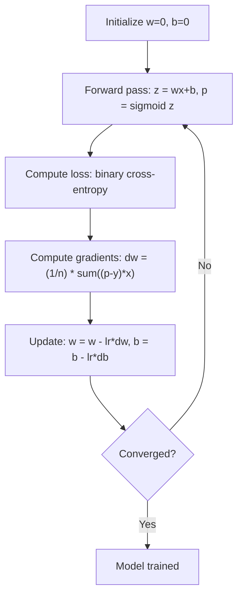

# 逻辑回归

> 逻辑回归将直线弯曲成S形曲线，以用概率回答是或否的问题。

**类型：**构建
**语言：**Python
**先决条件：**第二阶段第1-2课（什么是机器学习、线性回归）
**时间：**约90分钟

## 学习目标

- Implement logistic regression from scratch using the sigmoid function and binary cross-entropy loss
- Compute and interpret precision, recall, F1 score, and the confusion matrix for binary classification
- Explain why MSE fails for classification and why binary cross-entropy produces a convex cost surface
- Build a softmax regression model for multi-class classification and evaluate threshold tuning tradeoffs

## 问题

You want to predict whether a tumor is malignant or benign based on its size. You try linear regression, which outputs numbers like 0.3, 1.7, or -0.5. What do these mean? Is 1.7 "very malignant"? Is -0.5 "very benign"? Linear regression produces unbounded numbers. Classification, however, requires bounded probabilities between 0 and 1, with a clear yes or no decision.

Logistic regression solves this problem. It uses the same linear combination (wx + b) and applies the sigmoid function to it, which compresses any number into the range (0, 1). The output is a probability. You set a threshold (usually 0.5) and make a decision based on that.

This is one of the most widely used algorithms in practice. Despite its name, logistic regression is a classification algorithm, not a regression algorithm. The name comes from the sigmoid function it uses.

## 概念

### 为什么线性回归在分类任务中表现不佳？

想象一下，根据学习时长来预测通过/失败（1/0）。线性回归可以绘制出穿过数据的直线：

```
hours:  1   2   3   4   5   6   7   8   9   10
actual: 0   0   0   0   1   1   1   1   1   1
```

线性拟合可能会在第1小时产生-0.2的预测值，在第10小时产生1.3的预测值。这些数值不是概率。它们会低于0且高于1。更糟糕的是，一个异常值（即学习了50小时的人）会拖垮整个曲线，导致所有人的预测值都发生变化。

分类需要一个具有以下功能的函数：
- 输出介于0和1之间的值（概率）
- 创建清晰的过渡（决策边界）
- 不会被远离边界的异常值扭曲

### Sigmoid Function

Sigmoid函数正是如此：

```
sigmoid(z) = 1 / (1 + e^(-z))
```

属性：
- 当 z 为正且较大时，sigmoid(z) 趋近于 1
- 当 z 为负且较大时，sigmoid(z) 趋近于 0
- 当 z = 0 时，sigmoid(z) = 0.5
- 输出值始终在 0 和 1 之间
- 该函数在任何地方都是平滑且可微分的

导数具有便捷的形式：sigmoid'(z) = sigmoid(z) * (1 - sigmoid(z))。这使得梯度计算更加高效。

### 逻辑回归 = 线性模型 + Sigmoid函数

模型计算 z = wx + b（与线性回归相同），然后应用 Sigmoid 函数：



The output p is interpreted as P(y=1 | x), the probability that the input belongs to class 1. The decision boundary is where wx + b = 0, which makes the sigmoid output exactly 0.5.

### 二进制交叉熵损失

您不能使用均方误差（MSE）进行逻辑回归。使用Sigmoid函数的MSE会生成一个非凸的成本曲面，其中包含许多局部最小值。相反，应使用二元交叉熵损失函数（对数损失）：

```
Loss = -(1/n) * sum(y * log(p) + (1-y) * log(1-p))
```

Why this works:
- When y=1 and p is close to 1: log(1) = 0, so the loss is near 0 (correct, low cost)
- When y=1 and p is close to 0: log(0) approaches negative infinity, so the loss is huge (wrong, high cost)
- When y=0 and p is close to 0: log(1) = 0, so the loss is near 0 (correct, low cost)
- When y=0 and p is close to 1: log(0) approaches negative infinity, so the loss is huge (wrong, high cost)

This loss function is convex for logistic regression, guaranteeing a single global minimum.

### 梯度下降法在逻辑回归中的应用

Binary Cross-Entropy with Sigmoid's gradients have a clean form:

```
dL/dw = (1/n) * sum((p - y) * x)
dL/db = (1/n) * sum(p - y)
```

These look identical to the linear regression gradients. The difference is that p = sigmoid(wx + b) instead of p = wx + b. The sigmoid introduces the nonlinearity, but the gradient update rule remains the same.



### 决策边界

对于二维输入（两个特征），决策边界是以下面的方式定义的线：

```
w1*x1 + w2*x2 + b = 0
```

一侧的得分被归类为1，另一侧的得分被归类为0。逻辑回归总是产生线性决策边界。如果你需要曲线形的边界，你需要添加多项式特征或使用非线性模型。

### Softmax多类分类

二元逻辑回归处理两个类别。对于k个类别，使用softmax函数：

```
softmax(z_i) = e^(z_i) / sum(e^(z_j) for all j)
```

每个类别都有自己的权重向量。模型为每个类别计算一个分数z_i，然后使用softmax将分数转换为总和为1的概率。预测出的类别是概率最高的那个。

损失函数变为分类交叉熵：

```
Loss = -(1/n) * sum(sum(y_k * log(p_k)))
```

其中，y_k为1表示真实类别，其余均为0（独热编码）。

### 评估指标

仅准确性是不够的。对于一个包含95%负面样本和5%正面样本的数据集，如果一个模型总是预测负面结果，那么它的准确率为95%，但毫无用处。

**混淆矩阵**：

|  | 预测为正面 | 预测为负面 |
|---|---|---|
| 实际为正面 | 真正例 (TP) | 假正例 (FN) |
| 实际为负面 | 假正例 (FP) | 真负例 (TN) |

**精确度**：在所有预测为正面的样本中，有多少实际上是正面的？
```
Precision = TP / (TP + FP)
```

**召回率**（灵敏度）：在所有实际的正样本中，我们捕获了多少个？
```
Recall = TP / (TP + FN)
```

**F1分数**：精确度和召回率的调和平均值。平衡了这两个指标。
```
F1 = 2 * (Precision * Recall) / (Precision + Recall)
```

何时优先处理：
- **精确性**：当误报代价高昂时（例如垃圾邮件过滤，不想屏蔽合法邮件）
- **召回率**：当漏报代价高昂时（例如癌症筛查，不想错过肿瘤）
- **F1值**：当你需要一个单一的平衡指标时

```figure
logistic-sigmoid
```

## 构建它

### 步骤1：Sigmoid函数与数据生成

```python
import random
import math

def sigmoid(z):
    z = max(-500, min(500, z))
    return 1.0 / (1.0 + math.exp(-z))


random.seed(42)
N = 200
X = []
y = []

for _ in range(N // 2):
    X.append([random.gauss(2, 1), random.gauss(2, 1)])
    y.append(0)

for _ in range(N // 2):
    X.append([random.gauss(5, 1), random.gauss(5, 1)])
    y.append(1)

combined = list(zip(X, y))
random.shuffle(combined)
X, y = zip(*combined)
X = list(X)
y = list(y)

print(f"Generated {N} samples (2 classes, 2 features)")
print(f"Class 0 center: (2, 2), Class 1 center: (5, 5)")
print(f"First 5 samples:")
for i in range(5):
    print(f"  Features: [{X[i][0]:.2f}, {X[i][1]:.2f}], Label: {y[i]}")
```

### 步骤2：从零开始进行逻辑回归分析

```python
class LogisticRegression:
    def __init__(self, n_features, learning_rate=0.01):
        self.weights = [0.0] * n_features
        self.bias = 0.0
        self.lr = learning_rate
        self.loss_history = []

    def predict_proba(self, x):
        z = sum(w * xi for w, xi in zip(self.weights, x)) + self.bias
        return sigmoid(z)

    def predict(self, x, threshold=0.5):
        return 1 if self.predict_proba(x) >= threshold else 0

    def compute_loss(self, X, y):
        n = len(y)
        total = 0.0
        for i in range(n):
            p = self.predict_proba(X[i])
            p = max(1e-15, min(1 - 1e-15, p))
            total += y[i] * math.log(p) + (1 - y[i]) * math.log(1 - p)
        return -total / n

    def fit(self, X, y, epochs=1000, print_every=200):
        n = len(y)
        n_features = len(X[0])
        for epoch in range(epochs):
            dw = [0.0] * n_features
            db = 0.0
            for i in range(n):
                p = self.predict_proba(X[i])
                error = p - y[i]
                for j in range(n_features):
                    dw[j] += error * X[i][j]
                db += error
            for j in range(n_features):
                self.weights[j] -= self.lr * (dw[j] / n)
            self.bias -= self.lr * (db / n)
            loss = self.compute_loss(X, y)
            self.loss_history.append(loss)
            if epoch % print_every == 0:
                print(f"  Epoch {epoch:4d} | Loss: {loss:.4f} | w: [{self.weights[0]:.3f}, {self.weights[1]:.3f}] | b: {self.bias:.3f}")
        return self

    def accuracy(self, X, y):
        correct = sum(1 for i in range(len(y)) if self.predict(X[i]) == y[i])
        return correct / len(y)


split = int(0.8 * N)
X_train, X_test = X[:split], X[split:]
y_train, y_test = y[:split], y[split:]

print("\n=== Training Logistic Regression ===")
model = LogisticRegression(n_features=2, learning_rate=0.1)
model.fit(X_train, y_train, epochs=1000, print_every=200)

print(f"\nTrain accuracy: {model.accuracy(X_train, y_train):.4f}")
print(f"Test accuracy:  {model.accuracy(X_test, y_test):.4f}")
print(f"Weights: [{model.weights[0]:.4f}, {model.weights[1]:.4f}]")
print(f"Bias: {model.bias:.4f}")
```

### 步骤3：从零开始理解混淆矩阵和度量指标

```python
class ClassificationMetrics:
    def __init__(self, y_true, y_pred):
        self.tp = sum(1 for t, p in zip(y_true, y_pred) if t == 1 and p == 1)
        self.tn = sum(1 for t, p in zip(y_true, y_pred) if t == 0 and p == 0)
        self.fp = sum(1 for t, p in zip(y_true, y_pred) if t == 0 and p == 1)
        self.fn = sum(1 for t, p in zip(y_true, y_pred) if t == 1 and p == 0)

    def accuracy(self):
        total = self.tp + self.tn + self.fp + self.fn
        return (self.tp + self.tn) / total if total > 0 else 0

    def precision(self):
        denom = self.tp + self.fp
        return self.tp / denom if denom > 0 else 0

    def recall(self):
        denom = self.tp + self.fn
        return self.tp / denom if denom > 0 else 0

    def f1(self):
        p = self.precision()
        r = self.recall()
        return 2 * p * r / (p + r) if (p + r) > 0 else 0

    def print_confusion_matrix(self):
        print(f"\n  Confusion Matrix:")
        print(f"                  Predicted")
        print(f"                  Pos   Neg")
        print(f"  Actual Pos     {self.tp:4d}  {self.fn:4d}")
        print(f"  Actual Neg     {self.fp:4d}  {self.tn:4d}")

    def print_report(self):
        self.print_confusion_matrix()
        print(f"\n  Accuracy:  {self.accuracy():.4f}")
        print(f"  Precision: {self.precision():.4f}")
        print(f"  Recall:    {self.recall():.4f}")
        print(f"  F1 Score:  {self.f1():.4f}")


y_pred_test = [model.predict(x) for x in X_test]
print("\n=== Classification Report (Test Set) ===")
metrics = ClassificationMetrics(y_test, y_pred_test)
metrics.print_report()
```

### 步骤4：决策边界分析

```python
print("\n=== Decision Boundary ===")
w1, w2 = model.weights
b = model.bias
print(f"Decision boundary: {w1:.4f}*x1 + {w2:.4f}*x2 + {b:.4f} = 0")
if abs(w2) > 1e-10:
    print(f"Solved for x2:     x2 = {-w1/w2:.4f}*x1 + {-b/w2:.4f}")

print("\nSample predictions near the boundary:")
test_points = [
    [3.0, 3.0],
    [3.5, 3.5],
    [4.0, 4.0],
    [2.5, 2.5],
    [5.0, 5.0],
]
for point in test_points:
    prob = model.predict_proba(point)
    pred = model.predict(point)
    print(f"  [{point[0]}, {point[1]}] -> prob={prob:.4f}, class={pred}")
```

### 步骤5：使用Softmax实现多类分类

```python
class SoftmaxRegression:
    def __init__(self, n_features, n_classes, learning_rate=0.01):
        self.n_features = n_features
        self.n_classes = n_classes
        self.lr = learning_rate
        self.weights = [[0.0] * n_features for _ in range(n_classes)]
        self.biases = [0.0] * n_classes

    def softmax(self, scores):
        max_score = max(scores)
        exp_scores = [math.exp(s - max_score) for s in scores]
        total = sum(exp_scores)
        return [e / total for e in exp_scores]

    def predict_proba(self, x):
        scores = [
            sum(self.weights[k][j] * x[j] for j in range(self.n_features)) + self.biases[k]
            for k in range(self.n_classes)
        ]
        return self.softmax(scores)

    def predict(self, x):
        probs = self.predict_proba(x)
        return probs.index(max(probs))

    def fit(self, X, y, epochs=1000, print_every=200):
        n = len(y)
        for epoch in range(epochs):
            grad_w = [[0.0] * self.n_features for _ in range(self.n_classes)]
            grad_b = [0.0] * self.n_classes
            total_loss = 0.0
            for i in range(n):
                probs = self.predict_proba(X[i])
                for k in range(self.n_classes):
                    target = 1.0 if y[i] == k else 0.0
                    error = probs[k] - target
                    for j in range(self.n_features):
                        grad_w[k][j] += error * X[i][j]
                    grad_b[k] += error
                true_prob = max(probs[y[i]], 1e-15)
                total_loss -= math.log(true_prob)
            for k in range(self.n_classes):
                for j in range(self.n_features):
                    self.weights[k][j] -= self.lr * (grad_w[k][j] / n)
                self.biases[k] -= self.lr * (grad_b[k] / n)
            if epoch % print_every == 0:
                print(f"  Epoch {epoch:4d} | Loss: {total_loss / n:.4f}")
        return self

    def accuracy(self, X, y):
        correct = sum(1 for i in range(len(y)) if self.predict(X[i]) == y[i])
        return correct / len(y)


random.seed(42)
X_3class = []
y_3class = []

centers = [(1, 1), (5, 1), (3, 5)]
for label, (cx, cy) in enumerate(centers):
    for _ in range(50):
        X_3class.append([random.gauss(cx, 0.8), random.gauss(cy, 0.8)])
        y_3class.append(label)

combined = list(zip(X_3class, y_3class))
random.shuffle(combined)
X_3class, y_3class = zip(*combined)
X_3class = list(X_3class)
y_3class = list(y_3class)

split_3 = int(0.8 * len(X_3class))
X_train_3 = X_3class[:split_3]
y_train_3 = y_3class[:split_3]
X_test_3 = X_3class[split_3:]
y_test_3 = y_3class[split_3:]

print("\n=== Multi-class Softmax Regression (3 classes) ===")
softmax_model = SoftmaxRegression(n_features=2, n_classes=3, learning_rate=0.1)
softmax_model.fit(X_train_3, y_train_3, epochs=1000, print_every=200)
print(f"\nTrain accuracy: {softmax_model.accuracy(X_train_3, y_train_3):.4f}")
print(f"Test accuracy:  {softmax_model.accuracy(X_test_3, y_test_3):.4f}")

print("\nSample predictions:")
for i in range(5):
    probs = softmax_model.predict_proba(X_test_3[i])
    pred = softmax_model.predict(X_test_3[i])
    print(f"  True: {y_test_3[i]}, Predicted: {pred}, Probs: [{', '.join(f'{p:.3f}' for p in probs)}]")
```

### 步骤6：阈值调整

```python
print("\n=== Threshold Tuning ===")
print("Default threshold: 0.5. Adjusting the threshold trades precision for recall.\n")

thresholds = [0.3, 0.4, 0.5, 0.6, 0.7]
print(f"{'Threshold':>10} {'Accuracy':>10} {'Precision':>10} {'Recall':>10} {'F1':>10}")
print("-" * 52)

for t in thresholds:
    y_pred_t = [1 if model.predict_proba(x) >= t else 0 for x in X_test]
    m = ClassificationMetrics(y_test, y_pred_t)
    print(f"{t:>10.1f} {m.accuracy():>10.4f} {m.precision():>10.4f} {m.recall():>10.4f} {m.f1():>10.4f}")
```

## 使用它

现在，scikit-learn也是如此。

```python
from sklearn.linear_model import LogisticRegression as SklearnLR
from sklearn.metrics import accuracy_score, precision_score, recall_score, f1_score
from sklearn.metrics import confusion_matrix, classification_report
from sklearn.model_selection import train_test_split
from sklearn.preprocessing import StandardScaler
import numpy as np

np.random.seed(42)
X_0 = np.random.randn(100, 2) + [2, 2]
X_1 = np.random.randn(100, 2) + [5, 5]
X_sk = np.vstack([X_0, X_1])
y_sk = np.array([0] * 100 + [1] * 100)

X_tr, X_te, y_tr, y_te = train_test_split(X_sk, y_sk, test_size=0.2, random_state=42)

scaler = StandardScaler()
X_tr_sc = scaler.fit_transform(X_tr)
X_te_sc = scaler.transform(X_te)

lr = SklearnLR()
lr.fit(X_tr_sc, y_tr)
y_pred = lr.predict(X_te_sc)

print("=== Scikit-learn Logistic Regression ===")
print(f"Accuracy:  {accuracy_score(y_te, y_pred):.4f}")
print(f"Precision: {precision_score(y_te, y_pred):.4f}")
print(f"Recall:    {recall_score(y_te, y_pred):.4f}")
print(f"F1:        {f1_score(y_te, y_pred):.4f}")
print(f"\nConfusion Matrix:\n{confusion_matrix(y_te, y_pred)}")
print(f"\nClassification Report:\n{classification_report(y_te, y_pred)}")
```

Your from-scratch implementation produces the same decision boundary and metrics. Scikit-learn provides solver options such as liblinear, lbfgs, and saga, automatic regularization, multi-class strategies like one-vs-rest and multinomial, as well as optimizations for numerical stability.

## 发货

本课程将生成以下文件：
- `code/logistic_regression.py` - 从零开始实现逻辑回归及评估指标

## 练习

1. Generate a dataset that is NOT linearly separable (e.g., two concentric circles). Train logistic regression on this dataset and observe its failure. Then add polynomial features (x1^2, x2^2, x1*x2) and train again. Show that the accuracy improves.
2. Implement a multi-class confusion matrix for the 3-class softmax model. Compute per-class precision and recall. Which class is hardest to classify?
3. Build an ROC curve from scratch. For 100 threshold values from 0 to 1, compute the true positive rate and false positive rate. Calculate the AUC (area under the curve) using the trapezoidal rule.

## | 关键词 | 翻译 |

| 术语 | 人们怎么说 | 实际含义 |
|------|----------------|----------------|
| 逻辑回归 | “分类的回归” | 一个线性模型后接Sigmoid函数，输出类别概率 |
| Sigmoid函数 | “S形曲线” | 函数1/(1+e^(-z))，将任何实数映射到(0, 1)区间 |
| 二元交叉熵 | “对数损失” | 损失函数-y*log(p) + (1-y)*log(1-p)，严重惩罚自信的错误预测 |
| 决策边界 | “分界线” | 模型输出概率等于0.5的表面，分隔预测的类别 |
| Softmax | “多类Sigmoid” | 将得分向量转换为总和为1的概率的函数 |
| 精确度 | “有多少选中的是相关的” | TP / (TP + FP)，实际为阳性的预测中真正为正面的比例 |
| 召回率 | “有多少相关的被选中” | TP / (TP + FN)，模型正确识别的实际正例的比例 |
| F1分数 | “平衡准确率” | 精确度和召回率的调和平均值：2*P*R / (P+R) |
| 混淆矩阵 | “错误分解” | 显示每对类别的TP、TN、FP、FN数量的表格 |
| 阈值 | “截止值” | 模型预测为1类的概率值（默认0.5，可调整） |
| 独热编码 | “类别的二进制列” | 将类别k表示为位置k处为1的零向量 |
| 分类交叉熵 | “多类对数损失” | 使用独热编码标签将二元交叉熵扩展到k类 |
