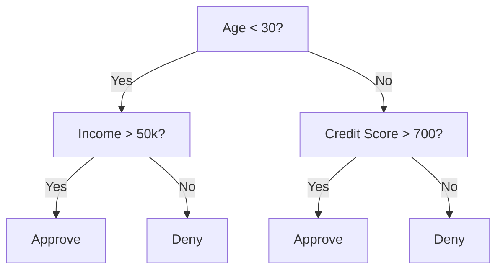
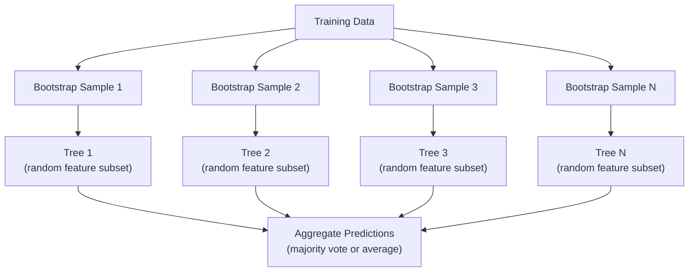

# 决策树和随机森林

决策树本质上就是流程图。但由多个决策树组成的系统是机器学习中最强大的工具之一。

**类型：**构建
**语言：**Python
**先决条件：**第一阶段（第09课信息论，第06课概率）
**时间：**约90分钟

## 学习目标

- Implement calculations of Gini impurity, entropy, and information gain to find optimal decision tree splits
- Build a decision tree classifier from scratch with pre-pruning controls (max depth, min samples)
- Construct a random forest using bootstrap sampling and feature randomization, and explain why it reduces variance
- Compare MDI feature importance with permutation importance and identify when MDI is biased

## 问题

您有表格数据。行是样本，列是特征，您想要预测的目标列也在这里。您可以尝试使用神经网络来处理这些数据。但对于表格数据，基于树的模型（决策树、随机森林、梯度提升树）的表现通常优于深度学习。在结构化数据的Kaggle竞赛中，XGBoost和LightGBM占主导地位，而不是Transformer模型。

为什么？因为树木可以处理混合类型特征（数值型和分类型）而无需预处理。它们能够处理非线性关系而无需进行特征工程。此外，树木具有可解释性：您可以查看树的结构，从而确切了解预测的原因。而随机森林通过平均多个树的性能，在中等规模的数据集上具有很强的泛化能力。

本课程将从零开始构建决策树，使用递归分割方法，然后再构建随机森林。您将实现分割标准背后的数学原理（基尼不纯度、熵、信息增益），并理解为什么弱学习器的集合能够成为强大的学习器。

## 概念

### 决策树的作用

决策树通过一系列是/否问题将特征空间划分为矩形区域。



每个内部节点都会根据阈值测试某个特征。每个叶节点进行预测。为了对新数据点进行分类，从根节点开始，沿着分支继续直到到达叶节点。

该树是通过在每个节点选择最能区分数据的特征和阈值来从上往下构建的。“最佳”是由分割标准定义的。

### 分割标准：测量杂质

在每个节点上，我们有一组样本。我们希望将它们分割，使得生成的子节点尽可能“纯净”，即每个子节点主要包含一个类别。

**基尼不纯度**用于衡量如果随机选择的样本根据该节点的类别分布进行标记时，被错误分类的概率。

```
Gini(S) = 1 - sum(p_k^2)

where p_k is the proportion of class k in set S.
```

对于纯节点（仅一个类），Gini值为0。对于二分划分，即两个类别各占一半，Gini值为0.5。数值越低越好。

```
Example: 6 cats, 4 dogs

Gini = 1 - (0.6^2 + 0.4^2) = 1 - (0.36 + 0.16) = 0.48
```

**熵**用于衡量节点中的信息含量（无序程度）。详见第一阶段第09课。

```
Entropy(S) = -sum(p_k * log2(p_k))
```

对于纯节点，熵值为0。对于50/50的二进制分割，熵值为1.0。数值越低越好。

```
Example: 6 cats, 4 dogs

Entropy = -(0.6 * log2(0.6) + 0.4 * log2(0.4))
        = -(0.6 * -0.737 + 0.4 * -1.322)
        = 0.442 + 0.529
        = 0.971 bits
```

**信息增益**是指分割后杂质（熵或吉尼系数）的减少。

```
IG(S, feature, threshold) = Impurity(S) - weighted_avg(Impurity(S_left), Impurity(S_right))

where the weights are the proportions of samples in each child.
```

在每个节点使用贪婪算法：尝试每个特征和每个可能的阈值。选择能够最大化信息增益的（特征，阈值）对。

### 如何工作：

对于当前节点中具有 n 个特征和 m 个样本的数据集：

1. 对于每个特征 j（j = 1 到 n）：
   - 按特征 j 对样本进行排序
   - 尝试连续不同值之间的每个中点作为阈值
   - 计算每个阈值的信息增益
2. 选择信息增益最高的特征和阈值
3. 将数据分为左部分（特征 <= 阈值）和右部分（特征 > 阈值）
4. 对每个子节点递归处理

这种贪婪方法不能保证全局最优树。找到最优树是 NP-hard 问题。但在实践中，贪婪分割方法效果良好。

### 停止条件

Without stopping conditions, the tree grows until every leaf is pure (one sample per leaf). This perfectly memorizes the training data and generalizes terribly.

**Pre-pruning** stops the tree before it fully grows:
- Maximum depth: stop splitting when the tree reaches a set depth
- Minimum samples per leaf: stop if a node has fewer than k samples
- Minimum information gain: stop if the best split improves impurity by less than a threshold
- Maximum leaf nodes: limit the total number of leaves

**Post-pruning** grows the full tree, then trims it back:
- Cost-complexity pruning (used by scikit-learn): adds a penalty proportional to the number of leaves. Increase the penalty to get smaller trees
- Reduced error pruning: remove a subtree if the validation error does not increase

Pre-pruning is simpler and faster. Post-pruning often produces better trees because it does not prematurely stop splits that might lead to useful further splits.

### 回归决策树

在回归分析中，叶预测是指该叶中目标值的均值。分割标准也发生了改变：

**方差减少**取代了信息增益：

```
VR(S, feature, threshold) = Var(S) - weighted_avg(Var(S_left), Var(S_right))
```

选择能最大程度减少方差的分割方式。树结构将输入空间划分为多个区域，并在每个区域内预测一个常数（即均值）。

### 随机森林：集成学习的力量

一个决策树具有较高的方差。数据的微小变化可能会产生完全不同的树结构。随机森林通过平均多个树来解决这个问题。



两种随机性来源使得树结构具有多样性：

**Bagging（自举聚合）：** 每棵树都是基于自举样本进行训练的，自举样本是从训练数据中抽取的可替换的随机样本。大约63%的原始样本会出现在每次自举中（其余的是非袋样本，可用于验证）。

**特征随机化：** 在每次分割时，只考虑一部分随机特征。对于分类问题，默认值是sqrt(n_features)。对于回归问题，是n_features/3。这可以防止所有树都基于同一主导特征进行分割。

关键见解：平均多个无关联的树可以减少方差而不增加偏差。每棵单独的树可能都很普通，但集成后的效果却很强。

### 特征重要性

随机森林自然提供了特征重要性得分。最常用的方法：

**纯度减少平均值（MDI）：** 对于每个特征，计算该特征在所有树和所有使用该特征的节点中纯度的总减少量。在更早的分割点处产生更大纯度减少的特征更为重要。

```
importance(feature_j) = sum over all nodes where feature_j is used:
    (n_samples_at_node / n_total_samples) * impurity_decrease
```

This method is fast (computed during training), but it favors features with high cardinality and those that have multiple possible split points.

**Permutation importance** is an alternative approach: shuffle the values of a feature and measure the decrease in the model’s accuracy. It is more reliable, but slower.

### 当树木击败神经网络时

树木和森林在表格数据上主导神经网络的应用。原因有以下几点：

| 因素 | 树结构 | 神经网络 |
|------|-------|---------|
| 混合类型（数值+分类） | 原生支持 | 需要编码处理 |
| 小型数据集（小于10k行） | 表现良好 | 过拟合 |
| 特征交互 | 通过分割发现 | 需要架构设计 |
| 可解释性 | 完全透明 | 黑箱问题 |
| 训练时间 | 分钟级 | 小时级 |
| 超参数敏感性 | 低 | 高 |

当数据具有空间或序列结构时（如图像、文本、音频），神经网络更具优势。对于特征呈平面分布的表格，树结构是默认选择。

```figure
decision-tree-depth
```

## 构建它

### 步骤1：基尼不纯度和熵

从零开始构建两种分割标准，并验证它们对哪些分割是有效的意见一致。

```python
import math

def gini_impurity(labels):
    n = len(labels)
    if n == 0:
        return 0.0
    counts = {}
    for label in labels:
        counts[label] = counts.get(label, 0) + 1
    return 1.0 - sum((c / n) ** 2 for c in counts.values())

def entropy(labels):
    n = len(labels)
    if n == 0:
        return 0.0
    counts = {}
    for label in labels:
        counts[label] = counts.get(label, 0) + 1
    return -sum(
        (c / n) * math.log2(c / n) for c in counts.values() if c > 0
    )
```

### 步骤2：找到最佳分割点

尝试所有功能和所有阈值。返回信息增益最高的那个。

```python
def information_gain(parent_labels, left_labels, right_labels, criterion="gini"):
    measure = gini_impurity if criterion == "gini" else entropy
    n = len(parent_labels)
    n_left = len(left_labels)
    n_right = len(right_labels)
    if n_left == 0 or n_right == 0:
        return 0.0
    parent_impurity = measure(parent_labels)
    child_impurity = (
        (n_left / n) * measure(left_labels) +
        (n_right / n) * measure(right_labels)
    )
    return parent_impurity - child_impurity
```

### 步骤3：构建DecisionTree类

递归分割、预测和特征重要性跟踪。

```python
class DecisionTree:
    def __init__(self, max_depth=None, min_samples_split=2,
                 min_samples_leaf=1, criterion="gini",
                 max_features=None):
        self.max_depth = max_depth
        self.min_samples_split = min_samples_split
        self.min_samples_leaf = min_samples_leaf
        self.criterion = criterion
        self.max_features = max_features
        self.tree = None
        self.feature_importances_ = None

    def fit(self, X, y):
        self.n_features = len(X[0])
        self.feature_importances_ = [0.0] * self.n_features
        self.n_samples = len(X)
        self.tree = self._build(X, y, depth=0)
        total = sum(self.feature_importances_)
        if total > 0:
            self.feature_importances_ = [
                fi / total for fi in self.feature_importances_
            ]

    def predict(self, X):
        return [self._predict_one(x, self.tree) for x in X]
```

### 步骤4：构建RandomForest类

Bootstrap抽样、特征随机化以及多数投票。

```python
class RandomForest:
    def __init__(self, n_trees=100, max_depth=None,
                 min_samples_split=2, max_features="sqrt",
                 criterion="gini"):
        self.n_trees = n_trees
        self.max_depth = max_depth
        self.min_samples_split = min_samples_split
        self.max_features = max_features
        self.criterion = criterion
        self.trees = []

    def fit(self, X, y):
        n = len(X)
        for _ in range(self.n_trees):
            indices = [random.randint(0, n - 1) for _ in range(n)]
            X_boot = [X[i] for i in indices]
            y_boot = [y[i] for i in indices]
            tree = DecisionTree(
                max_depth=self.max_depth,
                min_samples_split=self.min_samples_split,
                max_features=self.max_features,
                criterion=self.criterion,
            )
            tree.fit(X_boot, y_boot)
            self.trees.append(tree)

    def predict(self, X):
        all_preds = [tree.predict(X) for tree in self.trees]
        predictions = []
        for i in range(len(X)):
            votes = {}
            for preds in all_preds:
                v = preds[i]
                votes[v] = votes.get(v, 0) + 1
            predictions.append(max(votes, key=votes.get))
        return predictions
```

请参阅 `code/trees.py` 以获取包含所有辅助方法的完整实现。

## 使用它

使用 scikit-learn，训练随机森林只需三行代码：

```python
from sklearn.ensemble import RandomForestClassifier
from sklearn.datasets import load_iris
from sklearn.model_selection import train_test_split

X, y = load_iris(return_X_y=True)
X_train, X_test, y_train, y_test = train_test_split(X, y, random_state=42)

rf = RandomForestClassifier(n_estimators=100, random_state=42)
rf.fit(X_train, y_train)
print(f"Accuracy: {rf.score(X_test, y_test):.4f}")
print(f"Feature importances: {rf.feature_importances_}")
```

在实践中，梯度提升树（如XGBoost、LightGBM、CatBoost）通常比随机森林更强大，因为它们是顺序构建树的，每棵树都会纠正前一棵树的错误。但随机森林更难配置错误，且几乎不需要超参数调优。

## 发货

本课程生成了`outputs/prompt-tree-interpreter.md`文件——一个用于向业务利益相关者解释决策树分割的提示词。输入训练有素的树的结构（深度、特征、分割阈值、准确率），它会将模型转换为通俗易懂的规则，评估特征的重要性，指出过拟合或泄露问题，并推荐下一步行动。当你需要向不读代码的人解释基于树的模型时，可以使用此工具。

## 练习

1. Train a single decision tree on a 2D dataset with 3 classes. Manually trace the splits and draw the rectangular decision boundaries. Compare the boundaries at max_depth=2 vs max_depth=10.

2. Implement variance reduction splitting for regression trees. Generate y = sin(x) + noise for 200 points and fit your regression tree. Plot the tree's piecewise-constant predictions against the true curve.

3. Build a random forest with 1, 5, 10, 50, and 200 trees. Plot training accuracy and test accuracy vs number of trees. Observe that test accuracy plateaus but does not decrease (forests resist overfitting).

4. Compare Gini impurity vs entropy as split criteria on 5 different datasets. Measure accuracy and tree depth. In most cases, they produce nearly identical results. Explain why.

5. Implement permutation importance. Compare it with MDI importance on a dataset where one feature is random noise but has high cardinality. MDI will rank the noise feature highly. Permutation importance will not.

## | 关键词 | 翻译 |

| 术语 | 人们怎么说 | 实际含义 |
|------|------------|----------|
| 决策树 | “预测流程图” | 通过学习一系列if/else分割将特征空间划分为矩形区域的模型 |
| 基尼不纯度 | “节点的混合程度” | 节点处随机样本被错误分类的概率。0 = 纯净，0.5 = 二分类的最大不纯度 |
| 熵 | “节点的无序度” | 节点处的信息含量。0 = 纯净，1.0 = 二分类的最大不确定性。来自信息论 |
| 信息增益 | “分割的好坏程度” | 分割后不纯度的减少量。选择分割的贪婪准则 |
| 预剪枝 | “提前停止树的增长” | 通过设置最大深度、最小样本数或最小增益阈值来提前停止树的生长 |
| 后剪枝 | “之后修剪树” | 先生成完整树，然后移除不会改善验证性能的子树 |
| 装袋法 | “在随机子集上训练” | 自助聚合。在每个不同的随机样本上进行有放回的训练 |
| 随机森林 | “一堆树” | 决策树的集合，每棵树都在自助样本中通过随机特征子集进行训练 |
| 特征重要性（MDI） | “哪些特征重要” | 所有树和节点中每个特征带来的总不纯度减少量之和 |
| 排列重要性 | “随机打乱并检查” | 当特征值被随机打乱时准确度的下降。对于噪声特征，比MDI更可靠 |
| 方差降低 | “信息增益的回归版本” | 信息增益的回归树类比。选择减少目标方差最大的分割 |
| 自助样本 | “带有重复次的随机样本” | 从原始数据集中有放回地抽取出的随机样本。大小相同，但包含重复项 |

## 更多阅读资料

- [Breiman: Random Forests (2001)](https://link.springer.com/article/10.1023/A:1010933404324) - the original paper on random forests  
- [Grinsztajn et al.: Why do tree-based models still outperform deep learning on tabular data? (2022)](https://arxiv.org/abs/2207.08815) - a rigorous comparison of tree-based models vs neural networks on tabular data  
- [scikit-learn Decision Trees documentation](https://scikit-learn.org/stable/modules/tree.html) - a practical guide with visualization tools  
- [XGBoost: A Scalable Tree Boosting System (Chen & Guestrin, 2016)](https://arxiv.org/abs/1603.02754) - the gradient boosting paper that dominates Kaggle competitions
