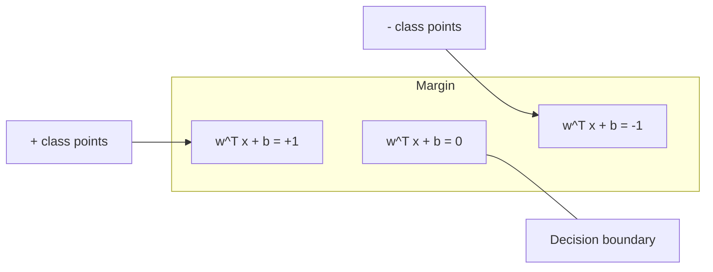
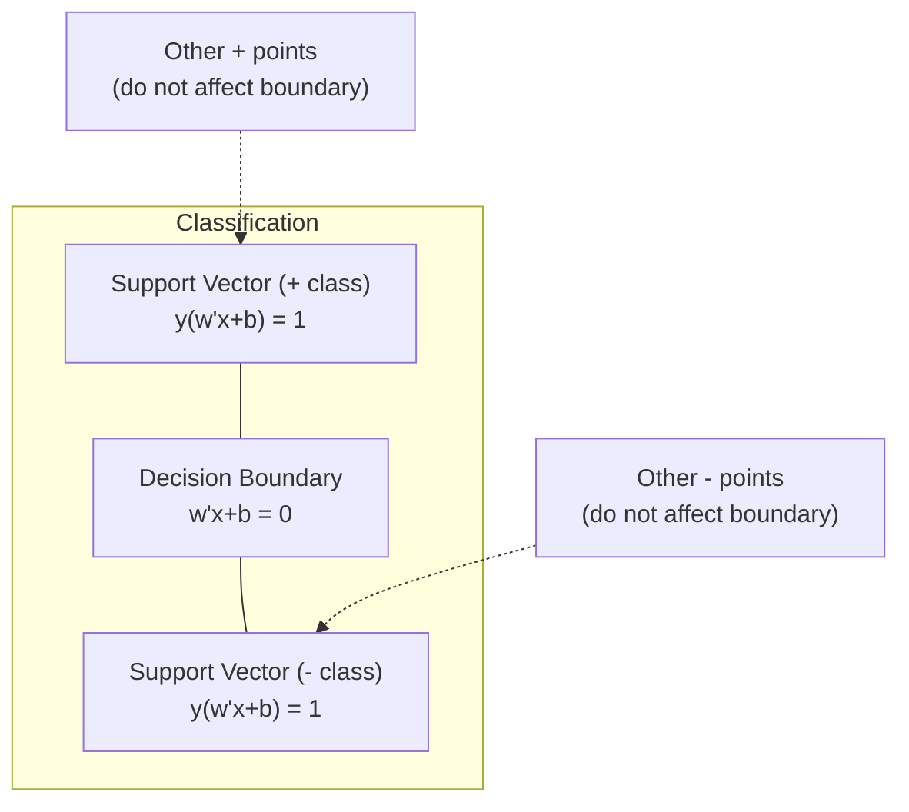
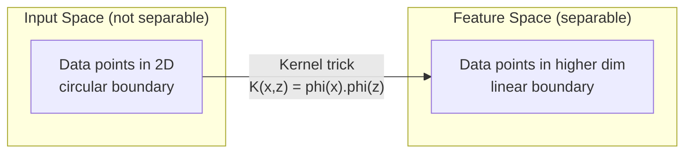

# 支持向量机

找到两个班级之间最宽的街道。这就是整个概念。

**类型：**构建
**语言：**Python
**先决条件：**第一阶段（课程08优化，14规范与距离，18凸优化）
**时间：**约90分钟

## 学习目标

- Implement a linear SVM from scratch using hinge loss and gradient descent on the primal formulation
- Explain the maximum margin principle and identify support vectors from a trained model
- Compare linear, polynomial, and RBF kernels and explain how the kernel trick avoids explicit high-dimensional mapping
- Evaluate the tradeoff controlled by the C parameter between margin width and classification errors

## 问题

您有两类数据点，需要画一条线（或超平面）将它们分开。无限多条线都可以使用。您应该选择哪一条呢？

选择边际最大的那条线。边际是指决策边界与两侧最近的数据点之间的距离。更大的边际意味着分类器更有信心，并且能够更好地泛化到未见过的数据。

这种直觉导致了支持向量机的诞生，这是机器学习中最数学上优雅的算法之一。在深度学习之前，SVM是主要的分类方法，对于小型数据集、高维数据以及需要原则性、易于理解的模型并带有理论保证的问题，SVM仍然是最佳选择。

SVM直接关联到第一阶段：优化是凸的（第18课），边际用范数来衡量（第14课），核技巧利用点积来处理非线性边界，而无需在高维空间中进行计算。

## 概念

### 最大边际分类器

对于线性可分离的数据，其标签为y_i，属于{-1, +1}，并且特征向量为x_i，我们希望找到一个超平面w^T x + b = 0来分隔这些类别。

点x_i到超平面的距离是：

```
distance = |w^T x_i + b| / ||w||
```

正确分类的点为：y_i * (w^T x_i + b) > 0。该边际值是超平面到两侧最近点的距离的两倍。



优化问题：

```
maximize    2 / ||w||     (the margin width)
subject to  y_i * (w^T x_i + b) >= 1  for all i
```

等效地（最小化 ||w||^2 更容易优化）：

```
minimize    (1/2) ||w||^2
subject to  y_i * (w^T x_i + b) >= 1  for all i
```

这是一个凸二次规划问题。它有一个唯一的全局解。恰好位于边界上的数据点（即 y_i * (w^T x_i + b) = 1）是支持向量。它们是决定决策边界的唯一点。移动或移除任何非支持向量的点，边界都不会改变。

### 支持向量：那关键的少数



大多数训练点都是不相关的。只有支持向量才重要。这就是为什么SVM在预测时具有内存效率：你只需要存储支持向量，而不需要整个训练集。

支持向量的数量也决定了泛化误差的界限。相对于数据集大小而言，较少的支持向量意味着更好的泛化能力。

### 软边距：使用C参数处理噪声

真实数据很少能完美分离。某些点可能位于边界的错误一侧，或者处于边缘内。软边距公式通过引入松弛变量来允许这些违规情况的发生。

```
minimize    (1/2) ||w||^2 + C * sum(xi_i)
subject to  y_i * (w^T x_i + b) >= 1 - xi_i
            xi_i >= 0  for all i
```

slack变量xi_i用于衡量第i个点违反边界的程度。C控制这种权衡：

| C值     | 行为       |
|---------|----------|
| 大C     | 严重惩罚违规情况。边界较窄，误分类较少。过拟合 |
| 小C     | 允许更多违规情况。边界宽，误分类较多。欠拟合 |

C是正则化强度，取反值。大C表示正则化较弱。小C表示正则化较强。

### Hinge loss: the SVM loss function

软边距SVM可以重写为无约束优化问题：

```
minimize    (1/2) ||w||^2 + C * sum(max(0, 1 - y_i * (w^T x_i + b)))
```

术语max(0, 1 - y_i * f(x_i))称为铰链损失。当点被正确分类且位于边界之外时，该值为零。当点位于边界内或分类错误时，此值为线性。

```
Hinge loss for a single point:

loss
  |
  | \
  |  \
  |   \
  |    \
  |     \_______________
  |
  +-----|-----|-------->  y * f(x)
       0     1

Zero loss when y*f(x) >= 1 (correctly classified, outside margin).
Linear penalty when y*f(x) < 1.
```

与逻辑损失（逻辑回归）进行比较：

```
Hinge:     max(0, 1 - y*f(x))          Hard cutoff at margin
Logistic:  log(1 + exp(-y*f(x)))        Smooth, never exactly zero
```

Hinge loss generates sparse solutions (only support vectors have non-zero contributions). Logistic loss utilizes all data points. This makes SVMs more memory-efficient during prediction.

### Training a Linear SVM with Gradient Descent

You can train a linear SVM using gradient descent with hinge loss and L2 regularization, without solving the constrained QP:

```
L(w, b) = (lambda/2) * ||w||^2 + (1/n) * sum(max(0, 1 - y_i * (w^T x_i + b)))

Gradient with respect to w:
  If y_i * (w^T x_i + b) >= 1:  dL/dw = lambda * w
  If y_i * (w^T x_i + b) < 1:   dL/dw = lambda * w - y_i * x_i

Gradient with respect to b:
  If y_i * (w^T x_i + b) >= 1:  dL/db = 0
  If y_i * (w^T x_i + b) < 1:   dL/db = -y_i
```

这被称为原始公式化方法。它的运行时间为每周期 O(n * d)，其中 n 是样本数量，d 是特征数量。对于大型、稀疏、高维数据（文本分类），这种方法非常快速。

### 双重公式化和核心技巧

SVM问题的拉格朗日对偶（来自第一阶段第18课，KKT条件）是：

```
maximize    sum(alpha_i) - (1/2) * sum_ij(alpha_i * alpha_j * y_i * y_j * (x_i . x_j))
subject to  0 <= alpha_i <= C
            sum(alpha_i * y_i) = 0
```

This dual concept only involves the dot product x_i × x_j between data points. This is the key insight. By replacing each dot product with a kernel function K(x_i, x_j), the SVM can learn non-linear boundaries without ever explicitly calculating the transformation.

```
Linear kernel:      K(x, z) = x . z
Polynomial kernel:  K(x, z) = (x . z + c)^d
RBF (Gaussian):     K(x, z) = exp(-gamma * ||x - z||^2)
```

RBF核将数据映射到无限维空间。在输入空间中距离较近的点，其核值接近1；距离较远的点，其核值接近0。它可以学习任何平滑的决策边界。



内核技巧可以在不进入高维空间的情况下计算点积。对于在D个维度上的d次多项式核，显式特征空间的维度为O(D^d)。但K(x, z)的计算时间仅为O(D)。

### SVM for regression (SVR)

支持向量回归会在数据周围形成一个宽度为epsilon的管道。位于管道内的点损失为零，而位于管道外的点会受到线性惩罚。

```
minimize    (1/2) ||w||^2 + C * sum(xi_i + xi_i*)
subject to  y_i - (w^T x_i + b) <= epsilon + xi_i
            (w^T x_i + b) - y_i <= epsilon + xi_i*
            xi_i, xi_i* >= 0
```

epsilon参数控制管子的宽度。管子越宽，支撑向量越少，拟合效果越平滑；管子越窄，支撑向量越多，拟合效果越紧密。

### 为什么支持向量机在深度学习面前失势了（以及何时它们仍然具有优势）

从20世纪90年代末到2010年代初，支持向量机在机器学习领域占据主导地位。深度学习因多种原因超越了它：

| 因素 | 支持向量机 | 深度学习 |
|------|------------|-----------|
| 特征工程 | 需要人工处理 | 学习特征 |
| 可扩展性 | 对于核函数为O(n^2)至O(n^3)，对于SGD则为O(n)每周期 | |
| 图像/文本/音频 | 需要手工构建特征 | 从原始数据中学习 |
| 大型数据集（>10万） | 速度慢 | 扩展性好 |
| GPU加速 | 优势有限 | 大幅提升速度 |

支持向量机在这些情况下仍然具有优势：
- 小型数据集（数百到数千样本）
- 高维稀疏数据（带有TF-IDF特征的文本）
- 需要数学保证时（边界条件）
- 训练时间必须最小化时（线性SVM非常快速）
- 具有清晰边界结构的二元分类
- 异常检测（单类SVM）

```figure
svm-margin
```

## 构建它

### 步骤1：Hinge损失和梯度

基础。批次计算中的权重损失及其梯度。

```python
def hinge_loss(X, y, w, b):
    n = len(X)
    total_loss = 0.0
    for i in range(n):
        margin = y[i] * (dot(w, X[i]) + b)
        total_loss += max(0.0, 1.0 - margin)
    return total_loss / n
```

### 步骤2：通过梯度下降算法实现线性SVM

通过最小化正则化铰链损失来训练。不需要QP求解器。

```python
class LinearSVM:
    def __init__(self, lr=0.001, lambda_param=0.01, n_epochs=1000):
        self.lr = lr
        self.lambda_param = lambda_param
        self.n_epochs = n_epochs
        self.w = None
        self.b = 0.0

    def fit(self, X, y):
        n_features = len(X[0])
        self.w = [0.0] * n_features
        self.b = 0.0

        for epoch in range(self.n_epochs):
            for i in range(len(X)):
                margin = y[i] * (dot(self.w, X[i]) + self.b)
                if margin >= 1:
                    self.w = [wj - self.lr * self.lambda_param * wj
                              for wj in self.w]
                else:
                    self.w = [wj - self.lr * (self.lambda_param * wj - y[i] * X[i][j])
                              for j, wj in enumerate(self.w)]
                    self.b -= self.lr * (-y[i])

    def predict(self, X):
        return [1 if dot(self.w, x) + self.b >= 0 else -1 for x in X]
```

### 步骤3：内核函数

实现线性、多项式和RBF核函数。

```python
def linear_kernel(x, z):
    return dot(x, z)

def polynomial_kernel(x, z, degree=3, c=1.0):
    return (dot(x, z) + c) ** degree

def rbf_kernel(x, z, gamma=0.5):
    diff = [xi - zi for xi, zi in zip(x, z)]
    return math.exp(-gamma * dot(diff, diff))
```

### 步骤4：边缘和支持向量识别

训练完成后，识别哪些点是支持向量，并计算宽度。

```python
def find_support_vectors(X, y, w, b, tol=1e-3):
    support_vectors = []
    for i in range(len(X)):
        margin = y[i] * (dot(w, X[i]) + b)
        if abs(margin - 1.0) < tol:
            support_vectors.append(i)
    return support_vectors
```

请参阅`code/svm.py`以获取包含所有示例的完整实现。

## 使用它

使用 scikit-learn：

```python
from sklearn.svm import SVC, LinearSVC, SVR
from sklearn.preprocessing import StandardScaler
from sklearn.pipeline import Pipeline

clf = Pipeline([
    ("scaler", StandardScaler()),
    ("svm", SVC(kernel="rbf", C=1.0, gamma="scale")),
])
clf.fit(X_train, y_train)
print(f"Accuracy: {clf.score(X_test, y_test):.4f}")
print(f"Support vectors: {clf['svm'].n_support_}")
```

重要提示：在训练SVM之前，务必调整特征规模。SVM对特征大小非常敏感，因为边界依赖于||w||，未经缩放的特征会扭曲几何形状。

对于大型数据集，使用`LinearSVC`（原始形式，每轮O(n)）而不是`SVC`（对偶形式，O(n^2)至O(n^3))：

```python
from sklearn.svm import LinearSVC

clf = Pipeline([
    ("scaler", StandardScaler()),
    ("svm", LinearSVC(C=1.0, max_iter=10000)),
])
```

## 练习

1. Generate a 2D linearly separable dataset. Train your LinearSVM and identify the support vectors. Verify that the support vectors are the points closest to the decision boundary.

2. Vary C from 0.001 to 1000 on a noisy dataset. Plot the decision boundary for each C value. Observe the transition from wide margin (underfitting) to narrow margin (overfitting).

3. Create a dataset where class boundaries are circular (not linear). Show that a linear SVM fails. Compute the RBF kernel matrix and show that the classes become separable in the kernel-induced feature space.

4. Compare hinge loss vs logistic loss on the same dataset. Train a linear SVM and logistic regression. Count how many training points contribute to each model's decision boundary (support vectors vs all points).

5. Implement SVR (epsilon-insensitive loss). Fit it to y = sin(x) + noise. Plot the epsilon tube around the predictions and highlight the support vectors (points outside the tube).

## | 关键词 | 翻译 |

| 术语 | 实际含义 |
|------|----------------|
| 支持向量 | 距离决策边界最近的训练点。决定超平面的唯一点 |
| 边际 | 决策边界与最近支持向量之间的距离。SVM会最大化此值 |
| Hinge损失 | max(0, 1 - y*f(x))。当分类正确且位于边际之外时为零。否则为线性惩罚 |
| C参数 | 边际宽度与分类错误之间的权衡。C越大，边际越窄；C越小，边际越宽 |
| 软边际 | SVM的一种表述方式，允许通过松弛变量违反边际。处理不可分离数据 |
| 核技巧 | 在高维特征空间中计算点积，而不显式映射到该空间 |
| 线性核 | K(x, z) = x . z。相当于标准点积。适用于线性可分离数据 |
| RBF核 | K(x, z) = exp(-gamma * \|\|x-z\|\|^2)。映射到无限维度。学习任何平滑边界 |
| 多项式核 | K(x, z) = (x . z + c)^d。映射到多项式组合的特征空间 |
| 对偶表述 | 仅依赖于数据点之间点积的SVM问题的重新表述。支持使用核函数 |
| SVR | 支持向量回归。在数据周围拟合一个epsilon管。管内的点损失为零 |
| 松弛变量 | xi_i：衡量一个点违反边际的程度。对于正确分类且位于边际之外的点，值为零 |
| 最大边际 | 选择最大化到最近各类点的距离的超平面的原则 |

## 更多阅读资料

- [Vapnik: The Nature of Statistical Learning Theory (1995)](https://link.springer.com/book/10.1007/978-1-4757-3264-1) - 关于SVM和统计学习的基础文献  
- [Cortes & Vapnik: Support-vector networks (1995)](https://link.springer.com/article/10.1007/BF00994018) - 原始SVM论文  
- [Platt: Sequential Minimal Optimization (1998)](https://www.microsoft.com/en-us/research/publication/sequential-minimal-optimization-a-fast-algorithm-for-training-support-vector-machines/) - 使SVM训练变得实用的SMO算法  
- [scikit-learn SVM文档](https://scikit-learn.org/stable/modules/svm.html) - 包含实现细节的实用指南  
- [LIBSVM: A Library for Support Vector Machines](https://www.csie.ntu.edu.tw/~cjlin/libsvm/) - 大多数SVM实现的C++库
