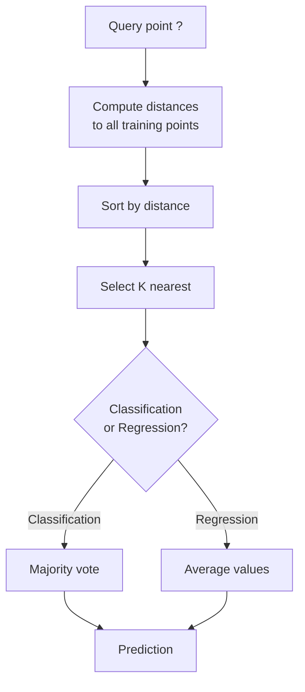
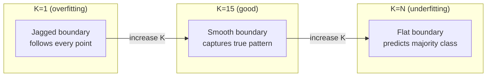
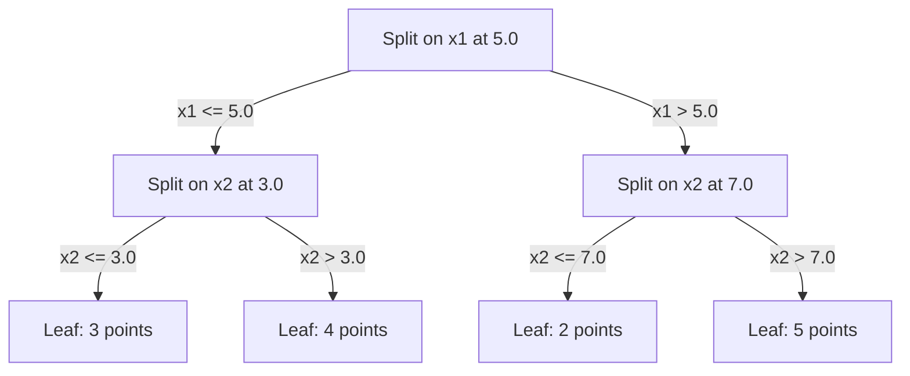

# K-近邻和距离

存储所有内容。通过观察邻近节点来预测结果。这是真正有效的简单算法。

**类型：** 构建
**语言：** Python
**先决条件：** 第一阶段（第14课 规范和距离）
**时间：** 约90分钟

## 学习目标

- Implement KNN classification and regression from scratch with configurable K and distance-weighted voting
- Compare L1, L2, cosine, and Minkowski distance metrics and select the appropriate one for a given data type
- Explain the curse of dimensionality and demonstrate why KNN degrades in high-dimensional spaces
- Build a KD-tree for efficient nearest neighbor search and analyze when it outperforms brute-force

## 问题

您有一个数据集。一个新的数据点出现了。您需要对其进行分类或预测其值。与从数据中学习参数（如线性回归或SVM）不同，您只需找到最接近新点的K个训练点，让它们进行投票。

这就是K最近邻算法。没有训练阶段。无需学习参数。无需最小化损失函数。您在预测时存储整个训练集并计算距离。

这听起来似乎太简单了。但KNN在许多问题中表现出惊人的竞争力，尤其是对于小型到中型数据集而言。深入理解它可以揭示一些基本概念：距离度量的选择（与第14课相关）、维数灾难以及懒惰学习与积极学习之间的区别。

KNN在现代AI中随处可见，只是名称不同。向量数据库对嵌入数据进行K最近邻搜索。检索增强生成技术找到K个最近的文档片段。推荐系统寻找相似的用户或物品。算法相同，只是规模和数据结构有所不同。

## 概念

### KNN works by using a decision tree to classify data points into different categories based on their similarities. The algorithm takes each data point and compares it with the data points in the training set that belong to the same category. If the similarity between the two data points is high, they are likely to belong to the same category. This process is repeated for all data points until a decision tree is formed. When new data points are encountered, they are first classified using KNN and then further processed based on their classification.

给定一个带有标签的点数据集和一个新的查询点：

1. 计算查询点与数据集中每个点之间的距离
2. 按距离排序
3. 选取最近的K个点
4. 对于分类问题：在K个邻近点中采用多数投票
5. 对于回归问题：计算K个邻近点的数值的平均值（或加权平均值）



这就是整个算法。没有拟合，没有梯度下降，也没有周期。

### 选择K

K 是唯一的超参数，它控制着偏差-方差权衡：

| K | 行为 |
|---|------|
| K = 1 | 决策边界与每个点一致。训练误差为零。方差高。过拟合 |
| 小 K (3-5) | 对局部结构敏感。能捕捉复杂的边界 |
| 大 K | 边界更平滑。对噪声更鲁棒。可能欠拟合 |
| K = N | 预测每个点的多数类。偏差最大 |

常见的起始值是 K = sqrt(N)，适用于有 N 个点的数据集。在二元分类中，使用奇数 K 以避免平局情况。



### 距离度量

距离函数定义了“近”的含义。不同的度量标准会产生不同的邻近节点，从而得出不同的预测结果。

**L2（欧几里得）**是默认方式。即直线距离。

```
d(a, b) = sqrt(sum((a_i - b_i)^2))
```

对特征规模敏感。在使用KNN的L2算法之前，始终要对特征进行标准化。

**L1（曼哈顿）**计算绝对差异之和。相比L2，它对异常值的鲁棒性更强，因为它不会将差异平方。

```
d(a, b) = sum(|a_i - b_i|)
```

**余弦距离**用于测量向量之间的角度，不考虑其大小。这对于文本处理和嵌入数据非常重要。

```
d(a, b) = 1 - (a . b) / (||a|| * ||b||)
```

**Minkowski** 通过参数 p 对 L1 和 L2 进行推广。

```
d(a, b) = (sum(|a_i - b_i|^p))^(1/p)

p=1: Manhattan
p=2: Euclidean
p->inf: Chebyshev (max absolute difference)
```

Which metric to use depends on the data:

| 数据类型 | 最佳指标 | 原因 |
|-----------|------------|-----|
| 数值特征，相似尺度 | L2（欧几里得） | 默认选项，适用于空间数据 |
| 数值特征，异常值 | L1（曼哈顿） | 稳健，不会放大巨大差异 |
| 文本嵌入 | 余弦 | 幅度为噪声，方向具有意义 |
| 高维稀疏数据 | 余弦或L1 | L2受维度诅咒影响 |
| 混合类型 | 自定义距离 | 根据特征类型组合使用指标 |

### Weighted KNN

标准KNN对所有邻居给予相同的权重。但是，距离为0.1的邻居应该比距离为5.0的邻居更重要。

**距离加权KNN**通过距离对每个邻居的权重进行反向计算：

```
weight_i = 1 / (distance_i + epsilon)

For classification: weighted vote
For regression:     weighted average = sum(w_i * y_i) / sum(w_i)
```

当查询点与训练点完全匹配时，epsilon值可以防止除以零的情况发生。权重KNN对K的选择敏感度较低，因为距离较远的邻居点对结果贡献很小。

### 维度的诅咒

在高维度下，KNN算法的性能会下降。这不是一个模糊的问题，而是一个数学事实。

**问题1：距离趋于一致。**随着维度的增加，最大距离与最小距离的比值趋近于1。所有点都变得同样“遥远”于查询点。

```
In d dimensions, for random uniform points:

d=2:    max_dist / min_dist = varies widely
d=100:  max_dist / min_dist ~ 1.01
d=1000: max_dist / min_dist ~ 1.001

When all distances are nearly equal, "nearest" is meaningless.
```

**问题2：体积激增。**为了捕捉数据中固定比例内的K个邻居，你需要扩大搜索半径，以覆盖更多特征空间。在高维度中，“邻域”涵盖了大部分空间。

**问题3：角落占主导。**在d维的单位超立方体中，大部分体积集中在角落附近，而不是中心。当d增加时，内切于立方体的球体所包含的体积比例会急剧减少。

实际后果：KNN在大约20-50个特征范围内表现良好。超过这个数量后，你需要在应用KNN之前进行降维处理（如PCA、UMAP、t-SNE），或者需要使用基于树的搜索结构来利用数据的固有较低维度特性。

### KD-tree：快速最近邻搜索

brute-force KNN 计算查询点与每个训练点之间的距离。这意味着每个查询需要 O(n * d) 的时间。对于大型数据集，这太慢了。

KD树通过特征轴递归地划分空间。在每个层级，它沿着中位数值的一个维度进行分割。



To find the nearest neighbor, traverse the tree to the leaf containing the query, then backtrack and check neighboring partitions only if they could contain closer points.

Average query time: O(log n) for low dimensions. But KD-trees degrade to O(n) in high dimensions (d > 20) because the backtracking eliminates fewer and fewer branches.

### 球树：更适合中等尺寸

球树将数据划分为嵌套的超球体，而不是轴对齐的盒子。每个节点定义一个球体（中心 + 半径），该球体包含该子树中的所有点。

与KD树的相比优势：
- 在中等维度下表现更好（最多约50）
- 能够处理非轴对齐结构
- 更严格的边界体积意味着在搜索过程中会修剪更多的分支

KD树和球树都是精确算法。对于真正的大规模搜索（数百万个点，数百个维度），则使用近似最近邻方法（HNSW、IVF、乘积量化）。这些在第1阶段第14课中介绍。

### 懒惰学习与积极学习

KNN是一种懒惰的学习算法：它在训练时不做任何工作，所有工作都在预测时进行。大多数其他算法（线性回归、SVM、神经网络）则是积极学习算法：它们在训练时进行大量计算以构建紧凑的模型，然后预测速度很快。

| 方面 | 懒惰型（KNN） | 积极型（SVM、神经网络） |
|------|------------|------------------------|
| 训练时间 | 仅存储数据，O(1) | O(n * epochs) |
| 预测时间 | 每次查询O(n * d) | O(d)或O(参数) |
| 预测时的内存占用 | 存储整个训练集 | 仅存储模型参数 |
| 对新数据的适应性 | 立即添加点 | 重新训练模型 |
| 决策边界 | 隐式的，即时计算 | 显式的，训练后固定 |

懒惰学习适用于以下情况：
- 数据集频繁变化（无需重新训练即可添加/删除点）
- 需要为极少数查询进行预测
- 希望训练时间为零
- 数据集足够小，以至于暴力搜索速度很快

### KNN用于回归分析

instead of majority voting, KNN for regression averages the target values of the K neighbors.

```
prediction = (1/K) * sum(y_i for i in K nearest neighbors)

Or with distance weighting:
prediction = sum(w_i * y_i) / sum(w_i)
where w_i = 1 / distance_i
```

KNN回归产生分段常数（或带有权重的分段平滑）预测。它无法超出训练数据范围进行外推。如果训练目标都在0到100之间，KNN永远不会预测200。

```figure
knn-smoothness
```

## 构建它

### 步骤1：距离函数

实现L1、L2距离，余弦距离和Minkowski距离。这些内容与第一阶段第14课直接相关。

```python
import math

def l2_distance(a, b):
    return math.sqrt(sum((ai - bi) ** 2 for ai, bi in zip(a, b)))

def l1_distance(a, b):
    return sum(abs(ai - bi) for ai, bi in zip(a, b))

def cosine_distance(a, b):
    dot_val = sum(ai * bi for ai, bi in zip(a, b))
    norm_a = math.sqrt(sum(ai ** 2 for ai in a))
    norm_b = math.sqrt(sum(bi ** 2 for bi in b))
    if norm_a == 0 or norm_b == 0:
        return 1.0
    return 1.0 - dot_val / (norm_a * norm_b)

def minkowski_distance(a, b, p=2):
    if p == float('inf'):
        return max(abs(ai - bi) for ai, bi in zip(a, b))
    return sum(abs(ai - bi) ** p for ai, bi in zip(a, b)) ** (1 / p)
```

### Step 2: KNN Classifier and Regressor

构建具有可配置K值、距离度量以及可选距离加权的完整KNN模型。

```python
class KNN:
    def __init__(self, k=5, distance_fn=l2_distance, weighted=False,
                 task="classification"):
        self.k = k
        self.distance_fn = distance_fn
        self.weighted = weighted
        self.task = task
        self.X_train = None
        self.y_train = None

    def fit(self, X, y):
        self.X_train = X
        self.y_train = y

    def predict(self, X):
        return [self._predict_one(x) for x in X]
```

### 步骤3：使用KD树进行高效搜索

构建一棵从零开始的KD树，该树在每个维度的中位数处递归地进行分割。

```python
class KDTree:
    def __init__(self, X, indices=None, depth=0):
        # Recursively partition the data
        self.axis = depth % len(X[0])
        # Split on median of the current axis
        ...

    def query(self, point, k=1):
        # Traverse to leaf, then backtrack
        ...
```

请参阅 `code/knn.py` 以获取包含所有辅助方法和示例的完整实现。

### 步骤4：功能扩展

KNN需要特征缩放，因为距离对特征的大小非常敏感。范围从0到1000的特征将比范围从0到1的特征更具影响力。

```python
def standardize(X):
    n = len(X)
    d = len(X[0])
    means = [sum(X[i][j] for i in range(n)) / n for j in range(d)]
    stds = [
        max(1e-10, (sum((X[i][j] - means[j]) ** 2 for i in range(n)) / n) ** 0.5)
        for j in range(d)
    ]
    return [[((X[i][j] - means[j]) / stds[j]) for j in range(d)] for i in range(n)], means, stds
```

## 使用它

使用 scikit-learn：

```python
from sklearn.neighbors import KNeighborsClassifier
from sklearn.preprocessing import StandardScaler
from sklearn.pipeline import Pipeline

clf = Pipeline([
    ("scaler", StandardScaler()),
    ("knn", KNeighborsClassifier(n_neighbors=5, metric="euclidean")),
])
clf.fit(X_train, y_train)
print(f"Accuracy: {clf.score(X_test, y_test):.4f}")
```

当数据集足够大且维度较低时，Scikit-learn会自动使用KD树或球树。对于高维数据，它会回退到暴力搜索方法。你可以通过`algorithm`参数来控制这一点。

对于大规模最近邻搜索（数百万个向量），可以使用FAISS、Annoy或向量数据库：

```python
import faiss

index = faiss.IndexFlatL2(dimension)
index.add(embeddings)
distances, indices = index.search(query_vectors, k=5)
```

## 练习

1. Implement KNN classification on a 2D dataset with 3 classes. Plot the decision boundary for K=1, K=5, K=15, and K=N. Observe the transition from overfitting to underfitting.

2. Generate 1000 random points in 2, 5, 10, 50, 100, and 500 dimensions. For each dimensionality, compute the ratio of the maximum pairwise distance to the minimum pairwise distance. Plot the ratio vs dimensionality to visualize the curse of dimensionality.

3. Compare L1, L2, and cosine distance for KNN on a text classification problem (use TF-IDF vectors). Which metric gives the best accuracy? Why does cosine tend to win for text?

4. Implement a KD-tree and measure query time vs brute force for datasets of 1k, 10k, and 100k points in 2D, 10D, and 50D. At what dimensionality does the KD-tree stop being faster than brute force?

5. Build a weighted KNN regressor for y = sin(x) + noise. Compare it with unweighted KNN for K=3, 10, 30. Show that weighting produces smoother predictions, especially for large K.

## | 关键词 | 翻译 |

| 术语 | 实际含义 |
|------|----------------|
| K最近邻算法 | 一种非参数算法，通过找到与查询点最接近的K个训练点来预测结果 |
| 惰性学习 | 在训练时不进行计算，所有工作都在预测时完成。KNN是这一方法的典型例子 |
| 急切学习 | 在训练时进行大量计算以构建紧凑模型。大多数机器学习算法都属于这种类型 |
| 维数灾难 | 在高维度下，距离会收敛，邻域会扩展以覆盖大部分空间，导致KNN失效 |
| KD树 | 沿特征轴递归划分空间的二叉树。在低维度下，每次查询的时间复杂度为O(log n) |
| 球树 | 嵌套超球的树结构。在中等维度（高达约50）下比KD树表现更好 |
| 加权KNN | 通过距离对邻居进行加权处理。更接近的邻居对预测的影响更大 |
| 特征缩放 | 将特征标准化到可比范围，这对于基于距离的算法如KNN是必需的 |
| 多数投票 | 通过计算K个邻居中哪个类别最常用来进行分类 |
| 暴力搜索 | 计算与每个训练点的距离。每次查询的时间复杂度为O(n*d)，对于大型n来说精确但速度慢 |
| 近似最近邻 | 算法（HNSW、LSH、IVF）可以比精确搜索更快地找到近似最近的点 |
| 沃罗诺伊图 | 空间划分图，每个区域包含所有比其他任何训练点更接近该点的点。K=1的KNN会产生沃罗诺伊边界 |

## 更多阅读资料

- [Cover & Hart: 最近邻模式分类（1967年）](https://ieeexplore.ieee.org/document/1053964) - 证明最近邻算法错误率最多为贝叶斯最优解的两倍的基础性论文
- [Friedman, Bentley, Finkel: 一种在对数期望时间内找到最佳匹配的算法（1977年）](https://dl.acm.org/doi/10.1145/355744.355745) - 原始KD树相关论文
- [Beyer等：何时“最近邻”具有意义？（1999年）](https://link.springer.com/chapter/10.1007/3-540-49257-7_15) - 对最近邻算法中维度诅咒的正式分析
- [scikit-learn最近邻文档](https://scikit-learn.org/stable/modules/neighbors.html) - 包含算法选择的实用指南
- [FAISS：高效相似性搜索库](https://github.com/facebookresearch/faiss) - Meta开发的用于数十亿规模近似最近邻搜索的库
