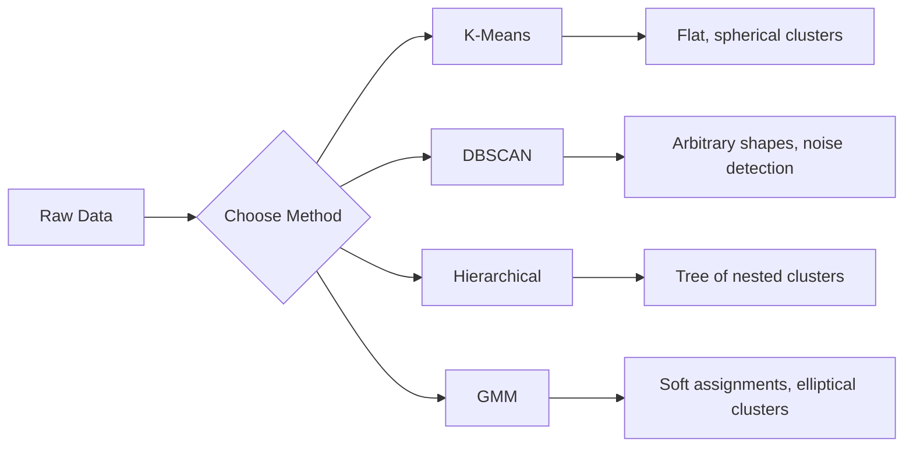

# 无监督学习

> 无标签，无教师。算法自行寻找结构。

**类型：** 构建
**语言：** Python
**先决条件：** 第一阶段（规范与距离、概率与分布），第二阶段课程1-6
**时间：** 约90分钟

## 学习目标

- Implement K-Means, DBSCAN, and Gaussian Mixture Models from scratch and compare their clustering behavior
- Evaluate cluster quality using the silhouette score and the elbow method to select the optimal K
- Explain when DBSCAN outperforms K-Means and identify which algorithm handles non-spherical clusters and outliers
- Build an anomaly detection pipeline using clustering methods to flag points that deviate from normal patterns

## 问题

迄今为止，每一节机器学习课程都假设存在带有标签的数据：“这是输入数据，这是正确的输出。”在现实世界中，标签的标注非常耗时。一家医院拥有数百万份患者记录，但无人手动为每份记录标注疾病类别。一个电子商务网站有数百万次用户访问记录，但无人手动标记客户群体。安全团队拥有网络日志，但没人对每一个异常情况进行标记。

无监督学习无需指定寻找什么模式即可发现规律。它将相似的数据点分组，揭示隐藏的结构，并发现异常现象。如果监督学习是从带有答案的教科书中学习，那么无监督学习则是直接观察原始数据，直到模式显现出来。

问题在于：没有标签，你就无法直接衡量“正确”或“错误”。你需要不同的工具来评估算法发现的结构是否有意义。

## 概念

### 聚类：将相似的事物组合在一起

聚类将每个数据点分配到一组（簇）中，使得同一组内的数据点彼此之间比其他组的数据点更为相似。问题始终是：这里的“相似”是什么意思？



### K-Means：主力军

K-Means将数据精确地划分为K个簇。每个簇都有一个质心（其质量中心），每个点都属于最近的质心。

Lloyd算法：

1. 选择K个随机点作为初始质心
2. 将每个数据点分配给最近的质心
3. 重新计算每个质心为其所属点的均值
4. 重复步骤2-3，直到分配不再改变

目标函数（惯性）衡量每个点到其所属质心的总平方距离。K-Means会最小化这一值，但只找到局部最小值。不同的初始化方式可能会得到不同的结果。

### 选择K

两种标准方法：

**肘部法：** 对 K = 1, 2, 3, ..., n 运行 K-Means。绘制惯性与 K 的关系图。寻找“肘部”点，即增加更多簇后，惯性的减少不再显著。

**轮廓系数：** 对于每个点，测量它与其自身簇的相似度 (a) 与最近其他簇的相似度 (b)。轮廓系数为 (b - a) / max(a, b)，范围从 -1（错误聚类）到 +1（聚类良好）。对所有点的平均值作为全局评分。

### DBSCAN：基于密度的聚类

K-Means assumes that clusters are spherical and requires you to specify K in advance. DBSCAN makes neither assumption. It identifies clusters as dense regions separated by sparse regions.

Two parameters:
- **eps**: the radius of a neighborhood
- **min_samples**: the minimum number of points needed to form a dense region

Three types of points:
- **Core point**: has at least min_samples points within eps distance
- **Border point**: within eps of a core point but not itself a core point
- **Noise point**: neither core nor border. These are outliers.

DBSCAN connects core points that are within eps of each other into the same cluster. Border points join the cluster of a nearby core point. Noise points belong to no cluster.

Strengths: it can find clusters of any shape, automatically determines the number of clusters, and identifies outliers. Weakness: it has difficulty with clusters of varying densities.

### 层次聚类

构建嵌套簇的树状图（ Dendrogram ）。

自底向上聚合法：
1. 以每个点作为独立的簇开始
2. 合并两个最近的簇
3. 重复此过程，直到只剩下一个簇
4. 在所需层级处切割树状图，得到 K 个簇

簇之间的“接近度”可以通过以下方式衡量：
- **单链接**：两个簇中任意两点之间的最小距离
- **完全链接**：任意两点之间的最大距离
- **平均链接**：所有点对之间距离的平均值
- **Ward 方法**：导致簇内方差增加最小度的合并操作

### 高斯混合模型（GMM）

K-Means 提供的是硬约束：每个点恰好属于一个簇。GMM 则提供软约束：每个点都有属于某个簇的概率。

GMM 假设数据是由 K 个高斯分布混合生成的，每个分布都有其自身的均值和协方差。期望最大化（EM）算法在以下两个步骤之间交替进行：

- **E-step**：计算每个点属于每个高斯分布的概率
- **M-step**：更新每个高斯的均值、协方差和混合权重，以最大化数据的似然度

GMM 可以建模椭圆簇（不仅仅是 K-Means 的球形簇），并且能够自然处理重叠的簇。

### 何时使用Which

| 方法 | 最适合场景 | 应避免使用场景 |
|------|----------|------------|
| K-Means | 大型数据集，球形簇，已知K值 | 不规则形状，存在异常值 |
| DBSCAN | K值未知，任意形状，异常值检测 | 密度分布不均，维度过高 |
| 层次聚类 | 小型数据集，需要树状图，K值未知 | 大型数据集（O(n^2)内存消耗） |
| GMM | 重叠簇，需要软分配 | 超大规模数据集，维度过多 |

### 异常检测与聚类

聚类自然支持异常检测：
- **K-Means**：远离任何质心的点属于异常点
- **DBSCAN**：根据定义，噪声点即为异常点
- **GMM**：在所有高斯分布下概率较低的点为异常点

```figure
kmeans-step
```

## 构建它

### 步骤1：从头开始使用K-均值算法

```python
import math
import random


def euclidean_distance(a, b):
    return math.sqrt(sum((ai - bi) ** 2 for ai, bi in zip(a, b)))


def kmeans(data, k, max_iterations=100, seed=42):
    random.seed(seed)
    n_features = len(data[0])

    centroids = random.sample(data, k)

    for iteration in range(max_iterations):
        clusters = [[] for _ in range(k)]
        assignments = []

        for point in data:
            distances = [euclidean_distance(point, c) for c in centroids]
            nearest = distances.index(min(distances))
            clusters[nearest].append(point)
            assignments.append(nearest)

        new_centroids = []
        for cluster in clusters:
            if len(cluster) == 0:
                new_centroids.append(random.choice(data))
                continue
            centroid = [
                sum(point[j] for point in cluster) / len(cluster)
                for j in range(n_features)
            ]
            new_centroids.append(centroid)

        if all(
            euclidean_distance(old, new) < 1e-6
            for old, new in zip(centroids, new_centroids)
        ):
            print(f"  Converged at iteration {iteration + 1}")
            break

        centroids = new_centroids

    return assignments, centroids
```

### 步骤2：肘部方法和轮廓得分

```python
def compute_inertia(data, assignments, centroids):
    total = 0.0
    for point, cluster_id in zip(data, assignments):
        total += euclidean_distance(point, centroids[cluster_id]) ** 2
    return total


def silhouette_score(data, assignments):
    n = len(data)
    if n < 2:
        return 0.0

    clusters = {}
    for i, c in enumerate(assignments):
        clusters.setdefault(c, []).append(i)

    if len(clusters) < 2:
        return 0.0

    scores = []
    for i in range(n):
        own_cluster = assignments[i]
        own_members = [j for j in clusters[own_cluster] if j != i]

        if len(own_members) == 0:
            scores.append(0.0)
            continue

        a = sum(euclidean_distance(data[i], data[j]) for j in own_members) / len(own_members)

        b = float("inf")
        for cluster_id, members in clusters.items():
            if cluster_id == own_cluster:
                continue
            avg_dist = sum(euclidean_distance(data[i], data[j]) for j in members) / len(members)
            b = min(b, avg_dist)

        if max(a, b) == 0:
            scores.append(0.0)
        else:
            scores.append((b - a) / max(a, b))

    return sum(scores) / len(scores)


def find_best_k(data, max_k=10):
    print("Elbow method:")
    inertias = []
    for k in range(1, max_k + 1):
        assignments, centroids = kmeans(data, k)
        inertia = compute_inertia(data, assignments, centroids)
        inertias.append(inertia)
        print(f"  K={k}: inertia={inertia:.2f}")

    print("\nSilhouette scores:")
    for k in range(2, max_k + 1):
        assignments, centroids = kmeans(data, k)
        score = silhouette_score(data, assignments)
        print(f"  K={k}: silhouette={score:.4f}")

    return inertias
```

### 步骤3：从零开始实现DBSCAN算法

```python
def dbscan(data, eps, min_samples):
    n = len(data)
    labels = [-1] * n
    cluster_id = 0

    def region_query(point_idx):
        neighbors = []
        for i in range(n):
            if euclidean_distance(data[point_idx], data[i]) <= eps:
                neighbors.append(i)
        return neighbors

    visited = [False] * n

    for i in range(n):
        if visited[i]:
            continue
        visited[i] = True

        neighbors = region_query(i)

        if len(neighbors) < min_samples:
            labels[i] = -1
            continue

        labels[i] = cluster_id
        seed_set = list(neighbors)
        seed_set.remove(i)

        j = 0
        while j < len(seed_set):
            q = seed_set[j]

            if not visited[q]:
                visited[q] = True
                q_neighbors = region_query(q)
                if len(q_neighbors) >= min_samples:
                    for nb in q_neighbors:
                        if nb not in seed_set:
                            seed_set.append(nb)

            if labels[q] == -1:
                labels[q] = cluster_id

            j += 1

        cluster_id += 1

    return labels
```

### 步骤4：高斯混合模型（EM算法）

```python
def gmm(data, k, max_iterations=100, seed=42):
    random.seed(seed)
    n = len(data)
    d = len(data[0])

    indices = random.sample(range(n), k)
    means = [list(data[i]) for i in indices]
    variances = [1.0] * k
    weights = [1.0 / k] * k

    def gaussian_pdf(x, mean, variance):
        d = len(x)
        coeff = 1.0 / ((2 * math.pi * variance) ** (d / 2))
        exponent = -sum((xi - mi) ** 2 for xi, mi in zip(x, mean)) / (2 * variance)
        return coeff * math.exp(max(exponent, -500))

    for iteration in range(max_iterations):
        responsibilities = []
        for i in range(n):
            probs = []
            for j in range(k):
                probs.append(weights[j] * gaussian_pdf(data[i], means[j], variances[j]))
            total = sum(probs)
            if total == 0:
                total = 1e-300
            responsibilities.append([p / total for p in probs])

        old_means = [list(m) for m in means]

        for j in range(k):
            r_sum = sum(responsibilities[i][j] for i in range(n))
            if r_sum < 1e-10:
                continue

            weights[j] = r_sum / n

            for dim in range(d):
                means[j][dim] = sum(
                    responsibilities[i][j] * data[i][dim] for i in range(n)
                ) / r_sum

            variances[j] = sum(
                responsibilities[i][j]
                * sum((data[i][dim] - means[j][dim]) ** 2 for dim in range(d))
                for i in range(n)
            ) / (r_sum * d)
            variances[j] = max(variances[j], 1e-6)

        shift = sum(
            euclidean_distance(old_means[j], means[j]) for j in range(k)
        )
        if shift < 1e-6:
            print(f"  GMM converged at iteration {iteration + 1}")
            break

    assignments = []
    for i in range(n):
        assignments.append(responsibilities[i].index(max(responsibilities[i])))

    return assignments, means, weights, responsibilities
```

### 步骤5：生成测试数据并运行所有内容

```python
def make_blobs(centers, n_per_cluster=50, spread=0.5, seed=42):
    random.seed(seed)
    data = []
    true_labels = []
    for label, (cx, cy) in enumerate(centers):
        for _ in range(n_per_cluster):
            x = cx + random.gauss(0, spread)
            y = cy + random.gauss(0, spread)
            data.append([x, y])
            true_labels.append(label)
    return data, true_labels


def make_moons(n_samples=200, noise=0.1, seed=42):
    random.seed(seed)
    data = []
    labels = []
    n_half = n_samples // 2
    for i in range(n_half):
        angle = math.pi * i / n_half
        x = math.cos(angle) + random.gauss(0, noise)
        y = math.sin(angle) + random.gauss(0, noise)
        data.append([x, y])
        labels.append(0)
    for i in range(n_half):
        angle = math.pi * i / n_half
        x = 1 - math.cos(angle) + random.gauss(0, noise)
        y = 1 - math.sin(angle) - 0.5 + random.gauss(0, noise)
        data.append([x, y])
        labels.append(1)
    return data, labels


if __name__ == "__main__":
    centers = [[2, 2], [8, 3], [5, 8]]
    data, true_labels = make_blobs(centers, n_per_cluster=50, spread=0.8)

    print("=== K-Means on 3 blobs ===")
    assignments, centroids = kmeans(data, k=3)
    print(f"  Centroids: {[[round(c, 2) for c in cent] for cent in centroids]}")
    sil = silhouette_score(data, assignments)
    print(f"  Silhouette score: {sil:.4f}")

    print("\n=== Elbow Method ===")
    find_best_k(data, max_k=6)

    print("\n=== DBSCAN on 3 blobs ===")
    db_labels = dbscan(data, eps=1.5, min_samples=5)
    n_clusters = len(set(db_labels) - {-1})
    n_noise = db_labels.count(-1)
    print(f"  Found {n_clusters} clusters, {n_noise} noise points")

    print("\n=== GMM on 3 blobs ===")
    gmm_assignments, gmm_means, gmm_weights, _ = gmm(data, k=3)
    print(f"  Means: {[[round(m, 2) for m in mean] for mean in gmm_means]}")
    print(f"  Weights: {[round(w, 3) for w in gmm_weights]}")
    gmm_sil = silhouette_score(data, gmm_assignments)
    print(f"  Silhouette score: {gmm_sil:.4f}")

    print("\n=== DBSCAN on moons (non-spherical clusters) ===")
    moon_data, moon_labels = make_moons(n_samples=200, noise=0.1)
    moon_db = dbscan(moon_data, eps=0.3, min_samples=5)
    n_moon_clusters = len(set(moon_db) - {-1})
    n_moon_noise = moon_db.count(-1)
    print(f"  Found {n_moon_clusters} clusters, {n_moon_noise} noise points")

    print("\n=== K-Means on moons (will fail to separate) ===")
    moon_km, moon_centroids = kmeans(moon_data, k=2)
    moon_sil = silhouette_score(moon_data, moon_km)
    print(f"  Silhouette score: {moon_sil:.4f}")
    print("  K-Means splits moons poorly because they are not spherical")

    print("\n=== Anomaly detection with DBSCAN ===")
    anomaly_data = list(data)
    anomaly_data.append([20.0, 20.0])
    anomaly_data.append([-5.0, -5.0])
    anomaly_data.append([15.0, 0.0])
    anomaly_labels = dbscan(anomaly_data, eps=1.5, min_samples=5)
    anomalies = [
        anomaly_data[i]
        for i in range(len(anomaly_labels))
        if anomaly_labels[i] == -1
    ]
    print(f"  Detected {len(anomalies)} anomalies")
    for a in anomalies[-3:]:
        print(f"    Point {[round(v, 2) for v in a]}")
```

## 使用它

使用 scikit-learn，相同的算法可以用简洁的语句实现：

```python
from sklearn.cluster import KMeans, DBSCAN, AgglomerativeClustering
from sklearn.mixture import GaussianMixture
from sklearn.metrics import silhouette_score as sklearn_silhouette

km = KMeans(n_clusters=3, random_state=42).fit(data)
db = DBSCAN(eps=1.5, min_samples=5).fit(data)
agg = AgglomerativeClustering(n_clusters=3).fit(data)
gmm_model = GaussianMixture(n_components=3, random_state=42).fit(data)
```

从零开始构建的版本可以让你确切了解这些库的计算过程。K-Means在分配和重新计算之间循环进行。DBSCAN通过密集的种子点来生成簇。GMM则在期望值和最大化之间交替操作。这些库的版本增加了数值稳定性、更智能的初始化方法（K-Means++）以及GPU加速，但核心逻辑保持不变。

## 发货

本课程从零开始，生成了K-Means、DBSCAN和GMM的实用实现。这些聚类代码可以作为更高级无监督方法的基石进行复用。

## 练习

1. Implement K-Means++ initialization: instead of picking random centroids, pick the first randomly and each subsequent centroid with probability proportional to its squared distance from the nearest existing centroid. Compare convergence speed to random initialization.
2. Add hierarchical agglomerative clustering to the code. Implement Ward's linkage and produce a dendrogram (as a nested list of merges). Cut it at different levels and compare to K-Means results.
3. Build a simple anomaly detection pipeline: run DBSCAN and GMM on the same data, flag points that both methods agree are outliers (noise in DBSCAN, low probability in GMM). Measure the overlap and discuss when the methods disagree.

## | 关键词 | 翻译 |

| 术语 | 人们怎么说 | 实际含义 |
|------|------------|----------|
| 聚类 | “将相似的事物分组” | 将数据划分为子集，其中组内相似性超过组间相似性，通过特定的距离度量来衡量 |
| 质心 | “聚类的中心” | 分配给某个聚类的所有点的平均值；K-Means使用它作为聚类的代表点 |
| 惯性 | “聚类之间的紧密程度” | 每个点到其分配质心的平方距离之和；数值越低表示聚类越紧密 |
| 轮廓得分 | “聚类之间的分离程度” | 对于每个点，(b - a) / max(a, b)，其中a是组内平均距离，b是最近聚类平均距离 |
| 核心点 | “密集区域中的点” | DBSCAN中至少有一个min_samples个邻居与eps距离内的点 |
| EM算法 | “软K-Means” | 期望最大化算法：迭代计算成员概率（E步骤）并更新分布参数（M步骤） |
| 树状图 | “聚类的树” | 显示层次聚类过程中聚类合并顺序和距离的树形图 |
| 异常值 | “离群点” | 不符合预期模式的数据点，DBSCAN将其识别为噪声，或GMM认为其概率低 |

## 更多阅读资料

- [Stanford CS229 - Unsupervised Learning](https://cs229.stanford.edu/notes2022fall/main_notes.pdf) - Andrew Ng's lecture notes on clustering and EM  
- [scikit-learn Clustering Guide](https://scikit-learn.org/stable/modules/clustering.html) - practical comparison of all clustering algorithms with visual examples  
- [DBSCAN original paper (Ester et al., 1996)](https://www.aaai.org/Papers/KDD/1996/KDD96-037.pdf) - the paper that introduced density-based clustering
