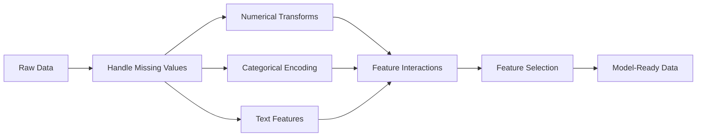

# 特征工程与选择

> 一个好的功能价值千个数据点。

**类型：** 构建
**语言：** Python
**先决条件：** 第一阶段（机器学习统计、线性代数），第二阶段课程1-7
**时间：** 约90分钟

## 学习目标

- Implement numerical transforms such as standardization, min-max scaling, log transform, and binning. Explain when each is appropriate.
- Create one-hot, label, and target encodings for categorical features and identify the risk of data leakage in target encoding.
- Build a TF-IDF vectorizer from scratch and explain why it outperforms raw word counts for text classification.
- Apply filter-based feature selection methods such as variance threshold, correlation, and mutual information to reduce dimensionality.

## 问题

您有一个数据集。选择了一个算法并进行了训练，但结果平平无奇。尝试了更先进的算法，结果依然不佳。花费一周时间调整超参数，也只是略有改善。

然后有人将原始数据转换为更好的特征，简单的逻辑回归模型就击败了您调整后的梯度提升集成模型。

这种情况经常发生。在传统的机器学习中，数据的表示方式比算法的选择更为重要。一个包含“建筑面积”和“卧室数量”的房价模型，无论学习者多么先进，都会优于一个仅使用“地址作为原始字符串”的模型。算法只能处理您提供的数据。

特征工程是将原始数据转换为使模型更容易发现模式的特征的过程。特征选择则是剔除那些增加噪声而不增加有用信息的特征的过程。这两者共同构成了传统机器学习中最具影响力的活动。

## 概念

### 功能管道



### 数值特征

原始数据很少适合模型训练。常见的转换方法包括：

**缩放：**将特征放在相同的范围内，以便基于距离的算法（K-Means、KNN、SVM）能够平等处理所有特征。最小-最大缩放映射到[0, 1]。标准化（z分数）将均值设为0，标准差设为1。

**对数变换：**压缩右偏分布的数据（如收入、人口数量、单词计数）。将乘法关系转换为加法关系。

**分箱：**将连续值转换为类别。当特征与目标之间的关系是非线性的但呈阶梯状时非常有用（例如年龄组）。

**多项式特征：**创建x^2、x^3、x1*x2等项。让线性模型能够捕捉非线性关系，但代价是增加了更多的特征。

### 分类特征

模型需要数字。类别需要编码。

**独热编码：**为每个类别创建一个二进制列。“颜色 = 红色/蓝色/绿色”变为三个列：是红色、是蓝色、是绿色。适用于低基数特征，但当类别较多时会导致性能下降。

**标签编码：**将每个类别映射到一个整数：红色=0，蓝色=1，绿色=2。这会导致错误的排序（模型可能认为绿色 > 蓝色 > 红色）。仅适用于基于树结构的模型，这些模型在单个值上进行分割。

**目标编码：**用该类别的目标变量均值替换每个类别。非常强大但危险：有数据泄露的风险。只能在训练数据上计算并应用于测试数据。

### Text Features

**计数向量化器：**计算文档中每个单词出现的次数。“the cat sat on the mat”会被转换为{the: 2, cat: 1, sat: 1, on: 1, mat: 1}。

**TF-IDF：**术语频率-逆文档频率。根据单词在文档中的独特性来加权。像“the”这样的常见词会得到较低的权重，而罕见且独特的词则会得到较高的权重。

```
TF(word, doc) = count(word in doc) / total words in doc
IDF(word) = log(total docs / docs containing word)
TF-IDF = TF * IDF
```

### 缺失值

真实数据中存在缺失值。应对策略：

- **删除行：**仅当缺失数据很少且随机出现时
- **均值/中位数插补：**简单，保留分布形态（中位数对异常值更稳健）
- **众数插补：**用于分类特征
- **指示列：**在插补前添加二进制列“was_this_missing”。数据是否缺失本身可能具有信息价值
- **前向/后向填充：**适用于时间序列数据

### 功能交互

有时，关系在于组合。仅使用“身高”和“体重”不如“BMI = 体重 / 身高^2”具有预测性。特征交互作用会扩大特征空间，因此需要使用领域知识来选择正确的特征。

### 特征选择

更多的功能并不总是更好。不相关的功能会增加噪声，延长训练时间，并可能导致过拟合。

**过滤方法（预模型）：**
- 相关性：移除彼此高度相关的特征（冗余的）
- 互信息：衡量知道某个特征可以减少对目标的不确定性
- 方差阈值：移除变化很小的特征

**包装方法（基于模型的）：**
- L1正则化（Lasso）：将不相关特征的权重完全归零
- 递归特征消除：训练，移除最不重要的特征，重复

**为什么选择很重要：**一个拥有10个好特征的模型通常会比一个拥有10个好特征和90个噪声特征的模型表现更好。噪声特征使模型有机会过度拟合训练数据中的模式，而这些模式无法泛化。

```figure
feature-scaling
```

## 构建它

### 步骤1：从零开始进行数值转换

```python
import math


def min_max_scale(values):
    min_val = min(values)
    max_val = max(values)
    if max_val == min_val:
        return [0.0] * len(values)
    return [(v - min_val) / (max_val - min_val) for v in values]


def standardize(values):
    n = len(values)
    mean = sum(values) / n
    variance = sum((v - mean) ** 2 for v in values) / n
    std = math.sqrt(variance) if variance > 0 else 1.0
    return [(v - mean) / std for v in values]


def log_transform(values):
    return [math.log(v + 1) for v in values]


def bin_values(values, n_bins=5):
    min_val = min(values)
    max_val = max(values)
    bin_width = (max_val - min_val) / n_bins
    if bin_width == 0:
        return [0] * len(values)
    result = []
    for v in values:
        bin_idx = int((v - min_val) / bin_width)
        bin_idx = min(bin_idx, n_bins - 1)
        result.append(bin_idx)
    return result


def polynomial_features(row, degree=2):
    n = len(row)
    result = list(row)
    if degree >= 2:
        for i in range(n):
            result.append(row[i] ** 2)
        for i in range(n):
            for j in range(i + 1, n):
                result.append(row[i] * row[j])
    return result
```

### 步骤2：从零开始进行分类编码

```python
def one_hot_encode(values):
    categories = sorted(set(values))
    cat_to_idx = {cat: i for i, cat in enumerate(categories)}
    n_cats = len(categories)

    encoded = []
    for v in values:
        row = [0] * n_cats
        row[cat_to_idx[v]] = 1
        encoded.append(row)

    return encoded, categories


def label_encode(values):
    categories = sorted(set(values))
    cat_to_int = {cat: i for i, cat in enumerate(categories)}
    return [cat_to_int[v] for v in values], cat_to_int


def target_encode(feature_values, target_values, smoothing=10):
    global_mean = sum(target_values) / len(target_values)

    category_stats = {}
    for feat, target in zip(feature_values, target_values):
        if feat not in category_stats:
            category_stats[feat] = {"sum": 0.0, "count": 0}
        category_stats[feat]["sum"] += target
        category_stats[feat]["count"] += 1

    encoding = {}
    for cat, stats in category_stats.items():
        cat_mean = stats["sum"] / stats["count"]
        weight = stats["count"] / (stats["count"] + smoothing)
        encoding[cat] = weight * cat_mean + (1 - weight) * global_mean

    return [encoding[v] for v in feature_values], encoding
```

### 步骤3：从零开始学习文本特征

```python
def count_vectorize(documents):
    vocab = {}
    idx = 0
    for doc in documents:
        for word in doc.lower().split():
            if word not in vocab:
                vocab[word] = idx
                idx += 1

    vectors = []
    for doc in documents:
        vec = [0] * len(vocab)
        for word in doc.lower().split():
            vec[vocab[word]] += 1
        vectors.append(vec)

    return vectors, vocab


def tfidf(documents):
    n_docs = len(documents)

    vocab = {}
    idx = 0
    for doc in documents:
        for word in doc.lower().split():
            if word not in vocab:
                vocab[word] = idx
                idx += 1

    doc_freq = {}
    for doc in documents:
        seen = set()
        for word in doc.lower().split():
            if word not in seen:
                doc_freq[word] = doc_freq.get(word, 0) + 1
                seen.add(word)

    vectors = []
    for doc in documents:
        words = doc.lower().split()
        word_count = len(words)
        tf_map = {}
        for word in words:
            tf_map[word] = tf_map.get(word, 0) + 1

        vec = [0.0] * len(vocab)
        for word, count in tf_map.items():
            tf = count / word_count
            idf = math.log(n_docs / doc_freq[word])
            vec[vocab[word]] = tf * idf
        vectors.append(vec)

    return vectors, vocab
```

### 步骤4：从零开始进行缺失值插补

```python
def impute_mean(values):
    present = [v for v in values if v is not None]
    if not present:
        return [0.0] * len(values), 0.0
    mean = sum(present) / len(present)
    return [v if v is not None else mean for v in values], mean


def impute_median(values):
    present = sorted(v for v in values if v is not None)
    if not present:
        return [0.0] * len(values), 0.0
    n = len(present)
    if n % 2 == 0:
        median = (present[n // 2 - 1] + present[n // 2]) / 2
    else:
        median = present[n // 2]
    return [v if v is not None else median for v in values], median


def impute_mode(values):
    present = [v for v in values if v is not None]
    if not present:
        return values, None
    counts = {}
    for v in present:
        counts[v] = counts.get(v, 0) + 1
    mode = max(counts, key=counts.get)
    return [v if v is not None else mode for v in values], mode


def add_missing_indicator(values):
    return [0 if v is not None else 1 for v in values]
```

### 步骤5：从零开始进行特征选择

```python
def correlation(x, y):
    n = len(x)
    mean_x = sum(x) / n
    mean_y = sum(y) / n
    cov = sum((xi - mean_x) * (yi - mean_y) for xi, yi in zip(x, y)) / n
    std_x = math.sqrt(sum((xi - mean_x) ** 2 for xi in x) / n)
    std_y = math.sqrt(sum((yi - mean_y) ** 2 for yi in y) / n)
    if std_x == 0 or std_y == 0:
        return 0.0
    return cov / (std_x * std_y)


def mutual_information(feature, target, n_bins=10):
    feat_min = min(feature)
    feat_max = max(feature)
    bin_width = (feat_max - feat_min) / n_bins if feat_max != feat_min else 1.0
    feat_binned = [
        min(int((f - feat_min) / bin_width), n_bins - 1) for f in feature
    ]

    n = len(feature)
    target_classes = sorted(set(target))

    feat_bins = sorted(set(feat_binned))
    p_feat = {}
    for b in feat_bins:
        p_feat[b] = feat_binned.count(b) / n

    p_target = {}
    for t in target_classes:
        p_target[t] = target.count(t) / n

    mi = 0.0
    for b in feat_bins:
        for t in target_classes:
            joint_count = sum(
                1 for fb, tv in zip(feat_binned, target) if fb == b and tv == t
            )
            p_joint = joint_count / n
            if p_joint > 0:
                mi += p_joint * math.log(p_joint / (p_feat[b] * p_target[t]))

    return mi


def variance_threshold(features, threshold=0.01):
    n_features = len(features[0])
    n_samples = len(features)
    selected = []

    for j in range(n_features):
        col = [features[i][j] for i in range(n_samples)]
        mean = sum(col) / n_samples
        var = sum((v - mean) ** 2 for v in col) / n_samples
        if var >= threshold:
            selected.append(j)

    return selected


def remove_correlated(features, threshold=0.9):
    n_features = len(features[0])
    n_samples = len(features)

    to_remove = set()
    for i in range(n_features):
        if i in to_remove:
            continue
        col_i = [features[r][i] for r in range(n_samples)]
        for j in range(i + 1, n_features):
            if j in to_remove:
                continue
            col_j = [features[r][j] for r in range(n_samples)]
            corr = abs(correlation(col_i, col_j))
            if corr >= threshold:
                to_remove.add(j)

    return [i for i in range(n_features) if i not in to_remove]
```

### 步骤6：完整流程与演示

```python
import random


def make_housing_data(n=200, seed=42):
    random.seed(seed)
    data = []
    for _ in range(n):
        sqft = random.uniform(500, 5000)
        bedrooms = random.choice([1, 2, 3, 4, 5])
        age = random.uniform(0, 50)
        neighborhood = random.choice(["downtown", "suburbs", "rural"])
        has_pool = random.choice([True, False])

        sqft_with_missing = sqft if random.random() > 0.05 else None
        age_with_missing = age if random.random() > 0.08 else None

        price = (
            50 * sqft
            + 20000 * bedrooms
            - 1000 * age
            + (50000 if neighborhood == "downtown" else 10000 if neighborhood == "suburbs" else 0)
            + (15000 if has_pool else 0)
            + random.gauss(0, 20000)
        )

        data.append({
            "sqft": sqft_with_missing,
            "bedrooms": bedrooms,
            "age": age_with_missing,
            "neighborhood": neighborhood,
            "has_pool": has_pool,
            "price": price,
        })
    return data


if __name__ == "__main__":
    data = make_housing_data(200)

    print("=== Raw Data Sample ===")
    for row in data[:3]:
        print(f"  {row}")

    sqft_raw = [d["sqft"] for d in data]
    age_raw = [d["age"] for d in data]
    prices = [d["price"] for d in data]

    print("\n=== Missing Value Handling ===")
    sqft_missing = sum(1 for v in sqft_raw if v is None)
    age_missing = sum(1 for v in age_raw if v is None)
    print(f"  sqft missing: {sqft_missing}/{len(sqft_raw)}")
    print(f"  age missing: {age_missing}/{len(age_raw)}")

    sqft_indicator = add_missing_indicator(sqft_raw)
    age_indicator = add_missing_indicator(age_raw)
    sqft_imputed, sqft_fill = impute_median(sqft_raw)
    age_imputed, age_fill = impute_mean(age_raw)
    print(f"  sqft filled with median: {sqft_fill:.0f}")
    print(f"  age filled with mean: {age_fill:.1f}")

    print("\n=== Numerical Transforms ===")
    sqft_scaled = standardize(sqft_imputed)
    age_scaled = min_max_scale(age_imputed)
    sqft_log = log_transform(sqft_imputed)
    age_binned = bin_values(age_imputed, n_bins=5)
    print(f"  sqft standardized: mean={sum(sqft_scaled)/len(sqft_scaled):.4f}, std={math.sqrt(sum(v**2 for v in sqft_scaled)/len(sqft_scaled)):.4f}")
    print(f"  age min-max: [{min(age_scaled):.2f}, {max(age_scaled):.2f}]")
    print(f"  age bins: {sorted(set(age_binned))}")

    print("\n=== Categorical Encoding ===")
    neighborhoods = [d["neighborhood"] for d in data]

    ohe, ohe_cats = one_hot_encode(neighborhoods)
    print(f"  One-hot categories: {ohe_cats}")
    print(f"  Sample encoding: {neighborhoods[0]} -> {ohe[0]}")

    le, le_map = label_encode(neighborhoods)
    print(f"  Label encoding map: {le_map}")

    te, te_map = target_encode(neighborhoods, prices, smoothing=10)
    print(f"  Target encoding: {({k: round(v) for k, v in te_map.items()})}")

    print("\n=== Text Features ===")
    descriptions = [
        "large modern house with pool",
        "small cozy cottage near downtown",
        "spacious family home with large yard",
        "modern apartment downtown with view",
        "rustic cabin in rural area",
    ]
    cv, cv_vocab = count_vectorize(descriptions)
    print(f"  Vocabulary size: {len(cv_vocab)}")
    print(f"  Doc 0 non-zero features: {sum(1 for v in cv[0] if v > 0)}")

    tf, tf_vocab = tfidf(descriptions)
    print(f"  TF-IDF vocabulary size: {len(tf_vocab)}")
    top_words = sorted(tf_vocab.keys(), key=lambda w: tf[0][tf_vocab[w]], reverse=True)[:3]
    print(f"  Doc 0 top TF-IDF words: {top_words}")

    print("\n=== Polynomial Features ===")
    sample_row = [sqft_scaled[0], age_scaled[0]]
    poly = polynomial_features(sample_row, degree=2)
    print(f"  Input: {[round(v, 4) for v in sample_row]}")
    print(f"  Polynomial: {[round(v, 4) for v in poly]}")
    print(f"  Features: [x1, x2, x1^2, x2^2, x1*x2]")

    print("\n=== Feature Selection ===")
    feature_matrix = [
        [sqft_scaled[i], age_scaled[i], float(sqft_indicator[i]), float(age_indicator[i])]
        + ohe[i]
        for i in range(len(data))
    ]

    print(f"  Total features: {len(feature_matrix[0])}")

    surviving_var = variance_threshold(feature_matrix, threshold=0.01)
    print(f"  After variance threshold (0.01): {len(surviving_var)} features kept")

    surviving_corr = remove_correlated(feature_matrix, threshold=0.9)
    print(f"  After correlation filter (0.9): {len(surviving_corr)} features kept")

    binary_prices = [1 if p > sum(prices) / len(prices) else 0 for p in prices]
    print("\n  Mutual information with target:")
    feature_names = ["sqft", "age", "sqft_missing", "age_missing"] + [f"neigh_{c}" for c in ohe_cats]
    for j in range(len(feature_matrix[0])):
        col = [feature_matrix[i][j] for i in range(len(feature_matrix))]
        mi = mutual_information(col, binary_prices, n_bins=10)
        print(f"    {feature_names[j]}: MI={mi:.4f}")

    print("\n  Correlation with price:")
    for j in range(len(feature_matrix[0])):
        col = [feature_matrix[i][j] for i in range(len(feature_matrix))]
        corr = correlation(col, prices)
        print(f"    {feature_names[j]}: r={corr:.4f}")
```

## 使用它

使用scikit-learn，这些转换可以组合成管道：

```python
from sklearn.preprocessing import StandardScaler, OneHotEncoder, PolynomialFeatures
from sklearn.impute import SimpleImputer
from sklearn.feature_extraction.text import TfidfVectorizer
from sklearn.feature_selection import mutual_info_classif, VarianceThreshold
from sklearn.compose import ColumnTransformer
from sklearn.pipeline import Pipeline

numeric_pipe = Pipeline([
    ("imputer", SimpleImputer(strategy="median")),
    ("scaler", StandardScaler()),
])

categorical_pipe = Pipeline([
    ("encoder", OneHotEncoder(sparse_output=False)),
])

preprocessor = ColumnTransformer([
    ("num", numeric_pipe, ["sqft", "age"]),
    ("cat", categorical_pipe, ["neighborhood"]),
])
```

从零开始版本能够准确显示每个转换内部发生的情况。库版本则增加了边缘情况处理、稀疏矩阵支持以及管道组合功能，但数学原理保持不变。

## 发货

本课程将生成以下文件：
- `outputs/prompt-feature-engineer.md` - 一个用于从原始数据系统地设计功能的提示词

## 练习

1. Add robust scaling to numerical transforms using median and interquartile range instead of mean and standard deviation. Compare this approach with standard scaling for data with extreme outliers.
2. Implement leave-one-out target encoding: for each row, calculate the target mean excluding that row's own target value. Demonstrate how this reduces overfitting compared to naive target encoding.
3. Develop an automated feature selection pipeline that combines variance threshold, correlation filtering, and mutual information ranking. Apply this pipeline to the housing dataset and compare model performance using a simple linear regression with all features versus selected features.

## | 关键词 | 翻译 |

| 术语 | 人们怎么说 | 实际含义 |
|------|------------|----------|
| 特征工程 | “创建新列” | 将原始数据转换为能够向模型揭示模式的表示形式 |
| 标准化 | “使其正常化” | 减去均值并除以标准差，使特征的均值为0，标准差为1 |
| 独热编码 | “创建虚拟变量” | 为每个类别创建一个二进制列，其中每行恰好有一个列为1 |
| 目标编码 | “使用答案进行编码” | 用该类别的平均目标值替换每个类别，并通过平滑处理防止过拟合 |
| TF-IDF | “高级词计数” | 术语频率乘以逆文档频率：单词根据其在整个语料库中的独特性进行加权 |
| 填补 | “填充空白” | 用估计值（均值、中位数、众数或模型预测）替代缺失值 |
| 特征选择 | “剔除不良列” | 移除产生噪声或冗余的特征，仅保留那些对目标有显著影响的特征 |
| 互信息 | “一件事能告诉你关于另一件事的多少信息” | 衡量通过观察变量X而减少变量Y的不确定性程度 |
| 数据泄露 | “意外作弊” | 在训练过程中使用预测时无法获得的 정보，导致错误乐观的结果 |

## 更多阅读资料

- [特征工程与选择（Max Kuhn & Kjell Johnson）](http://www.feat.engineering/) – 免费在线书籍，涵盖特征工程的全部内容
- [scikit-learn预处理指南](https://scikit-learn.org/stable/modules/preprocessing.html) – 所有标准转换方法的实用参考
- [正确的目标编码方法（Micci-Barreca, 2001）](https://dl.acm.org/doi/10.1145/507533.507538) – 关于平滑处理的目标编码原始论文
