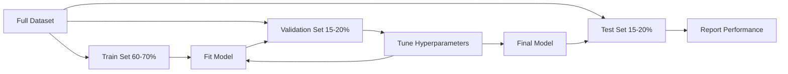

# 模型评估

> 一个模型的优劣取决于衡量它的方式。

**类型：**构建
**语言：**Python
**先决条件：**第一阶段（概率与分布、机器学习统计），第二阶段课程1-8
**时间：**约90分钟

## 学习目标

- Implement K-fold and stratified K-fold cross-validation from scratch and explain why stratification matters for imbalanced data
- Compute precision, recall, F1, AUC-ROC, and regression metrics (MSE, RMSE, MAE, R-squared) from scratch
- Interpret learning curves to diagnose whether a model suffers from high bias or high variance
- Identify common evaluation mistakes including data leakage, wrong metric selection, and test set contamination

## 问题

您训练了一个模型。它在您的数据上达到了95%的准确率。这好吗？

也许吧。也可能不好。如果您的数据中有95%属于同一个类别，那么一个总是预测那个类别的模型虽然准确率达到95%，但实际上却毫无用处。如果您在相同的训练数据上进行评估，那95%这个数字就没有意义了，因为模型只是记住了答案。如果您的数据集包含时间信息，并且在分割之前进行了随机打乱，那么您的模型可能会使用未来的数据来预测过去的情况。

模型评估是大多数机器学习项目出错的地方。错误的评估指标会让一个糟糕的模型看起来不错。错误的划分方式会让模型作弊。错误的比较方式会让你选择更差的模型。正确的进行评估并非可选项，这是决定模型能否在生产环境中正常运行的关键。

## 概念

### 训练、验证、测试



三种划分，三个用途：

- **训练集**：模型从这些数据中学习。在训练过程中，它会看到这些示例。
- **验证集**：用于调整超参数并在不同模型之间进行选择。模型不会在这组数据上进行训练，但你的决策会受到其影响。
- **测试集**：仅在最后阶段精确使用一次，以报告最终性能。如果你查看了测试性能后再回去修改模型，它就不再是测试集了。它变成了第二个验证集。

测试集是你确保报告的性能能够反映模型在真正未见数据上的表现的有力保证。

### K-fold交叉验证

对于小型数据集，单一的训练/验证分割会浪费数据并导致噪声估计。K折交叉验证则使用所有数据进行训练和验证：

```mermaid
flowchart TB
    subgraph Fold1["Fold 1"]
        direction LR
        V1["Val"] --- T1a["Train"] --- T1b["Train"] --- T1c["Train"] --- T1d["Train"]
    end
    subgraph Fold2["Fold 2"]
        direction LR
        T2a["Train"] --- V2["Val"] --- T2b["Train"] --- T2c["Train"] --- T2d["Train"]
    end
    subgraph Fold3["Fold 3"]
        direction LR
        T3a["Train"] --- T3b["Train"] --- V3["Val"] --- T3c["Train"] --- T3d["Train"]
    end
    subgraph Fold4["Fold 4"]
        direction LR
        T4a["Train"] --- T4b["Train"] --- T4c["Train"] --- V4["Val"] --- T4d["Train"]
    end
    subgraph Fold5["Fold 5"]
        direction LR
        T5a["Train"] --- T5b["Train"] --- T5c["Train"] --- T5d["Train"] --- V5["Val"]
    end
    Fold1 --> R["Average scores"]
    Fold2 --> R
    Fold3 --> R
    Fold4 --> R
    Fold5 --> R
```



1. Divide the data into K equal-sized folds.
2. For each fold, train on K-1 folds and validate on the remaining fold.
3. Calculate the average of the K validation scores.

K=5 or K=10 are standard choices. Each data point is used for validation exactly once. The average score provides a more stable estimate than any single split.

**Stratified K-fold**: maintains the class distribution in each fold. If your dataset consists of 70% Class A and 30% Class B, each fold will have approximately the same proportion. This is important for imbalanced datasets where a random split might result in all minority samples being in one fold.

### 分类指标

**混淆矩阵**：基础。对于二元分类：

|    | 预测为正 | 预测为负 |
|--|---|---|
| 实际为正 | 真正例 (TP) | 假负例 (FN) |
| 实际为负 | 假正例 (FP) | 真负例 (TN) |

从这个矩阵出发，其他所有指标都可以推导出来：

- **准确率** = (TP + TN) / (TP + TN + FP + FN)。正确预测的比例。当类别不平衡时可能会产生误导。
- **精确度** = TP / (TP + FP)。在所有被预测为正例中，实际为正的有多少？用于假正例代价高昂的情况（例如，垃圾邮件过滤器将真实电子邮件标记为垃圾邮件）。
- **召回率**（敏感性）= TP / (TP + FN)。在所有实际为正例中，我们捕获了多少个？用于假负例代价高昂的情况（例如，癌症筛查漏掉了一个肿瘤）。
- **F1分数** = 2 * 精确度 * 召回率 / (精确度 + 召回率)。精确度和召回率的调和平均值。在两者都不明显占优时保持平衡。
- **AUC-ROC**：接收者操作特征曲线下的面积。在不同分类阈值下绘制真正例率和假正例率。AUC = 0.5表示随机猜测，AUC = 1.0表示完美分离。与阈值无关：它衡量模型对正例的排序是否优于负例，无论你选择什么截止标准。

### 回归指标

- **MSE**（均方误差）= 平均(y_true - y_pred)^2。对较大错误进行二次惩罚。对异常值敏感。
- **RMSE**（均方根误差）= sqrt(MSE)。与目标变量单位相同。比MSE更容易解释。
- **MAE**（绝对平均误差）= 平均(|y_true - y_pred|)。对所有错误进行线性处理。比MSE更耐异常值影响。
- **R-squared** = 1 - SS_res / SS_tot，其中SS_res = sum((y_true - y_pred)^2，SS_tot = sum((y_true - y_mean)^2)。模型解释的方差比例。R^2 = 1.0表示完美。R^2 = 0.0意味着模型并不比总是预测平均值更好。如果模型比平均值差，则R^2可能为负数。

### 学习曲线

将训练和验证分数作为训练集大小的函数表示：

- **高偏差（欠拟合）**：两条曲线都收敛于低分。增加更多数据无帮助。你需要一个更复杂的模型。
- **高方差（过拟合）**：训练分数很高，但验证分数较低。两者之间的差距很大。增加更多数据应该有帮助。

### 验证曲线

将训练和验证分数作为超参数的函数表示：

- 在低复杂度时：两个分数都较低（欠拟合）
- 在适当的复杂度时：两个分数都较高且接近
- 在高复杂度时：训练分数保持较高，但验证分数下降（过拟合）

最优的超参数值是在验证分数达到峰值的点。

### 常见的评估错误

**数据泄露**：测试集的信息泄露到训练数据中。例如：在分割数据集之前将缩放器拟合到完整数据集中，在时间序列预测中包含未来数据，使用从目标数据派生出的特征。始终先进行分割，然后进行预处理。

**类别不平衡**：99%的交易是合法的，1%是欺诈的。一个总是预测“合法”的模型可以获得99%的准确率。应使用精确度、召回率、F1分数或AUC-ROC进行评估。

**错误的评估指标**：在应该优化召回率的情况下优化准确率（如医疗诊断），或者在数据中有严重异常值时优化均方根误差（使用MAE代替）。

**未使用分层分割**：对于不平衡的数据，随机分割可能会将很少的少数样本放入验证集中，导致估计结果不稳定。

**频繁测试**：每次查看测试性能并进行调整时，都会过度拟合测试集。测试集是一次性的。

```figure
precision-recall-threshold
```

## 构建它

### 步骤1：训练集/验证集/测试集划分

```python
import random
import math


def train_val_test_split(X, y, train_ratio=0.6, val_ratio=0.2, seed=42):
    random.seed(seed)
    n = len(X)
    indices = list(range(n))
    random.shuffle(indices)

    train_end = int(n * train_ratio)
    val_end = int(n * (train_ratio + val_ratio))

    train_idx = indices[:train_end]
    val_idx = indices[train_end:val_end]
    test_idx = indices[val_end:]

    X_train = [X[i] for i in train_idx]
    y_train = [y[i] for i in train_idx]
    X_val = [X[i] for i in val_idx]
    y_val = [y[i] for i in val_idx]
    X_test = [X[i] for i in test_idx]
    y_test = [y[i] for i in test_idx]

    return X_train, y_train, X_val, y_val, X_test, y_test
```

### 步骤2：K折交叉验证和分层K折交叉验证

```python
def kfold_split(n, k=5, seed=42):
    random.seed(seed)
    indices = list(range(n))
    random.shuffle(indices)

    fold_size = n // k
    folds = []

    for i in range(k):
        start = i * fold_size
        end = start + fold_size if i < k - 1 else n
        val_idx = indices[start:end]
        train_idx = indices[:start] + indices[end:]
        folds.append((train_idx, val_idx))

    return folds


def stratified_kfold_split(y, k=5, seed=42):
    random.seed(seed)

    class_indices = {}
    for i, label in enumerate(y):
        class_indices.setdefault(label, []).append(i)

    for label in class_indices:
        random.shuffle(class_indices[label])

    folds = [{"train": [], "val": []} for _ in range(k)]

    for label, indices in class_indices.items():
        fold_size = len(indices) // k
        for i in range(k):
            start = i * fold_size
            end = start + fold_size if i < k - 1 else len(indices)
            val_part = indices[start:end]
            train_part = indices[:start] + indices[end:]
            folds[i]["val"].extend(val_part)
            folds[i]["train"].extend(train_part)

    return [(f["train"], f["val"]) for f in folds]


def cross_validate(X, y, model_fn, k=5, metric_fn=None, stratified=False):
    n = len(X)

    if stratified:
        folds = stratified_kfold_split(y, k)
    else:
        folds = kfold_split(n, k)

    scores = []
    for train_idx, val_idx in folds:
        X_train = [X[i] for i in train_idx]
        y_train = [y[i] for i in train_idx]
        X_val = [X[i] for i in val_idx]
        y_val = [y[i] for i in val_idx]

        model = model_fn()
        model.fit(X_train, y_train)
        predictions = [model.predict(x) for x in X_val]

        if metric_fn:
            score = metric_fn(y_val, predictions)
        else:
            score = sum(1 for yt, yp in zip(y_val, predictions) if yt == yp) / len(y_val)
        scores.append(score)

    return scores
```

### 步骤3：混淆矩阵与分类度量指标

```python
def confusion_matrix(y_true, y_pred):
    tp = sum(1 for yt, yp in zip(y_true, y_pred) if yt == 1 and yp == 1)
    tn = sum(1 for yt, yp in zip(y_true, y_pred) if yt == 0 and yp == 0)
    fp = sum(1 for yt, yp in zip(y_true, y_pred) if yt == 0 and yp == 1)
    fn = sum(1 for yt, yp in zip(y_true, y_pred) if yt == 1 and yp == 0)
    return tp, tn, fp, fn


def accuracy(y_true, y_pred):
    tp, tn, fp, fn = confusion_matrix(y_true, y_pred)
    total = tp + tn + fp + fn
    return (tp + tn) / total if total > 0 else 0.0


def precision(y_true, y_pred):
    tp, tn, fp, fn = confusion_matrix(y_true, y_pred)
    return tp / (tp + fp) if (tp + fp) > 0 else 0.0


def recall(y_true, y_pred):
    tp, tn, fp, fn = confusion_matrix(y_true, y_pred)
    return tp / (tp + fn) if (tp + fn) > 0 else 0.0


def f1_score(y_true, y_pred):
    p = precision(y_true, y_pred)
    r = recall(y_true, y_pred)
    return 2 * p * r / (p + r) if (p + r) > 0 else 0.0


def roc_curve(y_true, y_scores):
    thresholds = sorted(set(y_scores), reverse=True)
    tpr_list = []
    fpr_list = []

    total_positives = sum(y_true)
    total_negatives = len(y_true) - total_positives

    for threshold in thresholds:
        y_pred = [1 if s >= threshold else 0 for s in y_scores]
        tp = sum(1 for yt, yp in zip(y_true, y_pred) if yt == 1 and yp == 1)
        fp = sum(1 for yt, yp in zip(y_true, y_pred) if yt == 0 and yp == 1)

        tpr = tp / total_positives if total_positives > 0 else 0.0
        fpr = fp / total_negatives if total_negatives > 0 else 0.0

        tpr_list.append(tpr)
        fpr_list.append(fpr)

    return fpr_list, tpr_list, thresholds


def auc_roc(y_true, y_scores):
    fpr_list, tpr_list, _ = roc_curve(y_true, y_scores)

    pairs = sorted(zip(fpr_list, tpr_list))
    fpr_sorted = [p[0] for p in pairs]
    tpr_sorted = [p[1] for p in pairs]

    area = 0.0
    for i in range(1, len(fpr_sorted)):
        width = fpr_sorted[i] - fpr_sorted[i - 1]
        height = (tpr_sorted[i] + tpr_sorted[i - 1]) / 2
        area += width * height

    return area
```

### 步骤4：回归指标

```python
def mse(y_true, y_pred):
    n = len(y_true)
    return sum((yt - yp) ** 2 for yt, yp in zip(y_true, y_pred)) / n


def rmse(y_true, y_pred):
    return math.sqrt(mse(y_true, y_pred))


def mae(y_true, y_pred):
    n = len(y_true)
    return sum(abs(yt - yp) for yt, yp in zip(y_true, y_pred)) / n


def r_squared(y_true, y_pred):
    mean_y = sum(y_true) / len(y_true)
    ss_res = sum((yt - yp) ** 2 for yt, yp in zip(y_true, y_pred))
    ss_tot = sum((yt - mean_y) ** 2 for yt in y_true)
    if ss_tot == 0:
        return 0.0
    return 1.0 - ss_res / ss_tot
```

### 步骤5：学习曲线

```python
def learning_curve(X, y, model_fn, metric_fn, train_sizes=None, val_ratio=0.2, seed=42):
    random.seed(seed)
    n = len(X)
    indices = list(range(n))
    random.shuffle(indices)

    val_size = int(n * val_ratio)
    val_idx = indices[:val_size]
    pool_idx = indices[val_size:]

    X_val = [X[i] for i in val_idx]
    y_val = [y[i] for i in val_idx]

    if train_sizes is None:
        train_sizes = [int(len(pool_idx) * r) for r in [0.1, 0.2, 0.4, 0.6, 0.8, 1.0]]

    train_scores = []
    val_scores = []

    for size in train_sizes:
        subset = pool_idx[:size]
        X_train = [X[i] for i in subset]
        y_train = [y[i] for i in subset]

        model = model_fn()
        model.fit(X_train, y_train)

        train_pred = [model.predict(x) for x in X_train]
        val_pred = [model.predict(x) for x in X_val]

        train_scores.append(metric_fn(y_train, train_pred))
        val_scores.append(metric_fn(y_val, val_pred))

    return train_sizes, train_scores, val_scores
```

### 步骤6：一个简单的测试分类器，以及完整的演示。

```python
class SimpleLogistic:
    def __init__(self, lr=0.1, epochs=100):
        self.lr = lr
        self.epochs = epochs
        self.weights = None
        self.bias = 0.0

    def sigmoid(self, z):
        z = max(-500, min(500, z))
        return 1.0 / (1.0 + math.exp(-z))

    def fit(self, X, y):
        n_features = len(X[0])
        self.weights = [0.0] * n_features
        self.bias = 0.0

        for _ in range(self.epochs):
            for xi, yi in zip(X, y):
                z = sum(w * x for w, x in zip(self.weights, xi)) + self.bias
                pred = self.sigmoid(z)
                error = yi - pred
                for j in range(n_features):
                    self.weights[j] += self.lr * error * xi[j]
                self.bias += self.lr * error

    def predict_proba(self, x):
        z = sum(w * xi for w, xi in zip(self.weights, x)) + self.bias
        return self.sigmoid(z)

    def predict(self, x):
        return 1 if self.predict_proba(x) >= 0.5 else 0


class SimpleLinearRegression:
    def __init__(self, lr=0.001, epochs=200):
        self.lr = lr
        self.epochs = epochs
        self.weights = None
        self.bias = 0.0

    def fit(self, X, y):
        n_features = len(X[0])
        self.weights = [0.0] * n_features
        self.bias = 0.0
        n = len(X)

        for _ in range(self.epochs):
            for xi, yi in zip(X, y):
                pred = sum(w * x for w, x in zip(self.weights, xi)) + self.bias
                error = yi - pred
                for j in range(n_features):
                    self.weights[j] += self.lr * error * xi[j] / n
                self.bias += self.lr * error / n

    def predict(self, x):
        return sum(w * xi for w, xi in zip(self.weights, x)) + self.bias


def standardize(values):
    n = len(values)
    mean = sum(values) / n
    var = sum((v - mean) ** 2 for v in values) / n
    std = math.sqrt(var) if var > 0 else 1.0
    return [(v - mean) / std for v in values], mean, std


def make_classification_data(n=300, seed=42):
    random.seed(seed)
    X = []
    y = []
    for _ in range(n):
        x1 = random.gauss(0, 1)
        x2 = random.gauss(0, 1)
        label = 1 if (x1 + x2 + random.gauss(0, 0.5)) > 0 else 0
        X.append([x1, x2])
        y.append(label)
    return X, y


def make_regression_data(n=200, seed=42):
    random.seed(seed)
    X = []
    y = []
    for _ in range(n):
        x1 = random.uniform(0, 10)
        x2 = random.uniform(0, 5)
        target = 3 * x1 + 2 * x2 + random.gauss(0, 2)
        X.append([x1, x2])
        y.append(target)
    return X, y


def make_imbalanced_data(n=300, minority_ratio=0.05, seed=42):
    random.seed(seed)
    X = []
    y = []
    for _ in range(n):
        if random.random() < minority_ratio:
            x1 = random.gauss(3, 0.5)
            x2 = random.gauss(3, 0.5)
            label = 1
        else:
            x1 = random.gauss(0, 1)
            x2 = random.gauss(0, 1)
            label = 0
        X.append([x1, x2])
        y.append(label)
    return X, y


if __name__ == "__main__":
    X_clf, y_clf = make_classification_data(300)

    print("=== Train/Validation/Test Split ===")
    X_train, y_train, X_val, y_val, X_test, y_test = train_val_test_split(X_clf, y_clf)
    print(f"  Train: {len(X_train)}, Val: {len(X_val)}, Test: {len(X_test)}")
    print(f"  Train class distribution: {sum(y_train)}/{len(y_train)} positive")
    print(f"  Val class distribution: {sum(y_val)}/{len(y_val)} positive")

    model = SimpleLogistic(lr=0.1, epochs=200)
    model.fit(X_train, y_train)

    print("\n=== Classification Metrics ===")
    y_pred = [model.predict(x) for x in X_test]
    tp, tn, fp, fn = confusion_matrix(y_test, y_pred)
    print(f"  Confusion matrix: TP={tp}, TN={tn}, FP={fp}, FN={fn}")
    print(f"  Accuracy:  {accuracy(y_test, y_pred):.4f}")
    print(f"  Precision: {precision(y_test, y_pred):.4f}")
    print(f"  Recall:    {recall(y_test, y_pred):.4f}")
    print(f"  F1 Score:  {f1_score(y_test, y_pred):.4f}")

    y_scores = [model.predict_proba(x) for x in X_test]
    auc = auc_roc(y_test, y_scores)
    print(f"  AUC-ROC:   {auc:.4f}")

    print("\n=== K-Fold Cross-Validation (K=5) ===")
    cv_scores = cross_validate(
        X_clf, y_clf,
        model_fn=lambda: SimpleLogistic(lr=0.1, epochs=200),
        k=5,
        metric_fn=accuracy,
    )
    mean_cv = sum(cv_scores) / len(cv_scores)
    std_cv = math.sqrt(sum((s - mean_cv) ** 2 for s in cv_scores) / len(cv_scores))
    print(f"  Fold scores: {[round(s, 4) for s in cv_scores]}")
    print(f"  Mean: {mean_cv:.4f} (+/- {std_cv:.4f})")

    print("\n=== Stratified K-Fold Cross-Validation (K=5) ===")
    strat_scores = cross_validate(
        X_clf, y_clf,
        model_fn=lambda: SimpleLogistic(lr=0.1, epochs=200),
        k=5,
        metric_fn=accuracy,
        stratified=True,
    )
    strat_mean = sum(strat_scores) / len(strat_scores)
    strat_std = math.sqrt(sum((s - strat_mean) ** 2 for s in strat_scores) / len(strat_scores))
    print(f"  Fold scores: {[round(s, 4) for s in strat_scores]}")
    print(f"  Mean: {strat_mean:.4f} (+/- {strat_std:.4f})")

    print("\n=== Imbalanced Data: Why Accuracy Lies ===")
    X_imb, y_imb = make_imbalanced_data(300, minority_ratio=0.05)
    positives = sum(y_imb)
    print(f"  Class distribution: {positives} positive, {len(y_imb) - positives} negative ({positives/len(y_imb)*100:.1f}% positive)")

    always_negative = [0] * len(y_imb)
    print(f"  Always-negative baseline:")
    print(f"    Accuracy:  {accuracy(y_imb, always_negative):.4f}")
    print(f"    Precision: {precision(y_imb, always_negative):.4f}")
    print(f"    Recall:    {recall(y_imb, always_negative):.4f}")
    print(f"    F1 Score:  {f1_score(y_imb, always_negative):.4f}")

    X_tr_i, y_tr_i, X_v_i, y_v_i, X_te_i, y_te_i = train_val_test_split(X_imb, y_imb)
    model_imb = SimpleLogistic(lr=0.5, epochs=500)
    model_imb.fit(X_tr_i, y_tr_i)
    y_pred_imb = [model_imb.predict(x) for x in X_te_i]
    print(f"\n  Trained model on imbalanced data:")
    print(f"    Accuracy:  {accuracy(y_te_i, y_pred_imb):.4f}")
    print(f"    Precision: {precision(y_te_i, y_pred_imb):.4f}")
    print(f"    Recall:    {recall(y_te_i, y_pred_imb):.4f}")
    print(f"    F1 Score:  {f1_score(y_te_i, y_pred_imb):.4f}")

    print("\n=== Regression Metrics ===")
    X_reg, y_reg = make_regression_data(200)

    col0 = [x[0] for x in X_reg]
    col1 = [x[1] for x in X_reg]
    col0_s, m0, s0 = standardize(col0)
    col1_s, m1, s1 = standardize(col1)
    X_reg_scaled = [[col0_s[i], col1_s[i]] for i in range(len(X_reg))]

    X_tr_r, y_tr_r, X_v_r, y_v_r, X_te_r, y_te_r = train_val_test_split(X_reg_scaled, y_reg)
    reg_model = SimpleLinearRegression(lr=0.01, epochs=500)
    reg_model.fit(X_tr_r, y_tr_r)
    y_pred_r = [reg_model.predict(x) for x in X_te_r]

    print(f"  MSE:       {mse(y_te_r, y_pred_r):.4f}")
    print(f"  RMSE:      {rmse(y_te_r, y_pred_r):.4f}")
    print(f"  MAE:       {mae(y_te_r, y_pred_r):.4f}")
    print(f"  R-squared: {r_squared(y_te_r, y_pred_r):.4f}")

    mean_baseline = [sum(y_tr_r) / len(y_tr_r)] * len(y_te_r)
    print(f"\n  Mean baseline:")
    print(f"    MSE:       {mse(y_te_r, mean_baseline):.4f}")
    print(f"    R-squared: {r_squared(y_te_r, mean_baseline):.4f}")

    print("\n=== Learning Curve ===")
    sizes, train_sc, val_sc = learning_curve(
        X_clf, y_clf,
        model_fn=lambda: SimpleLogistic(lr=0.1, epochs=200),
        metric_fn=accuracy,
    )
    print(f"  {'Size':>6} {'Train':>8} {'Val':>8}")
    for s, tr, va in zip(sizes, train_sc, val_sc):
        print(f"  {s:>6} {tr:>8.4f} {va:>8.4f}")

    print("\n=== Statistical Model Comparison ===")
    model_a_scores = cross_validate(
        X_clf, y_clf,
        model_fn=lambda: SimpleLogistic(lr=0.1, epochs=100),
        k=5, metric_fn=accuracy,
    )
    model_b_scores = cross_validate(
        X_clf, y_clf,
        model_fn=lambda: SimpleLogistic(lr=0.1, epochs=500),
        k=5, metric_fn=accuracy,
    )
    diffs = [a - b for a, b in zip(model_a_scores, model_b_scores)]
    mean_diff = sum(diffs) / len(diffs)
    std_diff = math.sqrt(sum((d - mean_diff) ** 2 for d in diffs) / len(diffs))
    t_stat = mean_diff / (std_diff / math.sqrt(len(diffs))) if std_diff > 0 else 0.0
    print(f"  Model A (100 epochs) mean: {sum(model_a_scores)/len(model_a_scores):.4f}")
    print(f"  Model B (500 epochs) mean: {sum(model_b_scores)/len(model_b_scores):.4f}")
    print(f"  Mean difference: {mean_diff:.4f}")
    print(f"  Paired t-statistic: {t_stat:.4f}")
    print(f"  (|t| > 2.78 for significance at p<0.05 with df=4)")
```

## 使用它

使用scikit-learn时，评估功能已内置在工作流程中：

```python
from sklearn.model_selection import cross_val_score, StratifiedKFold, learning_curve
from sklearn.metrics import (
    accuracy_score, precision_score, recall_score, f1_score,
    roc_auc_score, confusion_matrix, mean_squared_error, r2_score,
)
from sklearn.linear_model import LogisticRegression

model = LogisticRegression()
scores = cross_val_score(model, X, y, cv=StratifiedKFold(5), scoring="f1")
```

从零开始构建的版本展示了交叉验证的具体作用（没有魔法，只是循环和索引跟踪），每个指标的计算方式（仅仅是计数TP/FP/TN/FN），以及分层的重要性（保持每个折叠中的类别比例）。而库版本的则增加了并行性、更多的评分选项，并实现了与流程的集成。

## 发货

本课程将生成以下文件：
- `outputs/skill-evaluation.md` - 关于分类和回归模型评估策略的技能文档

## 练习

1. Implement precision-recall curves: plot precision vs recall at different thresholds. Calculate the average precision (area under the PR curve). Compare the PR curve to the ROC curve on an imbalanced dataset and explain when each is more informative.
2. Build a nested cross-validation loop: the outer loop evaluates model performance, the inner loop tunes hyperparameters. Use it to compare two models fairly without leaking validation data into the evaluation.
3. Implement a permutation test for model comparison: shuffle the labels, retrain, and measure performance. Repeat 100 times to build a null distribution. Calculate the p-value for the observed model performance against this distribution.

## | 关键词 | 翻译 |

| 术语 | 人们怎么说 | 实际含义 |
|------|------------|----------|
| 过拟合 | “记忆训练数据” | 模型在训练数据中捕捉到噪声，在训练集上表现良好但在未见数据上表现不佳 |
| 交叉验证 | “在不同子集上进行测试” | 系统地轮换用于验证的数据部分，对所有轮次的结果进行平均 |
| 精确度 | “预测为阳性的数量中有多少是正确的” | TP / (TP + FP)：实际为阳性的预测中的正确比例 |
| 召回率 | “我们发现的真实阳性数量” | TP / (TP + FN)：被正确识别的真实阳性数量的比例 |
| AUC-ROC | “模型分离类别的能力” | 所有阈值下真阳性率与假阳性率的曲线下面积，从0.5（随机）到1.0（完美） |
| R平方 | “解释了多少方差” | 1 - (残差平方和 / 总平方和)：模型捕获的目标方差比例 |
| 数据泄露 | “模型作弊了” | 在训练过程中使用预测时无法获得的信息，导致乐观的评估 |
| 学习曲线 | “性能如何随着数据量的增加而变化” | 训练和验证分数与训练集大小的关系图，揭示欠拟合或过拟合情况 |
| 分层分割 | “保持类别比例平衡” | 将数据分割为每个子集具有与完整数据集相同比例的每个类别 |

## 更多阅读资料

- [scikit-learn 模型选择指南](https://scikit-learn.org/stable/model_selection.html) - 关于交叉验证、指标和超参数调优的全面参考
- [超越准确率：精确度和召回率（Google ML速成课程）](https://developers.google.com/machine-learning/crash-course/classification/precision-and-recall) - 配有互动示例的清晰解释
- [交叉验证程序综述（Arlot & Celisse, 2010）](https://projecteuclid.org/journals/statistics-surveys/volume-4/issue-none/A-survey-of-cross-validation-procedures-for-model-selection/10.1214/09-SS054.full) - 对何时以及为何不同交叉验证策略有效进行严谨分析
