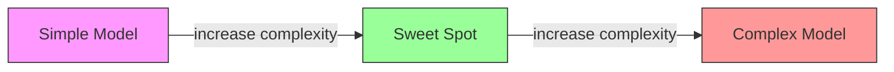
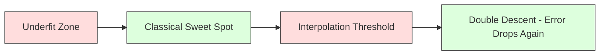
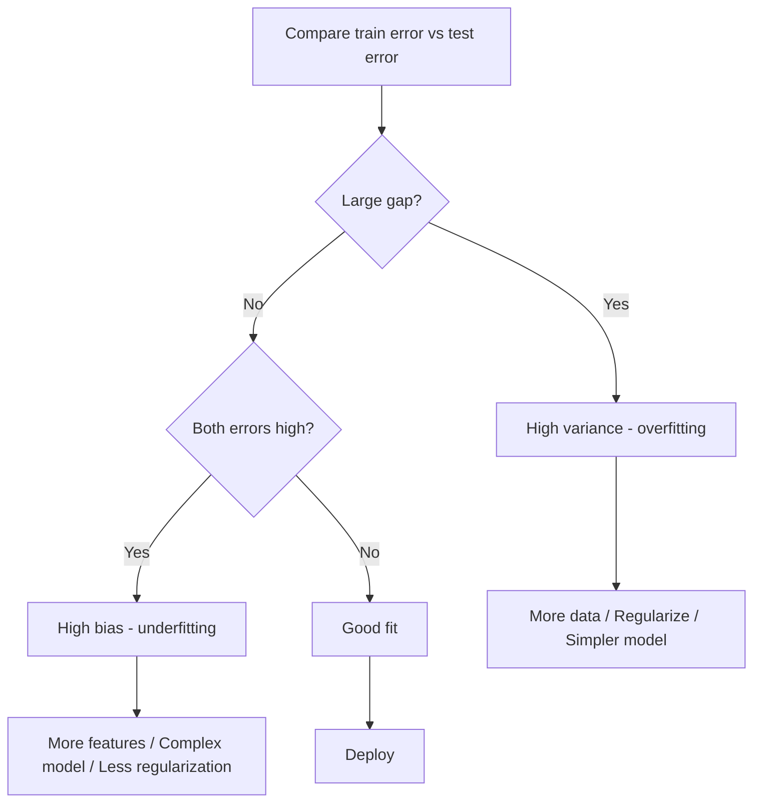
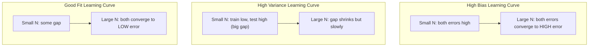
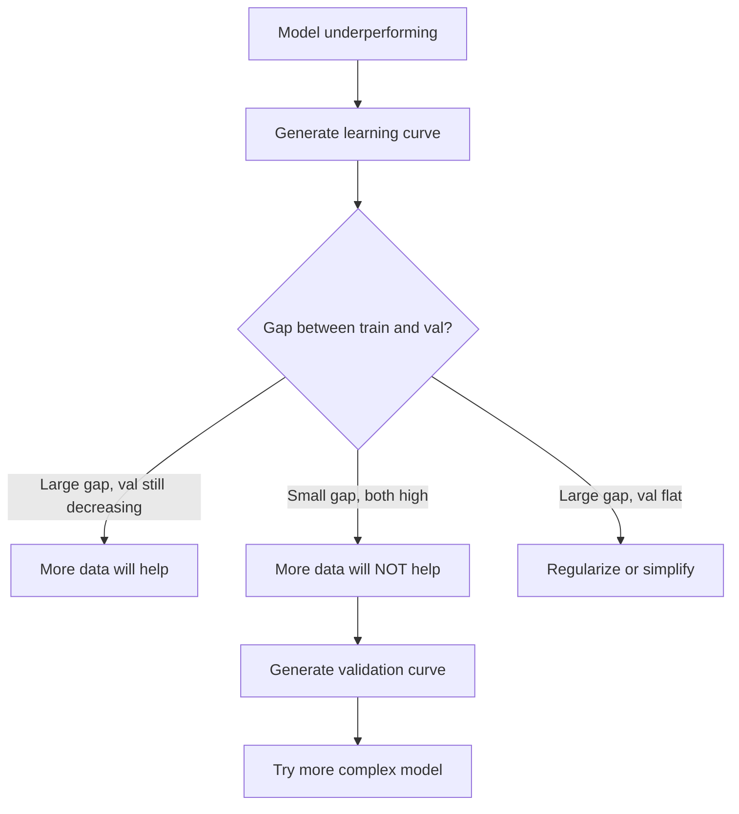

# 偏差-方差权衡

> 每个模型错误都源自三个来源：偏差、方差或噪声。你只能控制前两个。

**类型：** 学习
**语言：** Python
**先决条件：** 第二阶段，课程01-09（机器学习基础、回归、分类、评估）
**时间：** 约75分钟

## 学习目标

- Derive the bias-variance decomposition of expected prediction error and explain the role of irreducible noise  
- Diagnose whether a model suffers from high bias or high variance using training and test error patterns  
- Explain how regularization techniques (L1, L2, dropout, early stopping) trade off bias for variance  
- Implement experiments that visualize the bias-variance tradeoff across models of increasing complexity

## 问题

You have trained a model. However, it has some errors on test data. Where do these errors come from?

If your model is too simple (for example, linear regression used on a curved dataset), it will consistently miss the true patterns in the data. This is known as bias. On the other hand, if your model is too complex (a polynomial with degree 20 used on 15 data points), it may fit the training data perfectly but produce wildly different predictions on new data. This is known as variance.

It is impossible to minimize both aspects simultaneously for a fixed model capacity. Reducing bias will increase variance, and reducing variance will increase bias. Understanding this tradeoff is crucial in machine learning. It helps you decide whether to make your model more complex or less complex, whether to collect more data or create better features, and whether to use regularization techniques more or less effectively.

## 概念

### 偏见：系统性错误

偏差衡量了模型的平均预测值与真实值之间的差距。如果你在来自同一分布的多个不同训练集上训练相同的模型并取平均预测值，那么偏差就是该平均值与真实值之间的差距。

高偏差意味着模型过于僵化，无法捕捉到真实的模式。无论给予多少数据，一条直线拟合抛物线总会错过曲线形状。这就是欠拟合。

```
High bias (underfitting):
  Model always predicts roughly the same wrong thing.
  Training error: HIGH
  Test error: HIGH
  Gap between them: SMALL
```

### 方差：对训练数据的敏感性

方差衡量了在训练不同数据子集时，预测结果的变化程度。如果训练集中的微小变化导致模型发生巨大变化，那么方差就很高。

高方差意味着模型正在拟合训练数据中的噪声，而不是潜在的信号。一个20次多项式函数会穿过每一个训练点，但在这些点上波动极大。这就是过拟合现象。

```
High variance (overfitting):
  Model fits training data perfectly but fails on new data.
  Training error: LOW
  Test error: HIGH
  Gap between them: LARGE
```

### 分解

对于任何点x，在平方损失下预期的预测误差可以精确分解为：

```
Expected Error = Bias^2 + Variance + Irreducible Noise

where:
  Bias^2   = (E[f_hat(x)] - f(x))^2
  Variance = E[(f_hat(x) - E[f_hat(x)])^2]
  Noise    = E[(y - f(x))^2]             (sigma^2)
```

- `f(x)` 是真实函数
- `f_hat(x)` 是你的模型预测值
- `E[...]` 是在不同训练集上的期望
- `y` 是观测到的标签（真实函数加上噪声）

噪声项是不可约的。任何模型在噪声数据上的表现都无法超过 sigma^2。你的任务是在偏差^2和方差之间找到正确的平衡。

### 模型复杂性与错误



经典U形曲线：

| 复杂度 | 偏差 | 方差 | 总误差 |
|-------|------|-----|-------|
| 太低 | 高   | 低  | 高（欠拟合）|
| 刚好合适 | 中等 | 中等 | 最低 |
| 太高   | 低   | 高  | 高（过拟合）|

### 正则化作为偏差-方差控制

正则化故意增加偏差以减少方差。它约束模型，使其无法追逐噪声。

- **L2（岭回归）：** 将所有权重缩小到零。保留所有特征但减少其影响。
- **L1（Lasso）：** 将某些权重精确归零。进行特征选择。
- **Dropout：** 在训练过程中随机禁用神经元。强制冗余表示。
- **提前停止：** 在模型完全适应训练数据之前停止训练。

正则化的强度（lambda、dropout率、迭代次数）直接控制你在偏差-方差曲线上的位置。更多的正则化意味着更大的偏差，更少的方差。

### 双重下降：现代视角

经典理论认为：在最佳点之后，更多的复杂性总是会带来负面影响。但自2019年以来的研究表明了一个意想不到的现象。如果你继续增加模型容量，超过插值阈值（即模型具有足够的参数来完美拟合训练数据），测试误差可能会再次下降。



这种“双重下降”现象解释了为什么参数数量远超训练样本数量的神经网络仍能保持良好的泛化能力。经典的偏差-方差权衡理论是正确的，但对于现代情况来说它并不完整。

关于双重下降的关键观察：
- 它发生在线性模型、决策树和神经网络中
- 更多的数据实际上会在插值区域产生负面影响（样本级双重下降）
- 更多的训练周期也会导致这种情况（周期级双重下降）
- 正则化可以平滑峰值，但无法消除它

为什么会发生这种情况？在插值阈值处，模型只有足够的容量来拟合所有训练点。它被迫进入一个能够穿过每个点的特定解决方案，而数据中的微小变化会导致拟合度的巨大变化。这就是方差达到峰值的区域。超过阈值后，模型有许多可能完美的解决方案。学习算法（例如带有隐式正则化的梯度下降）倾向于选择其中最简单的一个。这种对简单解决方案的隐性偏好是过度参数化模型能够泛化的原因。

| 情况 | 参数与样本的关系 | 行为 |
|------|-----------------|------|
| 参数不足 | p << n | 适用经典权衡理论 |
| 插值阈值 | p ~ n | 方差达到峰值，测试误差激增 |
| 参数过多 | p >> n | 隐式正则化开始起作用，测试误差下降 |

实际应用时：如果你使用神经网络或大型树集成模型，不要停留在插值阈值处。要么保持在远低于该阈值的位置（带有显式正则化），要么超过该阈值。最糟糕的情况就是正好处于阈值位置。

### Diagnosing Your Model



| 症状 | 诊断 | 解决方法 |
|------|-----|---------|
| 训练误差高，测试误差高 | 偏差 | 增加功能、使用更复杂的模型、减少正则化 |
| 训练误差低，测试误差高 | 方差 | 增加数据量、使用正则化、简化模型、采用dropout技术 |
| 训练误差低，测试误差低 | 拟合良好 | 直接投入使用 |
| 训练误差下降，测试误差上升 | 正在发生过拟合 | 提前停止训练 |

### 实用策略

当偏见是问题时：
- 添加多项式或交互特征
- 使用更灵活的模型（树集成而非线性模型）
- 降低正则化强度
- 延长训练时间（如果尚未收敛）

当方差是问题时：
- 获取更多训练数据
- 使用装袋法（随机森林）
- 增加正则化（更高的lambda值，更多的丢弃）
- 特征选择（移除噪声特征）
- 使用交叉验证及早检测问题

### 集成方法与方差降低

集成方法是应对方差最实用的工具。

**Bagging（自助聚合）**通过在训练数据的不同自助样本上训练多个模型，然后平均它们的预测结果。每个单独的模型都有较高的方差，但平均值的方差则大大降低。随机森林就是将自助聚合方法应用于决策树。

数学上的原理：如果你将N个独立预测的方差分别设为sigma^2，那么平均值的方差就是sigma^2 / N。这些模型并非真正独立（它们都看到类似的数据），因此方差降低的比例小于1/N，但仍然相当显著。

**Boosting**通过逐步构建模型来减少偏差，每个新模型都关注迄今为止集成中的错误。梯度提升和AdaBoost是主要的例子。如果添加了过多的模型，Boosting可能会导致过拟合，因此需要提前停止或正则化。

| 方法 | 主要效果 | 偏差变化 | 方差变化 |
|------|----------|-------------|------------|
| Bagging | 降低方差 | 无变化 | 减少 |
| Boosting | 减少偏差 | 减少 | 可能增加 |
| Stacking | 同时降低两者 | 取决于元学习器 | 取决于基础模型 |
| Dropout | 隐式自助聚合 | 轻微增加 | 减少 |

**实用规则**：如果基础模型的方差较高（如深度树、高阶多项式），使用Bagging。如果基础模型的偏差较大（如浅层决策树、简单线性模型），使用Boosting。

### 学习曲线

学习曲线将训练和验证误差作为训练集大小的函数进行绘制。它们是您最实用的诊断工具。与单一的训练/测试比较不同，学习曲线展示了模型的演变轨迹，并告诉您更多数据是否有助于改进模型性能。



如何阅读以下信息：

| 场景 | 训练误差 | 验证误差 | 差距 | 含义 | 应对措施 |
|------|-------|-------|-----|-----|---------|
| 高偏差 | 高 | 高 | 小 | 模型无法捕捉到模式 | 增加特征、使用更复杂的模型、减少正则化 |
| 高方差 | 低 | 高 | 大 | 模型记住了训练数据 | 收集更多数据、进行正则化处理、使用更简单的模型 |
| 拟合良好 | 中等 | 中等 | 小 | 模型能很好地泛化 | 立即部署模型 |
| 高方差正在改善 | 低 | 随着数据增加而减少 | 缩小 | 可以通过数据解决的方差问题 | 收集更多数据 |
| 高偏差且平坦 | 高 | 高且平坦 | 小而平坦 | 更多数据无帮助 | 改变模型架构 |

关键洞察：如果两条曲线都趋于平稳，差距较小但两种误差都很高，那么更多的数据是无用的。你需要一个更好的模型。如果差距很大且仍在缩小，那么收集更多数据会有帮助。

### 如何生成学习曲线

有两种方法：

**方法1：变化训练集大小，固定模型。** 保持模型和超参数不变。在训练数据的越来越大的子集上进行训练。在每个大小下测量训练误差和验证误差。这是标准学习曲线。

**方法2：变化模型复杂度，固定数据。** 保持数据不变。调整复杂度参数（多项式次数、树深度、层数）。在每个复杂度下测量训练误差和验证误差。这是验证曲线，直接展示了偏差-方差权衡。

这两种方法可以互补。第一种告诉你更多数据是否有帮助。第二种告诉你不同模型是否有帮助。在决定下一步之前，请同时运行这两种方法。



```figure
bias-variance
```

## 构建它

`code/bias_variance.py`中的代码执行了完整的偏差-方差分解实验。以下是该方法的逐步说明。

### Step 1: Generate Synthetic Data from a Known Function

我们使用 `f(x) = sin(1.5x) + 0.5x` 并加入高斯噪声。了解真实函数后，我们可以计算出精确的偏差和方差。

```python
def true_function(x):
    return np.sin(1.5 * x) + 0.5 * x

def generate_data(n_samples=30, noise_std=0.5, x_range=(-3, 3), seed=None):
    rng = np.random.RandomState(seed)
    x = rng.uniform(x_range[0], x_range[1], n_samples)
    y = true_function(x) + rng.normal(0, noise_std, n_samples)
    return x, y
```

### 步骤2：Bootstrap抽样与多项式拟合

对于每一阶多项式，我们绘制多个自助训练集，拟合多项式模型，并在固定的测试网格上记录预测结果。这使我们能够得到每个测试点的预测分布。

```python
def fit_polynomial(x_train, y_train, degree, lam=0.0):
    X = np.column_stack([x_train ** d for d in range(degree + 1)])
    if lam > 0:
        penalty = lam * np.eye(X.shape[1])
        penalty[0, 0] = 0
        w = np.linalg.solve(X.T @ X + penalty, X.T @ y_train)
    else:
        w = np.linalg.lstsq(X, y_train, rcond=None)[0]
    return w
```

我们使用了200个不同的自助样本。每个自助样本都来自相同的底层分布，但包含不同的点。

### 步骤3：计算偏差平方，方差分解

在每个测试点有200组预测数据的情况下，我们可以直接根据定义来计算分解结果：

```python
mean_pred = predictions.mean(axis=0)
bias_sq = np.mean((mean_pred - y_true) ** 2)
variance = np.mean(predictions.var(axis=0))
total_error = np.mean(np.mean((predictions - y_true) ** 2, axis=1))
```

- `mean_pred` 是从自助样本估计的 E[f_hat(x)]
- `bias_sq` 是平均预测与真实值之间的差距的平方
- `variance` 是不同自助样本中预测的平均差异
- `total_error` 应近似等于 bias^2 + variance + noise

### 步骤4：学习曲线

学习曲线在保持模型复杂度不变的情况下，会变化训练集的大小。它们可以显示你的模型是数据受限还是容量受限。

```python
def demo_learning_curves():
    sizes = [10, 15, 20, 30, 50, 75, 100, 150, 200, 300]
    degree = 5

    for n in sizes:
        train_errors = []
        test_errors = []
        for seed in range(50):
            x_train, y_train = generate_data(n_samples=n, seed=seed * 100)
            w = fit_polynomial(x_train, y_train, degree)
            train_pred = predict_polynomial(x_train, w)
            train_mse = np.mean((train_pred - y_train) ** 2)
            test_pred = predict_polynomial(x_test, w)
            test_mse = np.mean((test_pred - y_test) ** 2)
            train_errors.append(train_mse)
            test_errors.append(test_mse)
        # Average over runs gives the learning curve point
```

对于高方差模型（数据量小，阶数为5），可以看到：
- 训练误差从低开始，随着更多数据的增加而上升，因为记忆过程变得更加困难
- 测试误差从高开始，随着模型的信号增多而下降
- 随着数据的增加，误差差距会缩小

对于高偏差模型（阶数为1），两种误差都会迅速收敛到相同的高值，更多的数据并不会有所帮助。

### 步骤5：正则化扫描

该代码还包含了`demo_regularization_sweep()`函数，该函数用于修正高阶多项式（次数为15），并将Ridge正则化强度从0.001调整至100。这从一个不同的角度展示了偏差-方差权衡：我们不是改变模型的复杂性，而是改变约束的强度。

```python
def demo_regularization_sweep():
    alphas = [0.001, 0.005, 0.01, 0.05, 0.1, 0.5, 1.0, 5.0, 10.0, 50.0, 100.0]
    for alpha in alphas:
        results = bias_variance_decomposition([15], lam=alpha)
        r = results[15]
        print(f"alpha={alpha:.3f}  bias={r['bias_sq']:.4f}  var={r['variance']:.4f}")
```

在较低的alpha值下，15次多项式几乎不受约束。方差占主导地位，因为模型在每个自助样本中追逐噪声。在较高的alpha值下，惩罚力度非常大，以至于模型实际上变成了一个近似恒定的函数。偏差占主导地位。最优的alpha值介于这两个极端之间。

这是相同的U型曲线，只是多项式度数不同，但由一个连续参数控制而不是离散参数。在实践中，正则化是控制这种权衡的首选方法，因为它可以在不改变特征集的情况下进行精细控制。

## 使用它

sklearn提供了`learning_curve`和`validation_curve`功能，无需编写bootstrap循环即可自动进行这些诊断。

### 验证曲线：扫描模型复杂性

```python
from sklearn.model_selection import validation_curve
from sklearn.pipeline import make_pipeline
from sklearn.preprocessing import PolynomialFeatures
from sklearn.linear_model import Ridge

degrees = list(range(1, 16))
train_scores_all = []
val_scores_all = []

for d in degrees:
    pipe = make_pipeline(PolynomialFeatures(d), Ridge(alpha=0.01))
    train_scores, val_scores = validation_curve(
        pipe, X, y, param_name="polynomialfeatures__degree",
        param_range=[d], cv=5, scoring="neg_mean_squared_error"
    )
    train_scores_all.append(-train_scores.mean())
    val_scores_all.append(-val_scores.mean())
```

这直接给出了偏差-方差权衡曲线。当验证分数相对于训练分数最差时，方差占主导；当两者都较差时，偏差占主导。

### 学习曲线：扫描训练集大小

```python
from sklearn.model_selection import learning_curve

pipe = make_pipeline(PolynomialFeatures(5), Ridge(alpha=0.01))
train_sizes, train_scores, val_scores = learning_curve(
    pipe, X, y, train_sizes=np.linspace(0.1, 1.0, 10),
    cv=5, scoring="neg_mean_squared_error"
)
train_mse = -train_scores.mean(axis=1)
val_mse = -val_scores.mean(axis=1)
```

绘制 `train_mse` 和 `val_mse` 与 `train_sizes` 的关系图。其形状可以告诉你关于你的模型的所有信息。

### 正则化扫描交叉验证

```python
from sklearn.model_selection import cross_val_score

alphas = [0.001, 0.01, 0.1, 1.0, 10.0, 100.0]
for alpha in alphas:
    pipe = make_pipeline(PolynomialFeatures(10), Ridge(alpha=alpha))
    scores = cross_val_score(pipe, X, y, cv=5, scoring="neg_mean_squared_error")
    print(f"alpha={alpha:>7.3f}  MSE={-scores.mean():.4f} +/- {scores.std():.4f}")
```

这种扫描正则化强度适用于固定的模型复杂度。你会看到相同的偏差-方差权衡：较低的alpha值意味着高方差，较高的alpha值意味着高偏差。

### 整合一切：完整的诊断工作流程

在实践中，你需要依次执行以下诊断步骤：

1. 训练模型。计算训练集和测试集的误差。
2. 如果两者都高：存在偏差问题。直接跳到步骤4。
3. 如果训练集的误差低但测试集的误差高：存在方差问题。生成学习曲线以查看更多数据是否有助于改善性能。如果没有，进行正则化处理。
4. 通过调整主要复杂性参数来生成验证曲线，找到最佳平衡点。
5. 在最佳平衡点上，再次生成学习曲线。如果差距仍然很大，则需要更多数据或正则化处理。
6. 使用`cross_val_score`尝试不同的alpha值来测试Ridge/Lasso模型。选择交叉验证误差最低的alpha值。

对于大多数表格数据集，这只需要10-15分钟的计算时间，而传统方法需要数小时的时间来进行猜测和尝试。

## 发货

本课程将生成：`outputs/prompt-model-diagnostics.md`

## 练习

1. Run the decomposition with `noise_std=0` (no noise). What happens to the irreducible error term? Does the optimal complexity change?

2. Increase the training set size from 30 to 300. How does this affect the variance component? Does the optimal polynomial degree shift?

3. Add L2 regularization (Ridge regression) to the experiment. For a fixed high-degree polynomial (degree 15), sweep lambda from 0 to 100. Plot bias^2 and variance as functions of lambda.

4. Modify the true function from a polynomial to `sin(x)`. How does the bias-variance decomposition change? Is there still a clear optimal degree?

5. Implement a simple bootstrap aggregating (bagging) wrapper: train 10 models on bootstrap samples and average predictions. Show that this reduces variance without increasing bias much.

## | 关键词 | 翻译 |

| 术语 | 人们怎么说 | 实际含义 |
|------|------------|----------|
| 偏差 | “模型太简单了” | 由于错误假设导致的系统性误差。平均模型预测与真实值之间的差距。 |
| 方差 | “模型过拟合了” | 对训练数据的敏感性引起的误差。不同训练集下预测的变动程度。 |
| 不可消除的误差 | “数据中的噪声” | 真实数据生成过程中随机性的误差。没有任何模型能够消除它。 |
| 欠拟合 | “学习不足” | 模型偏差高，即使在训练数据上也会错过真实模式。 |
| 过拟合 | “记住数据” | 模型方差高，对训练中不具有泛化能力的噪声过度适应。 |
| 正则化 | “限制模型” | 添加惩罚项以减少模型复杂性，以较低的方差换取减少的偏差。 |
| 双重下降 | “更多参数有帮助” | 当模型容量远超插值阈值时，测试误差再次降低。 |
| 模型复杂度 | “模型的灵活性” | 模型适应任意模式的能力。由架构、特征或正则化控制。 |

## 更多阅读资料

- [Hastie, Tibshirani, Friedman: 统计学习要素，第7章](https://hastie.su.domains/ElemStatLearn/) -- 偏差-方差分解的权威论述
- [Belkin等人，调和现代机器学习实践与偏差-方差权衡（2019）](https://arxiv.org/abs/1812.11118) -- 双重下降论文
- [Nakkiran等人，深度双重下降（2019）](https://arxiv.org/abs/1912.02292) -- 按时代和样本进行的双重下降
- [Scott Fortmann-Roe: 理解偏差-方差权衡](http://scott.fortmann-roe.com/docs/BiasVariance.html) -- 清晰的视觉解释
