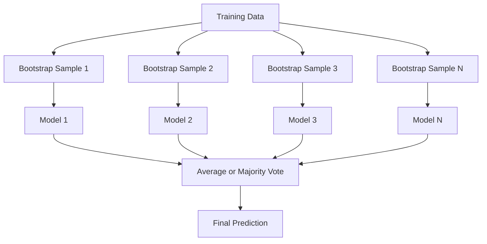
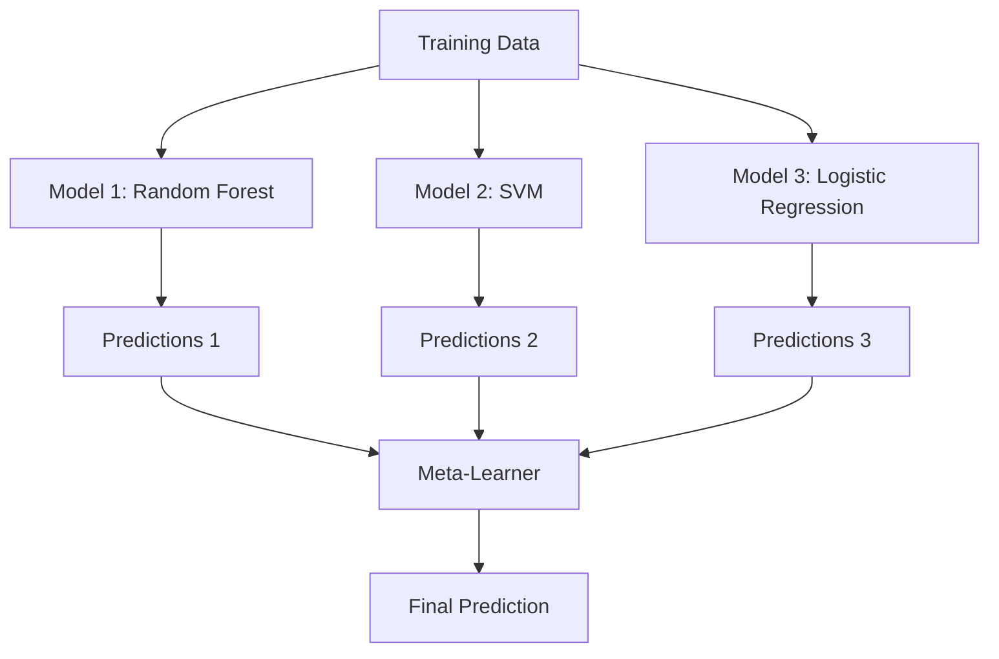

# 集成方法

一组弱学习器，如果正确组合，就能成为一个强学习器。这不是一个比喻，而是一个定理。

**类型：**构建
**语言：**Python
**先决条件：**第二阶段，第10课（偏差-方差权衡）
**时间：**约120分钟

## 学习目标

- Implement AdaBoost and gradient boosting from scratch and explain how boosting sequentially reduces bias
- Build a bagging ensemble and demonstrate how averaging decorrelated models reduces variance without increasing bias
- Compare bagging, boosting, and stacking in terms of what error component each method targets
- Evaluate ensemble diversity and explain why majority voting accuracy improves with more independent weak learners

## 问题

单决策树训练速度快且易于解释，但会过拟合。而单一线性模型在复杂边界上会欠拟合。你可能需要花费数天时间来设计完美的模型架构。或者，你可以结合多个不完美的模型，得到比单独任何一个都更好的结果。

集成方法正是如此。它们是处理表格数据赢得Kaggle竞赛最可靠的技术，也是大多数生产级机器学习系统的核心，同时它们展示了偏差-方差权衡的实际应用。Bagging可以减少方差，Boosting可以减少偏差，而Stacking则能学习哪些模型适用于哪些输入。

## 概念

### 为什么集成套件有效

假设你有N个独立的分类器，每个分类器的准确率p都大于0.5。多数投票的准确率如下：

```
P(majority correct) = sum over k > N/2 of C(N,k) * p^k * (1-p)^(N-k)
```

对于每个准确率达到60%的21个分类器，多数投票准确率约为74%。当分类器数量增加到101个时，这一比例上升至84%。当模型犯不同的错误时，这些错误会相互抵消。

关键要求是**多样性**。如果所有模型都犯相同的错误，将它们结合起来没有任何帮助。集成方法之所以有效，是因为它们通过以下方式产生多样化的模型：

- 不同的训练子集（bagging）
- 不同的特征子集（随机森林）
- 序列错误校正（boosting）
- 不同的模型家族（堆叠）

### Bagging（引导聚合）

袋化通过让每个模型训练于训练数据的不同随机采样上，从而创造多样性。



从原始数据中以有放回的方式抽取初始样本，其大小与原始数据相同。大约63.2%的独特样本会出现在每次初始样本中。剩余的36.8%（非袋内样本）则作为免费的验证集使用。

Bagging可以减少方差而不显著增加偏差。每棵单独的树都会过度拟合其初始样本，但每棵树的过度拟合情况不同，因此平均化可以消除噪声。

**随机森林**是一种带有额外特性的Bagging方法：在每次分割时，只考虑随机子集的特征。这进一步增强了树木之间的多样性。分类任务的典型候选特征数量是`sqrt(n_features)`，回归任务是`n_features / 3`。

### 增强（序列错误校正）

逐步提升模型性能。每个新模型都会专注于之前模型出错的部分。


提升算法可以减少偏差。每个新模型都能纠正迄今为止集成方法中的系统性错误。最终预测结果是所有模型的加权总和，其中性能更好的模型获得更高的权重。

权衡之处在于：如果运行过多轮次，提升算法可能会过拟合，因为它会不断尝试处理更难的示例，其中一些可能是噪声。

### AdaBoost

AdaBoost（自适应增强算法）是第一个实用的增强算法。它适用于任何基础学习器，通常是决策树桩（深度为1的树）。

```
1. Initialize sample weights: w_i = 1/N for all i

2. For t = 1 to T:
   a. Train weak learner h_t on weighted data
   b. Compute weighted error:
      err_t = sum(w_i * I(h_t(x_i) != y_i)) / sum(w_i)
   c. Compute model weight:
      alpha_t = 0.5 * ln((1 - err_t) / err_t)
   d. Update sample weights:
      w_i = w_i * exp(-alpha_t * y_i * h_t(x_i))
   e. Normalize weights to sum to 1

3. Final prediction: H(x) = sign(sum(alpha_t * h_t(x)))
```

模型的错误率越低，alpha值就越高。误分类的样本权重越大，因此下一个模型会更加关注这些样本。

### 梯度提升

梯度提升将提升方法推广到任意损失函数。它不是重新加权样本，而是将每个新模型拟合到当前集成模型的残差（损失的负梯度）上。

```
1. Initialize: F_0(x) = argmin_c sum(L(y_i, c))

2. For t = 1 to T:
   a. Compute pseudo-residuals:
      r_i = -dL(y_i, F_{t-1}(x_i)) / dF_{t-1}(x_i)
   b. Fit a tree h_t to the residuals r_i
   c. Find optimal step size:
      gamma_t = argmin_gamma sum(L(y_i, F_{t-1}(x_i) + gamma * h_t(x_i)))
   d. Update:
      F_t(x) = F_{t-1}(x) + learning_rate * gamma_t * h_t(x)

3. Final prediction: F_T(x)
```

对于平方误差损失，伪残差就是实际残差：`r_i = y_i - F_{t-1}(x_i)`。每棵树实际上都符合前一轮集成方法的误差。

学习率（收缩程度）控制着每棵树贡献的程度。较小的学习率需要更多的树，但泛化能力更强。典型值为0.01到0.3。

### XGBoost: Why It Dominates Tabular Data

XGBoost（极梯度提升）是一种经过工程优化的梯度提升方法，使其具有快速、准确且抗过拟合的能力：

- **正则化目标：**对叶子权重施加L1和L2惩罚，防止单个树过于自信
- **二阶近似：**使用损失函数的第一阶和第二阶导数，从而做出更好的分割决策
- **稀疏值处理：**通过学习每次分割时缺失数据的最佳处理方式，自然地处理缺失值
- **列子采样：**类似于随机森林，在每次分割时抽样特征以增加多样性
- **加权分位数抽样：**在分布式数据上高效找到连续特征的分割点
- **缓存感知的块结构：**内存布局优化以适应CPU缓存行

对于表格数据，XGBoost（及其继任者LightGBM）始终优于神经网络。这种情况短期内不会改变。如果您的数据适合以行和列构成的表格形式存储，请从梯度提升开始使用。

### 堆叠（元学习）

堆叠方法使用多个基础模型的预测结果作为元学习器的特征。



元学习器能够判断对于哪些输入应该信任哪个基础模型。如果随机森林在某些区域表现更好，而SVM在其他区域表现更佳，那么元学习器将学会相应地进行数据路由。

为了避免数据泄露，基础模型的预测必须通过训练集上的交叉验证来生成。你绝不能在同一份数据上同时训练和生成元特征。

### 投票

最简单的集成方法。直接合并预测结果。

- **硬投票：**以多数票决定类别标签。
- **软投票：**计算预测概率的平均值，选择平均概率最高的类别。通常更优，因为它使用了置信度信息。

## 构建它

### 步骤1：决策树桩（基础学习器）

`code/ensembles.py`中的代码从零开始实现了所有功能。我们从一个决策树开始：一棵具有单个分支的树。

```python
class DecisionStump:
    def __init__(self):
        self.feature_idx = None
        self.threshold = None
        self.polarity = 1
        self.alpha = None

    def fit(self, X, y, weights):
        n_samples, n_features = X.shape
        best_error = float("inf")

        for f in range(n_features):
            thresholds = np.unique(X[:, f])
            for thresh in thresholds:
                for polarity in [1, -1]:
                    pred = np.ones(n_samples)
                    pred[polarity * X[:, f] < polarity * thresh] = -1
                    error = np.sum(weights[pred != y])
                    if error < best_error:
                        best_error = error
                        self.feature_idx = f
                        self.threshold = thresh
                        self.polarity = polarity

    def predict(self, X):
        n = X.shape[0]
        pred = np.ones(n)
        idx = self.polarity * X[:, self.feature_idx] < self.polarity * self.threshold
        pred[idx] = -1
        return pred
```

### 步骤2：从零开始实现AdaBoost

```python
class AdaBoostScratch:
    def __init__(self, n_estimators=50):
        self.n_estimators = n_estimators
        self.stumps = []
        self.alphas = []

    def fit(self, X, y):
        n = X.shape[0]
        weights = np.full(n, 1 / n)

        for _ in range(self.n_estimators):
            stump = DecisionStump()
            stump.fit(X, y, weights)
            pred = stump.predict(X)

            err = np.sum(weights[pred != y])
            err = np.clip(err, 1e-10, 1 - 1e-10)

            alpha = 0.5 * np.log((1 - err) / err)
            weights *= np.exp(-alpha * y * pred)
            weights /= weights.sum()

            stump.alpha = alpha
            self.stumps.append(stump)
            self.alphas.append(alpha)

    def predict(self, X):
        total = sum(a * s.predict(X) for a, s in zip(self.alphas, self.stumps))
        return np.sign(total)
```

### 步骤3：从零开始实现梯度提升

```python
class GradientBoostingScratch:
    def __init__(self, n_estimators=100, learning_rate=0.1, max_depth=3):
        self.n_estimators = n_estimators
        self.lr = learning_rate
        self.max_depth = max_depth
        self.trees = []
        self.initial_pred = None

    def fit(self, X, y):
        self.initial_pred = np.mean(y)
        current_pred = np.full(len(y), self.initial_pred)

        for _ in range(self.n_estimators):
            residuals = y - current_pred
            tree = SimpleRegressionTree(max_depth=self.max_depth)
            tree.fit(X, residuals)
            update = tree.predict(X)
            current_pred += self.lr * update
            self.trees.append(tree)

    def predict(self, X):
        pred = np.full(X.shape[0], self.initial_pred)
        for tree in self.trees:
            pred += self.lr * tree.predict(X)
        return pred
```

### 步骤4：与sklearn进行比较

该代码验证了我们从零开始的实现与sklearn的`AdaBoostClassifier`和`GradientBoostingClassifier`具有相似的准确性，并同时比较了所有方法。

## 使用它

### When to Use Each Method

| 方法 | 减少 | 最适合场景 | 注意事项 |
|------|---------|----------|---------------|
| 袋式分类/随机森林 | 方差 | 数据噪声大，特征多 | 无法有效降低偏差 |
| AdaBoost | 偏差 | 数据干净，基础学习器简单 | 对异常值和噪声敏感 |
| 梯度提升 | 偏差 | 表格数据，竞赛场景 | 训练速度慢，未经调整易过拟合 |
| XGBoost / LightGBM | 两者都有 | 生产级表格机器学习 | 需要大量超参数调优 |
| Stacking | 两者都有 | 获取最后1-2%的准确率 | 复杂，存在过拟合元学习器的风险 |
| 投票法 | 方差 | 快速组合多种模型 | 仅当模型多样化时有效 |

### Tabular Data Production Stack

对于大多数表格预测问题，尝试以下顺序：

1. 使用 **LightGBM 或 XGBoost** 默认参数
2. 调整 n_estimators、learning_rate、max_depth、min_child_weight 参数
3. 如果还需要最后0.5%的准确率，则构建包含3-5个多样化模型的堆叠集成模型
4. 全程使用交叉验证

尽管持续有研究尝试，但神经网络在表格数据上的性能几乎总是不如梯度提升算法。TabNet、NODE 及类似架构偶尔能达到与经过良好调优的 XGBoost 相当的准确率，但很少超越它。

## 发货

本课程将生成 `outputs/prompt-ensemble-selector.md` -- 一个帮助您为给定数据集选择正确集成方法的提示。描述您的数据（大小、特征类型、噪声水平、类别平衡）以及您要解决的问题。该提示会引导您完成决策检查清单，推荐一种方法，建议初始超参数，并警告该方法的常见错误。同时生成 `outputs/skill-ensemble-builder.md` 文件，其中包含完整的选择指南。

## 练习

1. Modify the AdaBoost implementation to track training accuracy after each round. Plot accuracy vs. number of estimators. When does it converge?

2. Implement a random forest from scratch by adding random feature subsampling to the regression tree. Train 100 trees with `max_features=sqrt(n_features)` and average predictions. Compare variance reduction to a single tree.

3. In the gradient boosting implementation, add early stopping: track validation loss after each round and stop when it has not improved for 10 consecutive rounds. How many trees does it actually need?

4. Build a stacking ensemble with three base models (logistic regression, decision tree, k-nearest neighbors) and a logistic regression meta-learner. Use 5-fold cross-validation to generate meta-features. Compare to each base model alone.

5. Run XGBoost on the same dataset with default parameters. Compare its accuracy to your from-scratch gradient boosting. Time both. How large is the speed difference?

## | 关键词 | 翻译 |

| 术语 | 人们怎么说 | 实际含义 |
|------|------------|----------------|
| Bagging | “在随机子集上进行训练” | Bootstrap聚合：在bootstrap样本上训练模型，平均预测以减少方差 |
| Boosting | “关注难例” | 依次训练模型，每个模型纠正迄今为止集合的错误，以减少偏差 |
| AdaBoost | “重新加权数据” | 通过样本权重更新进行Boosting；分类错误的点获得更高的权重用于下一个学习器 |
| Gradient boosting | “拟合残差” | 通过将新模型拟合到损失函数的负梯度上进行Boosting |
| XGBoost | “Kaggle武器” | 带有正则化、二阶优化和系统级速度技巧的Gradient boosting |
| Stacking | “在模型之上使用模型” | 将基础模型的预测作为元学习器的输入特征 |
| Random forest | “许多随机树” | 使用决策树的Bagging，每次分裂时添加随机特征子采样以增加多样性 |
| 集成多样性 | “犯不同错误” | 模型必须在错误上不相关，才能使集合优于单个模型 |
| Out-of-bag error | “免费验证集” | 未包含在bootstrap抽取中的样本（约36.8%）可作为无需保留的样本作为验证集 |

## 更多阅读资料

- [Schapire & Freund: Boosting: Foundations and Algorithms](https://mitpress.mit.edu/9780262526036/) -- the book by the creators of AdaBoost
- [Friedman: Greedy Function Approximation: A Gradient Boosting Machine (2001)](https://statweb.stanford.edu/~jhf/ftp/trebst.pdf) -- the original gradient boosting paper
- [Chen & Guestrin: XGBoost (2016)](https://arxiv.org/abs/1603.02754) -- the XGBoost paper
- [Wolpert: Stacked Generalization (1992)](https://www.sciencedirect.com/science/article/abs/pii/S0893608005800231) -- the original stacking paper
- [scikit-learn Ensemble Methods](https://scikit-learn.org/stable/modules/ensemble.html) -- practical reference
