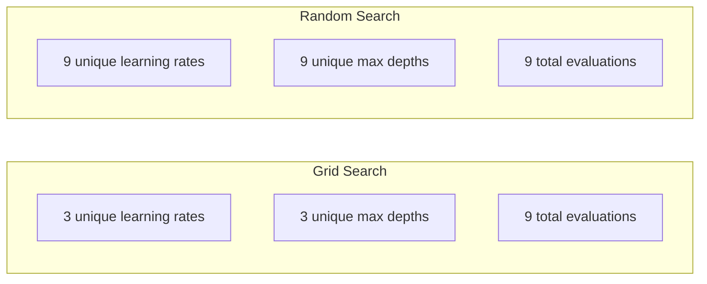
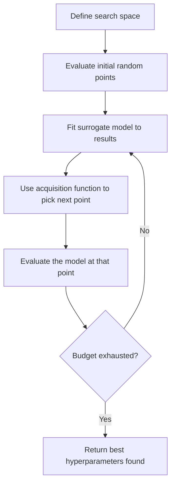
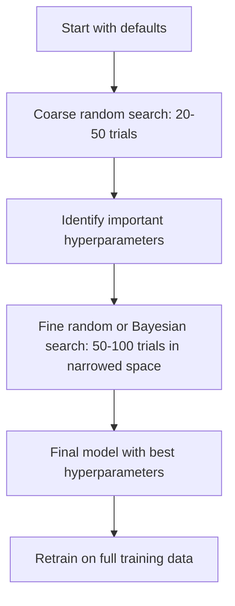
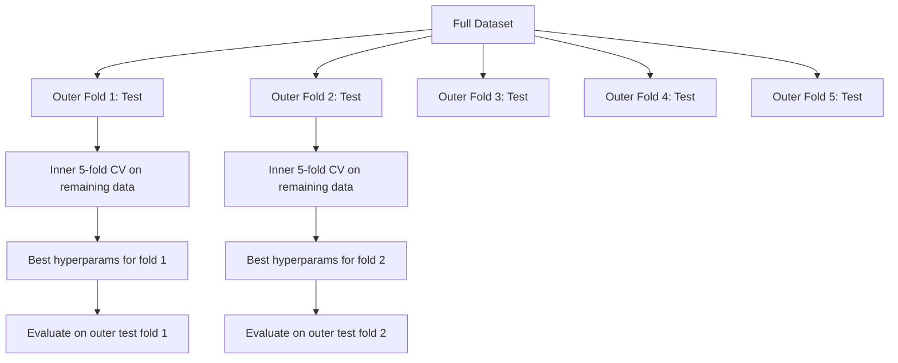

# 超参数调优

> 超参数是在训练开始之前需要调整的参数。正确调整这些参数是决定模型是平庸还是优秀的关键。

**类型：**构建
**语言：**Python
**先决条件：**第二阶段，第11课（集成方法）
**时间：**约90分钟

## 学习目标

- Implement grid search, random search, and Bayesian optimization from scratch and compare their sample efficiency
- Explain why random search outperforms grid search when most hyperparameters have low effective dimensionality
- Build a Bayesian optimization loop using a surrogate model and acquisition function to guide the search
- Design a hyperparameter tuning strategy that avoids overfitting the validation set through proper cross-validation

## 问题

您的梯度提升模型包含学习率、树的数量、最大深度、每叶最小样本数、子样本比例和列样本比例。这是六个超参数。如果每个超参数的合理值都有5种，那么网格就有5^6 = 15,625种组合。训练每一种组合需要10秒。这意味着要尝试所有组合需要43小时的计算时间。

网格搜索是显而易见的方法，但在大规模情况下效果最差。随机搜索在较少的计算资源下表现更好。贝叶斯优化通过从过去的评估中学习表现得更好。知道使用哪种策略以及哪些超参数真正重要，可以节省数天的浪费GPU时间。

## 概念

### Parameters vs Hyperparameters

在训练过程中学习参数（权重、偏置、分割阈值）。超参数在训练开始前设置，控制学习的进行方式。

| 超参数 | 控制内容 | 典型范围 |
| --- | --- | --- |
| 学习率 | 每次更新的步长 | 0.001到1.0 |
| 树/轮数 | 训练时长 | 10到10,000 |
| 最大深度 | 模型复杂度 | 1到30 |
| 正则化（lambda） | 防止过拟合 | 0.0001到100 |
| 批量大小 | 梯度估计噪声 | 16到512 |
| Dropout率 | 丢弃的神经元比例 | 0.0到0.5 |

### 网格搜索

网格搜索会评估所有指定值的组合。这种方法是穷尽式的且易于理解，但是随着超参数数量的增加而呈指数级增长。

```
Grid for 2 hyperparameters:

  learning_rate: [0.01, 0.1, 1.0]
  max_depth:     [3, 5, 7]

  Evaluations: 3 x 3 = 9 combinations

  (0.01, 3)  (0.01, 5)  (0.01, 7)
  (0.1,  3)  (0.1,  5)  (0.1,  7)
  (1.0,  3)  (1.0,  5)  (1.0,  7)
```

网格搜索有一个根本的缺陷：如果某个超参数很重要，而另一个不重要，那么大多数评估都将被浪费。在9次评估中，只有3个重要参数的唯一值被得到。

### 随机搜索

通过从分布中随机选取超参数，而不是使用网格搜索。在相同的9次评估预算下，每个超参数可以获得9个唯一值。



为什么随机搜索优于网格搜索（Bergstra & Bengio, 2012）：

- 大多数超参数具有较低的有效维度。对于给定问题，通常只有1-2个超参数至关重要。
- 网格搜索会在不重要的维度上浪费评估资源。
- 随机搜索在相同预算下能更密集地覆盖重要维度。
- 在60次随机尝试中，你有95%的机会找到距离最优解5%以内的点（如果最优解存在于搜索空间中）。

### 贝叶斯优化

随机搜索会忽略结果。它不会意识到高学习率会导致发散，或者深度为3的算法始终优于深度为10的算法。贝叶斯优化则利用过去的评估来决定下一步搜索的位置。



两个关键组件：

**替代模型：**一种易于评估的模型（通常是高斯过程），用于近似计算昂贵的目标函数。它可以在搜索空间中的任何点提供预测和不确定性估计。

**获取函数：**通过平衡利用（在已知好的位置附近搜索）和探索（在不确定性高的地方搜索）来决定下一步评估的位置。常见选择包括：

- **预期改进（EI）：**我们期望此时比当前最佳情况提高多少？
- **上置信界（UCB）：**预测值加上不确定性的倍数。较高的UCB意味着该点有潜力或未被探索。
- **改进概率（PI）：**该点击败当前最佳情况的概率是多少？

贝叶斯优化通常能找到比随机搜索更好的超参数，且评估次数减少2-5倍。与训练实际模型相比，拟合替代模型的开销可以忽略不计。

### 早期停止

并非每次训练运行都需要完成。如果某个配置在10个周期后明显表现不佳，则停止并继续下一步。这是超参数搜索中的提前终止方法。

策略：
- **基于耐心的策略：**如果在连续N个周期中验证损失没有改善，则停止。
- **中位数剪枝：**如果试验的中间结果比同一阶段已完成试验的中位数更差，则停止。
- **Hyperband：**为许多配置分配小预算，然后逐步增加最佳配置的预算。

Hyperband特别有效。它从81个每个包含1个周期的配置开始，保留前三分之一的配置，给它们3个周期，再保留前三分之一的配置，如此循环。这种方法找到良好配置的速度比使用全部预算评估所有配置快10-50倍。

### 学习率调度器

学习率几乎总是最重要的超参数。调度器在训练过程中会调整它，而不是将其固定。

| 调度器 | 公式 | 使用时机 |
|-----------|---------|-------------|
| 步长衰减 | 每N个周期乘以0.1 | 经典CNN训练 |
| 余弦退火 | lr * 0.5 * (1 + cos(pi * t / T)) | 现代默认设置 |
| 预热+衰减 | 线性增加然后余弦衰减 | Transformer模型 |
| 单周期 | 在一个周期内增加然后减少 | 快速收敛 |
| 在平台期减少 | 当指标停滞时按因子减少 | 安全默认设置 |

### 超参数重要性

并非所有超参数都同等重要。关于随机森林的研究（Probst等人，2019年）和梯度提升显示出了一致的模式：

**重要性高：**
- 学习率（必须首先调整）
- 估计器数量/训练周期（使用提前停止而非调整）
- 正则化强度

**中等重要性：**
- 最大深度/层数
- 每叶最小样本数/权重衰减
- 子样本比例

**低重要性：**
- 最大特征数（对于随机森林）
- 特定的激活函数选择
- 批量大小（在合理范围内）

首先调整重要的超参数，其余的保持默认值。

### 实用策略



具体工作流程如下：

1. **从库默认设置开始。**这些设置由经验丰富的从业者选择，通常已经达到了80%的成功率。
2. **粗略随机搜索。**范围广泛，进行20-50次试验。使用提前停止机制快速淘汰失败的尝试。
3. **分析结果。**哪些超参数与性能相关？缩小搜索空间。
4. **精细搜索。**在缩小的范围内进行贝叶斯优化或集中随机搜索。进行50-100次试验。
5. **使用找到的最佳超参数在所有训练数据上进行重新训练。**

### 交叉验证集成

在单个验证集上调整超参数具有风险。最佳超参数可能仅适用于特定的验证数据集。嵌套交叉验证通过两个循环来解决这个问题：

- **外部循环**（评估）：将数据分为训练集、验证集和测试集，并报告无偏见的性能。
- **内部循环**（调整）：将训练集和验证集再次划分为训练集和验证集，找到最佳超参数。



每个外部折叠都独立地找到其最佳超参数。外部得分是对泛化性能的无偏估计。

使用sklearn：

```python
from sklearn.model_selection import cross_val_score, GridSearchCV
from sklearn.ensemble import GradientBoostingRegressor

inner_cv = GridSearchCV(
    GradientBoostingRegressor(),
    param_grid={
        "learning_rate": [0.01, 0.05, 0.1],
        "max_depth": [2, 3, 5],
        "n_estimators": [50, 100, 200],
    },
    cv=5,
    scoring="neg_mean_squared_error",
)

outer_scores = cross_val_score(
    inner_cv, X, y, cv=5, scoring="neg_mean_squared_error"
)

print(f"Nested CV MSE: {-outer_scores.mean():.4f} +/- {outer_scores.std():.4f}")
```

This is expensive (5 outer folds x 5 inner folds x 27 grid points = 675 model fits), but it provides a reliable performance estimation. Use it when reporting final results in papers or when the importance of the decision is high.

### 实用技巧

**Start with the learning rate.** It is always the most important hyperparameter for gradient-based methods. A bad learning rate makes everything else irrelevant. Fix other hyperparameters at defaults and sweep learning rate first.

**Use log-uniform distributions for learning rate and regularization.** The difference between 0.001 and 0.01 matters as much as the difference between 0.1 and 1.0. Searching linearly wastes budget on the large end.

**Use early stopping instead of tuning n_estimators.** For boosting and neural networks, set n_estimators or epochs high and let early stopping decide when to stop. This removes one hyperparameter from the search.

**Budget allocation.** Spend 60% of your tuning budget on the top 2 most important hyperparameters. Spend the remaining 40% on everything else. The top 2 account for most of the performance variation.

**Scale matters.** Never search batch size on a log scale (16, 32, 64 are fine). Always search learning rate on a log scale. Match the search distribution to how the hyperparameter affects the model.

| Model Type | Top Hyperparameters | Recommended Search | Budget |
|-----------|--------------------|--------------------|--------|
| Random Forest | n_estimators, max_depth, min_samples_leaf | Random search, 50 trials | Low (fast training) |
| Gradient Boosting | learning_rate, n_estimators, max_depth | Bayesian, 100 trials + early stopping | Medium |
| Neural Network | learning_rate, weight_decay, batch_size | Bayesian or random, 100+ trials | High (slow training) |
| SVM | C, gamma (RBF kernel) | Grid on log scale, 25-50 trials | Low (2 params) |
| Lasso/Ridge | alpha | 1D search on log scale, 20 trials | Very low |
| XGBoost | learning_rate, max_depth, subsample, colsample | Bayesian, 100-200 trials + early stopping | Medium |

**When in doubt:** random search with 2x the number of hyperparameters as trials (e.g., 6 hyperparameters = 12+ trials minimum). You will be surprised how often random search with 50 trials beats carefully designed grid search.

```figure
k-fold-cv
```

## 构建它

### 步骤1：从零开始进行网格搜索

`code/tuning.py`中的代码实现了网格搜索、随机搜索以及从零开始的简单贝叶斯优化器。

```python
def grid_search(model_fn, param_grid, X_train, y_train, X_val, y_val):
    keys = list(param_grid.keys())
    values = list(param_grid.values())
    best_score = -float("inf")
    best_params = None
    n_evals = 0

    for combo in itertools.product(*values):
        params = dict(zip(keys, combo))
        model = model_fn(**params)
        model.fit(X_train, y_train)
        score = evaluate(model, X_val, y_val)
        n_evals += 1

        if score > best_score:
            best_score = score
            best_params = params

    return best_params, best_score, n_evals
```

### 步骤2：从零开始进行随机搜索

```python
def random_search(model_fn, param_distributions, X_train, y_train,
                  X_val, y_val, n_iter=50, seed=42):
    rng = np.random.RandomState(seed)
    best_score = -float("inf")
    best_params = None

    for _ in range(n_iter):
        params = {k: sample(v, rng) for k, v in param_distributions.items()}
        model = model_fn(**params)
        model.fit(X_train, y_train)
        score = evaluate(model, X_val, y_val)

        if score > best_score:
            best_score = score
            best_params = params

    return best_params, best_score, n_iter
```

### 步骤3：贝叶斯优化（简化版）

核心思想：将高斯过程拟合到观测到的（超参数，得分）对上，然后使用获取函数来决定下一步寻找的位置。

```python
class SimpleBayesianOptimizer:
    def __init__(self, search_space, n_initial=5):
        self.search_space = search_space
        self.n_initial = n_initial
        self.X_observed = []
        self.y_observed = []

    def _kernel(self, x1, x2, length_scale=1.0):
        dists = np.sum((x1[:, None, :] - x2[None, :, :]) ** 2, axis=2)
        return np.exp(-0.5 * dists / length_scale ** 2)

    def _fit_gp(self, X_new):
        X_obs = np.array(self.X_observed)
        y_obs = np.array(self.y_observed)
        y_mean = y_obs.mean()
        y_centered = y_obs - y_mean

        K = self._kernel(X_obs, X_obs) + 1e-4 * np.eye(len(X_obs))
        K_star = self._kernel(X_new, X_obs)

        L = np.linalg.cholesky(K)
        alpha = np.linalg.solve(L.T, np.linalg.solve(L, y_centered))
        mu = K_star @ alpha + y_mean

        v = np.linalg.solve(L, K_star.T)
        var = 1.0 - np.sum(v ** 2, axis=0)
        var = np.maximum(var, 1e-6)

        return mu, var

    def _expected_improvement(self, mu, var, best_y):
        sigma = np.sqrt(var)
        z = (mu - best_y) / (sigma + 1e-10)
        ei = sigma * (z * norm_cdf(z) + norm_pdf(z))
        return ei

    def suggest(self):
        if len(self.X_observed) < self.n_initial:
            return sample_random(self.search_space)

        candidates = [sample_random(self.search_space) for _ in range(500)]
        X_cand = np.array([to_vector(c) for c in candidates])
        mu, var = self._fit_gp(X_cand)
        ei = self._expected_improvement(mu, var, max(self.y_observed))
        return candidates[np.argmax(ei)]

    def observe(self, params, score):
        self.X_observed.append(to_vector(params))
        self.y_observed.append(score)
```

GP替代模型在每个候选点提供两个信息：预测分数（mu）和不确定性（var）。预期改进机制平衡了这些信息：它倾向于那些模型预测高分或不确定性高的区域。早期，大多数点的不确定性都很高，因此优化器会进行探索。后期，它将重点放在最有希望的区域。

### 步骤4：比较所有方法

在相同的合成目标上运行所有三种方法并进行比较。此比较使用了一个简化的包装器，该包装器将每个优化器直接调用一个目标函数（无需模型训练），因此API与上述基于模型的实现有所不同：

```python
def synthetic_objective(params):
    lr = params["learning_rate"]
    depth = params["max_depth"]
    return -(np.log10(lr) + 2) ** 2 - (depth - 4) ** 2 + 10

param_grid = {
    "learning_rate": [0.001, 0.01, 0.1, 1.0],
    "max_depth": [2, 3, 4, 5, 6, 7, 8],
}

grid_best = None
grid_score = -float("inf")
grid_history = []
for combo in itertools.product(*param_grid.values()):
    params = dict(zip(param_grid.keys(), combo))
    score = synthetic_objective(params)
    grid_history.append((params, score))
    if score > grid_score:
        grid_score = score
        grid_best = params

param_dist = {
    "learning_rate": ("log_float", 0.001, 1.0),
    "max_depth": ("int", 2, 8),
}

rand_best = None
rand_score = -float("inf")
rand_history = []
rng = np.random.RandomState(42)
for _ in range(28):
    params = {k: sample(v, rng) for k, v in param_dist.items()}
    score = synthetic_objective(params)
    rand_history.append((params, score))
    if score > rand_score:
        rand_score = score
        rand_best = params

optimizer = SimpleBayesianOptimizer(param_dist, n_initial=5)
bayes_history = []
for _ in range(28):
    params = optimizer.suggest()
    score = synthetic_objective(params)
    optimizer.observe(params, score)
    bayes_history.append((params, score))
bayes_score = max(s for _, s in bayes_history)

print(f"{'Method':<20} {'Best Score':>12} {'Evaluations':>12}")
print("-" * 50)
print(f"{'Grid Search':<20} {grid_score:>12.4f} {len(grid_history):>12}")
print(f"{'Random Search':<20} {rand_score:>12.4f} {len(rand_history):>12}")
print(f"{'Bayesian Opt':<20} {bayes_score:>12.4f} {len(bayes_history):>12}")
```

在相同预算下，贝叶斯优化通常能以最快的速度找到最佳得分，因为它不会在明显劣质的区域浪费评估次数。随机搜索覆盖的范围比网格搜索更广。只有当超参数非常少且可以承受穷尽搜索时，网格搜索才会胜出。

## 使用它

### Optuna in Practice

Optuna是进行严肃的超参数调优的推荐库。它直接支持剪枝、分布式搜索和可视化功能。

```python
import optuna

def objective(trial):
    lr = trial.suggest_float("learning_rate", 1e-4, 1e-1, log=True)
    n_est = trial.suggest_int("n_estimators", 50, 500)
    max_depth = trial.suggest_int("max_depth", 2, 10)

    model = GradientBoostingRegressor(
        learning_rate=lr,
        n_estimators=n_est,
        max_depth=max_depth,
    )
    model.fit(X_train, y_train)
    return mean_squared_error(y_val, model.predict(X_val))

study = optuna.create_study(direction="minimize")
study.optimize(objective, n_trials=100)

print(f"Best params: {study.best_params}")
print(f"Best MSE: {study.best_value:.4f}")
```

Optuna key features:
- `suggest_float(..., log=True)` for parameters best searched on the log scale (learning rate, regularization)
- `suggest_int` for integer parameters
- `suggest_categorical` for discrete choices
- Built-in MedianPruner for early stopping of bad trials
- `study.trials_dataframe()` for analysis

### Optuna with Pruning is a powerful optimization tool that combines advanced algorithms for parameter tuning and pruning techniques to improve model performance. This combination allows for more efficient and effective search of optimal parameters, resulting in better models and reduced training time.

早期修剪那些不具前景的尝试，从而节省大量计算资源。模式如下：

```python
import optuna
from sklearn.model_selection import cross_val_score

def objective(trial):
    params = {
        "learning_rate": trial.suggest_float("lr", 1e-4, 0.5, log=True),
        "max_depth": trial.suggest_int("max_depth", 2, 10),
        "n_estimators": trial.suggest_int("n_estimators", 50, 500),
        "subsample": trial.suggest_float("subsample", 0.5, 1.0),
    }

    model = GradientBoostingRegressor(**params)
    scores = cross_val_score(model, X_train, y_train, cv=3,
                             scoring="neg_mean_squared_error")
    mean_score = -scores.mean()

    trial.report(mean_score, step=0)
    if trial.should_prune():
        raise optuna.TrialPruned()

    return mean_score

pruner = optuna.pruners.MedianPruner(n_startup_trials=10, n_warmup_steps=5)
study = optuna.create_study(direction="minimize", pruner=pruner)
study.optimize(objective, n_trials=200)
```

`MedianPruner` will stop a trial if its intermediate value is worse than the median of all completed trials at the same step. To perform pruning, you need to call `trial.report()` to report intermediate metrics and `trial.should_prune()` to determine whether the trial should be stopped. The parameter `n_startup_trials=10` ensures that at least 10 trials are fully completed before pruning is applied. This typically saves 40-60% of the total computational resources.

### sklearn的内置调整器

对于快速实验，sklearn提供了`GridSearchCV`、`RandomizedSearchCV`和`HalvingRandomSearchCV`：

```python
from sklearn.model_selection import RandomizedSearchCV
from scipy.stats import loguniform, randint

param_dist = {
    "learning_rate": loguniform(1e-4, 0.5),
    "max_depth": randint(2, 10),
    "n_estimators": randint(50, 500),
}

search = RandomizedSearchCV(
    GradientBoostingRegressor(),
    param_dist,
    n_iter=100,
    cv=5,
    scoring="neg_mean_squared_error",
    random_state=42,
    n_jobs=-1,
)
search.fit(X_train, y_train)
print(f"Best params: {search.best_params_}")
print(f"Best CV MSE: {-search.best_score_:.4f}")
```

使用 scipy 中的 `loguniform` 来处理学习率和正则化参数。使用 `randint` 生成整数超参数。`n_jobs=-1` 标志可以并行处理所有 CPU 核心。

### 常见的超参数调优错误

**数据泄露通过预处理。**如果在交叉验证之前对完整数据集进行缩放处理，验证集的信息会泄露到训练数据中。始终将预处理放在`Pipeline`中，使其仅在训练集上进行。

**过度拟合验证集。**运行数千次试验实际上是在验证集上进行的训练。使用嵌套交叉验证来估计最终性能，或者保留一个在调参过程中不会使用的独立测试集。

**搜索范围过于狭窄。**如果最佳值位于搜索空间的边界，说明你没有进行足够的搜索。最优值可能位于你的范围之外。始终检查最佳参数是否位于边缘。

**忽略交互效应。**在提升算法中，学习率和估计器的数量之间存在强烈的交互作用。低学习率需要更多的估计器。独立调整它们会比一起调整得到更差的结果。

**不对迭代模型使用提前停止。**对于梯度提升和神经网络，将n_estimators或epochs设置为较高值，并使用提前停止。这比单独调整迭代次数作为超参数要好得多。

## 练习

1. Run grid search and random search with the same total budget (e.g., 50 evaluations). Compare the best scores found. Run the experiment 10 times with different seeds. How often does random search win?

2. Implement Hyperband from scratch. Start with 81 configurations, each trained for 1 epoch. Keep the top 1/3 at each round and triple their budget. Compare total compute (sum of all epochs across all configs) to running 81 configs for the full budget.

3. Add a learning rate scheduler (cosine annealing) to the gradient boosting implementation from Lesson 11. Does it help compared to a fixed learning rate?

4. Use Optuna to tune a RandomForestClassifier on a real dataset (e.g., sklearn's breast cancer dataset). Use `optuna.visualization.plot_param_importances(study)` to see which hyperparameters matter most. Does it match the importance ranking from this lesson?

5. Implement a simple acquisition function (Expected Improvement) and demonstrate exploration vs exploitation. Plot the surrogate model’s mean and uncertainty, and show where EI chooses to evaluate next.

## | 关键词 | 翻译 |

| 术语 | 人们怎么说 | 实际含义 |
|------|------------|----------------|
| 超参数 | “你选择的设置” | 在训练前设定的值，用于控制学习过程，而非从数据中学习到的内容 |
| 网格搜索 | “尝试所有组合” | 对指定参数网格进行全面搜索。成本呈指数级增长 |
| 随机搜索 | “随机采样” | 从分布中采样超参数。比网格搜索更能覆盖重要维度 |
| 贝叶斯优化 | “智能搜索” | 使用目标的替代模型来决定下一步评估位置，平衡探索与利用 |
| 替代模型 | “便宜的近似模型” | 一种模型（通常是高斯过程），通过观察到的评估结果来近似昂贵的目标函数 |
| 获取函数 | “下一步寻找的位置” | 通过平衡预期改进与不确定性来评估候选点。EI和UCB是常见的选择 |
| 提前停止 | “停止浪费时间” | 当验证性能不再改善时提前终止训练 |
| Hyperband | “配置的多人赛制” | 自适应资源分配：启动许多配置并设定小预算，保留最佳配置并增加其预算 |
| 学习率调度器 | “在训练过程中改变lr” | 一种在训练过程中调整学习率的函数，以实现更好的收敛 |

## 更多阅读资料

- [Bergstra & Bengio: Random Search for Hyper-Parameter Optimization (2012)](https://jmlr.org/papers/v13/bergstra12a.html) -- 该论文展示了随机搜索在超参数优化中的应用。
- [Snoek et al., Practical Bayesian Optimization of Machine Learning Algorithms (2012)](https://arxiv.org/abs/1206.2944) -- 机器学习算法的贝叶斯优化方法。
- [Li et al., Hyperband: A Novel Bandit-Based Approach (2018)](https://jmlr.org/papers/v18/16-558.html) -- Hyperband论文。
- [Optuna: A Next-generation Hyperparameter Optimization Framework](https://arxiv.org/abs/1907.10902) -- Optuna超参数优化框架论文。
- [Probst et al., Tunability: Importance of Hyperparameters (2019)](https://jmlr.org/papers/v20/18-444.html) -- 哪些超参数重要。
