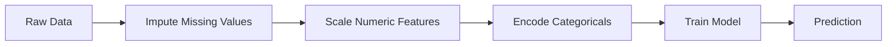
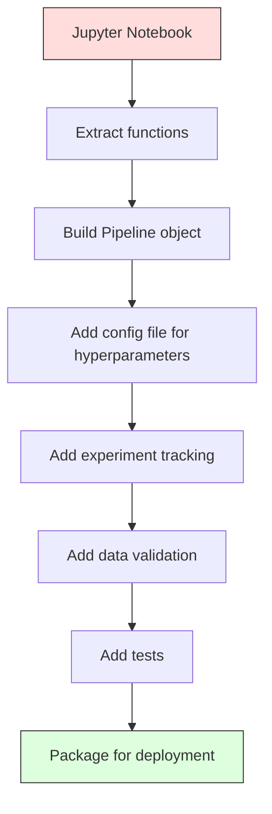

# ML Pipelines

> 模型不是产品。管道是。管道包括从原始数据到部署的预测整个过程，且每个步骤都必须可复制。

**类型：**构建
**语言：**Python
**先决条件：**第二阶段，第12课（超参数调优）
**时间：**约120分钟

## 学习目标

- Build an ML pipeline from scratch that chains imputation, scaling, encoding, and model training into a single reproducible object
- Identify data leakage scenarios and explain how pipelines prevent them by fitting transformers only on training data
- Construct a ColumnTransformer that applies different preprocessing to numeric and categorical features
- Implement pipeline serialization and demonstrate that the same fitted pipeline produces identical results in training and production

## 问题

您有一个能够加载数据、用中位数填充缺失值、对特征进行缩放、训练模型并输出准确率的笔记本。它运行正常，您可以将其部署使用。

一个月后，有人重新训练了模型，得到了不同的结果。中位数的计算是基于包含测试数据的完整数据集进行的（即数据泄露）。缩放参数未被保存，因此推理过程使用了不同的统计数据。特征工程代码在训练和服务之间被复制粘贴，导致结果不同。在生产环境中，有一个分类列增加了编码器从未见过的新值。

这些并非假设情况，而是机器学习系统在生产环境中失败的最常见原因。管道技术通过将每个转换步骤打包成一个单一、有序且可复现的对象来解决所有这些问题。

## 概念

### 什么是管道？

管道是一系列有序的数据转换步骤，随后是模型。每个步骤将前一步的输出作为输入。整个管道在训练数据上进行一次拟合。在推理时，相同的拟合管道对新数据进行转换并生成预测结果。



该管道保证以下事项：
- 转换仅应用于训练数据（无泄漏）
- 在推理时应用相同的转换
- 整个对象可以序列化并作为单个工件部署
- 交叉验证按折叠应用该管道，防止细微的泄漏

### 数据泄露：无声的杀手

数据泄露发生在测试集或未来数据中的信息污染了训练过程时。管道可以防止最常见的形式的数据泄露。
```python
X = df.drop("target", axis=1)
y = df["target"]

scaler = StandardScaler()
X_scaled = scaler.fit_transform(X)

X_train, X_test = X_scaled[:800], X_scaled[800:]
y_train, y_test = y[:800], y[800:]
```

缩放器查看了测试数据。均值和标准差包含了测试样本。这会增加准确性估计的偏差。

**正确：**
```python
X_train, X_test = X[:800], X[800:]

scaler = StandardScaler()
X_train_scaled = scaler.fit_transform(X_train)
X_test_scaled = scaler.transform(X_test)
```

使用管道后，您无需担心这一点。管道会自动处理。

### sklearn Pipeline 是 sklearn 库中的一种数据处理流程，用于自动化执行一系列步骤以完成特定任务。它类似于编程中的流水线，可以简化复杂的操作过程，提高效率。

sklearn的`Pipeline`将变换器和估计器链接在一起。它提供了`.fit()`、`-.predict()`和`.score()`方法，这些方法按顺序执行所有步骤。

```python
from sklearn.pipeline import Pipeline
from sklearn.preprocessing import StandardScaler
from sklearn.linear_model import LogisticRegression

pipe = Pipeline([
    ("scaler", StandardScaler()),
    ("model", LogisticRegression()),
])

pipe.fit(X_train, y_train)
predictions = pipe.predict(X_test)
```

当您调用 `pipe.fit(X_train, y_train)` 时：
1. 缩放器对 X_train 调用 `fitTransform`
2. 模型对缩放后的 X_train 调用 `fit`

当您调用 `pipe.predict(X_test)` 时：
1. 缩放器对 X_test 调用 `transform`（而非 fitTransform）
2. 模型对缩放后的 X_test 调用 `predict`

在拟合过程中，缩放器永远不会看到测试数据。这就是关键所在。

### ColumnTransformer: Different Pipelines for Different Columns

真实的数据集包含数值列和分类列，这些列需要不同的预处理。`ColumnTransformer`可以处理这个问题。

```python
from sklearn.compose import ColumnTransformer
from sklearn.preprocessing import StandardScaler, OneHotEncoder
from sklearn.impute import SimpleImputer

numeric_pipe = Pipeline([
    ("impute", SimpleImputer(strategy="median")),
    ("scale", StandardScaler()),
])

categorical_pipe = Pipeline([
    ("impute", SimpleImputer(strategy="most_frequent")),
    ("encode", OneHotEncoder(handle_unknown="ignore")),
])

preprocessor = ColumnTransformer([
    ("num", numeric_pipe, ["age", "income", "score"]),
    ("cat", categorical_pipe, ["city", "gender", "plan"]),
])

full_pipeline = Pipeline([
    ("preprocess", preprocessor),
    ("model", GradientBoostingClassifier()),
])
```

在OneHotEncoder中，`handle_unknown="ignore"`的设置对于生产环境至关重要。当出现新的类别（模型从未见过的城市）时，它会生成零向量而不是崩溃。

### Experiment Tracking

管道使得训练过程可复制，但您还需要跟踪实验过程中的情况：使用了哪些超参数、哪个数据集版本、指标是什么、运行了什么代码。

**MLflow**是最常用的开源解决方案：

```python
import mlflow

with mlflow.start_run():
    mlflow.log_param("max_depth", 5)
    mlflow.log_param("n_estimators", 100)
    mlflow.log_param("learning_rate", 0.1)

    pipe.fit(X_train, y_train)
    accuracy = pipe.score(X_test, y_test)

    mlflow.log_metric("accuracy", accuracy)
    mlflow.sklearn.log_model(pipe, "model")
```

每次运行都会记录参数、指标、工件以及完整的模型。你可以比较不同的运行结果，复现任何实验，并部署任何版本的模型。

**Weighting and Bias (wandb)** 提供相同的功能，但有一个托管的仪表板：

```python
import wandb

wandb.init(project="my-pipeline")
wandb.config.update({"max_depth": 5, "n_estimators": 100})

pipe.fit(X_train, y_train)
accuracy = pipe.score(X_test, y_test)

wandb.log({"accuracy": accuracy})
```

### 模型版本管理

在实验跟踪之后，你需要管理模型版本。哪个模型正在生产环境中使用？哪个在测试阶段？哪个是上周使用的？

MLflow的模型注册表提供：
- **版本跟踪：**每个保存的模型都有版本号
- **阶段转换：**“测试阶段”、“生产环境”、“归档”
- **审批流程：**模型必须明确升级到生产环境
- **回滚：**立即恢复到之前的版本

### 使用DVC进行数据版本控制

Code is versioned using Git. Data should also be versioned, but Git cannot handle large files. DVC (Data Version Control) solves this problem.

```
dvc init
dvc add data/training.csv
git add data/training.csv.dvc data/.gitignore
git commit -m "Track training data"
dvc push
```

DVC将实际数据存储在远程存储（S3、GCS、Azure）中，并在git中保留一个小的`.dvc`文件来记录哈希值。当你检出git提交时，`dvc checkout`会恢复所使用的确切数据。

这意味着每个git提交都关联了代码和数据，从而实现完全的可复现性。

### 可重现的实验

可复现的实验需要四样东西：

1. **固定的随机种子：**为 numpy、random 以及框架（如 torch、sklearn）设置种子。
2. **固定的依赖项：**使用 requirements.txt 或 poetry.lock 记录确切的版本。
3. **版本化的数据：**使用 DVC 或类似工具。
4. **配置文件：**所有超参数都存储在配置文件中，而非硬编码。

```python
import numpy as np
import random

def set_seed(seed=42):
    random.seed(seed)
    np.random.seed(seed)
    try:
        import torch
        torch.manual_seed(seed)
        torch.cuda.manual_seed_all(seed)
        torch.backends.cudnn.deterministic = True
    except ImportError:
        pass
```

### 从笔记到生产管道



典型的进展步骤：

1. **笔记本探索：**进行快速实验、可视化分析、提出功能想法
2. **提取函数：**将预处理、特征工程、评估任务分离到模块中
3. **构建流水线：**将转换操作链接成一个 sklearn Pipeline 或自定义类
4. **配置管理：**将所有超参数放入 YAML/JSON 配置文件中
5. **实验跟踪：**使用 MLflow 或 wandb 进行日志记录
6. **数据验证：**在训练前检查模式、分布和缺失值情况
7. **测试：**对 transformers 进行单元测试，对整个流水线进行集成测试
8. **部署：**序列化流水线，封装成 API（如 FastAPI、Flask），并进行容器化部署

### 常见的管道错误

| 错误 | 原因 | 修复方法 |
|------|-----|---------|
| 在分割前使用全部数据 | 数据泄露 | 使用cross_val_score进行管道处理 |
| 在管道之外进行特征工程 | 训练与服务使用不同的转换方式 | 将所有转换步骤放入管道中 |
| 未处理未知类别 | 新值导致生产环境崩溃 | 使用OneHotEncoder并设置handle_unknown="ignore" |
| 硬编码列名 | 模式变更时出现问题 | 从配置文件中获取列名列表 |
| 无数据验证 | 不良数据导致错误预测 | 在预测前添加模式检查 |
| 训练/服务偏差 | 模型在生产环境中看到不同的特征 | 为训练和服務使用同一个管道对象 |

## 构建它

`code/pipeline.py`中的代码从零开始构建了一个完整的机器学习管道：

### 步骤1：自定义变换器

```python
class CustomTransformer:
    def __init__(self):
        self.means = None
        self.stds = None

    def fit(self, X):
        self.means = np.mean(X, axis=0)
        self.stds = np.std(X, axis=0)
        self.stds[self.stds == 0] = 1.0
        return self

    def transform(self, X):
        return (X - self.means) / self.stds

    def fit_transform(self, X):
        return self.fit(X).transform(X)
```

### 步骤2：从零开始构建管道

```python
class PipelineFromScratch:
    def __init__(self, steps):
        self.steps = steps

    def fit(self, X, y=None):
        X_current = X.copy()
        for name, step in self.steps[:-1]:
            X_current = step.fit_transform(X_current)
        name, model = self.steps[-1]
        model.fit(X_current, y)
        return self

    def predict(self, X):
        X_current = X.copy()
        for name, step in self.steps[:-1]:
            X_current = step.transform(X_current)
        name, model = self.steps[-1]
        return model.predict(X_current)
```

### 步骤3：与管道进行交叉验证

该代码展示了如何使用管道进行交叉验证来防止数据泄露：缩放器在每个折叠的训练数据上分别进行训练。

### 步骤4：使用sklearn构建完整的生产流水线

一个包含`ColumnTransformer`、多个预处理路径以及模型的完整管道，通过适当的交叉验证和实验记录进行训练。

## 发货

本课程将生成以下文件：
- `outputs/prompt-ml-pipeline.md` —— 一项关于构建和调试机器学习管道的技能
- `code/pipeline.py` —— 从零开始使用sklearn构建完整管道的代码

## 练习

1. Build a pipeline that handles a dataset with 3 numerical columns and 2 categorical columns. Use `ColumnTransformer` to apply median imputation + scaling to numerical data and most-frequent imputation + one-hot encoding to categorical data. Train the pipeline using 5-fold cross-validation.

2. Deliberately introduce data leakage by fitting the scaling algorithm on the entire dataset before splitting it into training and testing sets. Compare the cross-validation score of the leaky pipeline with that of the clean pipeline. How significant is the difference?

3. Serialize the pipeline using `joblib.dump`. Load the serialized pipeline in a separate script and run predictions. Verify that the predictions are identical.

4. Add a custom transformer to the pipeline that creates polynomial features (degree 2) for the two most important numerical columns. Where should this custom transformer be placed within the pipeline?

5. Set up MLflow tracking for the pipeline. Run 5 experiments with different hyperparameters. Use the MLflow UI to compare the results and select the best model.

## | 关键词 | 翻译 |

| 术语 | 人们怎么说 | 实际含义 |
|------|------------|----------------|
| 管道 | “转换链 + 模型” | 一系列有序的拟合过的转换器和模型，作为一个整体应用以防止数据泄露 |
| 数据泄露 | “测试信息泄露到训练过程中” | 使用训练集外的信息构建模型，从而夸大性能估计值 |
| 列转换器 | “每列不同的预处理” | 对不同的列子集应用不同的管道，合并结果 |
| 实验跟踪 | “记录你的运行过程” | 每次训练运行时记录参数、指标、工件和代码版本 |
| MLflow | “跟踪和部署模型” | 用于实验跟踪、模型注册表和部署的开源平台 |
| DVC | “Git用于数据管理” | 大型数据文件的版本控制系统，将哈希值存储在git中，数据存储在远程存储中 |
| 模型注册表 | “模型版本目录” | 一个通过阶段标签（测试、生产、归档）跟踪模型版本的系统 |
| 训练/服务偏差 | “它在笔记本中有效” | 训练过程中数据处理方式与推理过程中的差异，导致隐式错误 |
| 可重现性 | “相同的代码，相同的结果” | 从相同的代码、数据和配置获得相同结果的能力 |

## 更多阅读资料

- [scikit-learn Pipeline文档](https://scikit-learn.org/stable/modules/compose.html) -- 官方管道参考手册  
- [MLflow文档](https://mlflow.org/docs/latest/index.html) -- 实验跟踪和模型注册表  
- [DVC文档](https://dvc.org/doc) -- 数据版本控制  
- [Sculley等人，《机器学习系统中的隐藏技术债务》（2015年）](https://papers.nips.cc/paper/2015/hash/86df7dcfd896fcaf2674f757a2463eba-Abstract.html) -- 关于机器学习系统复杂性的开创性论文  
- [Google ML最佳实践：ML规则](https://developers.google.com/machine-learning/guides/rules-of-ml) -- 实用的生产级机器学习建议
