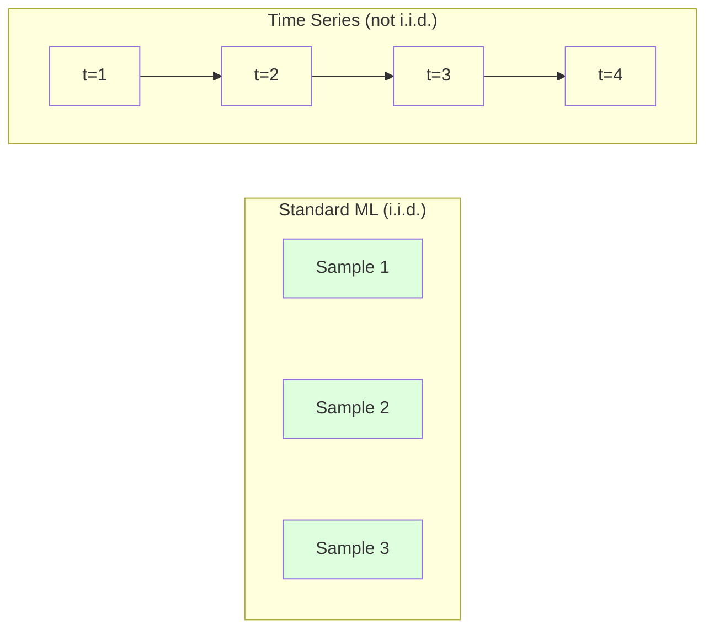
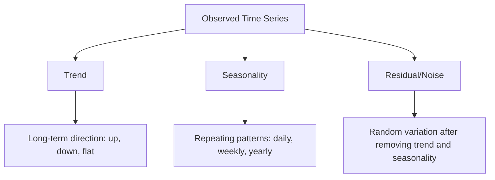
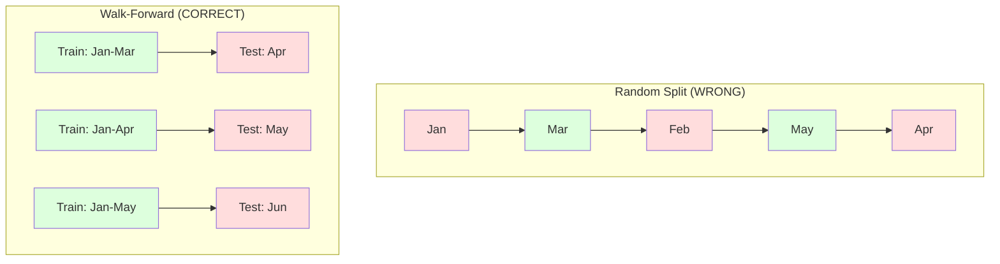

# 时间序列基础

> Past performance can indeed predict future results—provided that you first verify the stationarity of the data.

**类型：**构建
**语言：**Python
**先决条件：**第二阶段，课程01-09
**时间：**约90分钟

## 学习目标

- Decompose a time series into trend, seasonality, and residual components and test for stationarity
- Implement lag features and rolling statistics to convert a time series into a supervised learning problem
- Build a walk-forward validation framework that prevents future data from leaking into training
- Explain why random train/test splits are invalid for time series and demonstrate the performance gap versus proper temporal splits

## 问题

您拥有按时间排序的数据。包括每日销售、每小时温度、每分钟CPU使用率以及每周股票价格。您需要预测下一个值、下周的值以及下一季度的数据。

您尝试使用标准的机器学习工具包：随机训练/测试分割、交叉验证、特征矩阵输入、预测输出。但每一步都失败了。

时间序列打破了标准机器学习所依赖的假设。样本并不独立——今天的温度取决于昨天的数据。随机分割会将未来信息泄露到过去。在回测中表现良好的特征在实际生产中可能会失败，因为它们依赖于随时间变化的模式。

一个通过随机交叉验证获得95%准确率的模型，在正确的基于时间的评估中可能只能获得55%的准确率。这种差异并非技术性问题，而是理论上的模型与实际生产环境中的模型之间的差异。

本课程涵盖基础知识：时间数据的特点、如何公正地评估模型以及如何将时间序列转化为标准机器学习模型可以使用的特征。

## 概念

### 什么使时间序列不同

Standard ML assumes that all samples are independent and identically distributed. Each sample is drawn from the same distribution, regardless of other samples. However, time series data violate both these assumptions:

- **Not independent.** Today's stock price depends on yesterday's price. This week's sales are related to last week's sales.
- **Not identically distributed.** The distribution of values changes over time. Sales in December differ from those in March.

These violations are significant. They affect how we create features, evaluate models, and choose algorithms.



在标准机器学习中，样本是可以互换的。对它们进行随机排序并不会改变任何东西。而在时间序列中，顺序至关重要。随机排序会破坏信号。

### 时间序列的组成部分

每个时间序列都是以下元素的组合：



- **趋势**：长期发展方向。收入每年增长10%。全球温度上升。
- **季节性**：固定时间间隔内的重复模式。零售销售在12月激增。空调使用量在7月达到峰值。
- **残差**：去除趋势和季节性后剩余的部分。如果残差看起来像白噪声，说明分解成功捕捉到了信号。

### 平稳性

如果一个时间序列的统计特性（均值、方差、自相关）随时间不变，则该序列是平稳的。大多数预测方法都假设序列是平稳的。

**为什么重要：**非平稳序列的均值会发生变化。在1月份的数据上训练的模型所得到的均值与2月份的均值不同。因此，其预测结果将系统性地错误。

**如何检查：**计算窗口内的滚动均值和滚动标准差。如果它们发生变化，则序列是非平稳的。

**如何修复：**差分法。不是对原始值进行建模，而是对连续值之间的变化进行建模：

```
diff[t] = value[t] - value[t-1]
```

如果一次差分操作不能使序列变得平稳，则进行第二次差分操作。大多数实际中的序列最多需要两次差分。

**示例：**

原始序列：[100, 102, 106, 112, 120]
第一次差分：[2, 4, 6, 8]（仍然呈上升趋势）
第二次差分：[2, 2, 2]（恒定——平稳）

原始序列具有二次趋势。第一次差分将其变为线性趋势。第二次差分使其变得平坦。实际上，很少需要超过两次差分。

**正式测试：**增强迪基-富勒检验（ADF）是检测平稳性的标准统计方法。零假设为“序列是非平稳的”。p值低于0.05意味着可以拒绝零假设并得出序列平稳的结论。我们不会从头开始实现ADF（它需要渐近分布表），但我们的代码中使用的滚动统计量方法提供了实用的可视化检查。

### 自相关

自相关度量了时间t的值与时间t-k（过去k步）的值之间的相关性。自相关函数（ACF）绘制了每个滞后k的这种相关性。

**ACF告诉您：**
- 序列能记住的时间跨度。如果ACF在滞后5之后降至零，那么超过5步之前的值就无关紧要。
- 是否存在季节性。如果ACF在滞后12时出现峰值（月度数据），则存在年度季节性。
- 需要创建多少个滞后特征。使用直到ACF变得可以忽略的滞后值。

**PACF（部分自相关函数）**消除了间接相关性。如果今天与3天前的相关性仅因为两者都与昨天有关，那么滞后3时的PACF将为零，而ACF在滞后3时则不会为零。

### 延迟特性：将时间序列转换为监督学习

Standard ML models require a feature matrix X and a target y. Time series provide a single column of values, which are lag features.

Take the sequence [10, 12, 14, 13, 15] and create lag-1 and lag-2 features:

| lag_2 | lag_1 | target |
|-------|-------|--------|
| 10    | 12    | 14     |
| 12    | 14    | 13     |
| 14    | 13    | 15     |

Now you have a standard regression problem. Any ML model (linear regression, random forest, gradient boosting) can predict the target based on these lag features.

Additional features that can be created include:
- **Rolling statistics:** mean, std, min, max over the last k values
- **Calendar features:** day of week, month, is_holiday, is_weekend
- **Differenced values:** change from previous step
- **Expanding statistics:** cumulative mean, cumulative sum
- **Ratio features:** current value / rolling mean (how far from recent average)
- **Interaction features:** lag_1 * day_of_week (weekday effects on momentum)

**How many lags to use?** Use the autocorrelation function. If ACF is significant up to lag 10, use at least 10 lags. If there is weekly seasonality, include lag 7 (and possibly 14). More lags provide more historical data but also more features to fit, increasing the risk of overfitting.

**The target alignment trap.** When creating lag features, ensure that the target is the value at time t, and all features use values from time t-1 or earlier. If you accidentally include the value at time t as a feature, you have a perfect predictor—but a completely useless model. This is the most common error in time series feature engineering.

### 步行前验证

这是本课程中最重要的概念。标准k折交叉验证会随机将样本分配到训练集和测试集。对于时间序列数据，这会导致未来信息的泄露。



步行验证：
1. 在截至时间t的数据上进行训练
2. 预测时间t+1（或对于多步过程，从t+1到t+k）
3. 将窗口向前移动
4. 重复上述步骤

每个测试折叠仅包含所有训练数据之后的数据。没有未来泄露的情况。这能让你准确估计模型部署后的表现。

**扩展窗口**使用所有历史数据进行训练（窗口扩大）。**滑动窗口**使用固定大小的训练窗口（窗口滑动）。当你认为旧数据仍然相关时，使用扩展窗口。当世界发生变化且旧数据造成问题时，使用滑动窗口。

### ARIMA直觉

ARIMA是经典的时间序列模型。它包含三个组成部分：

- **AR（自回归）：**根据过去的值进行预测。AR(p)使用最近的p个值。
- **I（积分）：**通过差分来实现平稳性。I(d)应用d轮的差分处理。
- **MA（移动平均）：**根据过去的预测误差进行预测。MA(q)使用最近的q个误差。

ARIMA(p, d, q)结合了这三个组成部分。你需要根据ACF/PACF分析或自动搜索（auto-ARIMA）来选择p、d和q的值。

我们不会从零开始实现ARIMA——这需要数值优化，超出了本课程的范畴。关键的理解是了解每个组件的作用，这样你就可以解释ARIMA的结果并知道何时使用它。

### 何时使用什么

| 方法 | 适用场景 | 处理季节性数据的能力 | 处理外部特征的能力 |
|------|---------|-------------------|------------------------|
| 滞后特征+机器学习 | 包含许多外部特征的表格数据 | 具有日历功能 | 支持 |
| ARIMA | 单变量序列，短期预测 | SARIMA变体 | 不支持（有限情况下使用ARIMAX） |
| 指数平滑 | 简单趋势分析+季节性数据 | 支持（Holt-Winters方法） | 不支持 |
| Prophet | 业务预测，节假日处理 | 支持（傅里叶项） | 功能有限 |
| 神经网络（LSTM、Transformer） | 长序列，多系列数据 | 可学习 | 支持 |

对于大多数实际问题，滞后特征+梯度提升是最佳起点。它自然地处理外部特征，不需要假设数据平稳性，且易于调试。

### 预测前景与策略

单步预测会预测一个时间步的前面情况。多步预测则会预测多个时间步的情况。有三种策略：

**递归（迭代）：** 预测一个时间步前面的情况，并将该预测结果作为下一个时间步的输入。这种方法简单，但错误会累积——每个预测都使用前一个预测的结果，因此错误会逐渐增加。

**直接法：** 为每个时间范围训练单独的模型。模型1预测t+1的情况，模型5预测t+5的情况。没有错误的累积，但每个模型的训练样本较少，且它们不会共享信息。

**多输出法：** 训练一个同时输出所有时间范围的模型。虽然不同时间范围的信息可以共享，但需要一个支持多个输出的模型（或自定义损失函数）。

对于大多数实际问题，对于较短的时间范围（1-5步），使用递归方法；对于较长的时间范围，则使用直接法。

### 常见的时间序列错误

| 错误 | 发生原因 | 解决方法 |
|------|----------|-----------|
| 随机的训练/测试分割 | 标准机器学习习惯导致 | 使用walk-forward或时间分割方法 |
| 使用未来特征 | 误将时间t的特征包含在内 | 审核每个特征的时序一致性 |
| 过度拟合季节性 | 模型记住日历模式 | 在测试集中保留完整的季节周期 |
| 忽略规模变化 | 收入翻倍但模式不变 | 使用百分比变化而非绝对值进行建模 |
| 过多滞后特征 | “更多历史数据更好” | 使用自相关图确定相关滞后值 |
| 未进行差分处理 | “模型会自行理解” | 树模型能处理趋势；线性模型需要平稳性 |

## 构建它

`code/time_series.py`中的代码实现了从零开始的核心构建模块。

### Lag Feature Creator

```python
def make_lag_features(series, n_lags):
    n = len(series)
    X = np.full((n, n_lags), np.nan)
    for lag in range(1, n_lags + 1):
        X[lag:, lag - 1] = series[:-lag]
    valid = ~np.isnan(X).any(axis=1)
    return X[valid], series[valid]
```

这将把一维序列转换为特征矩阵，其中每一行包含最后的 `n_lags` 个值作为特征，当前值作为目标。

### walk-forward cross-validation

```python
def walk_forward_split(n_samples, n_splits=5, min_train=50):
    assert min_train < n_samples, "min_train must be less than n_samples"
    step = max(1, (n_samples - min_train) // n_splits)
    for i in range(n_splits):
        train_end = min_train + i * step
        test_end = min(train_end + step, n_samples)
        if train_end >= n_samples:
            break
        yield slice(0, train_end), slice(train_end, test_end)
```

每次分割都确保训练数据严格位于测试数据之前。训练窗口随着每次折叠而扩大。

### 简单自回归模型

一个纯粹的AR模型就是滞后特征的线性回归：

```python
class SimpleAR:
    def __init__(self, n_lags=5):
        self.n_lags = n_lags
        self.weights = None
        self.bias = None

    def fit(self, series):
        X, y = make_lag_features(series, self.n_lags)
        # Solve via normal equations
        X_b = np.column_stack([np.ones(len(X)), X])
        theta = np.linalg.lstsq(X_b, y, rcond=None)[0]
        self.bias = theta[0]
        self.weights = theta[1:]
        return self
```

这在概念上与第02课中的线性回归相同，但应用于同一变量的时间滞后版本。

### 稳定性检查

该代码计算滚动统计信息，以便从视觉和数值上评估平稳性：

```python
def check_stationarity(series, window=50):
    rolling_mean = np.array([
        series[max(0, i - window):i].mean()
        for i in range(1, len(series) + 1)
    ])
    rolling_std = np.array([
        series[max(0, i - window):i].std()
        for i in range(1, len(series) + 1)
    ])
    return rolling_mean, rolling_std
```

如果滚动均值发生偏移或滚动标准差发生变化，则该序列是非平稳的。应用差分处理并再次检查。

代码还通过比较序列的前半部分和后半部分来检查平稳性。如果均值差异超过半个标准差，或者方差比率超过2倍，则将该序列标记为非平稳。

### 自相关

```python
def autocorrelation(series, max_lag=20):
    n = len(series)
    mean = series.mean()
    var = series.var()
    acf = np.zeros(max_lag + 1)
    for k in range(max_lag + 1):
        cov = np.mean((series[:n-k] - mean) * (series[k:] - mean))
        acf[k] = cov / var if var > 0 else 0
    return acf
```

## 使用它

使用sklearn时，你可以直接将滞后特征与任何回归器一起使用：

```python
from sklearn.linear_model import Ridge
from sklearn.ensemble import GradientBoostingRegressor

X, y = make_lag_features(series, n_lags=10)

for train_idx, test_idx in walk_forward_split(len(X)):
    model = Ridge(alpha=1.0)
    model.fit(X[train_idx], y[train_idx])
    predictions = model.predict(X[test_idx])
```

对于ARIMA模型，使用statsmodels：

```python
from statsmodels.tsa.arima.model import ARIMA

model = ARIMA(train_series, order=(5, 1, 2))
fitted = model.fit()
forecast = fitted.forecast(steps=30)
```

`time_series.py`中的代码展示了这两种方法，并使用walk-forward验证进行了比较。

### sklearn TimeSeriesSplit

sklearn提供了`TimeSeriesSplit`，它实现了walk-forward验证：

```python
from sklearn.model_selection import TimeSeriesSplit

tscv = TimeSeriesSplit(n_splits=5)
for train_index, test_index in tscv.split(X):
    X_train, X_test = X[train_index], X[test_index]
    y_train, y_test = y[train_index], y[test_index]
    model.fit(X_train, y_train)
    score = model.score(X_test, y_test)
```

这相当于我们从头开始编写的 `walk_forward_split`，但它被集成到了 sklearn 的交叉验证框架中。你可以将其与 `cross_val_score` 一起使用：

```python
from sklearn.model_selection import cross_val_score

scores = cross_val_score(model, X, y, cv=TimeSeriesSplit(n_splits=5))
print(f"Mean score: {scores.mean():.4f} +/- {scores.std():.4f}")
```

### 评估指标

时间序列预测使用回归指标，但需考虑时间背景：

- **MAE（平均绝对误差）：** |y_true - y_pred|的平均值。易于按原始单位解释。“平均而言，预测误差为3.2度。”
- **RMSE（均方根误差）：**均方误差的平方根。比MAE更严厉地惩罚大误差。适用于大误差超过许多小误差的情况。
- **MAPE（平均绝对百分比误差）：**|error / true_value| * 100的平均值。与尺度无关，适用于不同序列的比较。但当真实值为零时无法定义。
- **朴素基线比较：**始终与简单基线进行比较。季节性朴素基线预测前一时期的值（昨天、上周）。如果模型无法超越朴素基线，则存在问题。

### 滚动功能

该代码展示了如何将滚动统计指标（7天和14天的均值、标准差、最小值、最大值）添加到滞后特征中。这些指标为模型提供了关于近期趋势和波动性的信息，而这些信息是单独的滞后特征无法捕捉到的。

例如，如果滚动均值上升，则表明存在上升趋势。如果滚动标准差增加，则表明波动性增强。这些都是基于树状模型的算法可以学习到的模式，而线性模型则无法做到这一点。

## 发货

本课程将生成以下文件：
- `outputs/prompt-time-series-advisor.md` -- 用于构建时间序列问题的提示词
- `code/time_series.py` -- 滞后特征处理、逐步验证、自回归模型、平稳性检查

### 你必须超越的基线

在构建任何模型之前，需建立基线：

1. **最后值（持续性）。** 预测明天将与今天相同。对于许多时间序列数据，这很难被超越。
2. **季节性简单预测。** 预测今天将与上周（或去年）的同一天相同。如果您的模型无法超越这一水平，说明它尚未学习到超出季节性之外的任何有用模式。
3. **移动平均。** 预测最近k个值的平均值。这可以平滑噪声，但无法捕捉突然的变化。

如果您的高级机器学习模型在季节性简单预测上表现不佳，那么您就有一个错误。常见原因包括：特征中的未来泄露、错误的评估方法，或者时间序列数据确实具有随机性和不可预测性。

### 实用技巧

1. **Start with plotting.** Before any modeling, plot the raw data series. Look for trends, seasonality, outliers, and structural breaks (sudden changes in behavior). A 30-second visual inspection often tells you more than an hour of automated analysis.

2. **First calculate the difference, then create a model.** If the data series has a clear trend, calculate the difference before creating lag features. Tree-based models can handle trends, but linear models cannot; differencing is always useful.

3. **Include at least one full seasonal cycle.** If the data is weekly or monthly in nature, your test set should include at least one full week or month of data. Otherwise, you cannot accurately evaluate whether the model captures seasonal patterns.

4. **Monitor the model in production.** Time series models degrade over time as the world changes. Continuously track prediction errors. When errors start to increase, retrain the model using recent data.

5. **Be cautious of regime changes.** A model trained on pre-pandemic data will not accurately predict post-pandemic behavior. Include indicators of known regime changes as features, or use a sliding window that excludes old data.

6. **Log-transform skewed data series.** Revenue, prices, and counts are often right-skewed. Log transformation stabilizes variance and makes multiplicative patterns additive, which linear models can handle. Make forecasts in log space, then exponentiate the results to return to the original units.

## 练习

1. **Stationarity experiment.** Generate a series with a linear trend. Check stationarity with rolling statistics. Apply first differencing. Check again. How many rounds of differencing does it take for a quadratic trend?

2. **Lag selection.** Compute ACF on a seasonal series (period=7). Which lags have the highest autocorrelation? Create lag features using only those lags (not consecutive lags). Does accuracy improve compared to using lags 1 through 7?

3. **Walk-forward vs random split.** Train a Ridge regression on lag features. Evaluate with random 80/20 split and with walk-forward validation. How much does the random split overestimate performance?

4. **Feature engineering.** Add rolling mean (window=7), rolling std (window=7), and day-of-week features to the lag features. Compare accuracy with and without these extras using walk-forward validation.

5. **Multi-step forecasting.** Modify the AR model to predict 5 steps ahead instead of 1. Compare two strategies: (a) predict one step, use the prediction as input for the next step (recursive), and (b) train separate models for each horizon (direct). Which is more accurate?

## | 关键词 | 翻译 |

| 术语 | 人们怎么说 | 实际含义 |
|------|------------|----------|
| 平稳性 | “数据随时间不变” | 其均值、方差和自相关结构随时间保持恒定的序列 |
| 差分 | “减去连续值” | 计算 y[t] - y[t-1] 以去除趋势并实现平稳性 |
| 自相关（ACF） | “序列与自身的关联方式” | 时间序列与其滞后版本之间的相关性，作为滞后的函数 |
| 偏自相关（PACF） | “仅直接相关性” | 在移除所有较短滞后效应后，滞后 k 处的自相关 |
| 滞后特征 | “过去值作为输入” | 使用 y[t-1], y[t-2], ..., y[t-k] 作为特征来预测 y[t] |
| 向前验证 | “时间尊重的交叉验证” | 训练数据在时间上始终先于测试数据的评估方法 |
| ARIMA | “经典时间序列模型” | 自回归积分移动平均：结合过去值（AR）、差分（I）和过去误差（MA） |
| 季节性 | “重复的日历模式” | 与时间周期相关的规律且可预测的序列循环（每日、每周、每年） |
| 趋势 | “长期方向” | 序列水平随时间持续增加或减少的趋势 |
| 扩展窗口 | “使用全部历史数据” | 训练集随着每次折叠而增长的向前验证方法 |
| 滑动窗口 | “固定长度的历史数据” | 训练集是一个固定的长度窗口，向前滑动的向前验证方法 |

## 更多阅读资料

- [Hyndman and Athanasopoulos, Forecasting: Principles and Practice (3rd ed.)](https://otexts.com/fpp3/) -- 关于时间序列预测的最佳免费教材
- [scikit-learn Time Series Split](https://scikit-learn.org/stable/modules/generated/sklearn.model_selection.TimeSeriesSplit.html) -- sklearn的walk-forward分割器
- [statsmodels ARIMA docs](https://www.statsmodels.org/stable/generated/statsmodels.tsa.arima.model.ARIMA.html) -- 包含诊断结果的ARIMA实现
- [Makridakis et al., The M5 Competition (2022)](https://www.sciencedirect.com/science/article/pii/S0169207021001874) -- 展示机器学习方法与统计方法的大规模预测竞赛
