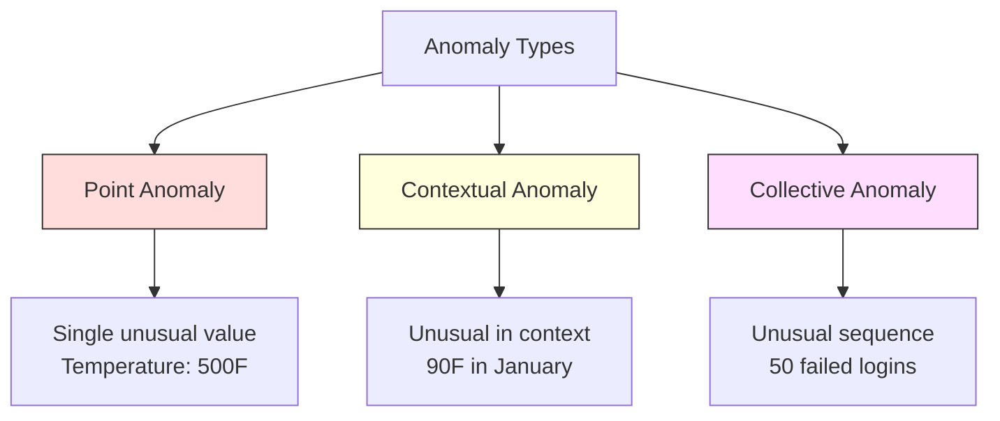
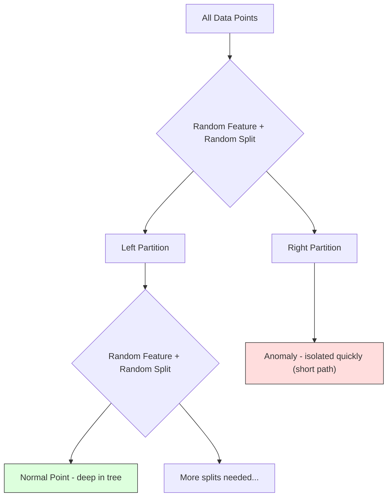
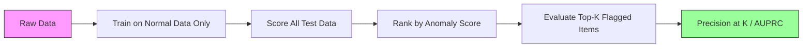

# 异常检测

> The normal state is easy to define. The abnormal state is anything that doesn’t conform to it.

**Type:** Construction
**Language:** Python
**Prerequisites:** Phase 2, Lessons 01-09
**Duration:** ~75 minutes

## 学习目标

- Implement Z-score, IQR, and Isolation Forest anomaly detection methods from scratch
- Distinguish between point, contextual, and collective anomalies and select the appropriate detection method for each
- Explain why anomaly detection is framed as modeling normal data rather than classifying anomalies
- Compare unsupervised anomaly detection with supervised classification and evaluate the tradeoff between novel anomaly coverage and precision

## 问题

在纽约，信用卡的使用时间为下午2点，而在东京则是下午2:05。工厂的传感器检测到温度为150度，而正常范围是80-120度。服务器的每秒请求数为50,000次，而日平均值为200次。

这些都是异常现象。发现它们非常重要。欺诈行为造成的损失达数十亿美元。设备故障会导致停机时间。网络入侵则会造成数据损失。

挑战在于：很少有带有标签的异常示例。欺诈占交易总数的0.1%。设备故障每年发生几次。你无法训练标准分类器，因为“异常”类别中几乎没有可供学习的内容。即使你有一些标签，你所看到的异常也不是你会遇到的唯一类型。明天的欺诈手段与今天的不同。

异常检测改变了问题处理方式。不是去学习什么是异常的，而是去学习什么是正常的。任何偏离正常范围的都是可疑的。这种方法无需标签，能够适应新的异常类型，并且可以处理大规模数据集。

## 概念

### 异常类型

并非所有异常都是相同的：

- **点异常。** 无论上下文如何，单个数据点的异常情况。例如，温度读数为500度。或者账户进行了50,000美元的交易，而该账户通常花费50美元。
- **上下文异常。** 在给定上下文中不寻常的数据点。夏季90度的温度是正常的，而在冬季则属于异常。相同的值，不同的上下文。
- **集体异常。** 即使每个单独的点可能正常，但作为一个整体来看是不寻常的一系列数据点。五次登录失败是正常的。连续五十次则是暴力攻击。

大多数方法检测点异常。上下文异常需要时间或位置特征。集体异常需要序列感知的方法。



### 无监督框架

在标准分类中，你有两类数据的标签。在异常检测中，通常会出现以下三种情况之一：

1. **完全无监督。** 完全没有标签。你将检测器拟合到所有数据上，并希望异常足够罕见，不会破坏“正常”模型。
2. **半监督。** 你只有干净的正常数据集。你在这一干净集上进行拟合，并对其他数据进行评分。这是可能时最强大的设置。
3. **弱监督。** 你有少量带有标签的异常样本。用它们进行评估，而不是训练。先无监督训练，然后在带标签的子集上测量精确度/召回率。

关键见解：异常检测与分类根本不同。你是在建模正常数据的分布，而不是两个类别之间的决策边界。

### 监督学习与无监督学习：权衡

如果您确实有标记过的异常，应该将其用于训练（监督分类）还是仅用于评估（无监督检测）？

**监督式（视为分类）：**
- 捕获您之前见过的确切类型的异常
- 在已知异常类型上具有更高的精度
- 完全错过新的异常类型
- 当出现新的异常类型时需要重新训练
- 需要足够的异常示例（通常太少）

**无监督式（模型识别正常，标记偏差）：**
- 捕获任何与正常的偏差，包括新出现的类型
- 不需要标记过的异常
- 更高的误报率（并非所有不寻常的情况都是不良情况）
- 对分布变化更鲁棒

实际上，最佳系统结合了两者：无监督检测用于广泛覆盖，监督模型用于已知高优先级异常类型，以及人工审查用于模糊案例。

### Z-Score Method

最简单的方法。计算每个特征的均值和标准差。标记任何偏离均值超过k个标准差的数据点。

```text
z_score = (x - mean) / std
anomaly if |z_score| > threshold
```

默认阈值为3.0（对于高斯分布，99.7%的正常数据位于3个标准差范围内）。

**优点：**简单、快速、可解释（“该值距离正常水平有4.5个标准差”）。

**缺点：**假设数据呈正态分布。对训练数据中的异常值敏感（异常值会改变均值并增加标准差，使它们更难检测）。不适用于多模态分布。

**适用场景：**数据大致呈钟形分布的单特征监控。服务器响应时间、制造公差、具有稳定基线的传感器读数。

**不适用场景：**多集群数据（两个办公地点具有不同的基线温度）、偏态数据（交易金额中1000美元较为罕见但不异常）、训练集中存在异常值的数据。

### IQR Method

比Z分数更稳健。使用四分位距而不是均值和标准差。

```
Q1 = 25th percentile
Q3 = 75th percentile
IQR = Q3 - Q1
lower_bound = Q1 - factor * IQR
upper_bound = Q3 + factor * IQR
anomaly if x < lower_bound or x > upper_bound
```

默认因子为1.5。

**优点：** 对异常值具有鲁棒性（百分位数不受极端值影响）。适用于偏态分布。无需正态性假设。

**缺点：** 仅基于单变量（每个特征独立计算）。只有当所有特征一起考虑时才能检测出不寻常的异常值（某个点在每个特征中可能是正常的，但在联合空间中可能是异常的）。

**实用建议：** IQR中的1.5因子对应于箱线图中的须部。位于须部外的点可能是异常值。使用3.0而不是1.5会使检测器更加保守（警告更少，误报也少）。合适的因子取决于你对误报的容忍度。

### Isolation Forest

关键洞察：异常现象很少且各不相同。在数据的随机划分中，异常现象更容易被分离出来——它们需要更少的随机分割就能从其余部分中被区分出来。



**工作原理：**
1. 构建许多随机树（孤立森林）
2. 在每个节点，选择一个随机特征以及该特征的最小值和最大值之间的一个随机分割值
3. 持续分割，直到每个点都独立成叶节点
4. 异常点在所有树中的平均路径长度较短

**原理：**正常点位于密集区域。需要许多随机分割才能将某个点与其邻居分离。异常点则位于稀疏区域。一两个随机分割就足以将其隔离。

异常得分基于所有树的平均路径长度，并通过随机二叉搜索树的预期路径长度进行归一化：

```
score(x) = 2^(-average_path_length(x) / c(n))
```

其中 `c(n)` 是 n个样本的预期路径长度。得分接近1表示异常。得分接近0.5表示正常。得分接近0表示非常正常（处于密集簇中）。

**优点：** 无需假设分布。适用于高维度情况。扩展性良好（因为每棵树只使用一部分样本，所以与样本量成亚线性关系）。能够处理混合特征类型。

**缺点：** 在密集区域处理异常时表现不佳（掩蔽效应）。当许多特征无关紧要时，随机分割效果较差。

**关键超参数：**
- `n_estimators`：树的数量。通常100个就足够了。更多的树可以获得更稳定的结果，但计算速度较慢。
- `max_samples`：每棵树中的样本数量。原始论文中默认值为256。较小的值会使单棵树的准确性降低，但会增加多样性。子采样是Isolation Forest快速的原因——每棵树只看到一小部分数据。
- `contamination`：异常的预期比例。仅用于设置阈值。不影响得分本身。

### 局部异常值因子（LOF）

LOF通过比较一个点的局部密度与其邻近点的密度来识别异常。被密集区域包围的稀疏区域中的点属于异常。

**工作原理：**
1. 对于每个点，找到其k个最近邻点。
2. 计算局部可达性密度（邻域的密度程度）。
3. 比较每个点的密度与其邻近点的密度。
4. 如果某个点的密度远低于其邻近点，则视为异常值。

**LOF评分：**
- LOF接近1.0表示与邻近点密度相似（正常）。
- LOF大于1.0表示密度低于邻近点（可能异常）。
- LOF远大于1.0（例如2.0以上）表示密度显著较低（很可能是异常）。

“局部”这一要素至关重要。考虑一个包含两个簇的数据集：1000个点的密集簇和50个点的稀疏簇。位于稀疏簇边缘的点在全局上并不异常——它有50个邻近点。但如果其直接邻近点的密度高于它，则它在局部上属于异常。LOF能够捕捉到这种全局方法忽略的细微差别。

**优点：** 能检测局部异常（即使在全球范围内不异常，但在邻域中也不寻常的点）。适用于不同密度的簇。

**缺点：** 在大型数据集上运行速度较慢（简单实现为O(n^2)）。对k的选择敏感。在高维空间中效果不佳（维度效应会影响距离计算）。

### 比较

| 方法 | 假设 | 速度 | 处理高维度数据的能力 | 检测局部异常的能力 |
|------|----|-----|-------------------|------------------|
| Z分数 | 正态分布 | 非常快 | 是（每个特征） | 否 |
| IQR | 无（每个特征） | 非常快 | 是（每个特征） | 否 |
| 隔离森林 | 无 | 快速 | 是 | 部分支持 |
| LOF | 距离具有意义 | 慢速 | 性能较差 | 是 |

### 评估挑战

评估异常检测器比评估分类器更困难：

- **极端类别不平衡。**当异常率为0.1%时，对所有项目预测为“正常”可以获得99.9%的准确率。但准确率并无实际意义。
- **AUROC具有误导性。**在严重不平衡的情况下，即使模型在实际阈值下错过了大多数异常，AUROC仍可能看起来良好。
- **更好的指标：**Precision@k（前k个标记项目中有多少是真实异常）、AUPRC（精确度和召回率曲线下的面积）以及固定假阳性率的召回率。



### 异常检测管道

在实践中，异常检测遵循以下工作流程：

1. **收集基线数据。**理想情况下，是已知没有（或几乎没有）异常的时期。
2. **特征工程。**原始特征加上派生特征（滚动统计、时间特征、比率）。
3. **训练检测器。**在基线数据上进行训练。模型学习“正常”是什么样子。
4. **评分新数据。**每个新的观测值都会获得一个异常评分。
5. **选择阈值。**确定评分的截止点。这是一个业务决策：更高的阈值意味着更少的误报但更多漏过的异常。
6. **警报和调查。**被标记的点将进入人工审核或自动响应。
7. **收集反馈。**记录被标记为异常的项是真实异常还是误报。使用这些数据来评估检测器并随时间调整阈值。

这个流程永远不会“完成”。数据分布会发生变化，新的异常类型会出现，阈值需要调整。将异常检测视为一个动态系统，而不是一次性模型。

## 构建它

`code/anomaly_detection.py`中的代码从零开始实现了Z分数、四分位数范围以及隔离森林算法。

### Z-Score Detector

```python
def zscore_detect(X, threshold=3.0):
    mean = X.mean(axis=0)
    std = X.std(axis=0)
    std[std == 0] = 1.0
    z = np.abs((X - mean) / std)
    return z.max(axis=1) > threshold
```

简单且向量化。如果任何功能超过阈值，则标记该点。

### IQR Detector

```python
def iqr_detect(X, factor=1.5):
    q1 = np.percentile(X, 25, axis=0)
    q3 = np.percentile(X, 75, axis=0)
    iqr = q3 - q1
    iqr[iqr == 0] = 1.0
    lower = q1 - factor * iqr
    upper = q3 + factor * iqr
    outside = (X < lower) | (X > upper)
    return outside.any(axis=1)
```

### Isolation Forest: A Beginner’s Guide

从零开始的实现构建隔离树，随机划分特征空间：

```python
class IsolationTree:
    def __init__(self, max_depth):
        self.max_depth = max_depth

    def fit(self, X, depth=0):
        n, p = X.shape
        if depth >= self.max_depth or n <= 1:
            self.is_leaf = True
            self.size = n
            return self
        self.is_leaf = False
        self.feature = np.random.randint(p)
        x_min = X[:, self.feature].min()
        x_max = X[:, self.feature].max()
        if x_min == x_max:
            self.is_leaf = True
            self.size = n
            return self
        self.threshold = np.random.uniform(x_min, x_max)
        left_mask = X[:, self.feature] < self.threshold
        self.left = IsolationTree(self.max_depth).fit(X[left_mask], depth + 1)
        self.right = IsolationTree(self.max_depth).fit(X[~left_mask], depth + 1)
        return self
```

路径长度用于确定某个点的异常得分。路径越长，表示其异常程度越高。

`IsolationForest`类封装了多棵树：

```python
class IsolationForest:
    def __init__(self, n_estimators=100, max_samples=256, seed=42):
        self.n_estimators = n_estimators
        self.max_samples = max_samples

    def fit(self, X):
        sample_size = min(self.max_samples, X.shape[0])
        max_depth = int(np.ceil(np.log2(sample_size)))
        for _ in range(self.n_estimators):
            idx = rng.choice(X.shape[0], size=sample_size, replace=False)
            tree = IsolationTree(max_depth=max_depth)
            tree.fit(X[idx])
            self.trees.append(tree)

    def anomaly_score(self, X):
        avg_path = average path length across all trees
        scores = 2.0 ** (-avg_path / c(max_samples))
        return scores
```

归一化因子 `c(n)` 是指在一个包含 n 个元素的二叉搜索树中，一次不成功的搜索的预期路径长度。其计算公式为 `2 * H(n-1) - 2*(n-1)/n`，其中 `H` 是调和数。这种归一化处理确保了不同大小的数据集之间的评分具有可比性。

### 演示场景

该代码生成了多种测试场景：

1. **单个集群中包含异常值。**一个二维高斯分布集群，其中异常值位于中心之外。所有方法都应在此场景下正常工作。
2. **多模态数据。**三个不同大小和密度的集群。集群之间的点属于异常值。由于每个特征的取值范围较大，Z分数算法在识别异常值时存在困难。
3. **高维数据。**有50个特征，但异常值仅出现在其中5个特征上。测试方法是否能够在一部分特征中识别出异常值。

每个演示都会使用精确度、召回率、F1分数和Precision@k来比较所有方法的效果。

## 使用它

使用 sklearn（采用库提供的实现，而非从头开始编写）：

```python
from sklearn.ensemble import IsolationForest
from sklearn.neighbors import LocalOutlierFactor

iso = IsolationForest(n_estimators=100, contamination=0.05, random_state=42)
iso.fit(X_train)
predictions = iso.predict(X_test)

lof = LocalOutlierFactor(n_neighbors=20, contamination=0.05, novelty=True)
lof.fit(X_train)
predictions = lof.predict(X_test)
```

注意，`contamination`参数设定了预期的异常比例。正确设置这一参数非常重要——过低会错过异常，过高则会产生误报。

`anomaly_detection.py`中的代码在同一数据上对从头开始实现的算法与sklearn的算法进行了比较。

### sklearn 污染参数

在sklearn中，`contamination`参数决定了将连续异常分数转换为二进制预测的阈值。它不会改变原始的分数。

```python
iso_5 = IsolationForest(contamination=0.05)
iso_10 = IsolationForest(contamination=0.10)
```

Both produce the same anomaly scores. However, `iso_5` identifies the top 5% of cases, while `iso_10` identifies the top 10%. If you do not know the true anomaly rate (which is usually the case), set the contamination setting to "auto" and work with the raw scores directly. Determine your own threshold based on the balance between false positives and false negatives in terms of cost.

### One-class SVM

Another noteworthy unsupervised anomaly detector. One-Class SVM defines a boundary around normal data in a high-dimensional feature space using the kernel trick.

```python
from sklearn.svm import OneClassSVM

oc_svm = OneClassSVM(kernel="rbf", gamma="auto", nu=0.05)
oc_svm.fit(X_train)
predictions = oc_svm.predict(X_test)
```

`nu`参数用于近似表示异常的比例。单类SVM适用于小型到中型数据集，但无法处理非常大的数据（核矩阵会呈二次方增长）。

### 自动编码器方法（预览）

自编码器是一种神经网络，它学习压缩和重构数据。在正常数据上进行训练。在测试时，异常数据的重构误差较高，因为网络仅学会了重构正常模式。

这已在第三阶段（深度学习）中介绍过，但原理相同：模型识别什么是正常的，标记出偏离的部分。

### Ensemble Anomaly Detection

正如集成方法能改善分类效果（第11课所述），结合多个异常检测器也能提高检测能力。最简单的方法如下：

1. 运行多个检测器（Z分数、四分位数范围、隔离森林、LOF）
2. 将每个检测器的得分归一化为[0, 1]
3. 计算归一化得分的平均值
4. 将平均得分超过阈值的点标记为异常

这可以减少误报，因为不同方法有不同的失败模式。被所有四种方法标记的点几乎肯定是异常的。而被仅一种方法标记的点可能是该方法的特有现象。

更复杂的集成方法会根据每个检测器的估计可靠性对其进行加权（如果可用，则在已知异常的数据集上进行评估）。

### 生产考虑因素

1. **Threshold drift.** As data distribution changes, a fixed threshold becomes outdated. Monitor the distribution of anomaly scores and adjust it periodically.

2. **Alert fatigue.** Too many false alarms can lead operators to lose focus on real issues. Start with a high threshold (fewer, more reliable alerts) and lower it as trust in the system increases.

3. **Ensemble approach.** In production, use multiple detectors to identify anomalies. Only flag an issue if all methods agree it is anomalous. This significantly reduces false positives.

4. **Feature engineering.** Raw features are often insufficient. Incorporate rolling statistics, ratios, time since last event, and domain-specific features. A well-rounded feature set is more important than the choice of detector.

5. **Feedback loop.** When operators investigate flagged items and confirm or dismiss them, feed this information back into the system. Over time, accumulate labeled data to evaluate and improve the detectors.

## 发货

本课程将生成以下文件：
- `outputs/skill-anomaly-detector.md` -- 用于选择正确异常检测器的决策技能文档
- `code/anomaly_detection.py` -- 从零开始实现Z分数、四分位数范围以及隔离森林算法，并对比sklearn的实现

### 选择阈值

异常得分是连续的。你需要一个阈值来做出二元决策。这是一个商业决策，而非技术决策。

考虑两种情况：
- **欺诈检测。**遗漏欺诈行为代价高昂（退款、客户信任）。误报需要人类分析师花费5分钟进行调查。设置较低的阈值以捕捉更多欺诈行为，接受更多的误报。
- **设备维护。**误报意味着不必要的停机，造成50,000美元的损失。漏检故障则意味着500,000美元的维修费用。设置阈值以平衡这些成本。

在这两种情况下，最佳阈值取决于误报与漏报之间的成本比例。绘制不同阈值的精确度和召回率图，叠加成本函数，然后选择最低成本的平衡点。

### 迁移到生产环境

For real-time anomaly detection in production:

1. **Batch training, online scoring.** Train the model periodically (daily, weekly) on recent normal data. Score each new observation as it arrives.
2. **Feature computation must match.** If you trained with rolling statistics over 30 days, you need 30 days of history to compute features for a new observation. Buffer the required history.
3. **Score distribution monitoring.** Track the distribution of anomaly scores over time. If the median score drifts upward, either the data is changing or the model is stale.
4. **Explainability.** When you flag an anomaly, say why. Z-score: “Feature X is 4.2 standard deviations above normal.” Isolation Forest: “This point was isolated in 3.1 splits on average (normal points take 8.5).”

## 练习

1. **Threshold tuning.** Run the Z-score detector with thresholds ranging from 1.0 to 5.0, in steps of 0.5. Plot precision and recall at each threshold. Where is the optimal threshold for your data?

2. **Multivariate anomalies.** Create 2D data where each feature individually appears normal, but the combination of features results in anomalous points (e.g., points far from the main cluster diagonal). Show that the Z-score method misses these anomalies, while the Isolation Forest can detect them.

3. **Implementing LOF from scratch.** Implement Local Outlier Factor using k-nearest neighbors. Compare the results with sklearn's LocalOutlierFactor on the same data. Use k=10 and k=50 -- how does the choice of k affect the results?

4. **Streaming anomaly detection.** Modify the Z-score detector to work in a streaming environment: update the running mean and variance as new points arrive (Welford’s online algorithm). Compare this with batch-based Z-score on the same data.

5. **Real-world evaluation.** Use a dataset containing known anomalies, such as credit card fraud from Kaggle. Evaluate all four methods using precision@100, precision@500, and AUPRC. Which method performs best? Why?

## | 关键词 | 翻译 |

| 术语 | 人们怎么说 | 实际含义 |
|------|------------|----------|
| 异常值 | “离群点，不寻常的点” | 与正常数据模式显著偏离的数据点 |
| 单点异常值 | “一个奇怪的值” | 无论上下文如何都显得不寻常的单个观测值 |
| 上下文异常值 | “正常值，错误上下文” | 在其上下文中显得不寻常的观察值（时间、地点等），但在其他上下文中可能是正常的 |
| 隔离森林 | “随机分割以发现离群点” | 一组随机树，能够以比正常点更少的分割来隔离异常值 |
| 局部异常因子 | “比较密度与邻近点” | 一种方法，用于标记局部密度远低于其邻近点的数据点 |
| Z分数 | “标准差偏离均值” | (x - 均值) / 标准差，衡量数据点与中心的距离以标准差为单位 |
| 四分位距 | “中间50%数据的分布范围” | Q3 - Q1，测量数据中中间50%的分布范围，用于稳健的异常值检测 |
| 污染 | “异常值的预期比例” | 一个超参数，指示检测器应将多少数据标记为异常值 |
| 精确性@k | “在最可疑的k个标记中，有多少是真实的” | 仅在最可疑的k个点上计算的精确度，适用于不平衡异常值检测 |
| AUPRC | “精确度和召回率曲线下的面积” | 一个指标，总结了所有阈值下的精确度和召回率性能，对于不平衡数据而言优于AUROC |

## 更多阅读资料

- [Liu et al., Isolation Forest (2008)](https://cs.nju.edu.cn/zhouzh/zhouzh.files/publication/icdm08b.pdf) -- the original Isolation Forest paper
- [Breunig et al., LOF: Identifying Density-Based Local Outliers (2000)](https://dl.acm.org/doi/10.1145/342009.335388) -- the original LOF paper
- [scikit-learn Outlier Detection docs](https://scikit-learn.org/stable/modules/outlier_detection.html) -- overview of all sklearn anomaly detectors
- [Chandola et al., Anomaly Detection: A Survey (2009)](https://dl.acm.org/doi/10.1145/1541880.1541882) -- comprehensive survey of anomaly detection methods
- [Goldstein and Uchida, A Comparative Evaluation of Unsupervised Anomaly Detection Algorithms (2016)](https://journals.plos.org/plosone/article?id=10.1371/journal.pone.0152173) -- empirical comparison of 10 methods on real datasets
