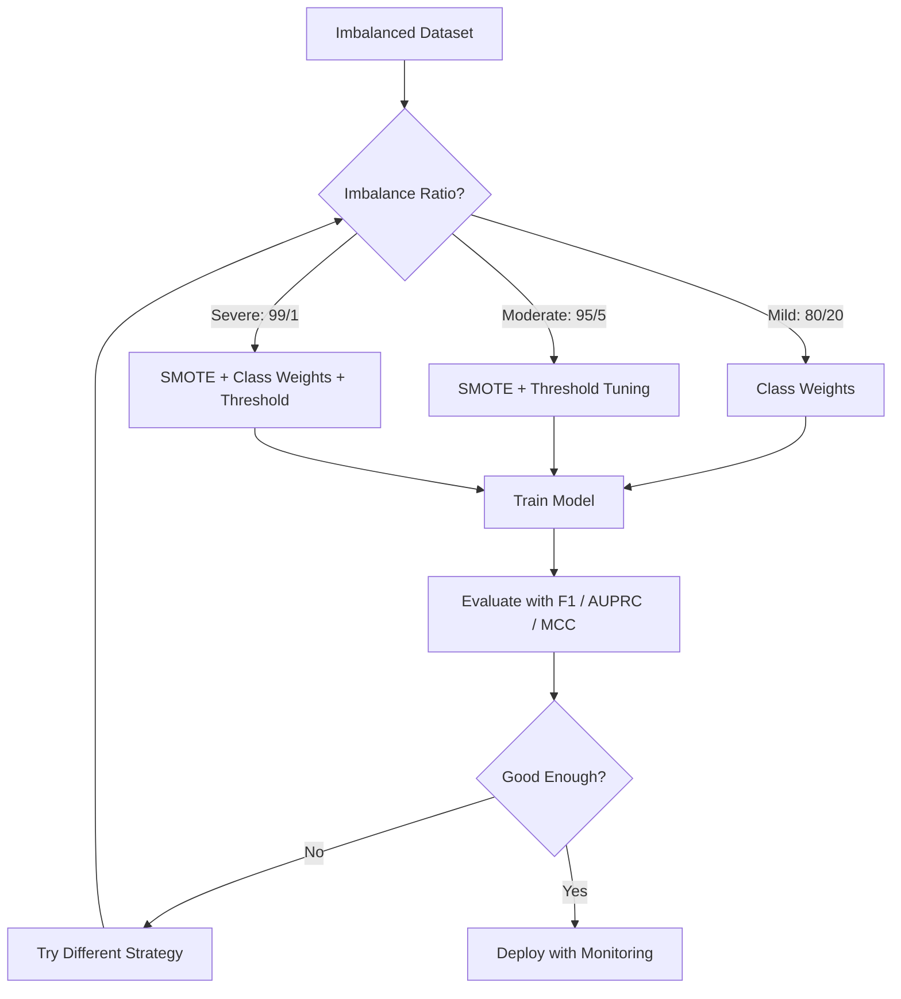
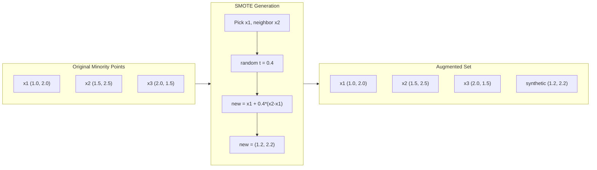
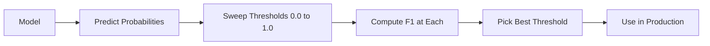
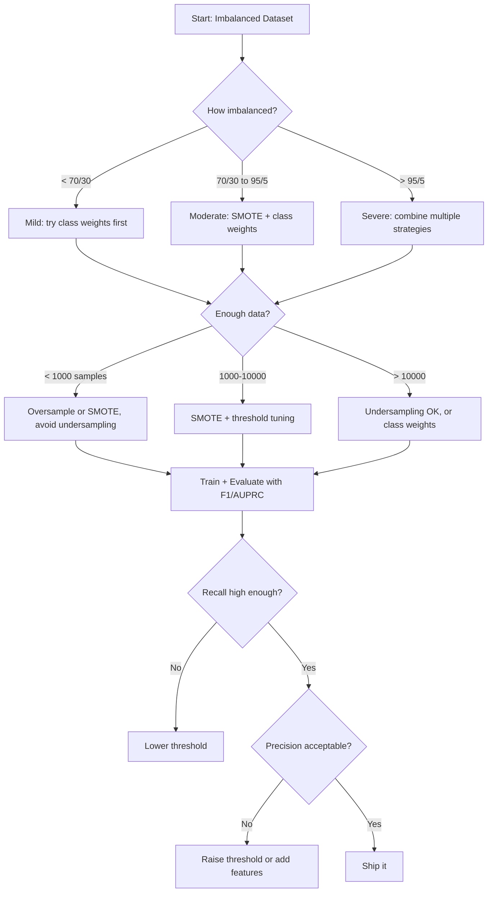

# 处理不平衡数据

当您99%的数据是“正常”的时，准确性就是个谎言。

**类型：**构建
**语言：**Python
**先决条件：**第二阶段，课程01-09（尤其是评估指标）
**时间：**约90分钟

## 学习目标

- Implement SMOTE from scratch and explain how synthetic oversampling differs from random duplication  
- Evaluate imbalanced classifiers using F1, AUPRC, and Matthews Correlation Coefficient instead of accuracy  
- Compare class weighting, threshold tuning, and resampling strategies and select the right approach for a given imbalance ratio  
- Build a complete imbalanced data pipeline that combines SMOTE, class weights, and threshold optimization

## 问题

您构建了一个欺诈检测模型，其准确率为99.9%。您为此庆祝不已。然而后来您意识到，该模型对每一笔交易都预测为“非欺诈”。

这不是一个错误。当只有0.1%的交易是欺诈时，这是合理的做法。模型学会了，总是猜测大多数类别可以最小化整体误差。这在技术上是正确的，但完全无用。

这种情况在所有需要实际分类的领域都会发生。疾病诊断：1%的阳性率。网络入侵：0.01%的攻击。制造缺陷：0.5%的缺陷产品。垃圾邮件过滤：20%的垃圾邮件。客户流失预测：5%的客户流失者。少数类别越重要，其出现频率就越低。

准确率的失效是因为它平等对待所有正确的预测。正确标记合法交易和正确识别欺诈都算作一个准确率点。但识别欺诈是模型存在的全部目的。我们需要指标、技术和训练策略，迫使模型关注那些罕见但重要的类别。

## 概念

### 为什么准确性会失败

Consider a dataset with 1000 samples: 990 negative, 10 positive. A model that always predicts negative:

|  | Predicted Positive | Predicted Negative |
|--|---|---|
| Actually Positive | 0 (True Positive) | 10 (False Negative) |
| Actually Negative | 0 (False Positive) | 990 (True Negative) |

Accuracy = (0 + 990) / 1000 = 99.0%

The model catches zero fraud, zero disease, and zero defects. But the accuracy is 99%. This is why accuracy is dangerous for imbalanced problems.

### 更好的指标

**精确度** = TP / (TP + FP)。在所有被标记为阳性的数据中，实际为阳性的有多少？高精确度意味着误报很少。

**召回率** = TP / (TP + FN)。在实际为阳性的数据中，我们捕获了多少？高召回率意味着漏检的阳性病例很少。

**F1分数** = 2 * 精确度 * 召回率 / (精确度 + 召回率)。调和平均值。比算术平均值更能惩罚精确度和召回率之间的极端不平衡。

**F-beta分数** = (1 + beta^2) * 精确度 * 召回率 / (beta^2 * 精确度 + 召回率)。当beta > 1时，召回率更重要；当beta < 1时，精确度更重要。F2在欺诈检测中常见（漏检欺诈比误报更糟糕）。

**AUPRC**（精确度-召回率曲线下的面积）。类似于AUC-ROC，但对于不平衡数据更有信息量。随机分类器的AUPRC等于正类率（不是像ROC那样的0.5）。这使得改进更容易观察。

**马修斯相关系数** = (TP * TN - FP * FN) / sqrt((TP+FP)(TP+FN)(TN+FP)(TN+FN))。范围从-1到+1。只有当模型在两个类别上表现良好时，才会给出高分。即使类别大小非常不同，它仍然保持平衡。

对于上述“始终预测阴性”的模型：精确度 = 0/0（未定义，通常设为0），召回率 = 0/10 = 0，F1 = 0，MCC = 0。这些指标正确地表明该模型毫无价值。

### Imbalanced Data Pipeline



### SMOTE：合成少数类过采样技术

随机过采样会复制现有的少数族裔样本。这种方法可行，但存在过拟合的风险，因为模型会反复看到相同的点。

SMOTE则创建新的合成少数族裔样本，这些样本是合理的，但不是副本。算法步骤如下：

1. 对于每个少数族裔样本x，在其他少数族裔样本中找到其k个最近邻。
2. 随机选择一个邻居。
3. 在x与该邻居之间的线段上创建一个新的样本。

公式：`new_sample = x + random(0, 1) * (neighbor - x)`

这种方法在真实的少数族裔点之间插值，创建出位于特征空间同一区域的样本，而不是简单复制现有数据。



### 采样策略比较

**随机过采样**：复制少数样本以匹配多数数量。
- 优点：简单，无信息丢失
- 缺点：完全相同的样本会导致过拟合，增加训练时间

**随机欠采样**：移除多数样本以匹配少数数量。
- 优点：训练速度快，简单
- 缺点：可能丢失有用的多数数据，方差较大

**SMOTE**：通过插值创建合成少数样本。
- 优点：生成新的数据点，相比随机过采样减少过拟合
- 缺点：可能在决策边界附近产生噪声样本，不考虑多数类分布

| 策略 | 数据变化 | 风险 | 使用时机 |
|------|---------|------|-------------|
| 过采样 | 少数样本被复制 | 过拟合 | 小型数据集，不平衡程度适中 |
| 欠采样 | 多数样本被移除 | 信息丢失 | 大型数据集，需要快速训练 |
| SMOTE | 添加合成少数样本 | 边界噪声 | 不平衡程度适中，有足够的少数样本用于k-NN |

### 班级权重

Instead of changing the data, change how the model treats errors. Assign higher weight to misclassifying the minority class.

For a binary problem with 950 negative and 50 positive samples:
- Weight for negative class = n_samples / (2 * n_negative) = 1000 / (2 * 950) = 0.526
- Weight for positive class = n_samples / (2 * n_positive) = 1000 / (2 * 50) = 10.0

The positive class gets 19x the weight. Misclassifying one positive sample costs as much as misclassifying 19 negative samples. The model is forced to pay attention to the minority class.

In logistic regression, this modifies the loss function:

```
weighted_loss = -sum(w_i * [y_i * log(p_i) + (1-y_i) * log(1-p_i)])
```

其中，w_i 取决于样本 i 的类别。类权重在数学上等同于期望中的过采样，但不创建新的数据点。这使其更快，并避免了重复样本导致的过拟合风险。

### 阈值调整

大多数分类器都会输出一个概率值。默认阈值是0.5：如果P(正例) >= 0.5，则预测为正例。但0.5是一个任意的阈值。当类别不平衡时，最优阈值通常要低得多。

流程如下：
1. 训练模型
2. 在验证集上获取预测概率
3. 将阈值从0.0扫描到1.0
4. 在每个阈值下计算F1分数（或您选择的指标）
5. 选择使您的指标最大化的阈值



一个模型可能会输出P(fraud) = 0.15对于欺诈交易。当阈值达到0.5时，这被归类为非欺诈。当阈值达到0.10时，它被正确识别。概率校准的重要性不如排序——只要欺诈的概率高于非欺诈，就存在一个能够区分两者的阈值。

### 成本敏感学习

类别权重的泛化。使用具体的误分类成本，而不是统一的成本：

| | 预测为正 | 预测为负 |
|--|---|---|
| 实际为正 | 0（正确） | C_FN = 100 |
| 实际为负 | C_FP = 1 | 0（正确） |

错过欺诈交易（FN）的成本是误报（FP）的100倍。模型优化的是总成本，而不是总错误次数。

当可以估算现实世界的成本时，这是最合理的方法。错过癌症诊断的成本与导致额外活检的误报成本完全不同。明确这些成本可以迫使做出正确的权衡。

### 决策流程图



```figure
class-imbalance
```

## 构建它

### Step 1: Create an imbalanced dataset

```python
import numpy as np


def make_imbalanced_data(n_majority=950, n_minority=50, seed=42):
    rng = np.random.RandomState(seed)

    X_maj = rng.randn(n_majority, 2) * 1.0 + np.array([0.0, 0.0])
    X_min = rng.randn(n_minority, 2) * 0.8 + np.array([2.5, 2.5])

    X = np.vstack([X_maj, X_min])
    y = np.concatenate([np.zeros(n_majority), np.ones(n_minority)])

    shuffle_idx = rng.permutation(len(y))
    return X[shuffle_idx], y[shuffle_idx]
```

### 步骤2：从零开始进行SMOTE处理

```python
def euclidean_distance(a, b):
    return np.sqrt(np.sum((a - b) ** 2))


def find_k_neighbors(X, idx, k):
    distances = []
    for i in range(len(X)):
        if i == idx:
            continue
        d = euclidean_distance(X[idx], X[i])
        distances.append((i, d))
    distances.sort(key=lambda x: x[1])
    return [d[0] for d in distances[:k]]


def smote(X_minority, k=5, n_synthetic=100, seed=42):
    rng = np.random.RandomState(seed)
    n_samples = len(X_minority)
    k = min(k, n_samples - 1)
    synthetic = []

    for _ in range(n_synthetic):
        idx = rng.randint(0, n_samples)
        neighbors = find_k_neighbors(X_minority, idx, k)
        neighbor_idx = neighbors[rng.randint(0, len(neighbors))]
        t = rng.random()
        new_point = X_minority[idx] + t * (X_minority[neighbor_idx] - X_minority[idx])
        synthetic.append(new_point)

    return np.array(synthetic)
```

### 步骤3：随机过采样和欠采样

```python
def random_oversample(X, y, seed=42):
    rng = np.random.RandomState(seed)
    classes, counts = np.unique(y, return_counts=True)
    max_count = counts.max()

    X_resampled = list(X)
    y_resampled = list(y)

    for cls, count in zip(classes, counts):
        if count < max_count:
            cls_indices = np.where(y == cls)[0]
            n_needed = max_count - count
            chosen = rng.choice(cls_indices, size=n_needed, replace=True)
            X_resampled.extend(X[chosen])
            y_resampled.extend(y[chosen])

    X_out = np.array(X_resampled)
    y_out = np.array(y_resampled)
    shuffle = rng.permutation(len(y_out))
    return X_out[shuffle], y_out[shuffle]


def random_undersample(X, y, seed=42):
    rng = np.random.RandomState(seed)
    classes, counts = np.unique(y, return_counts=True)
    min_count = counts.min()

    X_resampled = []
    y_resampled = []

    for cls in classes:
        cls_indices = np.where(y == cls)[0]
        chosen = rng.choice(cls_indices, size=min_count, replace=False)
        X_resampled.extend(X[chosen])
        y_resampled.extend(y[chosen])

    X_out = np.array(X_resampled)
    y_out = np.array(y_resampled)
    shuffle = rng.permutation(len(y_out))
    return X_out[shuffle], y_out[shuffle]
```

### 步骤4：带类别权重的逻辑回归

```python
def sigmoid(z):
    return 1.0 / (1.0 + np.exp(-np.clip(z, -500, 500)))


def logistic_regression_weighted(X, y, weights, lr=0.01, epochs=200):
    n_samples, n_features = X.shape
    w = np.zeros(n_features)
    b = 0.0

    for _ in range(epochs):
        z = X @ w + b
        pred = sigmoid(z)
        error = pred - y
        weighted_error = error * weights

        gradient_w = (X.T @ weighted_error) / n_samples
        gradient_b = np.mean(weighted_error)

        w -= lr * gradient_w
        b -= lr * gradient_b

    return w, b


def compute_class_weights(y):
    classes, counts = np.unique(y, return_counts=True)
    n_samples = len(y)
    n_classes = len(classes)
    weight_map = {}
    for cls, count in zip(classes, counts):
        weight_map[cls] = n_samples / (n_classes * count)
    return np.array([weight_map[yi] for yi in y])
```

### 步骤5：阈值调整

```python
def find_optimal_threshold(y_true, y_probs, metric="f1"):
    best_threshold = 0.5
    best_score = -1.0

    for threshold in np.arange(0.05, 0.96, 0.01):
        y_pred = (y_probs >= threshold).astype(int)
        tp = np.sum((y_pred == 1) & (y_true == 1))
        fp = np.sum((y_pred == 1) & (y_true == 0))
        fn = np.sum((y_pred == 0) & (y_true == 1))

        if metric == "f1":
            precision = tp / (tp + fp) if (tp + fp) > 0 else 0.0
            recall = tp / (tp + fn) if (tp + fn) > 0 else 0.0
            score = 2 * precision * recall / (precision + recall) if (precision + recall) > 0 else 0.0
        elif metric == "recall":
            score = tp / (tp + fn) if (tp + fn) > 0 else 0.0
        elif metric == "precision":
            score = tp / (tp + fp) if (tp + fp) > 0 else 0.0

        if score > best_score:
            best_score = score
            best_threshold = threshold

    return best_threshold, best_score
```

### 步骤6：评估函数

```python
def confusion_matrix_values(y_true, y_pred):
    tp = np.sum((y_pred == 1) & (y_true == 1))
    tn = np.sum((y_pred == 0) & (y_true == 0))
    fp = np.sum((y_pred == 1) & (y_true == 0))
    fn = np.sum((y_pred == 0) & (y_true == 1))
    return tp, tn, fp, fn


def compute_metrics(y_true, y_pred):
    tp, tn, fp, fn = confusion_matrix_values(y_true, y_pred)
    accuracy = (tp + tn) / (tp + tn + fp + fn)
    precision = tp / (tp + fp) if (tp + fp) > 0 else 0.0
    recall = tp / (tp + fn) if (tp + fn) > 0 else 0.0
    f1 = 2 * precision * recall / (precision + recall) if (precision + recall) > 0 else 0.0

    denom = np.sqrt(float((tp + fp) * (tp + fn) * (tn + fp) * (tn + fn)))
    mcc = (tp * tn - fp * fn) / denom if denom > 0 else 0.0

    return {
        "accuracy": accuracy,
        "precision": precision,
        "recall": recall,
        "f1": f1,
        "mcc": mcc,
    }
```

### 步骤7：比较所有方法

```python
X, y = make_imbalanced_data(950, 50, seed=42)
split = int(0.8 * len(y))
X_train, X_test = X[:split], X[split:]
y_train, y_test = y[:split], y[split:]

# Baseline: no treatment
w_base, b_base = logistic_regression_weighted(
    X_train, y_train, np.ones(len(y_train)), lr=0.1, epochs=300
)
probs_base = sigmoid(X_test @ w_base + b_base)
preds_base = (probs_base >= 0.5).astype(int)

# Oversampled
X_over, y_over = random_oversample(X_train, y_train)
w_over, b_over = logistic_regression_weighted(
    X_over, y_over, np.ones(len(y_over)), lr=0.1, epochs=300
)
preds_over = (sigmoid(X_test @ w_over + b_over) >= 0.5).astype(int)

# SMOTE
minority_mask = y_train == 1
X_minority = X_train[minority_mask]
synthetic = smote(X_minority, k=5, n_synthetic=len(y_train) - 2 * int(minority_mask.sum()))
X_smote = np.vstack([X_train, synthetic])
y_smote = np.concatenate([y_train, np.ones(len(synthetic))])
w_sm, b_sm = logistic_regression_weighted(
    X_smote, y_smote, np.ones(len(y_smote)), lr=0.1, epochs=300
)
preds_smote = (sigmoid(X_test @ w_sm + b_sm) >= 0.5).astype(int)

# Class weights
sample_weights = compute_class_weights(y_train)
w_cw, b_cw = logistic_regression_weighted(
    X_train, y_train, sample_weights, lr=0.1, epochs=300
)
probs_cw = sigmoid(X_test @ w_cw + b_cw)
preds_cw = (probs_cw >= 0.5).astype(int)

# Threshold tuning (tune on held-out validation set, not test set)
probs_val = sigmoid(X_val @ w_cw + b_cw)
best_thresh, best_f1 = find_optimal_threshold(y_val, probs_val, metric="f1")
preds_thresh = (probs_cw >= best_thresh).astype(int)
```

该代码文件在单个脚本中执行所有操作并打印结果。

## 使用它

使用 scikit-learn 和 imbalanced-learn，这些技术非常简洁：

```python
from sklearn.linear_model import LogisticRegression
from sklearn.metrics import classification_report, f1_score
from sklearn.model_selection import train_test_split
from imblearn.over_sampling import SMOTE
from imblearn.under_sampling import RandomUnderSampler
from imblearn.pipeline import Pipeline

X_train, X_test, y_train, y_test = train_test_split(X, y, stratify=y)

model_weighted = LogisticRegression(class_weight="balanced")
model_weighted.fit(X_train, y_train)
print(classification_report(y_test, model_weighted.predict(X_test)))

smote = SMOTE(random_state=42)
X_resampled, y_resampled = smote.fit_resample(X_train, y_train)
model_smote = LogisticRegression()
model_smote.fit(X_resampled, y_resampled)
print(classification_report(y_test, model_smote.predict(X_test)))

pipeline = Pipeline([
    ("smote", SMOTE()),
    ("model", LogisticRegression(class_weight="balanced")),
])
pipeline.fit(X_train, y_train)
print(classification_report(y_test, pipeline.predict(X_test)))
```

From scratch implementations clearly demonstrate what each technique does. SMOTE is simply k-NN interpolation applied to the minority class. Class weights increase the loss. Thresholds are adjusted through a loop over various cutoff values. There is no magic involved.

## 发货

本课程将生成以下文件：
- `outputs/skill-imbalanced-data.md` -- 用于处理不平衡分类问题的决策清单

## 练习

1. **Borderline-SMOTE**: modify the SMOTE implementation to only generate synthetic samples for minority points that are near the decision boundary (those whose k-nearest neighbors include majority class samples). Compare results with standard SMOTE on a dataset where classes overlap.

2. **Cost matrix optimization**: implement cost-sensitive learning where the cost matrix is a parameter. Create a function that takes a cost matrix and returns optimal predictions that minimize expected cost. Test with different cost ratios (1:10, 1:100, 1:1000) and plot how the precision-recall tradeoff changes.

3. **Threshold calibration**: implement Platt scaling (fit a logistic regression on the model's raw outputs to produce calibrated probabilities). Compare the precision-recall curve before and after calibration. Show that calibration does not change the ranking (AUC stays the same) but makes the probabilities more meaningful.

4. **Ensemble with balanced bagging**: train multiple models, each on a balanced bootstrap sample (all minority + random subset of majority). Average their predictions. Compare this approach against a single model with SMOTE. Measure both performance and variance across runs.

5. **Imbalance ratio experiment**: take a balanced dataset and progressively increase the imbalance ratio (50/50, 70/30, 90/10, 95/5, 99/1). For each ratio, train with and without SMOTE. Plot F1 vs imbalance ratio for both approaches. At what ratio does SMOTE start making a meaningful difference?

## | 关键词 | 翻译 |

| 术语 | 人们怎么说 | 实际含义 |
|------|------------|----------|
| 类别不平衡 | “某个类别的样本数量过多” | 数据集中各类别的分布严重偏斜，导致模型倾向于多数类别 |
| SMOTE | “合成过采样” | 通过在现有少数类样本及其k个最近邻少数类中插值来创建新的少数类样本 |
| 类别权重 | “对稀有类别的错误惩罚更重” | 将损失函数乘以特定于类别的权重，使模型对少数类误分类进行更严厉的惩罚 |
| 阈值调整 | “移动决策边界” | 将分类的概率截止值从默认的0.5改为优化所需指标的值 |
| 精确度-召回率权衡 | “无法同时拥有两者” | 降低阈值会捕获更多阳性样本（提高召回率），但也会标记更多假阳性样本（降低精确度），反之亦然 |
| AUPRC | “PR曲线下的面积” | 将精确度和召回率曲线汇总为单一数值；在类别严重不平衡时，比AUC-ROC更具信息性 |
| 马修斯相关系数 | “平衡指标” | 预测标签与实际标签之间的相关性，仅在模型在两个类别上表现良好时产生高分数 |
| 成本敏感学习 | “不同的错误代价不同” | 将现实世界中的误分类成本纳入训练目标，使模型优化总成本而非错误数量 |
| 随机过采样 | “复制少数类样本” | 重复少数类样本以平衡类别数量；简单但存在过度拟合重复点的风险 |

## 更多阅读资料

- [SMOTE：合成少数类过采样技术（Chawla等，2002年）](https://arxiv.org/abs/1106.1813)——原始SMOTE论文，至今仍是关于不平衡学习领域被引用最多的研究。
- [从不平衡数据中学习（He & Garcia，2009年）](https://ieeexplore.ieee.org/document/5128907)——涵盖采样、成本敏感和算法方法的全面综述。
- [imbalanced-learn文档库](https://imbalanced-learn.org/stable/)——包含SMOTE变体、欠采样策略及流程集成的Python库。
- [精确度-召回率曲线比ROC曲线更具信息量（Saito & Rehmsmeier，2015年）](https://journals.plos.org/plosone/article?id=10.1371/journal.pone.0118432)——对于不平衡问题，何时以及为何应优先使用PR曲线而非ROC曲线。
