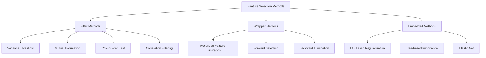
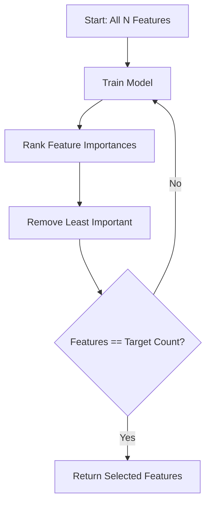
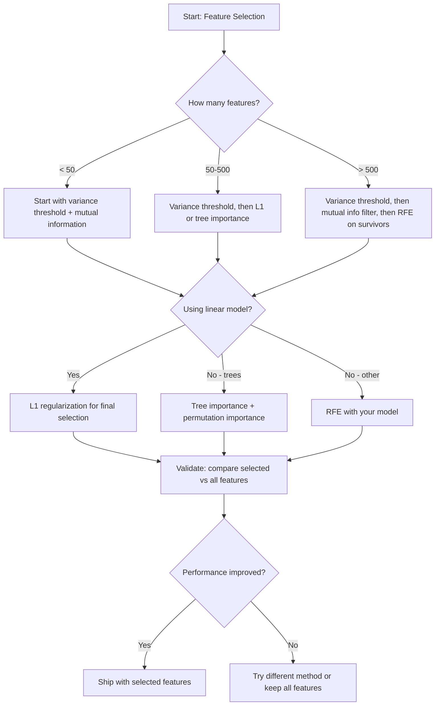

# 特征选择

更多功能并不更好。正确的功能是更好的。

**类型：** 构建
**语言：** Python
**先决条件：** 第二阶段，课程01-09，08（特征工程）
**时间：** 约75分钟

## 学习目标

- Implement filter methods (variance threshold, mutual information, chi-squared) and wrapper methods (RFE, forward selection) from scratch
- Explain why mutual information captures nonlinear feature-target relationships that correlation misses
- Compare L1 regularization (embedded selection) with RFE (wrapper selection) and evaluate their computational tradeoffs
- Build a feature selection pipeline that combines multiple methods and demonstrate improved generalization on held-out data

## 问题

您拥有500个特征。您的模型训练速度缓慢，经常过拟合，而且没有人能解释它学到了什么。您增加更多特征以期望提高性能，但情况却变得更糟。

这就是维度诅咒的体现。随着特征数量的增加，特征空间的规模会爆炸式增长。数据点变得稀疏，点与点之间的距离趋于一致。模型需要指数级更多的数据才能找到真正的模式。噪声特征淹没了信号特征，过拟合成为常态。

特征选择是解药。去除噪声，消除冗余，保留那些携带目标实际信息的特征。结果就是：更快的训练速度，更好的泛化能力，以及您能够真正解释模型的模型。

目标不是使用所有可用的信息，而是使用正确的信息。

## 概念

### 三种特征选择类别

每种特征选择方法都属于以下三个类别之一：



**过滤方法**使用统计度量独立评估每个特征。它们不使用模型。速度快，但会错过特征之间的相互作用。

**包装方法**训练模型来评估特征子集。它们以模型性能作为评分标准。效果更好，但由于需要多次重新训练模型，因此成本较高。

**嵌入式方法**在模型训练过程中选择特征。L1正则化将权重驱动至零。决策树根据最有用的特征进行分割。选择过程发生在拟合过程中，而不是作为一个独立的步骤。

### 方差阈值

最简单的过滤器。如果一个特征在样本中的变化很小，那么它几乎不携带任何信息。

考虑一个在1000个样本中有999个样本的该特征为0.0的情况。其方差接近于零。没有任何模型能够利用它来区分不同的类别。因此应该将其移除。

```
variance(x) = mean((x - mean(x))^2)
```

设置阈值（例如0.01）。将方差低于该阈值的每个特征删除。这样可以去除那些恒定或几乎恒定的特征，而无需查看目标变量。

使用时机：作为其他方法之前的预处理步骤。它以较低的成本捕捉到明显无用的特征。

限制：一个特征可能具有高方差，但仍然只是纯噪声。方差阈值是必要的，但不是充分的。

### 互信息

互信息衡量了知道特征X的值对目标Y的不确定性降低的程度。

```
I(X; Y) = sum_x sum_y p(x, y) * log(p(x, y) / (p(x) * p(y)))
```

如果X和Y是独立的，那么p(x, y) = p(x) * p(y)，因此对数项为零，I(X; Y) = 0。X对Y的描述越详细，互信息就越高。

与相关性相比的主要优势：互信息能够捕捉非线性关系。某个特征可能与目标变量没有相关性，但由于关系是二次或周期性的，其互信息可能很高。

对于连续特征，首先将其离散化为区间（基于直方图的估计）。区间的数量会影响估计结果——区间太少会丢失信息，太多则会增加噪声。常见的选择是sqrt(n)个区间或Sturges规则（1 + log2(n)）。


### 递归特征消除（RFE）

RFE是一种包装方法。它利用模型自身的特征重要性来迭代地剪枝：

1. 使用所有特征训练模型
2. 根据重要性对特征进行排序（对于线性模型使用系数，对于树状结构使用纯度降低）
3. 移除最不重要的特征
4. 重复上述步骤，直到剩余所需数量的特征为止



RFE考虑特征交互，因为模型将所有剩余特征视为一个整体。移除一个特征会改变其他特征的重要性。这使其比过滤方法更为全面。

成本：你需要训练模型N-target次。如果有500个特征且目标为10，那么需要490次训练。对于昂贵的模型来说，这速度较慢。你可以通过每次移除多个特征来加快速度（例如，每轮移除底部10%的特征）。

### L1正则化

L1正则化在损失函数中加入了权重的绝对值：

```
loss = prediction_error + alpha * sum(|w_i|)
```

The alpha parameter controls the intensity with which features are pruned. A higher alpha means more weights will be set to zero.

Why exactly zero? The L1 penalty creates a diamond-shaped constraint region in weight space. The optimal solution tends to be at one of these corners, where one or more weights are zero. L2 regularization (ridge) creates a circular constraint where weights decrease but rarely reach zero.

This is embedded feature selection: the model learns during training which features to ignore. Features with zero weight are effectively removed.

Advantages: Single training run, handles correlated features (picks one and zeros the others), built into most linear model implementations.

Limitation: Only works for linear models. Cannot capture nonlinear feature importance.

### 基于树的特征重要性

决策树及其集成方法（随机森林、梯度提升）会自然地对特征进行排序。每次分割都会减少不纯度（分类时使用基尼系数或熵，回归时使用方差）。能够显著减少不纯度的特征更为重要。

对于包含T棵树的随机森林：

```
importance(feature_j) = (1/T) * sum over all trees of
    sum over all nodes splitting on feature_j of
        (n_samples * impurity_decrease)
```

这为每个特征提供了一个标准化的重要性评分。它能够自动处理非线性关系和特征交互。

注意：基于树的 중요性评分倾向于那些具有许多唯一值的特征（高基数）。随机ID列会显得重要，因为它完美地分割了每个样本。使用排列重要性作为合理性检查。

### Permutation Importance

一种与模型无关的方法：

1. 训练模型并在验证数据上记录基线性能
2. 对于每个特征：随机打乱其值，测量性能下降的程度
3. 下降程度越大，该特征越重要

如果打乱一个特征不会损害性能，说明模型不依赖于它。如果性能崩溃，则该特征至关重要。

排列重要性避免了基于树的排序的重要性中的基数偏差。但它速度较慢：对每个特征进行一次完整评估，并重复多次以确保稳定性。

### 比较表

| 方法 | 类型 | 速度 | 非线性 | 特征交互作用 |
|------|------|-------|-----------|---------------------|
| 方差阈值 | 过滤器 | 非常快 | 否 | 否 |
| 互信息 | 过滤器 | 快 | 是 | 否 |
| 相关性过滤器 | 过滤器 | 快 | 否 | 否 |
| RFE | 包装器 | 慢 | 依赖模型 | 是 |
| L1 / Lasso | 嵌入式 | 快 | 否（线性） | 否 |
| 树重要性 | 嵌入式 | 中等 | 是 | 是 |
| 排列重要性 | 模型不可知 | 慢 | 是 | 是 |

### 决策流程图



## 构建它

### 步骤1：生成具有已知特征结构的合成数据

```python
import numpy as np


def make_feature_selection_data(n_samples=500, seed=42):
    rng = np.random.RandomState(seed)

    x1 = rng.randn(n_samples)
    x2 = rng.randn(n_samples)
    x3 = rng.randn(n_samples)
    x4 = x1 + 0.1 * rng.randn(n_samples)
    x5 = x2 + 0.1 * rng.randn(n_samples)

    informative = np.column_stack([x1, x2, x3, x4, x5])

    correlated = np.column_stack([
        x1 * 0.9 + 0.1 * rng.randn(n_samples),
        x2 * 0.8 + 0.2 * rng.randn(n_samples),
        x3 * 0.7 + 0.3 * rng.randn(n_samples),
        x1 * 0.5 + x2 * 0.5 + 0.1 * rng.randn(n_samples),
        x2 * 0.6 + x3 * 0.4 + 0.1 * rng.randn(n_samples),
    ])

    noise = rng.randn(n_samples, 10) * 0.5

    X = np.hstack([informative, correlated, noise])
    y = (2 * x1 - 1.5 * x2 + x3 + 0.5 * rng.randn(n_samples) > 0).astype(int)

    feature_names = (
        [f"info_{i}" for i in range(5)]
        + [f"corr_{i}" for i in range(5)]
        + [f"noise_{i}" for i in range(10)]
    )

    return X, y, feature_names
```

我们了解真实情况：特征0-4具有信息性（此外，特征3和4是特征0和1的对应副本），特征5-9与信息性特征相关，特征10-19则是纯粹的噪声。一个好的选择方法应该将0-4排在最前面，将10-19排在最后。

### 步骤2：方差阈值

```python
def variance_threshold(X, threshold=0.01):
    variances = np.var(X, axis=0)
    mask = variances > threshold
    return mask, variances
```

### 步骤3：互信息（离散）

```python
def discretize(x, n_bins=10):
    min_val, max_val = x.min(), x.max()
    if max_val == min_val:
        return np.zeros_like(x, dtype=int)
    bin_edges = np.linspace(min_val, max_val, n_bins + 1)
    binned = np.digitize(x, bin_edges[1:-1])
    return binned


def mutual_information(X, y, n_bins=10):
    n_samples, n_features = X.shape
    mi_scores = np.zeros(n_features)

    y_vals, y_counts = np.unique(y, return_counts=True)
    p_y = y_counts / n_samples

    for f in range(n_features):
        x_binned = discretize(X[:, f], n_bins)
        x_vals, x_counts = np.unique(x_binned, return_counts=True)
        p_x = dict(zip(x_vals, x_counts / n_samples))

        mi = 0.0
        for xv in x_vals:
            for yi, yv in enumerate(y_vals):
                joint_mask = (x_binned == xv) & (y == yv)
                p_xy = np.sum(joint_mask) / n_samples
                if p_xy > 0:
                    mi += p_xy * np.log(p_xy / (p_x[xv] * p_y[yi]))
        mi_scores[f] = mi

    return mi_scores
```

### 步骤4：递归特征消除

```python
def simple_logistic_importance(X, y, lr=0.1, epochs=100):
    n_samples, n_features = X.shape
    w = np.zeros(n_features)
    b = 0.0

    for _ in range(epochs):
        z = X @ w + b
        pred = 1.0 / (1.0 + np.exp(-np.clip(z, -500, 500)))
        error = pred - y
        w -= lr * (X.T @ error) / n_samples
        b -= lr * np.mean(error)

    return w, b


def rfe(X, y, n_features_to_select=5, lr=0.1, epochs=100):
    n_total = X.shape[1]
    remaining = list(range(n_total))
    rankings = np.ones(n_total, dtype=int)
    rank = n_total

    while len(remaining) > n_features_to_select:
        X_subset = X[:, remaining]
        w, _ = simple_logistic_importance(X_subset, y, lr, epochs)
        importances = np.abs(w)

        least_idx = np.argmin(importances)
        original_idx = remaining[least_idx]
        rankings[original_idx] = rank
        rank -= 1
        remaining.pop(least_idx)

    for idx in remaining:
        rankings[idx] = 1

    selected_mask = rankings == 1
    return selected_mask, rankings
```

### 步骤5：L1特征选择

```python
def soft_threshold(w, alpha):
    return np.sign(w) * np.maximum(np.abs(w) - alpha, 0)


def l1_feature_selection(X, y, alpha=0.1, lr=0.01, epochs=500):
    n_samples, n_features = X.shape
    w = np.zeros(n_features)
    b = 0.0

    for _ in range(epochs):
        z = X @ w + b
        pred = 1.0 / (1.0 + np.exp(-np.clip(z, -500, 500)))
        error = pred - y

        gradient_w = (X.T @ error) / n_samples
        gradient_b = np.mean(error)

        w -= lr * gradient_w
        w = soft_threshold(w, lr * alpha)
        b -= lr * gradient_b

    selected_mask = np.abs(w) > 1e-6
    return selected_mask, w
```

### 步骤6：基于树的重要性（简单决策树）

```python
def gini_impurity(y):
    if len(y) == 0:
        return 0.0
    classes, counts = np.unique(y, return_counts=True)
    probs = counts / len(y)
    return 1.0 - np.sum(probs ** 2)


def best_split(X, y, feature_idx):
    values = np.unique(X[:, feature_idx])
    if len(values) <= 1:
        return None, -1.0

    best_threshold = None
    best_gain = -1.0
    parent_gini = gini_impurity(y)
    n = len(y)

    for i in range(len(values) - 1):
        threshold = (values[i] + values[i + 1]) / 2.0
        left_mask = X[:, feature_idx] <= threshold
        right_mask = ~left_mask

        n_left = np.sum(left_mask)
        n_right = np.sum(right_mask)

        if n_left == 0 or n_right == 0:
            continue

        gain = parent_gini - (n_left / n) * gini_impurity(y[left_mask]) - (n_right / n) * gini_impurity(y[right_mask])

        if gain > best_gain:
            best_gain = gain
            best_threshold = threshold

    return best_threshold, best_gain


def tree_importance(X, y, n_trees=50, max_depth=5, seed=42):
    rng = np.random.RandomState(seed)
    n_samples, n_features = X.shape
    importances = np.zeros(n_features)

    for _ in range(n_trees):
        sample_idx = rng.choice(n_samples, size=n_samples, replace=True)
        feature_subset = rng.choice(n_features, size=max(1, int(np.sqrt(n_features))), replace=False)

        X_boot = X[sample_idx]
        y_boot = y[sample_idx]

        tree_imp = _build_tree_importance(X_boot, y_boot, feature_subset, max_depth)
        importances += tree_imp

    total = importances.sum()
    if total > 0:
        importances /= total

    return importances


def _build_tree_importance(X, y, feature_subset, max_depth, depth=0):
    n_features = X.shape[1]
    importances = np.zeros(n_features)

    if depth >= max_depth or len(np.unique(y)) <= 1 or len(y) < 4:
        return importances

    best_feature = None
    best_threshold = None
    best_gain = -1.0

    for f in feature_subset:
        threshold, gain = best_split(X, y, f)
        if gain > best_gain:
            best_gain = gain
            best_feature = f
            best_threshold = threshold

    if best_feature is None or best_gain <= 0:
        return importances

    importances[best_feature] += best_gain * len(y)

    left_mask = X[:, best_feature] <= best_threshold
    right_mask = ~left_mask

    importances += _build_tree_importance(X[left_mask], y[left_mask], feature_subset, max_depth, depth + 1)
    importances += _build_tree_importance(X[right_mask], y[right_mask], feature_subset, max_depth, depth + 1)

    return importances
```

### 步骤7：运行所有方法并进行比较

该代码文件在同一合成数据集上运行了所有五种方法，并打印出比较表，显示每种方法选择了哪些特征。

## 使用它

使用scikit-learn时，特征选择已内置在流程中：

```python
from sklearn.feature_selection import (
    VarianceThreshold,
    mutual_info_classif,
    RFE,
    SelectFromModel,
)
from sklearn.linear_model import Lasso, LogisticRegression
from sklearn.ensemble import RandomForestClassifier

vt = VarianceThreshold(threshold=0.01)
X_filtered = vt.fit_transform(X)

mi_scores = mutual_info_classif(X, y)
top_k = np.argsort(mi_scores)[-10:]

rfe_selector = RFE(LogisticRegression(), n_features_to_select=10)
rfe_selector.fit(X, y)
X_rfe = rfe_selector.transform(X)

lasso_selector = SelectFromModel(Lasso(alpha=0.01))
lasso_selector.fit(X, y)
X_lasso = lasso_selector.transform(X)

rf = RandomForestClassifier(n_estimators=100)
rf.fit(X, y)
importances = rf.feature_importances_
```

从零开始的实现准确地展示了每个方法内部发生的情况。方差阈值只是计算 `var(X, axis=0)` 并应用掩码。互信息是在列联表中计算联合频率和边际频率。RFE 是一个循环，用于训练、排序和剪枝。L1 是带有软阈值步骤的梯度下降法。树重要性通过分割过程中的不纯度降低来累积。没有魔法——只有统计和循环。

sklearn 版本增加了鲁棒性（例如，mutual_info_classif 使用 k-NN 密度估计而不是分箱），速度（C 实现）以及流程集成。

## 发货

本课程将生成以下文件：
- `outputs/skill-feature-selector.md` -- 用于选择合适特征选择方法的快速参考树状图

## 练习

1. **Forward selection**: Implement the opposite of RFE. Start with zero features. At each step, add the feature that improves model performance the most. Stop when adding features no longer helps. Compare the selected features against RFE results. Which is faster? Which gives better results?

2. **Stability selection**: Run L1 feature selection 50 times, each time on a random 80% subsample of the data, with slightly different alpha values. Count how often each feature is selected. Features selected in > 80% of runs are "stable." Compare stable features against single-run L1 selection. Which is more reliable?

3. **Multicollinearity detection**: Compute the correlation matrix for all features. Implement a function that, given a correlation threshold (e.g., 0.9), removes one feature from each highly-correlated pair (keeping the one with higher mutual information with the target). Test on the synthetic dataset and verify it removes the redundant correlated features.

4. **Feature selection pipeline**: Chain variance threshold, mutual information filter, and RFE into a single pipeline. First remove near-zero-variance features, then keep the top 50% by mutual information, then run RFE on the survivors. Compare this pipeline against running RFE alone on all features. Is the pipeline faster? Is it equally accurate?

5. **Permutation importance from scratch**: Implement permutation importance. For each feature, shuffle its values 10 times, measure the average drop in F1 score. Compare the ranking against tree-based importance. Find cases where they disagree and explain why (hint: correlated features).

## | 关键词 | 翻译 |

| 术语 | 人们怎么说 | 实际含义 |
|------|-----------------|----------|
| 过滤方法 | “独立评分特征” | 一种无需训练模型即可使用统计度量对特征进行排名的特征选择方法，单独评估每个特征 |
| 包装方法 | “使用模型挑选特征” | 一种通过训练模型并使用其性能作为选择标准来评估特征子集的特征选择方法 |
| 嵌入式方法 | “模型在训练过程中选择特征” | 作为模型拟合的一部分进行的特征选择，例如L1正则化将权重归零 |
| 互信息 | “一个变量对另一个变量的了解程度” | 衡量在已知X的情况下对Y的不确定性减少的程度，捕捉线性和非线性依赖关系 |
| 递归特征消除 | “训练、排名、剪枝、重复” | 一种迭代的包装方法，训练模型，移除最不重要的特征，并重复直到达到目标数量 |
| L1/Lasso正则化 | “消灭特征的惩罚项” | 将绝对权重值之和添加到损失函数中，使不重要的特征权重完全为零 |
| 方差阈值 | “移除常量特征” | 删除样本间方差低于指定阈值的特征，过滤掉无信息的特征 |
| 特征重要性 | “哪些特征最重要” | 一个评分，表示每个特征对模型预测的贡献程度，由分割增益（树）或系数大小（线性）计算得出 |
| 排列重要性 | “随机打乱并测量影响” | 通过随机打乱每个特征的值并测量由此导致的模型性能下降来评估特征重要性 |
| 维数灾难 | “特征过多，数据不足” | 添加特征时特征空间体积呈指数增长的现象，使数据稀疏且距离失去意义 |

## 更多阅读资料

- [变量和特征选择简介（Guyon & Elisseeff, 2003）](https://jmlr.org/papers/v3/guyon03a.html) ——关于特征选择方法的基础性综述，至今仍被广泛引用。
- [scikit-learn 特征选择指南](https://scikit-learn.org/stable/modules/feature_selection.html) ——包含过滤、包装和嵌入式方法的实用参考，并附有代码示例。
- [稳定性选择（Meinshausen & Buhlmann, 2010）](https://arxiv.org/abs/0809.2932) ——将子采样与特征选择相结合，以获得稳健且可重复的结果。
- [注意默认随机森林重要性算法的问题（Strobl等，2007）](https://bmcbioinformatics.biomedcentral.com/articles/10.1186/1471-2105-8-25) ——揭示了基于树的 중요性的基数偏差问题，并提出了条件重要性的替代方案。
