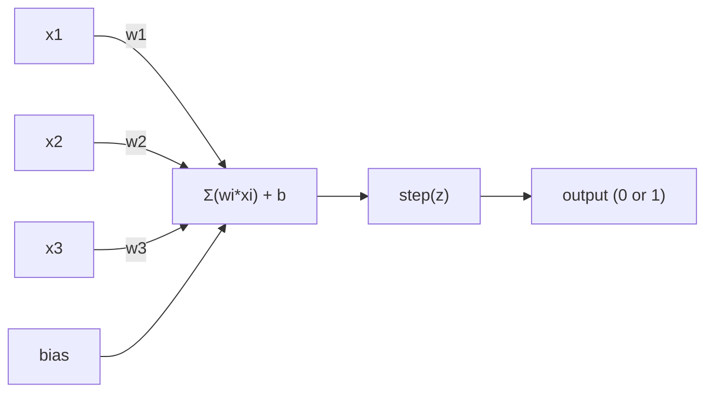
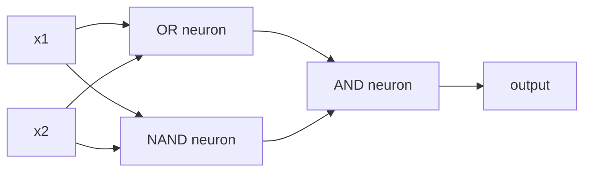

# Perceptron

感知器是神经网络的基本单元。将其展开，你会找到权重、偏置和决策函数。

**类型：**构建
**语言：**Python
**先决条件：**第一阶段（线性代数基础）
**时间：**约60分钟

## 学习目标

- Implement a perceptron from scratch in Python, including the weight update rule and step activation function.
- Explain why a single perceptron can only solve linearly separable problems and demonstrate the XOR failure case.
- Construct a multi-layer perceptron by composing OR, NAND, and AND gates to solve XOR.
- Train a two-layer network with sigmoid activation and backpropagation to automatically learn XOR.

## 问题

您知道向量和点积。您也知道矩阵如何将输入转换为输出。但是机器如何*学习*使用哪种转换方式呢？

感知器可以回答这个问题。它是最简单的学习机：接收一些输入，乘以权重，加上偏置，然后做出二进制决策。然后进行调整。就是这样。所有构建过的神经网络都是将这种思想层层堆叠而成的。

理解感知器意味着理解代码中“学习”的真正含义：调整数值直到输出与现实相符。

## 概念

### 一个神经元，一个决策

一个感知器接收n个输入，对每个输入乘以一个权重，然后求和，加上一个偏置，最后将结果通过激活函数处理。



阶跃函数非常简单：如果加权和加上偏置大于等于0，输出1。否则，输出0。

```
step(z) = 1  if z >= 0
           0  if z < 0
```

这是一个线性分类器。权重和偏置定义了一个线（在更高维度中是超平面），它将输入空间分为两个区域。

### 决策边界

对于两个输入，感知器在二维空间中绘制一条线：

```
  x2
  ┤
  │  Class 1        /
  │    (0)          /
  │                /
  │               / w1·x1 + w2·x2 + b = 0
  │              /
  │             /     Class 2
  │            /        (1)
  ┼───────────/──────────── x1
```

在行的一侧，所有元素都输出0。另一侧的所有元素都输出1。训练过程会调整这一行，直到它能够正确区分不同的类别。

### 学习规则

感知器学习规则很简单：

```
For each training example (x, y_true):
    y_pred = predict(x)
    error = y_true - y_pred

    For each weight:
        w_i = w_i + learning_rate * error * x_i
    bias = bias + learning_rate * error
```

如果预测正确，误差为0，则无需更改。如果预测为0但应为1，权重增加。如果预测为1但应为0，权重减少。学习率控制每次调整的幅度。

### XOR Problem

这就是问题所在。看看这些逻辑门：

```
AND gate:           OR gate:            XOR gate:
x1  x2  out         x1  x2  out         x1  x2  out
0   0   0           0   0   0           0   0   0
0   1   0           0   1   1           0   1   1
1   0   0           1   0   1           1   0   1
1   1   1           1   1   1           1   1   0
```

AND和OR是线性可分的：你可以画一条线来分离0和1。而XOR则不是。没有一条线可以分离[0,1]和[1,0]与[0,0]和[1,1]。

```
AND (separable):        XOR (not separable):

  x2                      x2
  1 ┤  0     1            1 ┤  1     0
    │     /                 │
  0 ┤  0 / 0              0 ┤  0     1
    ┼──/──────── x1         ┼──────────── x1
       line works!          no single line works!
```

这是一个基本限制。单个感知器只能解决线性可分离问题。明斯基和帕佩特在1969年证明了这一点，这几乎导致神经网络研究在十年内停滞不前。

解决方案是将感知器堆叠成层。多层感知器可以通过将两个线性决策合并成一个非线性决策来解决XOR问题。

```figure
perceptron-boundary
```

## 构建它

### Step 1: The Perceptron class

```python
class Perceptron:
    def __init__(self, n_inputs, learning_rate=0.1):
        self.weights = [0.0] * n_inputs
        self.bias = 0.0
        self.lr = learning_rate

    def predict(self, inputs):
        total = sum(w * x for w, x in zip(self.weights, inputs))
        total += self.bias
        return 1 if total >= 0 else 0

    def train(self, training_data, epochs=100):
        for epoch in range(epochs):
            errors = 0
            for inputs, target in training_data:
                prediction = self.predict(inputs)
                error = target - prediction
                if error != 0:
                    errors += 1
                    for i in range(len(self.weights)):
                        self.weights[i] += self.lr * error * inputs[i]
                    self.bias += self.lr * error
            if errors == 0:
                print(f"Converged at epoch {epoch + 1}")
                return
        print(f"Did not converge after {epochs} epochs")
```

### 步骤2：训练逻辑门

```python
and_data = [
    ([0, 0], 0),
    ([0, 1], 0),
    ([1, 0], 0),
    ([1, 1], 1),
]

or_data = [
    ([0, 0], 0),
    ([0, 1], 1),
    ([1, 0], 1),
    ([1, 1], 1),
]

not_data = [
    ([0], 1),
    ([1], 0),
]

print("=== AND Gate ===")
p_and = Perceptron(2)
p_and.train(and_data)
for inputs, _ in and_data:
    print(f"  {inputs} -> {p_and.predict(inputs)}")

print("\n=== OR Gate ===")
p_or = Perceptron(2)
p_or.train(or_data)
for inputs, _ in or_data:
    print(f"  {inputs} -> {p_or.predict(inputs)}")

print("\n=== NOT Gate ===")
p_not = Perceptron(1)
p_not.train(not_data)
for inputs, _ in not_data:
    print(f"  {inputs} -> {p_not.predict(inputs)}")
```

### 步骤3：观察XOR失败

```python
xor_data = [
    ([0, 0], 0),
    ([0, 1], 1),
    ([1, 0], 1),
    ([1, 1], 0),
]

print("\n=== XOR Gate (single perceptron) ===")
p_xor = Perceptron(2)
p_xor.train(xor_data, epochs=1000)
for inputs, expected in xor_data:
    result = p_xor.predict(inputs)
    status = "OK" if result == expected else "WRONG"
    print(f"  {inputs} -> {result} (expected {expected}) {status}")
```

它永远无法收敛。这是单感知器无法学习XOR函数的确凿证据。

### 步骤4：使用两层解决XOR问题

技巧：XOR = (x1 OR x2) AND NOT (x1 AND x2)。结合三个感知器：



```python
def xor_network(x1, x2):
    or_neuron = Perceptron(2)
    or_neuron.weights = [1.0, 1.0]
    or_neuron.bias = -0.5

    nand_neuron = Perceptron(2)
    nand_neuron.weights = [-1.0, -1.0]
    nand_neuron.bias = 1.5

    and_neuron = Perceptron(2)
    and_neuron.weights = [1.0, 1.0]
    and_neuron.bias = -1.5

    hidden1 = or_neuron.predict([x1, x2])
    hidden2 = nand_neuron.predict([x1, x2])
    output = and_neuron.predict([hidden1, hidden2])
    return output


print("\n=== XOR Gate (multi-layer network) ===")
for inputs, expected in xor_data:
    result = xor_network(inputs[0], inputs[1])
    print(f"  {inputs} -> {result} (expected {expected})")
```

所有四种情况均正确。将感知器堆叠成层可以创建单个感知器无法产生的决策边界。

### 步骤5：训练两层网络

第4步：手动连接权重。这种方法适用于XOR问题，但不适用于那些无法提前知道正确权重的实际问题。解决方案是：用sigmoid函数替换阶跃函数，并通过反向传播自动学习权重。

```python
class TwoLayerNetwork:
    def __init__(self, learning_rate=0.5):
        import random
        random.seed(0)
        self.w_hidden = [[random.uniform(-1, 1), random.uniform(-1, 1)] for _ in range(2)]
        self.b_hidden = [random.uniform(-1, 1), random.uniform(-1, 1)]
        self.w_output = [random.uniform(-1, 1), random.uniform(-1, 1)]
        self.b_output = random.uniform(-1, 1)
        self.lr = learning_rate

    def sigmoid(self, x):
        import math
        x = max(-500, min(500, x))
        return 1.0 / (1.0 + math.exp(-x))

    def forward(self, inputs):
        self.inputs = inputs
        self.hidden_outputs = []
        for i in range(2):
            z = sum(w * x for w, x in zip(self.w_hidden[i], inputs)) + self.b_hidden[i]
            self.hidden_outputs.append(self.sigmoid(z))
        z_out = sum(w * h for w, h in zip(self.w_output, self.hidden_outputs)) + self.b_output
        self.output = self.sigmoid(z_out)
        return self.output

    def train(self, training_data, epochs=10000):
        for epoch in range(epochs):
            total_error = 0
            for inputs, target in training_data:
                output = self.forward(inputs)
                error = target - output
                total_error += error ** 2

                d_output = error * output * (1 - output)

                saved_w_output = self.w_output[:]
                hidden_deltas = []
                for i in range(2):
                    h = self.hidden_outputs[i]
                    hd = d_output * saved_w_output[i] * h * (1 - h)
                    hidden_deltas.append(hd)

                for i in range(2):
                    self.w_output[i] += self.lr * d_output * self.hidden_outputs[i]
                self.b_output += self.lr * d_output

                for i in range(2):
                    for j in range(len(inputs)):
                        self.w_hidden[i][j] += self.lr * hidden_deltas[i] * inputs[j]
                    self.b_hidden[i] += self.lr * hidden_deltas[i]
```

```python
net = TwoLayerNetwork(learning_rate=2.0)
net.train(xor_data, epochs=10000)
for inputs, expected in xor_data:
    result = net.forward(inputs)
    predicted = 1 if result >= 0.5 else 0
    print(f"  {inputs} -> {result:.4f} (rounded: {predicted}, expected {expected})")
```

与步骤4的两个关键区别。首先，sigmoid函数取代了阶跃函数——它更加平滑，因此存在梯度。其次，`train`方法将误差从输出层反向传播到隐藏层，根据每个权重对误差的贡献比例进行调整。这就是20行代码实现的反向传播算法。

这是通往第03课的桥梁。`d_output`和`hidden_deltas`背后的数学原理是将链式法则应用于网络图。我们将在那里正确地推导它。

## 使用它

所有你刚刚从零构建的内容都存在于一个导入中：

```python
from sklearn.linear_model import Perceptron as SkPerceptron
import numpy as np

X = np.array([[0,0],[0,1],[1,0],[1,1]])
y = np.array([0, 0, 0, 1])

clf = SkPerceptron(max_iter=100, tol=1e-3)
clf.fit(X, y)
print([clf.predict([x])[0] for x in X])
```

五行。你的30行的`Perceptron`类实现的是同样的功能。sklearn版本增加了收敛检查、多种损失函数以及稀疏输入支持——但核心逻辑是相同的：加权求和、阶跃函数、基于错误的权重更新。

真正的差异体现在规模上。在生产网络中会发生哪些变化：

- 阶跃函数变为Sigmoid、ReLU或其他平滑激活函数
- 权重通过反向传播自动学习（第03课）
- 层变得更深：3层、10层、100多层
- 同样的原则适用：每一层都从前一层输出中创建新特征

单个感知器只能绘制直线。将它们堆叠起来，就可以绘制任何形状。

## 发货

本课程将生成以下文件：
- `outputs/skill-perceptron.md` - 关于何时需要单层架构与多层架构的技能介绍

## 练习

1. Train a perceptron on a NAND gate (the universal gate - any logic circuit can be built from NAND). Verify its weights and bias form a valid decision boundary.
2. Modify the Perceptron class to track the decision boundary (w1*x1 + w2*x2 + b = 0) at each epoch. Print how the line shifts during training on the AND gate.
3. Build a 3-input perceptron that outputs 1 only when at least 2 of the 3 inputs are 1 (a majority vote function). Is this linearly separable? Why?

## | 关键词 | 翻译 |

| 术语 | 人们怎么说 | 实际含义 |
|------|------------|----------|
| 感知机 | “假的神经元” | 线性分类器：输入与权重的点积加上偏置，通过阶跃函数计算 |
| 权重 | “输入的 중요성” | 放大每个输入对决策贡献的乘数 |
| 偏置 | “阈值” | 改变决策边界的常数，使感知机即使在输入为零时也能工作 |
| 激活函数 | “压缩值的东西” | 在加权求和后应用的函数——感知机使用阶跃函数，现代网络使用Sigmoid/ReLU |
| 线性可分 | “你可以画一条线将它们分开” | 数据集上可以完美用单超平面分隔类别的情况 |
| XOR问题 | “感知机无法处理的问题” | 证明单层网络无法学习非线性可分的函数 |
| 决策边界 | “分类器切换的位置” | 将输入空间分为两个类的 hyperplane w*x + b = 0 |
| 多层感知机 | “真正的神经网络” | 按层堆叠的感知机，每层的输出作为下一层的输入 |

## 更多阅读资料

- Frank Rosenblatt, “The Perceptron: A Probabilistic Model for Information Storage and Organization in the Brain” (1958) – the original paper that laid the foundation for this field.
- Minsky & Papert, “Perceptrons” (1969) – the book that proved that XOR problems could not be solved by single-layer neural networks, leading to a decade of decline in perceptron research.
- Michael Nielsen, “Neural Networks and Deep Learning”, Chapter 1 (http://neuralnetworksanddeeplearning.com/) – free online resource providing a clear visual explanation of how perceptrons are used in neural network systems.
