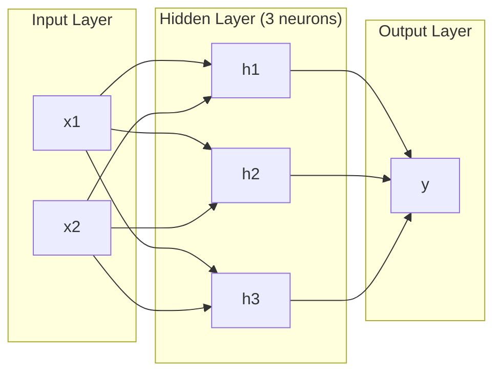
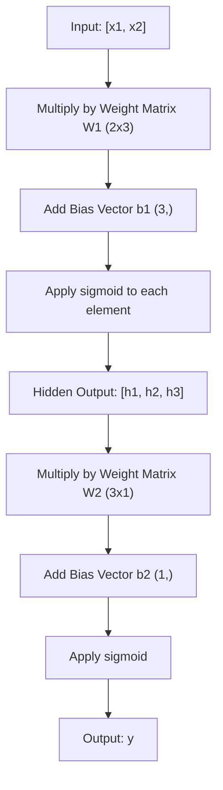
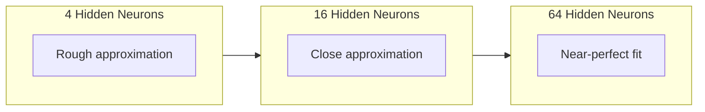

# 多层网络与转发过程

> 一个神经元绘制一条线。将它们堆叠起来，你就可以绘制任何东西。

**类型：** 构建
**语言：** Python
**先决条件：** 第01阶段（数学基础），课程03.01（感知器）
**时间：** 约90分钟

## 学习目标

- Build a multi-layer network from scratch using the Layer and Network classes, performing a complete forward pass.
- Trace the dimensions of the matrix at each layer of the network and identify any shape mismatches.
- Explain how stacking nonlinear activations enables a network to learn curved decision boundaries.
- Solve the XOR problem using a 2-2-1 architecture with hand-tuned sigmoid weights.

## 问题

一个神经元就像一条直线。就是如此，一条穿过数据的直线。人工智能中的每一个真实问题——图像识别、语言理解、围棋游戏——都需要曲线。将神经元堆叠成层才能形成这些曲线。

1969年，明斯基和帕佩特证明了这一限制是致命的：单层网络无法学习XOR逻辑。不是“难以学习”——从数学上讲就是不可能。XOR的真值表将[0,1]和[1,0]放在一侧，[0,0]和[1,1]放在另一侧。没有一条直线能够将它们分开。

这导致神经网络的研究在十多年内停滞不前。事后看来，解决方案显而易见：停止使用单层网络。将神经元堆叠成层。让第一层将输入空间切割成新的特征，然后让第二层将这些特征组合成单条直线无法做出的决策。

这种堆叠结构就是多层网络。它是当今所有生产环境中的深度学习模型的基础。前向传播——数据从输入经过隐藏层到达输出——是其他一切工作之前必须建立的第一件事。

## 概念

### 层：输入、隐藏、输出

多层网络包含三种类型的层：

**输入层**——实际上并不属于真正的层。它存储你的原始数据。两个特征意味着两个输入节点。这里不会发生计算。

**隐藏层**——这里是工作的地方。每个神经元接收前一层的所有输出，应用权重和偏置，然后通过激活函数处理结果。“隐藏”是因为你在训练数据中无法直接看到这些值。

**输出层**——最终答案。对于二元分类，使用一个带有Sigmoid函数的神经元。对于多类分类，每类使用一个神经元。



这是一个2-3-1网络。两个输入，三个隐藏神经元，一个输出。每个连接都带有权重。每个神经元（输入除外）都带有一个偏置。

每一层都会产生一个称为隐藏状态的数字向量。对于文本，隐藏状态会增加维度——将单词编码为768个数字以捕捉语义意义。对于图像，它们会降低维度——将数百万像素压缩成可管理的表示形式。学习过程发生在隐藏状态中。

### 神经元与激活

每个神经元执行三件事：

1. 将每个输入与其对应的权重相乘
2. 将所有乘积相加并加上偏置
3. 将总和通过激活函数处理

目前，激活函数为Sigmoid函数：

```
sigmoid(z) = 1 / (1 + e^(-z))
```

Sigmoid函数将任何数值压缩到范围（0，1）内。较大的正输入会推向1，较大的负输入会推向0，而零则映射到0.5。这种平滑的曲线使得学习成为可能——与感知器固定的梯度不同，Sigmoid函数在每个位置都有梯度。

### 传球：数据如何流动

前向传播将输入数据逐层通过网络，直到到达输出端。在前向传播过程中不会发生学习过程。它纯粹是计算：乘法、加法、激活函数，重复这个过程。



在每一层，都会依次发生三个操作：

```
z = W * input + b       (linear transformation)
a = sigmoid(z)           (activation)
```

一层的结果成为下一层的输入。这就是整个正向传递过程。

### 矩阵维度

跟踪维度是深度学习中最重要的调试技能。以下是2-3-1网络的结构：

| 步骤 | 操作 | 维度 | 结果形状 |
|------|-----------|------------|-------------|
| 输入 | x | -- | (2,) |
| 隐藏线性层 | W1 * x + b1 | W1: (3, 2), b1: (3,) | (3,) |
| 隐藏激活函数 | sigmoid(z1) | -- | (3,) |
| 输出线性层 | W2 * h + b2 | W2: (1, 3), b2: (1,) | (1,) |
| 输出激活函数 | sigmoid(z2) | -- | (1,) |

规则：第k层的权重矩阵W的形状为(神经元_in_layer_k, 神经元_in_layer_k_minus_1)。行数与当前层相同，列数与前一层相同。如果形状不匹配，则存在错误。

### 通用逼近定理

在1989年，George Cybenko证明了了一个了不起的事实：一个具有单个隐藏层且神经元数量足够的神经网络可以近似任何连续函数，达到所需的精度。

这并不意味着只有一个隐藏层总是最好的。这意味着这种架构在理论上是可行的。实际上，更深的网络（更多层，每层更少神经元）使用的总参数数量远远少于浅而宽的网络，就能学习相同的功能。这就是深度学习能够发挥作用的原因。

直觉是：隐藏层中的每个神经元都学习一个“凸起”或特征。在正确的位置放置足够的凸起就可以近似任何平滑曲线。更多的神经元，更多的凸起，更好的近似效果。



### 可组合性

Neural networks are composable. You can stack them, chain them, and run them in parallel. A Whisper model uses an encoder network to process audio and a separate decoder network to generate text. Modern Large Language Models (LLMs) are primarily decoder-based. BERT is only an encoder. T5 is both an encoder and a decoder. The choice of architecture determines the capabilities of the model.

```figure
mlp-forward
```

## 构建它

纯Python。不使用numpy。所有矩阵运算都是从头开始编写的。

### 步骤1：Sigmoid激活函数

```python
import math

def sigmoid(x):
    x = max(-500.0, min(500.0, x))
    return 1.0 / (1.0 + math.exp(-x))
```

The range of [-500, 500] prevents overflow. `math.exp(500)` results in a large but finite value. `math.exp(1000)` yields infinity.

### 步骤2：层类

在深度学习中所有最重要的操作就是矩阵乘法。每一层、每一个注意力头、每一次前向传播——都是通过矩阵乘法完成的。线性层接收一个输入向量，将其与权重矩阵相乘，然后加上偏置向量：y = Wx + b。这个简单的方程占据了神经网络90%的计算量。

一层包含一个权重矩阵和一个偏置向量。其前向方法接收一个输入向量并返回激活后的输出。

```python
class Layer:
    def __init__(self, n_inputs, n_neurons, weights=None, biases=None):
        if weights is not None:
            self.weights = weights
        else:
            import random
            self.weights = [
                [random.uniform(-1, 1) for _ in range(n_inputs)]
                for _ in range(n_neurons)
            ]
        if biases is not None:
            self.biases = biases
        else:
            self.biases = [0.0] * n_neurons

    def forward(self, inputs):
        self.last_input = inputs
        self.last_output = []
        for neuron_idx in range(len(self.weights)):
            z = sum(
                w * x for w, x in zip(self.weights[neuron_idx], inputs)
            )
            z += self.biases[neuron_idx]
            self.last_output.append(sigmoid(z))
        return self.last_output
```

权重矩阵的形状为(n_neurons, n_inputs)。每一行表示一个神经元在所有输入上的权重。forward方法会遍历所有神经元，计算加权求和加上偏置值，应用Sigmoid函数，然后收集结果。

### 步骤3：网络课程

网络是由多层构成的列表。前向传递将它们串联起来：第k层的输出进入第k+1层。

```python
class Network:
    def __init__(self, layers):
        self.layers = layers

    def forward(self, inputs):
        current = inputs
        for layer in self.layers:
            current = layer.forward(current)
        return current
```

这就是整个前向传递过程。四行逻辑代码。数据输入，流经每一层，最终输出出来。

### 步骤4：使用调优权重进行XOR运算

在课程01中，我们通过结合OR、NAND和AND感知器解决了XOR问题。现在用我们的Layer类和Network类做同样的事情。2-2-1架构：两个输入，两个隐藏神经元，一个输出。

```python
hidden = Layer(
    n_inputs=2,
    n_neurons=2,
    weights=[[20.0, 20.0], [-20.0, -20.0]],
    biases=[-10.0, 30.0],
)

output = Layer(
    n_inputs=2,
    n_neurons=1,
    weights=[[20.0, 20.0]],
    biases=[-30.0],
)

xor_net = Network([hidden, output])

xor_data = [
    ([0, 0], 0),
    ([0, 1], 1),
    ([1, 0], 1),
    ([1, 1], 0),
]

for inputs, expected in xor_data:
    result = xor_net.forward(inputs)
    predicted = 1 if result[0] >= 0.5 else 0
    print(f"  {inputs} -> {result[0]:.6f} (rounded: {predicted}, expected: {expected})")
```

The large weights (20, -20) cause the sigmoid function to behave like a step function. The first hidden neuron approximates an OR operation. The second one approximates a NAND operation. The output neuron combines these two functions to form an AND operation, which in turn represents an XOR operation.

### 步骤5：圆圈分类

一个更难的问题：将二维点分类为以原点为中心、半径为0.5的圆内或圆外。这需要一个弯曲的决策边界——对于单个感知器来说是不可能的。

```python
import random
import math

random.seed(42)

data = []
for _ in range(200):
    x = random.uniform(-1, 1)
    y = random.uniform(-1, 1)
    label = 1 if (x * x + y * y) < 0.25 else 0
    data.append(([x, y], label))

circle_net = Network([
    Layer(n_inputs=2, n_neurons=8),
    Layer(n_inputs=8, n_neurons=1),
])
```

With random weights, the network will not classify well. But the forward pass still runs. This is the point—the forward pass is simply computation. Learning the correct weights is backpropagation, which will be covered in Lesson 03.

```python
correct = 0
for inputs, expected in data:
    result = circle_net.forward(inputs)
    predicted = 1 if result[0] >= 0.5 else 0
    if predicted == expected:
        correct += 1

print(f"Accuracy with random weights: {correct}/{len(data)} ({100*correct/len(data):.1f}%)")
```

随机权重会导致较低的准确性——通常比猜测多数类还要差。经过训练后（第03课），具有相同8个隐藏神经元的架构会绘制出一个曲线边界，将内部与外部区分开来。

## 使用它

PyTorch accomplishes all the above in four lines:

```python
import torch
import torch.nn as nn

model = nn.Sequential(
    nn.Linear(2, 8),
    nn.Sigmoid(),
    nn.Linear(8, 1),
    nn.Sigmoid(),
)

x = torch.tensor([[0.0, 0.0], [0.0, 1.0], [1.0, 0.0], [1.0, 1.0]])
output = model(x)
print(output)
```

`nn.Linear(2, 8)` 是你的 Layer 类：权重矩阵的形状为 (8, 2)，偏置向量的形状也为 (8,)。`nn.Sigmoid()` 是应用到的 Sigmoid 函数，按元素方式处理。`nn.Sequential` 是你的 Network 类：按顺序连接各个层。

区别在于速度和规模。PyTorch 运行在 GPU 上，能够处理数百万样本的数据集，并自动计算反向传播的梯度。但是前向传播的逻辑与你刚刚从头构建的是相同的。

## 发货

本课程生成了一个可复用的网络架构设计提示：

- `outputs/prompt-network-architect.md`

在需要确定给定问题的层数、每层神经元数量以及应使用的激活函数时，可以使用此提示。

## 练习

1. Build a 2-4-2-1 network (two hidden layers) and run the forward pass on XOR data with random weights. Print the intermediate hidden layer outputs to see how the representation transforms at each layer.

2. Change the hidden layer size in the circle classifier from 8 to 2, then to 32. Run the forward pass with random weights each time. Does the number of hidden neurons change the output range or distribution? Why?

3. Implement a `count_parameters` method on the Network class that returns the total number of trainable weights and biases. Test it on a 784-256-128-10 network (the classic MNIST architecture). How many parameters does it have?

4. Build a forward pass for a 3-4-4-2 network. Feed it RGB color values (normalized to 0-1) and observe the two outputs. This is the architecture for a simple color classifier with two classes.

5. Replace sigmoid with a "leaky step" function: return 0.01 * z if z < 0, else 1.0. Run the forward pass on XOR with the same hand-tuned weights from Step 4. Does it still work? Why is the smooth sigmoid preferred over hard cutoffs?

## | 关键词 | 翻译 |

| 术语 | 人们怎么说 | 实际含义 |
|------|------------|----------|
| 正向传播 | “运行模型” | 将输入通过每一层——乘以权重、添加偏置、激活——以产生输出 |
| 隐藏层 | “中间部分” | 位于输入和输出之间的任何一层，其值在数据中无法直接观察到 |
| 多层网络 | “深度神经网络” | 神经元层依次堆叠，每层的输出作为下一层的输入 |
| 激活函数 | “非线性特性” | 在线性变换后应用的函数，引入决策边界的曲线 |
| Sigmoid | “S形曲线” | sigma(z) = 1/(1+e^(-z))，将任何实数压缩到(0,1)，并在各处平滑且可微分 |
| 权重矩阵 | “参数” | 形状为(current_layer_neurons, previous_layer_neurons)的矩阵W，包含可学习的连接强度 |
| 偏置向量 | “偏移量” | 在矩阵乘法后添加的向量，使神经元即使在所有输入为零时也能激活 |
| 通用近似 | “神经网络可以学习任何东西” | 具有足够神经元的单个隐藏层可以近似任何连续函数——但“足够”可能意味着数十亿个神经元 |
| 线性变换 | “矩阵乘法步骤” | z = W * x + b，激活前的计算，将输入映射到新空间 |
| 决策边界 | “分类器切换的位置” | 输入空间中网络输出与分类阈值相交的曲面 |

## 更多阅读资料

- Michael Nielsen, “Neural Networks and Deep Learning”, Chapters 1-2 (http://neuralnetworksanddeeplearning.com/) – The clearest free explanation of forward passes and network structure, with interactive visualizations.  
- Cybenko, “Approximation by Superpositions of a Sigmoidal Function” (1989) – The original paper on the universal approximation theorem, surprisingly readable.  
- 3Blue1Brown, “But what is a neural network?” (https://www.youtube.com/watch?v=aircAruvnKk) – A 20-minute visual guide to layers, weights, and forward passes that helps build a clear mental model.  
- Goodfellow, Bengio, Courville, “Deep Learning”, Chapter 6 (https://www.deeplearningbook.org/) – The standard reference for multi-layer networks, available online for free.
