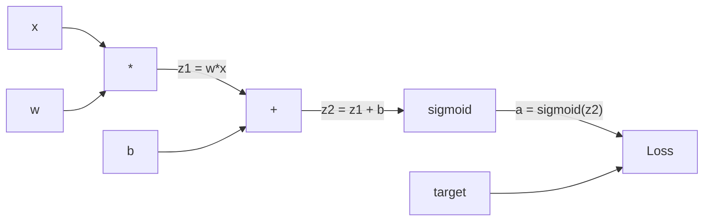
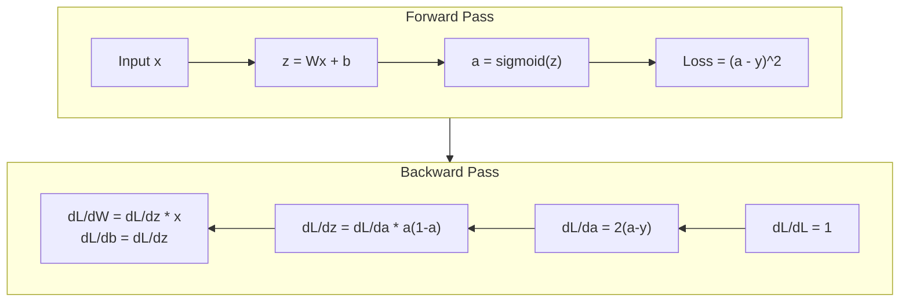
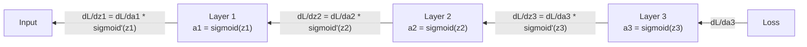

# 从零开始进行反向传播

反向传播是使学习成为可能的算法。没有它，神经网络就只是昂贵的随机数生成器。

**类型：** 构建
**语言：** Python
**先决条件：** 第03.02课（多层网络）
**时间：** 约120分钟

## 学习目标

- Implement a value-based autograd engine that constructs a computational graph and computes gradients through topological sorting.
- Derive the backward pass for addition, multiplication, and sigmoid using the chain rule.
- Train a multi-layer network on XOR and circle classification using only your own from scratch backpropagation engine.
- Identify the vanishing gradient problem in deep sigmoid networks and explain why gradients shrink exponentially.

## 问题

您的网络有一个隐藏层，包含768个输入和3072个输出。这意味着有2,359,296个权重。它做出了错误的预测。是哪些权重导致了错误？单独测试每个权重需要230万次前向传播。反向传播在单次反向传播中计算所有230万的梯度。这不是一种优化方法。这是可训练与不可训练之间的区别。

简单的方法：取一个权重，稍微调整它一点，再次进行前向传播，测量损失是增加还是减少。这样就能得到该权重的梯度。现在对网络中的每个权重都这样做。这需要数千次训练步骤和数百万个数据点。要训练出有用的模型，你需要极长的时间。

反向传播解决了这个问题。一次前向传播，一次反向传播，所有梯度都被计算出来。诀窍在于微积分中的链式法则，系统地应用于计算图。这就是使深度学习变得实用的算法。没有它，我们仍然会停留在简单的问题上。

## 概念

### 链式法则，应用于网络

您在第01阶段第05课中学习了链式法则。简要回顾一下：如果y = f(g(x))，那么dy/dx = f'(g(x)) * g'(x)。您在链条上相乘了导数。

在神经网络中，“链条”是指从输入到损失函数的操作序列。每一层都应用权重、添加偏置，并通过激活函数处理。损失函数将最终输出与目标进行比较。反向传播沿着这条链条回溯，计算每个操作对误差的贡献程度。

### 计算图

Each forward pass builds a graph. Each node represents an operation (multiply, add, sigmoid). Each edge carries a value for the forward direction and a gradient for the backward direction.



正向传播：值从左到右流动。x和w产生z1 = w*x。加上b得到z2。Sigmoid函数给出激活值a。使用损失函数比较a和目标y。

反向传播：梯度从右到左流动。从dL/da开始（损失随激活值的变化情况）。乘以da/dz2（Sigmoid函数的导数）。这就得到了dL/dz2。分成dL/db（等于dL/dz2，因为z2 = z1 + b）和dL/dz1。然后dL/dw = dL/dz1 * x，dL/dx = dL/dz1 * w。

在反向传播过程中，图中的每个节点都有一个任务：取来自上方的梯度，乘以其局部导数，并将其传递下去。

### Forward vs Backward



前向传播存储每个中间值：z、a以及每一层的输入。后向传播需要这些存储的值来计算梯度。这就是反向传播的核心——内存计算与速度之间的权衡。你用存储激活值的内存换取了速度（一次传播而不是数百万次）。

### 网络中的梯度流

对于三层网络，梯度会流经每一层：



在每一层，梯度都会乘以sigmoid导数。sigmoid导数是*a*(1 - a)，当a=0.5时达到最大值0.25。三层深度时，梯度最多被乘以0.25^3=0.0156。十层深度时：0.25^10=0.000001。

### 消失梯度

这就是消失梯度问题。Sigmoid函数将其输出压缩在0和1之间，其导数始终小于0.25。如果堆叠过多的Sigmoid层，梯度将缩小到零。早期层几乎无法学习，因为它们接收到的梯度接近零。

```
sigmoid(z):     Output range [0, 1]
sigmoid'(z):    Max value 0.25 (at z = 0)

After 5 layers:   gradient * 0.25^5 = 0.001x original
After 10 layers:  gradient * 0.25^10 = 0.000001x original
```

这就是为什么深度Sigmoid网络几乎无法训练的原因。解决方案——ReLU及其变体——是第04课的主题。目前，需要理解的是反向传播机制运作得非常完美。问题在于它如何解决这个问题。

### Deriving Gradients for a 2-Layer Network

具体数学模型如下：输入为x，隐藏层采用Sigmoid函数，输出层同样采用Sigmoid函数，损失函数为MSE损失。

前向传播：
```
z1 = W1 * x + b1
a1 = sigmoid(z1)
z2 = W2 * a1 + b2
a2 = sigmoid(z2)
L = (a2 - y)^2
```

逆向传递（逐步应用链式法则）：
```
dL/da2 = 2(a2 - y)
da2/dz2 = a2 * (1 - a2)
dL/dz2 = dL/da2 * da2/dz2 = 2(a2 - y) * a2 * (1 - a2)

dL/dW2 = dL/dz2 * a1
dL/db2 = dL/dz2

dL/da1 = dL/dz2 * W2
da1/dz1 = a1 * (1 - a1)
dL/dz1 = dL/da1 * da1/dz1

dL/dW1 = dL/dz1 * x
dL/db1 = dL/dz1
```

每个梯度都是从损失函数中追溯到的局部导数的产物。这就是反向传播的全部内容。

```figure
backprop-vanishing
```

## 构建它

### 步骤1：价值节点

在我们的计算中，每个数字都成为一个值。它存储了数据、梯度以及其创建方式（这样它就知道如何反向计算梯度）。

```python
class Value:
    def __init__(self, data, children=(), op=''):
        self.data = data
        self.grad = 0.0
        self._backward = lambda: None
        self._children = set(children)
        self._op = op

    def __repr__(self):
        return f"Value(data={self.data:.4f}, grad={self.grad:.4f})"
```

目前没有渐变（0.0）。也没有回退功能（无操作）。`_children` 记录了产生这个节点的值，这样我们之后就可以对图进行拓扑排序。

### 步骤2：反向函数操作

每个操作都会创建一个新的值，并定义梯度如何通过它向后流动。

```python
def __add__(self, other):
    other = other if isinstance(other, Value) else Value(other)
    out = Value(self.data + other.data, (self, other), '+')

    def _backward():
        self.grad += out.grad
        other.grad += out.grad

    out._backward = _backward
    return out

def __mul__(self, other):
    other = other if isinstance(other, Value) else Value(other)
    out = Value(self.data * other.data, (self, other), '*')

    def _backward():
        self.grad += other.data * out.grad
        other.grad += self.data * out.grad

    out._backward = _backward
    return out
```

对于加法：d(a+b)/da = 1，d(a+b)/db = 1。因此，两个输入直接得到输出的梯度。

对于乘法：d(a*b)/da = b，d(a*b)/db = a。每个输入得到的都是另一个值的输出梯度乘以自身。

`+=`操作至关重要。一个值可能在多个操作中被使用。其梯度是所有路径的梯度之和。

### 步骤3：Sigmoid函数与损失函数

```python
import math

def sigmoid(self):
    x = self.data
    x = max(-500, min(500, x))
    s = 1.0 / (1.0 + math.exp(-x))
    out = Value(s, (self,), 'sigmoid')

    def _backward():
        self.grad += (s * (1 - s)) * out.grad

    out._backward = _backward
    return out
```

Sigmoid导数：sigmoid(x) * (1 - sigmoid(x))。我们在正向传播过程中计算了sigmoid(x) = s，可以重复使用它，无需额外工作。

```python
def mse_loss(predicted, target):
    diff = predicted + Value(-target)
    return diff * diff
```

MSE for a single output: (predicted - target)^2. We express subtraction as addition with a negated Value.

### 步骤4：逆向传递

拓扑排序确保我们以正确的顺序处理节点——在通过某个节点之前，其梯度必须完全累积。

```python
def backward(self):
    topo = []
    visited = set()

    def build_topo(v):
        if v not in visited:
            visited.add(v)
            for child in v._children:
                build_topo(child)
            topo.append(v)

    build_topo(self)
    self.grad = 1.0
    for v in reversed(topo):
        v._backward()
```

从损失开始（梯度=1.0，因为dL/dL=1）。沿着排序后的图向后遍历。每个节点的`_backward`方法将梯度传递给其子节点。

### 步骤5：分层与网络构建

```python
import random

class Neuron:
    def __init__(self, n_inputs):
        scale = (2.0 / n_inputs) ** 0.5
        self.weights = [Value(random.uniform(-scale, scale)) for _ in range(n_inputs)]
        self.bias = Value(0.0)

    def __call__(self, x):
        act = sum((wi * xi for wi, xi in zip(self.weights, x)), self.bias)
        return act.sigmoid()

    def parameters(self):
        return self.weights + [self.bias]


class Layer:
    def __init__(self, n_inputs, n_outputs):
        self.neurons = [Neuron(n_inputs) for _ in range(n_outputs)]

    def __call__(self, x):
        out = [n(x) for n in self.neurons]
        return out[0] if len(out) == 1 else out

    def parameters(self):
        params = []
        for n in self.neurons:
            params.extend(n.parameters())
        return params


class Network:
    def __init__(self, sizes):
        self.layers = []
        for i in range(len(sizes) - 1):
            self.layers.append(Layer(sizes[i], sizes[i + 1]))

    def __call__(self, x):
        for layer in self.layers:
            x = layer(x)
            if not isinstance(x, list):
                x = [x]
        return x[0] if len(x) == 1 else x

    def parameters(self):
        params = []
        for layer in self.layers:
            params.extend(layer.parameters())
        return params

    def zero_grad(self):
        for p in self.parameters():
            p.grad = 0.0
```

一个神经元接收输入，计算加权和加上偏置，然后应用Sigmoid函数。权重初始化按照sqrt(2/n_inputs)的比例进行缩放，以防止在更深层次的网络中Sigmoid函数饱和。一个层是由多个神经元组成的列表。一个网络是由多个层组成的列表。`parameters()`方法收集所有可学习的参数值，以便我们对其进行更新。

### 步骤6：进行XOR训练

```python
random.seed(42)
net = Network([2, 4, 1])

xor_data = [
    ([0.0, 0.0], 0.0),
    ([0.0, 1.0], 1.0),
    ([1.0, 0.0], 1.0),
    ([1.0, 1.0], 0.0),
]

learning_rate = 1.0

for epoch in range(1000):
    total_loss = Value(0.0)
    for inputs, target in xor_data:
        x = [Value(i) for i in inputs]
        pred = net(x)
        loss = mse_loss(pred, target)
        total_loss = total_loss + loss

    net.zero_grad()
    total_loss.backward()

    for p in net.parameters():
        p.data -= learning_rate * p.grad

    if epoch % 100 == 0:
        print(f"Epoch {epoch:4d} | Loss: {total_loss.data:.6f}")

print("\nXOR Results:")
for inputs, target in xor_data:
    x = [Value(i) for i in inputs]
    pred = net(x)
    print(f"  {inputs} -> {pred.data:.4f} (expected {target})")
```

Observe the reduction in loss. From random predictions to accurate XOR outputs, this is achieved entirely through backpropagation, which computes gradients and adjusts weights in the right direction.

### 步骤7：圆圈分类

在第02课中，您手动调整了权重以进行圆形分类。现在让网络学习这些权重。

```python
random.seed(7)

def generate_circle_data(n=100):
    data = []
    for _ in range(n):
        x1 = random.uniform(-1.5, 1.5)
        x2 = random.uniform(-1.5, 1.5)
        label = 1.0 if x1 * x1 + x2 * x2 < 1.0 else 0.0
        data.append(([x1, x2], label))
    return data

circle_data = generate_circle_data(80)

circle_net = Network([2, 8, 1])
learning_rate = 0.5

for epoch in range(2000):
    random.shuffle(circle_data)
    total_loss_val = 0.0
    for inputs, target in circle_data:
        x = [Value(i) for i in inputs]
        pred = circle_net(x)
        loss = mse_loss(pred, target)
        circle_net.zero_grad()
        loss.backward()
        for p in circle_net.parameters():
            p.data -= learning_rate * p.grad
        total_loss_val += loss.data

    if epoch % 200 == 0:
        correct = 0
        for inputs, target in circle_data:
            x = [Value(i) for i in inputs]
            pred = circle_net(x)
            predicted_class = 1.0 if pred.data > 0.5 else 0.0
            if predicted_class == target:
                correct += 1
        accuracy = correct / len(circle_data) * 100
        print(f"Epoch {epoch:4d} | Loss: {total_loss_val:.4f} | Accuracy: {accuracy:.1f}%")
```

我们在这里使用在线SGD——在每次采样后更新权重，而不是累积整个批次的数据。这样能更快地打破对称性，并避免在整个损失曲线上出现Sigmoid饱和现象。每个时代都随机打乱数据，可以防止网络记住数据的顺序。

无需手动调整。网络自行发现循环决策边界。这就是反向传播的力量：你定义架构、损失函数和数据，算法会自行确定权重。

## 使用它

PyTorch accomplishes all the above in just a few lines. The core concept is the same: autograd constructs a computational graph during the forward pass and traces it backward to calculate gradients.

```python
import torch
import torch.nn as nn

model = nn.Sequential(
    nn.Linear(2, 4),
    nn.Sigmoid(),
    nn.Linear(4, 1),
    nn.Sigmoid(),
)
optimizer = torch.optim.SGD(model.parameters(), lr=1.0)
criterion = nn.MSELoss()

X = torch.tensor([[0,0],[0,1],[1,0],[1,1]], dtype=torch.float32)
y = torch.tensor([[0],[1],[1],[0]], dtype=torch.float32)

for epoch in range(1000):
    pred = model(X)
    loss = criterion(pred, y)
    optimizer.zero_grad()
    loss.backward()
    optimizer.step()

print("PyTorch XOR Results:")
with torch.no_grad():
    for i in range(4):
        pred = model(X[i])
        print(f"  {X[i].tolist()} -> {pred.item():.4f} (expected {y[i].item()})")
```

`loss.backward()` 相当于你的 `total_loss.backward()`。`optimizer.step()` 相当于你手动执行的 `p.data -= lr * p.grad`。`optimizer.zero_grad()` 相当于你的 `net.zero_grad()`。都是相同的算法，但采用了工业级实现。PyTorch 支持 GPU 加速、混合精度、梯度检查点以及数百层类型的网络。不过，反向传播仍然是将链式法则应用于相同计算图的过程。

训练过程包括前向传播、反向传播，然后更新权重。推理过程只进行前向传播，没有梯度更新。这一区别很重要，因为推理是生产环境中的实际操作。当你调用 Claude 或 GPT 等 API 时，你就是在进行推理——你的提示词通过网络向前传递，而结果则从另一端输出。权重不会发生变化。理解反向传播非常重要，因为它决定了网络中每个权重的分布。

## 发货

本课程将生成以下文件：
- `outputs/prompt-gradient-debugger.md` -- 一个可复用的提示词，用于诊断任何神经网络中的梯度问题（消失、爆炸、NaN）。

## 练习

1. Add a `__sub__` method to the Value class (a - b = a + (-1 * b)). Then implement a `__neg__` method. Verify that the gradients are correct by comparing with manual calculation for a simple expression like (a - b)^2.

2. Add a `relu` method to Value (output max(0, x), derivative is 1 if x > 0, else 0). Replace sigmoid with relu in the hidden layers and train on XOR again. Compare convergence speed. You should see faster training -- this previews Lesson 04.

3. Implement a `__pow__` method on Value for integer powers. Use it to replace `mse_loss` with a proper `(predicted - target) ** 2` expression. Verify that the gradients are consistent with the original implementation.

4. Add gradient clipping to the training loop: after calling `backward()`, clip all gradients to [-1, 1]. Train a deeper network (4+ layers with sigmoid) and compare loss curves with and without clipping. This is your first defense against exploding gradients.

5. Build a visualization: after training on XOR, print the gradient of every parameter in the network. Identify which layer has the smallest gradients. This demonstrates the vanishing gradient problem you learned about in the Concept section.

## | 关键词 | 翻译 |

| 术语 | 人们怎么说 | 实际含义 |
|------|----------------|----------------|
| 反向传播 | “网络学习” | 一种算法，通过应用链式法则从计算图的反向遍历计算每个权重的dL/dw |
| 计算图 | “网络结构” | 一个有向无环图，其中节点是操作，边携带值（正向）和梯度（反向） |
| 链式法则 | “求导数相乘” | 如果y = f(g(x))，则dy/dx = f'(g(x)) * g'(x)——这是反向传播的数学基础 |
| 梯度 | “最速上升方向” | 损失函数对参数的偏导数——告诉你如何改变该参数以减少损失 |
| 梯度消失 | “深度网络无法学习” | 当梯度通过像sigmoid这样的饱和激活函数层时呈指数级缩小 |
| 正向传播 | “运行网络” | 通过依次应用每层的操作来计算输出并存储中间值 |
| 反向传播 | “计算梯度” | 逆向遍历计算图，使用链式法则在每个节点累积梯度 |
| 学习率 | “学习的速度” | 控制更新权重时步长的标量：w_new = w_old - lr * gradient |
| 拓扑排序 | “正确的顺序” | 图的节点排序方式，每个节点在其依赖的所有节点之后出现——确保在传播前梯度完全累积 |
| 自动微分 | “自动微分” | 一种在正向计算过程中构建计算图并自动计算梯度的系统——这是PyTorch引擎的功能 |

## 更多阅读资料

- Rumelhart, Hinton & Williams, “Learning representations by back-propagating errors” (1986) – the paper that made backpropagation mainstream and unlocked multi-layer network training.  
- 3Blue1Brown, “Neural Networks” series (https://www.youtube.com/playlist?list=PLZHQObOWTQDNU6R1_67000Dx_ZCJB-3pi) – the best visual explanation of backpropagation and gradient flow through networks.
