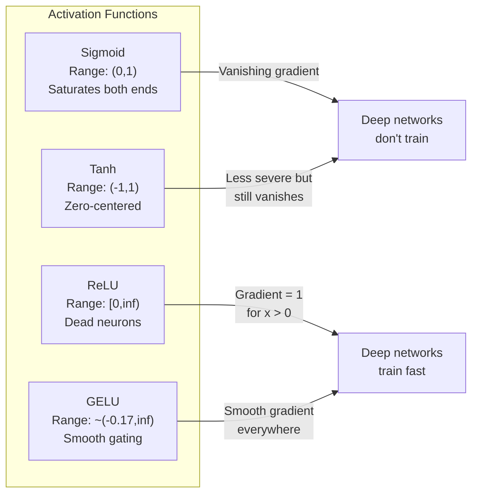
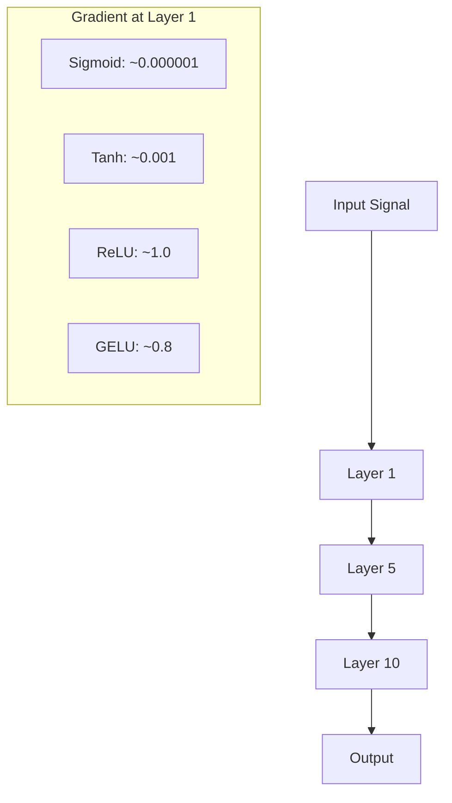
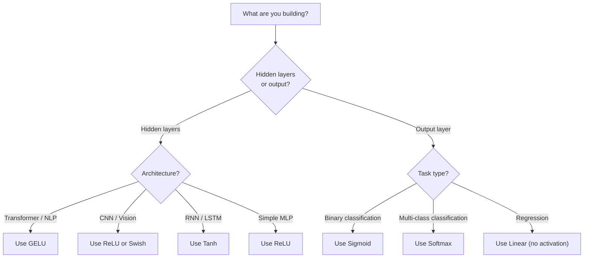

# 激活函数

> Without nonlinearity, your 100-layer network is a simple matrix multiplication. Activations are the mechanisms that enable neural networks to think in curved patterns.

**Type:** Construction
**Language:** Python
**Prerequisites:** Lesson 03.03 (Backpropagation)
**Duration:** ~75 minutes

## 学习目标

- Implement sigmoid, tanh, ReLU, Leaky ReLU, GELU, Swish, and softmax along with their derivatives from scratch.
- Diagnose the vanishing gradient problem by measuring the magnitudes of activations across 10+ layers using different activation functions.
- Identify dead neurons in a ReLU network and explain why GELU avoids this failure mode.
- Select the correct activation function for a given architecture (transformer, CNN, RNN, output layer).

## 问题

堆叠两个线性变换：y = W2(W1x + b1) + b2。展开后得：y = W2W1x + W2b1 + b2，即 y = Ax + c——只是一个线性变换。无论你堆叠多少层线性层，结果都归结为同一个矩阵的乘积。你的100层网络具有与单层相同的表示能力。

这不是理论上的好奇现象。这意味着深度线性网络实际上无法学习XOR运算、无法分类螺旋形数据集、无法识别人脸。如果没有激活函数，深度就只是个幻觉。

激活函数打破了线性性。它们通过非线性函数扭曲每一层的输出，使网络能够弯曲决策边界、近似任意函数并真正进行学习。但选择错误的激活函数会导致梯度变为零（在深度网络中使用Sigmoid函数），或无限增大（没有仔细初始化的无界激活函数），或者神经元永久死亡（带有大负偏置的ReLU函数）。激活函数的选择直接决定了网络是否能够学习。

## 概念

### 为什么非线性是必要的

矩阵乘法是可组合性的。将向量乘以矩阵A后再乘以矩阵B，等同于将其乘以AB。这意味着堆叠十个线性层在数学上相当于使用一个大型矩阵的单个线性层。所有这些参数、所有深度——都是浪费。你需要某种方法来打破这种循环。这就是激活函数的作用。

以下是证明：一个线性层计算f(x) = Wx + b。将两个线性层叠加在一起：

```
Layer 1: h = W1 * x + b1
Layer 2: y = W2 * h + b2
```

替换：

```
y = W2 * (W1 * x + b1) + b2
y = (W2 * W1) * x + (W2 * b1 + b2)
y = A * x + c
```

一层。在层之间插入一个非线性激活函数g()。

```
h = g(W1 * x + b1)
y = W2 * h + b2
```

现在替换过程出现了问题。W2 * g(W1 * x + b1) + b2 无法简化为单一的线性变换。该网络可以表示非线性函数。每增加一层激活函数，都会增加表示能力。

### Sigmoid

神经网络原有的激活函数。

```
sigmoid(x) = 1 / (1 + e^(-x))
```

输出范围：(0, 1)。平滑、可微分，将任何实数映射为类似概率的值。

```
sigmoid'(x) = sigmoid(x) * (1 - sigmoid(x))
```

该导数的最大值为0.25，出现在x=0时。在反向传播过程中，梯度会在各层之间相乘。十个sigmoid层意味着梯度最多会被乘以10次，每次乘以0.25。

```
0.25^10 = 0.000000953674
```

不到原始信号的一百万分之一。这就是消失梯度问题。早期层的梯度变得如此微小，以至于权重几乎无法更新。网络似乎在学习——后期层的损失减少——但前几层被冻结了。深度Sigmoid网络根本无法训练。

另一个问题是：Sigmoid输出始终为正数（0到1），这意味着权重的梯度始终具有相同的符号。这导致梯度下降过程中出现锯齿状变化。

### Tanh

居中版本的Sigmoid函数。

```
tanh(x) = (e^x - e^(-x)) / (e^x + e^(-x))
```

输出范围：(-1, 1)。以零为中心，从而消除锯齿问题。

```
tanh'(x) = 1 - tanh(x)^2
```

在 x = 0 处，最大导数为 1.0——比 Sigmoid 函数好四倍。但梯度消失问题仍然存在。对于较大的正或负输入，导数会接近零。十层网络仍然能很好地处理梯度，只是效果没那么明显了。

### ReLU：突破性的创新

修正线性单元。由Nair和Hinton在2010年推广用于深度学习（该函数本身可以追溯到Fukushima在1969年的研究），它改变了整个领域。

```
relu(x) = max(0, x)
```

输出范围：[0, 无穷大)。导数非常简单：

```
relu'(x) = 1  if x > 0
            0  if x <= 0
```

对于正输入，不存在消失梯度的问题。梯度始终为1，直接通过传输。这就是深度网络能够训练的原因——ReLU保留了各层之间的梯度大小。

但存在一种故障模式：死亡神经元问题。如果神经元的加权输入始终为负（由于较大的负偏置或不幸的权重初始化），其输出始终为零，梯度也始终为零，因此永远不会更新。它永久死亡。实际上，在ReLU网络中，有10-40%的神经元会在训练过程中死亡。

### Leaky ReLU

最简单的死神经元修复方法。

```
leaky_relu(x) = x        if x > 0
                alpha * x if x <= 0
```

其中，alpha是一个小常数，通常为0.01。负侧有一个小的斜率而不是零，因此死亡的神经元仍然会收到梯度信号并能够恢复。

### GELU：现代默认配置

高斯误差线性单位。由Hendrycks和Gimpel在2016年提出。在BERT、GPT以及大多数现代Transformer模型中默认使用此激活函数。

```
gelu(x) = x * Phi(x)
```

其中，Phi(x)为标准正态分布的累积分布函数。实际中使用的近似方法：

```
gelu(x) ~= 0.5 * x * (1 + tanh(sqrt(2/pi) * (x + 0.044715 * x^3)))
```

GELU函数在任何地方都是平滑的，允许较小的负值（与ReLU不同，ReLU会硬切为零），并且具有概率解释：它根据输入值在高斯分布下为正的概率来加权。这种平滑的门控在变换器架构中优于ReLU，因为它提供了更好的梯度流动，并完全避免了死亡神经元的问题。

### Swish / SiLU

Ramachandran等人于2017年通过自动搜索发现了自我准入激活机制。

```
swish(x) = x * sigmoid(x)
```

Swish是一种正式的数学表达式x * sigmoid(x)。谷歌是通过对激活函数空间进行自动搜索发现的——这是一种用于设计神经网络部分的算法。

与GELU类似，Swish具有平滑性、非单调性，并且允许较小的负值。两者的区别很微妙：Swish使用sigmoid函数作为门控机制，而GELU则使用高斯累积分布函数。实际上，它们的性能几乎相同。Swish被用于EfficientNet和一些视觉模型中，而GELU则在语言模型中占据主导地位。

### Softmax: 输出激活函数

未在隐藏层中使用。Softmax将原始分数（逻辑值）向量转换为概率分布。

```
softmax(x_i) = e^(x_i) / sum(e^(x_j) for all j)
```

每个输出值都在0到1之间。所有输出的总和等于1。这使其成为多类分类的标准最终激活函数。最大逻辑值获得最高概率，但与argmax不同，softmax是可微分的，并且保留了关于相对置信度的信息。

### 形状比较



### 梯度流比较



### 哪种激活方式



```figure
softmax-temperature
```

## 构建它

### Step 1: Implementing All Activation Functions with Derivatives

每个函数接收一个浮点数并返回另一个浮点数。每个导数函数接收相同的输入并返回梯度。

```python
import math

def sigmoid(x):
    x = max(-500, min(500, x))
    return 1.0 / (1.0 + math.exp(-x))

def sigmoid_derivative(x):
    s = sigmoid(x)
    return s * (1 - s)

def tanh_act(x):
    return math.tanh(x)

def tanh_derivative(x):
    t = math.tanh(x)
    return 1 - t * t

def relu(x):
    return max(0.0, x)

def relu_derivative(x):
    return 1.0 if x > 0 else 0.0

def leaky_relu(x, alpha=0.01):
    return x if x > 0 else alpha * x

def leaky_relu_derivative(x, alpha=0.01):
    return 1.0 if x > 0 else alpha

def gelu(x):
    return 0.5 * x * (1 + math.tanh(math.sqrt(2 / math.pi) * (x + 0.044715 * x ** 3)))

def gelu_derivative(x):
    phi = 0.5 * (1 + math.erf(x / math.sqrt(2)))
    pdf = math.exp(-0.5 * x * x) / math.sqrt(2 * math.pi)
    return phi + x * pdf

def swish(x):
    return x * sigmoid(x)

def swish_derivative(x):
    s = sigmoid(x)
    return s + x * s * (1 - s)

def softmax(xs):
    max_x = max(xs)
    exps = [math.exp(x - max_x) for x in xs]
    total = sum(exps)
    return [e / total for e in exps]
```

### 步骤2：可视化梯度失效的位置

Calculate the gradient at 100 equally spaced points ranging from -5 to 5. Print a text histogram showing where the gradient of each activation is close to zero.

```python
def gradient_scan(name, derivative_fn, start=-5, end=5, n=100):
    step = (end - start) / n
    near_zero = 0
    healthy = 0
    for i in range(n):
        x = start + i * step
        g = derivative_fn(x)
        if abs(g) < 0.01:
            near_zero += 1
        else:
            healthy += 1
    pct_dead = near_zero / n * 100
    print(f"{name:15s}: {healthy:3d} healthy, {near_zero:3d} near-zero ({pct_dead:.0f}% dead zone)")

gradient_scan("Sigmoid", sigmoid_derivative)
gradient_scan("Tanh", tanh_derivative)
gradient_scan("ReLU", relu_derivative)
gradient_scan("Leaky ReLU", leaky_relu_derivative)
gradient_scan("GELU", gelu_derivative)
gradient_scan("Swish", swish_derivative)
```

### 步骤3：消失梯度实验

Forward-pass a signal through N layers using sigmoid instead of ReLU. Measure how the activation magnitude changes.

```python
import random

def vanishing_gradient_experiment(activation_fn, name, n_layers=10, n_inputs=5):
    random.seed(42)
    values = [random.gauss(0, 1) for _ in range(n_inputs)]

    print(f"\n{name} through {n_layers} layers:")
    for layer in range(n_layers):
        weights = [random.gauss(0, 1) for _ in range(n_inputs)]
        z = sum(w * v for w, v in zip(weights, values))
        activated = activation_fn(z)
        magnitude = abs(activated)
        bar = "#" * int(magnitude * 20)
        print(f"  Layer {layer+1:2d}: magnitude = {magnitude:.6f} {bar}")
        values = [activated] * n_inputs

vanishing_gradient_experiment(sigmoid, "Sigmoid")
vanishing_gradient_experiment(relu, "ReLU")
vanishing_gradient_experiment(gelu, "GELU")
```

### 步骤4：死亡神经元检测器

创建一個ReLU网络，将随机输入通过它，计算有多少个神经元从未激活。

```python
def dead_neuron_detector(n_inputs=5, hidden_size=20, n_samples=1000):
    random.seed(0)
    weights = [[random.gauss(0, 1) for _ in range(n_inputs)] for _ in range(hidden_size)]
    biases = [random.gauss(0, 1) for _ in range(hidden_size)]

    fire_counts = [0] * hidden_size

    for _ in range(n_samples):
        inputs = [random.gauss(0, 1) for _ in range(n_inputs)]
        for neuron_idx in range(hidden_size):
            z = sum(w * x for w, x in zip(weights[neuron_idx], inputs)) + biases[neuron_idx]
            if relu(z) > 0:
                fire_counts[neuron_idx] += 1

    dead = sum(1 for c in fire_counts if c == 0)
    rarely_fire = sum(1 for c in fire_counts if 0 < c < n_samples * 0.05)
    healthy = hidden_size - dead - rarely_fire

    print(f"\nDead Neuron Report ({hidden_size} neurons, {n_samples} samples):")
    print(f"  Dead (never fired):     {dead}")
    print(f"  Barely alive (<5%):     {rarely_fire}")
    print(f"  Healthy:                {healthy}")
    print(f"  Dead neuron rate:       {dead/hidden_size*100:.1f}%")

    for i, c in enumerate(fire_counts):
        status = "DEAD" if c == 0 else "WEAK" if c < n_samples * 0.05 else "OK"
        bar = "#" * (c * 40 // n_samples)
        print(f"  Neuron {i:2d}: {c:4d}/{n_samples} fires [{status:4s}] {bar}")

dead_neuron_detector()
```

### 步骤5：训练比较——Sigmoid与ReLU与GELU

Train the same two-layer network on the circle dataset (points inside a circle = class 1, outside = class 0) using three different activations methods. Compare the convergence speeds.

```python
def make_circle_data(n=200, seed=42):
    random.seed(seed)
    data = []
    for _ in range(n):
        x = random.uniform(-2, 2)
        y = random.uniform(-2, 2)
        label = 1.0 if x * x + y * y < 1.5 else 0.0
        data.append(([x, y], label))
    return data


class ActivationNetwork:
    def __init__(self, activation_fn, activation_deriv, hidden_size=8, lr=0.1):
        random.seed(0)
        self.act = activation_fn
        self.act_d = activation_deriv
        self.lr = lr
        self.hidden_size = hidden_size

        self.w1 = [[random.gauss(0, 0.5) for _ in range(2)] for _ in range(hidden_size)]
        self.b1 = [0.0] * hidden_size
        self.w2 = [random.gauss(0, 0.5) for _ in range(hidden_size)]
        self.b2 = 0.0

    def forward(self, x):
        self.x = x
        self.z1 = []
        self.h = []
        for i in range(self.hidden_size):
            z = self.w1[i][0] * x[0] + self.w1[i][1] * x[1] + self.b1[i]
            self.z1.append(z)
            self.h.append(self.act(z))

        self.z2 = sum(self.w2[i] * self.h[i] for i in range(self.hidden_size)) + self.b2
        self.out = sigmoid(self.z2)
        return self.out

    def backward(self, target):
        error = self.out - target
        d_out = error * self.out * (1 - self.out)

        for i in range(self.hidden_size):
            d_h = d_out * self.w2[i] * self.act_d(self.z1[i])
            self.w2[i] -= self.lr * d_out * self.h[i]
            for j in range(2):
                self.w1[i][j] -= self.lr * d_h * self.x[j]
            self.b1[i] -= self.lr * d_h
        self.b2 -= self.lr * d_out

    def train(self, data, epochs=200):
        losses = []
        for epoch in range(epochs):
            total_loss = 0
            correct = 0
            for x, y in data:
                pred = self.forward(x)
                self.backward(y)
                total_loss += (pred - y) ** 2
                if (pred >= 0.5) == (y >= 0.5):
                    correct += 1
            avg_loss = total_loss / len(data)
            accuracy = correct / len(data) * 100
            losses.append(avg_loss)
            if epoch % 50 == 0 or epoch == epochs - 1:
                print(f"    Epoch {epoch:3d}: loss={avg_loss:.4f}, accuracy={accuracy:.1f}%")
        return losses


data = make_circle_data()

configs = [
    ("Sigmoid", sigmoid, sigmoid_derivative),
    ("ReLU", relu, relu_derivative),
    ("GELU", gelu, gelu_derivative),
]

results = {}
for name, act_fn, act_d_fn in configs:
    print(f"\n=== Training with {name} ===")
    net = ActivationNetwork(act_fn, act_d_fn, hidden_size=8, lr=0.1)
    losses = net.train(data, epochs=200)
    results[name] = losses

print("\n=== Final Loss Comparison ===")
for name, losses in results.items():
    print(f"  {name:10s}: start={losses[0]:.4f} -> end={losses[-1]:.4f} (improvement: {(1 - losses[-1]/losses[0])*100:.1f}%)")
```

## 使用它

PyTorch提供所有这些功能，既以函数形式也以模块形式提供：

```python
import torch
import torch.nn as nn
import torch.nn.functional as F

x = torch.randn(4, 10)

relu_out = F.relu(x)
gelu_out = F.gelu(x)
sigmoid_out = torch.sigmoid(x)
swish_out = F.silu(x)

logits = torch.randn(4, 5)
probs = F.softmax(logits, dim=1)

model = nn.Sequential(
    nn.Linear(10, 64),
    nn.GELU(),
    nn.Linear(64, 32),
    nn.GELU(),
    nn.Linear(32, 5),
)
```

Transformer中的隐藏层使用GELU函数。CNN中的隐藏层使用ReLU函数。分类任务的输出层使用softmax函数。回归任务的输出层没有特定要求，为线性结构。概率预测的输出层使用sigmoid函数。就这么简单。从这些默认值开始，只有在有证据支持时才进行更改。

RNN和LSTM使用tanh函数作为隐藏状态，使用sigmoid函数作为门控单元，但如果你今天是从零开始构建模型，那么你可能不会使用RNN。如果你的ReLU网络中存在死亡神经元，请改用GELU函数。除非有特殊原因，否则不要使用Leaky ReLU——GELU可以解决死亡神经元的问题并改善梯度流动。

## 发货

本课程将生成以下文件：
- `outputs/prompt-activation-selector.md` -- 一个可复用的提示词，帮助您为任何架构选择正确的激活函数。

## 练习

1. Implement Parametric ReLU (PReLU) where the negative slope alpha is a learnable parameter. Train it on the circle dataset and compare to fixed Leaky ReLU.

2. Run the vanishing gradient experiment with 50 layers instead of 10. Plot the magnitude at each layer for sigmoid, tanh, ReLU, and GELU. At which layer does each activation's signal effectively reach zero?

3. Implement the ELU (Exponential Linear Unit): elu(x) = x if x > 0, alpha * (e^x - 1) if x <= 0. Compare its dead neuron rate to ReLU on the same network.

4. Build a "gradient health monitor" that runs during training: at each epoch, compute the average gradient magnitude at each layer. Print a warning when any layer's gradient drops below 0.001 or exceeds 100.

5. Modify the training comparison to use the XOR dataset from Lesson 01 instead of circles. Which activation converges fastest on XOR? Why does this differ from the circle results?

## | 关键词 | 翻译 |

| 术语 | 人们怎么说 | 实际含义 |
|------|-----------------|----------|
| 激活函数 | “非线性部分” | 应用于每个神经元输出的函数，打破线性关系，使网络能够学习非线性映射 |
| 梯度消失 | “在深度网络中梯度消失” | 当激活函数的导数小于1时，梯度会随层数增加而指数级缩小，导致早期层无法训练 |
| 梯度爆炸 | “梯度膨胀” | 当有效乘数超过1时，梯度会随层数增加而指数级增长，导致训练不稳定 |
| 死亡神经元 | “停止学习的神经元” | 输入永久为负且输出为零的ReLU神经元，产生零输出和零梯度 |
| Sigmoid | “将值挤压到0-1之间” | 逻辑函数1/(1+e^-x)，历史上很重要但会导致深度网络中梯度消失 |
| ReLU | “将负数裁剪为零” | max(0, x)——通过保持梯度幅度使深度学习变得实用化的激活函数 |
| GELU | “变换器激活函数” | 高斯误差线性单元，一种平滑的激活函数，根据输入为正的概率来加权输入 |
| Swish/SiLU | “自门控ReLU” | x * sigmoid(x)，通过自动搜索发现，用于EfficientNet |
| Softmax | “将分数转换为概率” | 将logits向量归一化为概率分布，所有值都在(0,1)之间且总和为1 |
| Leaky ReLU | “不会死亡的ReLU” | max(alpha*x, x)，其中alpha很小（0.01），通过允许小的负梯度防止死亡神经元 |
| 饱和 | “Sigmoid的平坦部分” | 激活函数的导数接近零的区域，阻止梯度流动 |
| Logit | “Softmax之前的原始分数” | 应用Softmax或Sigmoid之前的最终层的未归一化输出 |

## 更多阅读资料

- Nair & Hinton, “Rectified Linear Units Improve Restricted Boltzmann Machines” (2010) — the paper that introduced ReLU and enabled training of deep networks  
- Hendrycks & Gimpel, “Gaussian Error Linear Units (GELUs)” (2016) — introduced the activation function that became the default for transformers  
- Ramachandran et al., “Searching for Activation Functions” (2017) — used automated search to discover Swish, showing that activation design can be automated  
- Glorot & Bengio, “Understanding the difficulty of training deep feedforward neural networks” (2010) — the paper that diagnosed vanishing/exploding gradients and proposed Xavier initialization  
- Goodfellow, Bengio, Courville, “Deep Learning” Chapter 6.3 (https://www.deeplearningbook.org/) — rigorous treatment of hidden units and activation functions
