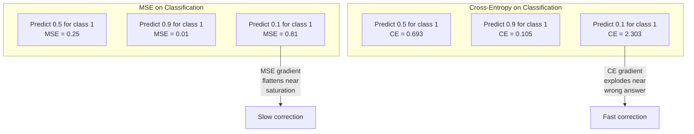
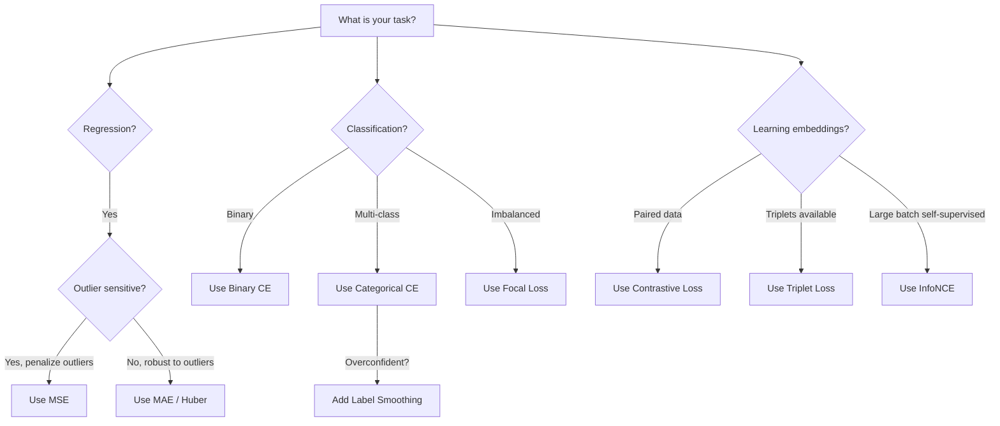
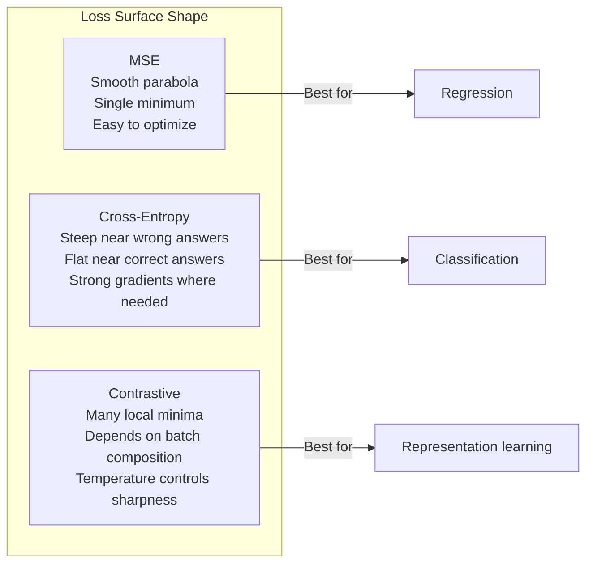

# 损失函数

> 你的网络进行了预测，但实际结果却与此不同。这种错误有多严重？那个数字就是损失值。如果选择了错误的损失函数，模型就会完全优化错误的内容。

**类型：** 构建
**语言：** Python
**先决条件：** 第03.04课（激活函数）
**时间：** 约75分钟

## 学习目标

- Implement MSE, binary cross-entropy, categorical cross-entropy, and contrastive loss (InfoNCE) from scratch using their gradients.
- Explain why MSE fails for classification by demonstrating the "predict 0.5 for everything" failure mode.
- Apply label smoothing to cross-entropy and describe how it prevents overconfident predictions.
- Choose the correct loss function for regression, binary classification, multi-class classification, and embedding learning tasks.

## 问题

在分类问题中，一个最小化均方误差的模型会自信地预测所有样本的类别为0.5。它确实是在最小化损失值，但这实际上是无用的。

损失函数是模型实际优化的唯一因素。不是准确率，不是F1分数，也不是你向经理报告的任何指标。优化器通过获取损失函数的梯度来调整权重，以使该数值更小。如果损失函数未能捕捉到你所关心的信息，模型会找到数学上最便宜的方式来满足它，而这种方式几乎永远不会是你期望的结果。

这里有一个具体的例子。你有一个二分类任务，两个类别的概率分布为50/50。你使用均方误差作为损失函数。模型对每一个输入都预测0.5。平均均方误差为0.25，这是在没有真正学习到任何信息的情况下可能达到的最小值。该模型没有区分能力，但技术上它确实最小化了你的损失函数。如果改用交叉熵损失函数，同样的模型将被迫将预测值推向0或1，因为-log(0.5) = 0.693是一个糟糕的损失，而-log(0.99) = 0.01则奖励自信的正确预测。损失函数的选择决定了模型是学习型的还是玩弄指标的。

情况更糟的是，在自监督学习中，你甚至没有标签。对比损失完全定义了学习的信号：什么算相似，什么算不同，以及模型应该如何将它们区分开。如果对比损失判断错误，你的嵌入向量会崩溃为一点——每个输入都映射到同一个向量上。从技术上讲，这是零损失。完全毫无价值。

## 概念

### 均方误差 (MSE)

回归的默认方法。计算预测值与目标值之间的平方差异，并对所有样本进行平均。

```
MSE = (1/n) * sum((y_pred - y_true)^2)
```

为什么平方效应很重要：它会对较大的错误进行二次惩罚。2的误差成本是1的误差成本的4倍，而10的误差成本则是100的误差成本。这使得均方误差对异常值非常敏感——一个极错的预测就会主导整体的损失。

实数情况：如果你的模型预测房价，对于大多数房屋来说误差为10,000美元，但对于一座豪宅来说误差却达到200,000美元，那么均方误差会积极尝试修正那座豪宅的误差，这可能会损害其他99座房屋的预测性能。

均方误差对预测的梯度为：

```
dMSE/dy_pred = (2/n) * (y_pred - y_true)
```

The error increases linearly. Larger errors result in larger gradients. This is a feature for regression (larger errors require larger corrections) and a bug for classification (you want to penalize confident wrong answers exponentially, not linearly).

### 交叉熵损失

分类的损失函数。基于信息论，它衡量预测概率分布与真实分布之间的差异。

**二元交叉熵（BCE）：**

```
BCE = -(y * log(p) + (1 - y) * log(1 - p))
```

其中 y 是真实标签（0或1），p 是预测概率。

为什么 -log(p) 有效：当真实标签为1且预测 p = 0.99时，损失为 -log(0.99) = 0.01。当预测 p = 0.01时，损失为 -log(0.01) = 4.6。这种460倍的差异就是交叉熵有效的原因。它严厉惩罚自信的错误预测，而对自信的正确预测几乎不施加惩罚。

梯度也讲述了同样的故事：

```
dBCE/dp = -(y/p) + (1-y)/(1-p)
```

当 y = 1 且 p 接近零时，梯度为 -1/p，趋近于负无穷。模型接收到巨大的信号来纠正其错误。当 p 接近 1 时，梯度非常小。此时已经正确，无需修正。

**分类交叉熵：**

适用于具有独热编码目标的多类分类问题。

```
CCE = -sum(y_i * log(p_i))
```

Only the true class contributes to the loss (because all other y_i are zero). If there are 10 classes and the correct class gets probability 0.1 (random guessing), the loss is -log(0.1) = 2.3. If the correct class gets probability 0.9, the loss is -log(0.9) = 0.105. The model learns to concentrate probability mass on the right answer.

### 为什么MSE在分类任务中表现不佳



当预测值接近0或1时（由于Sigmoid函数的饱和），MSE梯度会变得平坦。交叉熵梯度可以弥补这一点——-log函数可以消除Sigmoid函数的平坦区域，从而在最需要的地方产生强烈的梯度。

### 标签平滑

标准的一热标签表示“这百分之百属于类别3，其他所有类别占0%”。这是一个强烈的断言。标签平滑处理则使其变得柔和：

```
smooth_label = (1 - alpha) * one_hot + alpha / num_classes
```

在alpha为0.1且包含10个类别的情况下，目标值不再是[0, 0, 1, 0, ...]，而是变为[0.01, 0.01, 0.91, 0.01, ...]。模型的目标值为0.91而非1.0。

原因在于：通过softmax输出精确为1.0的模型的logits需要无限增大，这会导致过度自信、影响泛化能力，并使模型对分布变化非常敏感。标签平滑将目标值限制在0.9（当alpha为0.1时），从而将logits保持在合理范围内。GPT及大多数现代模型都使用标签平滑或其等效方法。

### 对比损失

无标签。无类别。仅包含输入对和问题：这些相似还是不同？

**SimCLR风格对比损失（NT-Xent / InfoNCE）：**

取一张图片。创建它的两个增强视图（裁剪、旋转、颜色抖动）。这些是“正样本对”——它们的嵌入应该相似。批次中的其他图片构成“负样本对”——它们的嵌入应该不同。

```
L = -log(exp(sim(z_i, z_j) / tau) / sum(exp(sim(z_i, z_k) / tau)))
```

其中，sim()表示余弦相似度，z_i和z_j分别表示正样本对，求和是对所有负样本进行的，而tau（温度）控制着分布的尖锐程度。温度越低，负样本越多，分离效果就越强烈。

实数：批量大小256意味着每对正样本有255个负样本。温度tau为0.07（SimCLR默认值）。损失函数看起来像是一个基于相似度的softmax函数——它希望正样本对的相似度在所有256种可能性中最高。

**三元组损失：**  
接受三个输入：锚样本、正样本（同一类别）、负样本（不同类别）。

```
L = max(0, d(anchor, positive) - d(anchor, negative) + margin)
```

边缘值（通常为0.2-1.0）确保了正负距离之间的最小间隔。如果负值已经足够远，则损失为零——没有梯度，也没有更新。这使得训练过程高效，但需要仔细进行三元组挖掘（选择接近锚点的强负例）。

### Focal Loss

对于不平衡的数据集，标准交叉熵会平等对待所有正确分类的示例。焦点损失则会降低简单示例的重要性：

```
FL = -alpha * (1 - p_t)^gamma * log(p_t)
```

其中，p_t是真实类别的预测概率，gamma控制着聚焦效果。当gamma=0时，这是标准的交叉熵。当gamma=2（默认值时）：

- 简单示例（p_t=0.9）：权重=(0.1)^2=0.01。几乎被忽略。
- 困难示例（p_t=0.1）：权重=(0.9)^2=0.81。完整的梯度信号。

Focal损失是由Lin等人引入的，用于物体检测，其中99%的候选区域是背景（简单的负例）。如果没有Focal损失，模型会被简单背景示例淹没，永远无法学会检测物体。有了它，模型会将能力集中在重要的困难、模糊情况下。

### 损失函数决策树



### 损失景观



```figure
cross-entropy-loss
```

## 构建它

### 步骤1：均方误差及其梯度

```python
def mse(predictions, targets):
    n = len(predictions)
    total = 0.0
    for p, t in zip(predictions, targets):
        total += (p - t) ** 2
    return total / n

def mse_gradient(predictions, targets):
    n = len(predictions)
    grads = []
    for p, t in zip(predictions, targets):
        grads.append(2.0 * (p - t) / n)
    return grads
```

### 步骤2：二进制交叉熵

Log(0)问题确实存在。如果模型对正样本预测结果为0，那么log(0)等于负无穷大。裁剪操作可以防止这种情况发生。

```python
import math

def binary_cross_entropy(predictions, targets, eps=1e-15):
    n = len(predictions)
    total = 0.0
    for p, t in zip(predictions, targets):
        p_clipped = max(eps, min(1 - eps, p))
        total += -(t * math.log(p_clipped) + (1 - t) * math.log(1 - p_clipped))
    return total / n

def bce_gradient(predictions, targets, eps=1e-15):
    grads = []
    for p, t in zip(predictions, targets):
        p_clipped = max(eps, min(1 - eps, p))
        grads.append(-(t / p_clipped) + (1 - t) / (1 - p_clipped))
    return grads
```

### 步骤3：使用Softmax算法进行分类交叉熵损失计算

Softmax将原始逻辑值转换为概率。然后我们计算与独热目标对应的交叉熵。

```python
def softmax(logits):
    max_val = max(logits)
    exps = [math.exp(x - max_val) for x in logits]
    total = sum(exps)
    return [e / total for e in exps]

def categorical_cross_entropy(logits, target_index, eps=1e-15):
    probs = softmax(logits)
    p = max(eps, probs[target_index])
    return -math.log(p)

def cce_gradient(logits, target_index):
    probs = softmax(logits)
    grads = list(probs)
    grads[target_index] -= 1.0
    return grads
```

softmax与交叉熵的梯度表达式非常简洁：对于真实类别，它是（预测概率 - 1），而对于所有其他类别，它是（预测概率）。这种简洁的表达并非偶然——这就是softmax和交叉熵被结合使用的理由。

### 步骤4：标签平滑处理

```python
def label_smoothed_cce(logits, target_index, num_classes, alpha=0.1, eps=1e-15):
    probs = softmax(logits)
    loss = 0.0
    for i in range(num_classes):
        if i == target_index:
            smooth_target = 1.0 - alpha + alpha / num_classes
        else:
            smooth_target = alpha / num_classes
        p = max(eps, probs[i])
        loss += -smooth_target * math.log(p)
    return loss
```

### 步骤5：对比损失（简化版InfoNCE）

```python
def cosine_similarity(a, b):
    dot = sum(x * y for x, y in zip(a, b))
    norm_a = math.sqrt(sum(x * x for x in a))
    norm_b = math.sqrt(sum(x * x for x in b))
    if norm_a < 1e-10 or norm_b < 1e-10:
        return 0.0
    return dot / (norm_a * norm_b)

def contrastive_loss(anchor, positive, negatives, temperature=0.07):
    sim_pos = cosine_similarity(anchor, positive) / temperature
    sim_negs = [cosine_similarity(anchor, neg) / temperature for neg in negatives]

    max_sim = max(sim_pos, max(sim_negs)) if sim_negs else sim_pos
    exp_pos = math.exp(sim_pos - max_sim)
    exp_negs = [math.exp(s - max_sim) for s in sim_negs]
    total_exp = exp_pos + sum(exp_negs)

    return -math.log(max(1e-15, exp_pos / total_exp))
```

### 步骤6：分类任务中的均方误差与交叉熵损失比较

Use the same network from Lesson 04 (circle dataset) with both loss functions. Observe that the cross-entropy loss converges faster.

```python
import random

def sigmoid(x):
    x = max(-500, min(500, x))
    return 1.0 / (1.0 + math.exp(-x))

def make_circle_data(n=200, seed=42):
    random.seed(seed)
    data = []
    for _ in range(n):
        x = random.uniform(-2, 2)
        y = random.uniform(-2, 2)
        label = 1.0 if x * x + y * y < 1.5 else 0.0
        data.append(([x, y], label))
    return data


class LossComparisonNetwork:
    def __init__(self, loss_type="bce", hidden_size=8, lr=0.1):
        random.seed(0)
        self.loss_type = loss_type
        self.lr = lr
        self.hidden_size = hidden_size

        self.w1 = [[random.gauss(0, 0.5) for _ in range(2)] for _ in range(hidden_size)]
        self.b1 = [0.0] * hidden_size
        self.w2 = [random.gauss(0, 0.5) for _ in range(hidden_size)]
        self.b2 = 0.0

    def forward(self, x):
        self.x = x
        self.z1 = []
        self.h = []
        for i in range(self.hidden_size):
            z = self.w1[i][0] * x[0] + self.w1[i][1] * x[1] + self.b1[i]
            self.z1.append(z)
            self.h.append(max(0.0, z))

        self.z2 = sum(self.w2[i] * self.h[i] for i in range(self.hidden_size)) + self.b2
        self.out = sigmoid(self.z2)
        return self.out

    def backward(self, target):
        if self.loss_type == "mse":
            d_loss = 2.0 * (self.out - target)
        else:
            eps = 1e-15
            p = max(eps, min(1 - eps, self.out))
            d_loss = -(target / p) + (1 - target) / (1 - p)

        d_sigmoid = self.out * (1 - self.out)
        d_out = d_loss * d_sigmoid

        for i in range(self.hidden_size):
            d_relu = 1.0 if self.z1[i] > 0 else 0.0
            d_h = d_out * self.w2[i] * d_relu
            self.w2[i] -= self.lr * d_out * self.h[i]
            for j in range(2):
                self.w1[i][j] -= self.lr * d_h * self.x[j]
            self.b1[i] -= self.lr * d_h
        self.b2 -= self.lr * d_out

    def compute_loss(self, pred, target):
        if self.loss_type == "mse":
            return (pred - target) ** 2
        else:
            eps = 1e-15
            p = max(eps, min(1 - eps, pred))
            return -(target * math.log(p) + (1 - target) * math.log(1 - p))

    def train(self, data, epochs=200):
        losses = []
        for epoch in range(epochs):
            total_loss = 0.0
            correct = 0
            for x, y in data:
                pred = self.forward(x)
                self.backward(y)
                total_loss += self.compute_loss(pred, y)
                if (pred >= 0.5) == (y >= 0.5):
                    correct += 1
            avg_loss = total_loss / len(data)
            accuracy = correct / len(data) * 100
            losses.append((avg_loss, accuracy))
            if epoch % 50 == 0 or epoch == epochs - 1:
                print(f"    Epoch {epoch:3d}: loss={avg_loss:.4f}, accuracy={accuracy:.1f}%")
        return losses
```

## 使用它

PyTorch提供了所有标准损失函数，并内置了数值稳定性。

```python
import torch
import torch.nn as nn
import torch.nn.functional as F

predictions = torch.tensor([0.9, 0.1, 0.7], requires_grad=True)
targets = torch.tensor([1.0, 0.0, 1.0])

mse_loss = F.mse_loss(predictions, targets)
bce_loss = F.binary_cross_entropy(predictions, targets)

logits = torch.randn(4, 10)
labels = torch.tensor([3, 7, 1, 9])
ce_loss = F.cross_entropy(logits, labels)
ce_smooth = F.cross_entropy(logits, labels, label_smoothing=0.1)
```

使用 `F.cross_entropy`（而不是 `F.nll_loss` 加上手动的 softmax）。它将 log-softmax 和负对数似然合并为一个数值稳定的操作。单独应用 softmax 然后取对数则稳定性较差——在减去大的指数时会导致精度损失。

对于对比学习，大多数团队使用自定义实现或如 `lightly` 或 `pytorch-metric-learning` 这样的库。核心循环始终相同：计算成对相似性，对正面和负面结果创建 softmax，进行反向传播。

## 发货

本课程将生成以下文件：
- `outputs/prompt-loss-function-selector.md` —— 用于选择正确损失函数的可复用提示词
- `outputs/prompt-loss-debugger.md` —— 用于在损失曲线出现异常时的诊断提示词

## 练习

1. Implement Huber loss (smooth L1 loss), which is MSE for small errors and MAE for large errors. Train a regression network predicting y = sin(x) with MSE vs Huber when 5% of training targets have random noise added (outliers). Compare the final test error.

2. Add focal loss to the binary classification training loop. Create an imbalanced dataset (90% class 0, 10% class 1). Compare standard BCE vs focal loss (gamma=2) on the minority class recall after 200 epochs.

3. Implement triplet loss with semi-hard negative mining. Generate 2D embedding data for 5 classes. For each anchor, find the hardest negative that is still farther than the positive (semi-hard). Compare the convergence of this method with random triplet selection.

4. Run the comparison between MSE and cross-entropy but track the magnitude of gradients at each layer during training. Plot the average gradient norm per epoch. Verify that cross-entropy produces larger gradients in early epochs when the model is most uncertain.

5. Implement KL divergence loss and verify that minimizing KL(true || predicted) yields the same gradients as cross-entropy when the true distribution is one-hot. Then try soft targets (such as knowledge distillation), where the "true" distribution is derived from the teacher model's softmax output.

## | 关键词 | 翻译 |

| 术语 | 人们怎么说 | 实际含义 |
|------|------------|----------|
| 损失函数 | “模型的错误程度” | 一个可微函数，将预测值和目标值映射到一个标量，优化器会最小化该标量 |
| MSE | “平均平方误差” | 预测值与目标值之间差异的平方的平均值；对较大错误进行二次惩罚 |
| 交叉熵 | “分类损失” | 使用 -log(p) 衡量预测概率分布与真实分布之间的偏差 |
| 二元交叉熵 | “BCE” | 两类的交叉熵：-(y*log(p) + (1-y)*log(1-p)) |
| 标签平滑 | “软化目标值” | 用软值（例如，0.1/0.9）替换硬性的 0/1 目标值，以防止过度自信并提高泛化能力 |
| 对比损失 | “拉近相似对，推开不相似对” | 一种通过使相似对靠近、不相似对远离嵌入空间来学习表示损失的损失函数 |
| InfoNCE | “CLIP/SimCLR 损失” | 基于相似性得分的归一化温度缩放交叉熵；将对比学习视为分类任务 |
| 焦点损失 | “不平衡数据修复” | 按 (1-p_t)^gamma 加权交叉熵，以降低简单示例的重要性并关注困难示例 |
| 三元组损失 | “锚点-正例-负例” | 在嵌入空间中将锚点至少比负例更接近正例 |
| 温度 | “锐度旋钮” | 对逻辑标签/相似性进行控制的标量除数，决定最终分布的尖锐程度；数值越低，分布越尖锐 |

## 更多阅读资料

- Lin et al., “Focal Loss for Dense Object Detection” (2017) -- introduced focal loss to handle extreme class imbalance in object detection (RetinaNet)
- Chen et al., “A Simple Framework for Contrastive Learning of Visual Representations” (SimCLR, 2020) -- defined the modern contrastive learning pipeline with NT-Xent loss
- Szegedy et al., “Rethinking the Inception Architecture” (2016) -- introduced label smoothing as a regularization technique, now standard in most large models
- Hinton et al., “Distilling the Knowledge in a Neural Network” (2015) -- knowledge distillation using soft targets and KL divergence, foundational for model compression
